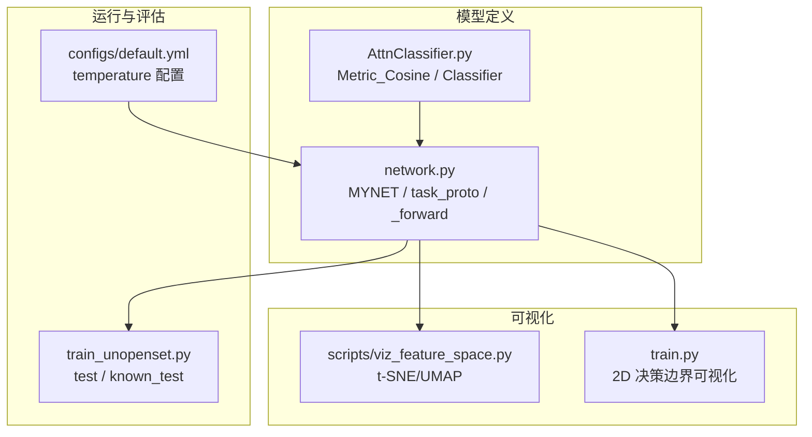
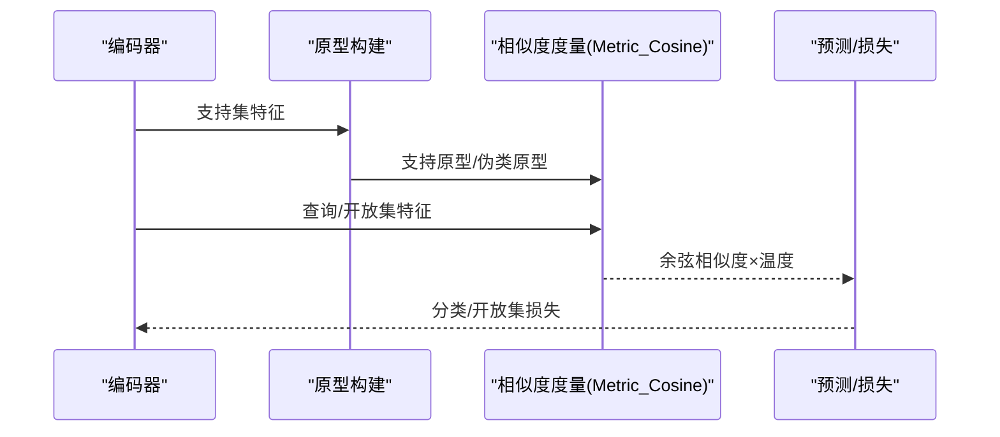
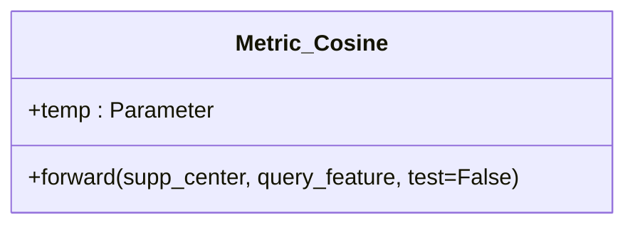
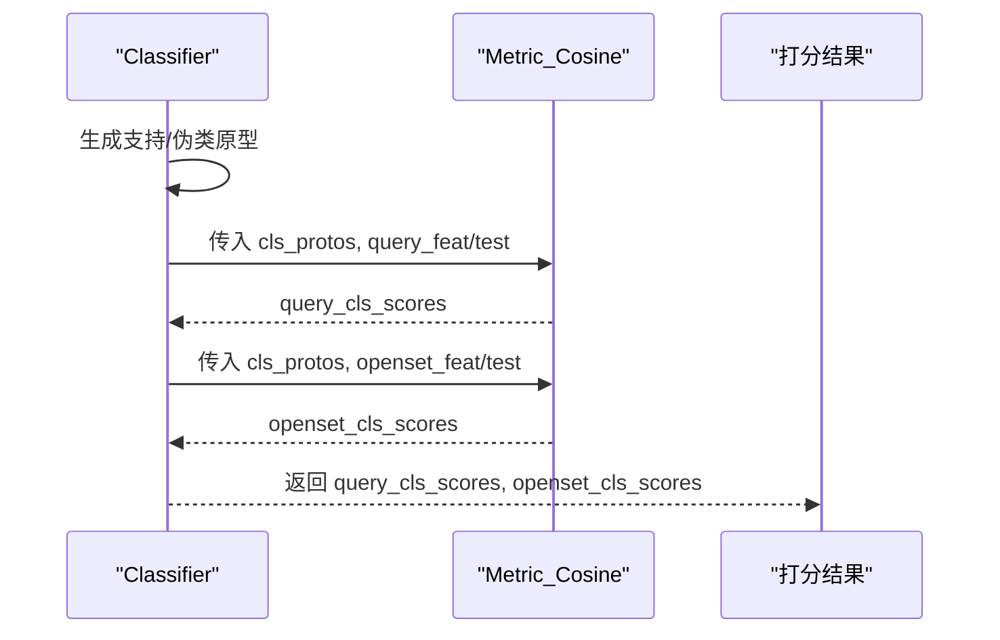
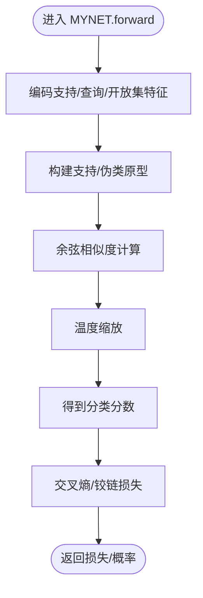
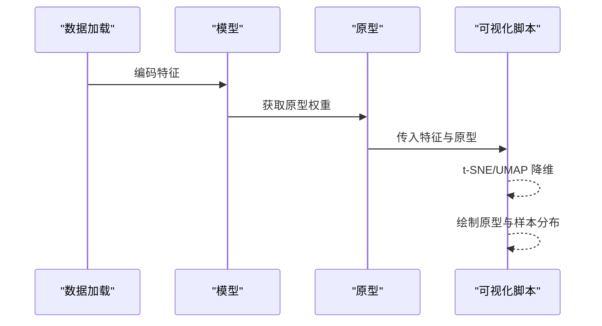
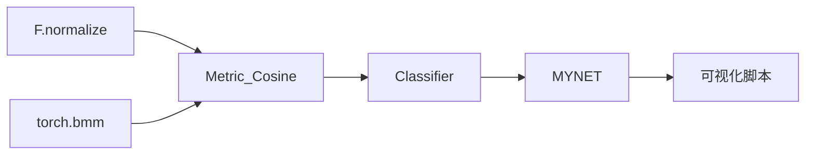

# 相似度计算与度量

<cite>
**本文引用的文件**
- [models/AttnClassifier.py](file://models/AttnClassifier.py)
- [network.py](file://network.py)
- [train_unopenset.py](file://train_unopenset.py)
- [configs/default.yml](file://configs/default.yml)
- [scripts/viz_feature_space.py](file://scripts/viz_feature_space.py)
- [train.py](file://train.py)
- [utils/utils.py](file://utils/utils.py)
</cite>

## 目录
1. [简介](#简介)
2. [项目结构](#项目结构)
3. [核心组件](#核心组件)
4. [架构总览](#架构总览)
5. [详细组件分析](#详细组件分析)
6. [依赖分析](#依赖分析)
7. [性能考虑](#性能考虑)
8. [故障排查指南](#故障排查指南)
9. [结论](#结论)
10. [附录](#附录)

## 简介
本文件围绕 VAZE 系统的相似度计算与度量机制展开，重点解析 Metric_Cosine 类的余弦相似度实现、特征归一化与温度缩放的作用机理，以及训练与测试阶段在相似度计算上的差异与原因。同时，结合项目中的原型学习流程，说明相似度度量在少样本学习中的优势、后处理策略（温度参数与阈值）、以及可视化与决策边界分析的技术实现。

## 项目结构
VAZE 的相似度相关逻辑主要分布在以下模块：
- 余弦度量与分类器：models/AttnClassifier.py 中的 Metric_Cosine 与 Classifier
- 主干网络与任务流程：network.py 中的 MYNET、task_proto、_forward 等
- 测试与评估：train_unopenset.py 中的 known_test、test 等
- 温度参数配置：configs/default.yml
- 可视化与特征空间：scripts/viz_feature_space.py、train.py 中的决策边界绘制
- 工具函数：utils/utils.py 中的计分与评估辅助

**图表来源**
- [models/AttnClassifier.py:352-368](file://models/AttnClassifier.py#L352-L368)
- [network.py:102-151](file://network.py#L102-L151)
- [network.py:225-255](file://network.py#L225-L255)
- [train_unopenset.py:452-502](file://train_unopenset.py#L452-L502)
- [configs/default.yml:42-45](file://configs/default.yml#L42-L45)
- [scripts/viz_feature_space.py:83-108](file://scripts/viz_feature_space.py#L83-L108)
- [train.py:390-416](file://train.py#L390-L416)

**章节来源**
- [models/AttnClassifier.py:352-368](file://models/AttnClassifier.py#L352-L368)
- [network.py:102-151](file://network.py#L102-L151)
- [network.py:225-255](file://network.py#L225-L255)
- [train_unopenset.py:452-502](file://train_unopenset.py#L452-L502)
- [configs/default.yml:42-45](file://configs/default.yml#L42-L45)
- [scripts/viz_feature_space.py:83-108](file://scripts/viz_feature_space.py#L83-L108)
- [train.py:390-416](file://train.py#L390-L416)

## 核心组件
- Metric_Cosine：实现余弦相似度的度量模块，包含特征归一化与温度缩放，支持训练与测试两种转置策略。
- Classifier：封装支持/伪类原型生成与相似度打分，调用 Metric_Cosine 完成查询样本与原型的相似度计算。
- MYNET：主干网络，负责编码、原型构建、相似度打分与损失计算，贯穿训练与测试流程。
- 配置项 temperature：控制余弦相似度的温度缩放参数，影响分类边界锐利程度与可分离性。

**章节来源**
- [models/AttnClassifier.py:352-368](file://models/AttnClassifier.py#L352-L368)
- [models/AttnClassifier.py:47-93](file://models/AttnClassifier.py#L47-L93)
- [network.py:102-151](file://network.py#L102-L151)
- [network.py:225-255](file://network.py#L225-L255)
- [configs/default.yml:42-45](file://configs/default.yml#L42-L45)

## 架构总览
VAZE 的相似度度量贯穿“编码—原型—相似度—预测”的主线流程。训练阶段通过支持集特征计算原型，结合伪类原型与开放集样本，使用 Metric_Cosine 计算相似度并配合交叉熵与铰链损失优化；测试阶段直接使用模型权重作为原型，对查询与开放集样本进行相似度打分。

**图表来源**
- [models/AttnClassifier.py:47-93](file://models/AttnClassifier.py#L47-L93)
- [models/AttnClassifier.py:352-368](file://models/AttnClassifier.py#L352-L368)
- [network.py:102-151](file://network.py#L102-L151)

## 详细组件分析

### Metric_Cosine 类详解
- 功能定位：对查询特征与原型进行余弦相似度计算，并乘以温度参数，形成可学习的打分尺度。
- 归一化策略：对原型与查询特征分别沿特征维进行 L2 归一化，使余弦相似度等价于点积，提升数值稳定性与可分离性。
- 温度缩放：通过可学习参数 temp 控制相似度分布的锐利程度，提高类别间判别力。
- 训练与测试差异：
  - 训练时：query_feature.unsqueeze(0) 与 supp_center.transpose(1,2) 相乘，得到 [B, N_query_way, N_proto] 的分数矩阵。
  - 测试时：对 supp_center 进行 transpose(0,1).transpose(1,2) 转置，适配测试场景的批维与类维组织方式。
- 数学原理：余弦相似度 cosθ = (u·v)/(||u||·||v||)，经 L2 归一化后简化为 u·v；再乘以温度 t，得到 logits = t·cosθ。

**图表来源**
- [models/AttnClassifier.py:352-368](file://models/AttnClassifier.py#L352-L368)

**章节来源**
- [models/AttnClassifier.py:352-368](file://models/AttnClassifier.py#L352-L368)

### Classifier 与原型相似度打分
- 支持原型与伪类原型：通过 SupportCalibrator 与 OpenSetGenerater 生成正/负原型集合，合并为 cls_protos。
- 相似度打分：调用 Metric_Cosine 对 query 与 cls_protos、openset 与 cls_protos 分别打分，得到 query_cls_scores 与 openset_cls_scores。
- 测试路径：incre_forward 中对新增特征进行相似度打分，便于增量场景下的快速推理。

**图表来源**
- [models/AttnClassifier.py:47-93](file://models/AttnClassifier.py#L47-L93)
- [models/AttnClassifier.py:352-368](file://models/AttnClassifier.py#L352-L368)

**章节来源**
- [models/AttnClassifier.py:47-93](file://models/AttnClassifier.py#L47-L93)

### MYNET 的相似度流程与温度参数
- 任务原型与打分：task_proto 调用 Classifier 生成支持/伪类原型并打分；随后拼接分数并使用动态标签计算交叉熵损失。
- 温度参数来源：_forward 中直接使用 args.network.temperature 对余弦相似度进行缩放，体现温度对分类边界的调节作用。
- 开放集与铰链损失：通过 pair_dist 与 hinge margin 控制伪类原型与支持原型之间的距离，增强判别能力。

**图表来源**
- [network.py:102-151](file://network.py#L102-L151)
- [network.py:225-255](file://network.py#L225-L255)

**章节来源**
- [network.py:102-151](file://network.py#L102-L151)
- [network.py:225-255](file://network.py#L225-L255)

### 训练与测试阶段的差异
- 训练阶段：使用 Metric_Cosine 的训练转置策略，query 与 supp_center 的类维/批维组织方式适配训练批内结构。
- 测试阶段：使用测试转置策略，适配测试时的原型/查询组织方式，保证打分矩阵维度正确。
- 语义一致性：两者均先对特征与原型进行归一化，再进行相似度计算与温度缩放，确保相似度可比性。

**章节来源**
- [models/AttnClassifier.py:357-367](file://models/AttnClassifier.py#L357-L367)

### 温度参数与分类边界
- 温度 t 的作用：增大 t 使相似度分布更尖锐，提升类别间的区分度；减小 t 使分布更平滑，有利于鲁棒性。
- 配置入口：configs/default.yml 中 network.temperature 默认为 1，可在训练中作为超参或自适应策略的一部分。
- 实践建议：在验证集上对温度进行网格搜索或基于校准曲线的自适应调整。

**章节来源**
- [configs/default.yml:42-45](file://configs/default.yml#L42-L45)
- [network.py:253-254](file://network.py#L253-L254)

### 少样本学习中的原型相似度
- 原型构建：支持集特征按类别求平均得到支持原型；伪类原型由开放集生成器构造，形成正/负对比。
- 相似度决策：查询样本与两类原型集合分别计算相似度，选择最高分类别作为预测；开放集样本可通过阈值或额外判据识别未知类。
- 优势：无需复杂神经网络分支即可实现强判别力，适合少样本与增量场景。

**章节来源**
- [models/AttnClassifier.py:47-93](file://models/AttnClassifier.py#L47-L93)
- [network.py:153-200](file://network.py#L153-L200)

### 相似度后处理与阈值策略
- 温度自适应：可在验证阶段基于校准曲线或最小化交叉熵对温度进行微调。
- 阈值设定：对开放集样本的最高相似度低于阈值的样本标记为未知；阈值可通过验证集 F1 最优或 ROC 曲线确定。
- 工具函数：utils/utils.py 提供计分与评估辅助，可用于阈值选择与指标统计。

**章节来源**
- [utils/utils.py:383-409](file://utils/utils.py#L383-L409)

### 相似度可视化与决策边界分析
- 特征空间可视化：scripts/viz_feature_space.py 使用 t-SNE/UMAP 对特征与原型进行降维可视化，观察原型漂移与聚类结构。
- 决策边界：train.py 展示了在二维特征空间上通过余弦相似度绘制决策边界的流程，便于直观理解原型学习的分类机制。

**图表来源**
- [scripts/viz_feature_space.py:83-108](file://scripts/viz_feature_space.py#L83-L108)
- [train.py:390-416](file://train.py#L390-L416)

**章节来源**
- [scripts/viz_feature_space.py:83-108](file://scripts/viz_feature_space.py#L83-L108)
- [train.py:390-416](file://train.py#L390-L416)

## 依赖分析
- Metric_Cosine 依赖 torch.nn.functional 的归一化与张量运算，以及 torch.bmm 进行批量矩阵乘法。
- Classifier 依赖 Metric_Cosine 与原型生成模块，完成正/负原型的构建与打分。
- MYNET 依赖 Classifier 与配置项 temperature，串联编码、原型、相似度与损失计算。
- 可视化脚本依赖 sklearn 的 t-SNE 与 matplotlib 进行特征空间展示。

**图表来源**
- [models/AttnClassifier.py:352-368](file://models/AttnClassifier.py#L352-L368)
- [models/AttnClassifier.py:47-93](file://models/AttnClassifier.py#L47-L93)
- [network.py:102-151](file://network.py#L102-L151)
- [scripts/viz_feature_space.py:83-108](file://scripts/viz_feature_space.py#L83-L108)

**章节来源**
- [models/AttnClassifier.py:352-368](file://models/AttnClassifier.py#L352-L368)
- [models/AttnClassifier.py:47-93](file://models/AttnClassifier.py#L47-L93)
- [network.py:102-151](file://network.py#L102-L151)
- [scripts/viz_feature_space.py:83-108](file://scripts/viz_feature_space.py#L83-L108)

## 性能考虑
- 归一化开销：对高维特征进行 L2 归一化与批量矩阵乘法在 GPU 上具备良好并行性，整体开销可控。
- 温度参数：较大的温度会放大数值差异，需注意梯度饱和风险；较小温度有助于稳定训练。
- 转置策略：训练与测试阶段的转置差异需严格匹配批维/类维组织，避免维度错误导致的性能退化。
- 可视化成本：t-SNE/UMAP 降维在大数据集上计算量较大，建议采样或分批处理。

## 故障排查指南
- 维度不匹配：若相似度打分矩阵维度异常，检查 Metric_Cosine 的转置策略是否与输入组织一致。
- 温度过低/过高：过低导致类别难以区分，过高可能导致过拟合；建议在验证集上进行温度搜索。
- 原型漂移：关注 base-class 原型随会话变化的漂移趋势，必要时引入原型更新策略或正则约束。
- 测试精度异常：确认测试阶段使用测试转置策略，且温度参数与训练一致。

**章节来源**
- [models/AttnClassifier.py:357-367](file://models/AttnClassifier.py#L357-L367)
- [network.py:134-146](file://network.py#L134-L146)
- [scripts/viz_feature_space.py:111-128](file://scripts/viz_feature_space.py#L111-L128)

## 结论
VAZE 的相似度度量以 Metric_Cosine 为核心，结合特征归一化与温度缩放，在训练与测试阶段采用差异化的转置策略，实现了稳定的原型相似度计算。通过支持/伪类原型的对比，系统在少样本与增量场景下具备良好的判别能力。配合阈值与温度后处理策略，以及 t-SNE/UMAP 与决策边界可视化，能够有效理解原型学习的分类机制与边界特性。

## 附录
- 温度参数默认值与配置入口：configs/default.yml 中 network.temperature。
- 测试阶段相似度打分示例：train_unopenset.py 中 known_test/test 的 F.cosine_similarity 使用。
- 特征空间可视化：scripts/viz_feature_space.py 的 t-SNE/UMAP 降维与原型绘制。
- 决策边界可视化：train.py 中对网格点的余弦相似度打分与分类图绘制。

**章节来源**
- [configs/default.yml:42-45](file://configs/default.yml#L42-L45)
- [train_unopenset.py:452-502](file://train_unopenset.py#L452-L502)
- [scripts/viz_feature_space.py:83-108](file://scripts/viz_feature_space.py#L83-L108)
- [train.py:390-416](file://train.py#L390-L416)