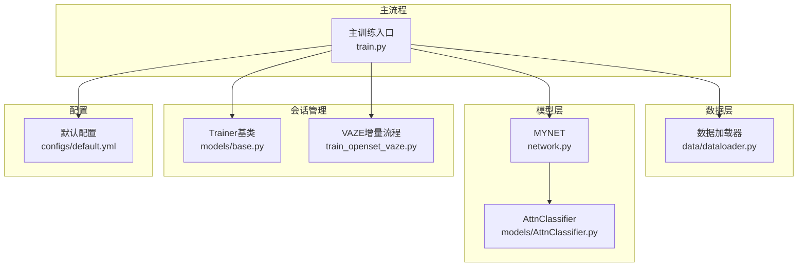
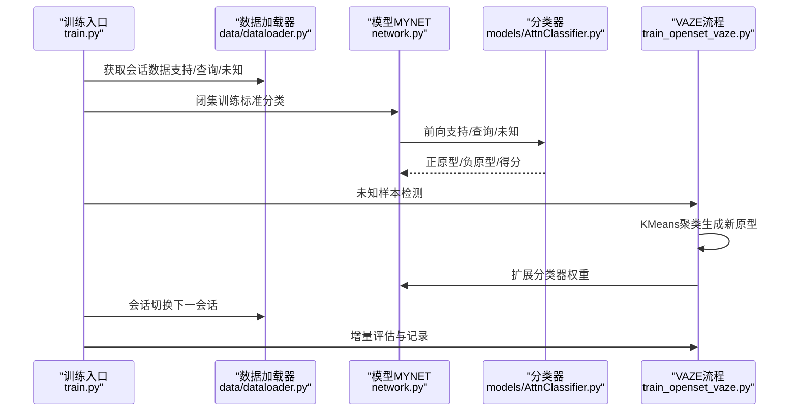
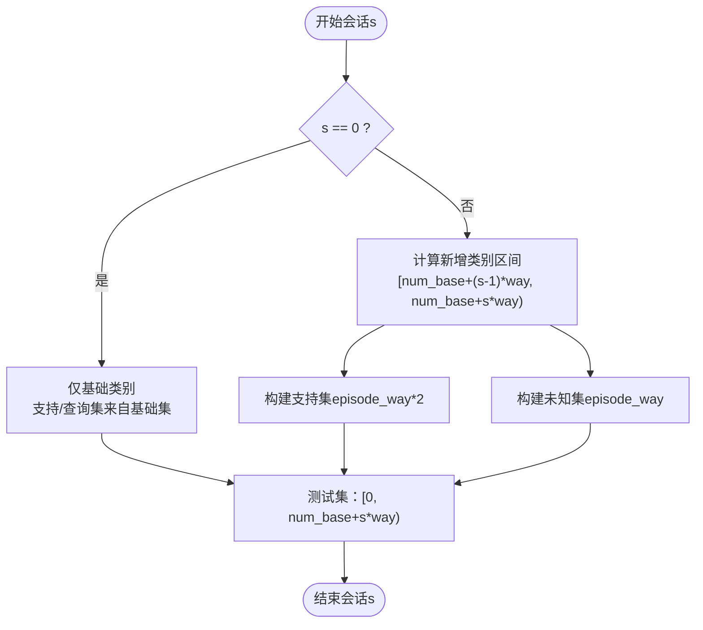
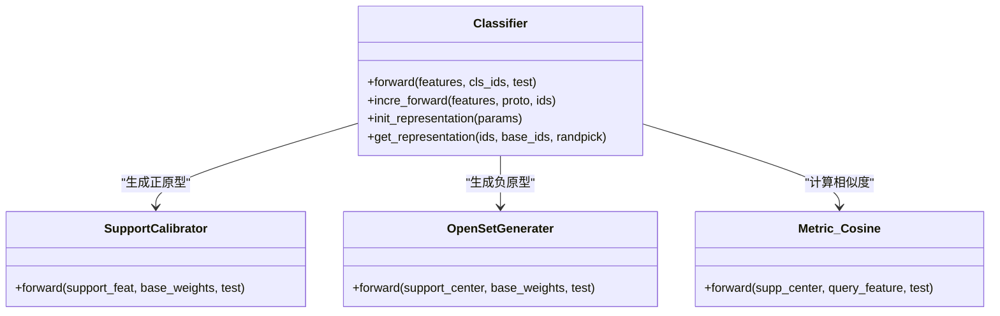
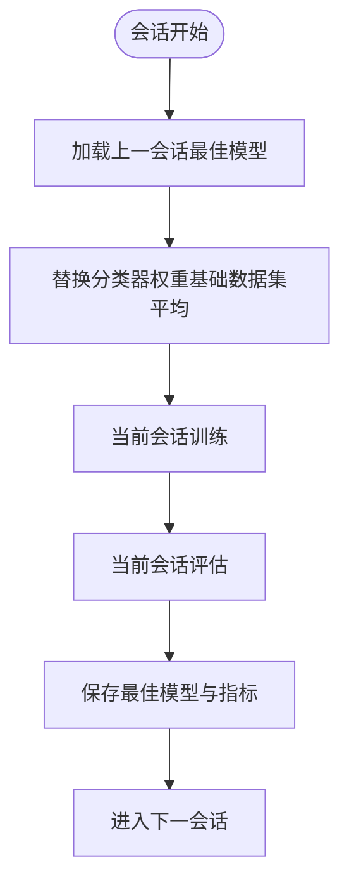
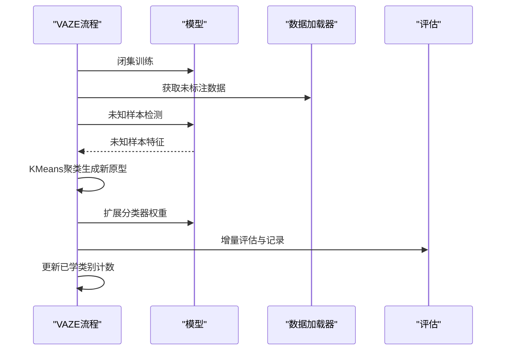
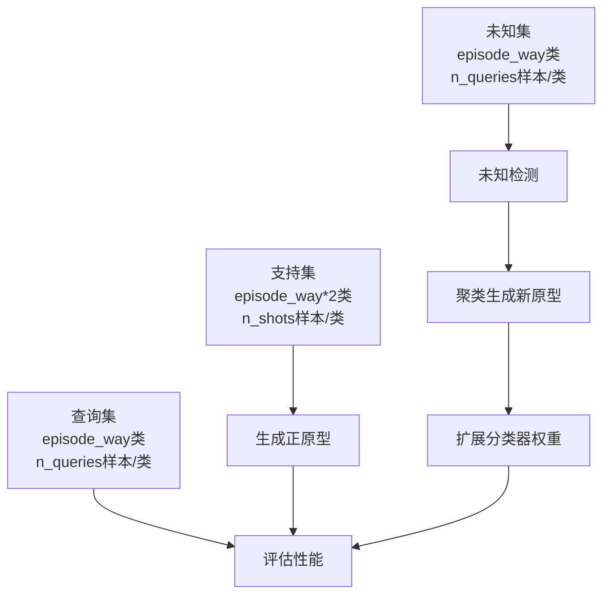
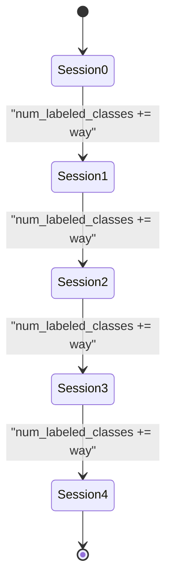
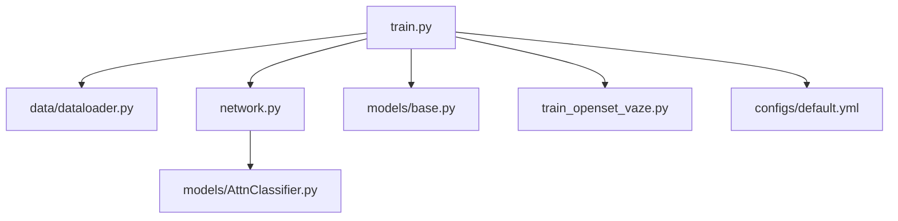

# 会话管理系统

<cite>
**本文档引用的文件**
- [data/dataloader.py](file://data/dataloader.py)
- [models/base.py](file://models/base.py)
- [network.py](file://network.py)
- [models/AttnClassifier.py](file://models/AttnClassifier.py)
- [train_openset_vaze.py](file://train_openset_vaze.py)
- [configs/default.yml](file://configs/default.yml)
- [train.py](file://train.py)
</cite>

## 目录
1. [简介](#简介)
2. [项目结构](#项目结构)
3. [核心组件](#核心组件)
4. [架构总览](#架构总览)
5. [详细组件分析](#详细组件分析)
6. [依赖关系分析](#依赖关系分析)
7. [性能考量](#性能考量)
8. [故障排查指南](#故障排查指南)
9. [结论](#结论)
10. [附录](#附录)

## 简介
本文件面向VAZE系统的会话管理系统，系统性阐述会话化学习（Class-Incremental Learning）的概念与实现，重点覆盖以下方面：
- 新类别的动态添加机制：基于阈值检测未知样本，使用KMeans聚类生成新原型并扩展分类器权重。
- 会话间的知识传递策略：通过分类器权重共享与原型记忆，实现对已学类别的持续保持与对新类别的增量学习。
- 支持集与查询集的组织方式：在元学习框架下，支持集用于生成正原型，查询集用于评估分类性能，未知集用于检测与增量扩展。
- 会话状态管理：当前会话编号、已学习类别列表、分类器权重扩展策略等。
- 会话切换流程：模型参数初始化、新类别原型生成、分类器权重扩展与评估指标记录。

本系统同时提供与基线一致的增量评估协议，便于跨方法对比与稳定性分析。

## 项目结构
围绕会话管理的关键代码分布在以下模块：
- 数据加载与会话划分：data/dataloader.py
- 模型与分类器：network.py、models/AttnClassifier.py
- 会话状态与训练基类：models/base.py
- VAZE增量流程与评估：train_openset_vaze.py
- 配置与超参：configs/default.yml
- 主训练入口与会话循环：train.py

**图表来源**
- [data/dataloader.py:48-81](file://data/dataloader.py#L48-L81)
- [network.py:18-35](file://network.py#L18-L35)
- [models/AttnClassifier.py:39-93](file://models/AttnClassifier.py#L39-L93)
- [models/base.py:27-50](file://models/base.py#L27-L50)
- [train_openset_vaze.py:248-417](file://train_openset_vaze.py#L248-L417)
- [configs/default.yml:1-88](file://configs/default.yml#L1-L88)
- [train.py:825-850](file://train.py#L825-L850)

**章节来源**
- [data/dataloader.py:48-81](file://data/dataloader.py#L48-L81)
- [network.py:18-35](file://network.py#L18-L35)
- [models/AttnClassifier.py:39-93](file://models/AttnClassifier.py#L39-L93)
- [models/base.py:27-50](file://models/base.py#L27-L50)
- [train_openset_vaze.py:248-417](file://train_openset_vaze.py#L248-L417)
- [configs/default.yml:1-88](file://configs/default.yml#L1-L88)
- [train.py:825-850](file://train.py#L825-L850)

## 核心组件
- 数据加载器（会话级）：根据会话编号动态选择类别范围，构造支持集/查询集/未知集的数据加载器。
- 分类器（原型与负原型生成）：基于支持特征与语义/视觉表示，生成正原型与负原型，并计算余弦相似得分。
- 会话状态管理：Trainer基类维护每会话最佳模型、统计日志与结果字典。
- VAZE增量流程：闭集训练→未知样本检测→聚类新增原型→扩展分类器权重→增量评估。
- 配置系统：统一控制会话数量、每会话新增类别数、批次大小、学习率与调度策略等。

**章节来源**
- [data/dataloader.py:206-254](file://data/dataloader.py#L206-L254)
- [models/AttnClassifier.py:47-93](file://models/AttnClassifier.py#L47-L93)
- [models/base.py:27-50](file://models/base.py#L27-L50)
- [train_openset_vaze.py:86-99](file://train_openset_vaze.py#L86-L99)
- [configs/default.yml:1-88](file://configs/default.yml#L1-L88)

## 架构总览
VAZE的会话管理采用“闭集训练+开集检测+增量扩展”的两阶段流程：
- 闭集训练阶段：在当前已学类别上进行标准分类训练，得到良好的特征与分类器权重。
- 开集检测阶段：利用分类置信度与特征到类别中心的余弦相似度阈值，识别未知样本。
- 增量扩展阶段：对未知样本聚类生成新原型，扩展分类器权重，形成新的类别集合。
- 评估阶段：在当前会话的全部已学类别上进行增量评估与整体评估。

**图表来源**
- [train.py:825-850](file://train.py#L825-L850)
- [data/dataloader.py:48-81](file://data/dataloader.py#L48-L81)
- [network.py:18-35](file://network.py#L18-L35)
- [models/AttnClassifier.py:47-93](file://models/AttnClassifier.py#L47-L93)
- [train_openset_vaze.py:248-417](file://train_openset_vaze.py#L248-L417)

## 详细组件分析

### 数据加载与会话划分
- 会话0（基础会话）：仅包含基础类别，支持集与查询集来自同一分布。
- 会话s>0：新增区间[num_base+(s-1)*way, num_base+s*way)的类别，分别构造支持集与未知集。
- 测试集组织：会话s的测试集涵盖[0, num_base+s*way)的全部已学类别，便于增量评估。

**图表来源**
- [data/dataloader.py:48-81](file://data/dataloader.py#L48-L81)
- [data/dataloader.py:206-254](file://data/dataloader.py#L206-L254)
- [data/dataloader.py:256-259](file://data/dataloader.py#L256-L259)

**章节来源**
- [data/dataloader.py:48-81](file://data/dataloader.py#L48-L81)
- [data/dataloader.py:206-254](file://data/dataloader.py#L206-L254)
- [data/dataloader.py:256-259](file://data/dataloader.py#L256-L259)

### 分类器与原型生成
- 支持校准（SupportCalibrator）：将支持集特征与基础权重进行融合，生成正原型。
- 负原型生成（OpenSetGenerater）：基于正原型与基础权重，生成负原型（伪类），用于开集识别。
- 余弦度量（Metric_Cosine）：对查询与未知样本分别计算余弦相似得分，温度参数可调节分布锐利程度。
- 表示初始化（Classifier.init_representation）：将基础分类器权重作为静态表示，供后续会话使用。

**图表来源**
- [models/AttnClassifier.py:39-93](file://models/AttnClassifier.py#L39-L93)
- [models/AttnClassifier.py:121-185](file://models/AttnClassifier.py#L121-L185)
- [models/AttnClassifier.py:188-271](file://models/AttnClassifier.py#L188-L271)
- [models/AttnClassifier.py:352-369](file://models/AttnClassifier.py#L352-L369)

**章节来源**
- [models/AttnClassifier.py:39-93](file://models/AttnClassifier.py#L39-L93)
- [models/AttnClassifier.py:121-185](file://models/AttnClassifier.py#L121-L185)
- [models/AttnClassifier.py:188-271](file://models/AttnClassifier.py#L188-L271)
- [models/AttnClassifier.py:352-369](file://models/AttnClassifier.py#L352-L369)

### 会话状态管理与训练基类
- 最佳模型保存：每会话记录最佳验证精度与对应模型参数，便于后续会话加载。
- 结果字典：按会话记录known/unknown/f1/incremental/all等指标，支持多次测试平均与统计。
- 数据初始化：在会话切换时，使用基础数据集替换分类器权重，确保初始权重合理。

**图表来源**
- [models/base.py:111-151](file://models/base.py#L111-L151)
- [models/base.py:153-176](file://models/base.py#L153-L176)
- [models/base.py:177-233](file://models/base.py#L177-L233)

**章节来源**
- [models/base.py:111-151](file://models/base.py#L111-L151)
- [models/base.py:153-176](file://models/base.py#L153-L176)
- [models/base.py:177-233](file://models/base.py#L177-L233)

### VAZE增量流程与会话切换
- 闭集训练：在当前已学类别上进行标准分类训练，得到稳定特征与分类器。
- 未知样本检测：使用分类置信度阈值与特征到类别中心的余弦相似度阈值，筛选未知样本。
- 原型扩展：对未知样本进行KMeans聚类，生成新原型并扩展分类器权重。
- 评估与记录：在当前会话的全部已学类别上进行增量评估与整体评估，记录指标并更新已学类别计数。

**图表来源**
- [train_openset_vaze.py:86-99](file://train_openset_vaze.py#L86-L99)
- [train_openset_vaze.py:134-170](file://train_openset_vaze.py#L134-L170)
- [train_openset_vaze.py:173-198](file://train_openset_vaze.py#L173-L198)
- [train_openset_vaze.py:248-417](file://train_openset_vaze.py#L248-L417)

**章节来源**
- [train_openset_vaze.py:86-99](file://train_openset_vaze.py#L86-L99)
- [train_openset_vaze.py:134-170](file://train_openset_vaze.py#L134-L170)
- [train_openset_vaze.py:173-198](file://train_openset_vaze.py#L173-L198)
- [train_openset_vaze.py:248-417](file://train_openset_vaze.py#L248-L417)

### 支持集与查询集的组织方式
- 支持集：用于生成正原型，通常包含episode_way*2个类别，每个类别n_shots个样本。
- 查询集：用于评估分类性能，通常包含episode_way个类别，每个类别n_queries个样本。
- 未知集：用于开集检测，通常包含episode_way个类别，每个类别n_queries个样本。

**图表来源**
- [data/dataloader.py:222-227](file://data/dataloader.py#L222-L227)
- [data/dataloader.py:247-253](file://data/dataloader.py#L247-L253)

**章节来源**
- [data/dataloader.py:222-227](file://data/dataloader.py#L222-L227)
- [data/dataloader.py:247-253](file://data/dataloader.py#L247-L253)

### 会话状态管理机制
- 当前会话编号：由循环控制，从start_session到num_session-1。
- 已学习类别列表：随会话递增，每次新增way个类别。
- 参数共享策略：分类器权重在会话间共享与扩展，基础权重通过数据初始化保证一致性。

**图表来源**
- [train_openset_vaze.py:326](file://train_openset_vaze.py#L326)
- [configs/default.yml:2-9](file://configs/default.yml#L2-L9)

**章节来源**
- [train_openset_vaze.py:326](file://train_openset_vaze.py#L326)
- [configs/default.yml:2-9](file://configs/default.yml#L2-L9)

### 会话切换的具体实现流程
- 模型参数初始化：加载上一会话最佳模型，替换分类器权重。
- 新类别原型生成：对当前会话未标注数据进行特征提取与聚类，生成新原型。
- 分类器权重扩展：将新原型拼接到现有分类器权重末尾，扩展分类器输出维度。
- 评估与记录：在当前会话的全部已学类别上进行增量评估与整体评估。

**章节来源**
- [models/base.py:111-151](file://models/base.py#L111-L151)
- [train_openset_vaze.py:173-198](file://train_openset_vaze.py#L173-L198)
- [train_openset_vaze.py:248-417](file://train_openset_vaze.py#L248-L417)

## 依赖关系分析
- 模块耦合：
  - train.py依赖data/dataloader.py与network.py，负责会话循环与评估。
  - network.py依赖models/AttnClassifier.py，提供分类器能力。
  - models/base.py提供通用训练基类与会话状态管理。
  - train_openset_vaze.py独立实现VAZE增量流程，与train.py并行运行。
- 外部依赖：
  - 配置文件configs/default.yml集中定义会话数量、批次大小、学习率等超参。
  - 数据集接口通过args.Dataset动态导入，支持多种数据集。

**图表来源**
- [train.py:1-30](file://train.py#L1-L30)
- [data/dataloader.py:1-10](file://data/dataloader.py#L1-L10)
- [network.py:1-15](file://network.py#L1-L15)
- [models/AttnClassifier.py:1-10](file://models/AttnClassifier.py#L1-L10)
- [models/base.py:1-15](file://models/base.py#L1-L15)
- [train_openset_vaze.py:1-20](file://train_openset_vaze.py#L1-L20)
- [configs/default.yml:1-10](file://configs/default.yml#L1-L10)

**章节来源**
- [train.py:1-30](file://train.py#L1-L30)
- [data/dataloader.py:1-10](file://data/dataloader.py#L1-L10)
- [network.py:1-15](file://network.py#L1-L15)
- [models/AttnClassifier.py:1-10](file://models/AttnClassifier.py#L1-L10)
- [models/base.py:1-15](file://models/base.py#L1-L15)
- [train_openset_vaze.py:1-20](file://train_openset_vaze.py#L1-L20)
- [configs/default.yml:1-10](file://configs/default.yml#L1-L10)

## 性能考量
- 会话数量与新增类别数：num_session与way共同决定类别增长速度，建议在稳定性与收敛速度之间权衡。
- 温度参数与阈值：temperature影响分类分布锐利程度，prob_thresh与cos_thresh影响未知检测敏感度。
- 聚类数量：n_new应与未知样本数量匹配，避免过少导致类别稀疏或过多导致类别混淆。
- 批次大小与数据增强：较大的批次与适当的增强有助于提升特征泛化能力。

[本节为通用指导，无需特定文件来源]

## 故障排查指南
- 会话0评估异常：检查基础类别数量与数据加载器索引范围，确保会话0仅包含基础类别。
- 未知检测阈值不当：调整prob_thresh与cos_thresh，观察unknown_acc与f1_score变化趋势。
- 原型扩展失败：确认聚类中心维度与分类器权重维度一致，必要时进行填充或截断。
- 评估指标异常：检查已学类别计数是否正确递增，以及测试集索引范围是否覆盖当前会话全部已学类别。

**章节来源**
- [train_openset_vaze.py:134-170](file://train_openset_vaze.py#L134-L170)
- [train_openset_vaze.py:173-198](file://train_openset_vaze.py#L173-L198)
- [train_openset_vaze.py:248-417](file://train_openset_vaze.py#L248-L417)

## 结论
VAZE的会话管理系统通过“闭集训练+开集检测+增量扩展”的闭环流程，在保持对已学类别的高精度的同时，实现了对新类别的有效增量学习。数据加载器的会话化设计、分类器的原型生成机制、以及VAZE的增量扩展策略共同构成了稳定的会话管理体系。结合配置文件中的超参设置与主训练入口的会话循环，系统能够在不同会话设置下获得可比的性能表现与良好的稳定性。

[本节为总结性内容，无需特定文件来源]

## 附录
- 关键配置项参考：
  - 会话相关：num_session、start_session、way、num_base
  - 训练相关：epochs_std、lr_std、scheduler、optimizer
  - 网络相关：temperature、new_mode、base_mode
  - 数据加载：train_batch_size、test_batch_size、num_workers

**章节来源**
- [configs/default.yml:2-9](file://configs/default.yml#L2-L9)
- [configs/default.yml:22-41](file://configs/default.yml#L22-L41)
- [configs/default.yml:42-48](file://configs/default.yml#L42-L48)
- [configs/default.yml:57-60](file://configs/default.yml#L57-L60)