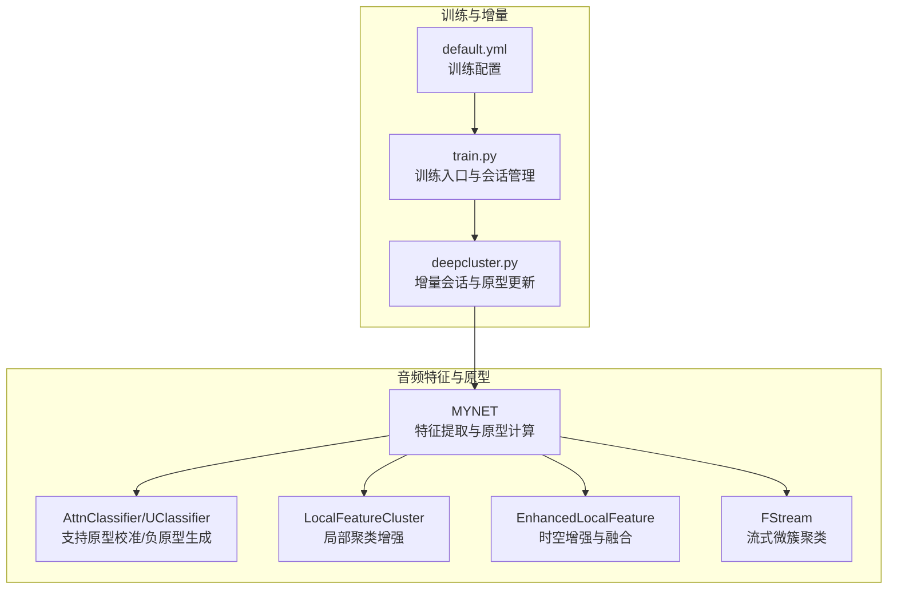
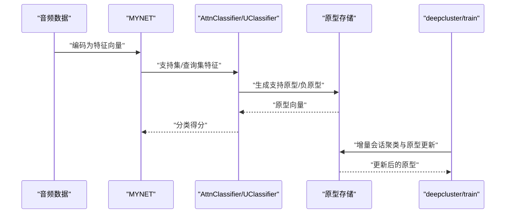
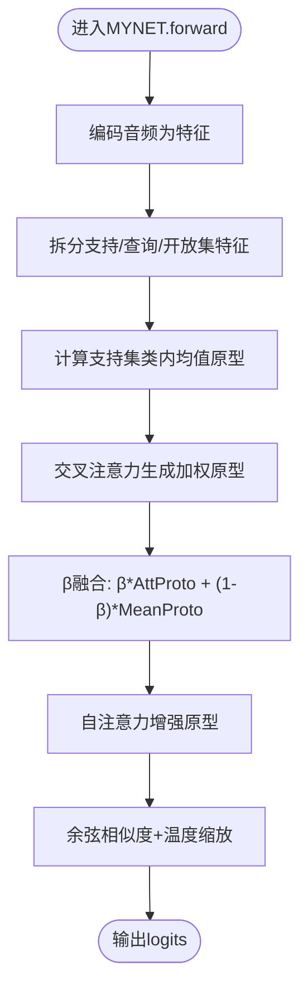
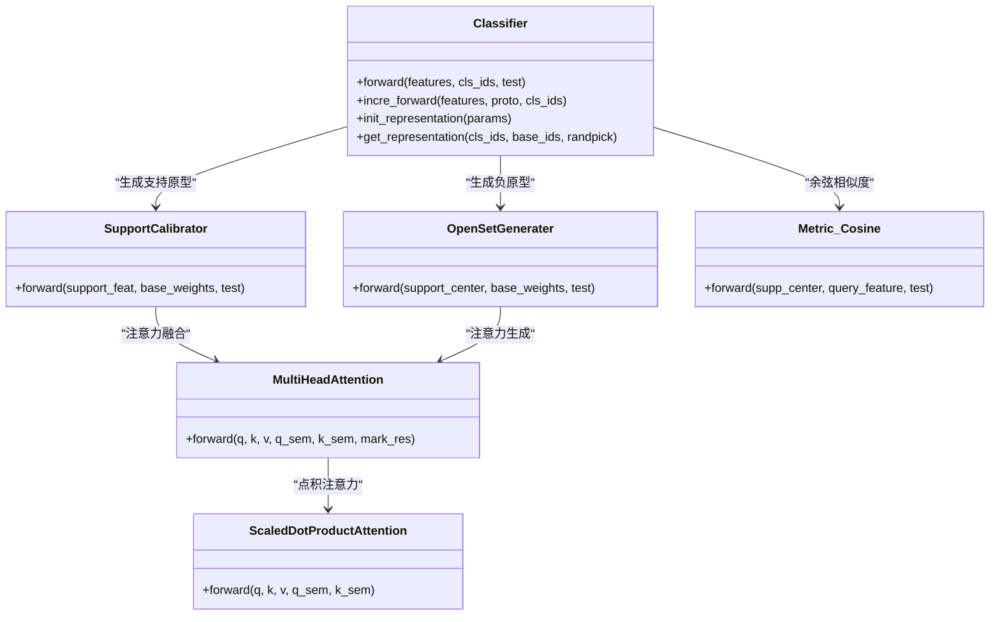
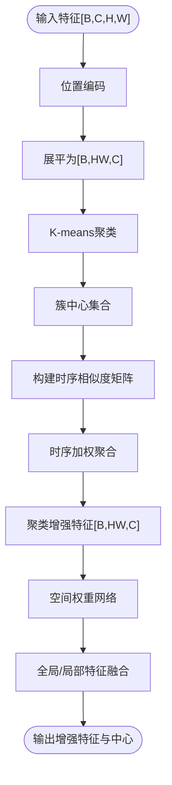
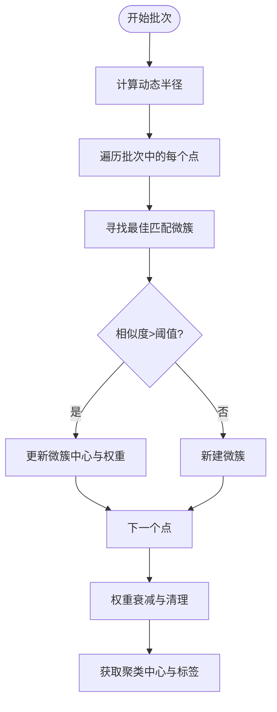
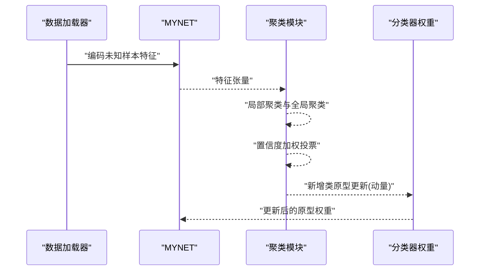
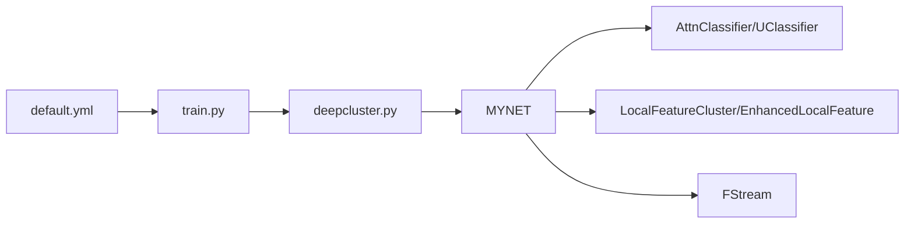

# 原型更新机制

<cite>
**本文引用的文件列表**
- [network.py](file://network.py)
- [deepcluster.py](file://deepcluster.py)
- [enhance_module.py](file://enhance_module.py)
- [streamCluster.py](file://streamCluster.py)
- [AttnClassifier.py](file://models/AttnClassifier.py)
- [UClassifier.py](file://models/UClassifier.py)
- [default.yml](file://configs/default.yml)
- [train.py](file://train.py)
</cite>

## 目录
1. [简介](#简介)
2. [项目结构](#项目结构)
3. [核心组件](#核心组件)
4. [架构总览](#架构总览)
5. [详细组件分析](#详细组件分析)
6. [依赖关系分析](#依赖关系分析)
7. [性能考量](#性能考量)
8. [故障排查指南](#故障排查指南)
9. [结论](#结论)
10. [附录](#附录)

## 简介
本技术文档围绕VAZE系统中的原型更新机制展开，系统性阐述原型学习在音频分类任务中的基本原理与实现细节，重点覆盖以下方面：
- 支持集特征的聚类与类别原型的动态生成
- 基于支持样本的类内均值作为原型向量的计算方式
- 注意力机制在原型更新中的作用，包括自注意力与交叉注意力对多层级特征的融合
- 原型更新的数学公式与实现流程，涵盖原型计算、相似度度量与更新策略
- 原型稳定性与收敛性分析，以及不同更新策略对模型性能的影响
- 面向开发者的参数调优指南与自定义更新规则的实现方法

## 项目结构
VAZE系统采用模块化设计，原型更新机制主要分布在以下模块：
- 网络主干与原型计算：MYNET类负责音频特征提取、原型计算与注意力融合
- 分类器与原型生成：AttnClassifier/UClassifier提供支持原型校准与负原型生成
- 聚类与特征增强：LocalFeatureCluster、EnhancedLocalFeature等模块实现局部聚类与时空特征增强
- 流式聚类：FStream提供基于音频特征的流式微簇聚类
- 训练与增量更新：deepcluster.py与train.py中的增量会话与原型更新流程

图表来源
- [network.py:18-724](file://network.py#L18-L724)
- [deepcluster.py:1-744](file://deepcluster.py#L1-L744)
- [enhance_module.py:1-160](file://enhance_module.py#L1-L160)
- [streamCluster.py:1-132](file://streamCluster.py#L1-L132)
- [AttnClassifier.py:1-369](file://models/AttnClassifier.py#L1-L369)
- [UClassifier.py:1-405](file://models/UClassifier.py#L1-L405)
- [default.yml:1-88](file://configs/default.yml#L1-L88)
- [train.py:1-200](file://train.py#L1-L200)

章节来源
- [network.py:18-724](file://network.py#L18-L724)
- [deepcluster.py:1-744](file://deepcluster.py#L1-L744)
- [enhance_module.py:1-160](file://enhance_module.py#L1-L160)
- [streamCluster.py:1-132](file://streamCluster.py#L1-L132)
- [AttnClassifier.py:1-369](file://models/AttnClassifier.py#L1-L369)
- [UClassifier.py:1-405](file://models/UClassifier.py#L1-L405)
- [default.yml:1-88](file://configs/default.yml#L1-L88)
- [train.py:1-200](file://train.py#L1-L200)

## 核心组件
- MYNET：音频编码器、注意力模块、原型计算与增量更新接口
- AttnClassifier/UClassifier：支持原型校准、负原型生成与余弦相似度度量
- LocalFeatureCluster/EnhancedLocalFeature：局部聚类与时空特征增强
- FStream：流式微簇聚类，适用于小批量音频特征
- deepcluster.py：增量会话训练、聚类与原型更新流程
- train.py：训练入口与会话管理

章节来源
- [network.py:18-724](file://network.py#L18-L724)
- [AttnClassifier.py:38-93](file://models/AttnClassifier.py#L38-L93)
- [UClassifier.py:7-405](file://models/UClassifier.py#L7-L405)
- [enhance_module.py:70-160](file://enhance_module.py#L70-L160)
- [streamCluster.py:5-132](file://streamCluster.py#L5-L132)
- [deepcluster.py:178-390](file://deepcluster.py#L178-L390)
- [train.py:505-551](file://train.py#L505-L551)

## 架构总览
VAZE原型更新机制的整体流程如下：
- 音频经MYNET编码为特征向量
- 支持集特征通过注意力模块进行自注意力与交叉注意力融合，生成支持原型与负原型
- 查询集特征与原型进行余弦相似度计算，得到分类得分
- 在增量会话中，基于聚类结果对新增类别的原型进行更新，支持动量更新与加权融合

图表来源
- [network.py:102-202](file://network.py#L102-L202)
- [AttnClassifier.py:47-93](file://models/AttnClassifier.py#L47-L93)
- [UClassifier.py:123-133](file://models/UClassifier.py#L123-L133)
- [deepcluster.py:344-390](file://deepcluster.py#L344-L390)
- [train.py:505-551](file://train.py#L505-L551)

## 详细组件分析

### MYNET：原型计算与注意力融合
- 自注意力模块：对原型序列进行自注意力，增强原型内部一致性
- 交叉注意力模块：将支持集与查询集拼接后进行交叉注意力，生成加权支持原型
- 原型融合：通过beta参数对注意力生成的原型与原始均值原型进行加权融合
- 温度缩放：对余弦相似度进行温度缩放，控制分布锐利程度

图表来源
- [network.py:225-255](file://network.py#L225-L255)
- [network.py:238-241](file://network.py#L238-L241)
- [network.py:270-279](file://network.py#L270-L279)

章节来源
- [network.py:225-255](file://network.py#L225-L255)
- [network.py:238-241](file://network.py#L238-L241)
- [network.py:270-279](file://network.py#L270-L279)

### AttnClassifier/UClassifier：支持原型与负原型生成
- SupportCalibrator：通过多头注意力对支持集特征与基类权重进行融合，生成支持原型
- OpenSetGenerater：基于支持原型与基类权重生成负原型（伪类），用于开放集检测
- Metric_Cosine：对支持原型与查询特征进行余弦相似度计算，并乘以温度参数

图表来源
- [AttnClassifier.py:38-93](file://models/AttnClassifier.py#L38-L93)
- [AttnClassifier.py:121-185](file://models/AttnClassifier.py#L121-L185)
- [AttnClassifier.py:188-271](file://models/AttnClassifier.py#L188-L271)
- [AttnClassifier.py:274-326](file://models/AttnClassifier.py#L274-L326)
- [AttnClassifier.py:331-349](file://models/AttnClassifier.py#L331-L349)
- [AttnClassifier.py:352-367](file://models/AttnClassifier.py#L352-L367)

章节来源
- [AttnClassifier.py:38-93](file://models/AttnClassifier.py#L38-L93)
- [AttnClassifier.py:121-185](file://models/AttnClassifier.py#L121-L185)
- [AttnClassifier.py:188-271](file://models/AttnClassifier.py#L188-L271)
- [AttnClassifier.py:274-326](file://models/AttnClassifier.py#L274-L326)
- [AttnClassifier.py:331-349](file://models/AttnClassifier.py#L331-L349)
- [AttnClassifier.py:352-367](file://models/AttnClassifier.py#L352-L367)

### LocalFeatureCluster与EnhancedLocalFeature：聚类与特征增强
- LocalFeatureCluster：对每个样本的局部特征进行K-means聚类，得到簇中心并进行特征增强
- EnhancedLocalFeature：引入位置编码与时空相似度矩阵，对聚类中心进行时序加权，实现更精细的特征增强
- 空间权重网络：对增强后的特征进行空间加权融合，输出全局与局部特征的动态融合

图表来源
- [enhance_module.py:95-148](file://enhance_module.py#L95-L148)
- [enhance_module.py:109-133](file://enhance_module.py#L109-L133)

章节来源
- [enhance_module.py:70-160](file://enhance_module.py#L70-L160)
- [enhance_module.py:95-148](file://enhance_module.py#L95-L148)

### FStream：流式微簇聚类
- 微簇结构：记录中心点、点集、权重与最后更新时间
- 动态半径：根据微簇中心间的相似度距离动态调整半径
- 流式更新：对新到达的点查找最近微簇，若相似度超过阈值则更新中心，否则新建微簇
- k-NN图与标签分配：通过k-NN图与核心-边界分离策略进行聚类标签分配

图表来源
- [streamCluster.py:58-126](file://streamCluster.py#L58-L126)

章节来源
- [streamCluster.py:5-132](file://streamCluster.py#L5-L132)

### 增量会话与原型更新：deepcluster.py与train.py
- 增量会话：在每个会话中，对未知类样本进行聚类，生成动态标签，计算聚类准确率
- 弹性原型更新：对新增类别使用动量更新，缓解灾难性遗忘；对已知类别采用平均更新
- 特征融合：结合全局特征与局部增强特征，动态调整融合权重

图表来源
- [deepcluster.py:344-390](file://deepcluster.py#L344-L390)
- [train.py:505-551](file://train.py#L505-L551)

章节来源
- [deepcluster.py:178-390](file://deepcluster.py#L178-L390)
- [train.py:505-551](file://train.py#L505-L551)

## 依赖关系分析
- MYNET依赖AttnClassifier/UClassifier进行原型生成与度量
- LocalFeatureCluster与EnhancedLocalFeature为MYNET提供特征增强能力
- FStream为流式场景提供微簇聚类能力
- deepcluster.py与train.py协调增量会话与原型更新流程
- default.yml提供训练超参数配置

图表来源
- [network.py:18-724](file://network.py#L18-L724)
- [AttnClassifier.py:1-369](file://models/AttnClassifier.py#L1-L369)
- [UClassifier.py:1-405](file://models/UClassifier.py#L1-L405)
- [enhance_module.py:1-160](file://enhance_module.py#L1-L160)
- [streamCluster.py:1-132](file://streamCluster.py#L1-L132)
- [deepcluster.py:1-744](file://deepcluster.py#L1-L744)
- [train.py:1-200](file://train.py#L1-L200)
- [default.yml:1-88](file://configs/default.yml#L1-L88)

章节来源
- [network.py:18-724](file://network.py#L18-L724)
- [AttnClassifier.py:1-369](file://models/AttnClassifier.py#L1-L369)
- [UClassifier.py:1-405](file://models/UClassifier.py#L1-L405)
- [enhance_module.py:1-160](file://enhance_module.py#L1-L160)
- [streamCluster.py:1-132](file://streamCluster.py#L1-L132)
- [deepcluster.py:1-744](file://deepcluster.py#L1-L744)
- [train.py:1-200](file://train.py#L1-L200)
- [default.yml:1-88](file://configs/default.yml#L1-L88)

## 性能考量
- 计算复杂度：注意力模块的时间复杂度与序列长度呈二次关系，建议在支持集规模较小的前提下使用
- 内存占用：聚类与特征增强会增加显存占用，需合理设置k_ratio与批次大小
- 收敛性：动量更新有助于稳定原型，但需平衡学习率与动量参数，防止过拟合
- 温度参数：温度缩放影响分类分布锐利程度，过高导致过拟合，过低导致欠区分度

## 故障排查指南
- 原型不更新：检查增量会话中聚类标签映射与类别索引范围
- 注意力异常：确认注意力模块的输入维度与拼接顺序，避免维度不匹配
- 聚类不稳定：调整k_ratio与动态半径阈值，确保聚类质量
- 训练发散：降低学习率或温度参数，检查动量更新的衰减策略

章节来源
- [deepcluster.py:344-390](file://deepcluster.py#L344-L390)
- [network.py:225-255](file://network.py#L225-L255)
- [enhance_module.py:95-148](file://enhance_module.py#L95-L148)

## 结论
VAZE系统的原型更新机制通过支持集特征的聚类与注意力融合，实现了动态、稳定的类别原型生成。在增量会话中，结合流式聚类与动量更新策略，有效缓解了灾难性遗忘并提升了未知类别的识别性能。注意力机制在多层级特征融合中发挥了关键作用，为原型的准确性与鲁棒性提供了保障。

## 附录
- 参数调优建议
  - 温度参数：初始设置为配置文件中的温度值，根据验证集表现微调
  - 动量更新：新增类别使用较高动量，已知类别使用较低动量
  - k_ratio：根据特征分辨率与类别密度调整，避免过度聚类或欠聚类
  - 注意力融合权重β：在原型融合中平衡注意力生成与均值原型
- 自定义更新规则
  - 可在分类器中扩展新的负原型生成策略，如基于语义的融合门控
  - 可在聚类模块中引入更复杂的相似度度量，如基于时序的动态相似度矩阵

章节来源
- [default.yml:42-45](file://configs/default.yml#L42-L45)
- [network.py:238-241](file://network.py#L238-L241)
- [enhance_module.py:109-133](file://enhance_module.py#L109-L133)
- [AttnClassifier.py:121-185](file://models/AttnClassifier.py#L121-L185)