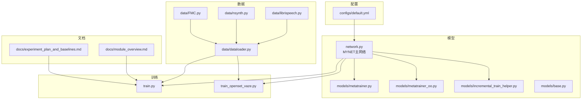
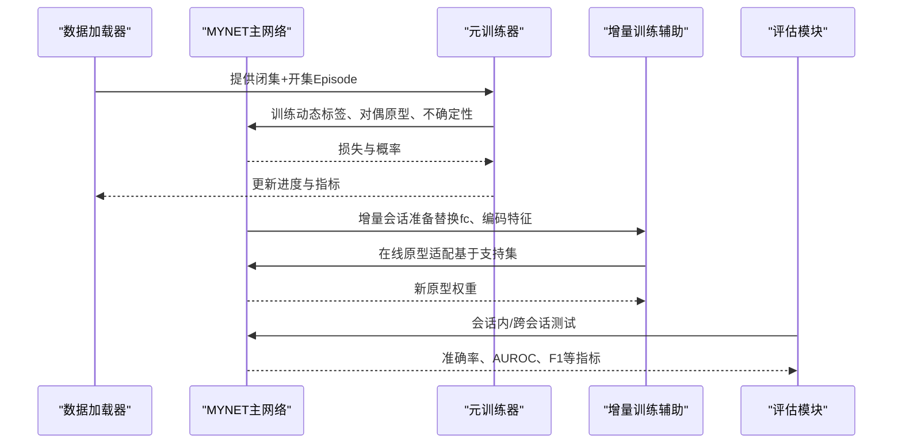
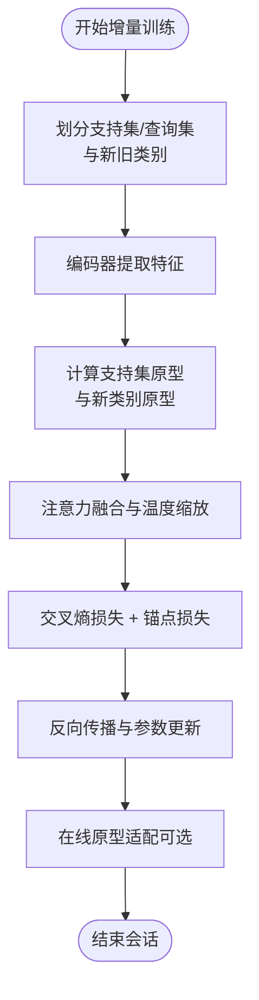
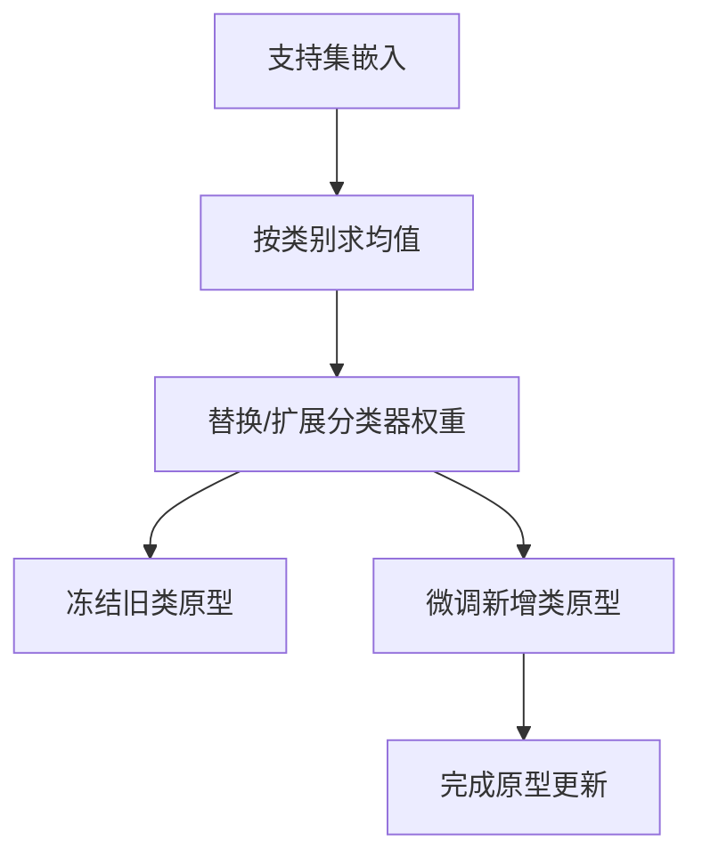
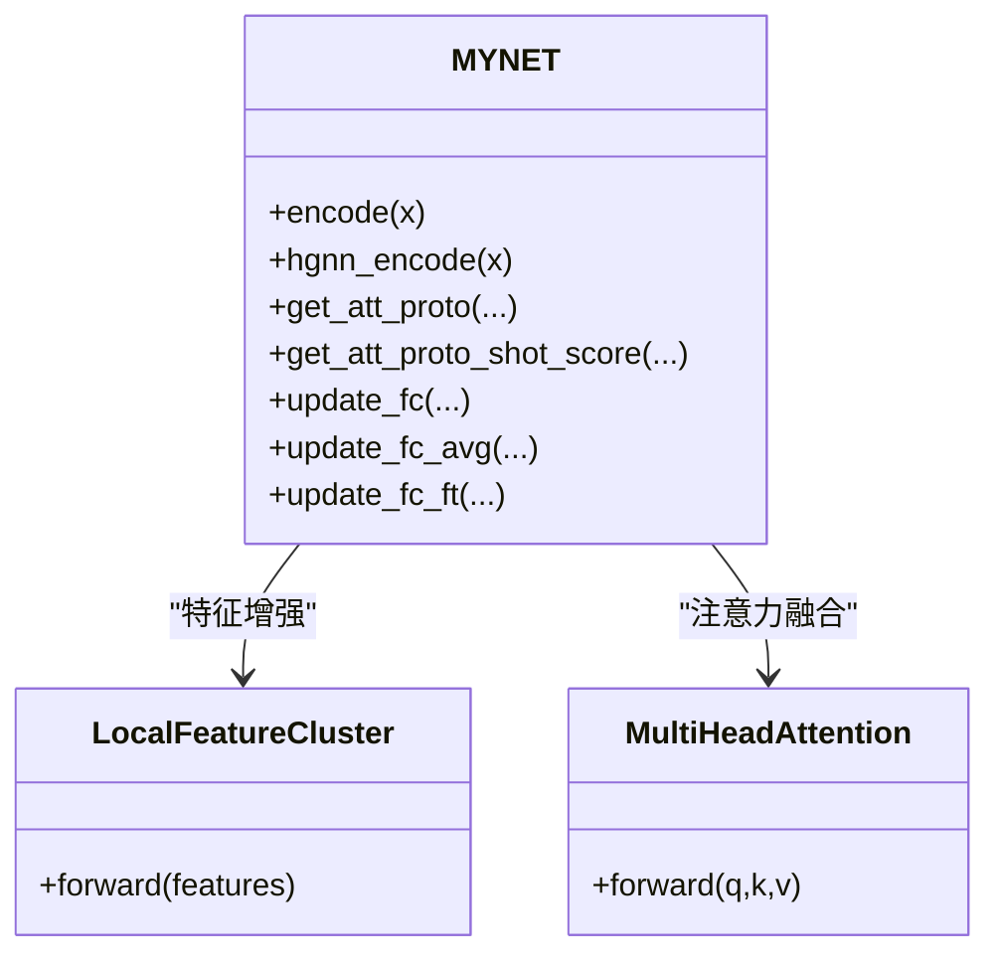
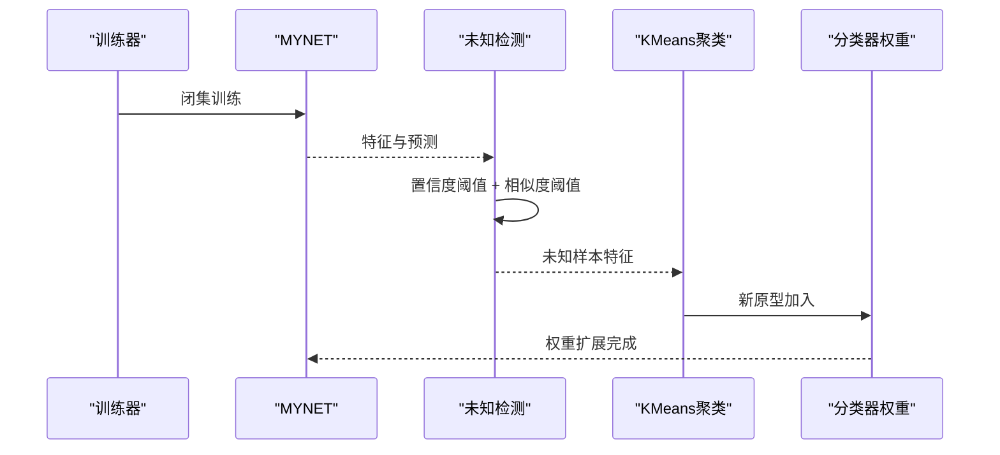
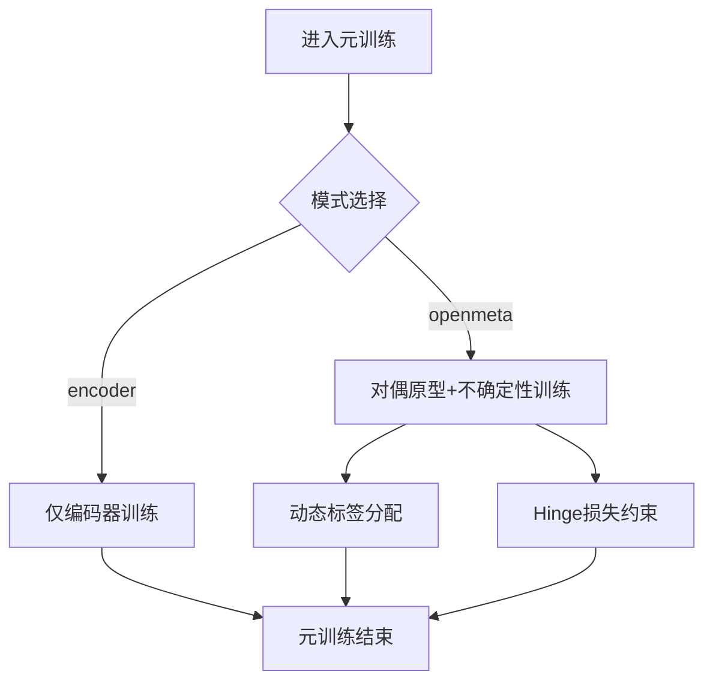
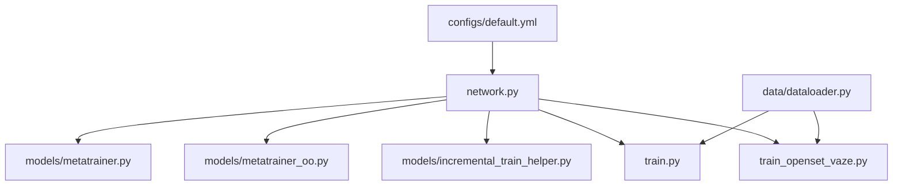

# 增量学习机制

<cite>
**本文档引用的文件**
- [incremental_train_helper.py](file://models/incremental_train_helper.py)
- [metatrainer.py](file://models/metatrainer.py)
- [metatrainer_oo.py](file://models/metatrainer_oo.py)
- [train.py](file://train.py)
- [train_openset_vaze.py](file://train_openset_vaze.py)
- [network.py](file://network.py)
- [base.py](file://models/base.py)
- [default.yml](file://configs/default.yml)
- [module_overview.md](file://docs/module_overview.md)
- [experiment_plan_and_baselines.md](file://docs/experiment_plan_and_baselines.md)
</cite>

## 目录
1. [简介](#简介)
2. [项目结构](#项目结构)
3. [核心组件](#核心组件)
4. [架构概览](#架构概览)
5. [详细组件分析](#详细组件分析)
6. [依赖分析](#依赖分析)
7. [性能考虑](#性能考虑)
8. [故障排除指南](#故障排除指南)
9. [结论](#结论)
10. [附录](#附录)

## 简介
本文件围绕VAZE系统的增量学习机制，系统阐述以下内容：
- 增量学习基本概念与在音频分类中的应用背景
- 会话化学习的实现方式：新类别的动态添加、旧知识保持策略、灾难性遗忘缓解
- 原型更新机制：基于支持集动态生成与更新类别原型
- 特征空间适应性调整：特征维度扩展与分类边界的动态变化
- 增量学习训练流程：元训练阶段与增量训练阶段的操作步骤
- 性能评估指标与基准测试结果：已实现的指标与对比实验计划
- 开发者扩展指南：如何在现有框架上扩展增量学习算法与自定义策略

VAZE系统采用"开集对偶原型元训练 + 不确定性课程"的完整方法，在LibriSpeech等音频数据集上实现持续学习与未知类检测。

## 项目结构
该项目采用模块化组织，核心目录与职责如下：
- configs：训练配置（默认参数、学习率调度、网络结构等）
- models：增量学习与元学习相关模块（含增量训练辅助、元训练器、不确定性模块等）
- data：数据加载与采样（支持FMC、NSynth、LibriSpeech等数据集）
- docs：模块说明与实验计划
- scripts：结果分析与可视化脚本
- save/save_result：模型检查点与实验结果存储
- network.py：主干网络MYNET（ResNet18 + 原型分类器），包含编码器、注意力模块与原型更新逻辑
- train.py/train_openset_vaze.py：训练入口与VAZE开集增量流程
- utils：通用工具函数（计数、可视化等）

**图表来源**
- [default.yml:1-88](file://configs/default.yml#L1-L88)
- [network.py:18-50](file://network.py#L18-L50)
- [metatrainer.py:17-85](file://models/metatrainer.py#L17-L85)
- [metatrainer_oo.py:17-85](file://models/metatrainer_oo.py#L17-L85)
- [incremental_train_helper.py:11-25](file://models/incremental_train_helper.py#L11-L25)
- [base.py:51-83](file://models/base.py#L51-L83)
- [module_overview.md:1-51](file://docs/module_overview.md#L1-L51)
- [experiment_plan_and_baselines.md:1-30](file://docs/experiment_plan_and_baselines.md#L1-L30)

**章节来源**
- [module_overview.md:1-51](file://docs/module_overview.md#L1-L51)
- [default.yml:1-88](file://configs/default.yml#L1-L88)

## 核心组件
- MYNET主网络：包含音频前端（STFT+LogMel）、ResNet18编码器、多头注意力模块、原型分类器（fc权重即类别原型）。支持多种模式（encoder/openmeta/incre等），并提供原型更新与特征增强能力。
- 元训练器：分别在闭集与开集场景下进行元训练，统计闭集准确率与AUROC，为增量阶段提供良好的先验。
- 增量训练辅助：提供增量阶段的优化器配置、基础训练流程与在线原型适配逻辑。
- 数据加载与采样：支持Episode采样与多数据集协议，满足Few-Shot与增量学习需求。
- VAZE开集增量流程：闭集训练 → 未知样本检测 → 聚类与新原型添加 → 增量会话评估。

**章节来源**
- [network.py:18-50](file://network.py#L18-L50)
- [metatrainer.py:17-85](file://models/metatrainer.py#L17-L85)
- [metatrainer_oo.py:17-85](file://models/metatrainer_oo.py#L17-L85)
- [incremental_train_helper.py:11-25](file://models/incremental_train_helper.py#L11-L25)
- [module_overview.md:9-28](file://docs/module_overview.md#L9-L28)

## 架构概览
VAZE系统采用"元训练-增量会话"两阶段流程：
- 元训练阶段：在闭集与开集混合数据上进行元训练，学习对偶原型与不确定性估计，稳定分类边界。
- 增量会话阶段：在新会话中动态添加新类别原型，保持旧类原型稳定，通过未知检测与聚类实现持续学习。

**图表来源**
- [metatrainer.py:87-178](file://models/metatrainer.py#L87-L178)
- [metatrainer_oo.py:87-214](file://models/metatrainer_oo.py#L87-L214)
- [incremental_train_helper.py:28-111](file://models/incremental_train_helper.py#L28-L111)
- [network.py:639-670](file://network.py#L639-L670)

## 详细组件分析

### 1) 增量训练流程与会话化学习
- 增量训练优化器配置：针对编码器、注意力模块与分类器参数设置不同学习率，结合Step/Milestone学习率调度策略。
- 基础增量训练：支持集与查询集划分、嵌入编码、原型计算、对偶原型与注意力融合、交叉熵损失叠加锚点损失。
- 在线原型适配：基于支持集特征计算原型，结合距离度量与软标签，更新分类器权重。

**图表来源**
- [incremental_train_helper.py:28-111](file://models/incremental_train_helper.py#L28-L111)
- [incremental_train_helper.py:113-156](file://models/incremental_train_helper.py#L113-L156)

**章节来源**
- [incremental_train_helper.py:11-25](file://models/incremental_train_helper.py#L11-L25)
- [incremental_train_helper.py:28-111](file://models/incremental_train_helper.py#L28-L111)
- [incremental_train_helper.py:113-156](file://models/incremental_train_helper.py#L113-L156)

### 2) 原型更新机制
- 支持集平均原型：对支持集样本嵌入取平均得到类别原型，直接覆盖分类器权重对应行。
- 动态微调原型：在新会话中冻结旧类原型，仅对新增类进行微调，保证旧知识稳定。
- 在线聚类与原型扩展：对未知样本聚类，将聚类中心作为新类别原型加入分类器权重，扩展类别数。

**图表来源**
- [network.py:405-461](file://network.py#L405-L461)
- [train.py:212-227](file://train.py#L212-L227)

**章节来源**
- [network.py:405-461](file://network.py#L405-L461)
- [train.py:212-227](file://train.py#L212-L227)

### 3) 特征空间适应性调整
- 特征增强模块：在编码器中间层引入局部特征聚类与全局特征融合，动态调整特征表示。
- 多头注意力：对支持集与查询集进行注意力融合，增强原型表达能力。
- 温度缩放与余弦分类：通过温度参数控制分类边界锐利程度，余弦相似度实现尺度不变的分类。

**图表来源**
- [network.py:18-50](file://network.py#L18-L50)
- [network.py:290-311](file://network.py#L290-L311)
- [network.py:538-584](file://network.py#L538-L584)

**章节来源**
- [network.py:290-311](file://network.py#L290-L311)
- [network.py:538-584](file://network.py#L538-L584)

### 4) VAZE开集增量流程
- 闭集训练：标准分类训练，获得良好初始分类边界。
- 未知样本检测：基于置信度阈值与特征-原型相似度双阈值策略识别未知样本。
- 原型扩展：对检测到的未知样本聚类，新增原型至分类器权重，扩展类别数。
- 会话评估：在每个会话结束时进行增量准确率与全量准确率评估，记录AA/PD指标。

**图表来源**
- [train_openset_vaze.py:86-99](file://train_openset_vaze.py#L86-L99)
- [train_openset_vaze.py:134-170](file://train_openset_vaze.py#L134-L170)
- [train_openset_vaze.py:173-198](file://train_openset_vaze.py#L173-L198)
- [train_openset_vaze.py:248-417](file://train_openset_vaze.py#L248-L417)

**章节来源**
- [train_openset_vaze.py:86-99](file://train_openset_vaze.py#L86-L99)
- [train_openset_vaze.py:134-170](file://train_openset_vaze.py#L134-L170)
- [train_openset_vaze.py:173-198](file://train_openset_vaze.py#L173-L198)
- [train_openset_vaze.py:248-417](file://train_openset_vaze.py#L248-L417)

### 5) 元训练阶段（闭集/开集）
- 闭集元训练：在Episode采样下，支持集与查询集共同训练，统计闭集准确率。
- 开集元训练：引入开放集样本，动态标签分配与对偶原型生成，统计AUROC。
- 模式切换：通过model.mode控制前向路径，实现不同训练目标。

**图表来源**
- [metatrainer.py:17-85](file://models/metatrainer.py#L17-L85)
- [metatrainer_oo.py:17-85](file://models/metatrainer_oo.py#L17-L85)
- [network.py:102-151](file://network.py#L102-L151)

**章节来源**
- [metatrainer.py:87-178](file://models/metatrainer.py#L87-L178)
- [metatrainer_oo.py:87-214](file://models/metatrainer_oo.py#L87-L214)
- [network.py:102-151](file://network.py#L102-L151)

## 依赖分析
- 配置驱动：default.yml统一管理训练超参（学习率、调度、网络结构、数据集参数等），被各训练脚本与模块读取。
- 网络依赖：MYNET依赖ResNet18编码器、注意力模块与原型分类器；在增量阶段依赖数据加载器提供的Episode采样。
- 训练依赖：元训练器依赖FSEval进行评测；VAZE流程依赖KMeans聚类与阈值策略进行未知检测与原型扩展。
- 数据依赖：多数据集协议（LibriSpeech、NSynth、FMC）通过dataloader统一接口接入。

**图表来源**
- [default.yml:22-85](file://configs/default.yml#L22-L85)
- [network.py:18-50](file://network.py#L18-L50)
- [metatrainer.py:17-85](file://models/metatrainer.py#L17-L85)
- [metatrainer_oo.py:17-85](file://models/metatrainer_oo.py#L17-L85)
- [incremental_train_helper.py:11-25](file://models/incremental_train_helper.py#L11-L25)
- [train.py:1-800](file://train.py#L1-L800)
- [train_openset_vaze.py:1-481](file://train_openset_vaze.py#L1-L481)

**章节来源**
- [default.yml:22-85](file://configs/default.yml#L22-L85)
- [module_overview.md:30-51](file://docs/module_overview.md#L30-L51)

## 性能考虑
- 学习率与调度：采用Step/Milestone策略，结合不同模块的学习率差异，平衡收敛速度与稳定性。
- 温度参数：通过温度缩放控制分类边界锐利程度，影响未知检测与增量泛化。
- 不确定性估计：MC Dropout用于不确定性量化，指导课程学习与样本筛选。
- 计算复杂度：注意力模块与原型更新带来额外计算开销，需在内存与吞吐间权衡。

[本节为通用性能讨论，无需特定文件分析]

## 故障排除指南
- 模式切换错误：在不确定性估计过程中需临时切换model.mode并恢复，否则会导致后续训练崩溃。
- 维度不匹配：在线原型适配时需确保新增原型维度与现有特征维度一致，必要时进行填充或截断。
- 学习率设置：增量阶段编码器与分类器学习率差异过大可能导致灾难性遗忘，需结合调度策略微调。

**章节来源**
- [network.py:50-101](file://network.py#L50-L101)
- [network.py:672-700](file://network.py#L672-L700)

## 结论
VAZE系统通过"元训练-增量会话"两阶段实现了稳健的增量学习：元训练阶段建立对偶原型与不确定性估计，增量阶段通过未知检测、聚类与原型扩展实现持续学习。系统在LibriSpeech等数据集上提供了完整的评估指标（已实现）与公平对比实验计划（待执行），为音频分类场景下的持续学习提供了可行方案。

[本节为总结性内容，无需特定文件分析]

## 附录

### A. 性能评估指标与基准测试
- 已实现指标：已知类准确率（Known）、未知类准确率（Unknown）、F1分数、增量准确率（Incremental）、全量准确率（All）、平均准确率（AA）、性能下降（PD）。
- 实现位置：VAZE增量评估流程中输出与汇总统计。
- 基准计划：对比G1-G5方法组，统一backbone、数据协议与评测轮次，输出主结果表、消融表与泛化表。

**章节来源**
- [train_openset_vaze.py:248-417](file://train_openset_vaze.py#L248-L417)
- [experiment_plan_and_baselines.md:18-30](file://docs/experiment_plan_and_baselines.md#L18-L30)

### B. 开发者扩展指南
- 自定义增量策略：可在MYNET中扩展新的原型更新策略（如动量更新、正则化项），在incremental_train_helper中集成新的损失函数。
- 新类别添加：通过KMeans或其他聚类方法生成新原型，注意维度一致性与类别映射。
- 不确定性课程：基于MC Dropout结果动态调整训练样本权重或阈值，提升增量稳定性。
- 配置管理：通过default.yml集中管理超参，确保不同模块的一致性。

**章节来源**
- [network.py:405-461](file://network.py#L405-L461)
- [incremental_train_helper.py:11-25](file://models/incremental_train_helper.py#L11-L25)
- [default.yml:27-85](file://configs/default.yml#L27-L85)