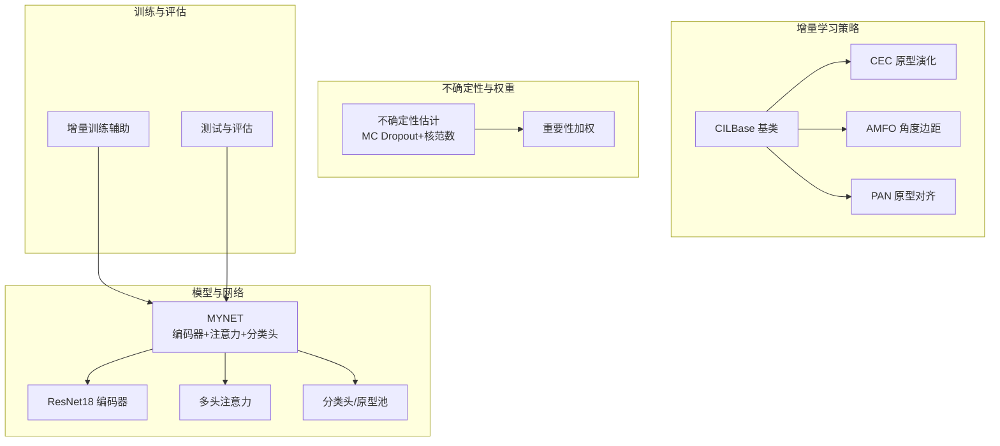
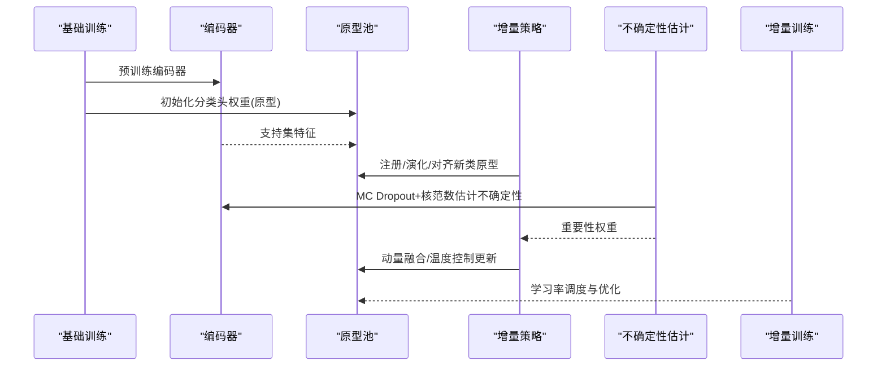
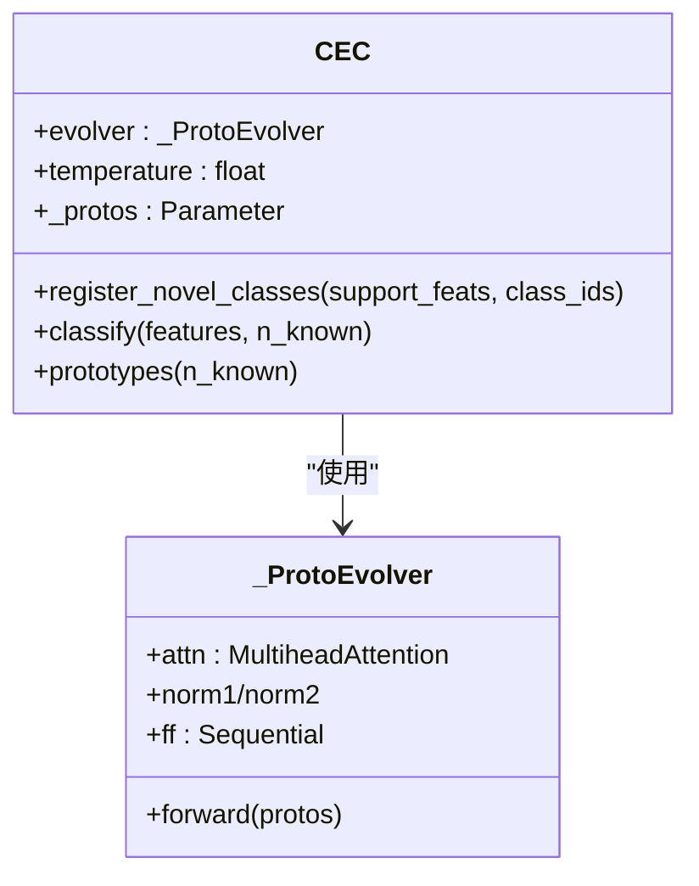
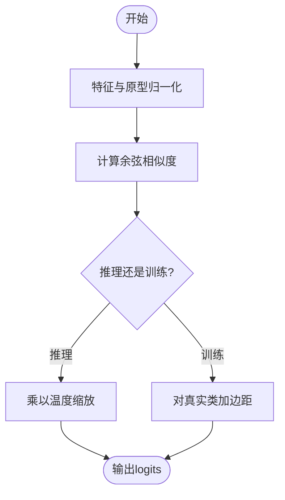
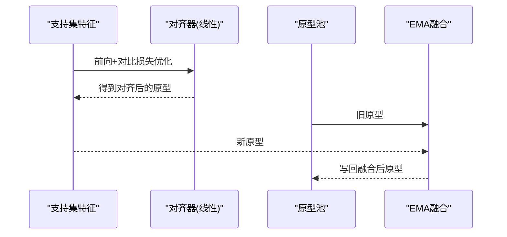
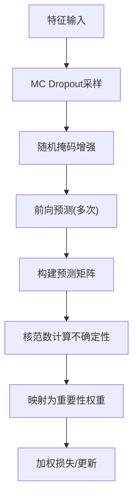
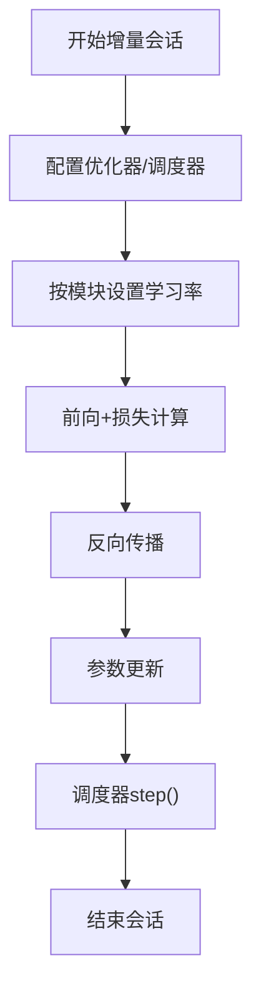
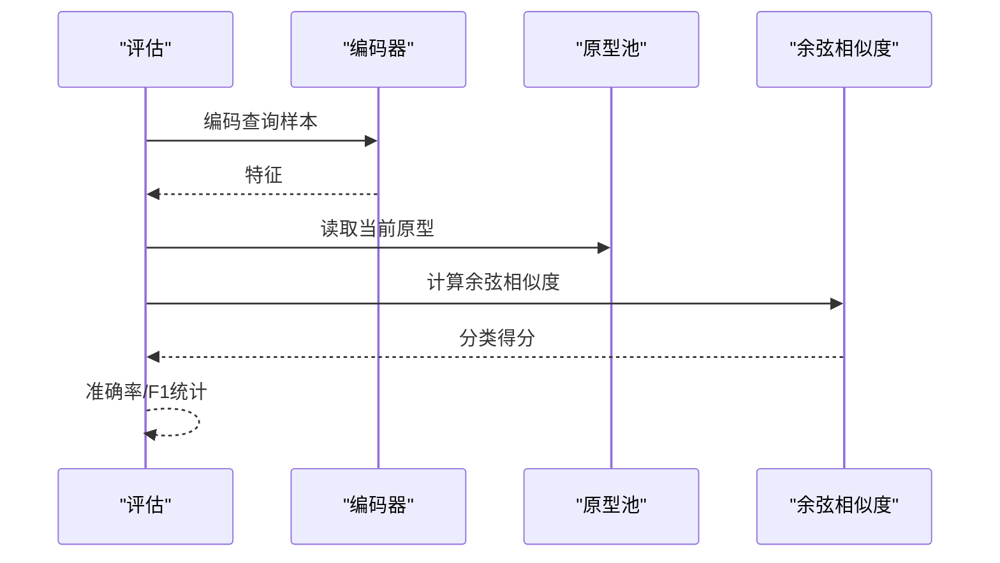
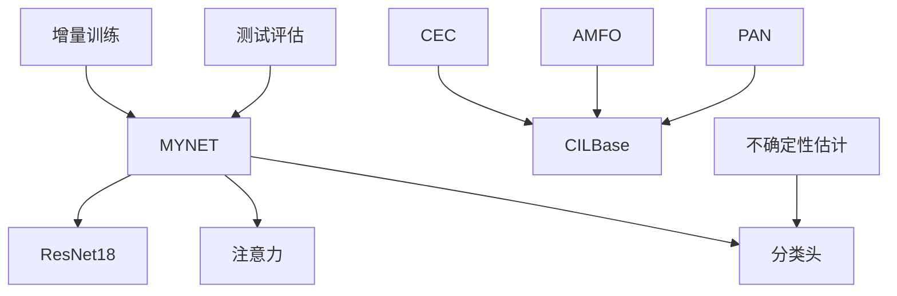

# 灾难性遗忘缓解

<cite>
**本文引用的文件**
- [network.py](file://network.py)
- [models/baselines/base.py](file://models/baselines/base.py)
- [models/baselines/cil_methods/cec.py](file://models/baselines/cil_methods/cec.py)
- [models/baselines/cil_methods/amfo.py](file://models/baselines/cil_methods/amfo.py)
- [models/baselines/cil_methods/pan.py](file://models/baselines/cil_methods/pan.py)
- [models/UClassifier.py](file://models/UClassifier.py)
- [models/incremental_train_helper.py](file://models/incremental_train_helper.py)
- [train.py](file://train.py)
- [test.py](file://test.py)
- [center_shifts.csv](file://center_shifts.csv)
- [center_shifts_10.csv](file://center_shifts_10.csv)
</cite>

## 目录
1. [简介](#简介)
2. [项目结构](#项目结构)
3. [核心组件](#核心组件)
4. [架构总览](#架构总览)
5. [详细组件分析](#详细组件分析)
6. [依赖分析](#依赖分析)
7. [性能考量](#性能考量)
8. [故障排查指南](#故障排查指南)
9. [结论](#结论)
10. [附录](#附录)

## 简介
本文件围绕VAZE系统在增量学习场景下的灾难性遗忘（Catastrophic Forgetting, CF）缓解机制展开，系统梳理并解释CF现象的本质、对旧知识保持与模型性能的影响，以及本项目中采用的多种缓解策略：原型演化与对齐、不确定性估计与重要性加权、动量融合与温度控制、以及学习率调度等。文档同时给出关键流程的时序与数据流图示，帮助读者快速把握VAZE在增量语境下如何“记住旧知识、学会新知识”。

## 项目结构
VAZE系统主要由以下模块构成：
- 网络与特征编码：MYNET主干网络、ResNet18编码器、注意力模块、分类头等
- 增量学习基类与策略：CIL基类接口与三种典型策略（CEC、AMFO、PAN）
- 不确定性估计与重要性加权：基于MC Dropout与核范数的不确定性度量
- 训练与评估：增量训练辅助、标准训练、测试与评估脚本
- 数据与可视化：聚类与原型变化的CSV记录

**图表来源**
- [network.py:18-50](file://network.py#L18-L50)
- [models/baselines/base.py:11-33](file://models/baselines/base.py#L11-L33)
- [models/baselines/cil_methods/cec.py:41-83](file://models/baselines/cil_methods/cec.py#L41-L83)
- [models/baselines/cil_methods/amfo.py:19-65](file://models/baselines/cil_methods/amfo.py#L19-L65)
- [models/baselines/cil_methods/pan.py:24-109](file://models/baselines/cil_methods/pan.py#L24-L109)
- [models/UClassifier.py:7-41](file://models/UClassifier.py#L7-L41)
- [models/incremental_train_helper.py:11-25](file://models/incremental_train_helper.py#L11-L25)
- [test.py:740-758](file://test.py#L740-L758)

**章节来源**
- [network.py:18-50](file://network.py#L18-L50)
- [models/baselines/base.py:11-33](file://models/baselines/base.py#L11-L33)
- [models/baselines/cil_methods/cec.py:41-83](file://models/baselines/cil_methods/cec.py#L41-L83)
- [models/baselines/cil_methods/amfo.py:19-65](file://models/baselines/cil_methods/amfo.py#L19-L65)
- [models/baselines/cil_methods/pan.py:24-109](file://models/baselines/cil_methods/pan.py#L24-L109)
- [models/UClassifier.py:7-41](file://models/UClassifier.py#L7-L41)
- [models/incremental_train_helper.py:11-25](file://models/incremental_train_helper.py#L11-L25)
- [test.py:740-758](file://test.py#L740-L758)

## 核心组件
- MYNET主干网络：负责音频特征提取、注意力融合与分类头（原型池）输出
- CILBase基类：定义增量学习接口（注册新类原型、分类）
- CEC/AMFO/PAN：三类增量策略，分别通过“原型演化/冻结”、“角度边距”、“原型对齐+EMA”缓解CF
- 不确定性估计与重要性加权：通过MC Dropout与核范数计算样本不确定性，生成重要性权重，指导增量更新
- 增量训练辅助：学习率调度、优化器配置、增量会话训练流程
- 测试与评估：增量测试、已知类测试、原型相似度/位移分析

**章节来源**
- [network.py:18-50](file://network.py#L18-L50)
- [models/baselines/base.py:11-33](file://models/baselines/base.py#L11-L33)
- [models/baselines/cil_methods/cec.py:41-83](file://models/baselines/cil_methods/cec.py#L41-L83)
- [models/baselines/cil_methods/amfo.py:19-65](file://models/baselines/cil_methods/amfo.py#L19-L65)
- [models/baselines/cil_methods/pan.py:24-109](file://models/baselines/cil_methods/pan.py#L24-L109)
- [models/UClassifier.py:7-41](file://models/UClassifier.py#L7-L41)
- [models/incremental_train_helper.py:11-25](file://models/incremental_train_helper.py#L11-L25)
- [test.py:740-758](file://test.py#L740-L758)

## 架构总览
VAZE在增量学习中的整体工作流如下：
- 基础阶段：预训练编码器与分类头（fc权重）
- 增量阶段：每新增若干类，使用策略（CEC/AMFO/PAN）更新或对齐原型，结合不确定性加权与动量融合，避免覆盖旧知识
- 评估阶段：在已知类与新类上进行增量测试，记录性能与原型变化

**图表来源**
- [network.py:405-461](file://network.py#L405-L461)
- [models/baselines/cil_methods/cec.py:52-83](file://models/baselines/cil_methods/cec.py#L52-L83)
- [models/baselines/cil_methods/amfo.py:30-65](file://models/baselines/cil_methods/amfo.py#L30-L65)
- [models/baselines/cil_methods/pan.py:73-109](file://models/baselines/cil_methods/pan.py#L73-L109)
- [models/UClassifier.py:42-122](file://models/UClassifier.py#L42-L122)
- [models/incremental_train_helper.py:11-25](file://models/incremental_train_helper.py#L11-L25)

## 详细组件分析

### CEC（持续演化的分类器）
- 原理要点
  - 使用轻量多头自注意力对现有原型进行“演化”，在新会话中刷新原型表示，保持与上下文一致
  - 分类时使用余弦相似度与温度缩放
- 与CF缓解的关系
  - 通过“演化”而非“冻结”旧原型，降低旧知识被覆盖的概率
  - 温度参数控制判别锐利度，有助于稳定旧类边界
- 实现要点
  - 原型注册时先扩展至所需尺寸，再经自注意力演化，最后写回参数

**图表来源**
- [models/baselines/cil_methods/cec.py:19-83](file://models/baselines/cil_methods/cec.py#L19-L83)

**章节来源**
- [models/baselines/cil_methods/cec.py:41-83](file://models/baselines/cil_methods/cec.py#L41-L83)

### AMFO（角度边距优化）
- 原理要点
  - 在推理时使用缩放余弦相似度；在训练时对真实类的夹角增加加性边距，提升判别边界
  - 基类原型冻结，仅新增类原型可变
- 与CF缓解的关系
  - 冻结基类原型，直接避免旧知识被覆盖
  - 新类通过“边距”强化边界，减少对旧类决策面的扰动
- 实现要点
  - 注册新类时按需扩展原型池，仅对新类位置更新

**图表来源**
- [models/baselines/cil_methods/amfo.py:52-65](file://models/baselines/cil_methods/amfo.py#L52-L65)

**章节来源**
- [models/baselines/cil_methods/amfo.py:19-65](file://models/baselines/cil_methods/amfo.py#L19-L65)

### PAN（原型对齐网络）
- 原理要点
  - 使用线性对齐器与对比目标在支持集上进行端到端对齐
  - 采用指数滑动平均（EMA）融合旧原型与新对齐原型
- 与CF缓解的关系
  - 对齐器让新原型与当前流形对齐，EMA避免剧烈跳变
  - 无需额外标签，纯推理时使用，适合在线增量
- 实现要点
  - 支持三维支持特征聚合或显式标签输入，最终写回原型池

**图表来源**
- [models/baselines/cil_methods/pan.py:38-103](file://models/baselines/cil_methods/pan.py#L38-L103)

**章节来源**
- [models/baselines/cil_methods/pan.py:24-109](file://models/baselines/cil_methods/pan.py#L24-L109)

### 不确定性估计与重要性加权
- 原理要点
  - 基于MC Dropout与随机掩码增强，多次采样得到预测矩阵，用核范数衡量不确定性
  - 将不确定性映射为重要性权重，低不确定性样本赋予更高权重
- 与CF缓解的关系
  - 在增量更新中对“高置信度样本”给予更大权重，降低噪声对旧类原型的污染
  - 与动量融合结合，进一步稳定旧知识
- 实现要点
  - 提供启用/禁用不确定性估计的开关，支持缓存重要性权重

**图表来源**
- [models/UClassifier.py:42-122](file://models/UClassifier.py#L42-L122)
- [models/UClassifier.py:382-405](file://models/UClassifier.py#L382-L405)

**章节来源**
- [models/UClassifier.py:7-41](file://models/UClassifier.py#L7-L41)
- [models/UClassifier.py:42-122](file://models/UClassifier.py#L42-L122)
- [models/UClassifier.py:382-405](file://models/UClassifier.py#L382-L405)

### 增量训练辅助与学习率调度
- 原理要点
  - 针对增量场景配置优化器与调度器，支持阶梯/里程碑衰减
  - 增量会话中对编码器、注意力、分类头等模块设置不同学习率
- 与CF缓解的关系
  - 合理的学习率衰减与分层学习率有助于稳定旧参数，避免“大步快跑”导致的CF
- 实现要点
  - 提供标准增量训练函数与在线原型适应流程

**图表来源**
- [models/incremental_train_helper.py:11-25](file://models/incremental_train_helper.py#L11-L25)
- [models/incremental_train_helper.py:28-111](file://models/incremental_train_helper.py#L28-L111)
- [models/incremental_train_helper.py:113-156](file://models/incremental_train_helper.py#L113-L156)

**章节来源**
- [models/incremental_train_helper.py:11-25](file://models/incremental_train_helper.py#L11-L25)
- [models/incremental_train_helper.py:28-111](file://models/incremental_train_helper.py#L28-L111)
- [models/incremental_train_helper.py:113-156](file://models/incremental_train_helper.py#L113-L156)

### 测试与评估流程
- 原理要点
  - 增量测试：在当前已见类别集合上进行余弦相似度分类
  - 已知类测试：评估旧类在新模型上的准确率与F1
- 与CF缓解的关系
  - 通过增量测试曲线观察旧类性能退化趋势，指导策略选择与参数调优

**图表来源**
- [test.py:740-758](file://test.py#L740-L758)
- [test.py:763-797](file://test.py#L763-L797)

**章节来源**
- [test.py:740-758](file://test.py#L740-L758)
- [test.py:763-797](file://test.py#L763-L797)

## 依赖分析
- 组件耦合
  - MYNET与编码器、注意力、分类头紧密耦合，形成端到端特征到分类的路径
  - CIL策略依赖CILBase接口，统一注册与分类行为
  - 不确定性估计模块与分类头配合，提供重要性权重
- 外部依赖
  - 数据加载与增量训练流程依赖训练脚本与数据模块
  - 原型变化分析依赖CSV记录文件

**图表来源**
- [network.py:18-50](file://network.py#L18-L50)
- [models/baselines/base.py:11-33](file://models/baselines/base.py#L11-L33)
- [models/baselines/cil_methods/cec.py:41-83](file://models/baselines/cil_methods/cec.py#L41-L83)
- [models/baselines/cil_methods/amfo.py:19-65](file://models/baselines/cil_methods/amfo.py#L19-L65)
- [models/baselines/cil_methods/pan.py:24-109](file://models/baselines/cil_methods/pan.py#L24-L109)
- [models/UClassifier.py:7-41](file://models/UClassifier.py#L7-L41)
- [models/incremental_train_helper.py:11-25](file://models/incremental_train_helper.py#L11-L25)
- [test.py:740-758](file://test.py#L740-L758)

**章节来源**
- [network.py:18-50](file://network.py#L18-L50)
- [models/baselines/base.py:11-33](file://models/baselines/base.py#L11-L33)
- [models/baselines/cil_methods/cec.py:41-83](file://models/baselines/cil_methods/cec.py#L41-L83)
- [models/baselines/cil_methods/amfo.py:19-65](file://models/baselines/cil_methods/amfo.py#L19-L65)
- [models/baselines/cil_methods/pan.py:24-109](file://models/baselines/cil_methods/pan.py#L24-L109)
- [models/UClassifier.py:7-41](file://models/UClassifier.py#L7-L41)
- [models/incremental_train_helper.py:11-25](file://models/incremental_train_helper.py#L11-L25)
- [test.py:740-758](file://test.py#L740-L758)

## 性能考量
- 计算复杂度
  - 增量策略主要在原型层面操作，复杂度与类别数线性相关；CEC的自注意力在新类规模上增加开销
  - 不确定性估计引入多次前向，带来推理时延；可通过采样次数与掩码比例调节
- 内存占用
  - 原型池随增量增长；温度与EMA参数占用少量额外内存
- 训练稳定性
  - 学习率调度与分层学习率有助于稳定旧参数更新
  - 动量融合与温度控制可缓解边界抖动

## 故障排查指南
- 增量测试性能骤降
  - 检查是否正确冻结基类原型（AMFO）或使用EMA融合（PAN）
  - 核对温度参数与学习率调度是否合理
- 原型漂移/位移异常
  - 查看center_shifts系列CSV，定位出现显著位移的类别
  - 结合不确定性权重，检查是否存在高不确定性样本污染
- 训练不稳定
  - 适当降低学习率或增大EMA动量
  - 在增量训练中启用分层学习率与合适调度策略

**章节来源**
- [models/baselines/cil_methods/amfo.py:19-65](file://models/baselines/cil_methods/amfo.py#L19-L65)
- [models/baselines/cil_methods/pan.py:24-109](file://models/baselines/cil_methods/pan.py#L24-L109)
- [models/incremental_train_helper.py:11-25](file://models/incremental_train_helper.py#L11-L25)
- [center_shifts.csv:1-21](file://center_shifts.csv#L1-L21)
- [center_shifts_10.csv:1-11](file://center_shifts_10.csv#L1-L11)

## 结论
VAZE通过“原型演化/冻结/对齐”三大策略与“不确定性估计+重要性加权+动量融合+温度控制+学习率调度”等工程手段，在增量学习中有效缓解灾难性遗忘。实践中可根据任务特性与资源约束选择合适策略：基类稳定优先选AMFO，需要在线对齐选PAN，追求原型一致性与稳定性选CEC。配合严格的评估与监控（如center_shifts），可实现旧知识的长期保持与新知识的稳步学习。

## 附录
- 原型更新与温度控制
  - 通过余弦相似度与温度缩放实现稳定判别
  - 在增量微调中对新类原型进行动量融合，避免覆盖旧知识
- 数据与可视化
  - center_shifts系列CSV记录类别原型的范数与位移，便于分析CF影响

**章节来源**
- [network.py:436-441](file://network.py#L436-L441)
- [network.py:442-461](file://network.py#L442-L461)
- [center_shifts.csv:1-21](file://center_shifts.csv#L1-L21)
- [center_shifts_10.csv:1-11](file://center_shifts_10.csv#L1-L11)