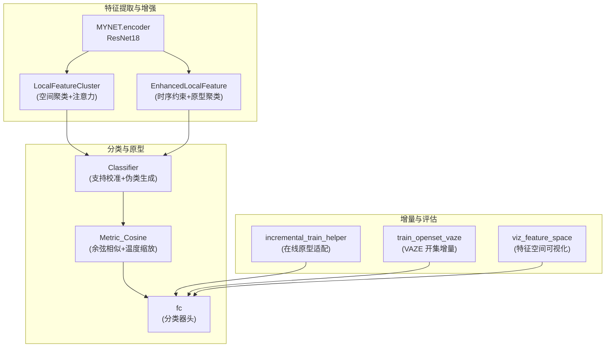
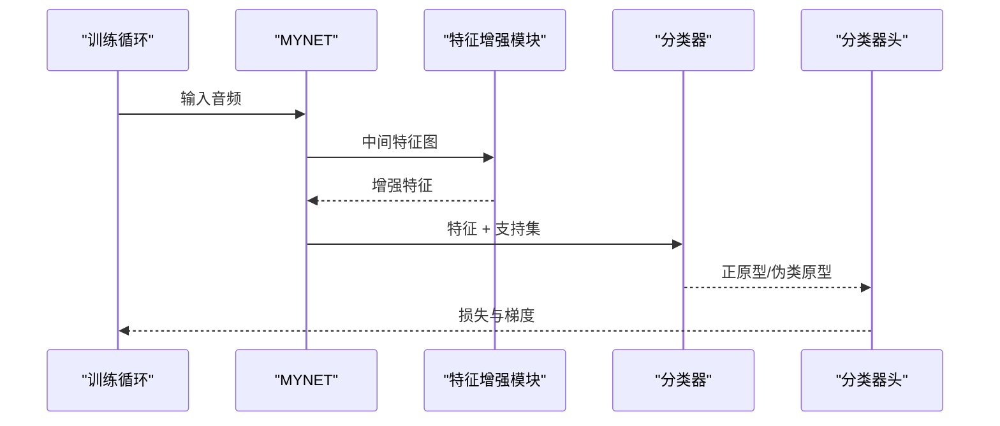
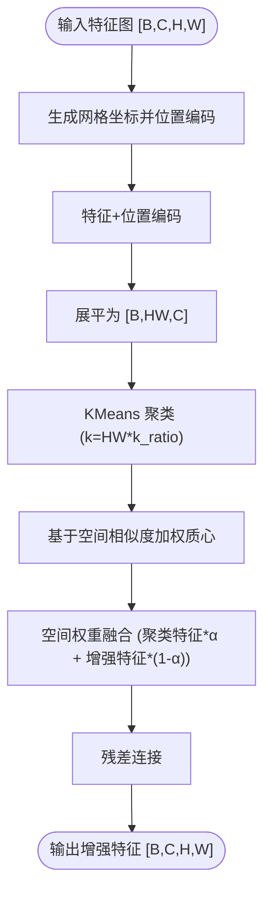
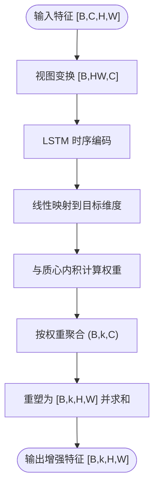
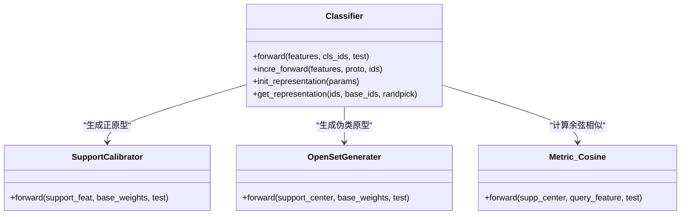
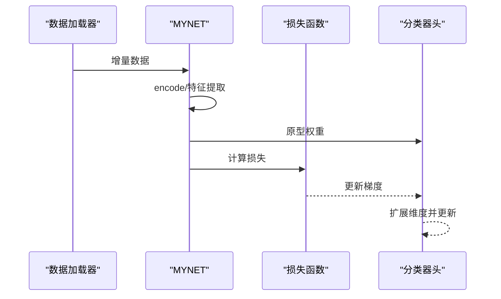
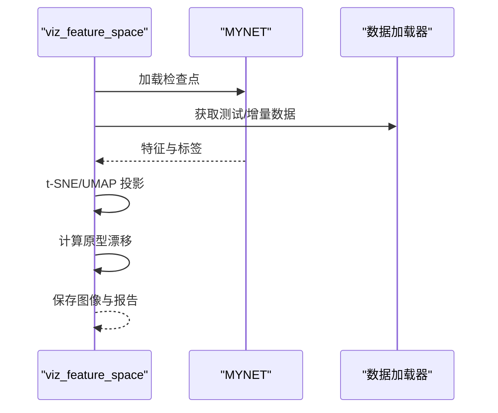
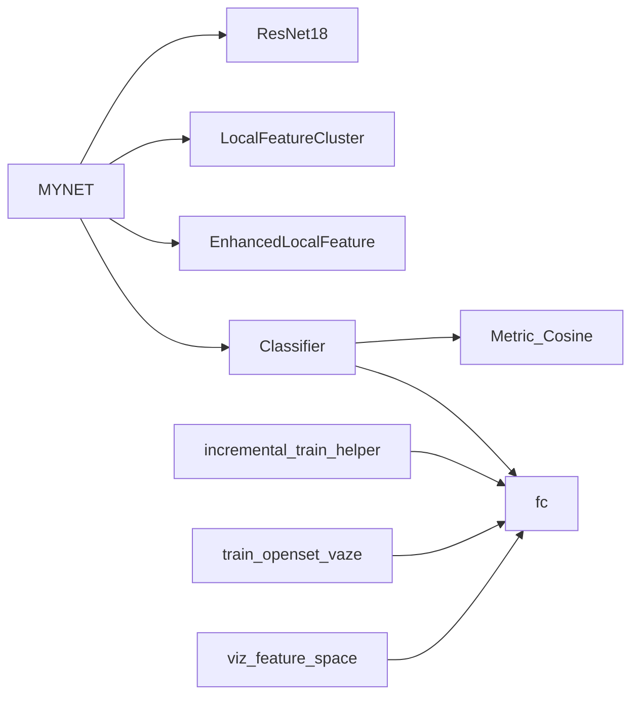

# 特征空间适应

<cite>
**本文引用的文件**
- [network.py](file://network.py)
- [models/resnet_enhancer.py](file://models/resnet_enhancer.py)
- [models/feature_enhancer.py](file://models/feature_enhancer.py)
- [models/AttnClassifier.py](file://models/AttnClassifier.py)
- [models/UClassifier.py](file://models/UClassifier.py)
- [models/base.py](file://models/base.py)
- [models/incremental_train_helper.py](file://models/incremental_train_helper.py)
- [train_openset_vaze.py](file://train_openset_vaze.py)
- [scripts/viz_feature_space.py](file://scripts/viz_feature_space.py)
- [utils/utils.py](file://utils/utils.py)
- [train_unopenset.py](file://train_unopenset.py)
- [test.py](file://test.py)
- [test_uncertainty.py](file://test_uncertainty.py)
- [threshold_free.py.bak](file://threshold_free.py.bak)
</cite>

## 目录
1. [简介](#简介)
2. [项目结构](#项目结构)
3. [核心组件](#核心组件)
4. [架构总览](#架构总览)
5. [详细组件分析](#详细组件分析)
6. [依赖分析](#依赖分析)
7. [性能考量](#性能考量)
8. [故障排查指南](#故障排查指南)
9. [结论](#结论)
10. [附录](#附录)

## 简介
本技术文档围绕 VAZE 系统的特征空间适应机制展开，聚焦增量学习场景下如何在不破坏已有知识的前提下，对特征表示进行学习与转换，使新类别的特征与现有特征空间保持一致。文档涵盖以下主题：
- 特征空间适应的重要性与作用：在增量学习中，随着新类别的加入，特征空间需动态扩展并调整分类边界，以维持良好的泛化能力。
- 特征维度扩展与分类边界调整：通过原型更新、分类器头扩展与温度缩放等手段，实现特征维度扩展与边界调整。
- 特征表示的学习与转换：利用时序约束、注意力与聚类等机制，提升特征的空间与语义一致性。
- 归一化与标准化策略：批量归一化与层归一化在特征空间中的应用，以及余弦相似度与温度缩放在分类中的作用。
- 特征空间变换实现：线性变换与非线性映射方法，包括注意力、卷积与聚类融合。
- 评估指标与质量度量：基于原型漂移、聚类质量与分类准确率的评估体系，展示不同适应策略对泛化能力的影响。
- 最佳实践与自定义策略：为开发者提供特征空间设计与增量适应的实施建议。

## 项目结构
VAZE 系统采用模块化设计，核心由特征提取器、特征增强模块、分类器与增量训练辅助模块组成。训练脚本与可视化脚本分别负责模型训练、增量评估与特征空间可视化。

图表来源
- [network.py](file://network.py)
- [models/resnet_enhancer.py](file://models/resnet_enhancer.py)
- [models/feature_enhancer.py](file://models/feature_enhancer.py)
- [models/AttnClassifier.py](file://models/AttnClassifier.py)
- [models/incremental_train_helper.py](file://models/incremental_train_helper.py)
- [train_openset_vaze.py](file://train_openset_vaze.py)
- [scripts/viz_feature_space.py](file://scripts/viz_feature_space.py)

章节来源
- [network.py](file://network.py)
- [models/resnet_enhancer.py](file://models/resnet_enhancer.py)
- [models/feature_enhancer.py](file://models/feature_enhancer.py)
- [models/AttnClassifier.py](file://models/AttnClassifier.py)
- [models/incremental_train_helper.py](file://models/incremental_train_helper.py)
- [train_openset_vaze.py](file://train_openset_vaze.py)
- [scripts/viz_feature_space.py](file://scripts/viz_feature_space.py)

## 核心组件
- 特征提取器与编码路径：MYNET 提供音频到特征的完整编码链路，支持多种模式（encoder/openmeta），并在不同阶段输出特征或 logits。
- 特征增强模块：
  - LocalFeatureCluster：基于空间位置相似度与可学习质心的聚类增强，结合注意力与空间权重，实现局部细节与全局结构的融合。
  - EnhancedLocalFeature：引入 LSTM 时序约束与原型聚类，提升跨时间步的一致性与稳定性。
- 分类器与原型：
  - Classifier：支持校准与伪类生成，结合余弦相似度与温度缩放，形成稳定的分类边界。
  - fc：分类器头，支持在线扩展以容纳新增类别。
- 增量训练辅助：
  - incremental_train_helper：提供在线原型适配与增量微调流程。
  - train_openset_vaze：基于 VAZE 的开集增量策略，通过未知样本检测与聚类扩展分类器头。
- 可视化与评估：
  - viz_feature_space：对特征与原型进行 t-SNE/UMAP 投影与原型漂移分析。
  - FSEval 与相关测试脚本：提供增量测试、聚类评估与指标统计。

章节来源
- [network.py](file://network.py)
- [models/resnet_enhancer.py](file://models/resnet_enhancer.py)
- [models/feature_enhancer.py](file://models/feature_enhancer.py)
- [models/AttnClassifier.py](file://models/AttnClassifier.py)
- [models/incremental_train_helper.py](file://models/incremental_train_helper.py)
- [train_openset_vaze.py](file://train_openset_vaze.py)
- [scripts/viz_feature_space.py](file://scripts/viz_feature_space.py)

## 架构总览
VAZE 的特征空间适应贯穿训练与增量阶段：
- 训练阶段：通过增强模块对中间特征进行空间与时序增强，提升特征判别性；分类器使用余弦相似与温度缩放构建稳定边界。
- 增量阶段：检测未知样本，聚类生成新原型，扩展分类器头维度，同时通过在线原型适配保持边界稳定。

图表来源
- [network.py](file://network.py)
- [models/resnet_enhancer.py](file://models/resnet_enhancer.py)
- [models/AttnClassifier.py](file://models/AttnClassifier.py)

## 详细组件分析

### 特征增强：LocalFeatureCluster（空间聚类与注意力融合）
- 目标：在空间维度上对特征进行聚类与加权融合，保留局部细节的同时增强全局结构。
- 关键流程：
  - 位置编码：生成网格坐标，对时间与频率维度分别嵌入，再通过门控融合。
  - 局部聚类：对展平特征进行 KMeans 聚类，按空间相似度加权质心。
  - 空间权重：基于残差特征计算空间权重，控制聚类特征与增强特征的融合比例。
  - 残差连接：保证特征增强不破坏原始特征，提升训练稳定性。
- 设备一致性：模块内部维护设备跟踪，确保参数与输入在同一设备上。

图表来源
- [models/resnet_enhancer.py](file://models/resnet_enhancer.py)
- [utils/utils.py](file://utils/utils.py)

章节来源
- [models/resnet_enhancer.py](file://models/resnet_enhancer.py)
- [utils/utils.py](file://utils/utils.py)

### 特征增强：EnhancedLocalFeature（时序约束与原型聚类）
- 目标：在空间展平后引入 LSTM 时序约束，结合原型聚类，提升跨时间步的一致性。
- 关键流程：
  - 维度修正：若通道数不匹配，通过线性层调整至目标维度。
  - 时序特征：对空间展平特征进行 LSTM 编码，得到时序表征。
  - 动态权重：通过与可学习质心的内积计算注意力权重，进行加权聚合。
  - 形状恢复：将聚合结果重塑为新的特征图，保持空间结构。

图表来源
- [models/feature_enhancer.py](file://models/feature_enhancer.py)

章节来源
- [models/feature_enhancer.py](file://models/feature_enhancer.py)

### 分类器与原型：Classifier 与 Metric_Cosine
- SupportCalibrator：对支持集特征进行校准，生成正原型；可选语义融合门控。
- OpenSetGenerater：基于正原型与基础权重生成伪类原型，形成开放集边界。
- Metric_Cosine：对查询与原型进行余弦相似计算，并通过温度参数缩放，稳定分类边界。

图表来源
- [models/AttnClassifier.py](file://models/AttnClassifier.py)

章节来源
- [models/AttnClassifier.py](file://models/AttnClassifier.py)

### 增量训练与在线适配
- 在线原型适配：在预训练数据上对特征与原型进行对比学习，优化分类器头权重，提升边界稳定性。
- VAZE 开集增量：通过阈值策略检测未知样本，聚类生成新原型并扩展分类器头，实现无监督增量。

图表来源
- [models/incremental_train_helper.py](file://models/incremental_train_helper.py)
- [train_openset_vaze.py](file://train_openset_vaze.py)

章节来源
- [models/incremental_train_helper.py](file://models/incremental_train_helper.py)
- [train_openset_vaze.py](file://train_openset_vaze.py)

### 特征空间可视化与评估
- 可视化：对特征与原型进行 t-SNE/UMAP 投影，观察类别分离度与原型漂移。
- 评估：通过聚类质量（轮廓系数、簇内/簇间距离比）与分类准确率评估适应效果。

图表来源
- [scripts/viz_feature_space.py](file://scripts/viz_feature_space.py)

章节来源
- [scripts/viz_feature_space.py](file://scripts/viz_feature_space.py)

## 依赖分析
- 组件耦合：
  - MYNET 与增强模块：通过中间特征图连接，增强模块在编码路径中插入，不影响下游分类器。
  - 分类器与原型：Classifier 依赖 fc 权重作为基础原型，通过校准与生成器动态扩展。
  - 增量模块：与 fc 头扩展紧密耦合，需保证维度一致性与权重迁移。
- 外部依赖：
  - scikit-learn：KMeans、聚类评估指标。
  - matplotlib/UMAP：可视化工具。
  - torch：深度学习框架。

图表来源
- [network.py](file://network.py)
- [models/resnet_enhancer.py](file://models/resnet_enhancer.py)
- [models/feature_enhancer.py](file://models/feature_enhancer.py)
- [models/AttnClassifier.py](file://models/AttnClassifier.py)
- [models/incremental_train_helper.py](file://models/incremental_train_helper.py)
- [train_openset_vaze.py](file://train_openset_vaze.py)
- [scripts/viz_feature_space.py](file://scripts/viz_feature_space.py)

章节来源
- [network.py](file://network.py)
- [models/resnet_enhancer.py](file://models/resnet_enhancer.py)
- [models/feature_enhancer.py](file://models/feature_enhancer.py)
- [models/AttnClassifier.py](file://models/AttnClassifier.py)
- [models/incremental_train_helper.py](file://models/incremental_train_helper.py)
- [train_openset_vaze.py](file://train_openset_vaze.py)
- [scripts/viz_feature_space.py](file://scripts/viz_feature_space.py)

## 性能考量
- 计算复杂度：
  - 聚类与注意力：与特征空间分辨率与质心数量相关，可通过降低 k_ratio 与合理设置温度参数平衡精度与速度。
  - LSTM 时序约束：增加时间步维度的计算开销，适合长序列任务。
- 内存占用：
  - 增量扩展分类器头时需注意显存峰值，建议分批处理与及时释放中间变量。
- 稳定性：
  - 温度缩放与余弦相似有助于稳定边界，避免过拟合。
  - 在线原型适配可缓解灾难性遗忘，但需谨慎设置学习率与损失权重。

## 故障排查指南
- 维度不匹配：
  - 现象：增强模块报错或输出形状异常。
  - 排查：确认输入特征通道数与模块期望一致，必要时使用维度修正层。
- 设备不一致：
  - 现象：模块参数与输入不在同一设备导致运行错误。
  - 排查：检查增强模块的设备跟踪逻辑，确保在 forward 前后设备一致。
- 增量失败：
  - 现象：新增类别分类性能下降或崩溃。
  - 排查：检查分类器头扩展逻辑、原型初始化与在线适配流程；确保温度与损失权重合理。

章节来源
- [models/resnet_enhancer.py](file://models/resnet_enhancer.py)
- [models/feature_enhancer.py](file://models/feature_enhancer.py)
- [models/incremental_train_helper.py](file://models/incremental_train_helper.py)

## 结论
VAZE 的特征空间适应机制通过“空间聚类+注意力融合”和“时序约束+原型聚类”的双路径增强，结合余弦相似与温度缩放的分类策略，在增量学习中实现了特征维度扩展与分类边界的稳健调整。配合 VAZE 的开集增量策略与可视化评估工具，能够有效监控原型漂移与聚类质量，指导模型在新类别到来时保持良好泛化能力。

## 附录
- 评估指标建议：
  - 聚类质量：轮廓系数、簇内/簇间距离比。
  - 分类性能：增量准确率、F1 分数、AUROC。
  - 原型稳定性：原型漂移（均值欧氏距离）。
- 最佳实践：
  - 在线原型适配：在预热阶段使用较小学习率，逐步增大。
  - 温度参数：余弦分类默认温度可按数据集校准，避免过锐利或过平坦的分布。
  - 增量扩展：聚类数量与 k_ratio 成正比，避免过度聚类导致信息丢失。
  - 可视化：定期输出 t-SNE/UMAP 与原型漂移曲线，辅助诊断与调参。