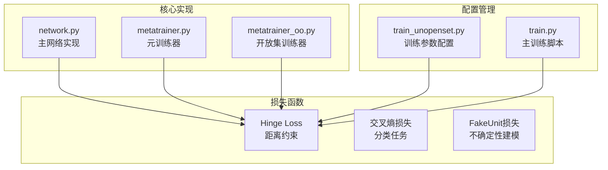
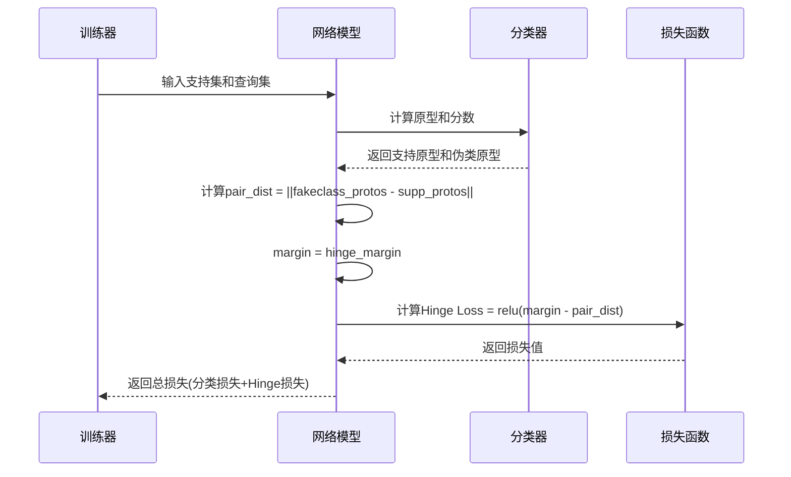
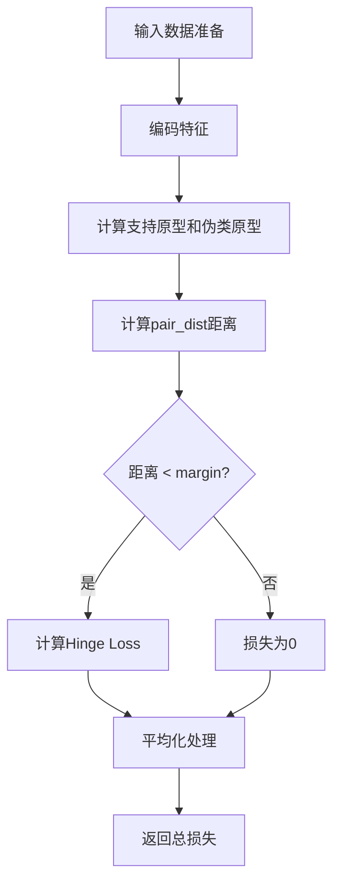
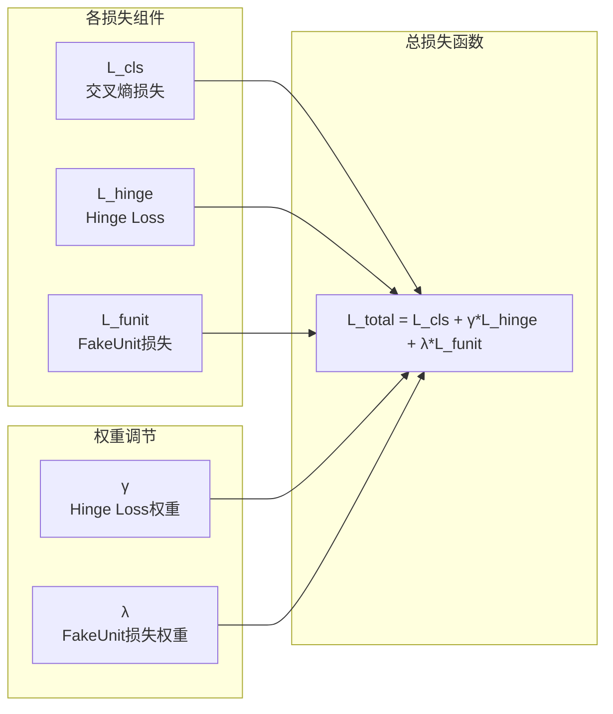
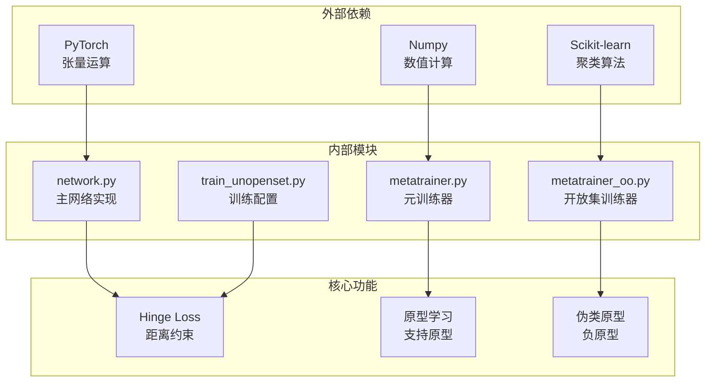

# Hinge Loss损失函数

<cite>
**本文档引用的文件**
- [network.py](file://network.py)
- [metatrainer.py](file://models/metatrainer.py)
- [metatrainer_oo.py](file://models/metatrainer_oo.py)
- [train_unopenset.py](file://train_unopenset.py)
- [train.py](file://train.py)
</cite>

## 目录
1. [简介](#简介)
2. [项目结构](#项目结构)
3. [核心组件](#核心组件)
4. [架构概览](#架构概览)
5. [详细组件分析](#详细组件分析)
6. [依赖关系分析](#依赖关系分析)
7. [性能考虑](#性能考虑)
8. [故障排除指南](#故障排除指南)
9. [结论](#结论)

## 简介

VAZE系统中的Hinge Loss损失函数是开放集识别的核心组件，通过距离约束来区分已知和未知类别的关键机制。该损失函数基于原型学习框架，在元训练过程中强制生成器将负原型（伪类原型）与支持原型之间的距离保持在指定的边界之外。

Hinge Loss在VAZE系统中的作用机制：
- **距离约束**：通过计算伪类原型与支持原型之间的欧几里得距离，确保两者保持一定的最小距离
- **开放集检测**：当未知样本的特征与已知类原型距离超过阈值时，将其识别为未知类别
- **原型分离**：通过margin参数控制已知类别间的分离度，防止类别混淆

## 项目结构

VAZE系统的Hinge Loss相关代码分布在以下关键文件中：



**图表来源**
- [network.py:101-151](file://network.py#L101-L151)
- [metatrainer.py:130-142](file://models/metatrainer.py#L130-L142)
- [metatrainer_oo.py:130-142](file://models/metatrainer_oo.py#L130-L142)

**章节来源**
- [network.py:101-151](file://network.py#L101-L151)
- [train_unopenset.py:230-240](file://train_unopenset.py#L230-L240)

## 核心组件

### Hinge Loss数学公式

Hinge Loss的数学表达式为：

```
L_hinge = mean(max(0, margin - ||fakeclass_protos - supp_protos||_2))
```

其中：
- `fakeclass_protos`：伪类原型（负原型）
- `supp_protos`：支持原型（正原型）
- `margin`：距离边界阈值
- `||·||_2`：欧几里得范数

### 实现细节

Hinge Loss在VAZE系统中的具体实现包含以下关键步骤：

1. **距离计算**：使用欧几里得距离度量伪类原型与支持原型之间的距离
2. **阈值比较**：将计算得到的距离与预设的margin进行比较
3. **损失计算**：仅当距离小于margin时产生非零损失
4. **平均化处理**：对批次内的所有样本求平均，得到最终的损失值

**章节来源**
- [network.py:133-146](file://network.py#L133-L146)

## 架构概览

VAZE系统的Hinge Loss在整个训练流程中的位置如下：



**图表来源**
- [network.py:101-151](file://network.py#L101-L151)
- [metatrainer.py:136-142](file://models/metatrainer.py#L136-L142)

## 详细组件分析

### Hinge Loss在open_forward函数中的应用

Hinge Loss在VAZE系统的open_forward函数中发挥着核心作用：



**图表来源**
- [network.py:101-151](file://network.py#L101-L151)

### margin参数的作用机制

margin参数在Hinge Loss中起到关键的调节作用：

| margin值 | 距离约束效果 | 类别分离度 | 模型行为 |
|---------|------------|-----------|----------|
| 较小值(如0.5) | 松散约束 | 低分离度 | 容易类别混淆 |
| 中等值(如1.0-2.0) | 适中约束 | 适中分离度 | 平衡的开放集识别 |
| 较大值(如>3.0) | 严格约束 | 高分离度 | 可能导致欠拟合 |

### torch.relu函数的应用

torch.relu函数在Hinge Loss中的应用体现了以下特点：

1. **非线性激活**：将距离差值转换为非负损失
2. **梯度特性**：在margin处提供清晰的梯度信号
3. **稀疏性**：当距离满足约束时，损失为零，减少不必要的梯度更新

**章节来源**
- [network.py:135-139](file://network.py#L135-L139)

### 损失函数组合策略

VAZE系统采用多种损失函数的组合来实现更好的开放集识别效果：



**图表来源**
- [metatrainer.py:139-142](file://models/metatrainer.py#L139-L142)
- [metatrainer_oo.py:139-142](file://models/metatrainer_oo.py#L139-L142)

**章节来源**
- [metatrainer.py:139-142](file://models/metatrainer.py#L139-L142)
- [metatrainer_oo.py:139-142](file://models/metatrainer_oo.py#L139-L142)

### 不同margin值对模型性能的影响

#### 过小margin值的问题

当margin设置过小时，会出现以下问题：

1. **类别混淆增加**：支持原型与伪类原型距离过近，导致分类边界模糊
2. **开放集识别困难**：未知样本容易被错误分类为已知类别
3. **训练不稳定**：损失函数梯度变化剧烈，影响收敛稳定性

#### 过大margin值的问题

当margin设置过大时，可能出现以下情况：

1. **欠拟合风险**：过度严格的约束限制了模型的学习能力
2. **已知类别性能下降**：支持原型过于分散，影响已知类别的识别精度
3. **训练效率降低**：模型需要更多迭代才能达到有效分离

### 实际代码示例

#### 在open_forward函数中使用Hinge Loss

Hinge Loss在open_forward函数中的典型使用方式：

```python
# 计算伪类原型与支持原型之间的距离
pair_dist = torch.norm(fakeclass_protos - supp_protos, p=2, dim=-1)

# 获取可配置的margin参数
margin = float(getattr(self.args, 'hinge_margin', 2.0))

# 计算Hinge Loss
loss_open_hinge = torch.relu(margin - pair_dist).mean()
```

#### 损失函数组合的实际应用

在元训练过程中，Hinge Loss与其他损失函数的组合使用：

```python
# 获取各个损失组件
(loss_cls, loss_open_hinge, loss_funit) = loss

# 组合总损失
loss_open = args.gamma * loss_open_hinge + args.funit * loss_funit
loss = loss_open + loss_cls
```

**章节来源**
- [network.py:133-146](file://network.py#L133-L146)
- [metatrainer.py:137-142](file://models/metatrainer.py#L137-L142)

## 依赖关系分析

VAZE系统中Hinge Loss的依赖关系如下：



**图表来源**
- [network.py:1-50](file://network.py#L1-L50)
- [metatrainer.py:1-30](file://models/metatrainer.py#L1-L30)

**章节来源**
- [network.py:1-50](file://network.py#L1-L50)
- [metatrainer.py:1-30](file://models/metatrainer.py#L1-L30)

## 性能考虑

### 计算复杂度分析

Hinge Loss的计算复杂度主要取决于以下因素：

1. **特征维度**：与原型维度成正比
2. **批次大小**：与样本数量成正比
3. **类别数量**：与n_ways成正比

### 内存使用优化

为了优化内存使用，建议：

1. **批量处理**：合理设置批次大小，避免内存溢出
2. **梯度检查点**：对于大型模型，考虑使用梯度检查点技术
3. **混合精度训练**：使用FP16减少内存占用

### 训练稳定性

为确保训练稳定性，建议：

1. **学习率调度**：根据损失变化调整学习率
2. **梯度裁剪**：防止梯度爆炸
3. **早停机制**：监控验证损失防止过拟合

## 故障排除指南

### 常见问题及解决方案

#### 问题1：Hinge Loss始终为0
**症状**：loss_open_hinge接近0，模型无法学习
**可能原因**：
- margin设置过大
- 支持原型与伪类原型距离已经足够大
- 学习率过高导致震荡

**解决方案**：
- 适当减小margin参数
- 检查特征归一化
- 降低学习率

#### 问题2：类别混淆严重
**症状**：未知样本经常被错误分类为已知类别
**可能原因**：
- margin设置过小
- 特征表示不够 discriminative
- 训练数据不足

**解决方案**：
- 适当增大margin参数
- 增加训练样本数量
- 使用更强的特征提取器

#### 问题3：训练不收敛
**症状**：损失值波动大或不下降
**可能原因**：
- 学习率不合适
- 损失函数权重不平衡
- 数据预处理问题

**解决方案**：
- 调整学习率
- 平衡各损失函数权重
- 检查数据预处理流程

**章节来源**
- [network.py:133-146](file://network.py#L133-L146)
- [train_unopenset.py:233-240](file://train_unopenset.py#L233-L240)

## 结论

VAZE系统中的Hinge Loss损失函数通过距离约束机制实现了有效的开放集识别。其核心优势在于：

1. **明确的距离约束**：通过margin参数提供可控的类别分离度
2. **稀疏损失信号**：仅在违反约束时产生损失，提高训练效率
3. **灵活的组合策略**：可与其他损失函数协同工作，提升整体性能

在实际应用中，需要根据具体的任务需求和数据特征来调整margin参数和其他相关超参数，以达到最佳的开放集识别效果。通过合理的参数设置和训练策略，Hinge Loss能够有效地区分已知和未知类别，为VAZE系统的开放集识别提供坚实的技术基础。