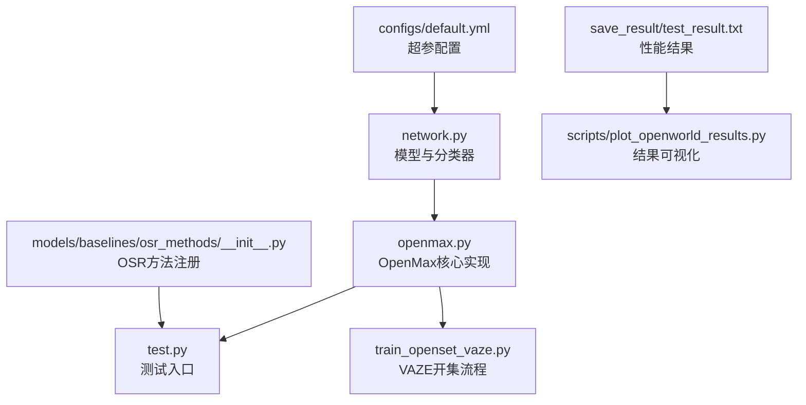
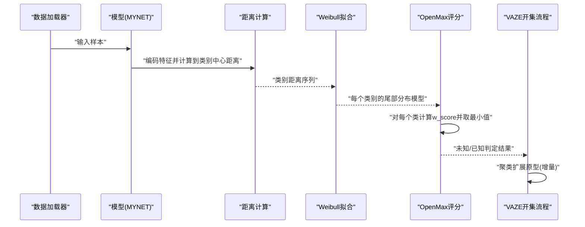
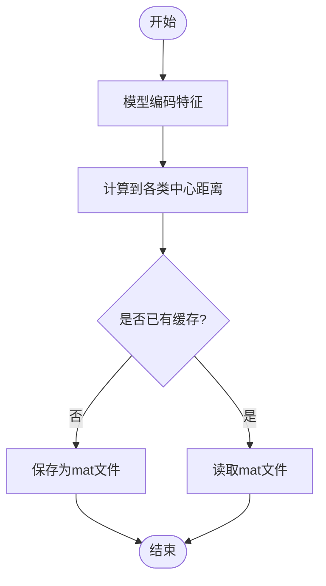
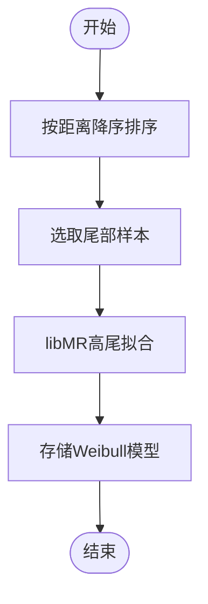
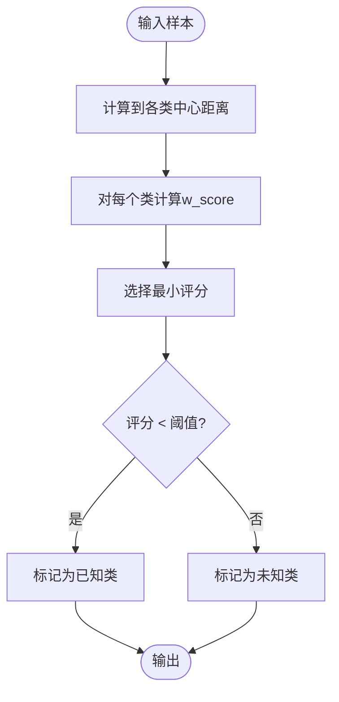
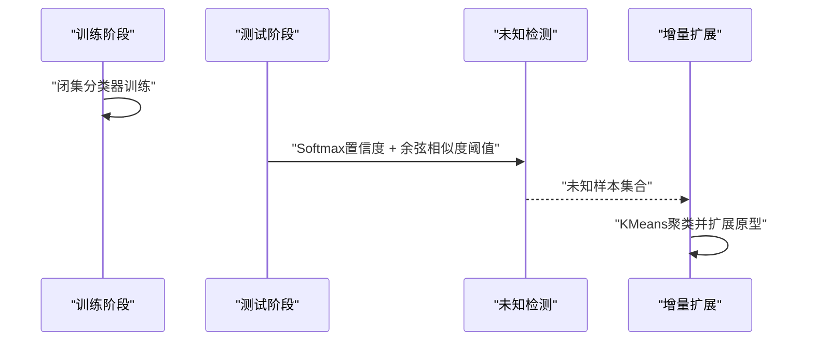
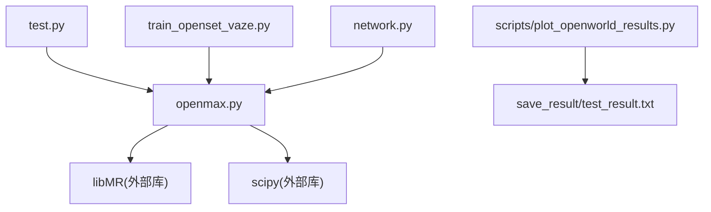

# OpenMax算法实现

<cite>
**本文引用的文件**
- [openmax.py](file://openmax.py)
- [test.py](file://test.py)
- [train_openset_vaze.py](file://train_openset_vaze.py)
- [network.py](file://network.py)
- [default.yml](file://configs/default.yml)
- [test_result.txt](file://save_result/test_result.txt)
- [plot_openworld_results.py](file://scripts/plot_openworld_results.py)
- [__init__.py](file://models/baselines/osr_methods/__init__.py)
</cite>

## 目录
1. [简介](#简介)
2. [项目结构](#项目结构)
3. [核心组件](#核心组件)
4. [架构总览](#架构总览)
5. [详细组件分析](#详细组件分析)
6. [依赖关系分析](#依赖关系分析)
7. [性能考量](#性能考量)
8. [故障排查指南](#故障排查指南)
9. [结论](#结论)
10. [附录](#附录)

## 简介
本文件面向VAZE系统中的OpenMax算法实现，围绕其核心思想“通过最大似然估计与尾部平均技术识别未知类别”展开，系统梳理算法三步法（特征提取、概率计算、尾部平均）、尾部平均的统计学原理、参数调优策略（温度参数与尾部数量），并对比传统Softmax分类器的差异与优势。同时结合仓库中的性能评估与可视化工具，给出实践建议与适用场景。

## 项目结构
本仓库采用模块化组织，与OpenMax相关的关键文件如下：
- openmax.py：OpenMax算法核心实现（距离计算、Weibull尾部拟合、未知/已知判定）
- test.py：测试入口，集成OpenMax与VAZE框架的检测逻辑
- train_openset_vaze.py：VAZE开集增量流程（闭集训练+阈值检测+聚类扩展原型）
- network.py：模型定义与前向传播，包含分类器与特征提取器
- configs/default.yml：训练与网络超参（含温度参数等）
- save_result/test_result.txt：实验结果汇总（包含已知/未知准确率、F1等）
- scripts/plot_openworld_results.py：结果解析与可视化脚本
- models/baselines/osr_methods/__init__.py：开集基线方法注册（与OpenMax并列）

图表来源
- [openmax.py:1-109](file://openmax.py#L1-L109)
- [test.py:1-200](file://test.py#L1-L200)
- [train_openset_vaze.py:1-200](file://train_openset_vaze.py#L1-L200)
- [network.py:1-200](file://network.py#L1-L200)
- [default.yml:1-88](file://configs/default.yml#L1-L88)
- [plot_openworld_results.py:1-128](file://scripts/plot_openworld_results.py#L1-L128)
- [__init__.py:1-22](file://models/baselines/osr_methods/__init__.py#L1-L22)

章节来源
- [openmax.py:1-109](file://openmax.py#L1-L109)
- [test.py:1-200](file://test.py#L1-L200)
- [train_openset_vaze.py:1-200](file://train_openset_vaze.py#L1-L200)
- [network.py:1-200](file://network.py#L1-L200)
- [default.yml:1-88](file://configs/default.yml#L1-L88)
- [plot_openworld_results.py:1-128](file://scripts/plot_openworld_results.py#L1-L128)
- [__init__.py:1-22](file://models/baselines/osr_methods/__init__.py#L1-L22)

## 核心组件
- 距离计算与缓存：对训练集特征与类别中心的距离进行计算，并缓存为mat文件，供后续Weibull拟合使用。
- Weibull尾部拟合：针对每个类别的尾部样本进行极值分布拟合，形成尾部分布模型。
- OpenMax评分与判定：对测试样本计算到各类别中心的距离，经Weibull评分后选择最小值，与阈值比较决定未知/已知。
- VAZE开集流程：闭集分类器训练后，使用Softmax置信度与特征-中心余弦相似度进行阈值检测，将未知样本聚类并扩展原型。

章节来源
- [openmax.py:7-32](file://openmax.py#L7-L32)
- [openmax.py:63-82](file://openmax.py#L63-L82)
- [openmax.py:84-109](file://openmax.py#L84-L109)
- [train_openset_vaze.py:86-198](file://train_openset_vaze.py#L86-L198)

## 架构总览
下图展示了OpenMax在VAZE框架中的整体工作流：模型编码特征→计算到各类中心的距离→Weibull尾部分布评分→阈值判定→未知/已知样本分离。

图表来源
- [openmax.py:33-109](file://openmax.py#L33-L109)
- [train_openset_vaze.py:134-198](file://train_openset_vaze.py#L134-L198)
- [network.py:18-49](file://network.py#L18-L49)

## 详细组件分析

### 组件A：特征提取与距离计算
- 特征提取：模型在“dist”模式下仅编码特征，不进入分类器，便于统计类内分布。
- 距离度量：支持欧氏距离、余弦距离及加权组合距离，用于衡量样本与类别中心的相似性。
- 缓存策略：将距离序列保存为mat文件，避免重复计算。

图表来源
- [openmax.py:7-32](file://openmax.py#L7-L32)

章节来源
- [openmax.py:7-32](file://openmax.py#L7-L32)

### 组件B：Weibull尾部拟合与更新
- 拟合策略：对每个类别的距离序列按降序取尾部样本，使用libMR进行高尾拟合，建立Weibull分布模型。
- 更新机制：当新增未标注类别时，为其建立新的Weibull模型，保证对未知类的尾部分布建模能力。

图表来源
- [openmax.py:63-82](file://openmax.py#L63-L82)

章节来源
- [openmax.py:63-82](file://openmax.py#L63-L82)

### 组件C：OpenMax评分与阈值判定
- 评分流程：对测试样本计算到各类别中心的Weibull评分，取最小值作为OpenMax得分。
- 判定规则：若最小评分低于阈值，则判为已知类；否则判为未知类。
- 与Softmax对比：OpenMax通过尾部建模提升对未知类的识别鲁棒性，Softmax在分布外样本上易出现过自信。

图表来源
- [openmax.py:84-109](file://openmax.py#L84-L109)

章节来源
- [openmax.py:84-109](file://openmax.py#L84-L109)

### 组件D：VAZE开集流程（对比与补充）
- 闭集训练：使用标准交叉熵训练分类器。
- 检测未知：结合Softmax置信度与特征-中心余弦相似度阈值，筛选未知样本。
- 增量扩展：对未知样本聚类，将聚类中心加入分类器权重，扩展原型。

图表来源
- [train_openset_vaze.py:86-198](file://train_openset_vaze.py#L86-L198)

章节来源
- [train_openset_vaze.py:86-198](file://train_openset_vaze.py#L86-L198)

### 组件E：参数与配置要点
- 温度参数：在配置中可调整温度，影响Softmax输出分布的锐利程度，间接影响OpenMax评分的分布特性。
- 尾部数量：控制Weibull拟合使用的尾部样本数量，影响尾部分布拟合精度与稳定性。
- 阈值：OpenMax评分阈值，决定未知/已知的判定边界。

章节来源
- [default.yml:42-45](file://configs/default.yml#L42-L45)
- [openmax.py:63-82](file://openmax.py#L63-L82)
- [openmax.py:84-109](file://openmax.py#L84-L109)

## 依赖关系分析
- openmax.py依赖libMR进行Weibull尾部拟合，依赖scipy进行距离计算。
- test.py与train_openset_vaze.py共同调用openmax.py完成OpenMax评分与未知检测。
- network.py提供特征提取与分类器接口，为OpenMax评分提供基础。
- scripts/plot_openworld_results.py解析test_result.txt并绘制会话曲线与指标柱状图。

图表来源
- [openmax.py:1-6](file://openmax.py#L1-L6)
- [test.py:18](file://test.py#L18)
- [train_openset_vaze.py:1-200](file://train_openset_vaze.py#L1-L200)
- [network.py:18-49](file://network.py#L18-L49)
- [plot_openworld_results.py:1-128](file://scripts/plot_openworld_results.py#L1-L128)
- [test_result.txt:1-62](file://save_result/test_result.txt#L1-L62)

章节来源
- [openmax.py:1-6](file://openmax.py#L1-L6)
- [test.py:18](file://test.py#L18)
- [train_openset_vaze.py:1-200](file://train_openset_vaze.py#L1-L200)
- [network.py:18-49](file://network.py#L18-L49)
- [plot_openworld_results.py:1-128](file://scripts/plot_openworld_results.py#L1-L128)
- [test_result.txt:1-62](file://save_result/test_result.txt#L1-L62)

## 性能考量
- 已知/未知准确率与F1：仓库结果文件显示不同会话下的已知/未知准确率与F1，可用于评估OpenMax在不同阶段的表现。
- 可视化：脚本可解析结果并绘制会话曲线与指标柱状图，辅助分析性能趋势。
- 实践建议：
  - 适当增大尾部数量以提升尾部分布拟合稳定性，但需平衡计算成本。
  - 调整阈值以平衡未知检出率与误报率，结合任务需求权衡。
  - 温度参数影响Softmax分布，间接影响OpenMax评分分布，可与尾部数量协同调优。

章节来源
- [test_result.txt:1-62](file://save_result/test_result.txt#L1-L62)
- [plot_openworld_results.py:62-128](file://scripts/plot_openworld_results.py#L62-L128)

## 故障排查指南
- libMR缺失：若运行时报错提示libMR不可用，请安装libMR并确保环境正确导入。
- 距离缓存路径：若dist_path为空，程序会自动计算并保存距离缓存；若路径错误，需检查文件权限与路径配置。
- 阈值设置：若阈值过高导致大量样本被误判为未知，或过低导致未知样本被误判为已知，需根据验证集调整。
- 温度参数：温度过大可能导致Softmax输出过于平坦，影响OpenMax评分的判别力；温度过小可能导致过拟合。

章节来源
- [openmax.py:7-32](file://openmax.py#L7-L32)
- [openmax.py:84-109](file://openmax.py#L84-L109)
- [default.yml:42-45](file://configs/default.yml#L42-L45)

## 结论
OpenMax通过尾部平均与Weibull极值建模，有效提升了对未知类别的识别能力，尤其适用于分布外样本较多的开集场景。结合VAZE的闭集训练+阈值检测+聚类扩展原型流程，可在增量学习中持续扩展类别并保持稳健性能。实践中应关注尾部数量、阈值与温度参数的协同调优，并通过可视化与指标曲线持续监控性能变化。

## 附录
- 关键实现路径参考：
  - [openmax.py:7-32](file://openmax.py#L7-L32) 距离计算与缓存
  - [openmax.py:63-82](file://openmax.py#L63-L82) Weibull尾部拟合
  - [openmax.py:84-109](file://openmax.py#L84-L109) OpenMax评分与判定
  - [train_openset_vaze.py:86-198](file://train_openset_vaze.py#L86-L198) VAZE开集流程
  - [network.py:18-49](file://network.py#L18-L49) 模型与分类器接口
  - [default.yml:42-45](file://configs/default.yml#L42-L45) 温度参数配置
  - [test_result.txt:1-62](file://save_result/test_result.txt#L1-L62) 性能结果
  - [plot_openworld_results.py:62-128](file://scripts/plot_openworld_results.py#L62-L128) 结果可视化