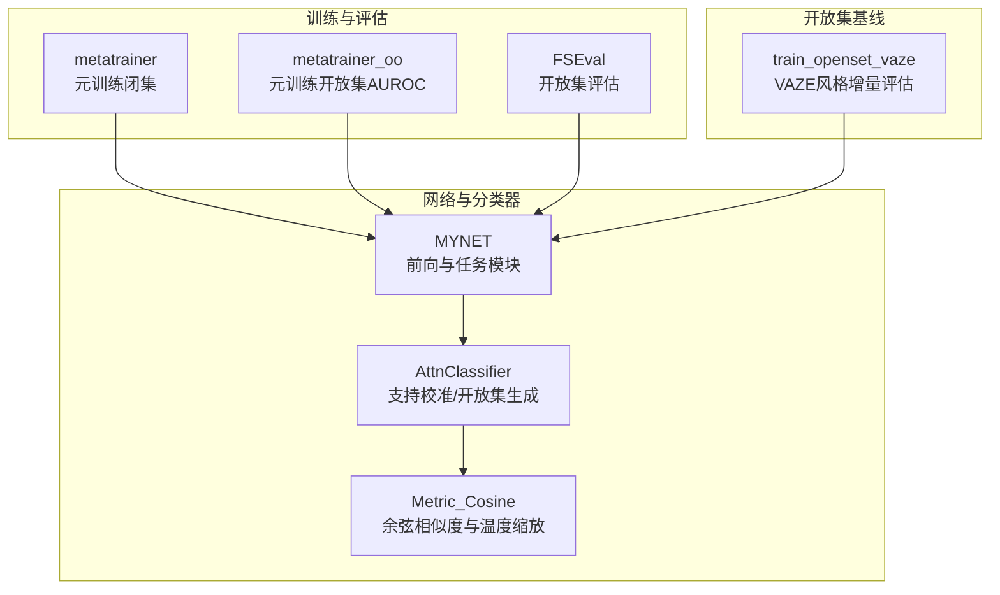
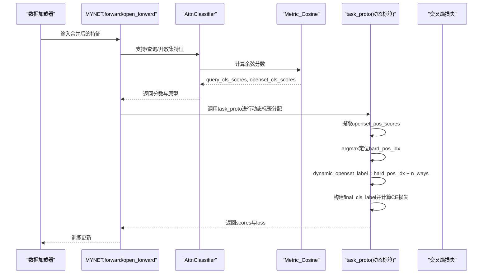
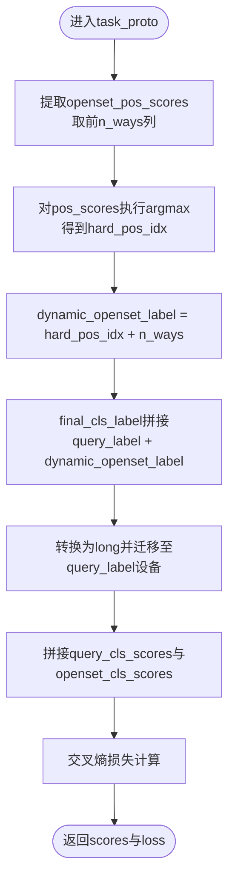
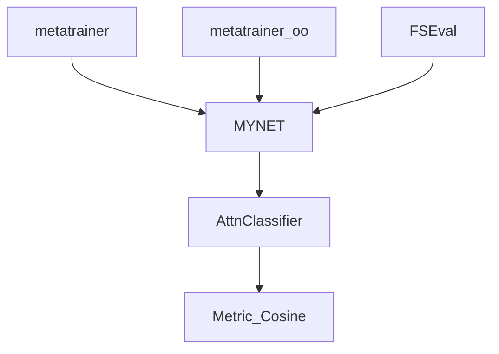

# 动态标签分配机制

<cite>
**本文档引用的文件**
- [network.py](file://network.py)
- [metatrainer.py](file://models/metatrainer.py)
- [metatrainer_oo.py](file://models/metatrainer_oo.py)
- [AttnClassifier.py](file://models/AttnClassifier.py)
- [FSEval.py](file://models/FSEval.py)
- [train_openset_vaze.py](file://train_openset_vaze.py)
- [train.py](file://train.py)
</cite>

## 目录
1. [简介](#简介)
2. [项目结构](#项目结构)
3. [核心组件](#核心组件)
4. [架构总览](#架构总览)
5. [详细组件分析](#详细组件分析)
6. [依赖关系分析](#依赖关系分析)
7. [性能考量](#性能考量)
8. [故障排查指南](#故障排查指南)
9. [结论](#结论)

## 简介
本文件围绕VAZE系统的动态标签分配机制展开，系统通过在开放集（Unknown）样本上识别“硬正例”（Hard Positive），利用其在已知类中的相似度得分，将其映射到对应的负原型（Negative Prototype）标签，从而实现对未知样本的有效监督学习。该机制的关键在于：
- openset_pos_scores的提取与计算
- torch.argmax对硬正例类别的定位
- 动态标签生成规则：hard_pos_idx + n_ways
- final_cls_label的构建与设备一致性处理
- 在不同场景下的标签策略与边界条件处理

该机制显著提升了开放集识别的准确性，使未知样本能够被有效区分并纳入增量学习流程。

## 项目结构
VAZE相关的核心代码分布在以下模块：
- 网络与分类器：MYNET、AttnClassifier、Metric_Cosine等
- 训练与评估：metatrainer、metatrainer_oo、FSEval
- 开放集基线脚本：train_openset_vaze（VAZE风格的增量评估与结果写入）

**图表来源**
- [network.py:18-504](file://network.py#L18-L504)
- [AttnClassifier.py:39-93](file://models/AttnClassifier.py#L39-L93)
- [metatrainer.py:17-178](file://models/metatrainer.py#L17-L178)
- [metatrainer_oo.py:87-214](file://models/metatrainer_oo.py#L87-L214)
- [FSEval.py:17-112](file://models/FSEval.py#L17-L112)
- [train_openset_vaze.py:420-477](file://train_openset_vaze.py#L420-L477)

**章节来源**
- [network.py:18-504](file://network.py#L18-L504)
- [metatrainer.py:17-178](file://models/metatrainer.py#L17-L178)
- [metatrainer_oo.py:87-214](file://models/metatrainer_oo.py#L87-L214)
- [FSEval.py:17-112](file://models/FSEval.py#L17-L112)
- [train_openset_vaze.py:420-477](file://train_openset_vaze.py#L420-L477)

## 核心组件
- MYNET：主网络，负责编码、前向传播、任务模块（task_proto）与动态标签分配。
- AttnClassifier：支持中心校准与开放集负原型生成，输出query与openset的余弦分数。
- Metric_Cosine：余弦相似度计算与温度缩放，控制决策边界。
- metatrainer / metatrainer_oo：元训练流程，分别面向闭集准确率与开放集AUROC。
- FSEval：开放集评估，计算AUROC与宏F1等指标。
- train_openset_vaze：VAZE风格的增量评估与结果写入。

**章节来源**
- [network.py:18-504](file://network.py#L18-L504)
- [AttnClassifier.py:39-93](file://models/AttnClassifier.py#L39-L93)
- [metatrainer.py:17-178](file://models/metatrainer.py#L17-L178)
- [metatrainer_oo.py:87-214](file://models/metatrainer_oo.py#L87-L214)
- [FSEval.py:17-112](file://models/FSEval.py#L17-L112)
- [train_openset_vaze.py:420-477](file://train_openset_vaze.py#L420-L477)

## 架构总览
动态标签分配贯穿于MYNET的任务模块中，具体流程如下：

**图表来源**
- [network.py:102-151](file://network.py#L102-L151)
- [network.py:153-202](file://network.py#L153-L202)
- [AttnClassifier.py:47-93](file://models/AttnClassifier.py#L47-L93)
- [AttnClassifier.py:352-368](file://models/AttnClassifier.py#L352-L368)

**章节来源**
- [network.py:102-151](file://network.py#L102-L151)
- [network.py:153-202](file://network.py#L153-L202)
- [AttnClassifier.py:47-93](file://models/AttnClassifier.py#L47-L93)
- [AttnClassifier.py:352-368](file://models/AttnClassifier.py#L352-L368)

## 详细组件分析

### 动态标签分配核心流程
- openset_pos_scores提取：从openset_cls_scores中仅取前n_ways列，对应已知类的正类分数。
- hard_positive识别：对openset_pos_scores沿类别维度取argmax，得到每个未知样本的硬正例类别索引。
- 动态标签生成：将硬正例索引加上n_ways，映射到负原型区域的标签空间。
- final_cls_label构建：将query_label与dynamic_openset_label拼接并展平，转换为long并迁移到query_label的设备。
- 损失计算：将拼接后的cls_scores与final_cls_label送入交叉熵损失。

**图表来源**
- [network.py:167-194](file://network.py#L167-L194)

**章节来源**
- [network.py:167-194](file://network.py#L167-L194)

### 硬正例识别与openset_pos_scores
- openset_pos_scores来源于AttnClassifier输出的openset_cls_scores，维度为[B, N_open, 2*n_ways]，其中前n_ways列对应已知类的正类分数。
- 通过torch.argmax(openset_pos_scores, dim=-1)得到每个未知样本最像的已知类索引（0~n_ways-1）。
- 该索引随后被映射到负原型标签空间：hard_pos_idx + n_ways，确保未知样本被分配到负原型类别。

**章节来源**
- [network.py:167-178](file://network.py#L167-L178)
- [AttnClassifier.py:85-86](file://models/AttnClassifier.py#L85-L86)

### 动态标签生成规则：hard_pos_idx + n_ways
- 数学原理：cls_scores的前n_ways列代表已知类正类，后n_ways列代表负原型（伪类）负类。因此，将硬正例索引加n_ways即可映射到负原型标签区间。
- 实现逻辑：dynamic_openset_label = hard_pos_idx + n_ways，保证未知样本的标签与已知类标签空间不冲突。
- 维度匹配：final_cls_label通过view(-1)展平并与query_label拼接，确保与cls_scores的类别维度一致。

**章节来源**
- [network.py:176-189](file://network.py#L176-L189)

### final_cls_label构建与设备处理
- 维度与类型：final_cls_label由query_label.view(-1)与dynamic_openset_label.view(-1)拼接而成，随后转换为long类型。
- 设备一致性：通过.to(query_label.device)确保标签与查询特征在同一设备上，避免跨设备错误。
- 与cls_scores对齐：拼接后的cls_scores维度为[B, N_total, 2*n_ways]，final_cls_label长度等于N_total，保证交叉熵输入合法。

**章节来源**
- [network.py:188-194](file://network.py#L188-L194)

### 不同场景下的标签分配策略
- 已知样本（Query）：保持原有标签不变，继续参与闭集分类损失。
- 未知样本（Openset）：采用动态标签分配，将硬正例映射到负原型标签，形成对未知样本的监督信号。
- 标签冲突处理：通过n_ways的偏移确保正类与负原型标签空间分离；若openset_pos_scores存在多个相同最大值，可通过tie-breaking策略（如随机选择）进一步细化。
- 边界情况：
  - 当openset_pos_scores全为低分时，hard_pos_idx可能不稳定，需结合置信度阈值过滤。
  - 若n_ways变化，需同步调整映射规则与损失类别数。
  - 设备不一致会导致标签与特征不匹配，需严格使用.to(query_label.device)。

**章节来源**
- [network.py:163-194](file://network.py#L163-L194)

### 与训练与评估流程的衔接
- 元训练（闭集）：metatrainer通过拼接支持/查询/开放集特征，调用MYNET的openmeta模式，计算闭集准确率与AUROC。
- 元训练（开放集AUROC）：metatrainer_oo在评估阶段使用1对1判决，基于正负分数差构造未知分数，计算AUROC。
- 开放集评估：FSEval在测试阶段对query与openset的概率进行拼接，计算宏F1与AUROC。

**章节来源**
- [metatrainer.py:100-178](file://models/metatrainer.py#L100-L178)
- [metatrainer_oo.py:100-214](file://models/metatrainer_oo.py#L100-L214)
- [FSEval.py:46-112](file://models/FSEval.py#L46-L112)

## 依赖关系分析
- MYNET依赖AttnClassifier生成支持原型与负原型，再由Metric_Cosine计算余弦分数。
- task_proto依赖n_ways与cls_scores的结构假设，确保前n_ways为正类、后n_ways为负原型。
- 训练模块（metatrainer、metatrainer_oo）依赖MYNET的open_forward接口，提供query与openset的联合推理。
- 评估模块（FSEval）依赖MYNET的test模式，输出概率并计算AUROC与F1。

**图表来源**
- [network.py:18-504](file://network.py#L18-L504)
- [AttnClassifier.py:39-93](file://models/AttnClassifier.py#L39-L93)
- [metatrainer.py:17-178](file://models/metatrainer.py#L17-L178)
- [metatrainer_oo.py:87-214](file://models/metatrainer_oo.py#L87-L214)
- [FSEval.py:17-112](file://models/FSEval.py#L17-L112)

**章节来源**
- [network.py:18-504](file://network.py#L18-L504)
- [AttnClassifier.py:39-93](file://models/AttnClassifier.py#L39-L93)
- [metatrainer.py:17-178](file://models/metatrainer.py#L17-L178)
- [metatrainer_oo.py:87-214](file://models/metatrainer_oo.py#L87-L214)
- [FSEval.py:17-112](file://models/FSEval.py#L17-L112)

## 性能考量
- 计算复杂度：动态标签分配主要涉及张量切片与argmax操作，整体为O(B*N_open*n_ways)级别，开销较小。
- 内存占用：需同时持有openset_pos_scores与dynamic_openset_label，注意批大小与n_ways对显存的影响。
- 温度缩放：Metric_Cosine中的温度参数影响决策边界锐利程度，过高可能导致过拟合，过低可能导致边界模糊。
- 设备一致性：始终确保final_cls_label与query_label在同一设备，避免额外的设备迁移开销与潜在错误。
- 数据并行：在分布式训练中，确保n_ways与cls_scores维度在各设备上一致，避免跨设备拼接异常。

[本节为通用性能讨论，无需列出具体文件来源]

## 故障排查指南
- 标签维度不匹配：若cls_scores的类别数与final_cls_label长度不一致，交叉熵会报错。请检查n_ways与cls_scores的构造逻辑。
- 设备不一致：若final_cls_label与特征不在同一设备，会出现Runtime错误。务必使用.to(query_label.device)。
- 硬正例不稳定：当openset_pos_scores存在多个相同最大值时，argmax可能返回不确定索引。可引入微小噪声或tie-breaking策略。
- AUROC异常：若openset_pos_scores普遍偏低，动态标签可能无效。可结合置信度阈值过滤低置信样本。
- 评估指标异常：FSEval要求cls_scores的最后一维为2*n_ways，且final概率拼接顺序正确。请核对拼接与标签映射逻辑。

**章节来源**
- [network.py:188-194](file://network.py#L188-L194)
- [FSEval.py:64-73](file://models/FSEval.py#L64-L73)

## 结论
VAZE的动态标签分配机制通过识别开放集样本的硬正例，并将其映射到负原型标签空间，实现了对未知样本的有效监督学习。该机制在不改变模型结构的前提下，显著提升了开放集识别的准确性与鲁棒性。结合元训练与评估流程，系统能够在增量场景下持续扩展类别并维持稳定的性能表现。