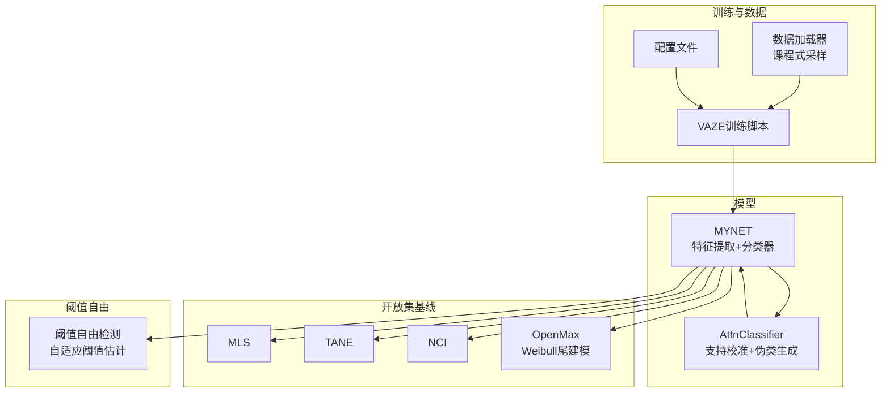
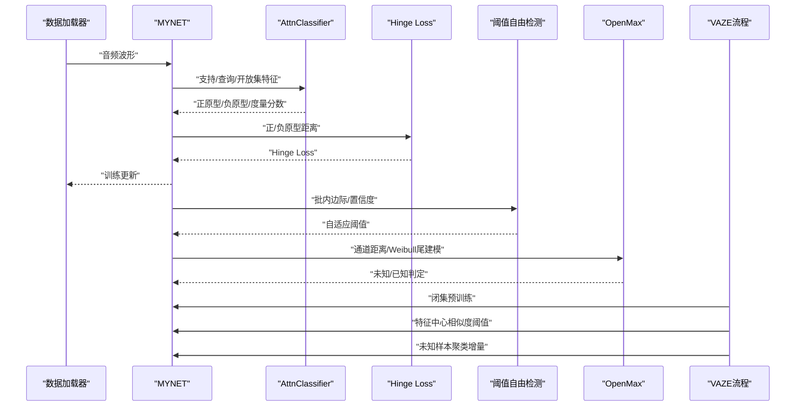
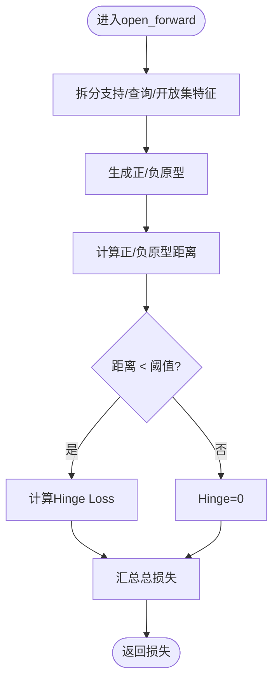
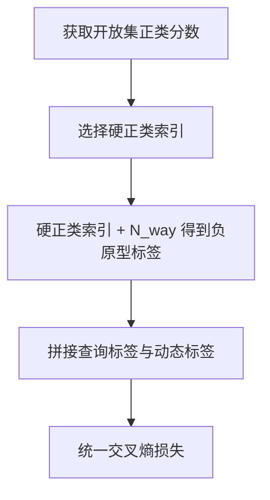
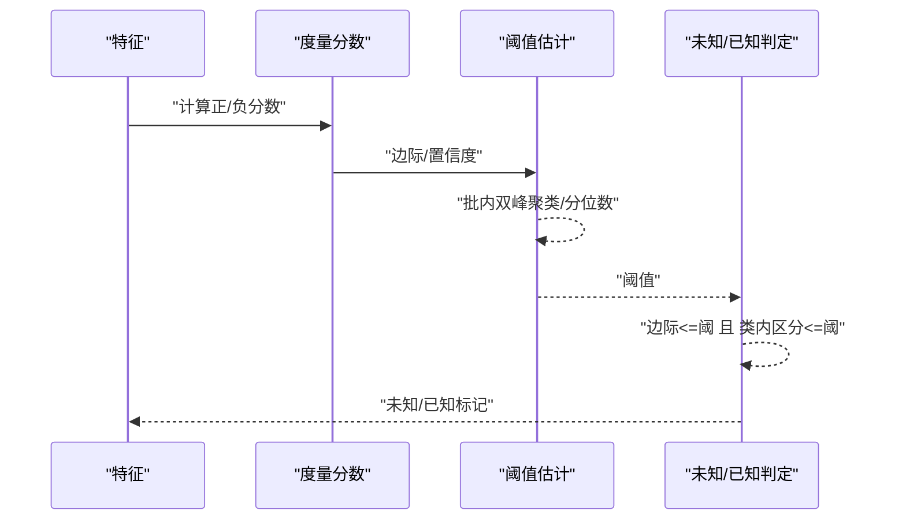
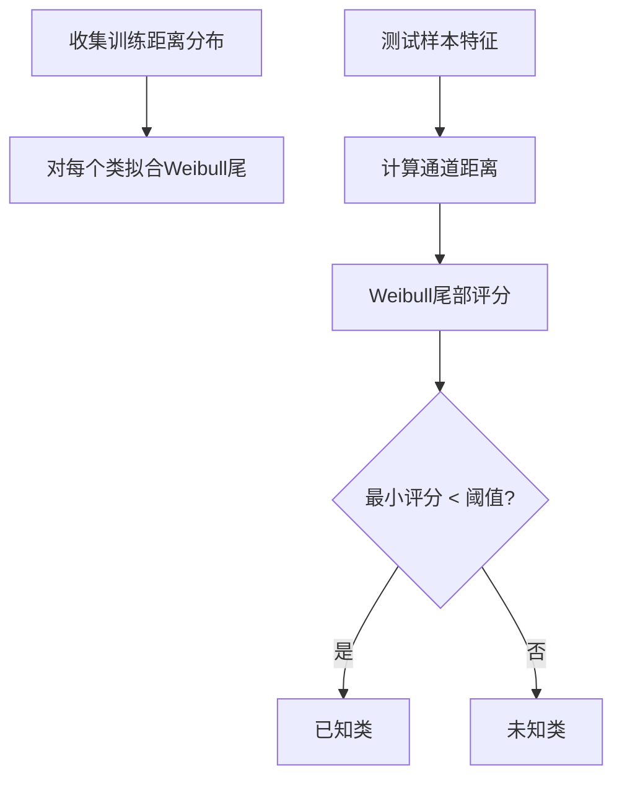
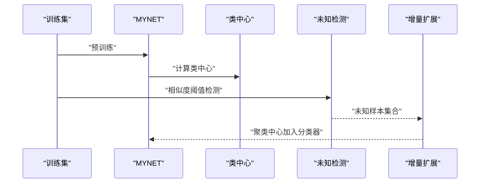
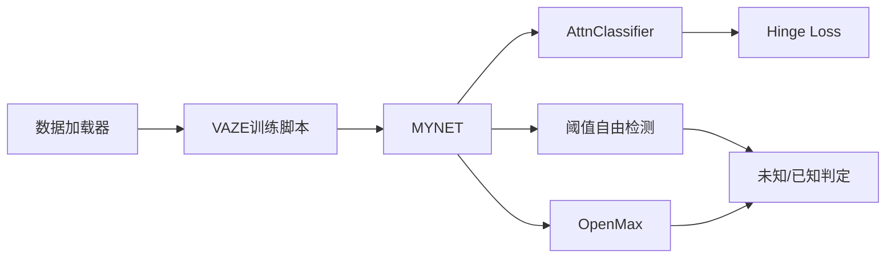

# 开放集识别

<cite>
**本文引用的文件**   
- [network.py](file://network.py)
- [models/AttnClassifier.py](file://models/AttnClassifier.py)
- [models/baselines/osr_methods/__init__.py](file://models/baselines/osr_methods/__init__.py)
- [models/baselines/osr_methods/mls.py](file://models/baselines/osr_methods/mls.py)
- [models/baselines/osr_methods/tane.py](file://models/baselines/osr_methods/tane.py)
- [models/baselines/osr_methods/nci.py](file://models/baselines/osr_methods/nci.py)
- [models/baselines/base.py](file://models/baselines/base.py)
- [threshold_free.py](file://threshold_free.py)
- [openmax.py](file://openmax.py)
- [train_openset_vaze.py](file://train_openset_vaze.py)
- [configs/default.yml](file://configs/default.yml)
- [data/dataloader.py](file://data/dataloader.py)
</cite>

## 目录
1. [简介](#简介)
2. [项目结构](#项目结构)
3. [核心组件](#核心组件)
4. [架构总览](#架构总览)
5. [详细组件分析](#详细组件分析)
6. [依赖分析](#依赖分析)
7. [性能考虑](#性能考虑)
8. [故障排查指南](#故障排查指南)
9. [结论](#结论)
10. [附录](#附录)

## 简介
本文件面向VAZE系统在开放集识别（Open-Set Recognition, OSR）方向的能力，围绕以下目标展开：  
- 解释开放集识别的核心思想：在训练仅覆盖已知类的前提下，对来自未知类的样本进行有效识别与拒识。  
- 深入解析Hinge Loss的实现与距离约束机制，说明其如何通过正/负原型间的几何距离引导边界学习。  
- 阐述动态标签分配策略：如何为开放集样本生成合理的目标标签，使其与已知样本形成一致的分类框架。  
- 介绍阈值自由识别方法：通过自适应阈值估计与边际（margin）/置信度联合决策，避免手工设定阈值带来的不稳定。  
- 提供完整的开放集识别实现流程：特征提取、原型计算、分类决策与增量扩展。  
- 对比传统封闭集识别，总结开放集识别的优势与局限。  
- 给出参数调优建议与性能优化策略。

## 项目结构
本仓库围绕few-shot学习与开放集识别构建，核心由以下部分组成：
- 网络与分类器：MYNET主干网络、基于注意力的原型生成与度量模块（AttnClassifier）。  
- 开放集基线：MLS、TANE、NCI等打分器，以及OpenMax（Weibull尾部建模）实现。  
- 阈值自由检测：基于批内双峰聚类的自适应阈值估计与会话感知阈值融合。  
- 训练与评估：VAZE端到端脚本、数据加载器与配置文件。

**图表来源**
- [network.py:18-50](file://network.py#L18-L50)
- [models/AttnClassifier.py:39-101](file://models/AttnClassifier.py#L39-L101)
- [models/baselines/osr_methods/__init__.py:7-21](file://models/baselines/osr_methods/__init__.py#L7-L21)
- [openmax.py:63-108](file://openmax.py#L63-L108)
- [threshold_free.py:16-56](file://threshold_free.py#L16-L56)
- [train_openset_vaze.py:420-481](file://train_openset_vaze.py#L420-L481)
- [data/dataloader.py:19-46](file://data/dataloader.py#L19-L46)
- [configs/default.yml:1-88](file://configs/default.yml#L1-L88)

**章节来源**
- [network.py:18-50](file://network.py#L18-L50)
- [models/AttnClassifier.py:39-101](file://models/AttnClassifier.py#L39-L101)
- [models/baselines/osr_methods/__init__.py:7-21](file://models/baselines/osr_methods/__init__.py#L7-L21)
- [openmax.py:63-108](file://openmax.py#L63-L108)
- [threshold_free.py:16-56](file://threshold_free.py#L16-L56)
- [train_openset_vaze.py:420-481](file://train_openset_vaze.py#L420-L481)
- [data/dataloader.py:19-46](file://data/dataloader.py#L19-L46)
- [configs/default.yml:1-88](file://configs/default.yml#L1-L88)

## 核心组件
- MYNET主干网络：负责音频特征提取与分类器前段，支持多种模式（encoder/openmeta等），并内置温度缩放与注意力模块。  
- AttnClassifier：支持校准（SupportCalibrator）与伪类生成（OpenSetGenerater），输出正/负原型与度量分数，支撑开放集Hinge Loss与动态标签分配。  
- Hinge Loss：通过正/负原型间距离约束，促使生成器将负原型推离已知原型，形成清晰的边界。  
- 动态标签分配：针对开放集样本，依据其“硬正类”选择对应负原型作为目标，保证训练一致性。  
- 阈值自由检测：基于批内双峰KMeans聚类估计阈值，结合类内区分边际与会话感知平滑，避免手工阈值。  
- OpenMax：基于Weibull建模尾部分布，计算通道级尾部得分，实现阈值无关的未知判定。  
- VAZE端到端流程：闭集预训练+特征中心相似度阈值检测+未知样本聚类增量扩展。

**章节来源**
- [network.py:102-202](file://network.py#L102-L202)
- [models/AttnClassifier.py:39-101](file://models/AttnClassifier.py#L39-L101)
- [threshold_free.py:16-56](file://threshold_free.py#L16-L56)
- [openmax.py:63-108](file://openmax.py#L63-L108)
- [train_openset_vaze.py:134-198](file://train_openset_vaze.py#L134-L198)

## 架构总览
VAZE的开放集识别由“特征提取—原型生成—距离约束—动态标签—阈值自由/阈值无关—增量扩展”构成闭环。

**图表来源**
- [network.py:102-202](file://network.py#L102-L202)
- [models/AttnClassifier.py:39-101](file://models/AttnClassifier.py#L39-L101)
- [threshold_free.py:178-235](file://threshold_free.py#L178-L235)
- [openmax.py:84-108](file://openmax.py#L84-L108)
- [train_openset_vaze.py:134-198](file://train_openset_vaze.py#L134-L198)

## 详细组件分析

### Hinge Loss与距离约束
- 正/负原型定义：支持集原型由支持校准得到，负原型由伪类生成器生成，二者共同参与度量与损失计算。  
- 距离约束：计算正/负原型之间的欧氏距离，采用可配置的阈值（默认2.0），当距离小于阈值时施加Hinge损失，推动负原型远离正原型。  
- 作用：在特征空间中建立清晰边界，抑制对未知样本的错误归属。

**图表来源**
- [network.py:133-151](file://network.py#L133-L151)

**章节来源**
- [network.py:133-151](file://network.py#L133-L151)

### 动态标签分配机制
- 目标：为开放集样本生成与已知样本一致的标签，使整体交叉熵损失统一。  
- 方法：对开放集样本，取其在已知类上的最高分所对应的“硬正类”，将其负原型索引作为目标标签，拼接至查询标签后统一计算CE损失。  
- 效果：保持训练一致性，避免开放集标签的任意性导致的不稳定。

**图表来源**
- [network.py:167-202](file://network.py#L167-L202)

**章节来源**
- [network.py:167-202](file://network.py#L167-L202)

### 阈值自由识别（VAZE风格）
- 核心思想：不依赖手工阈值，而是基于批内样本的边际分布估计阈值。  
- 自适应阈值：对批内边际进行双峰KMeans聚类，二峰中点作为阈值；若样本过少或方差过小，退化为中位数。  
- 类内区分边际：Top-1与Top-2分数差，用于区分类内不确定性。  
- 会话感知平滑：对早期会话的阈值进行统计累积，后期适度融合历史阈值，缓解波动。  
- 决策规则：当样本边际与类内区分边际同时低于阈值时，判定为未知。

**图表来源**
- [threshold_free.py:16-56](file://threshold_free.py#L16-L56)
- [threshold_free.py:178-235](file://threshold_free.py#L178-L235)

**章节来源**
- [threshold_free.py:16-56](file://threshold_free.py#L16-L56)
- [threshold_free.py:178-235](file://threshold_free.py#L178-L235)

### OpenMax算法实现（最大似然估计与尾部平均）
- 通道距离：对每个类计算特征与原型的欧氏/余弦距离，组合为综合距离。  
- Weibull尾建模：对每个类的距离尾部进行Weibull拟合，得到尾部概率模型。  
- 未知判定：对测试样本，计算通道距离并经Weibull尾部评分，最小评分低于阈值则判定为已知，否则未知。  
- 优势：无需手工阈值，基于尾部分布的统计显著性进行拒识。

**图表来源**
- [openmax.py:7-32](file://openmax.py#L7-L32)
- [openmax.py:63-82](file://openmax.py#L63-L82)
- [openmax.py:84-108](file://openmax.py#L84-L108)

**章节来源**
- [openmax.py:7-32](file://openmax.py#L7-L32)
- [openmax.py:63-82](file://openmax.py#L63-L82)
- [openmax.py:84-108](file://openmax.py#L84-L108)

### VAZE端到端流程（阈值自由+增量扩展）
- 闭集预训练：使用MYNET在已知类上进行标准分类训练，获得良好特征表示。  
- 特征中心相似度检测：对训练集计算类中心，测试时计算样本与中心的余弦相似度，低于阈值则判定为未知。  
- 未知样本聚类：对检测到的未知样本进行KMeans聚类，将聚类中心作为新类原型增量加入分类器权重。  
- 评估：在会话式增量场景下，记录已知/未知准确率、F1与总体准确率，观察性能退化情况。

**图表来源**
- [train_openset_vaze.py:86-198](file://train_openset_vaze.py#L86-L198)

**章节来源**
- [train_openset_vaze.py:86-198](file://train_openset_vaze.py#L86-L198)

### 传统封闭集识别对比
- 优势：在仅已知类的场景下，分类边界清晰，准确率高；推理简单，无需拒识。  
- 局限：对未知类表现不可靠，无法区分“不确定”与“错误分类”。  
- 开放集识别：通过原型边界、阈值自由/阈值无关策略与增量扩展，提升鲁棒性与实用性，但代价是复杂度上升与潜在的性能退化风险。

[本节为概念性对比，不直接分析具体文件]

## 依赖分析
- MYNET依赖AttnClassifier进行原型生成与度量；Hinge Loss与动态标签分配在open_forward中完成。  
- 阈值自由检测独立于模型，仅依赖度量分数与边际；OpenMax依赖Weibull尾建模与通道距离。  
- 数据加载器提供课程式采样与会话划分，支撑VAZE增量评估。

**图表来源**
- [data/dataloader.py:19-46](file://data/dataloader.py#L19-L46)
- [train_openset_vaze.py:420-481](file://train_openset_vaze.py#L420-L481)
- [network.py:102-202](file://network.py#L102-L202)
- [models/AttnClassifier.py:39-101](file://models/AttnClassifier.py#L39-L101)
- [threshold_free.py:178-235](file://threshold_free.py#L178-L235)
- [openmax.py:84-108](file://openmax.py#L84-L108)

**章节来源**
- [data/dataloader.py:19-46](file://data/dataloader.py#L19-L46)
- [train_openset_vaze.py:420-481](file://train_openset_vaze.py#L420-L481)
- [network.py:102-202](file://network.py#L102-L202)
- [models/AttnClassifier.py:39-101](file://models/AttnClassifier.py#L39-L101)
- [threshold_free.py:178-235](file://threshold_free.py#L178-L235)
- [openmax.py:84-108](file://openmax.py#L84-L108)

## 性能考虑
- 特征维度与温度缩放：温度参数影响相似度分布的锐利程度，过高会导致过度锐化，过低则模糊边界。  
- Hinge阈值：默认2.0可按数据域调整，过大易拒真，过小边界模糊。  
- 阈值自由参数：自适应阈值的分位数与会话融合权重需结合验证集调优。  
- OpenMax尾部大小与阈值：尾部样本数过小可能导致拟合不稳定，阈值过高导致拒识过多。  
- 增量扩展：未知样本聚类数量应与样本规模匹配，避免过拟合或冗余新增。

[本节提供通用指导，不直接分析具体文件]

## 故障排查指南
- Hinge Loss无效或恒为0：检查正/负原型是否正确生成，确认距离计算与阈值配置。  
- 动态标签异常：核对开放集分数维度与“硬正类”选择逻辑，确保拼接标签与查询标签维度一致。  
- 阈值自由检测全未知/全已知：检查批内边际分布是否过于集中，适当提高分位数或引入会话平滑。  
- OpenMax拒识过多：降低Weibull尾部大小或阈值，或改用阈值自由策略作为补充。  
- VAZE增量效果差：检查未知检测阈值与聚类数量，确保聚类中心与特征维度一致。

**章节来源**
- [network.py:133-151](file://network.py#L133-L151)
- [network.py:167-202](file://network.py#L167-L202)
- [threshold_free.py:16-56](file://threshold_free.py#L16-L56)
- [openmax.py:63-108](file://openmax.py#L63-L108)
- [train_openset_vaze.py:134-198](file://train_openset_vaze.py#L134-L198)

## 结论
VAZE系统通过“原型边界+动态标签+阈值自由/阈值无关+增量扩展”的组合拳，在开放集场景下实现了稳健的拒识与持续学习。Hinge Loss与AttnClassifier的协同确保了边界清晰，阈值自由检测避免了手工阈值的脆弱性，OpenMax提供了统计意义上的阈值无关方案，VAZE端到端流程则将这些能力整合到增量评估框架中。实践中需关注温度、Hinge阈值、自适应阈值与OpenMax尾部参数的协同调优。

[本节为总结性内容，不直接分析具体文件]

## 附录
- 参数与配置要点（来自配置文件）：  
  - 训练与优化：学习率、调度策略、优化器衰减等。  
  - 网络：温度缩放、分类器模式（cos/avg等）、新增类别方式。  
  - 数据：批次大小、工作进程数、采样策略（课程式/支持集采样）。  
  - 会话与增量：会话数、每会话新增类别数、测试次数等。

**章节来源**
- [configs/default.yml:1-88](file://configs/default.yml#L1-L88)