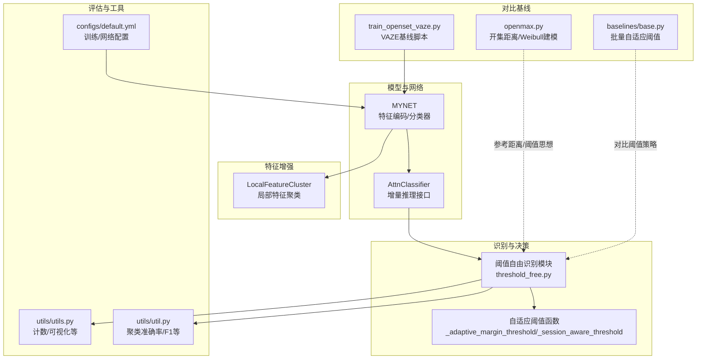
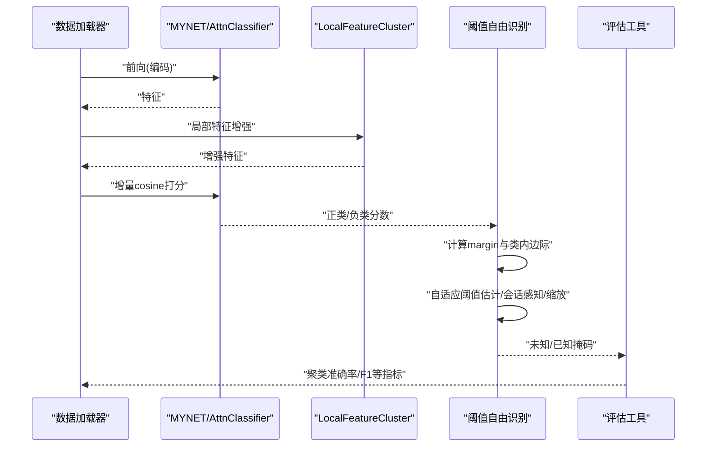
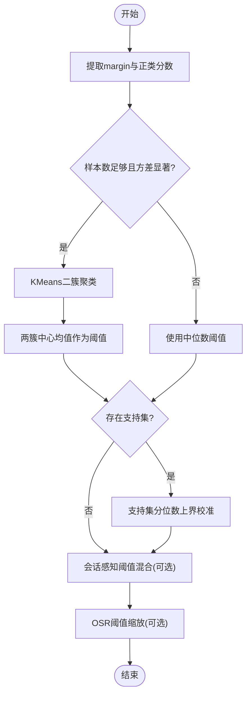
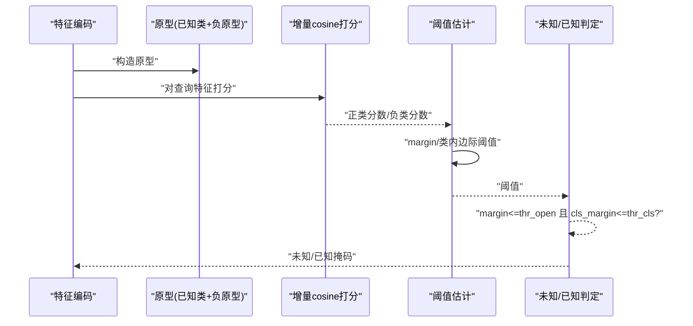
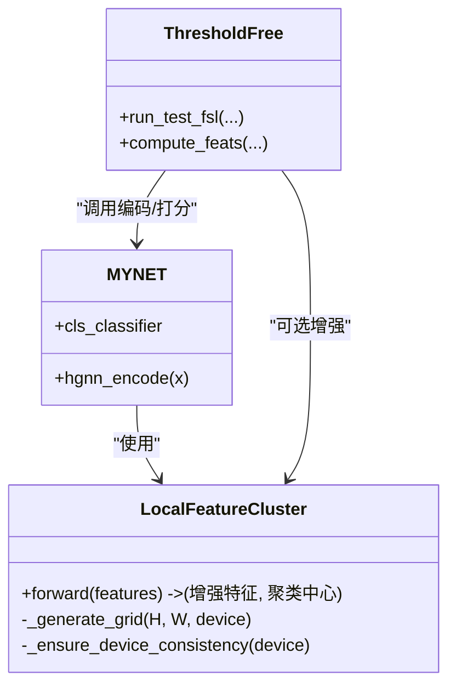
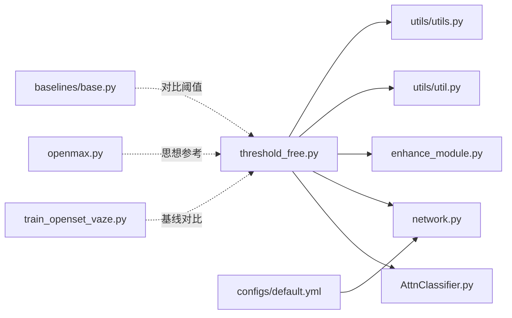

# 阈值自由识别方法

<cite>
**本文引用的文件**
- [threshold_free.py](file://threshold_free.py)
- [train_openset_vaze.py](file://train_openset_vaze.py)
- [network.py](file://network.py)
- [models/AttnClassifier.py](file://models/AttnClassifier.py)
- [enhance_module.py](file://enhance_module.py)
- [utils/utils.py](file://utils/utils.py)
- [utils/util.py](file://utils/util.py)
- [configs/default.yml](file://configs/default.yml)
- [openmax.py](file://openmax.py)
- [models/baselines/base.py](file://models/baselines/base.py)
</cite>

## 目录
1. [简介](#简介)
2. [项目结构](#项目结构)
3. [核心组件](#核心组件)
4. [架构总览](#架构总览)
5. [详细组件分析](#详细组件分析)
6. [依赖分析](#依赖分析)
7. [性能考虑](#性能考虑)
8. [故障排查指南](#故障排查指南)
9. [结论](#结论)
10. [附录](#附录)

## 简介
本文件面向VAZE系统的“阈值自由识别方法”，系统化阐述其如何避免手动设定阈值，通过自适应方式实现对未知类别的稳健识别。文档从算法原理、置信度与类别概率处理、与传统阈值方法的对比、完整实现流程、参数调优与性能优化、以及实操示例与最佳实践等方面进行全面说明，帮助开发者在不同音频识别场景中高效落地。

## 项目结构
本项目围绕“闭集训练 + 开集检测 + 增量扩展”的框架组织，其中阈值自由识别方法位于独立模块中，配合模型、分类器、特征增强与评估工具协同工作。

图表来源
- [threshold_free.py:178-235](file://threshold_free.py#L178-L235)
- [network.py:18-49](file://network.py#L18-L49)
- [models/AttnClassifier.py:94-101](file://models/AttnClassifier.py#L94-L101)
- [enhance_module.py:70-148](file://enhance_module.py#L70-L148)
- [utils/utils.py:190-200](file://utils/utils.py#L190-L200)
- [utils/util.py:12-57](file://utils/util.py#L12-L57)
- [configs/default.yml:1-88](file://configs/default.yml#L1-L88)
- [train_openset_vaze.py:134-170](file://train_openset_vaze.py#L134-L170)
- [openmax.py:1-72](file://openmax.py#L1-L72)
- [models/baselines/base.py:49-75](file://models/baselines/base.py#L49-L75)

章节来源
- [threshold_free.py:178-235](file://threshold_free.py#L178-L235)
- [network.py:18-49](file://network.py#L18-L49)
- [models/AttnClassifier.py:94-101](file://models/AttnClassifier.py#L94-L101)
- [enhance_module.py:70-148](file://enhance_module.py#L70-L148)
- [utils/utils.py:190-200](file://utils/utils.py#L190-L200)
- [utils/util.py:12-57](file://utils/util.py#L12-L57)
- [configs/default.yml:1-88](file://configs/default.yml#L1-L88)
- [train_openset_vaze.py:134-170](file://train_openset_vaze.py#L134-L170)
- [openmax.py:1-72](file://openmax.py#L1-L72)
- [models/baselines/base.py:49-75](file://models/baselines/base.py#L49-L75)

## 核心组件
- 自适应阈值估计
  - 批内双簇KMeans聚类估计，依据“已知样本margin更大、未知样本margin更小”的经验，自动确定阈值。
  - 支持支持集校准，利用支持集分位数提升鲁棒性。
  - 支持会话感知阈值混合，对早期会话累积分位统计，后期适度收缩，缓解漂移。
- 增量推理与打分
  - 使用增量cosine分数接口，避免softmax跨类耦合对开集决策的影响。
  - 计算正类分数、负类分数与两类之间的边际，构造两类阈值进行未知/已知判定。
- 特征增强与融合
  - 局部特征聚类与空间权重融合，提升特征代表性，辅助更稳健的相似度计算。
- 评估与指标
  - 已知/未知聚类准确率、F1等指标，支持多次测试平均与统计区间。

章节来源
- [threshold_free.py:16-56](file://threshold_free.py#L16-L56)
- [threshold_free.py:148-169](file://threshold_free.py#L148-L169)
- [threshold_free.py:178-235](file://threshold_free.py#L178-L235)
- [models/AttnClassifier.py:94-101](file://models/AttnClassifier.py#L94-L101)
- [enhance_module.py:70-148](file://enhance_module.py#L70-L148)
- [utils/util.py:12-57](file://utils/util.py#L12-L57)

## 架构总览
下图展示了从特征提取到未知/已知判定的端到端流程，强调“阈值自由”如何在不依赖人工阈值的前提下完成自适应决策。

图表来源
- [threshold_free.py:178-235](file://threshold_free.py#L178-L235)
- [models/AttnClassifier.py:94-101](file://models/AttnClassifier.py#L94-L101)
- [enhance_module.py:70-148](file://enhance_module.py#L70-L148)
- [utils/util.py:12-57](file://utils/util.py#L12-L57)

## 详细组件分析

### 自适应阈值估计与校准
- 批内双簇聚类
  - 对margin进行KMeans二分类聚类，取两簇中心均值作为阈值，避免手工调参。
  - 当样本过少或方差极小时，退化为中位数阈值，保证稳定性。
- 支持集校准
  - 从支持集中取分位数（如10%分位）对阈值进行上界校准，抑制极端阈值。
- 会话感知阈值混合
  - 早期会话记录分位统计，后期按比例混合历史统计，缓解跨会话漂移。
- 阈值缩放
  - 提供OSR阈值缩放因子，<1更宽松，使更多样本被判定为已知。

图表来源
- [threshold_free.py:16-56](file://threshold_free.py#L16-L56)
- [threshold_free.py:148-169](file://threshold_free.py#L148-L169)

章节来源
- [threshold_free.py:16-56](file://threshold_free.py#L16-L56)
- [threshold_free.py:148-169](file://threshold_free.py#L148-L169)

### 增量推理与打分
- 增量cosine打分
  - 使用分类器的增量前向接口，直接对查询特征与原型计算cosine分数，避免softmax跨类耦合。
- 正/负分数与边际
  - 正类分数取top1，负类分数取对应类别的负原型分数。
  - margin定义为正类分数减去负类分数；类内边际定义为top1与top2之差，用于细粒度区分。
- 未知/已知判定
  - 同时满足margin阈值与类内边际阈值时判定为未知，否则为已知。

图表来源
- [models/AttnClassifier.py:94-101](file://models/AttnClassifier.py#L94-L101)
- [threshold_free.py:178-235](file://threshold_free.py#L178-L235)

章节来源
- [models/AttnClassifier.py:94-101](file://models/AttnClassifier.py#L94-L101)
- [threshold_free.py:178-235](file://threshold_free.py#L178-L235)

### 特征增强与融合
- 局部特征聚类
  - 生成网格位置编码，结合时序相似度矩阵进行动态聚类，得到时序加权原型。
  - 通过空间权重网络与全局特征融合，输出增强特征。
- 与识别流程集成
  - 在识别前对特征进行增强，有助于提升margin分布的可分性，降低阈值估计误差。

图表来源
- [enhance_module.py:70-148](file://enhance_module.py#L70-L148)
- [network.py:18-49](file://network.py#L18-L49)
- [threshold_free.py:178-235](file://threshold_free.py#L178-L235)

章节来源
- [enhance_module.py:70-148](file://enhance_module.py#L70-L148)
- [network.py:18-49](file://network.py#L18-L49)
- [threshold_free.py:178-235](file://threshold_free.py#L178-L235)

### 评估与指标
- 聚类准确率
  - 针对未知样本聚类结果与真实标签的映射，计算聚类准确率，衡量未知样本识别质量。
- F1分数
  - 将已知/未知预测与真实标签拼接，计算二分类F1，反映整体开集性能。
- 多次测试平均
  - 支持多次测试的均值与标准差统计，便于对比不同参数设置下的稳定性。

章节来源
- [utils/util.py:12-57](file://utils/util.py#L12-L57)
- [utils/utils.py:190-200](file://utils/utils.py#L190-L200)

## 依赖分析
- 模块耦合
  - 阈值自由识别模块依赖分类器的增量打分接口与特征编码能力。
  - 可选地与特征增强模块集成，提升特征代表性。
- 外部依赖
  - 使用KMeans进行阈值估计与聚类，依赖sklearn。
  - 使用torch与torchvision进行张量运算与归一化。
- 参数与配置
  - 通过配置文件控制温度、模式、批次大小等，影响打分与阈值估计的稳定性。

图表来源
- [threshold_free.py:178-235](file://threshold_free.py#L178-L235)
- [models/AttnClassifier.py:94-101](file://models/AttnClassifier.py#L94-L101)
- [network.py:18-49](file://network.py#L18-L49)
- [enhance_module.py:70-148](file://enhance_module.py#L70-L148)
- [utils/util.py:12-57](file://utils/util.py#L12-L57)
- [utils/utils.py:190-200](file://utils/utils.py#L190-L200)
- [configs/default.yml:1-88](file://configs/default.yml#L1-L88)
- [train_openset_vaze.py:134-170](file://train_openset_vaze.py#L134-L170)
- [openmax.py:1-72](file://openmax.py#L1-L72)
- [models/baselines/base.py:49-75](file://models/baselines/base.py#L49-L75)

章节来源
- [threshold_free.py:178-235](file://threshold_free.py#L178-L235)
- [models/AttnClassifier.py:94-101](file://models/AttnClassifier.py#L94-L101)
- [network.py:18-49](file://network.py#L18-L49)
- [enhance_module.py:70-148](file://enhance_module.py#L70-L148)
- [utils/util.py:12-57](file://utils/util.py#L12-L57)
- [utils/utils.py:190-200](file://utils/utils.py#L190-L200)
- [configs/default.yml:1-88](file://configs/default.yml#L1-L88)
- [train_openset_vaze.py:134-170](file://train_openset_vaze.py#L134-L170)
- [openmax.py:1-72](file://openmax.py#L1-L72)
- [models/baselines/base.py:49-75](file://models/baselines/base.py#L49-L75)

## 性能考虑
- 计算复杂度
  - 阈值估计主要为KMeans二分类，复杂度近似O(N·k·i·d)，其中N为样本数、k为簇数（固定2）、i为迭代次数、d为特征维度。
  - margin与类内边际计算为O(B·C)（B为batch大小，C为类别数）。
- 内存与显存
  - 增量打分与阈值估计均为在线计算，内存占用与batch大小线性相关。
  - 局部特征聚类在高分辨率特征图上可能增加显存消耗，可通过合理设置k_ratio平衡效果与资源。
- 稳定性
  - 支持集校准与会话感知阈值混合可显著提升跨会话稳定性。
  - OSR阈值缩放允许在不同任务中灵活调节召回与精度的权衡。

## 故障排查指南
- 阈值估计异常
  - 症状：阈值为NaN或极不稳定。
  - 排查：确认margin张量非空且数值稳定；检查KMeans初始化与收敛；必要时启用支持集校准。
- 未知/已知判定偏差
  - 症状：大量样本被错误判定为未知或已知。
  - 排查：调整OSR阈值缩放因子；检查温度参数与cosine打分是否合理；评估特征增强效果。
- 会话漂移
  - 症状：随会话增长性能下降。
  - 排查：启用会话感知阈值混合并设置合适的混合比例；定期重置会话统计。
- 指标异常
  - 症状：聚类准确率或F1波动较大。
  - 排查：增加测试次数取平均；检查标签映射与聚类对齐策略。

章节来源
- [threshold_free.py:16-56](file://threshold_free.py#L16-L56)
- [threshold_free.py:148-169](file://threshold_free.py#L148-L169)
- [utils/util.py:12-57](file://utils/util.py#L12-L57)

## 结论
阈值自由识别方法通过批内自适应阈值估计、支持集校准、会话感知与阈值缩放，有效避免了手工设定阈值带来的主观性与泛化问题。结合增量cosine打分与局部特征增强，能够在不同音频识别任务中实现稳健的未知/已知判定。建议在部署时关注会话漂移与阈值缩放参数，并通过多次测试与统计指标评估方法稳定性。

## 附录

### 与传统阈值方法的对比
- 传统阈值方法
  - 依赖手工设定阈值，易受类别分布与域偏移影响，泛化能力有限。
- 阈值自由方法
  - 自适应估计margin阈值，支持集校准与会话感知进一步提升鲁棒性；OSR阈值缩放提供灵活的召回/精度权衡。

章节来源
- [train_openset_vaze.py:134-170](file://train_openset_vaze.py#L134-L170)
- [models/baselines/base.py:49-75](file://models/baselines/base.py#L49-L75)

### 参数调优指南
- 关键参数
  - osr_thr_scale：OSR阈值缩放因子，<1更宽松，>1更保守。
  - session_thr_blend：会话感知阈值混合比例，建议从0起步逐步调优。
  - k_ratio：局部特征聚类的聚类中心比例，影响增强强度与资源消耗。
  - 温度参数：影响cosine打分的锐度，需与分类器配置一致。
- 调优建议
  - 先固定osr_thr_scale=1，观察会话感知阈值混合的效果；
  - 在支持集充足时启用支持集校准；
  - 通过多次测试取均值与标准差评估稳定性。

章节来源
- [threshold_free.py:216-224](file://threshold_free.py#L216-L224)
- [enhance_module.py:70-76](file://enhance_module.py#L70-L76)
- [configs/default.yml:42-45](file://configs/default.yml#L42-L45)

### 实际使用示例与最佳实践
- 示例流程
  - 特征提取：使用模型编码器提取特征。
  - 可选增强：对特征进行局部聚类增强。
  - 增量打分：调用分类器的增量cosine打分接口。
  - 阈值估计：执行自适应阈值估计与会话感知混合。
  - 判定与评估：根据阈值判定未知/已知，并计算聚类准确率与F1。
- 最佳实践
  - 在增量阶段启用会话感知阈值混合，减少跨会话漂移；
  - 使用支持集校准抑制极端阈值；
  - 对不同任务与数据分布分别评估osr_thr_scale，找到召回与精度的最佳平衡。

章节来源
- [threshold_free.py:178-235](file://threshold_free.py#L178-L235)
- [models/AttnClassifier.py:94-101](file://models/AttnClassifier.py#L94-L101)
- [enhance_module.py:70-148](file://enhance_module.py#L70-L148)
- [utils/util.py:12-57](file://utils/util.py#L12-L57)