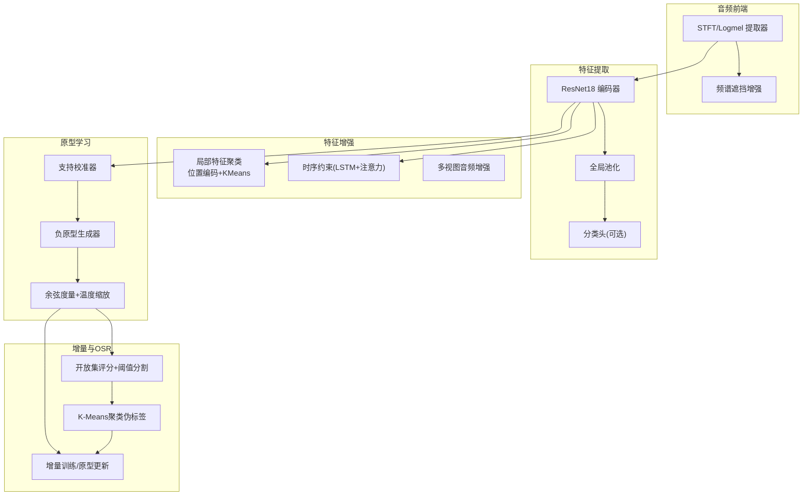
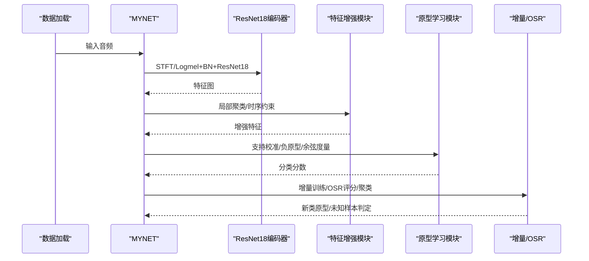
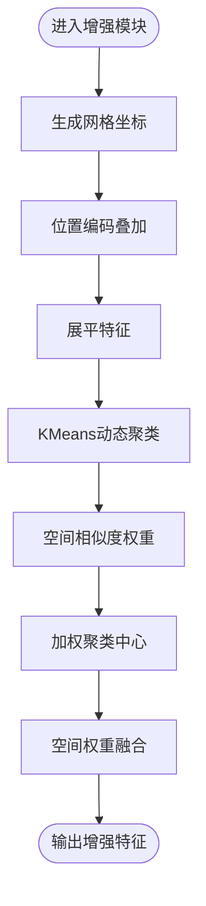
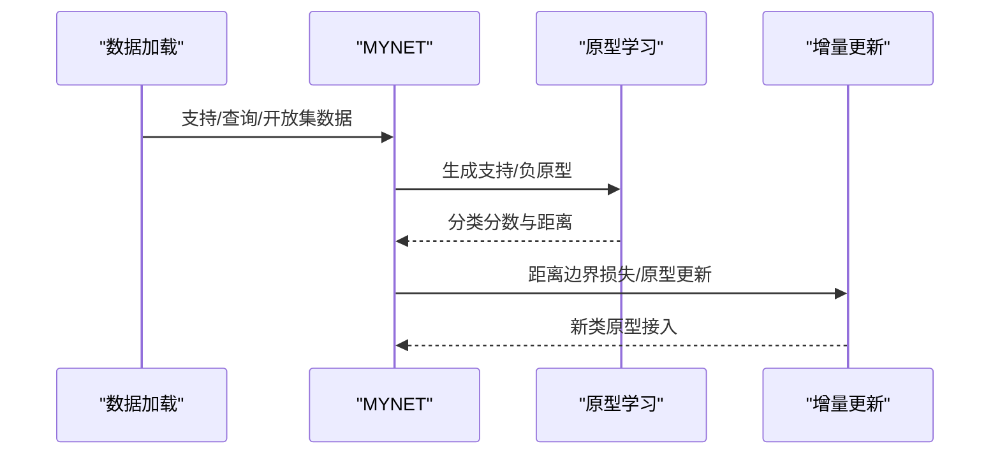
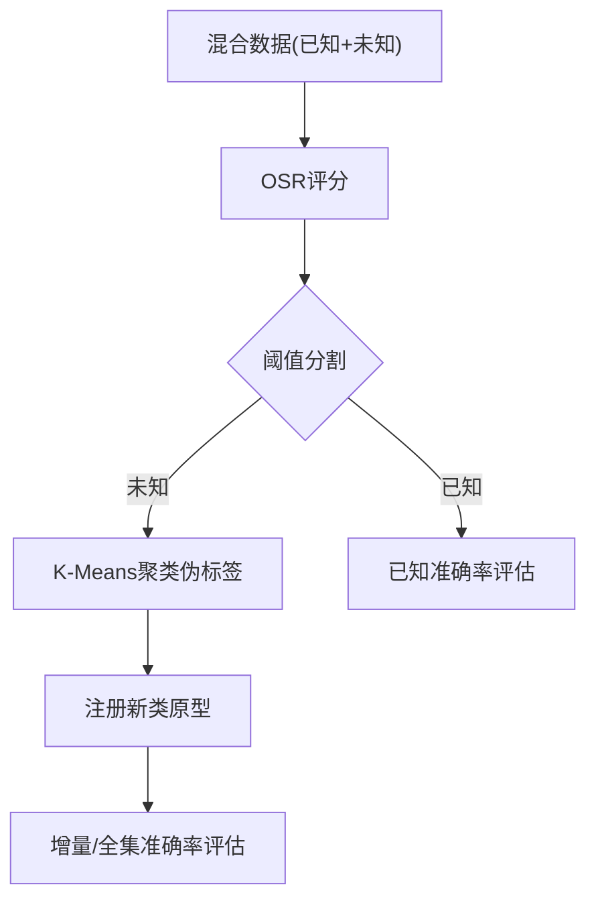
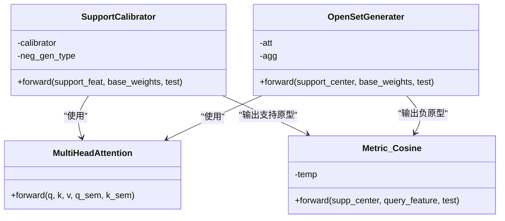
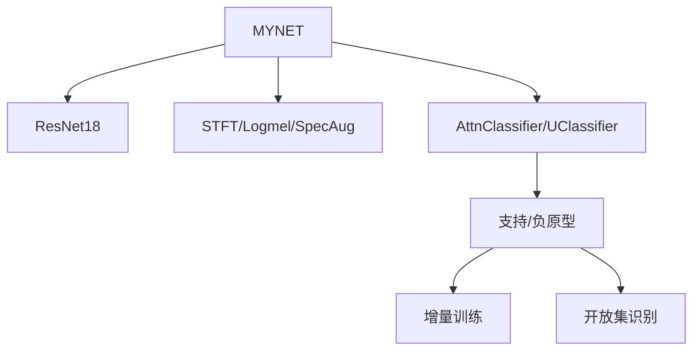

# 核心特性

<cite>
**本文引用的文件**
- [network.py](file://network.py)
- [models/base.py](file://models/base.py)
- [models/feature_enhancer.py](file://models/feature_enhancer.py)
- [models/resnet_enhancer.py](file://models/resnet_enhancer.py)
- [models/incremental_train_helper.py](file://models/incremental_train_helper.py)
- [models/metatrainer.py](file://models/metatrainer.py)
- [models/UClassifier.py](file://models/UClassifier.py)
- [models/AttnClassifier.py](file://models/AttnClassifier.py)
- [configs/default.yml](file://configs/default.yml)
- [test.py](file://test.py)
- [scripts/run_all_baselines.py](file://scripts/run_all_baselines.py)
- [enhance_module.py](file://enhance_module.py)
- [librispeech_enhance.py](file://librispeech_enhance.py)
</cite>

## 目录
1. [简介](#简介)
2. [项目结构](#项目结构)
3. [核心组件](#核心组件)
4. [架构总览](#架构总览)
5. [详细组件分析](#详细组件分析)
6. [依赖分析](#依赖分析)
7. [性能考量](#性能考量)
8. [故障排查指南](#故障排查指南)
9. [结论](#结论)
10. [附录](#附录)

## 简介
本文件面向VAZE系统，系统性梳理其核心特性：音频特征提取、增量学习机制、开放集识别能力、特征增强策略与原型学习系统。文档从技术原理、实现方式、协同机制、使用场景与性能指标等维度展开，帮助读者快速理解VAZE的强大能力与适用范围。

## 项目结构
VAZE围绕“音频特征提取-特征增强-原型学习-增量与开放集识别”主线组织代码，主要模块如下：
- 网络与特征提取：MYNET封装ResNet18特征提取器、音频前端（STFT/Logmel）、分类器与注意力模块。
- 特征增强：局部特征聚类与位置编码、时序约束增强、多视图音频增强。
- 增量学习：支持基类微调、新类原型注册、在线原型自适应。
- 开放集识别：结合OSR方法与聚类，实现未知/已知样本分离与增量注册。
- 原型学习：支持校准器、负原型生成器、余弦度量与温度缩放。

图表来源
- [network.py:18-60](file://network.py#L18-L60)
- [models/resnet_enhancer.py:51-172](file://models/resnet_enhancer.py#L51-L172)
- [models/feature_enhancer.py:5-93](file://models/feature_enhancer.py#L5-L93)
- [librispeech_enhance.py:17-134](file://librispeech_enhance.py#L17-L134)

章节来源
- [network.py:18-60](file://network.py#L18-L60)
- [configs/default.yml:1-88](file://configs/default.yml#L1-L88)

## 核心组件
- 音频特征提取与前端
  - 使用STFT/Logmel提取频谱特征，SpecAug进行频谱遮挡增强，BN归一化，重复通道以适配ResNet输入。
  - 参考路径：[network.py:326-353](file://network.py#L326-L353)
- 特征增强
  - 局部特征聚类：位置编码+KMeans+空间权重融合，生成局部增强特征与聚类中心。
  - 时序约束：LSTM+注意力对时空序列进行动态加权聚合。
  - 参考路径：[models/resnet_enhancer.py:51-172](file://models/resnet_enhancer.py#L51-L172)、[models/feature_enhancer.py:5-93](file://models/feature_enhancer.py#L5-L93)
- 原型学习与分类
  - 支持校准器：多头注意力融合视觉与语义特征，生成支持原型。
  - 负原型生成器：生成伪类原型，配合距离边界损失。
  - 余弦度量+温度缩放：提升类内紧凑与类间可分性。
  - 参考路径：[models/AttnClassifier.py:121-369](file://models/AttnClassifier.py#L121-L369)、[models/UClassifier.py:134-405](file://models/UClassifier.py#L134-L405)
- 增量学习
  - 基类微调与新类原型注册，支持在线原型自适应与重要性加权更新。
  - 参考路径：[models/incremental_train_helper.py:28-156](file://models/incremental_train_helper.py#L28-L156)、[models/base.py:111-151](file://models/base.py#L111-L151)
- 开放集识别
  - 通过OSR评分（如OpenMax/TANE/MLP等）对混合数据进行未知/已知分离，K-Means聚类伪标签后注册新类原型。
  - 参考路径：[scripts/run_all_baselines.py:103-171](file://scripts/run_all_baselines.py#L103-L171)

章节来源
- [network.py:326-503](file://network.py#L326-L503)
- [models/resnet_enhancer.py:51-172](file://models/resnet_enhancer.py#L51-L172)
- [models/feature_enhancer.py:5-93](file://models/feature_enhancer.py#L5-L93)
- [models/AttnClassifier.py:121-369](file://models/AttnClassifier.py#L121-L369)
- [models/UClassifier.py:134-405](file://models/UClassifier.py#L134-L405)
- [models/incremental_train_helper.py:28-156](file://models/incremental_train_helper.py#L28-L156)
- [models/base.py:111-151](file://models/base.py#L111-L151)
- [scripts/run_all_baselines.py:103-171](file://scripts/run_all_baselines.py#L103-L171)

## 架构总览
VAZE采用“特征提取-增强-原型学习-增量与开放集”的分层架构。MYNET负责音频前端与特征提取，LocalFeatureCluster与TemporalConstraint分别承担空间与时间维度的增强；AttnClassifier/UClassifier构建支持/负原型并进行分类；增量训练与OSR流程贯穿多会话，实现持续学习与未知样本处理。

图表来源
- [network.py:471-503](file://network.py#L471-L503)
- [models/resnet_enhancer.py:51-172](file://models/resnet_enhancer.py#L51-L172)
- [models/feature_enhancer.py:27-93](file://models/feature_enhancer.py#L27-L93)
- [models/AttnClassifier.py:38-120](file://models/AttnClassifier.py#L38-L120)
- [models/UClassifier.py:134-285](file://models/UClassifier.py#L134-L285)
- [scripts/run_all_baselines.py:103-171](file://scripts/run_all_baselines.py#L103-L171)

## 详细组件分析

### 音频特征提取与前端
- 技术原理
  - STFT提取短时频谱，Logmel滤波器组生成梅尔频谱，SpecAug进行时间/频率遮挡增强，BN归一化稳定训练。
  - ResNet18作为骨干网络，输出特征图，经全局池化降维后可接入分类头或原型学习。
- 实现要点
  - 网络模块化：前端提取器、增强器、编码器、分类头独立封装，便于替换与组合。
  - 多任务模式：mode字段控制“encoder/openmeta/incre”等不同前向路径。
- 使用场景
  - 语音识别、说话人识别、音频事件检测等任务的特征提取与下游分类。
- 代码片段路径
  - [network.py:326-503](file://network.py#L326-L503)

章节来源
- [network.py:326-503](file://network.py#L326-L503)

### 特征增强策略
- 局部特征聚类与位置编码
  - 通过网格坐标生成位置嵌入，叠加到特征图，增强空间感知。
  - 使用KMeans对展平特征进行动态聚类，结合空间相似度权重生成加权聚类中心，融合到原特征。
  - 参考路径：[models/resnet_enhancer.py:51-172](file://models/resnet_enhancer.py#L51-L172)
- 时序约束增强
  - LSTM对时空序列进行编码，注意力对时间步加权，实现时序上下文建模。
  - 参考路径：[models/feature_enhancer.py:5-26](file://models/feature_enhancer.py#L5-L26)
- 多视图音频增强
  - 时域增强（裁剪、变调、时间拉伸、极性反转）、频域增强（Logmel遮挡）、混合增强，生成多视图输入。
  - 参考路径：[librispeech_enhance.py:17-134](file://librispeech_enhance.py#L17-L134)

图表来源
- [models/resnet_enhancer.py:51-172](file://models/resnet_enhancer.py#L51-L172)

章节来源
- [models/resnet_enhancer.py:51-172](file://models/resnet_enhancer.py#L51-L172)
- [models/feature_enhancer.py:5-26](file://models/feature_enhancer.py#L5-L26)
- [librispeech_enhance.py:17-134](file://librispeech_enhance.py#L17-L134)

### 增量学习机制
- 技术原理
  - 基类微调：利用支持集与查询集进行原型学习，保持旧类性能。
  - 新类注册：通过K-Means对未知样本聚类，生成伪标签并计算新类原型，接入分类头。
  - 在线原型自适应：基于距离边界损失与原型更新策略，逐步扩展类别集合。
- 实现要点
  - 支持多头注意力融合支持与基类记忆，生成支持/负原型。
  - 温度缩放与余弦相似度提升判别力。
  - 参考路径：[models/incremental_train_helper.py:28-156](file://models/incremental_train_helper.py#L28-L156)、[models/AttnClassifier.py:38-120](file://models/AttnClassifier.py#L38-L120)
- 使用场景
  - 语音/音频持续学习、增量类别扩展、跨会话泛化。

图表来源
- [models/incremental_train_helper.py:28-156](file://models/incremental_train_helper.py#L28-L156)
- [models/AttnClassifier.py:38-120](file://models/AttnClassifier.py#L38-L120)

章节来源
- [models/incremental_train_helper.py:28-156](file://models/incremental_train_helper.py#L28-L156)
- [models/AttnClassifier.py:38-120](file://models/AttnClassifier.py#L38-L120)

### 开放集识别能力
- 技术原理
  - 使用OSR方法（如OpenMax、TANE、NCI等）对混合数据进行开放集评分，设定阈值将样本划分为已知/未知。
  - 对未知样本进行K-Means聚类，得到伪标签并注册为新类原型，随后进行增量评估。
- 实现要点
  - 评分+阈值分割+聚类+注册一体化流程，支持多会话迭代。
  - 参考路径：[scripts/run_all_baselines.py:103-171](file://scripts/run_all_baselines.py#L103-L171)
- 使用场景
  - 未知类别发现、鲁棒分类、持续学习中的未知样本处理。

图表来源
- [scripts/run_all_baselines.py:103-171](file://scripts/run_all_baselines.py#L103-L171)

章节来源
- [scripts/run_all_baselines.py:103-171](file://scripts/run_all_baselines.py#L103-L171)

### 原型学习系统
- 支持校准器
  - 多头注意力融合支持特征与基类记忆，生成支持原型，支持语义校准与门控融合。
  - 参考路径：[models/AttnClassifier.py:121-186](file://models/AttnClassifier.py#L121-L186)、[models/UClassifier.py:134-199](file://models/UClassifier.py#L134-L199)
- 负原型生成器
  - 基于支持原型与基类记忆生成负原型，结合距离边界损失，提升判别边界。
  - 参考路径：[models/AttnClassifier.py:188-272](file://models/AttnClassifier.py#L188-L272)、[models/UClassifier.py:201-285](file://models/UClassifier.py#L201-L285)
- 余弦度量与温度缩放
  - 余弦相似度+温度参数，控制类间分布锐利程度，提升分类性能。
  - 参考路径：[models/AttnClassifier.py:352-369](file://models/AttnClassifier.py#L352-L369)、[models/UClassifier.py:365-381](file://models/UClassifier.py#L365-L381)

图表来源
- [models/AttnClassifier.py:121-369](file://models/AttnClassifier.py#L121-L369)
- [models/UClassifier.py:134-381](file://models/UClassifier.py#L134-L381)

章节来源
- [models/AttnClassifier.py:121-369](file://models/AttnClassifier.py#L121-L369)
- [models/UClassifier.py:134-381](file://models/UClassifier.py#L134-L381)

## 依赖分析
- 组件耦合
  - MYNET对ResNet18、音频前端、分类器与注意力模块高度耦合，但通过模块化接口降低耦合度。
  - 增量学习与开放集识别依赖分类器输出的原型与分数，形成闭环反馈。
- 外部依赖
  - 数据加载与评估脚本依赖sklearn（KMeans、聚类评估）、torch、yaml等。
- 循环依赖
  - 未发现直接循环依赖；原型学习模块与网络模块通过前向接口间接耦合。

图表来源
- [network.py:18-60](file://network.py#L18-L60)
- [models/AttnClassifier.py:38-120](file://models/AttnClassifier.py#L38-L120)
- [models/UClassifier.py:134-285](file://models/UClassifier.py#L134-L285)
- [scripts/run_all_baselines.py:103-171](file://scripts/run_all_baselines.py#L103-L171)

章节来源
- [network.py:18-60](file://network.py#L18-L60)
- [models/AttnClassifier.py:38-120](file://models/AttnClassifier.py#L38-L120)
- [models/UClassifier.py:134-285](file://models/UClassifier.py#L134-L285)
- [scripts/run_all_baselines.py:103-171](file://scripts/run_all_baselines.py#L103-L171)

## 性能考量
- 计算复杂度
  - 增强模块（KMeans/LSTM）在训练阶段带来额外开销，建议在推理阶段按需启用。
  - 余弦度量与温度缩放降低显存占用，提升大规模分类效率。
- 训练稳定性
  - Dropout与SpecAug提升泛化，注意与不确定性估计（MC Dropout）的协同使用。
- 评估指标
  - 已在基准脚本中集成已知/未知准确率、F1、增量/全集准确率等指标，便于对比不同方法组合。
- 代码片段路径
  - [scripts/run_all_baselines.py:167-171](file://scripts/run_all_baselines.py#L167-L171)

章节来源
- [scripts/run_all_baselines.py:167-171](file://scripts/run_all_baselines.py#L167-L171)

## 故障排查指南
- 不确定性估计异常
  - 确认MC Dropout模式正确开启（训练时启用，推理时关闭），并检查增强器与特征维度一致性。
  - 参考路径：[test.py:37-85](file://test.py#L37-L85)
- 增量训练不收敛
  - 检查学习率调度、原型更新策略与距离边界损失参数；确认支持/负原型生成逻辑正确。
  - 参考路径：[models/incremental_train_helper.py:28-156](file://models/incremental_train_helper.py#L28-L156)
- 开放集识别阈值不当
  - 使用分位数动态阈值，或在验证集上搜索最优阈值；确保聚类伪标签与真实标签映射正确。
  - 参考路径：[scripts/run_all_baselines.py:113-114](file://scripts/run_all_baselines.py#L113-L114)

章节来源
- [test.py:37-85](file://test.py#L37-L85)
- [models/incremental_train_helper.py:28-156](file://models/incremental_train_helper.py#L28-L156)
- [scripts/run_all_baselines.py:113-114](file://scripts/run_all_baselines.py#L113-L114)

## 结论
VAZE通过“音频特征提取-特征增强-原型学习-增量与开放集识别”的完整链路，实现了在持续学习场景下的高鲁棒性与可扩展性。特征增强模块显著提升了时空表征质量，原型学习系统强化了类间判别，增量与开放集流程保障了长期性能与未知样本处理能力。结合基准脚本与多视图增强策略，VAZE在多种数据集与任务上具备良好的通用性与可复现性。

## 附录
- 关键配置项参考
  - 训练超参、数据集、批次大小、学习率调度等，详见默认配置文件。
  - 参考路径：[configs/default.yml:1-88](file://configs/default.yml#L1-L88)
- 代表性使用流程
  - 训练前端与分类器：[network.py:586-608](file://network.py#L586-L608)
  - 增量训练与原型更新：[models/incremental_train_helper.py:28-156](file://models/incremental_train_helper.py#L28-L156)
  - 开放集识别与聚类注册：[scripts/run_all_baselines.py:103-171](file://scripts/run_all_baselines.py#L103-L171)

章节来源
- [configs/default.yml:1-88](file://configs/default.yml#L1-L88)
- [network.py:586-608](file://network.py#L586-L608)
- [models/incremental_train_helper.py:28-156](file://models/incremental_train_helper.py#L28-L156)
- [scripts/run_all_baselines.py:103-171](file://scripts/run_all_baselines.py#L103-L171)