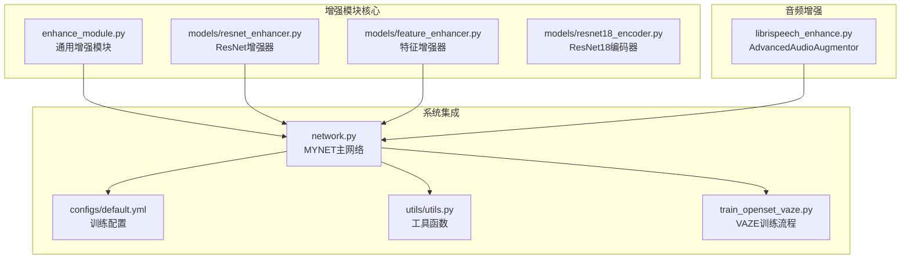
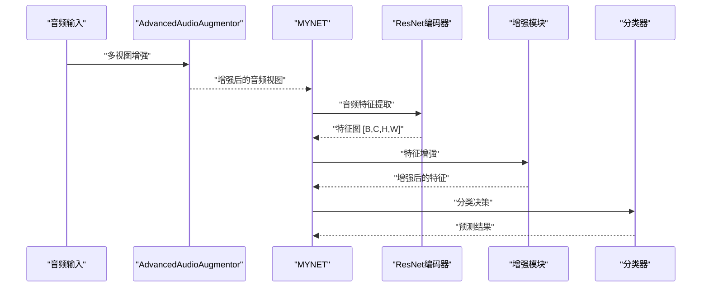
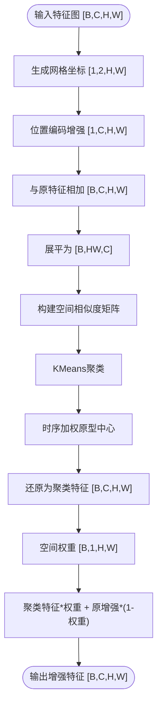
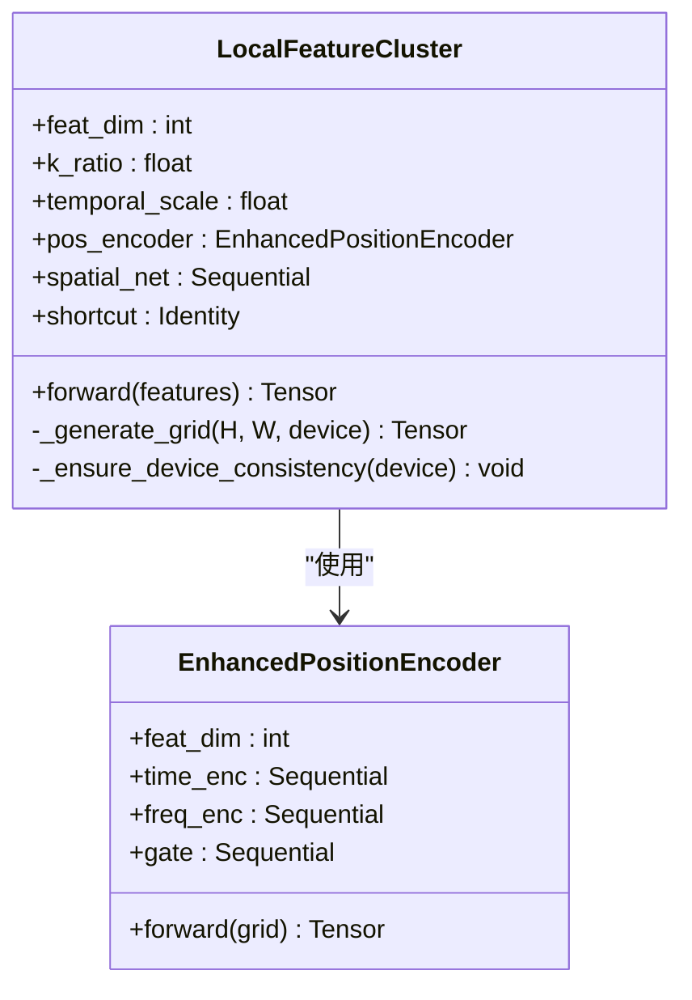
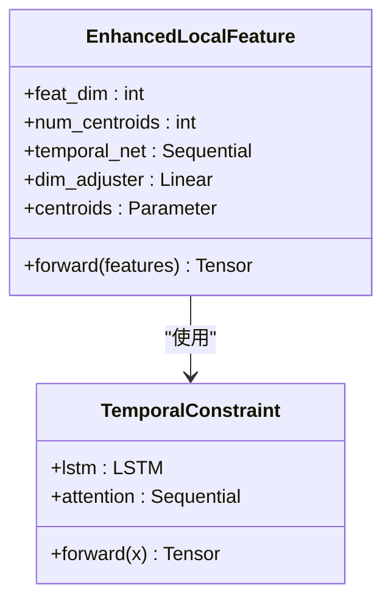
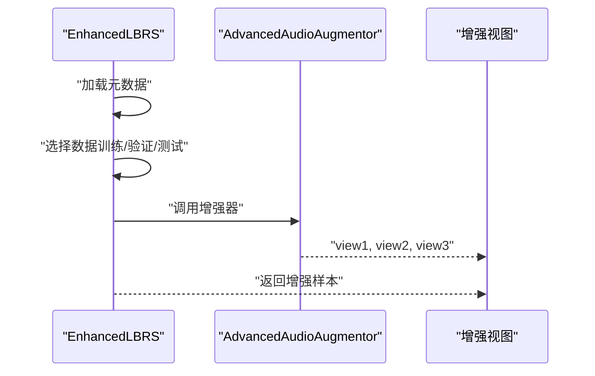
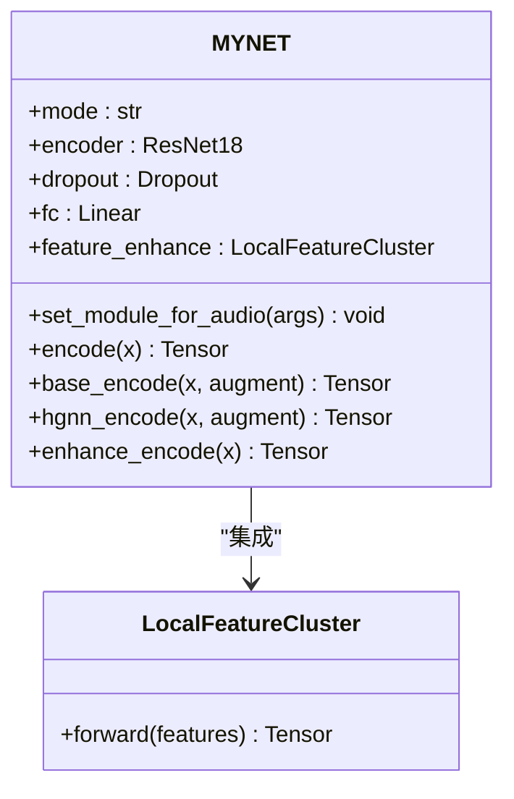
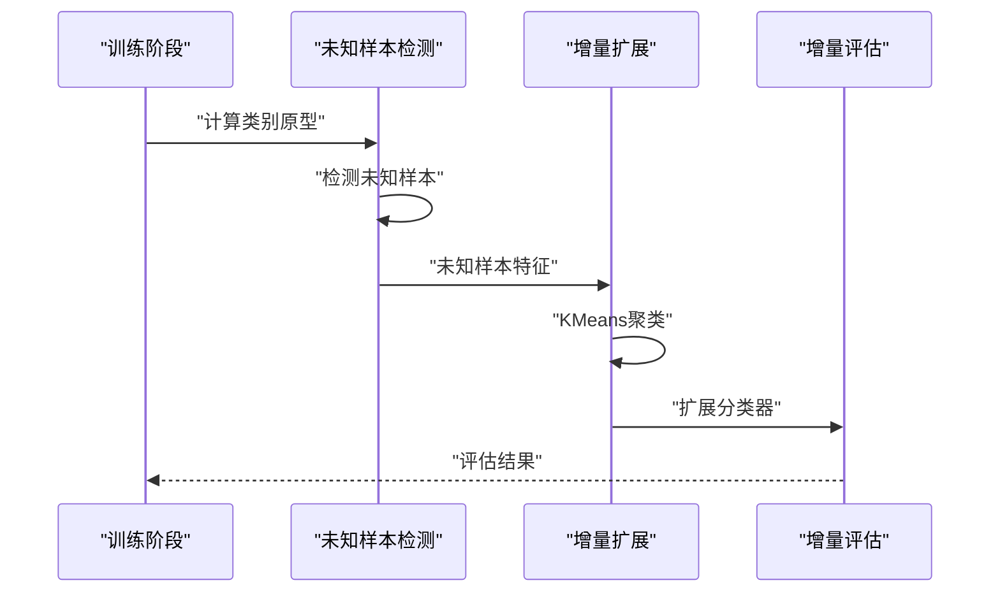
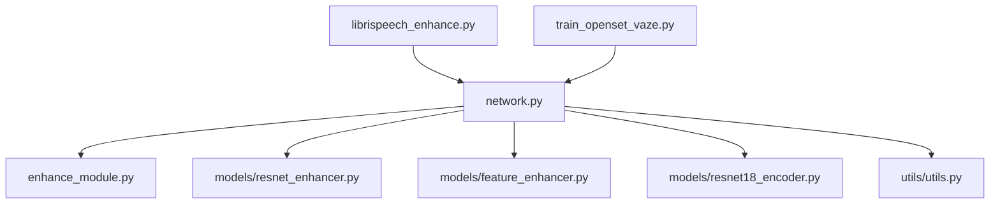

# 增强模块集成架构

<cite>
**本文档引用的文件**
- [enhance_module.py](file://enhance_module.py)
- [models/resnet_enhancer.py](file://models/resnet_enhancer.py)
- [models/feature_enhancer.py](file://models/feature_enhancer.py)
- [librispeech_enhance.py](file://librispeech_enhance.py)
- [train_openset_vaze.py](file://train_openset_vaze.py)
- [network.py](file://network.py)
- [models/resnet18_encoder.py](file://models/resnet18_encoder.py)
- [configs/default.yml](file://configs/default.yml)
- [utils/utils.py](file://utils/utils.py)
</cite>

## 目录
1. [简介](#简介)
2. [项目结构](#项目结构)
3. [核心组件](#核心组件)
4. [架构总览](#架构总览)
5. [详细组件分析](#详细组件分析)
6. [依赖关系分析](#依赖关系分析)
7. [性能考虑](#性能考虑)
8. [故障排除指南](#故障排除指南)
9. [结论](#结论)

## 简介
本文件面向VAZE系统的增强模块集成架构，系统性阐述增强模块的整体设计思路、模块间接口定义与数据流转机制，深入分析ResNet增强器与特征增强器的协同工作机制，说明多层次特征增强策略的实现方式，以及增强模块的可扩展性设计、性能优化策略、跨硬件平台适配指南和错误处理调试机制。文档旨在帮助开发者快速理解并高效扩展增强模块功能。

## 项目结构
增强模块相关代码主要分布在以下目录：
- models：ResNet增强器、特征增强器等核心模块
- enhance_module.py：通用增强模块实现（位置编码、特征融合、聚类等）
- librispeech_enhance.py：音频数据增强与数据集封装
- network.py：主网络MYNET及其音频特征提取、增强集成
- utils/utils.py：通用工具函数（含不确定度计算、设备一致性管理等）
- configs/default.yml：训练配置与超参数
- train_openset_vaze.py：VAZE开放集训练流程与增量评估

**图表来源**
- [enhance_module.py:1-160](file://enhance_module.py#L1-L160)
- [models/resnet_enhancer.py:1-172](file://models/resnet_enhancer.py#L1-L172)
- [models/feature_enhancer.py:1-93](file://models/feature_enhancer.py#L1-L93)
- [librispeech_enhance.py:1-268](file://librispeech_enhance.py#L1-L268)
- [network.py:18-518](file://network.py#L18-L518)
- [configs/default.yml:1-88](file://configs/default.yml#L1-L88)
- [utils/utils.py:1-200](file://utils/utils.py#L1-L200)
- [train_openset_vaze.py:1-481](file://train_openset_vaze.py#L1-L481)

**章节来源**
- [enhance_module.py:1-160](file://enhance_module.py#L1-L160)
- [models/resnet_enhancer.py:1-172](file://models/resnet_enhancer.py#L1-L172)
- [models/feature_enhancer.py:1-93](file://models/feature_enhancer.py#L1-L93)
- [librispeech_enhance.py:1-268](file://librispeech_enhance.py#L1-L268)
- [network.py:18-518](file://network.py#L18-L518)
- [configs/default.yml:1-88](file://configs/default.yml#L1-L88)
- [utils/utils.py:1-200](file://utils/utils.py#L1-L200)
- [train_openset_vaze.py:1-481](file://train_openset_vaze.py#L1-L481)

## 核心组件
- 通用增强模块（enhance_module.py）：提供位置编码、特征融合、动态聚类与空间权重增强等通用能力，支持在任意特征图上进行多层次增强。
- ResNet增强器（models/resnet_enhancer.py）：针对ResNet中间层特征的增强模块，包含增强的位置编码器、空间权重网络与残差连接，保证增强后特征形状与输入一致。
- 特征增强器（models/feature_enhancer.py）：面向时序特征的增强模块，结合LSTM与原型中心实现动态权重聚合与特征压缩。
- 音频增强器（librispeech_enhance.py）：AdvancedAudioAugmentor提供多视图音频增强，支持时域、频域与混合增强，EnhancedLBRS数据集封装训练/测试阶段的数据加载与增强。
- 主网络MYNET（network.py）：集成ResNet编码器、音频特征提取、增强模块与分类器，提供多种模式（encoder/openmeta）与增强接口。
- 工具函数（utils/utils.py）：包含不确定度计算、设备一致性管理、可视化等功能，支撑增强模块的调试与性能监控。
- VAZE训练流程（train_openset_vaze.py）：实现VAZE开放集检测与增量学习，提供可比较的增量评估流程。

**章节来源**
- [enhance_module.py:14-160](file://enhance_module.py#L14-L160)
- [models/resnet_enhancer.py:51-172](file://models/resnet_enhancer.py#L51-L172)
- [models/feature_enhancer.py:27-93](file://models/feature_enhancer.py#L27-L93)
- [librispeech_enhance.py:17-268](file://librispeech_enhance.py#L17-L268)
- [network.py:18-518](file://network.py#L18-L518)
- [utils/utils.py:23-131](file://utils/utils.py#L23-L131)
- [train_openset_vaze.py:86-481](file://train_openset_vaze.py#L86-L481)

## 架构总览
增强模块采用“分层增强 + 动态融合”的设计理念：
- 低层：位置编码与空间权重增强，提升空间感知与局部细节表达。
- 中层：动态聚类与原型中心，实现自适应特征聚合与降维。
- 高层：特征融合与分类器，整合全局与局部特征，完成最终决策。

**图表来源**
- [librispeech_enhance.py:115-133](file://librispeech_enhance.py#L115-L133)
- [network.py:471-518](file://network.py#L471-L518)
- [models/resnet_enhancer.py:73-160](file://models/resnet_enhancer.py#L73-L160)

## 详细组件分析

### 通用增强模块（enhance_module.py）
- 功能概述
  - FeatureFusion：基于MLP的动态特征融合，将全局特征与局部特征按权重融合。
  - EnhancedPositionEncoder：分别对时间轴与频率轴进行编码，通过门控机制动态融合，输出与特征维度一致的位置嵌入。
  - LocalFeatureCluster：在特征图上生成网格坐标，进行位置编码与增强，执行动态聚类与空间权重增强，最后通过融合网络整合全局与局部特征。
- 数据流
  - 输入：特征图[B, C, H, W]
  - 输出：增强后的特征与聚类中心
- 关键特性
  - 设备一致性管理：自动迁移参数至目标设备，确保模块内各子模块在同一设备上。
  - 动态聚类：基于空间位置相似度构建相似度矩阵，使用KMeans进行聚类，支持时序加权原型中心更新。
  - 空间权重增强：通过空间权重网络为每个空间位置分配权重，控制聚类特征与原增强特征的融合比例。

**图表来源**
- [enhance_module.py:95-148](file://enhance_module.py#L95-L148)

**章节来源**
- [enhance_module.py:14-160](file://enhance_module.py#L14-L160)

### ResNet增强器（models/resnet_enhancer.py）
- 功能概述
  - EnhancedPositionEncoder：对网格坐标进行时间/频率编码并通过门控融合，输出与特征维度一致的位置嵌入。
  - LocalFeatureCluster：在ResNet中间层特征上进行增强，包含位置编码、动态聚类、空间权重融合与残差连接，保证输出形状与输入一致。
- 数据流
  - 输入：特征图[B, C, H, W]
  - 输出：增强后的特征[B, C, H, W]
- 关键特性
  - 批量KMeans：一次性将所有样本展平后迁移至CPU进行聚类，减少CPU-GPU交互次数。
  - 空间相似度加权：基于空间位置相似度对聚类中心进行加权，提升聚类质量。
  - 残差连接：增强后的特征与原特征相加，稳定训练并保持语义一致性。

**图表来源**
- [models/resnet_enhancer.py:21-172](file://models/resnet_enhancer.py#L21-L172)

**章节来源**
- [models/resnet_enhancer.py:51-172](file://models/resnet_enhancer.py#L51-L172)

### 特征增强器（models/feature_enhancer.py）
- 功能概述
  - TemporalConstraint：使用双向LSTM与时序注意力实现时序约束，提取时序特征并进行加权聚合。
  - EnhancedLocalFeature：通过原型中心与动态权重实现局部特征增强，支持维度自适应与安全reshape。
- 数据流
  - 输入：特征图[B, C, H, W]
  - 输出：增强后的特征[B, k, C]或[B, k, H, W, scale_factor]并求和
- 关键特性
  - LSTM时序网络：严格保持输入维度，确保与特征维度匹配。
  - 动态权重计算：基于原型中心与特征的相似度计算权重，实现自适应特征聚合。
  - 维度修正：根据输入维度自动调整，确保与目标维度一致。

**图表来源**
- [models/feature_enhancer.py:5-93](file://models/feature_enhancer.py#L5-L93)

**章节来源**
- [models/feature_enhancer.py:27-93](file://models/feature_enhancer.py#L27-L93)

### 音频增强器与数据集（librispeech_enhance.py）
- 功能概述
  - AdvancedAudioAugmentor：提供多视图音频增强，包括时域增强、频域增强与混合增强，支持配置化的增强策略。
  - EnhancedLBRS：封装LibriSpeech数据集的加载与采样，支持few-shot场景与训练/验证/测试阶段的数据选择。
- 数据流
  - 输入：原始音频信号
  - 输出：三种增强视图（时域、频域、混合）
- 关键特性
  - 可配置增强：支持噪声、音高变换、时间拉伸等增强操作的概率控制。
  - 多视图生成：同时生成三种增强视图，便于对比与实验。
  - 数据集选择：支持按类别选择数据，支持few-shot与增量场景。

**图表来源**
- [librispeech_enhance.py:135-216](file://librispeech_enhance.py#L135-L216)

**章节来源**
- [librispeech_enhance.py:17-268](file://librispeech_enhance.py#L17-L268)

### 主网络MYNET与增强集成（network.py）
- 功能概述
  - MYNET：集成ResNet18编码器、音频特征提取、增强模块与分类器，提供多种模式（encoder/openmeta）。
  - 增强集成：在编码路径中插入LocalFeatureCluster增强模块，支持在layer3输出处进行增强。
  - 音频特征提取：使用Spectrogram与LogmelFilterBank提取Mel频谱，并通过SpecAugmentation进行时频遮挡。
- 数据流
  - 输入：音频信号
  - 输出：特征或分类结果
- 关键特性
  - 模式切换：支持encoder/openmeta等模式，满足不同任务需求。
  - 增强接口：提供base_encode/hgnn_encode等接口，便于在不同阶段启用增强。
  - 不确定性估计：通过MC Dropout与特征掩码计算不确定度，辅助模型鲁棒性评估。

**图表来源**
- [network.py:18-518](file://network.py#L18-L518)

**章节来源**
- [network.py:18-518](file://network.py#L18-L518)

### VAZE训练流程（train_openset_vaze.py）
- 功能概述
  - VAZE开放集训练：训练闭集分类器，计算类别原型，使用置信度与原型相似度检测未知样本，对未知样本进行聚类并增量扩展分类器。
  - 增量评估：按照基准协议进行增量评估，输出可比较的结果文件。
- 数据流
  - 输入：训练数据与模型
  - 输出：增量扩展后的模型与评估结果
- 关键特性
  - 开放集检测：结合softmax置信度与特征与原型的余弦相似度进行未知样本检测。
  - 增量学习：对检测到的未知样本进行KMeans聚类，扩展分类器权重。
  - 结果写入：生成标准化的评估结果文件，便于与其他方法对比。

**图表来源**
- [train_openset_vaze.py:86-481](file://train_openset_vaze.py#L86-L481)

**章节来源**
- [train_openset_vaze.py:86-481](file://train_openset_vaze.py#L86-L481)

## 依赖关系分析
- 模块耦合
  - MYNET与增强模块：MYNET在编码路径中集成LocalFeatureCluster，形成强耦合关系，确保增强在正确的特征层级生效。
  - 增强模块与工具函数：增强模块依赖utils中的设备一致性管理与可视化功能，保证跨设备运行稳定性。
  - 音频增强与数据集：AdvancedAudioAugmentor与EnhancedLBRS紧密配合，提供多视图增强与数据加载。
- 外部依赖
  - PyTorch：深度学习框架，提供张量运算与神经网络模块。
  - scikit-learn：KMeans聚类与评估指标，用于未知样本检测与聚类扩展。
  - torchaudio/torchlibrosa：音频处理与STFT/Mel频谱提取，支撑音频特征工程。
- 循环依赖
  - 未发现循环依赖，模块间关系清晰，职责分离明确。

**图表来源**
- [network.py:18-518](file://network.py#L18-L518)
- [enhance_module.py:1-160](file://enhance_module.py#L1-L160)
- [models/resnet_enhancer.py:1-172](file://models/resnet_enhancer.py#L1-L172)
- [models/feature_enhancer.py:1-93](file://models/feature_enhancer.py#L1-L93)
- [models/resnet18_encoder.py:1-471](file://models/resnet18_encoder.py#L1-L471)
- [utils/utils.py:1-200](file://utils/utils.py#L1-L200)
- [librispeech_enhance.py:1-268](file://librispeech_enhance.py#L1-L268)
- [train_openset_vaze.py:1-481](file://train_openset_vaze.py#L1-L481)

**章节来源**
- [network.py:18-518](file://network.py#L18-L518)
- [enhance_module.py:1-160](file://enhance_module.py#L1-L160)
- [models/resnet_enhancer.py:1-172](file://models/resnet_enhancer.py#L1-L172)
- [models/feature_enhancer.py:1-93](file://models/feature_enhancer.py#L1-L93)
- [models/resnet18_encoder.py:1-471](file://models/resnet18_encoder.py#L1-L471)
- [utils/utils.py:1-200](file://utils/utils.py#L1-L200)
- [librispeech_enhance.py:1-268](file://librispeech_enhance.py#L1-L268)
- [train_openset_vaze.py:1-481](file://train_openset_vaze.py#L1-L481)

## 性能考虑
- 内存管理
  - 批量KMeans：在LocalFeatureCluster中一次性将所有样本展平后迁移至CPU进行聚类，减少CPU-GPU交互次数，降低内存碎片化风险。
  - 设备一致性：通过_device跟踪与自动迁移，避免重复设备拷贝，减少显存占用。
  - 维度修正：EnhancedLocalFeature根据输入维度自动调整，避免不必要的张量复制。
- 计算效率
  - 向量化聚类：使用einsum与矩阵乘法替代循环，提升聚类中心计算效率。
  - 空间相似度：通过torch.cdist构建相似度矩阵，利用广播机制减少内存开销。
  - 注意力机制：MultiheadAttention在展平特征上进行，减少额外的张量变换。
- 并行化
  - 多视图增强：AdvancedAudioAugmentor并行生成三种视图，提高数据准备效率。
  - VAZE增量评估：支持多轮测试与增量评估，便于并行化扩展。

[本节为通用性能讨论，无需具体文件分析]

## 故障排除指南
- 设备不一致错误
  - 现象：模块内参数与输入张量不在同一设备上。
  - 处理：使用_enforce_device_consistency确保所有参数迁移至目标设备，并进行断言检查。
  - 参考：[utils/utils.py:118-131](file://utils/utils.py#L118-L131)
- 维度不匹配
  - 现象：LSTM输入维度与特征维度不一致。
  - 处理：在EnhancedLocalFeature中进行维度修正，确保输入维度与目标维度一致。
  - 参考：[models/feature_enhancer.py:49-66](file://models/feature_enhancer.py#L49-L66)
- 聚类异常
  - 现象：KMeans聚类失败或聚类中心为空。
  - 处理：检查有效聚类掩码，过滤空聚类并使用原始中心填充。
  - 参考：[models/resnet_enhancer.py:112-147](file://models/resnet_enhancer.py#L112-L147)
- 不确定度计算异常
  - 现象：特征堆叠后维度不一致导致核范数计算失败。
  - 处理：在utils/utils.py中统一特征维度，确保mean操作后维度一致。
  - 参考：[utils/utils.py:23-60](file://utils/utils.py#L23-L60)
- 音频增强配置错误
  - 现象：增强配置项缺失或类型不正确。
  - 处理：在AdvancedAudioAugmentor中提供默认配置并进行更新，确保配置完整性。
  - 参考：[librispeech_enhance.py:19-44](file://librispeech_enhance.py#L19-L44)

**章节来源**
- [utils/utils.py:118-131](file://utils/utils.py#L118-L131)
- [models/feature_enhancer.py:49-66](file://models/feature_enhancer.py#L49-L66)
- [models/resnet_enhancer.py:112-147](file://models/resnet_enhancer.py#L112-L147)
- [utils/utils.py:23-60](file://utils/utils.py#L23-L60)
- [librispeech_enhance.py:19-44](file://librispeech_enhance.py#L19-L44)

## 结论
VAZE系统的增强模块集成架构通过“分层增强 + 动态融合”的设计，实现了从低层空间感知到高层语义整合的多层次特征增强策略。ResNet增强器与特征增强器在不同特征层级协同工作，结合VAZE的开放集检测与增量学习流程，形成了完整的增强模块生态。模块具备良好的可扩展性、稳定的设备一致性管理与高效的性能表现，适用于GPU与CPU环境的多样化部署需求。通过完善的错误处理与调试机制，开发者可以快速定位并解决运行中的问题，保障系统的可靠性与可维护性。