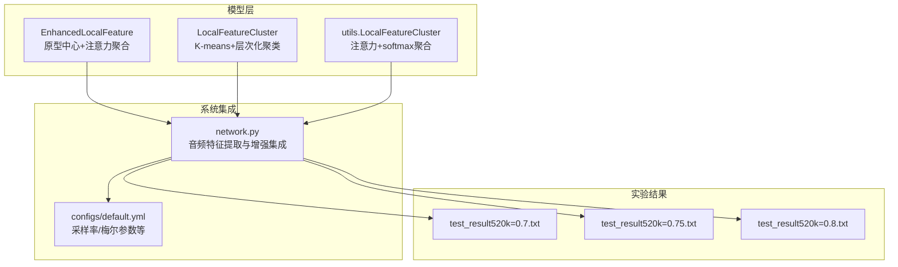
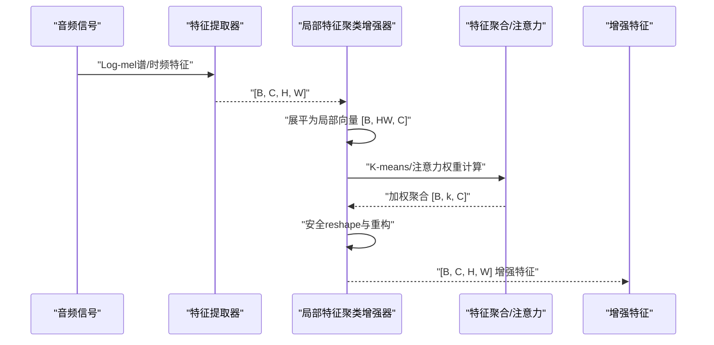
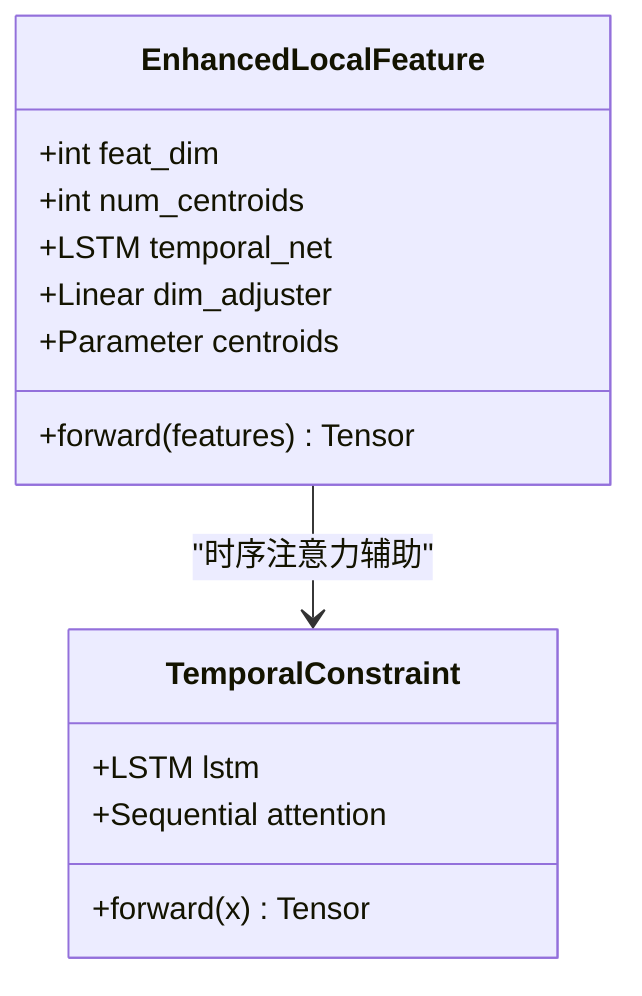
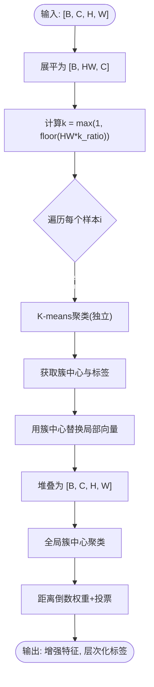
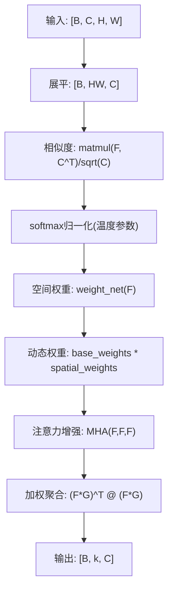
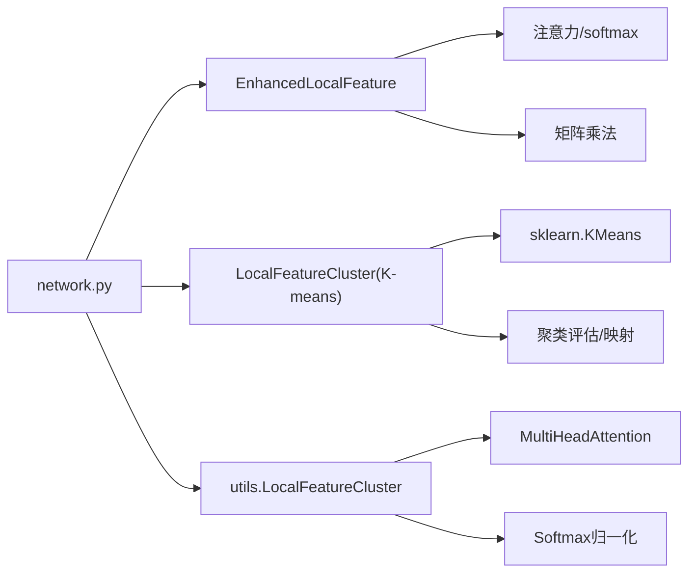

# 局部特征聚类机制

<cite>
**本文引用的文件列表**
- [feature_enhancer.py](file://models/feature_enhancer.py)
- [deepcluster.py](file://deepcluster.py)
- [utils.py](file://utils/utils.py)
- [network.py](file://network.py)
- [test_result520k=0.7.txt](file://save_result/test_result520k=0.7.txt)
- [test_result520k=0.75.txt](file://save_result/test_result520k=0.75.txt)
- [test_result520k=0.8.txt](file://save_result/test_result520k=0.8.txt)
- [default.yml](file://configs/default.yml)
</cite>

## 目录
1. [引言](#引言)
2. [项目结构](#项目结构)
3. [核心组件](#核心组件)
4. [架构总览](#架构总览)
5. [详细组件分析](#详细组件分析)
6. [依赖关系分析](#依赖关系分析)
7. [性能考量](#性能考量)
8. [故障排查指南](#故障排查指南)
9. [结论](#结论)
10. [附录](#附录)

## 引言
本技术文档聚焦VAZE系统中的“局部特征聚类机制”，围绕EnhancedLocalFeature类展开，系统阐述K-means聚类思想在音频特征中的应用方式、原型中心(centroids)的初始化策略与动态更新机制、注意力权重计算以识别重要局部特征模式的方法，以及特征聚合过程中的数学原理（矩阵乘法、softmax归一化、张量重塑）。同时，结合仓库中保存的k_ratio参数在不同取值下的实验结果，给出聚类数量对性能影响的量化分析建议，并提供在不同音频场景下的应用示例与实践指导。

## 项目结构
本项目采用模块化组织，与局部特征聚类相关的核心文件如下：
- models/feature_enhancer.py：包含EnhancedLocalFeature类，实现基于原型中心与注意力的局部特征增强与聚合。
- deepcluster.py：提供LocalFeatureCluster类的K-means实现与层次化聚类流程，包含簇中心动态更新与置信度投票等机制。
- utils/utils.py：提供LocalFeatureCluster类的注意力加权版本，强调softmax归一化与矩阵乘法聚合。
- network.py：在音频模块中集成局部特征聚类增强器，体现其在端到端系统中的落地。
- save_result/：保存了不同k_ratio取值下的实验结果文本，便于量化分析。
- configs/default.yml：提供训练与特征提取的关键配置项，如采样率、梅尔滤波器组参数等。

图表来源
- [feature_enhancer.py](file://models/feature_enhancer.py)
- [deepcluster.py](file://deepcluster.py)
- [utils.py](file://utils/utils.py)
- [network.py](file://network.py)
- [default.yml](file://configs/default.yml)

章节来源
- [feature_enhancer.py](file://models/feature_enhancer.py)
- [deepcluster.py](file://deepcluster.py)
- [utils.py](file://utils/utils.py)
- [network.py](file://network.py)
- [default.yml](file://configs/default.yml)

## 核心组件
- EnhancedLocalFeature：以可学习原型中心为核心，结合时序LSTM与注意力权重，实现对局部特征的动态加权聚合与重构。
- LocalFeatureCluster（K-means版本）：对每个样本独立执行K-means聚类，得到簇中心并进行特征增强；支持层次化聚类与置信度投票。
- utils.LocalFeatureCluster（注意力版本）：通过矩阵乘法计算相似度，softmax归一化得到注意力权重，再进行加权聚合，突出重要局部特征模式。
- 系统集成：在网络模块中接入局部特征聚类增强器，配合音频特征提取器完成端到端训练与推理。

章节来源
- [feature_enhancer.py](file://models/feature_enhancer.py)
- [deepcluster.py](file://deepcluster.py)
- [utils.py](file://utils/utils.py)
- [network.py](file://network.py)

## 架构总览
下图展示了从音频输入到局部特征聚类增强再到最终特征输出的整体流程，涵盖K-means与注意力两种聚类/聚合路径。

图表来源
- [feature_enhancer.py](file://models/feature_enhancer.py)
- [deepcluster.py](file://deepcluster.py)
- [utils.py](file://utils/utils.py)

## 详细组件分析

### EnhancedLocalFeature 类详解
- 原型中心初始化：通过可学习参数初始化若干原型中心，维度与特征维度一致，用于表征局部模式。
- 时序特征提取：将展平后的局部特征按空间位置排列，送入双向LSTM，得到时序上下文特征，再经线性层聚合。
- 注意力权重计算：通过矩阵乘法计算局部特征与原型中心的相似度，经softmax归一化得到注意力权重。
- 特征聚合：使用bmm将局部特征按权重聚合到原型空间，再进行安全reshape与重构，恢复为原空间结构。
- 维度兼容：若输入通道数与期望维度不一致，通过线性层进行维度修正，保证后续计算稳定。

图表来源
- [feature_enhancer.py](file://models/feature_enhancer.py)

章节来源
- [feature_enhancer.py](file://models/feature_enhancer.py)

### K-means 聚类与层次化聚类（LocalFeatureCluster）
- 簇数量计算：k = max(1, int(H*W * k_ratio))，k_ratio为聚类比例，随特征图尺寸自适应调整。
- 独立样本聚类：逐样本执行K-means，避免跨样本干扰，得到簇中心与标签。
- 特征增强：将每个局部向量替换为其所属簇中心，实现“原型增强”。
- 层次化与置信度投票：对所有样本的簇中心进行全局K-means，再以局部中心与全局中心的距离倒数作为权重，进行加权投票映射到真实类别。

图表来源
- [deepcluster.py](file://deepcluster.py)

章节来源
- [deepcluster.py](file://deepcluster.py)

### 注意力加权聚合（utils.LocalFeatureCluster）
- 相似度计算：通过矩阵乘法计算局部特征与原型中心的相似度，除以维度平方根进行归一化。
- softmax归一化：对相似度进行softmax，得到注意力权重，突出重要局部模式。
- 空间权重增强：通过可学习网络对局部特征施加空间权重，进一步细化关注区域。
- 加权聚合：将注意力特征与原始局部特征做element-wise乘积，再按权重矩阵进行bmm聚合，得到原型空间表示。

图表来源
- [utils.py](file://utils/utils.py)

章节来源
- [utils.py](file://utils/utils.py)

### 在系统中的集成与应用
- 网络模块集成：在音频特征提取与分类流程中引入局部特征聚类增强器，提升特征判别能力。
- 配置参数：采样率、窗口长度、hop长度、梅尔滤波器组等参数在配置文件中统一管理，确保特征提取与聚类的一致性。

章节来源
- [network.py](file://network.py)
- [default.yml](file://configs/default.yml)

## 依赖关系分析
- EnhancedLocalFeature依赖原型中心参数与注意力权重计算，通过矩阵乘法与softmax实现局部特征的动态加权。
- LocalFeatureCluster（K-means版本）依赖scikit-learn的KMeans，对每个样本独立聚类，再进行层次化标签映射。
- utils.LocalFeatureCluster依赖多头注意力与softmax归一化，强调对重要局部模式的关注。
- 系统集成层通过网络模块将上述组件串联，形成完整的音频特征增强流水线。

图表来源
- [feature_enhancer.py](file://models/feature_enhancer.py)
- [deepcluster.py](file://deepcluster.py)
- [utils.py](file://utils/utils.py)
- [network.py](file://network.py)

章节来源
- [feature_enhancer.py](file://models/feature_enhancer.py)
- [deepcluster.py](file://deepcluster.py)
- [utils.py](file://utils/utils.py)
- [network.py](file://network.py)

## 性能考量
- k_ratio对性能的影响：仓库中保存了k_ratio分别为0.7、0.75、0.8的实验结果文本，可用于量化分析不同聚类强度对增量学习场景下已知/未知类准确率、F1分数与增量准确率的影响。
- 实验结果解读要点：
  - 已知类准确率（Known Acc）：反映模型在已学类别上的稳定性。
  - 未知类准确率（Unknown Acc）：反映模型对新类的泛化能力。
  - F1分数：综合考虑精确率与召回率。
  - 增量准确率（Incremental Acc）：衡量持续学习过程中的累积性能。
- 建议：
  - 在特征图较大、通道数较多时，适当降低k_ratio以避免过度聚类导致信息丢失。
  - 在噪声较强或关键特征稀疏的场景，可适度提高k_ratio以增强局部模式的识别能力。
  - 结合具体数据集与任务，通过网格搜索k_ratio并在验证集上评估上述指标，选择最优参数。

章节来源
- [test_result520k=0.7.txt](file://save_result/test_result520k=0.7.txt)
- [test_result520k=0.75.txt](file://save_result/test_result520k=0.75.txt)
- [test_result520k=0.8.txt](file://save_result/test_result520k=0.8.txt)

## 故障排查指南
- 维度不匹配：EnhancedLocalFeature在forward中会对输入通道数进行维度修正，若仍报错，检查输入特征的通道数与期望维度是否一致。
- 数值稳定性：softmax归一化前对logits进行clamp，避免极端值导致的数值不稳定。
- 设备一致性：utils.LocalFeatureCluster与resnet_enhancer.LocalFeatureCluster均包含设备一致性检查，确保参数与输入在同一设备上。
- 聚类失败：LocalFeatureCluster（K-means版本）对每个样本独立聚类，若出现空簇或标签异常，检查k_ratio与特征尺度。

章节来源
- [feature_enhancer.py](file://models/feature_enhancer.py)
- [utils.py](file://utils/utils.py)
- [deepcluster.py](file://deepcluster.py)

## 结论
VAZE系统通过多种局部特征聚类机制，实现了对音频特征的动态增强与模式识别。EnhancedLocalFeature以原型中心与注意力为核心，强调对重要局部模式的加权聚合；K-means版本提供稳健的聚类基础与层次化标签映射；注意力版本则通过softmax归一化与矩阵乘法突出关键特征。结合k_ratio的量化分析与系统集成，可在不同音频场景下取得更优的噪声抑制与关键特征提取效果。

## 附录
- 应用示例建议：
  - 低信噪比语音：提高k_ratio以增强局部模式识别，结合注意力权重可视化定位噪声区域。
  - 多说话人分离：利用层次化聚类的置信度投票，提升对新说话人的识别能力。
  - 时变噪声：结合TemporalConstraint与时序LSTM，提升对动态噪声的鲁棒性。
- 参数调优流程：
  - 固定其他超参，依次尝试k_ratio ∈ {0.5, 0.6, 0.7, 0.75, 0.8}。
  - 在验证集上记录Known Acc、Unknown Acc、F1 Score、Incremental Acc。
  - 选择在Unknown Acc与Incremental Acc上表现最佳且Known Acc下降最小的k_ratio。