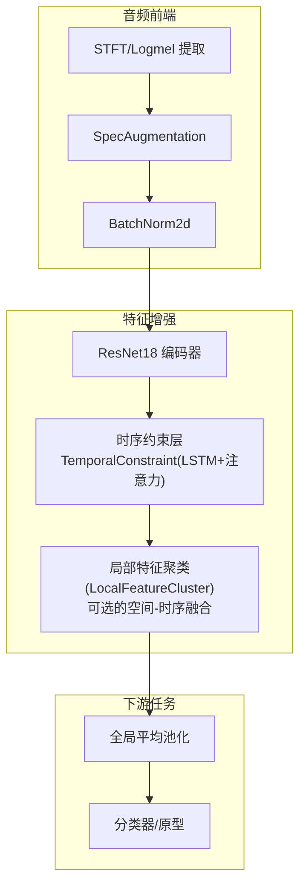
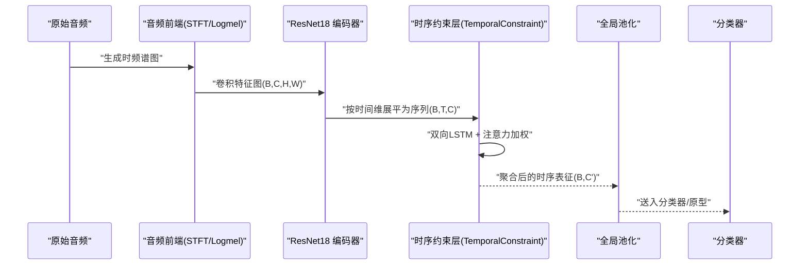
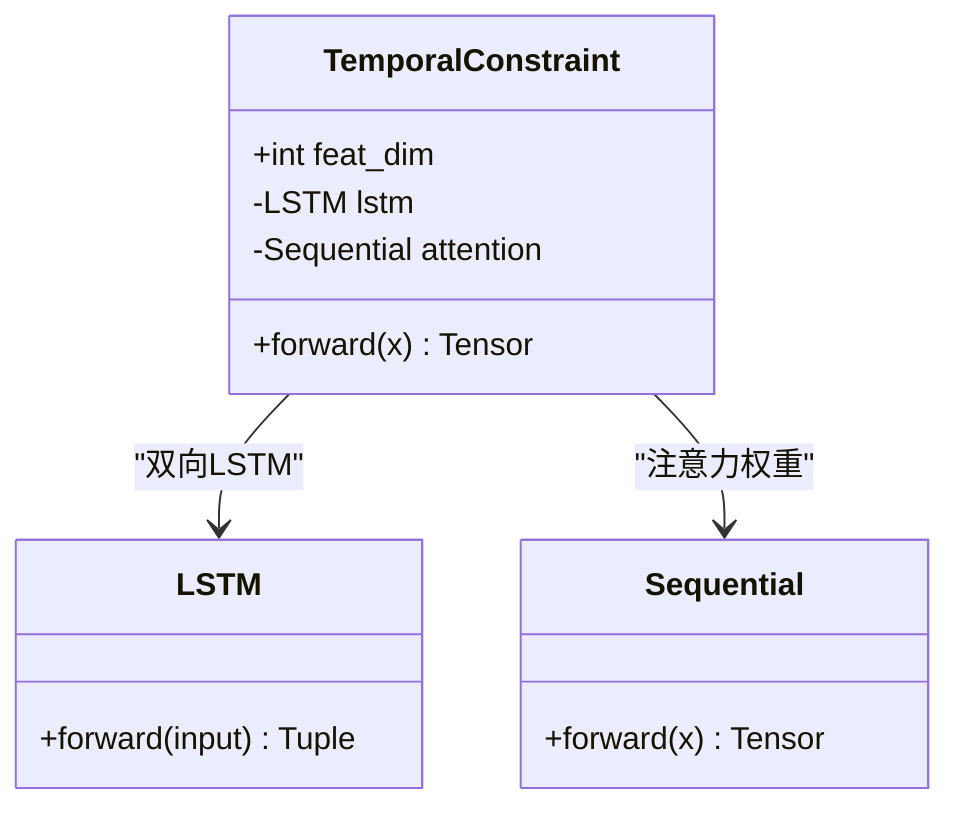
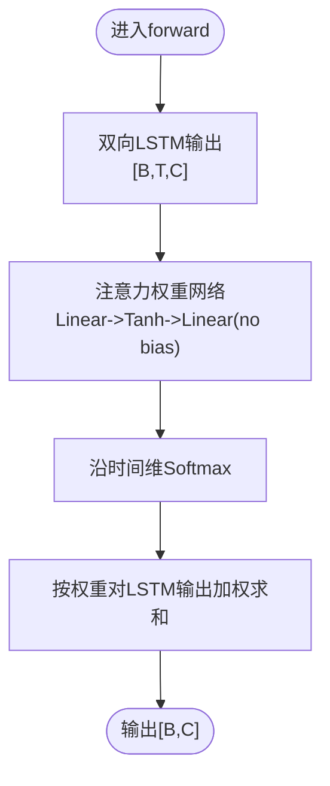
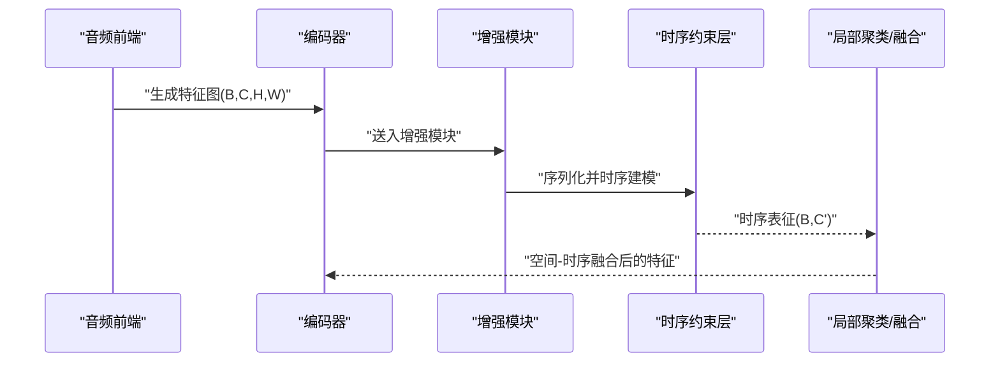
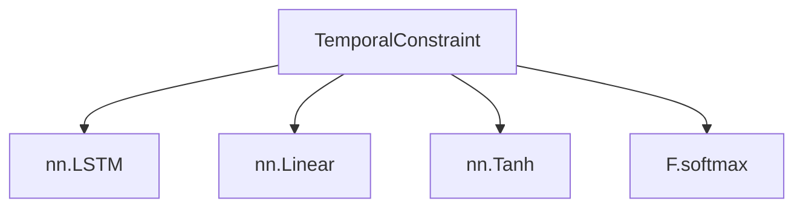

# 时序约束层

<cite>
**本文引用的文件**
- [feature_enhancer.py](file://models/feature_enhancer.py)
- [network.py](file://network.py)
- [test.py](file://test.py)
- [default.yml](file://configs/default.yml)
</cite>

## 目录
1. [简介](#简介)
2. [项目结构](#项目结构)
3. [核心组件](#核心组件)
4. [架构总览](#架构总览)
5. [详细组件分析](#详细组件分析)
6. [依赖分析](#依赖分析)
7. [性能考量](#性能考量)
8. [故障排查指南](#故障排查指南)
9. [结论](#结论)
10. [附录](#附录)

## 简介
本技术文档聚焦于VAZE系统中的“时序约束层”，系统性阐述TemporalConstraint类的设计理念、双向LSTM对音频时序依赖的建模方式、注意力机制在时序建模中的作用与权重计算方法，并说明时序特征与空间特征的融合策略、注意力加权如何突出重要时间片段。同时，文档覆盖时序约束层在不同音频长度下的适应性（变长序列与固定长度输入）、与其他特征增强组件的集成方式以及在整体特征增强流程中的定位。

## 项目结构
- 时序约束层的核心实现位于 models/feature_enhancer.py 中的 TemporalConstraint 类。
- 网络主干与音频前端在 network.py 中定义，其中包含音频特征提取、时频谱图生成、SpecAugment等模块。
- 测试脚本 test.py 展示了如何通过 hgnn_encode 获取中间特征，并将其送入增强模块（含时序约束层）进行特征增强。
- 配置文件 default.yml 提供采样率、窗长、步长、梅尔滤波器数量等音频前端参数，这些参数直接影响时序长度与空间分辨率。

**图表来源**
- [network.py:486-518](file://network.py#L486-L518)
- [feature_enhancer.py:5-26](file://models/feature_enhancer.py#L5-L26)
- [test.py:62-85](file://test.py#L62-L85)

**章节来源**
- [network.py:486-518](file://network.py#L486-L518)
- [feature_enhancer.py:5-26](file://models/feature_enhancer.py#L5-L26)
- [test.py:62-85](file://test.py#L62-L85)
- [default.yml:77-84](file://configs/default.yml#L77-L84)

## 核心组件
- TemporalConstraint：基于双向LSTM捕获时序上下文，通过注意力机制对时间步进行加权聚合，输出固定维度的时序表征。
- EnhancedLocalFeature：在空间网格上执行时序特征提取与原型聚类，结合注意力权重实现空间-时序融合。
- 网络主干与音频前端：负责将原始波形转换为时频谱图，并通过ResNet编码器提取空间特征，随后接入时序约束层。

**章节来源**
- [feature_enhancer.py:5-26](file://models/feature_enhancer.py#L5-L26)
- [feature_enhancer.py:27-93](file://models/feature_enhancer.py#L27-L93)
- [network.py:486-518](file://network.py#L486-L518)

## 架构总览
下图展示了从原始音频到时序约束层再到下游任务的整体流程。TemporalConstraint接收按时间维展开的序列特征，经双向LSTM与注意力聚合后，得到稳定的时序表征，可用于后续分类或度量学习。

**图表来源**
- [network.py:486-518](file://network.py#L486-L518)
- [feature_enhancer.py:21-25](file://models/feature_enhancer.py#L21-L25)

## 详细组件分析

### TemporalConstraint 类设计与实现
- 双向LSTM建模：输入为[B, T, C]，隐藏维度为C/2，双向输出捕捉前后向时序依赖。
- 注意力机制：通过两层线性+非线性映射得到每个时间步的权重，再经softmax归一化，最后对LSTM输出做加权求和，得到[B, C]的全局时序表征。
- 数值稳定性：注意力输出先转为浮点再softmax，避免数值溢出；移除偏置项以提升数值稳定性。

**图表来源**
- [feature_enhancer.py:5-26](file://models/feature_enhancer.py#L5-L26)

**章节来源**
- [feature_enhancer.py:5-26](file://models/feature_enhancer.py#L5-L26)

### 双向LSTM与时序建模
- 输入维度与隐藏维度：输入特征维度为feat_dim，LSTM隐藏状态维度为feat_dim//2，双向拼接后仍为feat_dim，保证语义维度一致性。
- 时间维序列：在调用前需将空间网格(H,W)展平为时间维T，使LSTM能逐帧建模时序依赖。
- 上下文捕获：双向LSTM同时考虑过去与未来上下文，有助于识别语音中的过渡与韵律信息。

**章节来源**
- [feature_enhancer.py:8-13](file://models/feature_enhancer.py#L8-L13)
- [network.py:486-518](file://network.py#L486-L518)

### 注意力机制与权重计算
- 权重网络：一层线性映射至feat_dim/2，经tanh非线性，再映射到标量权重，不使用偏置以提升数值稳定性。
- softmax归一化：沿时间维进行softmax，得到各时间步的注意力分布。
- 加权求和：对LSTM输出按时间维加权求和，得到固定长度的时序表征，消除变长序列影响。

**图表来源**
- [feature_enhancer.py:14-25](file://models/feature_enhancer.py#L14-L25)

**章节来源**
- [feature_enhancer.py:14-25](file://models/feature_enhancer.py#L14-L25)

### 时序特征与空间特征的融合策略
- 空间-时序融合思路：将空间网格(H,W)展平为时间维T，使LSTM能够对时间序列进行建模；随后通过注意力对重要时间片段加权，从而在时域上突出关键帧。
- 与空间注意力的协同：在EnhancedLocalFeature中，除了时序注意力外，还结合空间位置编码与空间权重网络，形成“空间-时序”双通道注意力，实现更精细的特征聚合。

**章节来源**
- [feature_enhancer.py:27-93](file://models/feature_enhancer.py#L27-L93)

### 时序约束层在不同音频长度下的适应性
- 变长序列处理：通过将空间网格(H,W)展平为时间维T，统一为[B, T, C]的序列输入，使LSTM对任意长度的音频都能建模。
- 固定长度输入：若上游已将音频截断或填充为固定长度，TemporalConstraint可直接接收固定T的序列。
- 归一化输出：无论T如何变化，注意力加权后输出固定维度的[B, C]表征，便于下游任务统一处理。

**章节来源**
- [feature_enhancer.py:21-25](file://models/feature_enhancer.py#L21-L25)
- [network.py:486-518](file://network.py#L486-L518)

### 与其他特征增强组件的集成
- 与LocalFeatureCluster的配合：在空间网格上进行时序建模与聚类，结合空间权重网络实现局部特征增强与全局-局部融合。
- 与音频前端的衔接：在network.py中，hgnn_encode生成(B, C, H, W)的特征图，随后送入增强模块；TemporalConstraint负责将空间-时间维度转换为序列并进行时序建模。
- 与不确定性估计的结合：在测试脚本中，通过多次augment与MC Dropout采样，增强模块输出的特征差异可用于不确定性估计。

**图表来源**
- [network.py:486-518](file://network.py#L486-L518)
- [test.py:62-85](file://test.py#L62-L85)
- [feature_enhancer.py:27-93](file://models/feature_enhancer.py#L27-L93)

**章节来源**
- [network.py:486-518](file://network.py#L486-L518)
- [test.py:62-85](file://test.py#L62-L85)
- [feature_enhancer.py:27-93](file://models/feature_enhancer.py#L27-L93)

## 依赖分析
- TemporalConstraint依赖于PyTorch的LSTM与线性层，注意力权重网络由两层线性层构成，不使用偏置以提升数值稳定性。
- 在网络主干中，TemporalConstraint被嵌入到特征增强流程中，与音频前端（STFT/Logmel、SpecAugmentation、BN）和编码器（ResNet18）共同工作。
- 测试脚本通过hgnn_encode获取中间特征，再送入增强模块，验证时序约束层对特征增强的有效性。

**图表来源**
- [feature_enhancer.py:5-26](file://models/feature_enhancer.py#L5-L26)

**章节来源**
- [feature_enhancer.py:5-26](file://models/feature_enhancer.py#L5-L26)
- [network.py:486-518](file://network.py#L486-L518)
- [test.py:62-85](file://test.py#L62-L85)

## 性能考量
- 计算复杂度：双向LSTM的计算开销与序列长度T成正比，建议在保证效果的前提下控制T或采用分块策略。
- 内存占用：注意力权重的softmax与加权求和会引入额外内存，注意批大小与序列长度的平衡。
- 数值稳定性：移除注意力偏置、对权重进行clamp与float转换，有助于避免梯度爆炸与NaN问题。
- 实际部署：若对延迟敏感，可考虑将LSTM替换为轻量化时序模块（如Conv1D+注意力）或采用量化/蒸馏策略。

## 故障排查指南
- 维度不匹配：确保输入特征在送入TemporalConstraint前已被展平为[B, T, C]，且C与feat_dim一致。
- 注意力权重异常：若出现NaN或Inf，检查注意力网络是否使用了偏置、softmax的输入是否进行了数值裁剪。
- 变长序列导致的不一致：确认音频前端参数（采样率、窗长、步长、梅尔 bins）与网络期望一致，避免T过大或过小。
- 设备与类型问题：在多设备环境中，确保Tensor与模块在同一设备上，必要时显式移动到目标设备。

**章节来源**
- [feature_enhancer.py:21-25](file://models/feature_enhancer.py#L21-L25)
- [feature_enhancer.py:60-62](file://models/feature_enhancer.py#L60-L62)
- [default.yml:77-84](file://configs/default.yml#L77-L84)

## 结论
TemporalConstraint通过双向LSTM与注意力机制，有效建模了音频信号的时序依赖关系，并以固定维度表征输出，提升了特征的稳定性与判别性。结合空间-时序融合策略与不确定性估计流程，时序约束层在VAZE系统中承担了关键的特征增强角色，适用于变长与固定长度的多种音频输入场景。

## 附录
- 关键参数参考：采样率、窗长、步长、梅尔滤波器数量等由配置文件提供，直接影响时序长度与空间分辨率。

**章节来源**
- [default.yml:77-84](file://configs/default.yml#L77-L84)