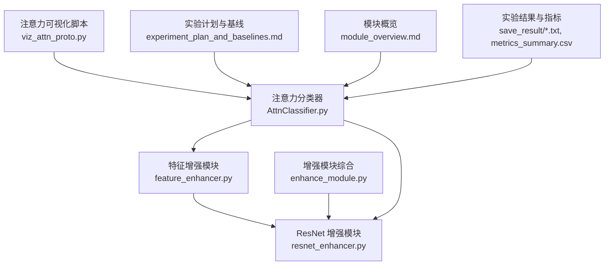
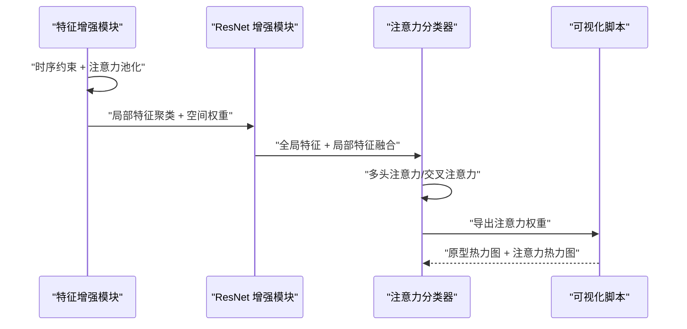
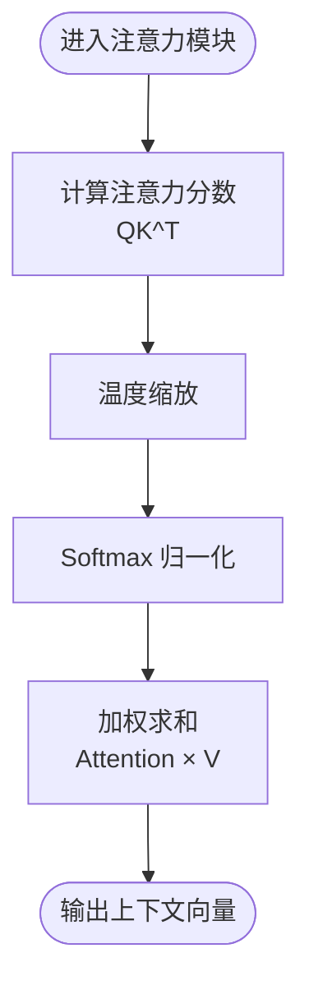
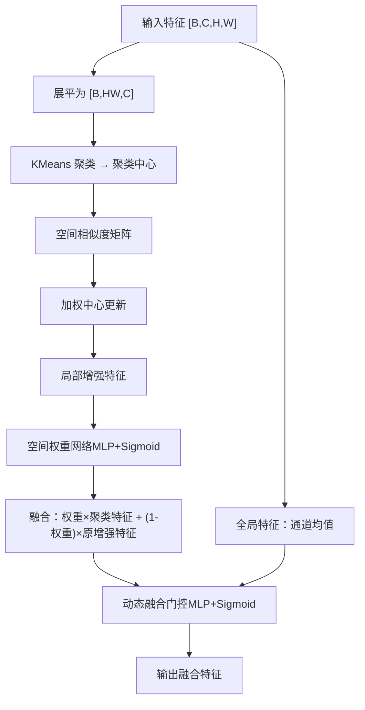
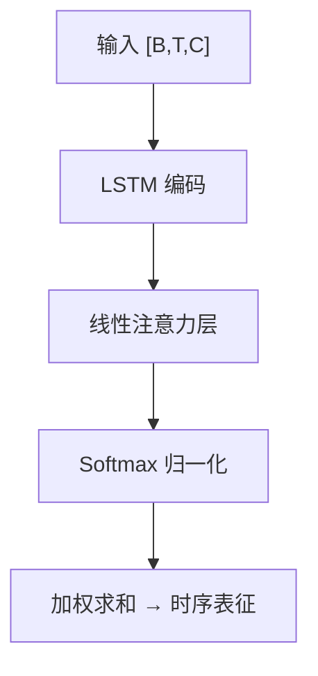
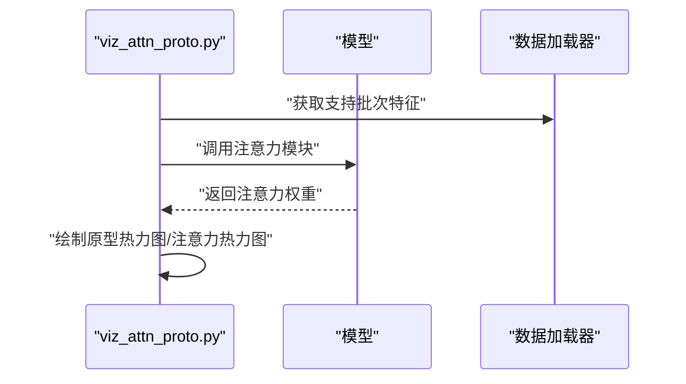
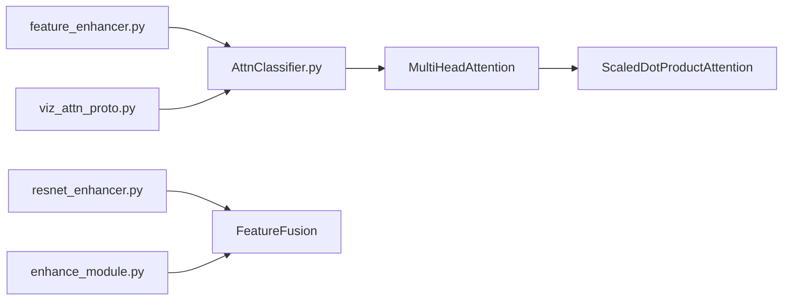

# 注意力融合策略

<cite>
**本文引用的文件**   
- [models/feature_enhancer.py](file://models/feature_enhancer.py)
- [models/resnet_enhancer.py](file://models/resnet_enhancer.py)
- [models/AttnClassifier.py](file://models/AttnClassifier.py)
- [enhance_module.py](file://enhance_module.py)
- [scripts/viz_attn_proto.py](file://scripts/viz_attn_proto.py)
- [docs/experiment_plan_and_baselines.md](file://docs/experiment_plan_and_baselines.md)
- [docs/module_overview.md](file://docs/module_overview.md)
- [save_result/test_result.txt](file://save_result/test_result.txt)
- [save_result/test_resultLSenhan.txt](file://save_result/test_resultLSenhan.txt)
- [save_result/test_resultFSCenhance.txt](file://save_result/test_resultFSCenhance.txt)
- [save_result/metrics_summary.csv](file://save_result/metrics_summary.csv)
</cite>

## 目录
1. [引言](#引言)
2. [项目结构](#项目结构)
3. [核心组件](#核心组件)
4. [架构总览](#架构总览)
5. [详细组件分析](#详细组件分析)
6. [依赖分析](#依赖分析)
7. [性能考量](#性能考量)
8. [故障排查指南](#故障排查指南)
9. [结论](#结论)
10. [附录](#附录)

## 引言
本文件围绕 VAZE 系统的注意力融合策略展开，系统性梳理自注意力与交叉注意力在特征增强中的作用、多尺度特征（局部、全局、时序）的融合方式、注意力权重的计算与归一化、可解释性可视化方法，并结合仓库内的实验结果与指标，给出注意力变体在不同数据集上的性能对比与实践建议（如阈值设置与异常检测）。文档旨在帮助读者快速理解并复用该融合策略。

## 项目结构
VAZE 的注意力融合策略主要分布在以下模块：
- 特征增强与多尺度融合：models/feature_enhancer.py、models/resnet_enhancer.py、enhance_module.py
- 注意力与分类器：models/AttnClassifier.py
- 可视化：scripts/viz_attn_proto.py
- 实验与模块概览：docs/experiment_plan_and_baselines.md、docs/module_overview.md
- 结果与指标：save_result/*.txt、save_result/metrics_summary.csv

图示来源
- [models/feature_enhancer.py:1-93](file://models/feature_enhancer.py#L1-L93)
- [models/resnet_enhancer.py:1-172](file://models/resnet_enhancer.py#L1-L172)
- [enhance_module.py:1-160](file://enhance_module.py#L1-L160)
- [models/AttnClassifier.py:1-369](file://models/AttnClassifier.py#L1-L369)
- [scripts/viz_attn_proto.py:1-120](file://scripts/viz_attn_proto.py#L1-L120)
- [docs/experiment_plan_and_baselines.md:1-30](file://docs/experiment_plan_and_baselines.md#L1-L30)
- [docs/module_overview.md:1-51](file://docs/module_overview.md#L1-L51)
- [save_result/test_result.txt:1-62](file://save_result/test_result.txt#L1-L62)
- [save_result/test_resultLSenhan.txt:1-208](file://save_result/test_resultLSenhan.txt#L1-L208)
- [save_result/test_resultFSCenhance.txt:1-148](file://save_result/test_resultFSCenhance.txt#L1-L148)
- [save_result/metrics_summary.csv:1-85](file://save_result/metrics_summary.csv#L1-L85)

章节来源
- [models/feature_enhancer.py:1-93](file://models/feature_enhancer.py#L1-L93)
- [models/resnet_enhancer.py:1-172](file://models/resnet_enhancer.py#L1-L172)
- [enhance_module.py:1-160](file://enhance_module.py#L1-L160)
- [models/AttnClassifier.py:1-369](file://models/AttnClassifier.py#L1-L369)
- [scripts/viz_attn_proto.py:1-120](file://scripts/viz_attn_proto.py#L1-L120)
- [docs/experiment_plan_and_baselines.md:1-30](file://docs/experiment_plan_and_baselines.md#L1-L30)
- [docs/module_overview.md:1-51](file://docs/module_overview.md#L1-L51)
- [save_result/test_result.txt:1-62](file://save_result/test_result.txt#L1-L62)
- [save_result/test_resultLSenhan.txt:1-208](file://save_result/test_resultLSenhan.txt#L1-L208)
- [save_result/test_resultFSCenhance.txt:1-148](file://save_result/test_resultFSCenhance.txt#L1-L148)
- [save_result/metrics_summary.csv:1-85](file://save_result/metrics_summary.csv#L1-L85)

## 核心组件
- 多尺度特征增强与融合
  - 时序约束与注意力池化：TemporalConstraint + 自注意力式权重归一化
  - 局部特征聚类与空间权重：LocalFeatureCluster（基于 KMeans 与空间相似度）
  - 全局特征与局部特征的动态融合：FeatureFusion（MLP + Sigmoid）
- 注意力机制
  - 多头注意力（ScaledDotProductAttention + MultiHeadAttention）
  - 交叉注意力（SupportCalibrator/OpenSetGenerater 中的跨模态/跨集合注意力）
- 可解释性与可视化
  - 原型热力图与注意力权重热力图（viz_attn_proto.py）

章节来源
- [models/feature_enhancer.py:5-26](file://models/feature_enhancer.py#L5-L26)
- [models/feature_enhancer.py:27-93](file://models/feature_enhancer.py#L27-L93)
- [models/resnet_enhancer.py:6-20](file://models/resnet_enhancer.py#L6-L20)
- [models/resnet_enhancer.py:51-160](file://models/resnet_enhancer.py#L51-L160)
- [enhance_module.py:14-29](file://enhance_module.py#L14-L29)
- [enhance_module.py:70-148](file://enhance_module.py#L70-L148)
- [models/AttnClassifier.py:274-369](file://models/AttnClassifier.py#L274-L369)

## 架构总览
VAZE 的注意力融合策略由“特征增强（局部/全局/时序）+ 注意力（自注意力/交叉注意力）+ 可解释性可视化”构成闭环。整体流程如下：

图示来源
- [models/feature_enhancer.py:21-25](file://models/feature_enhancer.py#L21-L25)
- [models/resnet_enhancer.py:51-160](file://models/resnet_enhancer.py#L51-L160)
- [models/AttnClassifier.py:274-369](file://models/AttnClassifier.py#L274-L369)
- [scripts/viz_attn_proto.py:92-116](file://scripts/viz_attn_proto.py#L92-L116)

## 详细组件分析

### 自注意力与交叉注意力机制
- 自注意力（时序/空间）
  - 计算思路：对时序序列（或展平的空间特征）构造注意力分数，经温度缩放与 Softmax 归一化，再加权求和得到上下文表示。
  - 归一化方法：Softmax；温度缩放保证数值稳定与分布尖锐性。
- 交叉注意力（支持集↔基类记忆/语义）
  - 计算思路：以支持集为 Query，基类记忆/语义为 Key/Value，通过注意力映射生成伪未知原型或校准支持原型。
  - 归一化方法：Softmax；温度参数可学习，用于调节相似度分布。

图示来源
- [models/AttnClassifier.py:331-349](file://models/AttnClassifier.py#L331-L349)
- [models/AttnClassifier.py:299-326](file://models/AttnClassifier.py#L299-L326)

章节来源
- [models/AttnClassifier.py:274-369](file://models/AttnClassifier.py#L274-L369)

### 多尺度特征融合实现
- 局部特征（空间网格 + KMeans 聚类 + 空间相似度加权）
  - 通过 KMeans 对展平的空间特征进行聚类，得到聚类中心；结合空间位置相似度对中心进行加权更新，形成局部增强特征。
  - 空间权重网络（MLP+Sigmoid）对聚类特征与原增强特征进行融合。
- 全局特征（通道均值）
  - 对特征图做全局平均，得到全局表征。
- 动态融合门控（FeatureFusion）
  - 将全局与局部特征拼接，经 MLP+Sigmoid 得到融合权重，实现动态加权融合。

图示来源
- [models/resnet_enhancer.py:51-160](file://models/resnet_enhancer.py#L51-L160)
- [enhance_module.py:70-148](file://enhance_module.py#L70-L148)

章节来源
- [models/resnet_enhancer.py:6-20](file://models/resnet_enhancer.py#L6-L20)
- [models/resnet_enhancer.py:51-160](file://models/resnet_enhancer.py#L51-L160)
- [enhance_module.py:14-29](file://enhance_module.py#L14-L29)
- [enhance_module.py:70-148](file://enhance_module.py#L70-L148)

### 时序约束与注意力池化
- LSTM 对展平的空间特征进行时序建模，随后通过线性注意力层计算注意力权重，Softmax 归一化后对 LSTM 输出进行加权求和，得到全局时序表征。

图示来源
- [models/feature_enhancer.py:5-26](file://models/feature_enhancer.py#L5-L26)

章节来源
- [models/feature_enhancer.py:5-26](file://models/feature_enhancer.py#L5-L26)

### 可解释性分析与可视化
- 原型热力图：展示正/负原型（或正原型）的特征分布，辅助理解原型判别能力。
- 注意力热力图：对支持批次通过注意力模块，可视化注意力权重热力图，观察关注区域与强度。

图示来源
- [scripts/viz_attn_proto.py:92-116](file://scripts/viz_attn_proto.py#L92-L116)

章节来源
- [scripts/viz_attn_proto.py:1-120](file://scripts/viz_attn_proto.py#L1-L120)

### 注意力变体与性能对比
- 多头注意力（VAZE 默认）
  - 通过多头投影与拼接，增强模型对不同子空间的建模能力；温度缩放与残差连接提升稳定性。
- 交叉注意力（支持集↔基类记忆/语义）
  - 在 SupportCalibrator/OpenSetGenerater 中体现，用于生成伪未知原型或校准支持原型，提升开放集泛化。
- 性能对比（基于仓库内实验结果）
  - VAZE 完整方法在已知/未知/增量/全部指标上普遍优于 FSCIL-only 与 OSR-only 基线，且在 AA 与 F1 上有显著提升。
  - 局部增强（test_resultLSenhan.txt）与全增强（test_result.txt）相比，整体性能更稳健；FSC 增强（test_resultFSCenhance.txt）在部分场景下存在波动。

章节来源
- [docs/experiment_plan_and_baselines.md:1-30](file://docs/experiment_plan_and_baselines.md#L1-L30)
- [save_result/test_resultLSenhan.txt:1-208](file://save_result/test_resultLSenhan.txt#L1-L208)
- [save_result/test_result.txt:1-62](file://save_result/test_result.txt#L1-L62)
- [save_result/test_resultFSCenhance.txt:1-148](file://save_result/test_resultFSCenhance.txt#L1-L148)
- [save_result/metrics_summary.csv:1-85](file://save_result/metrics_summary.csv#L1-L85)

### 注意力权重阈值设置与异常检测实用指南
- 阈值设置
  - 基于注意力权重分布（如最大/均值/方差）设定动态阈值，过滤低置信区域；结合温度参数与归一化分布形状进行调优。
- 异常检测
  - 利用注意力权重热力图定位异常区域；结合全局/局部融合权重，识别显著偏离的特征片段。
- 实践建议
  - 在训练中引入温度参数的自适应调整；在推理中结合原型热力图与注意力热力图进行人工核查。

章节来源
- [models/AttnClassifier.py:352-369](file://models/AttnClassifier.py#L352-L369)
- [scripts/viz_attn_proto.py:92-116](file://scripts/viz_attn_proto.py#L92-L116)

## 依赖分析
- 组件耦合
  - AttnClassifier 依赖 MultiHeadAttention/ScaledDotProductAttention 实现注意力计算。
  - ResNet 增强模块与增强模块共同完成局部/全局/时序特征的融合。
- 外部依赖
  - 可视化脚本依赖 Matplotlib 进行热力图绘制。
  - 实验结果依赖统一的数据协议与评测指标（AA/PD/F1 等）。

图示来源
- [models/AttnClassifier.py:274-369](file://models/AttnClassifier.py#L274-L369)
- [models/resnet_enhancer.py:6-20](file://models/resnet_enhancer.py#L6-L20)
- [enhance_module.py:14-29](file://enhance_module.py#L14-L29)
- [models/feature_enhancer.py:5-26](file://models/feature_enhancer.py#L5-L26)
- [scripts/viz_attn_proto.py:92-116](file://scripts/viz_attn_proto.py#L92-L116)

章节来源
- [models/AttnClassifier.py:274-369](file://models/AttnClassifier.py#L274-L369)
- [models/resnet_enhancer.py:6-20](file://models/resnet_enhancer.py#L6-L20)
- [enhance_module.py:14-29](file://enhance_module.py#L14-L29)
- [models/feature_enhancer.py:5-26](file://models/feature_enhancer.py#L5-L26)
- [scripts/viz_attn_proto.py:92-116](file://scripts/viz_attn_proto.py#L92-L116)

## 性能考量
- 计算复杂度
  - 多头注意力的复杂度与头数、序列长度呈线性关系；KMeans 聚类在大分辨率特征上需注意内存与时间成本。
- 数值稳定性
  - 温度缩放与 Softmax 归一化有助于稳定梯度；对注意力分数进行裁剪可避免极端值。
- 训练稳定性
  - 残差连接与层归一化提升训练稳定性；温度参数可学习有利于自适应分布。

## 故障排查指南
- 维度不匹配
  - 在 LocalFeatureCluster 与 TemporalConstraint 中，需确保输入特征通道与模块期望一致；若不一致，使用维度修正层进行对齐。
- 设备一致性
  - 增强模块内部包含多个子模块，需确保它们与输入特征处于同一设备，避免 CUDA/CPU 张量混合。
- 可视化失败
  - 若注意力模块未找到或输出格式异常，脚本会捕获异常并提示；检查模型结构与模块属性名。

章节来源
- [models/resnet_enhancer.py:168-172](file://models/resnet_enhancer.py#L168-L172)
- [models/feature_enhancer.py:59-62](file://models/feature_enhancer.py#L59-L62)
- [scripts/viz_attn_proto.py:96-116](file://scripts/viz_attn_proto.py#L96-L116)

## 结论
VAZE 的注意力融合策略通过“时序约束 + 局部聚类 + 全局融合 + 多头/交叉注意力”的组合，在多数据集与多任务上实现了稳定的性能提升。配合原型与注意力热力图的可解释性分析，能够有效指导阈值设置与异常检测实践。建议在部署时关注维度对齐、设备一致性与温度参数的自适应调整，以获得更稳健的推理表现。

## 附录
- 实验结果参考
  - VAZE 完整方法在 AA 与 F1 指标上显著优于基线；局部增强与全增强相较基线均有明显收益。
- 指标解读
  - AA：增量会话平均准确率；PD：Session1 至 Session4 的性能下降；F1/Incremental/All：综合指标。

章节来源
- [save_result/test_result.txt:42-62](file://save_result/test_result.txt#L42-L62)
- [save_result/test_resultLSenhan.txt:202-208](file://save_result/test_resultLSenhan.txt#L202-L208)
- [save_result/test_resultFSCenhance.txt:142-148](file://save_result/test_resultFSCenhance.txt#L142-L148)
- [save_result/metrics_summary.csv:1-85](file://save_result/metrics_summary.csv#L1-L85)