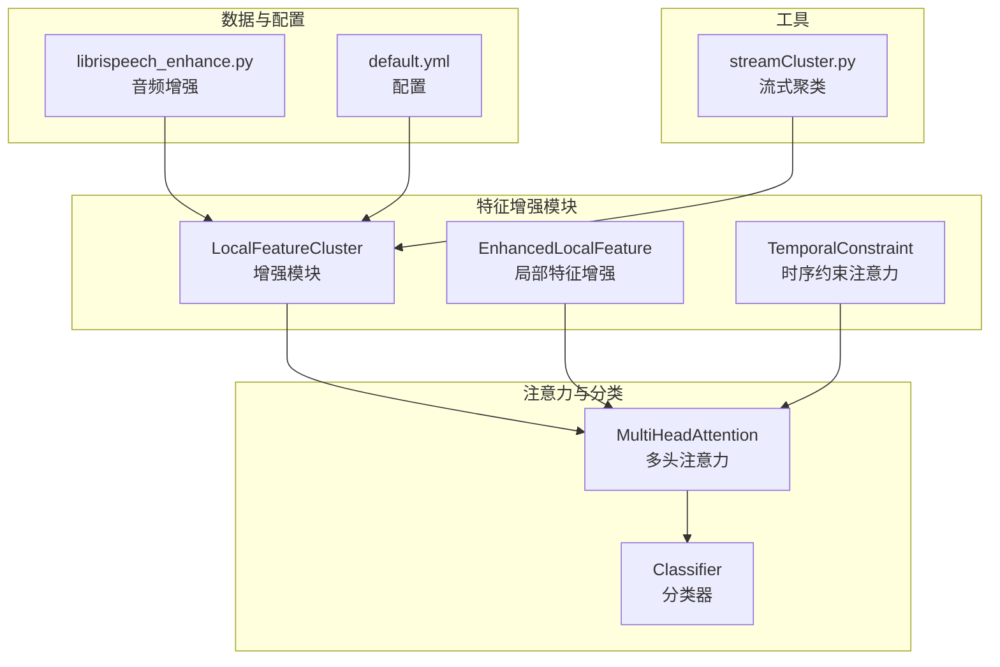
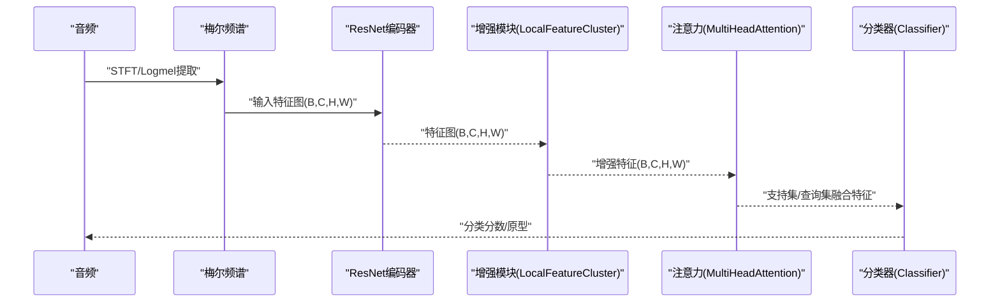
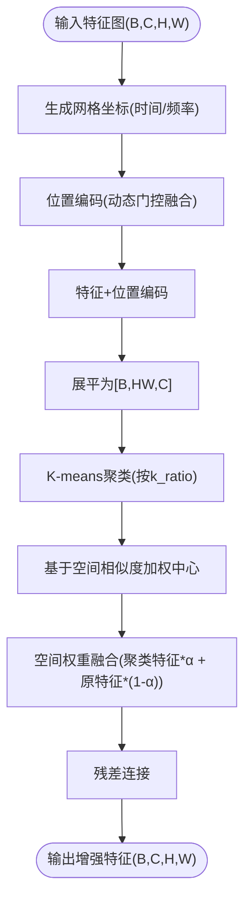
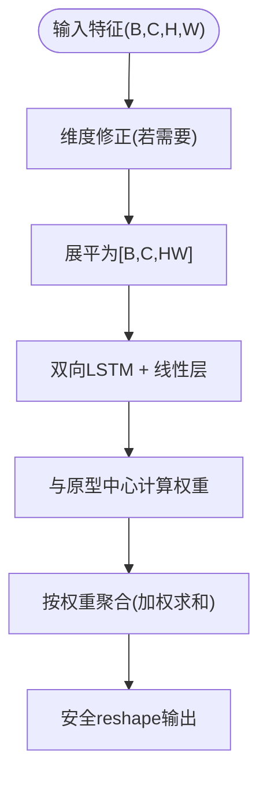
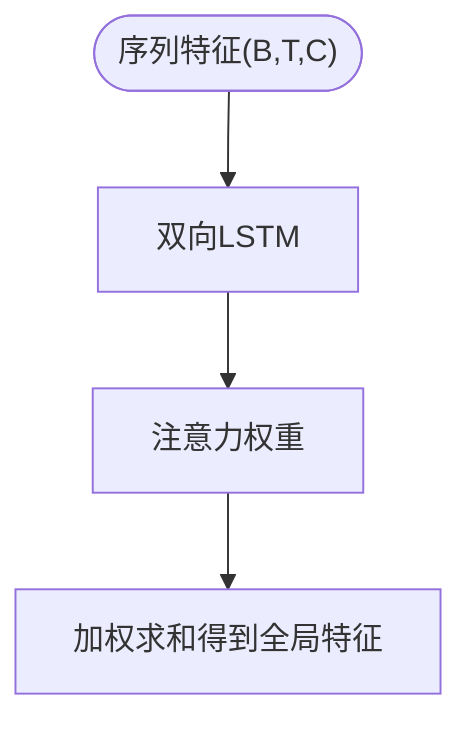
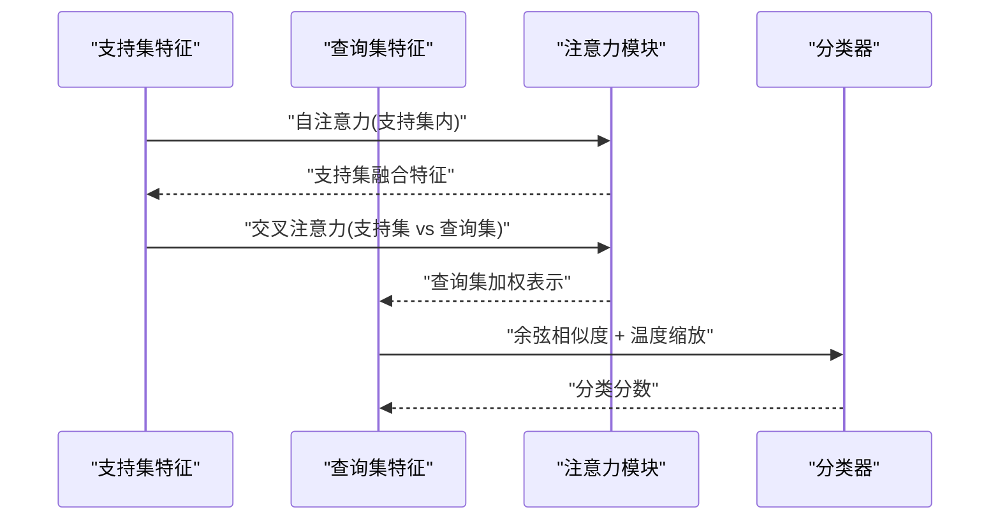
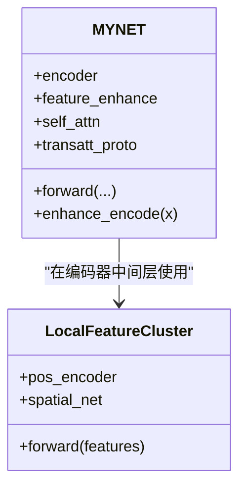
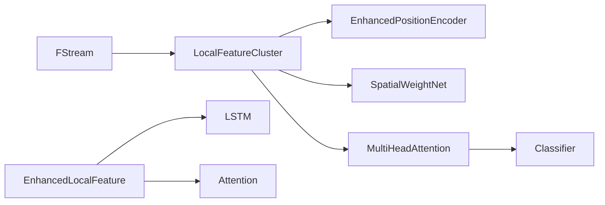

# 特征增强策略

<cite>
**本文引用的文件**
- [models/feature_enhancer.py](file://models/feature_enhancer.py)
- [enhance_module.py](file://enhance_module.py)
- [models/resnet_enhancer.py](file://models/resnet_enhancer.py)
- [network.py](file://network.py)
- [utils/streamCluster.py](file://utils/streamCluster.py)
- [configs/default.yml](file://configs/default.yml)
- [librispeech_enhance.py](file://librispeech_enhance.py)
- [test.py](file://test.py)
- [train.py](file://train.py)
</cite>

## 目录
1. [简介](#简介)
2. [项目结构](#项目结构)
3. [核心组件](#核心组件)
4. [架构总览](#架构总览)
5. [详细组件分析](#详细组件分析)
6. [依赖分析](#依赖分析)
7. [性能考量](#性能考量)
8. [故障排查指南](#故障排查指南)
9. [结论](#结论)
10. [附录](#附录)

## 简介
本技术文档围绕 VAZE 系统的特征增强策略展开，系统性阐述“通过结合全局与局部特征以提升分类性能”的核心理念。重点包括：
- 局部特征聚类机制：利用 K-means 聚类识别音频信号中的重要局部模式，并通过原型中心加权聚合实现特征增强。
- 注意力机制：在特征增强中引入自注意力与交叉注意力，融合不同层次的特征信息，提升表征能力。
- 增强模块实现架构：涵盖特征变换、注意力计算与特征融合的关键步骤。
- 效果量化与对比：提供增强前后特征表示差异与性能提升的分析方法与实验路径。
- 优化建议：面向进一步优化的理论指导与实践建议。

## 项目结构
VAZE 的特征增强策略主要分布在以下模块：
- 局部特征聚类与增强：models/feature_enhancer.py、enhance_module.py、models/resnet_enhancer.py
- 注意力与分类器：models/AttnClassifier.py、network.py 中的注意力模块
- 数据增强与音频管线：librispeech_enhance.py
- 流式聚类工具：utils/streamCluster.py
- 配置与训练/测试流程：configs/default.yml、train.py、test.py

**图表来源**
- [enhance_module.py:70-148](file://enhance_module.py#L70-L148)
- [models/feature_enhancer.py:27-93](file://models/feature_enhancer.py#L27-L93)
- [network.py:31-32](file://network.py#L31-L32)
- [models/AttnClassifier.py:274-350](file://models/AttnClassifier.py#L274-L350)
- [librispeech_enhance.py:17-133](file://librispeech_enhance.py#L17-L133)
- [configs/default.yml:1-88](file://configs/default.yml#L1-L88)
- [utils/streamCluster.py:1-132](file://utils/streamCluster.py#L1-L132)

**章节来源**
- [enhance_module.py:14-160](file://enhance_module.py#L14-L160)
- [models/feature_enhancer.py:1-93](file://models/feature_enhancer.py#L1-L93)
- [models/resnet_enhancer.py:1-172](file://models/resnet_enhancer.py#L1-L172)
- [network.py:18-584](file://network.py#L18-L584)
- [librispeech_enhance.py:17-268](file://librispeech_enhance.py#L17-L268)
- [configs/default.yml:1-88](file://configs/default.yml#L1-L88)
- [utils/streamCluster.py:1-132](file://utils/streamCluster.py#L1-L132)

## 核心组件
- 局部特征聚类与增强
  - LocalFeatureCluster：对空间特征图进行位置编码增强，执行 K-means 聚类，基于空间相似度加权原型中心，融合空间权重，实现局部细节与全局结构的协同增强。
  - EnhancedLocalFeature：对特征图进行时序 LSTM 提取与动态权重计算，结合原型中心进行加权聚合，实现局部模式的识别与增强。
  - TemporalConstraint：通过 LSTM + 注意力对序列特征进行时序约束，提取全局代表性特征。
- 注意力与融合
  - MultiHeadAttention：自注意力与交叉注意力模块，用于支持集与查询集之间的特征融合与原型计算。
  - FeatureFusion：动态门控融合全局与局部特征，输出加权组合特征。
- 数据增强与流式聚类
  - librispeech_enhance.py：提供多视图音频增强（时域/频域/混合），辅助特征增强训练。
  - streamCluster.py：流式微簇聚类，适用于小批量音频特征的在线聚类与标签分配。

**章节来源**
- [enhance_module.py:70-148](file://enhance_module.py#L70-L148)
- [models/feature_enhancer.py:27-93](file://models/feature_enhancer.py#L27-L93)
- [models/resnet_enhancer.py:51-172](file://models/resnet_enhancer.py#L51-L172)
- [models/AttnClassifier.py:274-350](file://models/AttnClassifier.py#L274-L350)
- [librispeech_enhance.py:17-133](file://librispeech_enhance.py#L17-L133)
- [utils/streamCluster.py:1-132](file://utils/streamCluster.py#L1-132)

## 架构总览
VAZE 的特征增强策略在编码器之后、分类器之前插入增强模块，形成如下处理链路：
- 音频经梅尔频谱提取与增强，进入 ResNet 特征提取器，得到空间特征图。
- 增强模块对特征图进行位置编码、K-means 聚类、原型加权与空间权重融合，输出增强特征。
- 注意力模块对支持集与查询集进行自注意力/交叉注意力融合，生成原型与分类分数。
- 可选地，TemporalConstraint 对序列特征进行时序约束，提升全局代表性。

**图表来源**
- [network.py:24-32](file://network.py#L24-L32)
- [enhance_module.py:95-148](file://enhance_module.py#L95-L148)
- [models/AttnClassifier.py:47-93](file://models/AttnClassifier.py#L47-L93)

## 详细组件分析

### 局部特征聚类与增强（LocalFeatureCluster）
- 位置编码增强：生成网格坐标，分别对时间轴与频率轴进行卷积编码，再通过动态门控融合，得到与特征图通道一致的位置嵌入。
- 局部聚类：对展平后的特征进行 K-means 聚类，按空间相似度对聚类中心进行加权更新，得到加权原型。
- 空间权重融合：通过 MLP 计算空间权重，融合聚类特征与原增强特征，保留残差连接以稳定训练。
- 全局-局部融合：计算全局与局部特征的均值，通过动态门控融合，输出最终增强特征。

**图表来源**
- [models/resnet_enhancer.py:73-160](file://models/resnet_enhancer.py#L73-L160)

**章节来源**
- [models/resnet_enhancer.py:51-172](file://models/resnet_enhancer.py#L51-L172)

### 局部特征增强（EnhancedLocalFeature）
- 维度修正：若通道数不匹配，通过线性层修正至目标维度。
- 时序特征提取：对展平特征进行双向 LSTM，再通过线性层压缩为时序特征。
- 动态权重计算：通过与原型中心的矩阵乘与 softmax 得到动态权重。
- 特征聚合：对空间特征进行加权聚合，安全 reshape 并返回增强特征。

**图表来源**
- [models/feature_enhancer.py:49-93](file://models/feature_enhancer.py#L49-L93)

**章节来源**
- [models/feature_enhancer.py:27-93](file://models/feature_enhancer.py#L27-L93)

### 时序约束注意力（TemporalConstraint）
- LSTM 提取时序依赖，注意力层对时间步进行加权，输出全局代表性特征向量，提升时序稳定性与判别性。

**图表来源**
- [models/feature_enhancer.py:21-25](file://models/feature_enhancer.py#L21-L25)

**章节来源**
- [models/feature_enhancer.py:5-26](file://models/feature_enhancer.py#L5-L26)

### 注意力机制（MultiHeadAttention 与分类器）
- 自注意力：对支持集内部进行注意力融合，增强原型表达。
- 交叉注意力：将支持集与查询集进行交叉注意力，生成查询集的加权表示。
- 分类器：基于余弦相似度计算分数，温度缩放，输出分类结果。

**图表来源**
- [models/AttnClassifier.py:274-350](file://models/AttnClassifier.py#L274-L350)
- [models/AttnClassifier.py:47-93](file://models/AttnClassifier.py#L47-L93)

**章节来源**
- [models/AttnClassifier.py:274-350](file://models/AttnClassifier.py#L274-L350)
- [models/AttnClassifier.py:352-369](file://models/AttnClassifier.py#L352-L369)

### 增强模块集成（MYNET）
- 在编码器的某一层插入 LocalFeatureCluster，对中间层特征进行增强，随后继续进入后续层。
- 同时在模型中定义自注意力与交叉注意力模块，用于原型与查询集的融合。

**图表来源**
- [network.py:18-584](file://network.py#L18-L584)
- [enhance_module.py:70-148](file://enhance_module.py#L70-L148)

**章节来源**
- [network.py:18-584](file://network.py#L18-L584)
- [enhance_module.py:70-148](file://enhance_module.py#L70-L148)

## 依赖分析
- 组件耦合
  - LocalFeatureCluster 依赖位置编码器与空间权重网络，与注意力模块解耦，便于替换与扩展。
  - EnhancedLocalFeature 与 TemporalConstraint 作为独立模块，可插拔接入不同层级。
  - MultiHeadAttention 与 Classifier 紧密协作，共同完成原型生成与分类。
- 外部依赖
  - KMeans 用于局部聚类；RobustScaler、PCA、t-SNE 用于特征分析与可视化。
  - FStream 提供流式微簇聚类，适合在线场景。

**图表来源**
- [enhance_module.py:30-94](file://enhance_module.py#L30-L94)
- [models/feature_enhancer.py:8-19](file://models/feature_enhancer.py#L8-L19)
- [models/AttnClassifier.py:274-350](file://models/AttnClassifier.py#L274-L350)
- [utils/streamCluster.py:1-132](file://utils/streamCluster.py#L1-L132)

**章节来源**
- [enhance_module.py:14-160](file://enhance_module.py#L14-L160)
- [models/feature_enhancer.py:1-93](file://models/feature_enhancer.py#L1-L93)
- [models/AttnClassifier.py:274-350](file://models/AttnClassifier.py#L274-L350)
- [utils/streamCluster.py:1-132](file://utils/streamCluster.py#L1-L132)

## 性能考量
- 计算复杂度
  - K-means 聚类：对每个样本执行 O(NHW·k·I·C) 的迭代，其中 HW 为空间分辨率，k 为聚类数，I 为迭代次数，C 为通道数。
  - 注意力计算：O(B·D·(N_support+N_query))，受头数与维度影响。
- 内存与显存
  - 展平特征与聚类中心存储占用较大，建议合理设置 k_ratio 与批大小。
  - 注意力模块的投影与缓存需注意显存峰值。
- 稳定性
  - 位置编码与残差连接有助于稳定训练；动态门控融合可缓解过拟合。
  - TemporalConstraint 的数值稳定性通过 clamp 与偏置移除保障。

[本节为通用性能讨论，无需特定文件引用]

## 故障排查指南
- 维度不匹配
  - 现象：特征通道数与目标维度不一致导致断言失败。
  - 排查：检查维度修正层与输入通道数，确认 reshape 与转置顺序。
- 设备不一致
  - 现象：聚类或注意力张量位于不同设备引发错误。
  - 排查：在 forward 中统一移动参数与张量至同一设备。
- 聚类空簇
  - 现象：某些聚类类别无样本导致中心无效。
  - 排查：过滤空簇，使用有效聚类中心或回退到原始中心。
- 数值不稳定
  - 现象：softmax 或注意力权重异常。
  - 排查：对输入进行 clamp，移除偏置项，确保数值范围。

**章节来源**
- [models/resnet_enhancer.py:168-172](file://models/resnet_enhancer.py#L168-L172)
- [models/feature_enhancer.py:61-62](file://models/feature_enhancer.py#L61-L62)
- [models/feature_enhancer.py:72](file://models/feature_enhancer.py#L72)

## 结论
VAZE 的特征增强策略通过“全局-局部”互补思想，结合 K-means 聚类与注意力机制，在中间层特征上实现了精细的局部模式识别与跨层次特征融合。LocalFeatureCluster 与 EnhancedLocalFeature 提供了灵活的增强路径，TemporalConstraint 则强化了时序稳定性。配合 MultiHeadAttention 与 Classifier，整体提升了分类性能与鲁棒性。建议在实际部署中根据硬件资源与任务需求，动态调节 k_ratio、注意力头数与温度参数，以获得最佳平衡。

[本节为总结性内容，无需特定文件引用]

## 附录

### 增强策略对比实验建议
- 局部增强策略
  - 基线：不使用任何局部增强（仅全局特征）。
  - 局部聚类：启用 LocalFeatureCluster，调节 k_ratio（如 0.2、0.3、0.4）。
  - 原型增强：启用 EnhancedLocalFeature，调节原型中心数量。
  - 时序约束：启用 TemporalConstraint，观察全局特征稳定性。
- 注意力策略
  - 自注意力：仅支持集内融合。
  - 交叉注意力：支持集与查询集交叉融合。
  - 动态融合：结合 FeatureFusion 的动态门控。
- 数据增强
  - 音频多视图增强：比较时域/频域/混合增强对特征分布的影响。

**章节来源**
- [enhance_module.py:70-148](file://enhance_module.py#L70-L148)
- [models/feature_enhancer.py:27-93](file://models/feature_enhancer.py#L27-L93)
- [models/resnet_enhancer.py:51-172](file://models/resnet_enhancer.py#L51-L172)
- [librispeech_enhance.py:17-133](file://librispeech_enhance.py#L17-L133)

### 量化分析与可视化
- 聚类指标
  - 轮廓系数（Silhouette Score）、簇内/簇间距离比等。
- 特征分布
  - t-SNE/PCA 可视化，对比增强前后特征分布与可分性。
- 不确定性估计
  - 基于 MC Dropout 的不确定性度量，结合增强模块进行对比。

**章节来源**
- [train.py:330-361](file://train.py#L330-L361)
- [test.py:48-85](file://test.py#L48-L85)

### 配置要点
- feat_dim：特征维度（如 512/640），需与编码器输出一致。
- k_ratio：聚类比例，控制局部模式数量。
- temperature：注意力温度参数，影响相似度分布。
- extractor：STFT/Logmel 参数，决定输入特征质量。

**章节来源**
- [configs/default.yml:1-88](file://configs/default.yml#L1-L88)
- [network.py:326-403](file://network.py#L326-L403)