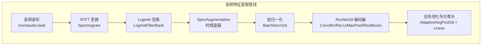
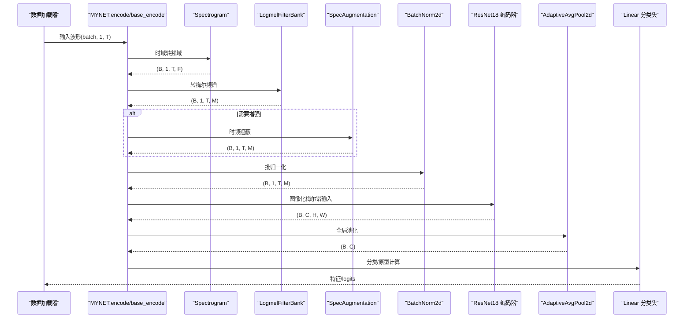
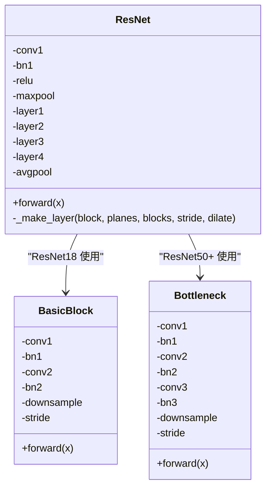
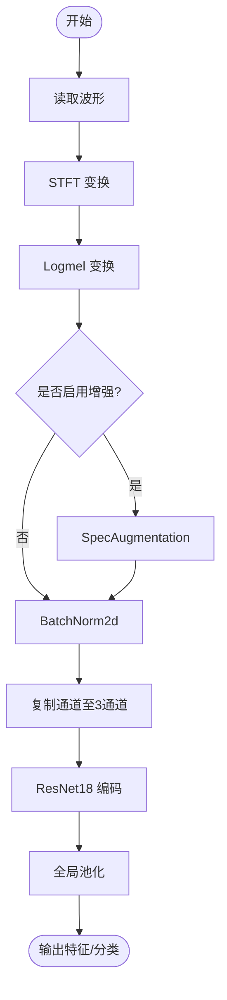
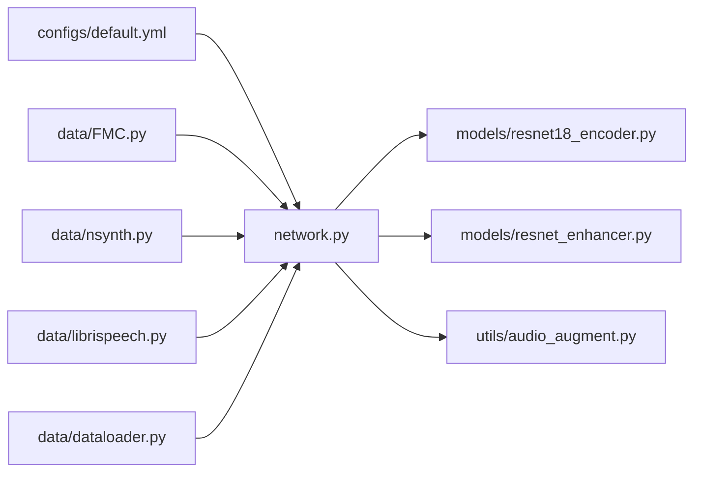

# 音频特征提取

<cite>
**本文引用的文件列表**
- [network.py](file://network.py)
- [models/resnet18_encoder.py](file://models/resnet18_encoder.py)
- [models/resnet_enhancer.py](file://models/resnet_enhancer.py)
- [data/FMC.py](file://data/FMC.py)
- [data/nsynth.py](file://data/nsynth.py)
- [data/librispeech.py](file://data/librispeech.py)
- [data/dataloader.py](file://data/dataloader.py)
- [utils/audio_augment.py](file://utils/audio_augment.py)
- [configs/default.yml](file://configs/default.yml)
</cite>

## 目录
1. [简介](#简介)
2. [项目结构](#项目结构)
3. [核心组件](#核心组件)
4. [架构总览](#架构总览)
5. [详细组件分析](#详细组件分析)
6. [依赖关系分析](#依赖关系分析)
7. [性能考量](#性能考量)
8. [故障排查指南](#故障排查指南)
9. [结论](#结论)
10. [附录](#附录)

## 简介
本文件面向VAZE系统中的音频特征提取子系统，围绕以下目标展开：
- 解释STFT与Logmel变换的实现原理与数据流，涵盖从时域波形到频谱图再到梅尔频谱的完整转换过程。
- 详解ResNet18编码器的结构设计，包括卷积层、批归一化与池化的作用与堆叠逻辑。
- 阐述多采样率支持机制，对比FMC、NSynth、LibriSpeech三类数据集在采样率、窗长、步长、梅尔bin等参数上的差异。
- 提供完整的音频特征提取流程示例（路径级说明），包括数据预处理、特征变换与编码过程。
- 说明音频增强技术的集成方式，重点解析SpecAugmentation的实现与作用。
- 给出性能优化建议与内存使用注意事项，帮助开发者在大规模数据场景下高效运行。

## 项目结构
本项目的音频特征提取相关代码主要分布在如下模块：
- 网络与特征提取：network.py
- 编码器与增强：models/resnet18_encoder.py、models/resnet_enhancer.py
- 数据集与采样：data/FMC.py、data/nsynth.py、data/librispeech.py、data/dataloader.py
- 音频增强工具：utils/audio_augment.py
- 配置：configs/default.yml

图表来源
- [network.py:330-503](file://network.py#L330-L503)
- [models/resnet18_encoder.py:240-334](file://models/resnet18_encoder.py#L240-L334)
- [models/resnet_enhancer.py:51-172](file://models/resnet_enhancer.py#L51-L172)

章节来源
- [network.py:18-50](file://network.py#L18-L50)
- [configs/default.yml:77-85](file://configs/default.yml#L77-L85)

## 核心组件
- STFT与Logmel变换：由Spectrogram与LogmelFilterBank构成，负责将时域波形转换为梅尔频谱图。
- SpecAugmentation：在频域与时域进行条带遮蔽，提升模型鲁棒性。
- ResNet18编码器：作为图像化梅尔谱的骨干网络，提取高级语义特征。
- ResNet增强模块：LocalFeatureCluster对中间层特征进行位置编码与聚类增强，提升局部细节感知。
- 多采样率支持：针对不同数据集（FMC/NSynth/LibriSpeech）分别配置采样率、窗长、步长与梅尔bin上限。

章节来源
- [network.py:330-503](file://network.py#L330-L503)
- [models/resnet18_encoder.py:240-334](file://models/resnet18_encoder.py#L240-L334)
- [models/resnet_enhancer.py:51-172](file://models/resnet_enhancer.py#L51-L172)
- [configs/default.yml:77-85](file://configs/default.yml#L77-L85)

## 架构总览
下图展示了从音频波形到ResNet18编码器的端到端流程，以及SpecAugmentation的可选插入点。

图表来源
- [network.py:471-503](file://network.py#L471-L503)
- [network.py:486-503](file://network.py#L486-L503)

## 详细组件分析

### STFT与Logmel变换实现
- STFT（短时傅里叶变换）：由Spectrogram完成，参数包括n_fft、hop_length、win_length、center、pad_mode等，决定时间分辨率与频率分辨率的平衡。
- Logmel变换：由LogmelFilterBank完成，参数包括sr、n_fft、n_mels、fmin、fmax、ref、amin、top_db等，将线性频率轴映射到梅尔刻度，模拟人类听觉特性。
- 数据流：先经Spectrogram得到复频谱，再经LogmelFilterBank得到实值梅尔频谱，随后进行转置、批归一化与通道复制（重复三次通道以适配图像化ResNet输入）。

章节来源
- [network.py:330-352](file://network.py#L330-L352)
- [network.py:461-485](file://network.py#L461-L485)

### ResNet18编码器架构
- 结构组成：初始卷积层conv1、批归一化bn1、激活ReLU、最大池化maxpool；随后依次为layer1-layer4四个残差块堆叠。
- 残差块类型：BasicBlock（ResNet18使用）与Bottleneck（ResNet50+）。BasicBlock包含两层3×3卷积，stride>1时通过下采样卷积保持维度一致。
- 批归一化与激活：每层卷积后紧跟BatchNorm2d与ReLU，保证梯度稳定与加速收敛。
- 池化策略：conv1后进行3×3×2最大池化，后续各层通过stride=2实现空间降采样。
- 输出形态：编码器输出为(B, C, H, W)，可进一步全局池化至(B, C)用于分类或原型学习。

图表来源
- [models/resnet18_encoder.py:240-334](file://models/resnet18_encoder.py#L240-L334)
- [models/resnet18_encoder.py:157-195](file://models/resnet18_encoder.py#L157-L195)
- [models/resnet18_encoder.py:197-238](file://models/resnet18_encoder.py#L197-L238)

章节来源
- [models/resnet18_encoder.py:240-334](file://models/resnet18_encoder.py#L240-L334)

### 多采样率支持机制与数据集差异
- 默认配置（LibriSpeech）：采样率16kHz、窗长400、步长160、梅尔bin=128、fmax=8kHz。
- FMC（FSD-MIX-CLIPS）：采样率44.1kHz、窗长2048、步长1024、梅尔bin=128、fmax=22.05kHz。
- NSynth：采样率16kHz、窗长2048、步长1024、梅尔bin=128、fmax=8kHz。
- 说明：不同数据集在采样率、窗长、步长与fmax上存在显著差异，直接影响时间分辨率与频率分辨率，进而影响特征表达能力与计算开销。

章节来源
- [configs/default.yml:77-85](file://configs/default.yml#L77-L85)
- [network.py:354-402](file://network.py#L354-L402)
- [data/FMC.py:116-137](file://data/FMC.py#L116-L137)
- [data/nsynth.py:124-146](file://data/nsynth.py#L124-L146)

### 音频增强与SpecAugmentation集成
- SpecAugmentation：在梅尔谱上进行时域与频域条带遮蔽，提升模型对时间/频率扰动的鲁棒性。
- 集成位置：在Logmel之后、批归一化之前可选择性应用，以避免对归一化统计量造成过大影响。
- 时域增强工具：utils/audio_augment提供时移与音高变换等时域增强方法，便于在波形层面进行数据增强。

图表来源
- [network.py:486-503](file://network.py#L486-L503)
- [utils/audio_augment.py:1-31](file://utils/audio_augment.py#L1-L31)

章节来源
- [network.py:342-345](file://network.py#L342-L345)
- [utils/audio_augment.py:1-31](file://utils/audio_augment.py#L1-L31)

### 数据加载与元学习采样
- 数据集封装：FMC、NSynth、LibriSpeech各自提供Dataset类，统一返回音频波形与标签。
- 元学习采样：dataloader根据任务配置（n_ways、n_shots、n_queries）构造支持集/查询集/开放集，支持训练与测试阶段的episode采样。
- 重要注意：上述数据集类在getitem中直接返回波形，不进行特征提取；特征提取与编码在网络层完成。

章节来源
- [data/FMC.py:21-101](file://data/FMC.py#L21-L101)
- [data/nsynth.py:21-109](file://data/nsynth.py#L21-L109)
- [data/librispeech.py:21-79](file://data/librispeech.py#L21-L79)
- [data/dataloader.py:13-81](file://data/dataloader.py#L13-L81)

## 依赖关系分析
- 网络模块依赖：MYNET依赖Spectrogram、LogmelFilterBank、SpecAugmentation、ResNet18、BatchNorm2d等。
- 数据模块依赖：数据集类依赖torchaudio与pandas，部分类提供自定义STFT/Logmel实现。
- 配置模块依赖：default.yml提供采样率、窗长、步长、梅尔bin等关键参数，贯穿特征提取与编码器初始化。

图表来源
- [configs/default.yml:77-85](file://configs/default.yml#L77-L85)
- [network.py:18-34](file://network.py#L18-L34)
- [models/resnet18_encoder.py:1-16](file://models/resnet18_encoder.py#L1-L16)
- [models/resnet_enhancer.py:1-6](file://models/resnet_enhancer.py#L1-L6)
- [utils/audio_augment.py:1-4](file://utils/audio_augment.py#L1-L4)
- [data/FMC.py:18-19](file://data/FMC.py#L18-L19)
- [data/nsynth.py:17-18](file://data/nsynth.py#L17-L18)
- [data/librispeech.py:17-18](file://data/librispeech.py#L17-L18)
- [data/dataloader.py:19-46](file://data/dataloader.py#L19-L46)

## 性能考量
- 时间/频率分辨率权衡：较大的n_fft与较小的hop_length会提高时间分辨率但增加计算与显存开销；fmax越大，频率分辨率越高但对高频噪声更敏感。
- 批大小与并行：dataloader配置了较高的num_workers与pin_memory，有助于I/O与数据搬运效率。
- 内存优化建议：
  - 优先在GPU上执行SpecAugmentation与ResNet18，减少CPU-GPU往返。
  - 控制batch_size与序列长度，避免OOM；必要时降低mel_bins或缩短序列。
  - 对于长序列音频，可在数据预处理阶段进行截断或分段。
- 训练稳定性：合理设置BN与Dropout，避免过拟合；在增量学习场景中，逐步扩大类别数与学习率衰减策略需谨慎调参。

## 故障排查指南
- 采样率不匹配：若数据集中音频采样率与配置不一致，可能导致STFT/Logmel参数不匹配。请检查default.yml中的采样率与窗长设置，并在数据加载前进行重采样。
- 归一化异常：SpecAugmentation应在BN之前还是之后应用取决于具体需求；若出现数值不稳定，可尝试调整增强强度或关闭SpecAugmentation进行定位。
- 显存不足：降低batch_size、减小mel_bins、缩短序列长度或使用混合精度训练。
- 数据加载卡顿：检查num_workers与pin_memory配置，确认磁盘I/O瓶颈。

## 结论
VAZE系统采用“波形→STFT→Logmel→SpecAugmentation→ResNet18”的标准音频特征提取流程，并通过多采样率配置适配不同数据集。ResNet18编码器与ResNet增强模块共同提升了特征表达能力，结合SpecAugmentation增强了模型鲁棒性。通过合理的参数配置与性能优化策略，可在保证效果的同时提升训练与推理效率。

## 附录

### 完整特征提取流程（路径级说明）
- 数据加载：使用对应数据集类读取音频波形与标签（路径见data/*）。
- 特征变换：在网络层调用Spectrogram与LogmelFilterBank完成STFT与Logmel变换（路径见network.py）。
- 增强：可选地应用SpecAugmentation（路径见network.py）。
- 编码：通过ResNet18编码器提取高级特征（路径见models/resnet18_encoder.py）。
- 输出：全局池化后得到(B, C)特征，可用于分类或原型学习（路径见network.py）。

章节来源
- [data/FMC.py:95-101](file://data/FMC.py#L95-L101)
- [data/nsynth.py:103-109](file://data/nsynth.py#L103-L109)
- [data/librispeech.py:76-79](file://data/librispeech.py#L76-L79)
- [network.py:471-503](file://network.py#L471-L503)
- [models/resnet18_encoder.py:240-334](file://models/resnet18_encoder.py#L240-L334)