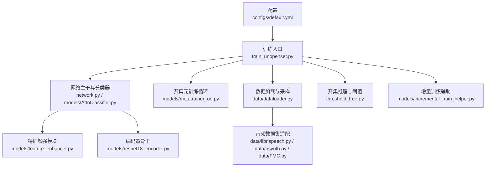
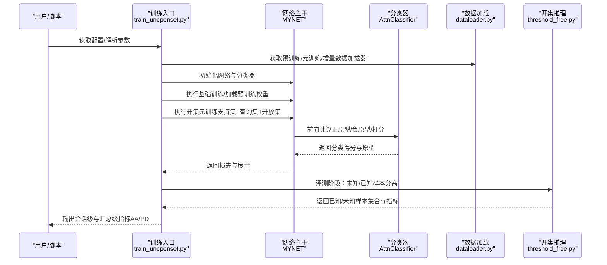
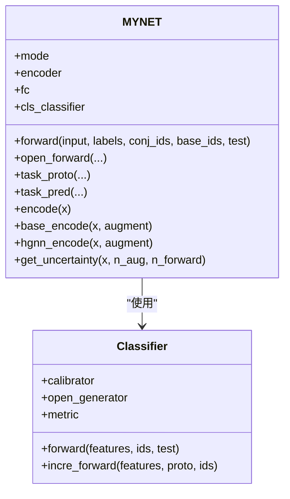
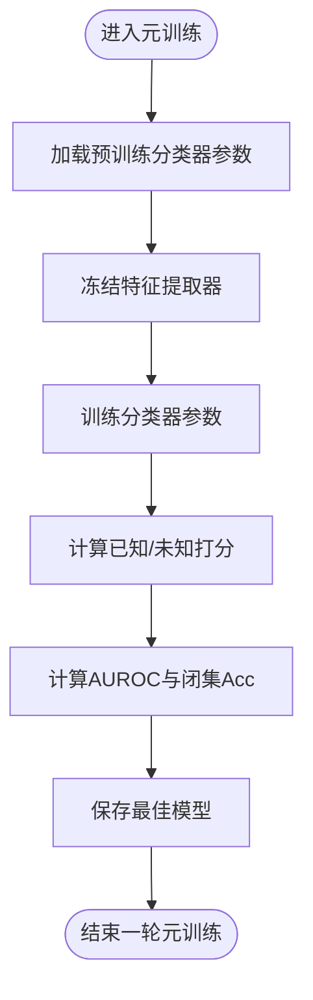
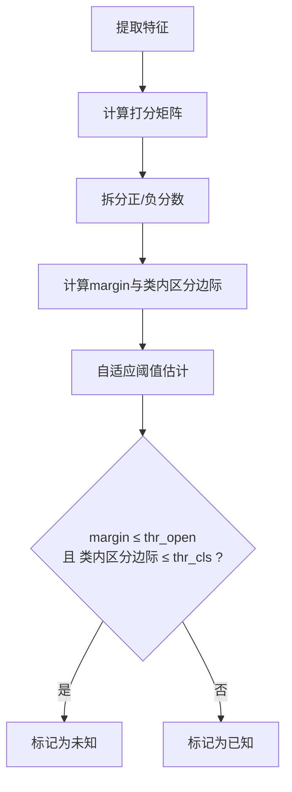
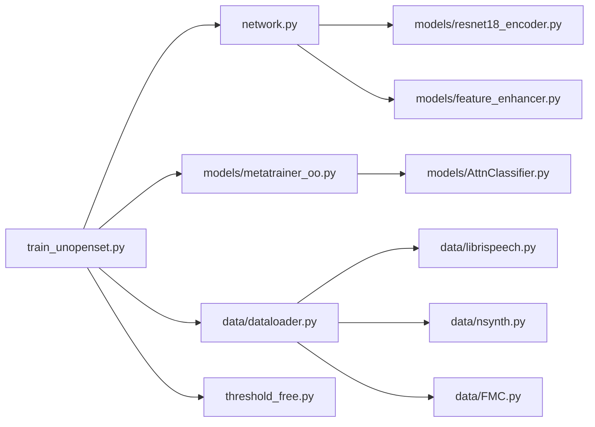

# 项目介绍

<cite>
**本文引用的文件**
- [docs/module_overview.md](file://docs/module_overview.md)
- [docs/experiment_plan_and_baselines.md](file://docs/experiment_plan_and_baselines.md)
- [configs/default.yml](file://configs/default.yml)
- [network.py](file://network.py)
- [train_unopenset.py](file://train_unopenset.py)
- [models/metatrainer_oo.py](file://models/metatrainer_oo.py)
- [models/AttnClassifier.py](file://models/AttnClassifier.py)
- [data/dataloader.py](file://data/dataloader.py)
- [threshold_free.py](file://threshold_free.py)
- [models/resnet18_encoder.py](file://models/resnet18_encoder.py)
- [models/feature_enhancer.py](file://models/feature_enhancer.py)
- [models/incremental_train_helper.py](file://models/incremental_train_helper.py)
- [data/librispeech.py](file://data/librispeech.py)
- [data/nsynth.py](file://data/nsynth.py)
- [data/FMC.py](file://data/FMC.py)
</cite>

## 目录
1. [简介](#简介)
2. [项目结构](#项目结构)
3. [核心组件](#核心组件)
4. [架构总览](#架构总览)
5. [详细组件分析](#详细组件分析)
6. [依赖关系分析](#依赖关系分析)
7. [性能考量](#性能考量)
8. [故障排查指南](#故障排查指南)
9. [结论](#结论)
10. [附录](#附录)

## 简介
VAZE 是一个面向“视频与音频”的零样本扩展系统，聚焦三大核心能力：
- 音频分类：在少样本与增量场景下持续提升已知类识别能力。
- 增量学习：在不遗忘历史知识的前提下，逐步引入新类别。
- 开放集识别（OSR）：对未知类进行稳健的拒绝与判别，避免错误分类。

本系统通过“开集对偶原型元训练”、“不确定性课程学习”、“原型压缩与边界约束”等技术创新，解决传统方法在长尾、跨域、未知类泛化方面的瓶颈，实现“已知更稳、未知能拒、增量不退”的综合目标。

## 项目结构
仓库采用功能分层组织，核心模块包括：
- 配置与入口：configs/default.yml、train_unopenset.py
- 网络与方法：network.py、models/AttnClassifier.py、models/metatrainer_oo.py
- 数据与采样：data/dataloader.py、data/librispeech.py、data/nsynth.py、data/FMC.py
- 开集推理与评测：threshold_free.py
- 增量训练辅助：models/incremental_train_helper.py
- 特征增强：models/feature_enhancer.py、models/resnet18_encoder.py

图表来源
- [configs/default.yml:1-88](file://configs/default.yml#L1-L88)
- [train_unopenset.py:449-676](file://train_unopenset.py#L449-L676)
- [network.py:18-504](file://network.py#L18-L504)
- [models/metatrainer_oo.py:17-214](file://models/metatrainer_oo.py#L17-L214)
- [data/dataloader.py:19-230](file://data/dataloader.py#L19-L230)
- [threshold_free.py:178-230](file://threshold_free.py#L178-L230)
- [models/feature_enhancer.py:27-93](file://models/feature_enhancer.py#L27-L93)
- [models/resnet18_encoder.py:240-334](file://models/resnet18_encoder.py#L240-L334)
- [models/incremental_train_helper.py:28-111](file://models/incremental_train_helper.py#L28-L111)

章节来源
- [docs/module_overview.md:1-51](file://docs/module_overview.md#L1-L51)
- [configs/default.yml:1-88](file://configs/default.yml#L1-L88)

## 核心组件
- 网络主干 MYNET：包含 ResNet18 编码器、Log-Mel 前端、原型分类头、注意力模块与不确定性估计接口。
- 开集对偶原型分类器：支持正原型校准、负原型（伪类）生成、余弦度量打分与不确定性监督。
- 开集元训练：在支持集/查询集/开放集三类数据上联合训练，动态标签分配与边界约束。
- 数据加载与采样：支持 LibriSpeech、NSynth、FSD-MIX-CLIPS 多数据集协议，Episode 采样策略。
- 开集推理与阈值：基于“1对1”决策的自适应阈值估计，支持会话感知平滑。
- 增量训练辅助：支持增量会话的原型更新、注意力融合与在线原型自适应。

章节来源
- [network.py:18-504](file://network.py#L18-L504)
- [models/AttnClassifier.py:38-101](file://models/AttnClassifier.py#L38-L101)
- [models/metatrainer_oo.py:17-214](file://models/metatrainer_oo.py#L17-L214)
- [data/dataloader.py:19-230](file://data/dataloader.py#L19-L230)
- [threshold_free.py:178-230](file://threshold_free.py#L178-L230)
- [models/incremental_train_helper.py:28-111](file://models/incremental_train_helper.py#L28-L111)

## 架构总览
VAZE 的整体训练与评测流程如下：

图表来源
- [train_unopenset.py:449-676](file://train_unopenset.py#L449-L676)
- [network.py:102-151](file://network.py#L102-L151)
- [models/AttnClassifier.py:47-93](file://models/AttnClassifier.py#L47-L93)
- [data/dataloader.py:19-46](file://data/dataloader.py#L19-L46)
- [threshold_free.py:178-230](file://threshold_free.py#L178-L230)

## 详细组件分析

### 网络主干 MYNET
- 音频前端：STFT + LogMel，BN 归一化，通道扩展至3通道。
- 编码器：ResNet18，支持特征提取、增量模式与编码器模式。
- 分类头：支持余弦分类器与线性分类器，温度缩放控制。
- 注意力模块：多头注意力用于支持集与查询集的原型融合。
- 不确定性估计：MC Dropout 模式下的核范数不确定性度量。
- 开集前向：支持 openmeta 模式，动态标签分配与负原型边界约束。

图表来源
- [network.py:18-504](file://network.py#L18-L504)
- [models/AttnClassifier.py:38-101](file://models/AttnClassifier.py#L38-L101)

章节来源
- [network.py:18-504](file://network.py#L18-L504)
- [models/AttnClassifier.py:38-101](file://models/AttnClassifier.py#L38-L101)

### 开集元训练（metatrainer_oo）
- 元训练入口：加载预训练分类器参数，冻结特征提取器，仅训练分类器。
- 训练循环：支持已知类闭集准确率与开放集 AUROC 双指标监控。
- 评分策略：1对1判决（正类分数与负类分数差值）用于未知/已知判定。
- 损失构成：分类 CE + 开放集 Hinge 损失 + 不确定性监督项。

图表来源
- [models/metatrainer_oo.py:17-214](file://models/metatrainer_oo.py#L17-L214)

章节来源
- [models/metatrainer_oo.py:17-214](file://models/metatrainer_oo.py#L17-L214)

### 开集推理与阈值（threshold_free）
- 1对1判决：对每个样本，取其预测类的正/负分数差作为未知度量。
- 自适应阈值：基于批内双簇聚类估计 margin 阈值，结合类内区分边际。
- 会话感知平滑：对历史阈值进行轻度平滑，避免早期波动导致误判。

图表来源
- [threshold_free.py:178-230](file://threshold_free.py#L178-L230)

章节来源
- [threshold_free.py:178-230](file://threshold_free.py#L178-L230)

### 数据加载与采样（dataloader）
- 多数据集协议：LibriSpeech、NSynth、FSD-MIX-CLIPS，统一 Episode 采样。
- 采样策略：SupportsetSampler、TrueIncreTrainCategoriesSampler。
- 会话数据：支持 base session 与增量 session 的数据划分与测试集构造。

章节来源
- [data/dataloader.py:19-230](file://data/dataloader.py#L19-L230)
- [data/librispeech.py:82-263](file://data/librispeech.py#L82-L263)
- [data/nsynth.py:160-287](file://data/nsynth.py#L160-L287)
- [data/FMC.py:151-367](file://data/FMC.py#L151-L367)

### 增量训练辅助（incremental_train_helper）
- 增量会话：合并 base 与 novel 的原型，使用注意力融合与在线原型自适应。
- 在线原型更新：基于距离与相似度的联合优化，提升增量稳定性。

章节来源
- [models/incremental_train_helper.py:28-111](file://models/incremental_train_helper.py#L28-L111)

### 特征增强（feature_enhancer 与 resnet18_encoder）
- 时序约束与动态聚类：通过 LSTM + 注意力对空间特征进行时序建模与加权聚合。
- 编码器：ResNet18 骨干，支持预训练权重加载与特征提取。

章节来源
- [models/feature_enhancer.py:27-93](file://models/feature_enhancer.py#L27-L93)
- [models/resnet18_encoder.py:240-334](file://models/resnet18_encoder.py#L240-L334)

## 依赖关系分析
- 训练入口依赖网络主干、分类器、数据加载与开集推理模块。
- 网络主干依赖编码器与特征增强模块。
- 开集元训练依赖分类器与评测模块。
- 数据加载依赖各数据集适配模块。

图表来源
- [train_unopenset.py:449-676](file://train_unopenset.py#L449-L676)
- [network.py:18-504](file://network.py#L18-L504)
- [models/metatrainer_oo.py:17-214](file://models/metatrainer_oo.py#L17-L214)
- [data/dataloader.py:19-230](file://data/dataloader.py#L19-L230)
- [threshold_free.py:178-230](file://threshold_free.py#L178-L230)
- [models/resnet18_encoder.py:240-334](file://models/resnet18_encoder.py#L240-L334)
- [models/feature_enhancer.py:27-93](file://models/feature_enhancer.py#L27-L93)
- [models/AttnClassifier.py:38-101](file://models/AttnClassifier.py#L38-L101)
- [data/librispeech.py:21-263](file://data/librispeech.py#L21-L263)
- [data/nsynth.py:21-287](file://data/nsynth.py#L21-L287)
- [data/FMC.py:21-367](file://data/FMC.py#L21-L367)

章节来源
- [train_unopenset.py:449-676](file://train_unopenset.py#L449-L676)
- [network.py:18-504](file://network.py#L18-L504)
- [models/metatrainer_oo.py:17-214](file://models/metatrainer_oo.py#L17-L214)
- [data/dataloader.py:19-230](file://data/dataloader.py#L19-L230)
- [threshold_free.py:178-230](file://threshold_free.py#L178-L230)
- [models/resnet18_encoder.py:240-334](file://models/resnet18_encoder.py#L240-L334)
- [models/feature_enhancer.py:27-93](file://models/feature_enhancer.py#L27-L93)
- [models/AttnClassifier.py:38-101](file://models/AttnClassifier.py#L38-L101)
- [data/librispeech.py:21-263](file://data/librispeech.py#L21-L263)
- [data/nsynth.py:21-287](file://data/nsynth.py#L21-L287)
- [data/FMC.py:21-367](file://data/FMC.py#L21-L367)

## 性能考量
- 训练效率：统一 backbone（ResNet18）、统一数据协议（80+20, 5 sessions）、统一调度策略，便于公平对比与快速收敛。
- 不确定性课程：通过类级不确定性排序与课程学习，缓解灾难性遗忘，提升增量稳定性。
- 原型压缩与边界约束：防止新类原型过度靠近已知原型，维持边界清晰，降低已知类退化风险。
- 开集阈值自适应：减少人工调参成本，提升未知样本判别鲁棒性。

## 故障排查指南
- 随机性与可复现：训练入口提供随机种子设置与确定性后端配置，若出现结果不稳定，检查环境变量与随机种子。
- 模式切换：MC Dropout 与特征提取模式需正确切换，避免训练/推理模式混用导致异常。
- 数据加载：确认数据集路径与类别索引，确保 base session 与增量 session 的划分一致。
- 指标输出：关注会话级与汇总级指标（AA/PD），若 AA 显著低于 PD，考虑调整课程学习或原型压缩策略。

章节来源
- [train_unopenset.py:123-147](file://train_unopenset.py#L123-L147)
- [network.py:50-101](file://network.py#L50-L101)
- [data/dataloader.py:19-46](file://data/dataloader.py#L19-L46)
- [docs/experiment_plan_and_baselines.md:18-30](file://docs/experiment_plan_and_baselines.md#L18-L30)

## 结论
VAZE 通过“开集对偶原型元训练 + 不确定性课程 + 原型压缩与边界约束 + 自适应阈值”的系统性设计，在音频分类、增量学习与开放集识别三个关键任务上取得平衡与突破。其模块化架构与统一配置便于扩展与迁移，既适合学术研究的消融与对比，也具备工程落地的可操作性。

## 附录
- 配置要点：训练超参、学习率调度、数据增强、温度缩放、采样策略等集中于配置文件，便于快速调整。
- 实验计划：对比实验分组、公平设置、核心表格与关键结论详见实验文档。

章节来源
- [configs/default.yml:1-88](file://configs/default.yml#L1-L88)
- [docs/experiment_plan_and_baselines.md:1-30](file://docs/experiment_plan_and_baselines.md#L1-L30)