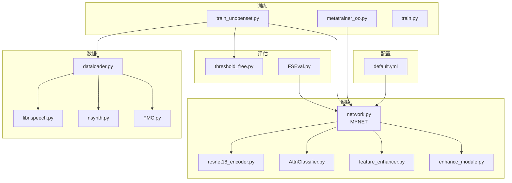
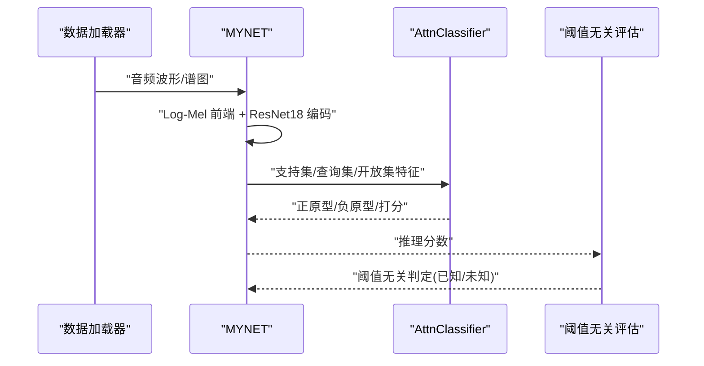
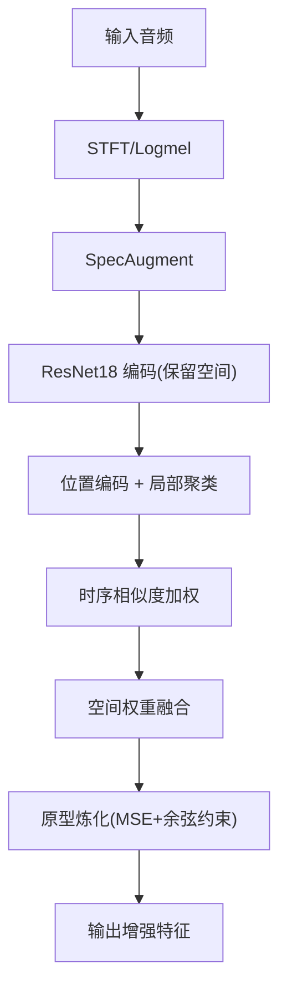
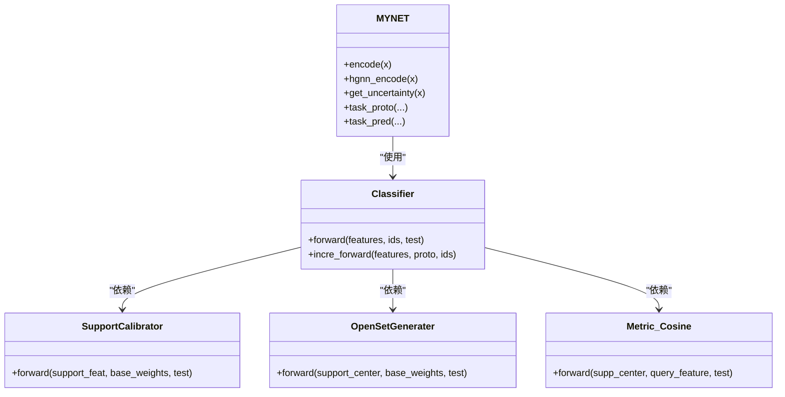
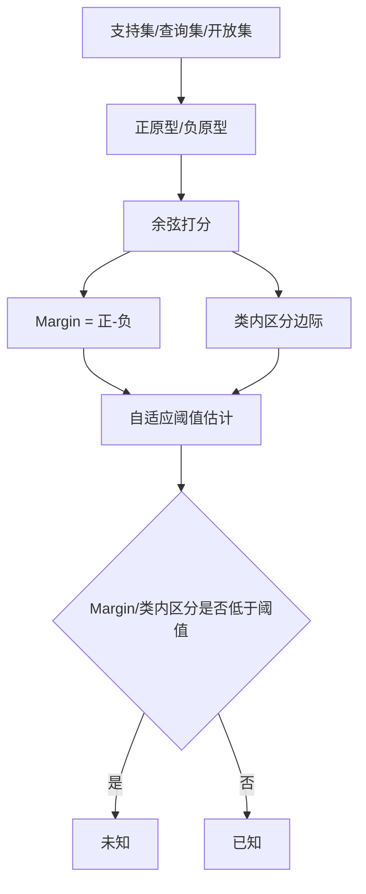
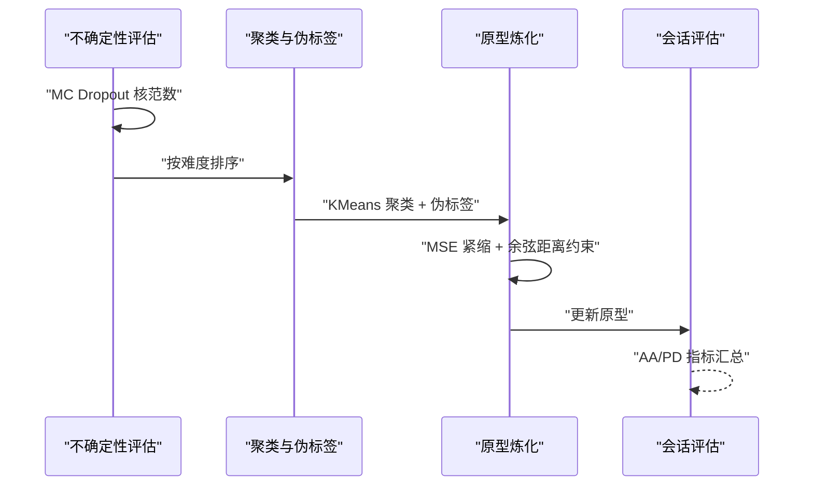
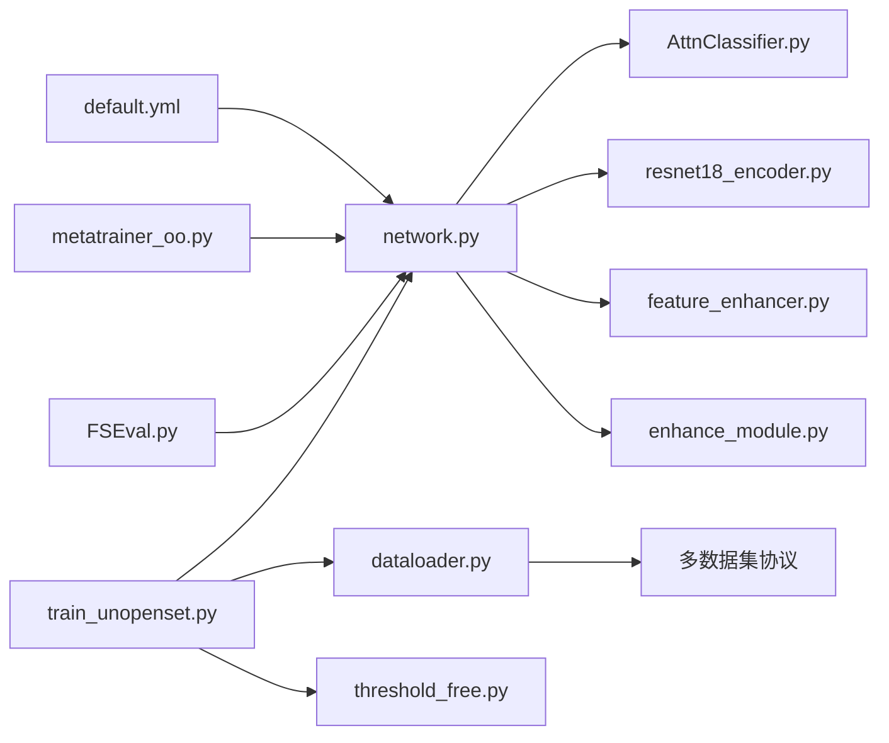

# 项目概述

<cite>
**本文引用的文件**
- [configs/default.yml](file://configs/default.yml)
- [docs/module_overview.md](file://docs/module_overview.md)
- [docs/experiment_plan_and_baselines.md](file://docs/experiment_plan_and_baselines.md)
- [network.py](file://network.py)
- [models/AttnClassifier.py](file://models/AttnClassifier.py)
- [models/metatrainer_oo.py](file://models/metatrainer_oo.py)
- [enhance_module.py](file://enhance_module.py)
- [models/resnet18_encoder.py](file://models/resnet18_encoder.py)
- [models/feature_enhancer.py](file://models/feature_enhancer.py)
- [data/dataloader.py](file://data/dataloader.py)
- [threshold_free.py](file://threshold_free.py)
- [models/FSEval.py](file://models/FSEval.py)
- [train_unopenset.py](file://train_unopenset.py)
- [train.py](file://train.py)
</cite>

## 目录
1. [简介](#简介)
2. [项目结构](#项目结构)
3. [核心组件](#核心组件)
4. [架构总览](#架构总览)
5. [详细组件分析](#详细组件分析)
6. [依赖关系分析](#依赖关系分析)
7. [性能考量](#性能考量)
8. [故障排查指南](#故障排查指南)
9. [结论](#结论)
10. [附录](#附录)

## 简介
VAZE 是一个面向视频与音频领域的“零样本扩展”系统，聚焦于在持续增量学习场景下的音频分类、开放集识别与不确定性建模。项目以“开集对偶原型元训练”为核心，结合多头注意力机制、原型学习、课程学习与不确定性估计，形成从音频前端到增量推理的完整流水线。系统在 LibriSpeech、NSynth、FSD-MIX 等数据集上进行公平对比实验，覆盖已知类识别、未知类拒绝、增量会话性能与稳定性等关键指标。

## 项目结构
项目采用模块化组织方式，围绕“配置-网络-数据-训练-评估-增强”六大维度划分目录与职责：
- 配置层：统一管理训练超参、数据增强参数与数据集协议
- 网络层：主干编码器、音频前端、原型分类器与注意力模块
- 数据层：多数据集适配、episode 采样与增量会话数据加载
- 训练层：元训练（开集对偶原型）、增量训练与不确定性课程
- 评估层：阈值无关的开集判定、AUROC/Acc/F1 等指标
- 增强层：局部特征聚类、时空位置编码与原型炼化

图表来源
- [configs/default.yml:1-88](file://configs/default.yml#L1-L88)
- [network.py:18-518](file://network.py#L18-L518)
- [models/resnet18_encoder.py:240-334](file://models/resnet18_encoder.py#L240-L334)
- [models/AttnClassifier.py:38-120](file://models/AttnClassifier.py#L38-L120)
- [models/feature_enhancer.py:27-93](file://models/feature_enhancer.py#L27-L93)
- [enhance_module.py:70-160](file://enhance_module.py#L70-L160)
- [data/dataloader.py:19-230](file://data/dataloader.py#L19-L230)
- [models/metatrainer_oo.py:17-214](file://models/metatrainer_oo.py#L17-L214)
- [train_unopenset.py:447-673](file://train_unopenset.py#L447-L673)
- [threshold_free.py:178-230](file://threshold_free.py#L178-L230)
- [models/FSEval.py:17-112](file://models/FSEval.py#L17-L112)

章节来源
- [configs/default.yml:1-88](file://configs/default.yml#L1-L88)
- [docs/module_overview.md:1-51](file://docs/module_overview.md#L1-L51)

## 核心组件
- 主干网络与音频前端
  - MYNET：集成 Log-Mel 前端、ResNet18 编码器、可选 dropout、多头注意力与原型分类器
  - 音频前端：STFT/Logmel、SpecAugment、BN 归一化
- 开集对偶原型分类器
  - SupportCalibrator：支持集原型校准（语义/视觉融合门控）
  - OpenSetGenerater：伪未知原型生成（注意力聚合、MLP 聚合）
  - Metric_Cosine：余弦度量打分与温度缩放
- 增量与课程学习
  - 不确定性估计：MC Dropout 核范数
  - 原型炼化：MSE 紧缩 + 与基类原型余弦距离下界约束
  - 阈值无关判定：Margin + 类内区分边际的自适应阈值
- 数据与采样
  - Episode 采样器：Support/Query/Unknown 三段式
  - CurriculumMetaDataset：按难度分层的课程元学习数据集

章节来源
- [network.py:18-518](file://network.py#L18-L518)
- [models/AttnClassifier.py:38-369](file://models/AttnClassifier.py#L38-L369)
- [enhance_module.py:70-160](file://enhance_module.py#L70-L160)
- [data/dataloader.py:263-351](file://data/dataloader.py#L263-L351)
- [threshold_free.py:178-230](file://threshold_free.py#L178-L230)

## 架构总览
系统整体采用“音频前端 → 编码器 → 原型分类器 → 增量推理”的流水线设计。训练阶段分为基础分类预训练、开集元训练与增量会话训练；推理阶段包含已知/未知样本的阈值无关判定与聚类伪标签驱动的原型更新。

图表来源
- [network.py:102-151](file://network.py#L102-L151)
- [models/AttnClassifier.py:47-93](file://models/AttnClassifier.py#L47-L93)
- [threshold_free.py:178-230](file://threshold_free.py#L178-L230)

## 详细组件分析

### 音频处理流水线与特征增强
- 音频前端
  - STFT/Logmel 提取频谱特征，SpecAugment 进行时间/频率遮挡增强
  - BN 归一化与通道扩展（3通道卷积输入）
- 编码器
  - ResNet18 作为骨干，保留空间维度便于注意力与局部增强
- 局部特征增强
  - LocalFeatureCluster：网格位置编码、时序相似度加权聚类、空间权重融合
  - EnhancedLocalFeature：LSTM 时序建模 + 原型动态加权聚合
- 原型炼化
  - MSE 紧缩 + 与基类原型余弦距离下界约束，防止新类原型“吞噬”基类原型

图表来源
- [network.py:326-518](file://network.py#L326-L518)
- [enhance_module.py:70-160](file://enhance_module.py#L70-L160)
- [models/feature_enhancer.py:27-93](file://models/feature_enhancer.py#L27-L93)
- [train_unopenset.py:339-368](file://train_unopenset.py#L339-L368)

章节来源
- [network.py:326-518](file://network.py#L326-L518)
- [enhance_module.py:70-160](file://enhance_module.py#L70-L160)
- [models/feature_enhancer.py:27-93](file://models/feature_enhancer.py#L27-L93)
- [train_unopenset.py:339-368](file://train_unopenset.py#L339-L368)

### 注意力机制与原型学习系统
- 多头注意力
  - 支持集与基类原型的跨模态融合（视觉+语义），动态门控调节
- 对偶原型
  - 正原型：支持集均值经校准器生成
  - 负原型：伪未知原型，通过注意力聚合与 MLP 聚合生成
- 余弦度量与温度缩放
  - 余弦相似度打分，温度参数可学习，提升判别性

图表来源
- [network.py:18-279](file://network.py#L18-L279)
- [models/AttnClassifier.py:38-369](file://models/AttnClassifier.py#L38-L369)

章节来源
- [network.py:18-279](file://network.py#L18-L279)
- [models/AttnClassifier.py:38-369](file://models/AttnClassifier.py#L38-L369)

### 开集识别与阈值无关判定
- 动态标签分配
  - 对开放集样本，依据查询样本最像的已知类为其伪标签，生成负原型
- 阈值无关策略
  - Margin = 正分 - 负分；类内区分边际 = 最高分 - 次高分
  - 自适应阈值：批内双簇聚类估计 Margin 阈值，分位点估计类内区分阈值
- AUROC/Acc/F1 评估
  - 元训练阶段同时统计闭集 Acc 与 AUROC；增量阶段输出已知/未知/增量/全部 Acc 与 AA/PD

图表来源
- [network.py:153-202](file://network.py#L153-L202)
- [models/metatrainer_oo.py:167-214](file://models/metatrainer_oo.py#L167-L214)
- [threshold_free.py:178-230](file://threshold_free.py#L178-L230)
- [models/FSEval.py:46-73](file://models/FSEval.py#L46-L73)

章节来源
- [network.py:153-202](file://network.py#L153-L202)
- [models/metatrainer_oo.py:167-214](file://models/metatrainer_oo.py#L167-L214)
- [threshold_free.py:178-230](file://threshold_free.py#L178-L230)
- [models/FSEval.py:46-73](file://models/FSEval.py#L46-L73)

### 增量学习与课程学习
- 不确定性课程
  - 基类样本按平均不确定性排序，简单到困难的课程顺序
  - 零样本难度评估：基于预训练 ResNet 特征分布的类内紧凑度排序
- 原型炼化
  - 使用 MSE 压缩聚类中心，同时施加与基类原型的余弦距离下界，避免灾难性遗忘
- 会话级评估
  - 已知 Acc、未知 Acc、F1、增量 Acc、全部 Acc；AA（四次会话平均）、PD（首末会话下降）

图表来源
- [train_unopenset.py:674-780](file://train_unopenset.py#L674-L780)
- [train_unopenset.py:278-337](file://train_unopenset.py#L278-L337)
- [train_unopenset.py:513-673](file://train_unopenset.py#L513-L673)

章节来源
- [train_unopenset.py:674-780](file://train_unopenset.py#L674-L780)
- [train_unopenset.py:278-337](file://train_unopenset.py#L278-L337)
- [train_unopenset.py:513-673](file://train_unopenset.py#L513-L673)

## 依赖关系分析
- 配置驱动
  - default.yml 统一控制训练轮次、学习率、数据增强、采样策略与网络模式
- 网络耦合
  - MYNET 依赖 resnet18_encoder、AttnClassifier、增强模块与不确定性接口
- 数据耦合
  - dataloader.py 提供 episode 采样与课程数据集包装，支持多数据集协议
- 训练耦合
  - metatrainer_oo.py 负责开集元训练；train_unopenset.py 负责增量全流程（含不确定性课程与阈值无关评估）

图表来源
- [configs/default.yml:1-88](file://configs/default.yml#L1-L88)
- [network.py:18-518](file://network.py#L18-L518)
- [models/AttnClassifier.py:38-120](file://models/AttnClassifier.py#L38-L120)
- [models/resnet18_encoder.py:240-334](file://models/resnet18_encoder.py#L240-L334)
- [models/feature_enhancer.py:27-93](file://models/feature_enhancer.py#L27-L93)
- [enhance_module.py:70-160](file://enhance_module.py#L70-L160)
- [data/dataloader.py:19-230](file://data/dataloader.py#L19-L230)
- [models/metatrainer_oo.py:17-84](file://models/metatrainer_oo.py#L17-L84)
- [train_unopenset.py:447-673](file://train_unopenset.py#L447-L673)
- [threshold_free.py:178-230](file://threshold_free.py#L178-L230)
- [models/FSEval.py:17-42](file://models/FSEval.py#L17-L42)

章节来源
- [configs/default.yml:1-88](file://configs/default.yml#L1-L88)
- [data/dataloader.py:19-230](file://data/dataloader.py#L19-L230)
- [models/metatrainer_oo.py:17-84](file://models/metatrainer_oo.py#L17-L84)
- [train_unopenset.py:447-673](file://train_unopenset.py#L447-L673)

## 性能考量
- 计算复杂度
  - 编码器：ResNet18 的卷积与池化主导；注意力与余弦打分线性于原型数与查询数
  - 局部增强：KMeans 与时序 LSTM 的计算与内存开销随特征维度与空间分辨率增长
- 训练稳定性
  - MC Dropout 与 SpecAugment 提升鲁棒性；温度缩放与余弦度量增强判别性
  - 原型炼化中的余弦距离约束防止新类“吞并”基类原型
- 评测效率
  - 阈值无关策略避免全局阈值搜索；AUROC/Acc/F1 评估在元训练与增量阶段分别统计

## 故障排查指南
- 随机性与可复现
  - 设置随机种子与确定性后端；检查随机性验证函数输出
- 设备与内存
  - 确认 CUDA 可用；必要时降低 batch size 或特征维度
- 模型加载与参数一致性
  - 检查预训练模型路径与参数键名；确保 fc 权重与 base 权重加载顺序
- 课程学习与阈值
  - 若已知 Acc 下降，检查不确定性排序与阈值混合参数；适当提高余弦距离下界

章节来源
- [train_unopenset.py:123-147](file://train_unopenset.py#L123-L147)
- [train_unopenset.py:464-482](file://train_unopenset.py#L464-L482)
- [threshold_free.py:178-230](file://threshold_free.py#L178-L230)

## 结论
VAZE 通过“开集对偶原型 + 注意力融合 + 不确定性课程 + 阈值无关判定”的组合，实现了在持续增量场景下的稳健音频分类与开放集识别。系统在 LibriSpeech、NSynth、FSD-MIX 等数据集上具备良好的可复现性与扩展性，适合进一步探索多模态融合、跨域泛化与实时推理优化。

## 附录
- 技术路线图与未来规划
  - 短期：完善多数据集协议与可视化工具链；优化课程学习与阈值混合策略
  - 中期：引入对比学习与自监督预训练；探索跨任务/跨域的原型迁移
  - 长期：结合声学-语义-上下文建模，构建更通用的零样本扩展框架

章节来源
- [docs/experiment_plan_and_baselines.md:1-30](file://docs/experiment_plan_and_baselines.md#L1-L30)
- [docs/module_overview.md:1-51](file://docs/module_overview.md#L1-L51)