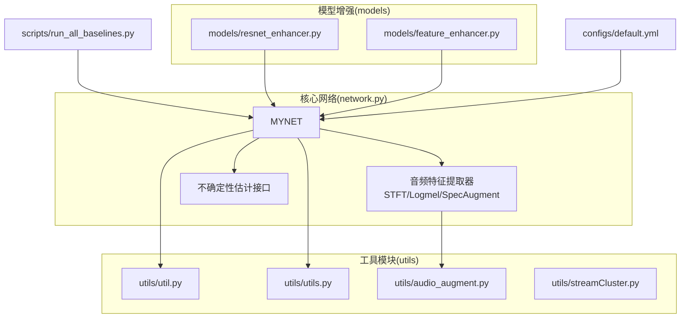
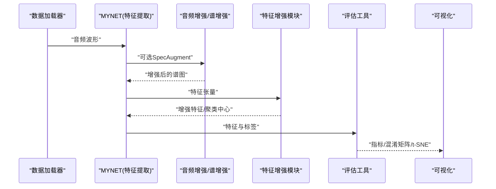
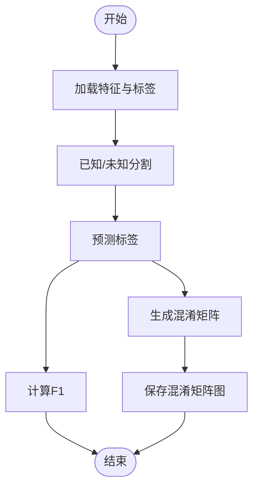
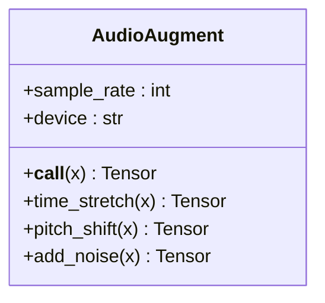
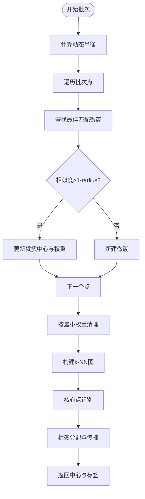
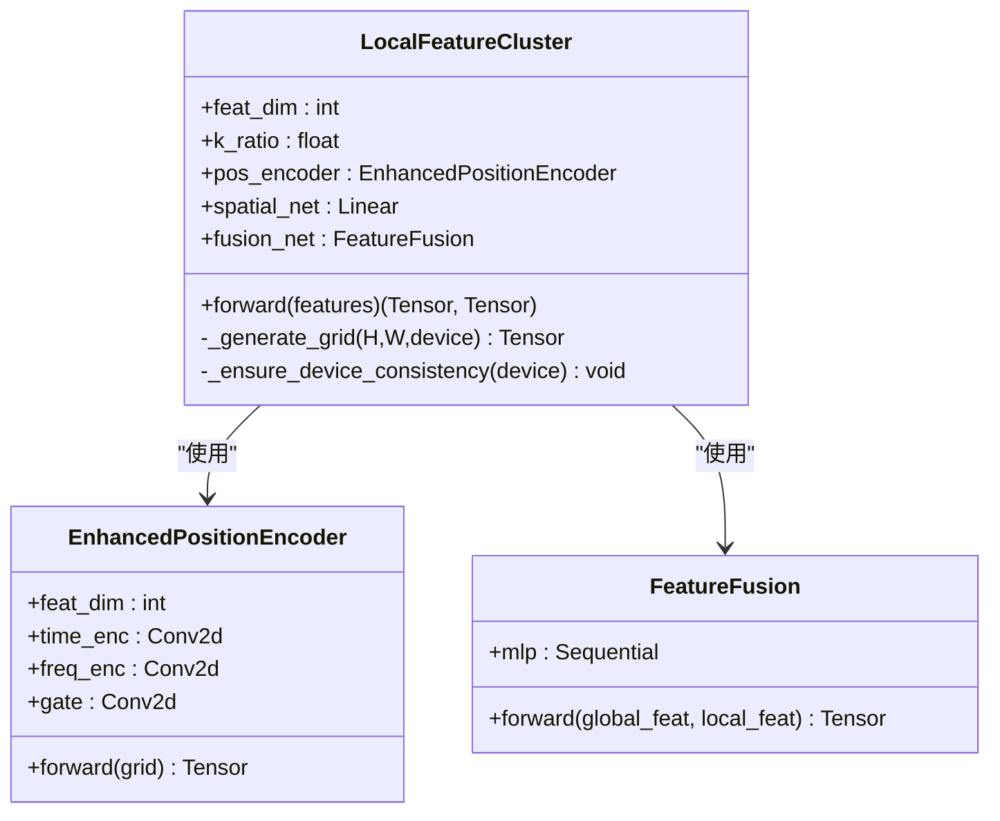
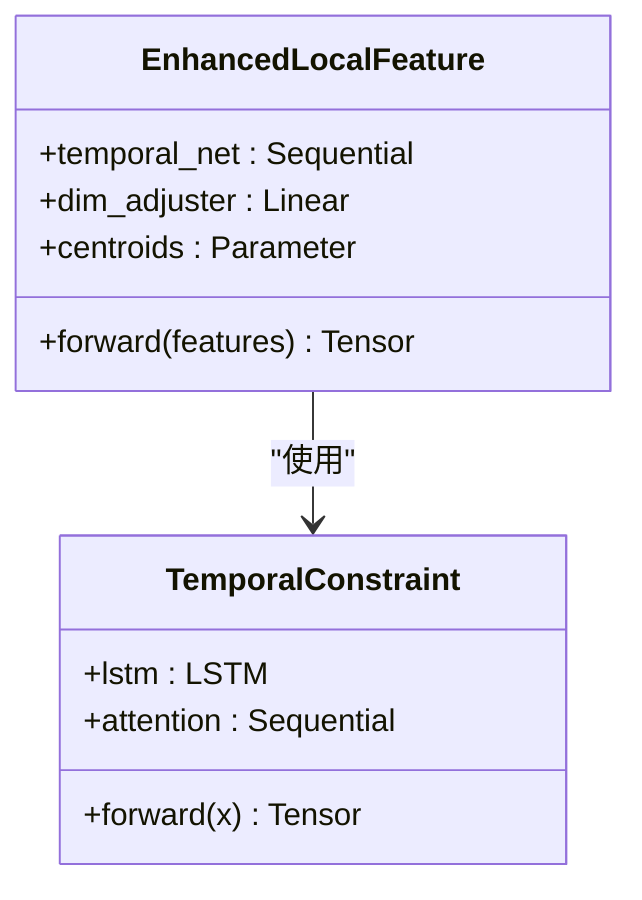
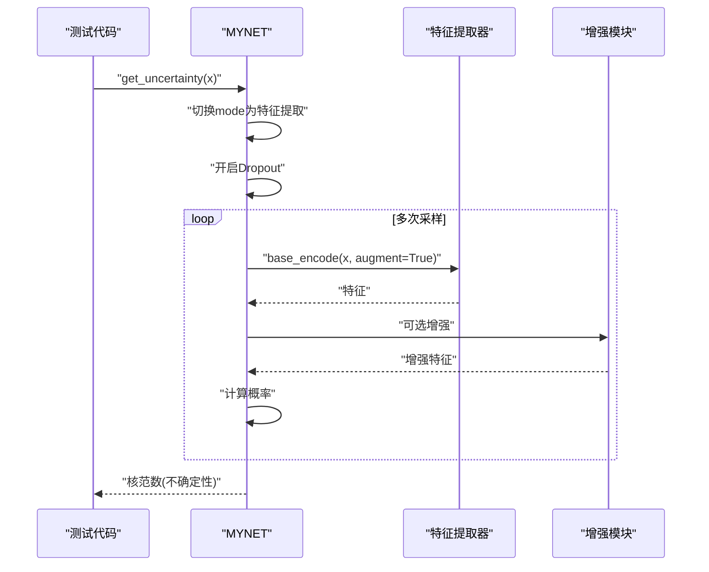
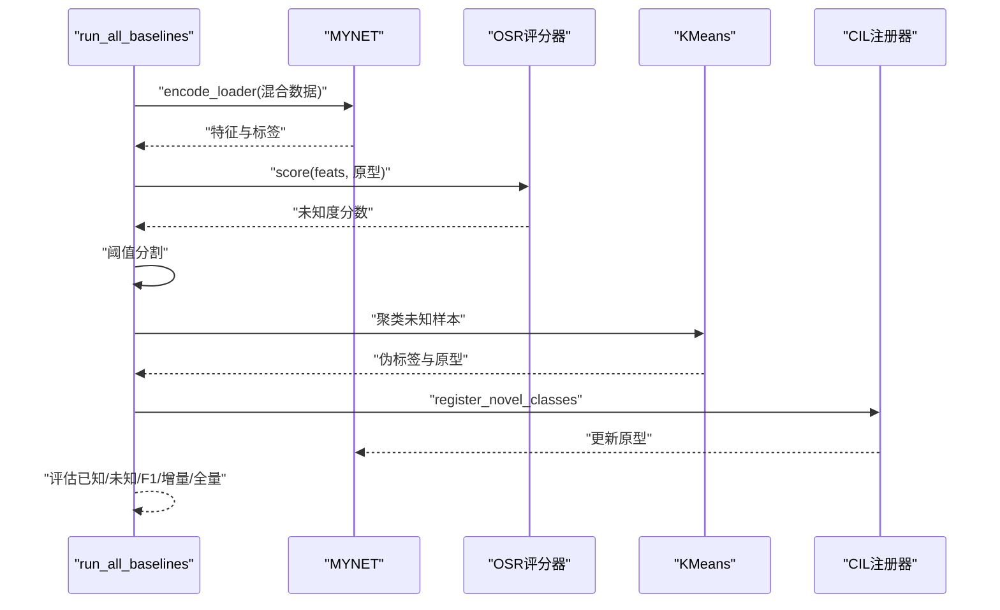
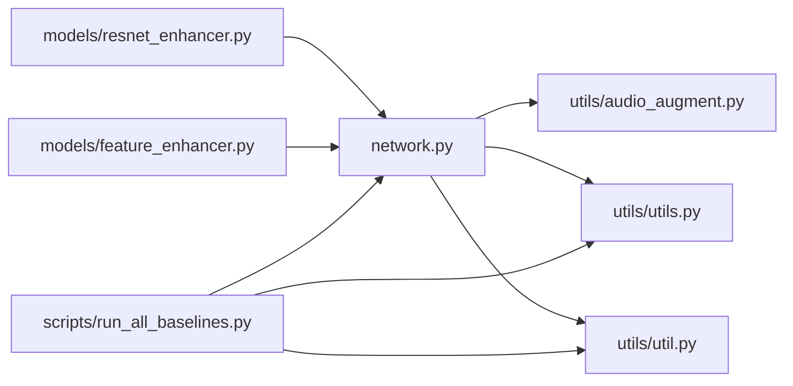

# 工具模块

<cite>
**本文引用的文件**
- [utils/util.py](file://utils/util.py)
- [utils/utils.py](file://utils/utils.py)
- [utils/audio_augment.py](file://utils/audio_augment.py)
- [utils/streamCluster.py](file://utils/streamCluster.py)
- [network.py](file://network.py)
- [models/resnet_enhancer.py](file://models/resnet_enhancer.py)
- [models/feature_enhancer.py](file://models/feature_enhancer.py)
- [configs/default.yml](file://configs/default.yml)
- [scripts/run_all_baselines.py](file://scripts/run_all_baselines.py)
- [train.py](file://train.py)
</cite>

## 目录
1. [简介](#简介)
2. [项目结构](#项目结构)
3. [核心组件](#核心组件)
4. [架构总览](#架构总览)
5. [详细组件分析](#详细组件分析)
6. [依赖分析](#依赖分析)
7. [性能考虑](#性能考虑)
8. [故障排查指南](#故障排查指南)
9. [结论](#结论)
10. [附录](#附录)

## 简介
本文件系统性梳理 VAZE 项目的工具模块，覆盖以下方面：
- 音频处理与增强：基于 torchaudio 的时域/音高变换与噪声注入，以及谱图 SpecAugment。
- 评估指标与聚类：提供聚类精度、F1 分数、计时器、混淆矩阵可视化、TSNE 可视化等工具。
- 聚类与特征增强：流式聚类器（FStream）、局部特征聚类与融合模块、时序约束增强模块。
- 不确定性估计：基于 MC Dropout 与核范数的不确定性计算流程。
- 设计原则与扩展机制：模块化、设备一致性、可插拔增强、可配置超参。
- 使用示例与最佳实践：结合脚本与训练流程的实际应用路径。
- 性能优化与错误处理：设备迁移、内存与 CPU-GPU 交互优化、异常保护。

## 项目结构
工具模块主要位于 utils/ 目录，并与网络、模型增强模块协同工作：
- utils/util.py：聚类精度、F1 计算、学习率调度等基础评估与训练辅助。
- utils/utils.py：日志、随机种子、GPU 设置、计数器、TSNE、混淆矩阵、不确定性估计等。
- utils/audio_augment.py：音频时域/音高增强与噪声注入。
- utils/streamCluster.py：面向小批量音频的流式聚类器。
- models/resnet_enhancer.py：局部特征聚类与位置编码增强模块。
- models/feature_enhancer.py：时序约束增强模块。
- configs/default.yml：训练与特征提取的关键超参（采样率、窗长、hop、mel-bin 等）。
- scripts/run_all_baselines.py：统一的基线评估驱动，串联特征编码、OSR 评分、聚类与 CIL 注册。
- network.py：音频特征提取器（STFT、Logmel、SpecAugment）、不确定性估计接口。

**图表来源**
- [utils/util.py:1-75](file://utils/util.py#L1-L75)
- [utils/utils.py:1-566](file://utils/utils.py#L1-L566)
- [utils/audio_augment.py:1-31](file://utils/audio_augment.py#L1-L31)
- [utils/streamCluster.py:1-132](file://utils/streamCluster.py#L1-L132)
- [network.py:18-503](file://network.py#L18-L503)
- [models/resnet_enhancer.py:1-172](file://models/resnet_enhancer.py#L1-L172)
- [models/feature_enhancer.py:1-93](file://models/feature_enhancer.py#L1-L93)
- [configs/default.yml:1-88](file://configs/default.yml#L1-L88)
- [scripts/run_all_baselines.py:1-200](file://scripts/run_all_baselines.py#L1-L200)

**章节来源**
- [utils/util.py:1-75](file://utils/util.py#L1-L75)
- [utils/utils.py:1-566](file://utils/utils.py#L1-L566)
- [utils/audio_augment.py:1-31](file://utils/audio_augment.py#L1-L31)
- [utils/streamCluster.py:1-132](file://utils/streamCluster.py#L1-L132)
- [network.py:18-503](file://network.py#L18-L503)
- [models/resnet_enhancer.py:1-172](file://models/resnet_enhancer.py#L1-L172)
- [models/feature_enhancer.py:1-93](file://models/feature_enhancer.py#L1-L93)
- [configs/default.yml:1-88](file://configs/default.yml#L1-L88)
- [scripts/run_all_baselines.py:1-200](file://scripts/run_all_baselines.py#L1-L200)

## 核心组件
- 评估与训练辅助
  - 聚类精度与 F1 计算：用于未知类聚类质量评估与已知/未知分割的 F1 评分。
  - 学习率调度：余弦退火与阶梯衰减策略。
  - 计数器与日志：Averager、AverageMeter、Logger 等。
- 音频处理与增强
  - 音频增强：时移、音高变换、噪声注入。
  - 谱图增强：SpecAugment（时间/频率条带遮挡）。
- 聚类与特征增强
  - 流式聚类器：基于余弦相似度与动态半径的微簇合并与标签分配。
  - 局部特征聚类与融合：位置编码、空间权重、KMeans 聚类与原型加权。
  - 时序约束增强：LSTM + 注意力的时序建模。
- 不确定性估计
  - 基于 MC Dropout 与核范数的不确定性计算流程。
- 可视化与分析
  - TSNE、混淆矩阵、权重分布可视化。

**章节来源**
- [utils/util.py:12-75](file://utils/util.py#L12-L75)
- [utils/utils.py:23-287](file://utils/utils.py#L23-L287)
- [utils/audio_augment.py:4-31](file://utils/audio_augment.py#L4-L31)
- [utils/streamCluster.py:5-132](file://utils/streamCluster.py#L5-L132)
- [models/resnet_enhancer.py:51-172](file://models/resnet_enhancer.py#L51-L172)
- [models/feature_enhancer.py:27-93](file://models/feature_enhancer.py#L27-L93)
- [network.py:50-101](file://network.py#L50-L101)

## 架构总览
工具模块围绕“特征提取—增强—评估—可视化”闭环协作：
- 特征提取：STFT/Logmel/SpecAugment 由网络模块提供。
- 增强：音频增强与特征增强模块在不同阶段插入。
- 评估：聚类精度、F1、混淆矩阵、TSNE。
- 可视化：权重分布、聚类中心、t-SNE 图。
- 不确定性：MC Dropout + 核范数估计。

**图表来源**
- [network.py:337-503](file://network.py#L337-L503)
- [utils/audio_augment.py:9-31](file://utils/audio_augment.py#L9-L31)
- [models/resnet_enhancer.py:73-160](file://models/resnet_enhancer.py#L73-L160)
- [utils/utils.py:360-488](file://utils/utils.py#L360-L488)
- [utils/utils.py:23-60](file://utils/utils.py#L23-L60)

## 详细组件分析

### 评估与训练辅助模块
- 聚类精度与 F1
  - 聚类精度：通过匈牙利匹配计算聚类准确率，支持最小类别过滤与映射返回。
  - F1：对已知/未知分割进行二分类 F1 评分。
- 学习率调度
  - 余弦退火与阶梯衰减，支持多步长衰减策略。
- 计数器与日志
  - Averager/AverageMeter/LAverageMeter/DAverageMeter：多层级平均与聚合。
  - Logger：文件与控制台双输出。
- 混淆矩阵与 t-SNE
  - 混淆矩阵热力图与颜色条保存。
  - t-SNE 降维与散点图保存。

**图表来源**
- [utils/util.py:49-57](file://utils/util.py#L49-L57)
- [utils/utils.py:439-488](file://utils/utils.py#L439-L488)
- [utils/utils.py:360-380](file://utils/utils.py#L360-L380)

**章节来源**
- [utils/util.py:12-75](file://utils/util.py#L12-L75)
- [utils/utils.py:190-287](file://utils/utils.py#L190-L287)
- [utils/utils.py:360-488](file://utils/utils.py#L360-L488)

### 音频处理与增强模块
- 音频增强
  - 时移、音高变换、噪声注入，按概率随机组合。
  - 保持批处理维度，自动移动到指定设备。
- 谱图增强
  - SpecAugment：时间/频率条带遮挡，提升鲁棒性。
- 配置
  - 采样率、窗长、hop、mel-bin 等由配置文件提供。

**图表来源**
- [utils/audio_augment.py:4-31](file://utils/audio_augment.py#L4-L31)

**章节来源**
- [utils/audio_augment.py:1-31](file://utils/audio_augment.py#L1-L31)
- [network.py:337-453](file://network.py#L337-L453)
- [configs/default.yml:77-85](file://configs/default.yml#L77-L85)

### 流式聚类器（FStream）
- 设计要点
  - 微簇结构体：中心、点集合、权重、最后更新时间。
  - 余弦相似度与动态半径：根据簇间距离自适应调整半径。
  - k-NN 图与核心-边界分离：简化 DBSCAN 思想。
  - 权重重整与清理：指数衰减与最小权重阈值。
- 流式处理
  - 批量处理小样本音频特征，实时更新微簇并分配标签。

**图表来源**
- [utils/streamCluster.py:58-132](file://utils/streamCluster.py#L58-L132)

**章节来源**
- [utils/streamCluster.py:1-132](file://utils/streamCluster.py#L1-L132)

### 局部特征聚类与融合模块
- 结构组成
  - 位置编码器：时间/频率轴独立编码并通过门控融合。
  - 空间权重网络：为聚类特征与原增强特征分配融合权重。
  - KMeans 聚类与原型加权：基于空间相似度的时序加权中心。
  - 特征融合：全局特征与局部特征的动态融合。
- 设备一致性
  - 自动迁移参数至输入设备，保证张量在同一设备上。

**图表来源**
- [models/resnet_enhancer.py:31-160](file://models/resnet_enhancer.py#L31-L160)

**章节来源**
- [models/resnet_enhancer.py:51-172](file://models/resnet_enhancer.py#L51-L172)

### 时序约束增强模块
- LSTM + 注意力
  - 时序建模：双向 LSTM + 线性映射。
  - 注意力：时序加权聚合，输出固定长度表征。
- 维度适配
  - 通过线性层适配输入通道数，确保维度一致。

**图表来源**
- [models/feature_enhancer.py:5-93](file://models/feature_enhancer.py#L5-L93)

**章节来源**
- [models/feature_enhancer.py:27-93](file://models/feature_enhancer.py#L27-L93)

### 不确定性估计流程
- MC Dropout + 核范数
  - 临时切换模型为 eval，逐层开启 Dropout。
  - 多次增强采样（SpecAugment 或特征掩码）与前向，收集概率矩阵。
  - 计算核范数作为不确定性指标。
- 网络接口
  - 提供 get_uncertainty 方法，封装模式切换与设备一致性。

**图表来源**
- [network.py:50-101](file://network.py#L50-L101)
- [utils/utils.py:23-60](file://utils/utils.py#L23-L60)

**章节来源**
- [network.py:50-101](file://network.py#L50-L101)
- [utils/utils.py:23-60](file://utils/utils.py#L23-L60)

### 基线评估驱动（run_all_baselines）
- 流程概览
  - 编码混合数据集特征 → OSR 评分 → 阈值分割 → 对未知样本聚类 → CIL 注册新原型 → 评估已知/未知/F1/增量/全量准确率。
- 关键工具
  - encode_loader：批量特征提取。
  - cluster_acc：聚类映射与精度。
  - count_acc：准确率计算。

**图表来源**
- [scripts/run_all_baselines.py:82-186](file://scripts/run_all_baselines.py#L82-L186)
- [utils/util.py:12-57](file://utils/util.py#L12-L57)
- [utils/utils.py:383-437](file://utils/utils.py#L383-L437)

**章节来源**
- [scripts/run_all_baselines.py:1-200](file://scripts/run_all_baselines.py#L1-L200)
- [utils/util.py:12-57](file://utils/util.py#L12-L57)
- [utils/utils.py:383-437](file://utils/utils.py#L383-L437)

## 依赖分析
- 模块耦合
  - network.py 依赖 utils/audio_augment.py 与 utils/utils.py 中的评估/可视化工具。
  - models/resnet_enhancer.py 与 models/feature_enhancer.py 作为增强模块被网络调用。
  - scripts/run_all_baselines.py 串联网络编码、OSR、聚类与 CIL。
- 外部依赖
  - torchaudio、sklearn（KMeans、TSNE、metrics）、matplotlib、pandas、yaml。

**图表来源**
- [network.py:18-503](file://network.py#L18-L503)
- [utils/audio_augment.py:1-31](file://utils/audio_augment.py#L1-L31)
- [utils/utils.py:1-566](file://utils/utils.py#L1-L566)
- [utils/util.py:1-75](file://utils/util.py#L1-L75)
- [models/resnet_enhancer.py:1-172](file://models/resnet_enhancer.py#L1-L172)
- [models/feature_enhancer.py:1-93](file://models/feature_enhancer.py#L1-L93)
- [scripts/run_all_baselines.py:1-200](file://scripts/run_all_baselines.py#L1-L200)

**章节来源**
- [network.py:18-503](file://network.py#L18-L503)
- [utils/utils.py:1-566](file://utils/utils.py#L1-L566)
- [scripts/run_all_baselines.py:1-200](file://scripts/run_all_baselines.py#L1-L200)

## 性能考虑
- 设备一致性
  - 所有可学习参数与子模块在 forward 中确保与输入设备一致，避免跨设备通信开销。
- CPU-GPU 交互优化
  - 批量 KMeans：一次性将展平特征迁移到 CPU 计算，减少多次交互。
  - 聚类中心与标签迁移回 GPU 后再进行向量化操作。
- 内存与计算
  - 空间相似度矩阵基于坐标距离，避免冗余计算。
  - 融合门控与空间权重在 GPU 上完成，减少额外拷贝。
- 可视化与日志
  - t-SNE 与混淆矩阵按需生成，避免频繁 I/O。

**章节来源**
- [models/resnet_enhancer.py:100-110](file://models/resnet_enhancer.py#L100-L110)
- [models/resnet_enhancer.py:149-160](file://models/resnet_enhancer.py#L149-L160)
- [utils/utils.py:360-488](file://utils/utils.py#L360-L488)

## 故障排查指南
- 设备不一致导致的断言失败
  - 现象：参数设备与输入设备不一致。
  - 处理：调用 _ensure_device_consistency，确保模块与输入在同一设备。
- 维度不匹配
  - 现象：LSTM 输入维度与预期不符。
  - 处理：在 EnhancedLocalFeature 中进行维度适配与断言校验。
- 聚类空簇
  - 现象：某些聚类类别无样本。
  - 处理：过滤空簇，使用原始中心替代，避免 NaN。
- 不确定性估计异常
  - 现象：核范数计算异常或不稳定。
  - 处理：确认 Dropouts 已开启且增强开关正确；检查概率矩阵维度与数值范围。

**章节来源**
- [models/resnet_enhancer.py:168-172](file://models/resnet_enhancer.py#L168-L172)
- [models/feature_enhancer.py:61-62](file://models/feature_enhancer.py#L61-L62)
- [models/resnet_enhancer.py:120-142](file://models/resnet_enhancer.py#L120-L142)
- [network.py:50-101](file://network.py#L50-L101)

## 结论
VAZE 的工具模块以“可插拔、可配置、可扩展”为核心设计原则，围绕音频特征提取、增强、评估与可视化形成完整流水线。通过流式聚类、局部特征聚类与融合、时序约束增强及不确定性估计，显著提升了模型在增量与开放集场景下的鲁棒性与泛化能力。建议在实际部署中关注设备一致性、CPU-GPU 交互与维度校验，以获得更稳定的性能表现。

## 附录
- 使用示例与最佳实践
  - 基线评估：参考 run_all_baselines，先编码特征，再进行 OSR 评分与聚类，最后注册新原型并评估。
  - 不确定性估计：在测试阶段临时开启 MC Dropout，多次采样后计算核范数。
  - 可视化：使用 utils/utils.py 中的 TSNE 与混淆矩阵函数进行结果分析。
- 配置参考
  - 采样率、窗长、hop、mel-bin 等由 configs/default.yml 提供，可根据数据集调整。

**章节来源**
- [scripts/run_all_baselines.py:82-186](file://scripts/run_all_baselines.py#L82-L186)
- [utils/utils.py:23-60](file://utils/utils.py#L23-L60)
- [utils/utils.py:360-488](file://utils/utils.py#L360-L488)
- [configs/default.yml:77-85](file://configs/default.yml#L77-L85)