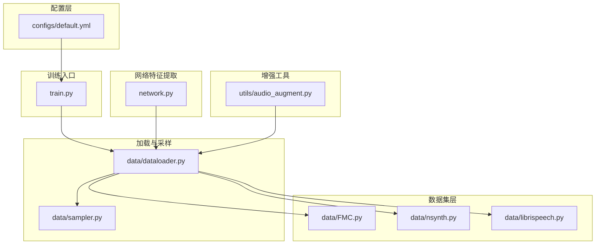
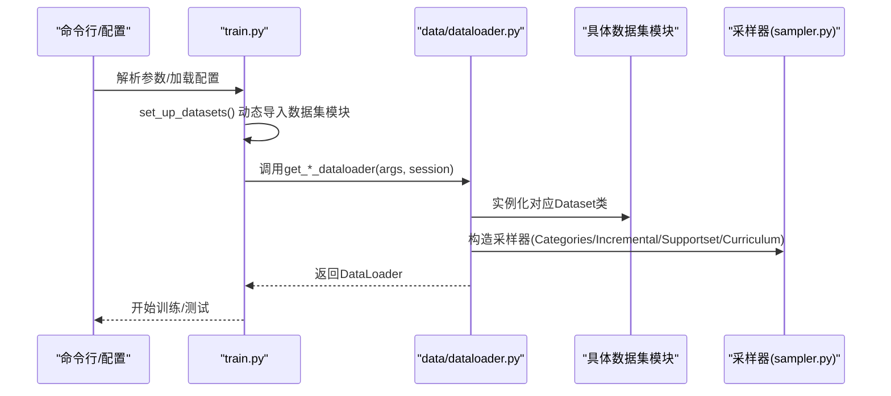
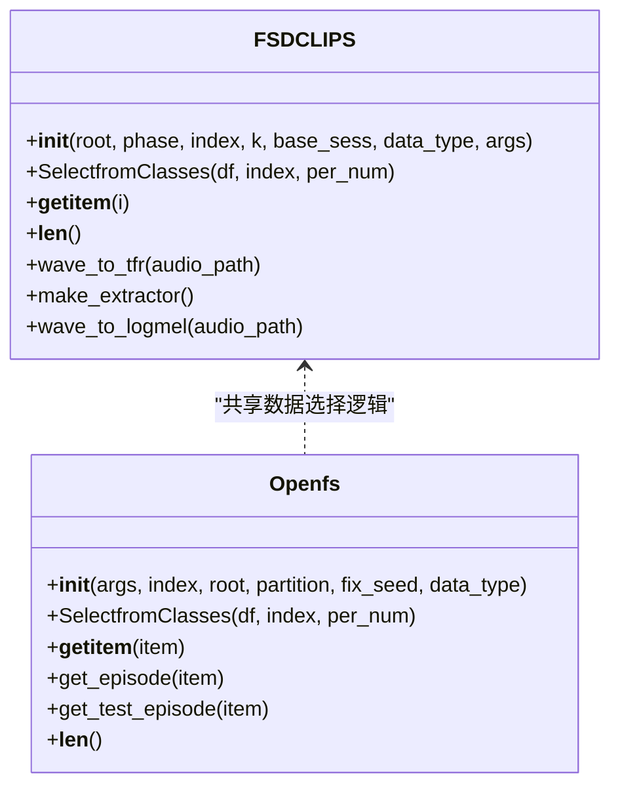
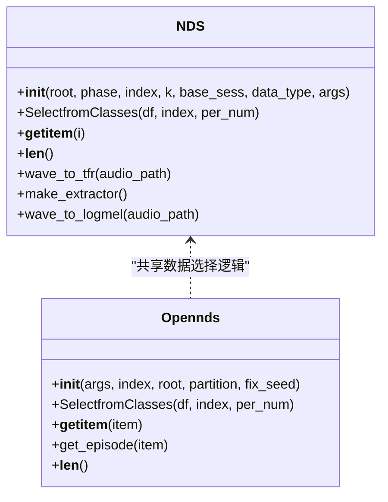
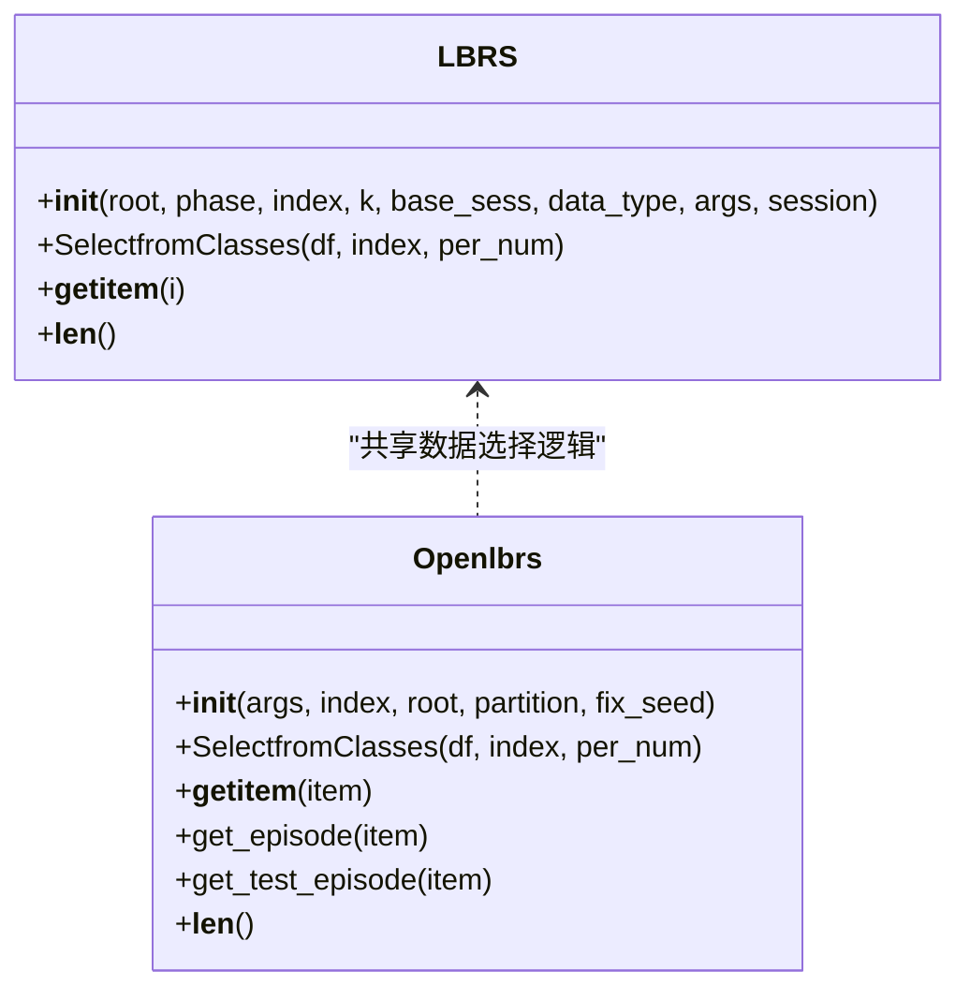
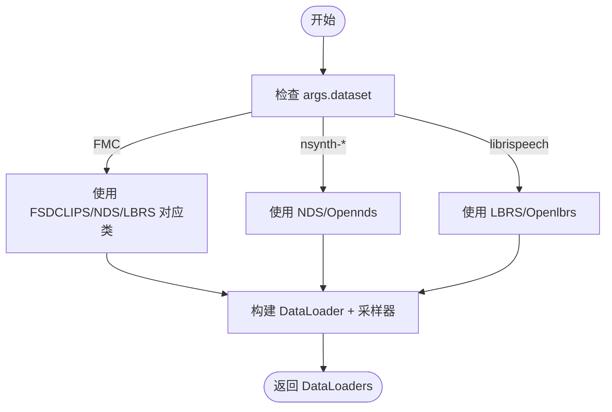
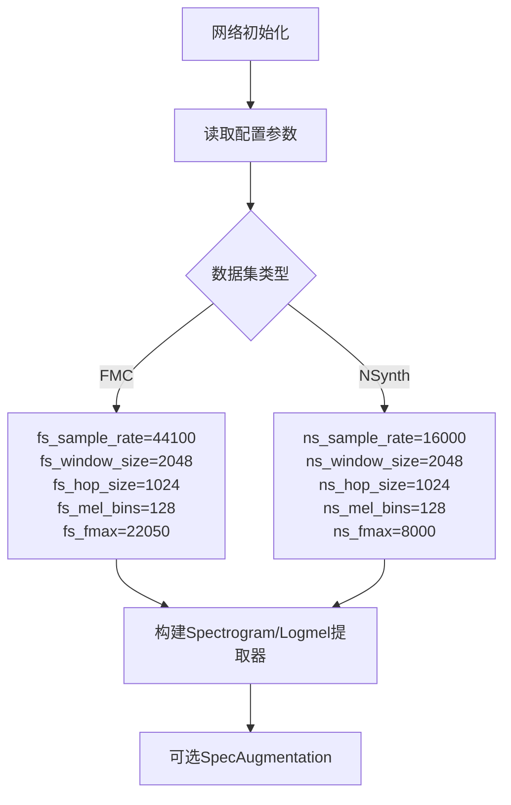
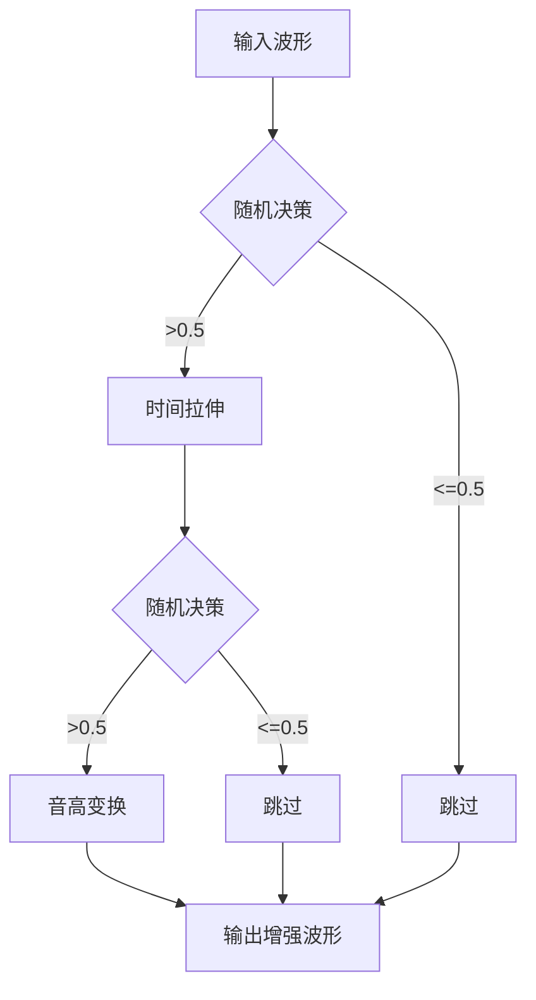
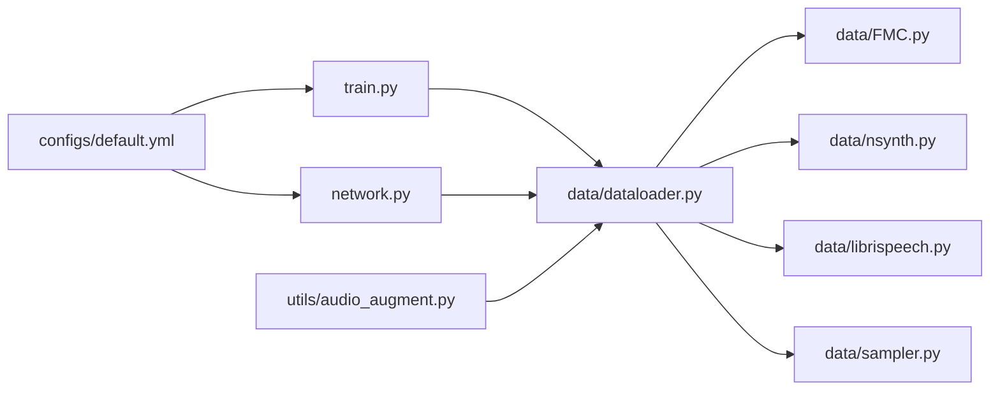

# 多数据集支持

<cite>
**本文档引用的文件**
- [data/FMC.py](file://data/FMC.py)
- [data/nsynth.py](file://data/nsynth.py)
- [data/librispeech.py](file://data/librispeech.py)
- [data/dataloader.py](file://data/dataloader.py)
- [data/sampler.py](file://data/sampler.py)
- [configs/default.yml](file://configs/default.yml)
- [train.py](file://train.py)
- [network.py](file://network.py)
- [utils/audio_augment.py](file://utils/audio_augment.py)
</cite>

## 目录
1. [简介](#简介)
2. [项目结构](#项目结构)
3. [核心组件](#核心组件)
4. [架构总览](#架构总览)
5. [详细组件分析](#详细组件分析)
6. [依赖关系分析](#依赖关系分析)
7. [性能考量](#性能考量)
8. [故障排查指南](#故障排查指南)
9. [结论](#结论)
10. [附录](#附录)

## 简介
本文件面向VAZE项目中的多数据集支持系统，系统性阐述FMC、NSynth、LibriSpeech三类音频数据集的实现原理与处理流程，包括：
- 特征提取方法与数据格式
- 预处理与增强策略
- 数据集切换机制与配置选项
- 数据集扩展指南（如何新增音频数据集）
- 具体使用场景与代码路径示例

目标读者既包括需要快速上手的使用者，也包括希望深入理解实现细节的开发者。

## 项目结构
多数据集支持主要由以下模块构成：
- 数据集适配层：FMC、NSynth、LibriSpeech各自定义Dataset类与Open*变体（用于元学习episode采样）
- 数据加载与采样：dataloader.py负责根据配置动态实例化对应数据集；sampler.py提供多种采样器
- 配置中心：default.yml集中管理训练参数、数据加载参数、特征提取参数
- 训练入口：train.py负责解析命令行参数、动态导入数据集模块并构建数据加载器
- 网络侧特征提取：network.py内含针对不同数据集的特征提取器配置
- 音频增强：utils/audio_augment.py提供时间拉伸、音高变换等增强

图表来源
- [configs/default.yml:1-88](file://configs/default.yml#L1-L88)
- [train.py:156-171](file://train.py#L156-L171)
- [data/dataloader.py:19-46](file://data/dataloader.py#L19-L46)
- [data/sampler.py:1-201](file://data/sampler.py#L1-L201)
- [network.py:337-388](file://network.py#L337-L388)
- [utils/audio_augment.py:1-31](file://utils/audio_augment.py#L1-L31)

章节来源
- [configs/default.yml:1-88](file://configs/default.yml#L1-L88)
- [train.py:156-171](file://train.py#L156-L171)
- [data/dataloader.py:19-46](file://data/dataloader.py#L19-L46)

## 核心组件
- 数据集适配器
  - FSDCLIPS/LBRS/NDS：标准数据集类，负责读取CSV标注、拼接音频路径、加载音频波形
  - Openlbrs/Opennds/Openfs：元学习episode采样器，按way/shots/queries生成support/query/openset样本
- 数据加载器工厂
  - 根据args.dataset动态选择具体数据集类，构造DataLoader
  - 支持基类会话、增量会话、测试会话、增量测试会话等
- 采样器
  - CategoriesSampler：基础分类采样
  - TrueIncreTrainCategoriesSampler：增量训练阶段的混合采样（已知+新类）
  - SupportsetSampler：元学习episode采样（固定类别数）
  - CurriculumSampler：课程学习采样器（可动态更新活跃类别池）
- 配置中心
  - 统一管理way、shot、batch大小、采样参数、特征提取参数等
- 网络侧特征提取
  - 针对不同数据集采样率、窗长、hop、mel_bins、fmax等参数进行差异化配置
- 音频增强
  - 提供时间拉伸、音高变换等增强策略

章节来源
- [data/FMC.py:21-101](file://data/FMC.py#L21-L101)
- [data/nsynth.py:21-109](file://data/nsynth.py#L21-L109)
- [data/librispeech.py:21-79](file://data/librispeech.py#L21-L79)
- [data/dataloader.py:19-254](file://data/dataloader.py#L19-L254)
- [data/sampler.py:6-201](file://data/sampler.py#L6-L201)
- [configs/default.yml:1-88](file://configs/default.yml#L1-L88)
- [network.py:337-388](file://network.py#L337-L388)
- [utils/audio_augment.py:1-31](file://utils/audio_augment.py#L1-L31)

## 架构总览
下图展示训练入口如何根据配置选择数据集模块，并通过dataloader工厂构建对应的DataLoader与采样器。

图表来源
- [train.py:156-171](file://train.py#L156-L171)
- [data/dataloader.py:19-254](file://data/dataloader.py#L19-L254)
- [data/sampler.py:6-201](file://data/sampler.py#L6-L201)

## 详细组件分析

### FMC（FSD-MIX-CLIPS）数据集
- 数据来源与格式
  - 使用CSV标注文件，包含音频文件名、起始时间、标签等字段
  - 音频路径基于根目录与数据类型拼接
- 特征提取与预处理
  - 支持直接加载波形返回（squeeze后的一维波形）
  - 内置fbank/log-mel提取器（可选）
- 元学习支持
  - FSDCLIPS：标准数据集类
  - Openfs：episode采样器，支持close-set与open-set组合

图表来源
- [data/FMC.py:21-101](file://data/FMC.py#L21-L101)
- [data/FMC.py:151-351](file://data/FMC.py#L151-L351)

章节来源
- [data/FMC.py:21-101](file://data/FMC.py#L21-L101)
- [data/FMC.py:151-351](file://data/FMC.py#L151-L351)

### NSynth（The NSynth Dataset）数据集
- 数据来源与格式
  - CSV标注包含乐器类别，通过词汇表映射为数字标签
  - 音频路径基于源目录与文件名拼接
- 特征提取与预处理
  - 支持直接加载波形返回
  - 内置fbank/log-mel提取器（可选）
- 元学习支持
  - NDS：标准数据集类
  - Opennds：episode采样器，支持close-set与open-set组合

图表来源
- [data/nsynth.py:21-109](file://data/nsynth.py#L21-L109)
- [data/nsynth.py:160-272](file://data/nsynth.py#L160-L272)

章节来源
- [data/nsynth.py:21-109](file://data/nsynth.py#L21-L109)
- [data/nsynth.py:160-272](file://data/nsynth.py#L160-L272)

### LibriSpeech数据集
- 数据来源与格式
  - CSV标注包含标签与文件名
  - 音频路径基于根目录与特定子目录拼接
- 特征提取与预处理
  - 支持直接加载波形返回
- 元学习支持
  - LBRS：标准数据集类
  - Openlbrs：episode采样器，支持close-set与open-set组合

图表来源
- [data/librispeech.py:21-79](file://data/librispeech.py#L21-L79)
- [data/librispeech.py:82-263](file://data/librispeech.py#L82-L263)

章节来源
- [data/librispeech.py:21-79](file://data/librispeech.py#L21-L79)
- [data/librispeech.py:82-263](file://data/librispeech.py#L82-L263)

### 数据加载与采样器
- 数据加载器工厂
  - 根据args.dataset分支选择具体数据集类
  - 支持基类会话、增量会话、测试会话、增量测试会话
  - 支持课程学习数据集包装
- 采样器
  - CategoriesSampler：基础分类采样
  - TrueIncreTrainCategoriesSampler：增量训练混合采样
  - SupportsetSampler：元学习episode采样
  - CurriculumSampler：课程学习采样

图表来源
- [data/dataloader.py:19-46](file://data/dataloader.py#L19-L46)
- [data/dataloader.py:108-132](file://data/dataloader.py#L108-L132)
- [data/dataloader.py:134-254](file://data/dataloader.py#L134-L254)
- [data/sampler.py:6-201](file://data/sampler.py#L6-L201)

章节来源
- [data/dataloader.py:19-46](file://data/dataloader.py#L19-L46)
- [data/dataloader.py:108-132](file://data/dataloader.py#L108-L132)
- [data/dataloader.py:134-254](file://data/dataloader.py#L134-L254)
- [data/sampler.py:6-201](file://data/sampler.py#L6-L201)

### 网络侧特征提取器配置
- 不同数据集采用不同的采样率、窗长、hop、mel_bins、fmax等参数
- network.py中针对FMC与NSynth分别配置了特征提取器与SpecAugment

图表来源
- [network.py:337-388](file://network.py#L337-L388)

章节来源
- [network.py:337-388](file://network.py#L337-L388)

### 音频增强
- 提供时间拉伸、音高变换等增强策略
- 可在训练过程中对批次数据进行随机增强

图表来源
- [utils/audio_augment.py:1-31](file://utils/audio_augment.py#L1-L31)

章节来源
- [utils/audio_augment.py:1-31](file://utils/audio_augment.py#L1-L31)

## 依赖关系分析
- 训练入口依赖数据集模块与dataloader工厂
- dataloader工厂依赖具体数据集类与采样器
- 网络侧特征提取器依赖配置中心的参数
- 增强工具独立于数据集，可在训练流程中按需调用

图表来源
- [train.py:156-171](file://train.py#L156-L171)
- [data/dataloader.py:19-46](file://data/dataloader.py#L19-L46)
- [data/sampler.py:1-201](file://data/sampler.py#L1-L201)
- [network.py:337-388](file://network.py#L337-L388)
- [utils/audio_augment.py:1-31](file://utils/audio_augment.py#L1-L31)
- [configs/default.yml:1-88](file://configs/default.yml#L1-L88)

章节来源
- [train.py:156-171](file://train.py#L156-L171)
- [data/dataloader.py:19-46](file://data/dataloader.py#L19-L46)
- [data/sampler.py:1-201](file://data/sampler.py#L1-L201)
- [network.py:337-388](file://network.py#L337-L388)
- [utils/audio_augment.py:1-31](file://utils/audio_augment.py#L1-L31)
- [configs/default.yml:1-88](file://configs/default.yml#L1-L88)

## 性能考量
- 数据加载
  - 使用pin_memory与多进程num_workers提升I/O吞吐
  - 通过worker_init_fn与Generator保证可复现性
- 采样策略
  - 课程学习采样器可根据任务难度动态调整活跃类别池
  - SupportsetSampler确保每个episode类别数与样本数固定
- 特征提取
  - 不同数据集采用差异化的采样率与频带范围，平衡计算开销与语义表达
- 增强策略
  - SpecAugmentation与随机时域/频域扰动有助于提升泛化能力

[本节为通用指导，无需特定文件来源]

## 故障排查指南
- 数据路径错误
  - 确认args.dataroot与各数据集CSV路径一致
  - 检查CSV中的文件名与实际文件是否匹配
- 标签映射问题
  - NSynth需确认词汇表JSON与CSV标签一致
- 采样异常
  - 若类别数不足，CurriculumSampler会自动填充或警告
  - SupportsetSampler要求类别数等于n_cls
- 训练不稳定
  - 检查随机种子设置与worker_init_fn配置
  - 确认特征提取参数与网络侧配置一致

章节来源
- [data/dataloader.py:19-46](file://data/dataloader.py#L19-L46)
- [data/sampler.py:141-201](file://data/sampler.py#L141-L201)
- [configs/default.yml:1-88](file://configs/default.yml#L1-L88)

## 结论
VAZE的多数据集支持系统通过清晰的模块划分与动态切换机制，实现了对FMC、NSynth、LibriSpeech三类音频数据集的统一接入。其核心优势在于：
- 易扩展：新增数据集只需实现Dataset与Open*类，并在dataloader中添加分支
- 可配置：通过配置文件集中管理训练与特征提取参数
- 可复现：严格的随机种子与worker初始化策略保障实验稳定性
- 可迁移：网络侧特征提取器针对不同数据集参数化配置，便于跨数据集迁移

[本节为总结，无需特定文件来源]

## 附录

### 数据集切换机制与配置选项
- 切换机制
  - train.py中set_up_datasets根据args.dataset动态导入对应模块
  - dataloader.py中根据字符串匹配选择具体数据集类
- 关键配置项
  - 训练参数：way、shot、num_session、num_base、num_novel、test_times等
  - 数据加载参数：num_workers、train_batch_size、test_batch_size
  - 特征提取参数：sample_rate、window_size、hop_size、mel_bins、fmin、fmax、window

章节来源
- [train.py:156-171](file://train.py#L156-L171)
- [data/dataloader.py:19-46](file://data/dataloader.py#L19-L46)
- [configs/default.yml:1-88](file://configs/default.yml#L1-L88)

### 数据集扩展指南（新增音频数据集）
- 步骤
  1) 在data目录新增数据集文件（如data/mydataset.py），实现：
     - MyDataset：标准数据集类（__getitem__/__len__/SelectfromClasses）
     - Openmy：元学习episode采样器（get_episode/get_test_episode）
  2) 在data/dataloader.py中添加分支，根据args.dataset选择MyDataset/Openmy
  3) 在train.py的set_up_datasets中添加对应分支
  4) 在configs/default.yml中补充必要的特征提取参数
  5) 如需网络侧差异化配置，在network.py中相应位置增加参数分支
  6) 可选：在utils/audio_augment.py中扩展增强策略
- 示例路径
  - 数据集类实现参考：[data/FMC.py:21-101](file://data/FMC.py#L21-L101)
  - 元学习采样器参考：[data/nsynth.py:160-272](file://data/nsynth.py#L160-L272)
  - 加载器分支参考：[data/dataloader.py:19-46](file://data/dataloader.py#L19-L46)
  - 训练入口分支参考：[train.py:156-171](file://train.py#L156-L171)
  - 网络侧参数参考：[network.py:337-388](file://network.py#L337-L388)
  - 增强策略参考：[utils/audio_augment.py:1-31](file://utils/audio_augment.py#L1-L31)

章节来源
- [data/FMC.py:21-101](file://data/FMC.py#L21-L101)
- [data/nsynth.py:160-272](file://data/nsynth.py#L160-L272)
- [data/dataloader.py:19-46](file://data/dataloader.py#L19-L46)
- [train.py:156-171](file://train.py#L156-L171)
- [network.py:337-388](file://network.py#L337-L388)
- [utils/audio_augment.py:1-31](file://utils/audio_augment.py#L1-L31)

### 使用场景与代码示例（路径指引）
- 基类会话加载（FMC）
  - [data/dataloader.py:144-146](file://data/dataloader.py#L144-L146)
- 增量会话加载（NSynth）
  - [data/dataloader.py:213-215](file://data/dataloader.py#L213-L215)
- 测试会话加载（LibriSpeech）
  - [data/dataloader.py:71-73](file://data/dataloader.py#L71-L73)
- 元学习episode采样（Openlbrs）
  - [data/librispeech.py:149-261](file://data/librispeech.py#L149-L261)
- 特征提取器配置（FMC vs NSynth）
  - [network.py:361-388](file://network.py#L361-L388)

章节来源
- [data/dataloader.py:144-146](file://data/dataloader.py#L144-L146)
- [data/dataloader.py:213-215](file://data/dataloader.py#L213-L215)
- [data/dataloader.py:71-73](file://data/dataloader.py#L71-L73)
- [data/librispeech.py:149-261](file://data/librispeech.py#L149-L261)
- [network.py:361-388](file://network.py#L361-L388)