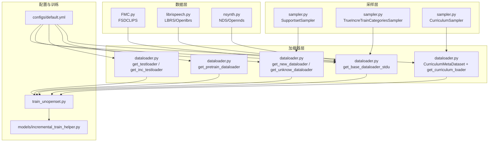
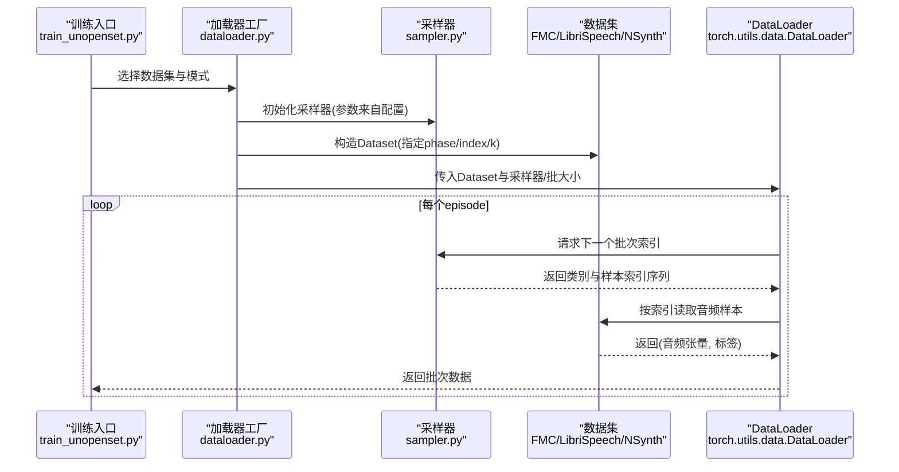
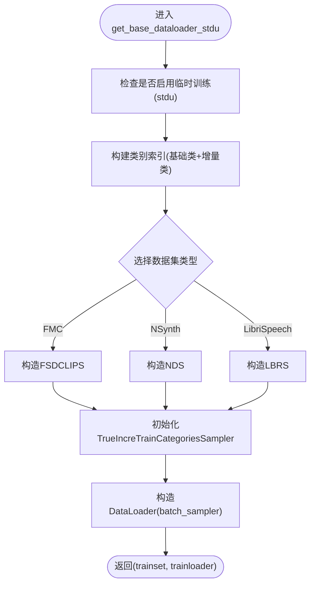
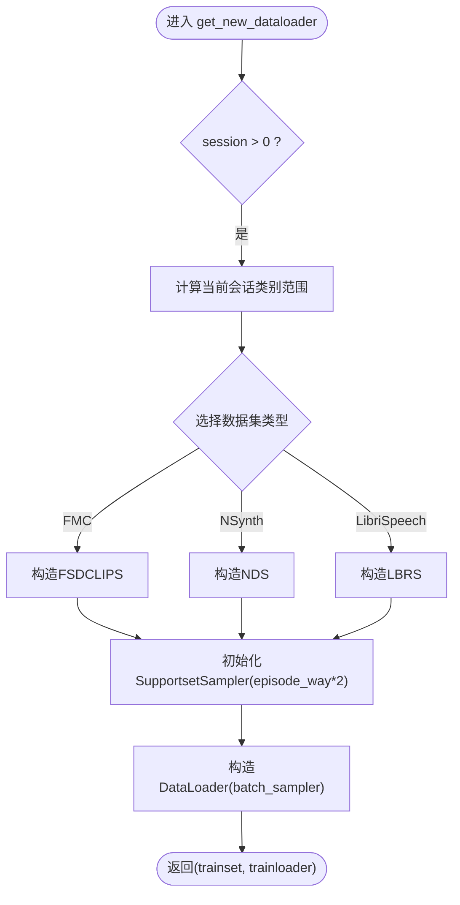
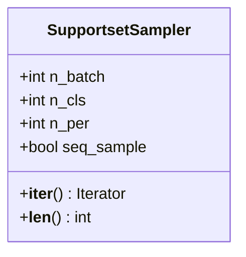
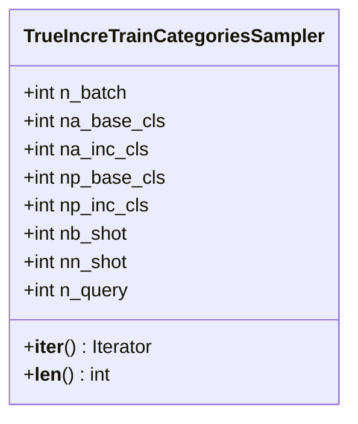
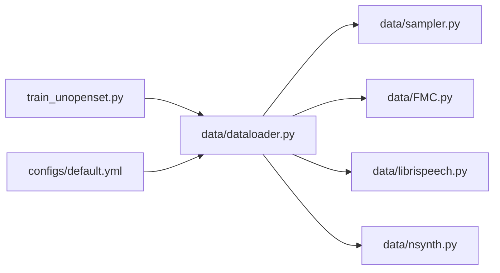

# 数据加载器

<cite>
**本文引用的文件**
- [dataloader.py](file://data/dataloader.py)
- [sampler.py](file://data/sampler.py)
- [FMC.py](file://data/FMC.py)
- [librispeech.py](file://data/librispeech.py)
- [nsynth.py](file://data/nsynth.py)
- [default.yml](file://configs/default.yml)
- [train_unopenset.py](file://train_unopenset.py)
- [incremental_train_helper.py](file://models/incremental_train_helper.py)
</cite>

## 目录
1. [简介](#简介)
2. [项目结构](#项目结构)
3. [核心组件](#核心组件)
4. [架构总览](#架构总览)
5. [详细组件分析](#详细组件分析)
6. [依赖关系分析](#依赖关系分析)
7. [性能考量](#性能考量)
8. [故障排除指南](#故障排除指南)
9. [结论](#结论)
10. [附录](#附录)

## 简介
本文件面向VAZE项目的“数据加载器系统”，系统性梳理了基础训练加载器、增量学习加载器、测试加载器与课程学习加载器的实现与工作机制，重点解析SupportsetSampler与TrueIncreTrainCategoriesSampler两类采样器的采样策略与批处理逻辑，说明数据并行与随机种子控制，给出配置项与性能优化建议，并提供使用示例与常见问题排查方法。目标读者既包括需要快速上手的使用者，也包括希望深入理解实现细节的开发者。

## 项目结构
数据加载器相关代码主要位于data目录，配合configs中的默认配置以及训练脚本使用：
- data/dataloader.py：统一的数据加载器入口与各类加载器工厂函数
- data/sampler.py：支持多种采样策略的采样器集合
- data/FMC.py、data/librispeech.py、data/nsynth.py：不同数据集的Dataset实现
- configs/default.yml：训练参数与数据加载器配置
- train_unopenset.py：训练入口，展示如何装配数据加载器
- models/incremental_train_helper.py：增量训练阶段对加载器输出的切片与处理

图表来源
- [dataloader.py:134-168](file://data/dataloader.py#L134-L168)
- [dataloader.py:206-230](file://data/dataloader.py#L206-L230)
- [dataloader.py:263-351](file://data/dataloader.py#L263-L351)
- [sampler.py:97-141](file://data/sampler.py#L97-L141)
- [sampler.py:38-94](file://data/sampler.py#L38-L94)
- [sampler.py:141-201](file://data/sampler.py#L141-L201)
- [FMC.py:21-102](file://data/FMC.py#L21-L102)
- [librispeech.py:21-80](file://data/librispeech.py#L21-L80)
- [nsynth.py:21-110](file://data/nsynth.py#L21-L110)
- [default.yml:50-65](file://configs/default.yml#L50-L65)
- [train_unopenset.py:162-178](file://train_unopenset.py#L162-L178)
- [incremental_train_helper.py:33-92](file://models/incremental_train_helper.py#L33-L92)

章节来源
- [dataloader.py:13-132](file://data/dataloader.py#L13-L132)
- [sampler.py:6-201](file://data/sampler.py#L6-L201)
- [FMC.py:21-102](file://data/FMC.py#L21-L102)
- [librispeech.py:21-80](file://data/librispeech.py#L21-L80)
- [nsynth.py:21-110](file://data/nsynth.py#L21-L110)
- [default.yml:50-65](file://configs/default.yml#L50-L65)
- [train_unopenset.py:162-178](file://train_unopenset.py#L162-L178)
- [incremental_train_helper.py:33-92](file://models/incremental_train_helper.py#L33-L92)

## 核心组件
- 加载器工厂函数
  - 基础训练加载器：get_base_dataloader_stdu，使用TrueIncreTrainCategoriesSampler进行元训练批次组织
  - 新会话加载器：get_new_dataloader、get_unknow_dataloader，使用SupportsetSampler组织当前会话支持集与查询集
  - 测试加载器：get_testloader、get_inc_testloader，按已遇类别或当前会话类别构建测试集
  - 预训练加载器：get_pretrain_dataloader，用于基线阶段的训练/验证
  - 课程学习加载器：CurriculumMetaDataset + get_curriculum_loader，支持Easy→Medium→Hard的课程学习
- 采样器
  - SupportsetSampler：固定类别数量与每类样本数，支持顺序采样与随机采样
  - TrueIncreTrainCategoriesSampler：同时采样基础类与新类，控制每类支持/查询样本数
  - CurriculumSampler：动态更新可采样类别池，实现课程学习
- 数据集
  - FSDCLIPS、LBRS/Openlbrs、NDS/Opennds：分别对应FMC、LibriSpeech、NSynth数据集的训练/测试/开放集封装

章节来源
- [dataloader.py:134-254](file://data/dataloader.py#L134-L254)
- [sampler.py:97-141](file://data/sampler.py#L97-L141)
- [sampler.py:38-94](file://data/sampler.py#L38-L94)
- [sampler.py:141-201](file://data/sampler.py#L141-L201)
- [FMC.py:21-102](file://data/FMC.py#L21-L102)
- [librispeech.py:21-80](file://data/librispeech.py#L21-L80)
- [nsynth.py:21-110](file://data/nsynth.py#L21-L110)

## 架构总览
下图展示了数据加载器在训练流程中的关键交互：训练入口根据配置选择数据集与加载器，采样器决定每个批次的样本索引序列，DataLoader按批次索引读取音频并返回张量；增量训练阶段还会对批次输出进行切片与原型计算。

图表来源
- [dataloader.py:134-168](file://data/dataloader.py#L134-L168)
- [dataloader.py:206-230](file://data/dataloader.py#L206-L230)
- [sampler.py:97-141](file://data/sampler.py#L97-L141)
- [FMC.py:21-102](file://data/FMC.py#L21-L102)
- [librispeech.py:21-80](file://data/librispeech.py#L21-L80)
- [nsynth.py:21-110](file://data/nsynth.py#L21-L110)

## 详细组件分析

### 基础训练加载器（get_base_dataloader_stdu）
- 目标：构造基础会话的训练集与DataLoader，使用TrueIncreTrainCategoriesSampler组织批次
- 关键点
  - 支持临时训练配置（stdu）与常规配置切换
  - 同时采样基础类与增量类，控制每类支持/查询样本数
  - 使用batch_sampler而非batch_size，确保每个episode内类别与样本数严格符合元训练规范
- 输出：trainset与trainloader，供后续模型训练使用

图表来源
- [dataloader.py:134-168](file://data/dataloader.py#L134-L168)
- [sampler.py:38-94](file://data/sampler.py#L38-L94)

章节来源
- [dataloader.py:134-168](file://data/dataloader.py#L134-L168)
- [sampler.py:38-94](file://data/sampler.py#L38-L94)

### 新会话加载器（get_new_dataloader / get_unknow_dataloader）
- 目标：为增量会话构造支持集与查询集，支持已遇类别与未知类别
- 关键点
  - SupportsetSampler固定n_cls与n_per，保证每个episode内支持/查询样本数一致
  - 支持顺序采样（seq_sample）以复现实验一致性
  - 未知类别加载器仅使用部分类别，便于评估开放集性能
- 输出：trainset与trainloader

图表来源
- [dataloader.py:206-230](file://data/dataloader.py#L206-L230)
- [sampler.py:97-141](file://data/sampler.py#L97-L141)

章节来源
- [dataloader.py:206-230](file://data/dataloader.py#L206-L230)
- [sampler.py:97-141](file://data/sampler.py#L97-L141)

### 测试加载器（get_testloader / get_inc_testloader）
- 目标：按已遇类别或当前会话类别构建测试集，返回testset与testloader
- 关键点
  - get_testloader：测试所有已遇类别（包含基础类与历史增量类）
  - get_inc_testloader：仅测试当前会话新增类别
  - 批大小与并行参数来自配置，确保测试稳定性

章节来源
- [dataloader.py:57-106](file://data/dataloader.py#L57-L106)

### 预训练加载器（get_pretrain_dataloader）
- 目标：构造基线预训练阶段的训练/验证集
- 关键点
  - 基于base_sess参数选择不同数据组合
  - 使用固定批大小与shuffle=True，适合标准监督训练

章节来源
- [dataloader.py:108-132](file://data/dataloader.py#L108-L132)

### 课程学习加载器（CurriculumMetaDataset + get_curriculum_loader）
- 目标：支持Easy→Medium→Hard的课程学习，将已知、当前与未知三类数据整合到单个Episode
- 关键点
  - CurriculumMetaDataset按Easy/Medium/Hard三段索引采样，返回支持集、查询集与开放集
  - get_curriculum_loader返回DataLoader，batch_size=1，由Dataset内部控制Episode长度

章节来源
- [dataloader.py:263-351](file://data/dataloader.py#L263-L351)
- [sampler.py:141-201](file://data/sampler.py#L141-L201)

### 采样策略详解

#### SupportsetSampler
- 作用：在给定类别集合中，对每类采样固定数量样本，形成支持/查询批次
- 特性
  - n_cls：每episode采样的类别数
  - n_per：每类采样样本数
  - seq_sample：是否顺序采样（固定顺序，便于复现）
  - 通过转置堆叠保证标签顺序为abcdabcd…而非连续块
- 复杂度
  - 时间复杂度：O(episode_way × episode_shot)，空间复杂度：O(episode_way × episode_shot)

图表来源
- [sampler.py:97-141](file://data/sampler.py#L97-L141)

章节来源
- [sampler.py:97-141](file://data/sampler.py#L97-L141)

#### TrueIncreTrainCategoriesSampler
- 作用：同时采样基础类与增量类，控制每类支持/查询样本数，适配元训练场景
- 特性
  - na_base_cls/na_inc_cls：基础类与增量类总数
  - np_base_cls/np_inc_cls：每轮采样的基础类与增量类数量
  - nb_shot/nn_shot：基础类与增量类的support样本数
  - n_query：每类query样本数
  - 将基础类与增量类批次拼接，形成单一batch
- 复杂度
  - 时间复杂度：O((np_base_cls×(nb_shot+n_query)) + (np_inc_cls×(nn_shot+n_query)))

图表来源
- [sampler.py:38-94](file://data/sampler.py#L38-L94)

章节来源
- [sampler.py:38-94](file://data/sampler.py#L38-L94)

#### CurriculumSampler
- 作用：动态更新可采样类别池，实现从易到难的课程学习
- 特性
  - set_active_classes：更新当前可用类别集合
  - 若可用类别不足n_cls，则随机填充或重复选择
  - 与CurriculumMetaDataset配合，将Easy/Medium/Hard三段数据整合

章节来源
- [sampler.py:141-201](file://data/sampler.py#L141-L201)

### 批处理策略与数据并行
- 批处理策略
  - 基础/增量加载器使用batch_sampler，避免shuffle打乱类别与样本的对应关系
  - 测试加载器使用固定batch_size与shuffle=False，确保结果可复现
- 并行与内存
  - DataLoader配置num_workers与pin_memory，提升I/O吞吐
  - worker_init_fn与全局Generator确保多进程随机性可控
- 增量训练切片
  - 增量训练Helper对DataLoader输出进行切片，区分基础类与新类的support/query

章节来源
- [dataloader.py:13-18](file://data/dataloader.py#L13-L18)
- [dataloader.py:128-132](file://data/dataloader.py#L128-L132)
- [dataloader.py:158-164](file://data/dataloader.py#L158-L164)
- [dataloader.py:222-227](file://data/dataloader.py#L222-L227)
- [incremental_train_helper.py:33-92](file://models/incremental_train_helper.py#L33-L92)

## 依赖关系分析
- 组件耦合
  - dataloader.py依赖sampler.py提供的采样器
  - dataloader.py依赖各数据集的Dataset实现
  - 训练入口train_unopenset.py通过import data.dataloader使用加载器工厂
- 外部依赖
  - PyTorch DataLoader与Generator
  - 配置文件default.yml提供参数来源

图表来源
- [dataloader.py:1-4](file://data/dataloader.py#L1-L4)
- [default.yml:50-65](file://configs/default.yml#L50-L65)
- [train_unopenset.py:13-13](file://train_unopenset.py#L13-L13)

章节来源
- [dataloader.py:1-4](file://data/dataloader.py#L1-L4)
- [default.yml:50-65](file://configs/default.yml#L50-L65)
- [train_unopenset.py:13-13](file://train_unopenset.py#L13-L13)

## 性能考量
- 并行与I/O
  - num_workers建议与CPU核心数匹配，避免过多导致上下文切换开销
  - pin_memory在GPU训练时可减少数据搬运延迟
- 随机性与可复现
  - 使用worker_init_fn与全局Generator，确保多进程随机性一致
  - 固定随机种子有助于实验复现
- 批次组织
  - 使用batch_sampler可避免不必要的shuffle，提高元训练批次的一致性
- 数据集规模
  - 对于大规模数据集，优先使用索引映射与缓存策略，减少磁盘访问

[本节为通用指导，无需特定文件来源]

## 故障排除指南
- DataLoader无法启动或卡死
  - 检查num_workers与pin_memory设置，必要时降低num_workers或关闭pin_memory
  - 确认worker_init_fn与Generator配置正确
- 样本标签顺序异常
  - 确认使用batch_sampler而非batch_size，避免shuffle打乱类别顺序
  - 检查采样器是否正确实现转置堆叠逻辑
- 增量训练切片错误
  - 对照incremental_train_helper中的索引切片逻辑，确认support/query边界
- 测试结果不稳定
  - 检查测试加载器的shuffle=False与固定批大小
  - 确认测试阶段未混入训练数据

章节来源
- [dataloader.py:13-18](file://data/dataloader.py#L13-L18)
- [dataloader.py:128-132](file://data/dataloader.py#L128-L132)
- [dataloader.py:158-164](file://data/dataloader.py#L158-L164)
- [incremental_train_helper.py:33-92](file://models/incremental_train_helper.py#L33-L92)

## 结论
VAZE项目的数据加载器系统围绕元训练与增量学习需求，提供了灵活且可扩展的加载器工厂与采样器集合。通过SupportsetSampler与TrueIncreTrainCategoriesSampler，系统能够稳定地组织支持/查询批次；结合课程学习采样器与课程学习数据集，进一步支持从易到难的学习路径。配合合理的并行与随机性控制，可在保证性能的同时提升实验可复现性。

[本节为总结，无需特定文件来源]

## 附录

### 配置选项与含义（来自default.yml）
- 训练与会话
  - train.way/shot：基础会话的way与shot
  - train.num_session/num_base/num_novel/num_all：会话数与类别分布
  - train.start_session/test_times：起始会话与测试次数
- 元训练参数
  - episode.train_episode/episode_way/episode_shot/episode_query：元训练episode数与每类样本数
  - episode.low_way/low_shot：低阶任务的way与shot
- 数据加载器
  - dataloader.num_workers/train_batch_size/test_batch_size：并行与批大小
- 其他
  - extractor：音频特征提取参数

章节来源
- [default.yml:1-88](file://configs/default.yml#L1-L88)

### 实际使用示例（步骤说明）
- 选择数据集与根目录
  - 在训练入口中设置dataset与dataroot
- 构造基础训练加载器
  - 调用get_base_dataloader_stdu，得到trainset与trainloader
- 构造增量会话加载器
  - 调用get_new_dataloader或get_unknow_dataloader，传入session编号
- 构造测试加载器
  - 调用get_testloader或get_inc_testloader，按需选择测试类别范围
- 增量训练切片
  - 在训练循环中按索引切分support/query，分别送入模型

章节来源
- [train_unopenset.py:162-178](file://train_unopenset.py#L162-L178)
- [dataloader.py:134-254](file://data/dataloader.py#L134-L254)
- [incremental_train_helper.py:33-92](file://models/incremental_train_helper.py#L33-L92)