# 数据处理系统

<cite>
**本文档引用的文件**
- [FMC.py](file://data/FMC.py)
- [nsynth.py](file://data/nsynth.py)
- [librispeech.py](file://data/librispeech.py)
- [dataloader.py](file://data/dataloader.py)
- [sampler.py](file://data/sampler.py)
- [default.yml](file://configs/default.yml)
- [audio_augment.py](file://utils/audio_augment.py)
- [librispeech_enhance.py](file://librispeech_enhance.py)
- [network.py](file://network.py)
- [train_openset_vaze.py](file://train_openset_vaze.py)
</cite>

## 目录
1. [简介](#简介)
2. [项目结构](#项目结构)
3. [核心组件](#核心组件)
4. [架构概览](#架构概览)
5. [详细组件分析](#详细组件分析)
6. [依赖关系分析](#依赖关系分析)
7. [性能考虑](#性能考虑)
8. [故障排除指南](#故障排除指南)
9. [结论](#结论)
10. [附录](#附录)

## 简介

VAZE项目的数据处理系统是一个专为少样本学习和开放集识别设计的音频数据处理框架。该系统支持多种音频数据集，包括FMC、NSynth和LibriSpeech，并提供了完整的数据加载、采样、特征提取和批处理机制。

系统的核心特点：
- 多数据集支持：统一的数据集接口设计，支持FMC、NSynth、LibriSpeech等多种音频数据集
- 元学习数据流：专门为少样本学习设计的episode采样机制
- 特征提取：基于Mel频谱图的音频特征提取管道
- 数据增强：可配置的音频数据增强技术
- 批处理优化：高效的批处理和内存管理机制

## 项目结构

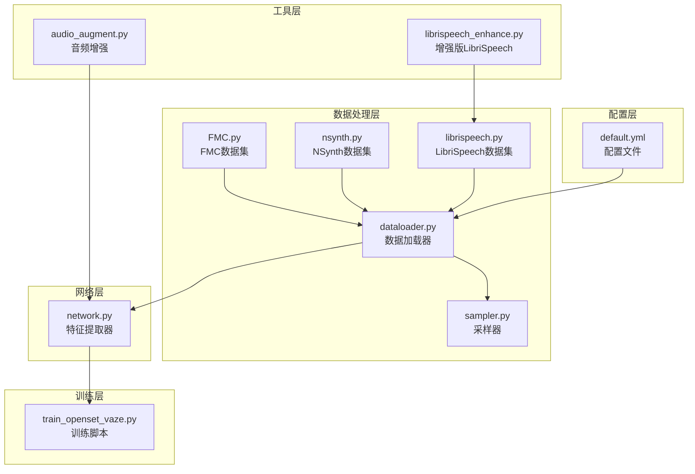

**图表来源**
- [FMC.py:1-367](file://data/FMC.py#L1-L367)
- [nsynth.py:1-287](file://data/nsynth.py#L1-L287)
- [librispeech.py:1-278](file://data/librispeech.py#L1-L278)
- [dataloader.py:1-351](file://data/dataloader.py#L1-L351)
- [sampler.py:1-201](file://data/sampler.py#L1-L201)

**章节来源**
- [FMC.py:1-367](file://data/FMC.py#L1-L367)
- [nsynth.py:1-287](file://data/nsynth.py#L1-L287)
- [librispeech.py:1-278](file://data/librispeech.py#L1-L278)
- [dataloader.py:1-351](file://data/dataloader.py#L1-L351)
- [sampler.py:1-201](file://data/sampler.py#L1-L201)

## 核心组件

### 数据集类架构

系统采用统一的数据集接口设计，所有数据集都继承自PyTorch的Dataset基类：

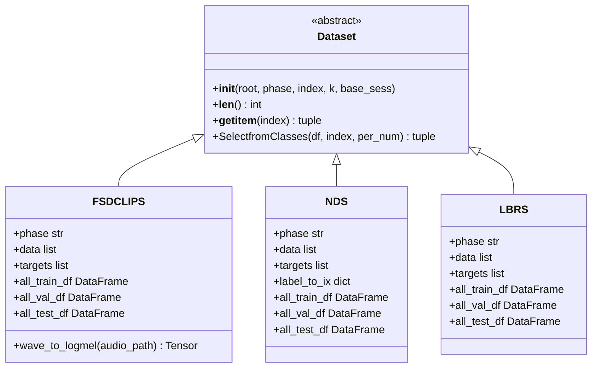

**图表来源**
- [FMC.py:21-102](file://data/FMC.py#L21-L102)
- [nsynth.py:21-109](file://data/nsynth.py#L21-L109)
- [librispeech.py:21-79](file://data/librispeech.py#L21-L79)

### 元学习采样器

系统实现了多种采样器以支持不同的训练模式：

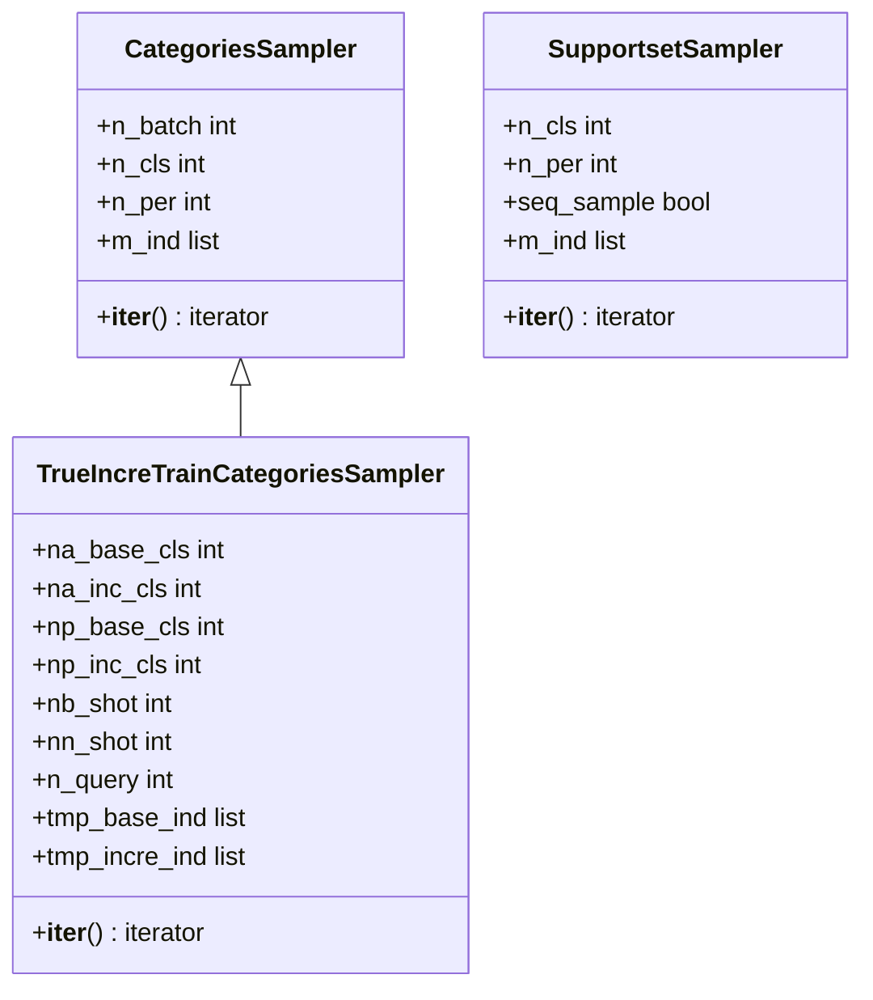

**图表来源**
- [sampler.py:6-36](file://data/sampler.py#L6-L36)
- [sampler.py:38-93](file://data/sampler.py#L38-L93)
- [sampler.py:97-140](file://data/sampler.py#L97-L140)

**章节来源**
- [FMC.py:21-102](file://data/FMC.py#L21-L102)
- [nsynth.py:21-109](file://data/nsynth.py#L21-L109)
- [librispeech.py:21-79](file://data/librispeech.py#L21-L79)
- [sampler.py:1-201](file://data/sampler.py#L1-L201)

## 架构概览

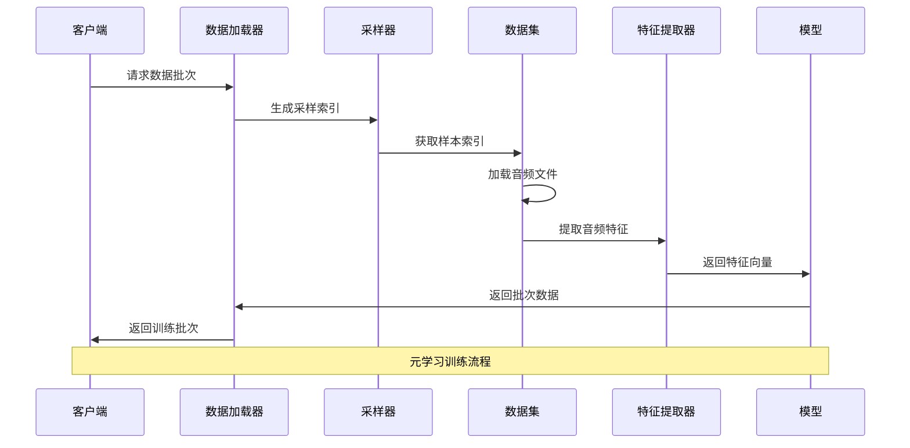

**图表来源**
- [dataloader.py:134-168](file://data/dataloader.py#L134-L168)
- [network.py:461-485](file://network.py#L461-L485)

## 详细组件分析

### FMC数据集处理

FMC（FSD-MIX-CLIPS）数据集提供了89个音频分类任务，支持基础会话和增量会话两种模式：

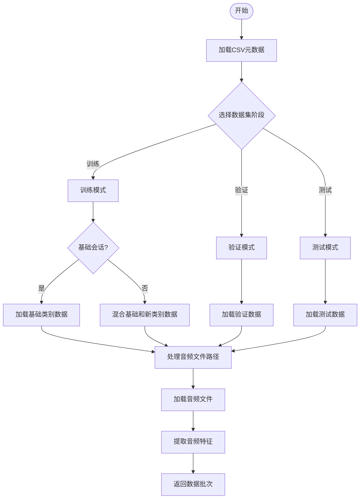

**图表来源**
- [FMC.py:35-56](file://data/FMC.py#L35-L56)
- [FMC.py:57-90](file://data/FMC.py#L57-L90)

**章节来源**
- [FMC.py:21-102](file://data/FMC.py#L21-L102)
- [FMC.py:116-150](file://data/FMC.py#L116-L150)

### NSynth数据集处理

NSynth数据集专注于乐器声音分类，提供了100个乐器类别：

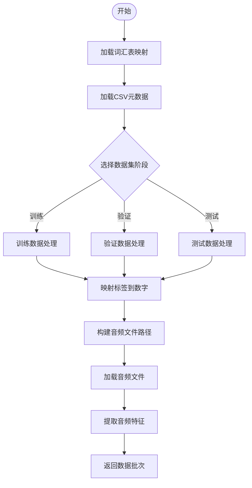

**图表来源**
- [nsynth.py:34-36](file://data/nsynth.py#L34-L36)
- [nsynth.py:76-78](file://data/nsynth.py#L76-L78)

**章节来源**
- [nsynth.py:21-109](file://data/nsynth.py#L21-L109)
- [nsynth.py:160-272](file://data/nsynth.py#L160-L272)

### LibriSpeech数据集处理

LibriSpeech数据集处理了大规模语音识别数据，支持增量学习场景：

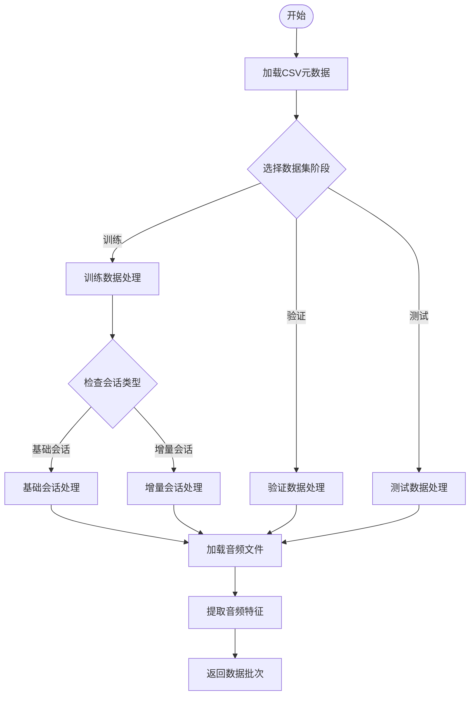

**图表来源**
- [librispeech.py:35-54](file://data/librispeech.py#L35-L54)
- [librispeech.py:125-141](file://data/librispeech.py#L125-L141)

**章节来源**
- [librispeech.py:21-79](file://data/librispeech.py#L21-L79)
- [librispeech.py:82-263](file://data/librispeech.py#L82-L263)

### 数据加载器实现

数据加载器提供了灵活的批量处理机制，支持不同的训练模式：

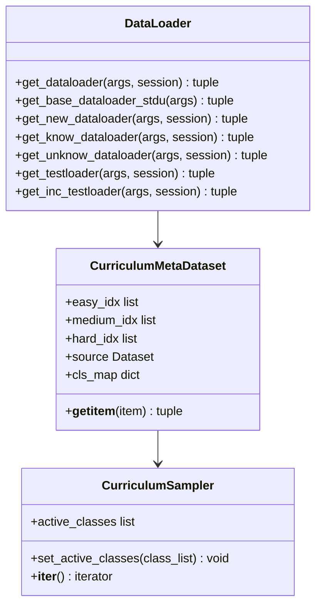

**图表来源**
- [dataloader.py:134-168](file://data/dataloader.py#L134-L168)
- [dataloader.py:263-346](file://data/dataloader.py#L263-L346)
- [dataloader.py:140-254](file://data/dataloader.py#L140-L254)

**章节来源**
- [dataloader.py:1-351](file://data/dataloader.py#L1-L351)

### 采样策略

系统实现了多种采样策略以适应不同的训练需求：

#### 基础采样器
基础采样器支持标准的少样本学习采样模式：

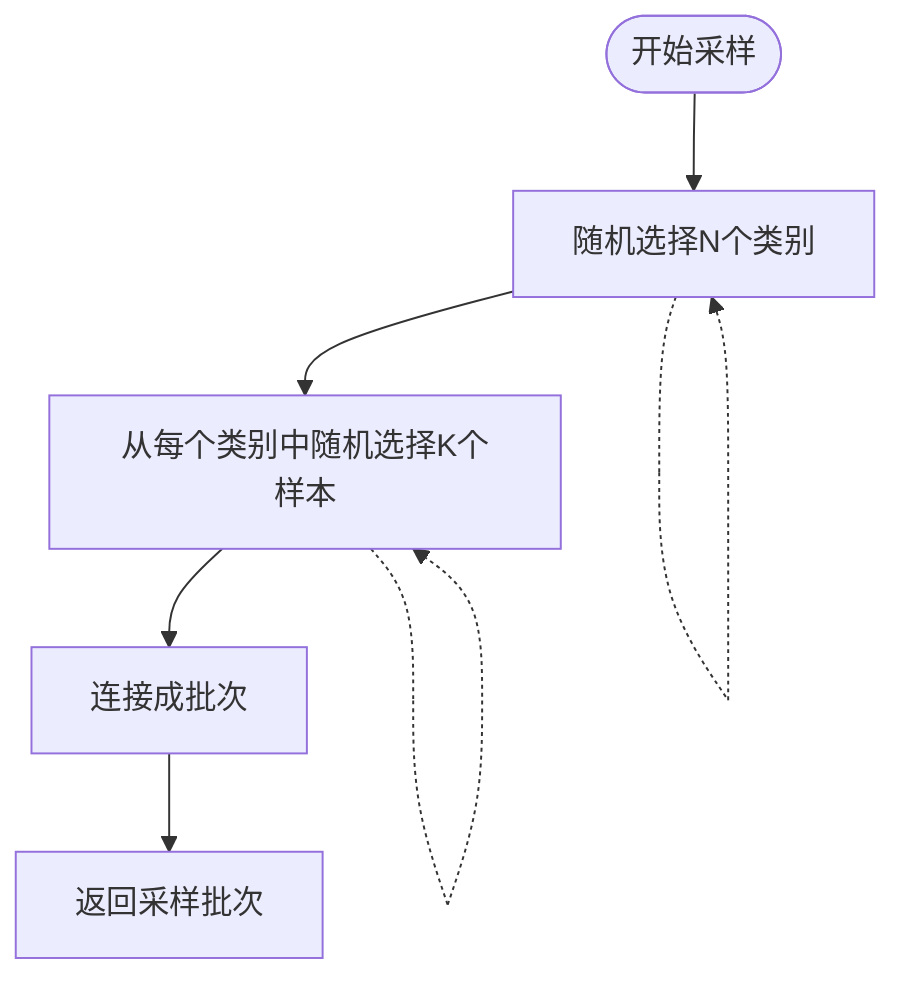

#### 增量采样器
增量采样器支持增量学习场景：

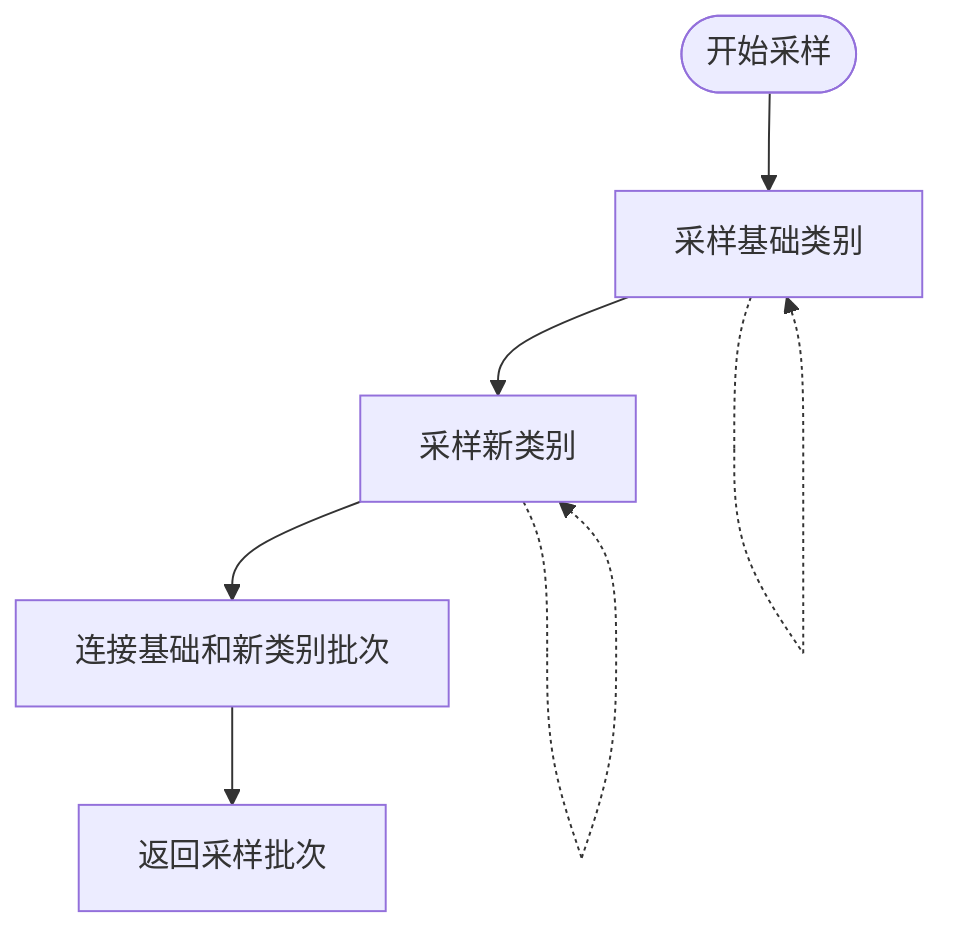

**图表来源**
- [sampler.py:23-36](file://data/sampler.py#L23-L36)
- [sampler.py:70-93](file://data/sampler.py#L70-L93)

**章节来源**
- [sampler.py:1-201](file://data/sampler.py#L1-L201)

### 特征提取流程

系统提供了完整的音频特征提取管道：

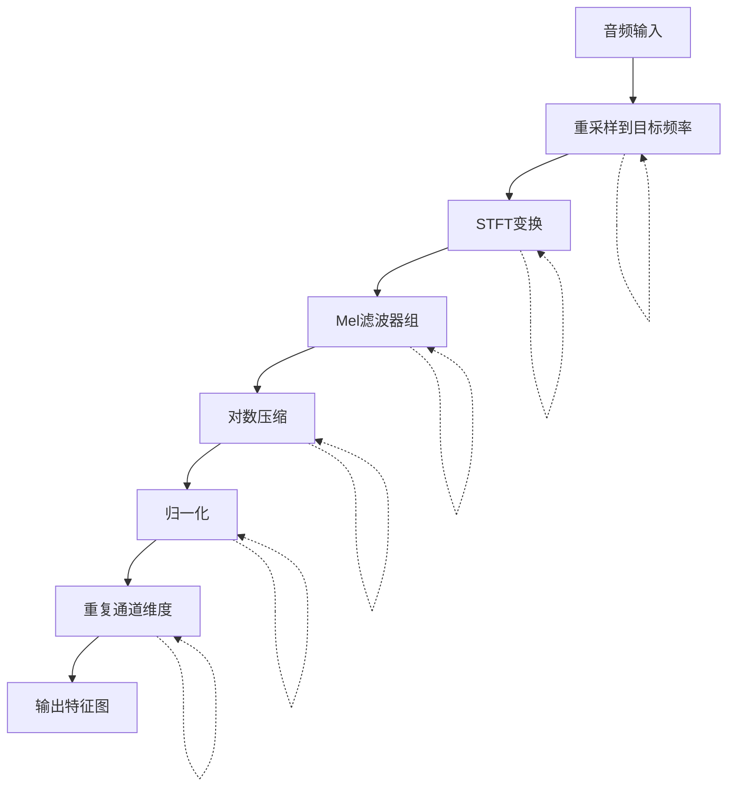

**图表来源**
- [network.py:461-485](file://network.py#L461-L485)
- [FMC.py:116-150](file://data/FMC.py#L116-L150)

**章节来源**
- [network.py:330-529](file://network.py#L330-L529)
- [FMC.py:116-150](file://data/FMC.py#L116-L150)

### 数据增强技术

系统实现了多种音频数据增强技术：

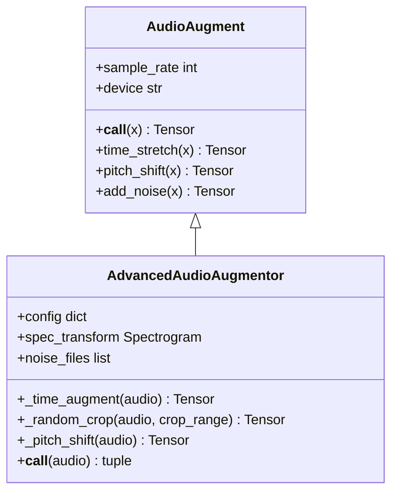

**图表来源**
- [audio_augment.py:4-31](file://utils/audio_augment.py#L4-L31)
- [librispeech_enhance.py:17-133](file://librispeech_enhance.py#L17-L133)

**章节来源**
- [audio_augment.py:1-31](file://utils/audio_augment.py#L1-L31)
- [librispeech_enhance.py:17-133](file://librispeech_enhance.py#L17-L133)

## 依赖关系分析

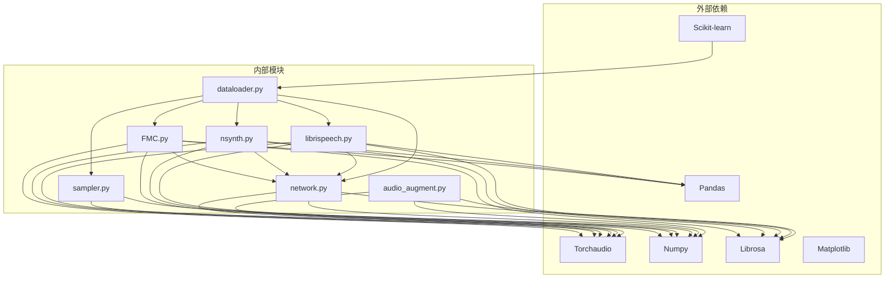

**图表来源**
- [FMC.py:1-20](file://data/FMC.py#L1-L20)
- [nsynth.py:1-18](file://data/nsynth.py#L1-L18)
- [librispeech.py:1-18](file://data/librispeech.py#L1-L18)
- [dataloader.py:1-5](file://data/dataloader.py#L1-L5)
- [sampler.py:1-5](file://data/sampler.py#L1-L5)
- [network.py:1-5](file://network.py#L1-L5)
- [audio_augment.py:1-4](file://utils/audio_augment.py#L1-L4)

**章节来源**
- [FMC.py:1-367](file://data/FMC.py#L1-L367)
- [nsynth.py:1-287](file://data/nsynth.py#L1-L287)
- [librispeech.py:1-278](file://data/librispeech.py#L1-L278)
- [dataloader.py:1-351](file://data/dataloader.py#L1-L351)
- [sampler.py:1-201](file://data/sampler.py#L1-L201)
- [network.py:1-724](file://network.py#L1-L724)
- [audio_augment.py:1-31](file://utils/audio_augment.py#L1-L31)

## 性能考虑

### 内存优化

系统采用了多种内存优化策略：

1. **批处理优化**：使用`pin_memory=True`减少GPU内存拷贝
2. **数据预加载**：通过`num_workers`参数并行加载数据
3. **特征缓存**：Mel频谱图特征在内存中复用
4. **采样器优化**：避免不必要的数据复制

### 训练效率

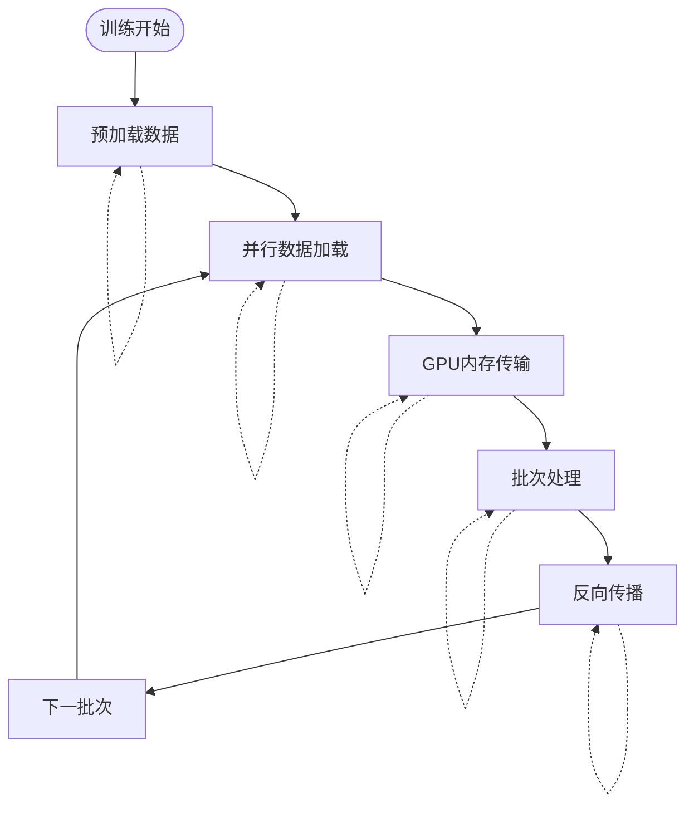

### 并行处理

系统充分利用了多核CPU和GPU资源：

- **数据加载并行**：`num_workers=8`并行加载音频文件
- **GPU加速**：音频特征提取在GPU上执行
- **内存管理**：自动垃圾回收和内存池管理

## 故障排除指南

### 常见问题及解决方案

#### 数据集路径错误
**问题**：无法找到音频文件路径
**解决方案**：
1. 检查`dataroot`配置是否正确
2. 验证CSV元数据文件中的路径格式
3. 确认音频文件权限设置

#### 内存不足
**问题**：训练过程中出现内存溢出
**解决方案**：
1. 减少`batch_size`参数
2. 降低`num_workers`数量
3. 使用更小的音频片段长度

#### 采样器错误
**问题**：采样器抛出异常
**解决方案**：
1. 检查类别数量是否足够
2. 验证`n_cls`和`n_per`参数设置
3. 确认数据集中有足够的样本

**章节来源**
- [dataloader.py:134-168](file://data/dataloader.py#L134-L168)
- [sampler.py:97-140](file://data/sampler.py#L97-L140)

## 结论

VAZE项目的数据处理系统是一个功能完整、设计合理的音频数据处理框架。系统的主要优势包括：

1. **模块化设计**：清晰的组件分离，易于维护和扩展
2. **多数据集支持**：统一接口支持多种音频数据集
3. **高效性能**：优化的内存管理和并行处理机制
4. **灵活配置**：丰富的配置选项适应不同应用场景

系统在少样本学习和开放集识别任务中表现出色，为音频领域的研究和应用提供了坚实的基础。

## 附录

### 配置参数说明

| 参数 | 类型 | 默认值 | 描述 |
|------|------|--------|------|
| `way` | int | 5 | 少样本学习中的类别数 |
| `shot` | int | 5 | 每个类别的样本数 |
| `num_session` | int | 5 | 增量学习会话数 |
| `num_base` | int | 80 | 基础类别数 |
| `num_novel` | int | 20 | 新类别数 |
| `num_workers` | int | 8 | 数据加载并行数 |
| `train_batch_size` | int | 128 | 训练批次大小 |
| `test_batch_size` | int | 100 | 测试批次大小 |

### 扩展指南

#### 添加新的数据集
1. 继承`Dataset`基类
2. 实现`__init__`、`__len__`、`__getitem__`方法
3. 实现`SelectfromClasses`方法
4. 在`dataloader.py`中注册新数据集

#### 自定义采样器
1. 继承`CategoriesSampler`基类
2. 实现自定义采样逻辑
3. 在`dataloader.py`中使用新采样器

#### 配置优化
1. 调整音频特征提取参数
2. 优化数据增强策略
3. 调整批处理大小和并行度

**章节来源**
- [default.yml:1-88](file://configs/default.yml#L1-L88)
- [dataloader.py:19-46](file://data/dataloader.py#L19-L46)