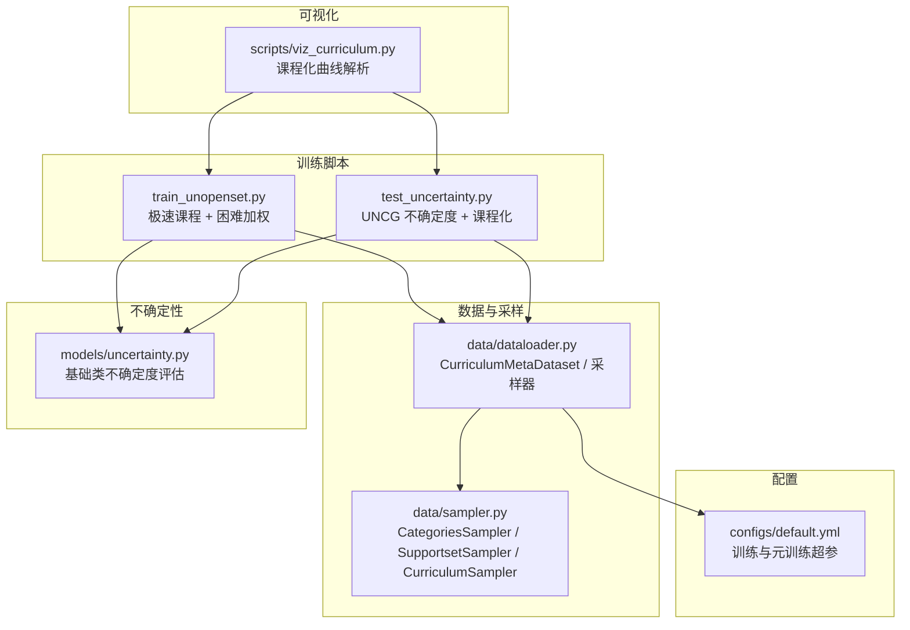
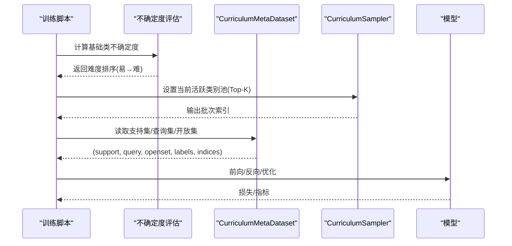
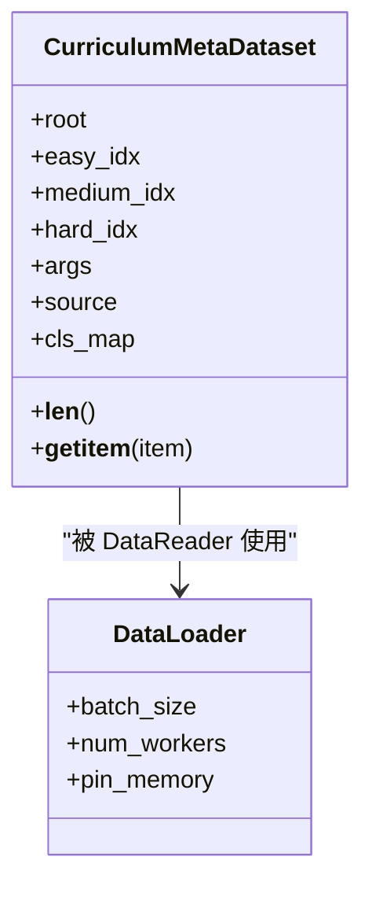
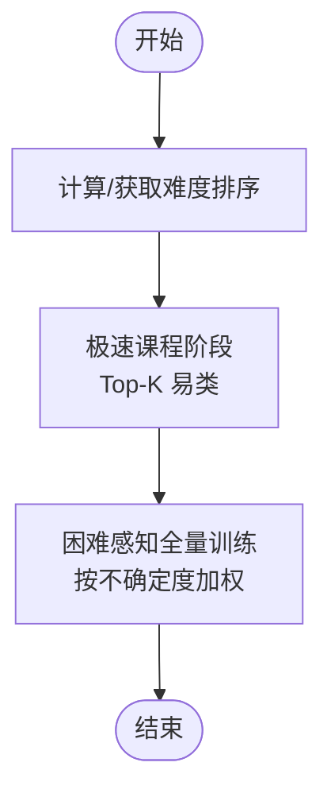
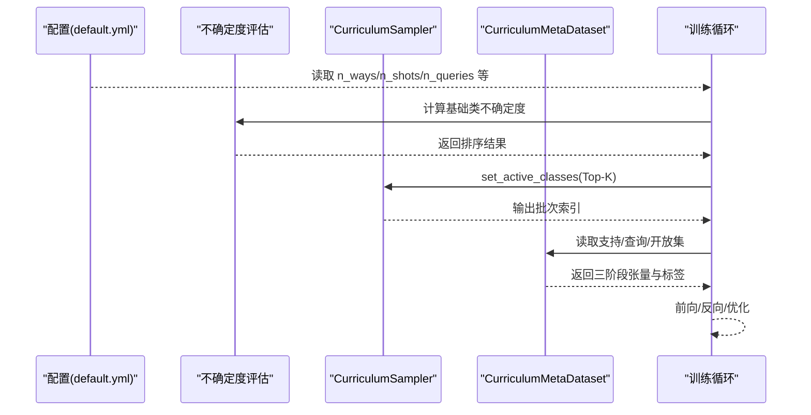
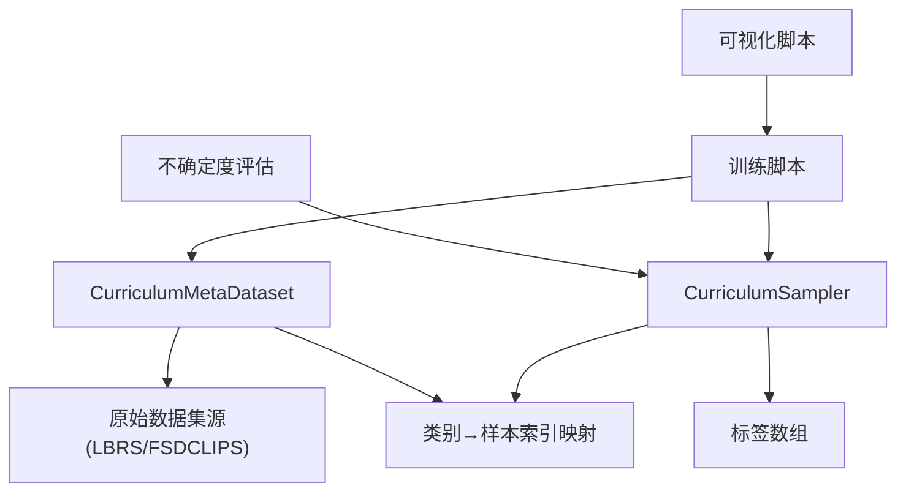

# 课程化学习数据集

<cite>
**本文引用的文件**
- [data/dataloader.py](file://data/dataloader.py)
- [data/sampler.py](file://data/sampler.py)
- [configs/default.yml](file://configs/default.yml)
- [models/uncertainty.py](file://models/uncertainty.py)
- [scripts/viz_curriculum.py](file://scripts/viz_curriculum.py)
- [train_unopenset.py](file://train_unopenset.py)
- [test_uncertainty.py](file://test_uncertainty.py)
</cite>

## 目录
1. [简介](#简介)
2. [项目结构](#项目结构)
3. [核心组件](#核心组件)
4. [架构总览](#架构总览)
5. [详细组件分析](#详细组件分析)
6. [依赖分析](#依赖分析)
7. [性能考量](#性能考量)
8. [故障排查指南](#故障排查指南)
9. [结论](#结论)
10. [附录](#附录)

## 简介
本文件聚焦 VAZE 项目中的“课程化学习数据集”设计与实现，系统阐述 CurriculumMetaDataset 的设计理念、Easy-Medium-Hard 三阶段课程化学习的数据组织方式、课程化采样策略与难度递增机制，并说明已知类（Easy）、当前类（Medium）、未知类（Hard）的处理方式。同时提供课程化训练的配置方法与使用示例，以及性能分析与调优建议。

## 项目结构
围绕课程化学习，本项目的关键文件与职责如下：
- 数据加载与采样：data/dataloader.py 提供 CurriculumMetaDataset 与多种支持采样器；data/sampler.py 提供通用采样器与 CurriculumSampler。
- 配置：configs/default.yml 定义课程化训练常用超参（如 n_ways、n_shots、n_queries 等）。
- 不确定度评估：models/uncertainty.py 提供基础类不确定度计算接口。
- 课程化训练流程：train_unopenset.py 与 test_uncertainty.py 展示课程化训练与难度排序流程。
- 可视化：scripts/viz_curriculum.py 提供课程化训练曲线解析工具。

**图表来源**
- [data/dataloader.py:263-351](file://data/dataloader.py#L263-L351)
- [data/sampler.py:6-201](file://data/sampler.py#L6-L201)
- [configs/default.yml:1-88](file://configs/default.yml#L1-L88)
- [models/uncertainty.py:1-55](file://models/uncertainty.py#L1-L55)
- [train_unopenset.py:604-920](file://train_unopenset.py#L604-L920)
- [test_uncertainty.py:601-674](file://test_uncertainty.py#L601-L674)
- [scripts/viz_curriculum.py:1-88](file://scripts/viz_curriculum.py#L1-L88)

**章节来源**
- [data/dataloader.py:1-351](file://data/dataloader.py#L1-L351)
- [data/sampler.py:1-201](file://data/sampler.py#L1-L201)
- [configs/default.yml:1-88](file://configs/default.yml#L1-L88)
- [models/uncertainty.py:1-55](file://models/uncertainty.py#L1-L55)
- [scripts/viz_curriculum.py:1-88](file://scripts/viz_curriculum.py#L1-L88)
- [train_unopenset.py:604-920](file://train_unopenset.py#L604-L920)
- [test_uncertainty.py:601-674](file://test_uncertainty.py#L601-L674)

## 核心组件
- CurriculumMetaDataset：面向课程化学习的元数据集，将数据划分为 Easy（已知/上下文）、Medium（当前/支持集+查询集）、Hard（未知/开放集拒绝）三块，统一输出支持集、查询集与开放集样本及其标签，便于模型在单一批次中完成三阶段任务。
- CurriculumSampler：支持动态更新“可采样类别池”的采样器，实现 Easy→Medium→Hard 的难度递增。
- 采样器族：SupportsetSampler、TrueIncreTrainCategoriesSampler 等，支撑增量场景与元训练场景的采样需求。
- 不确定度评估：基于模型内置不确定度计算接口，用于课程化难度排序与困难样本加权。

**章节来源**
- [data/dataloader.py:263-351](file://data/dataloader.py#L263-L351)
- [data/sampler.py:141-201](file://data/sampler.py#L141-L201)
- [models/uncertainty.py:5-55](file://models/uncertainty.py#L5-L55)

## 架构总览
课程化学习数据流由“难度排序 → 阶段化训练 → 困难感知加权”构成，数据侧通过 CurriculumMetaDataset 统一组织 Easy/Medium/Hard 三阶段输入，训练侧通过 CurriculumSampler 控制难度递增。

**图表来源**
- [train_unopenset.py:604-920](file://train_unopenset.py#L604-L920)
- [test_uncertainty.py:601-674](file://test_uncertainty.py#L601-L674)
- [data/dataloader.py:263-351](file://data/dataloader.py#L263-L351)
- [data/sampler.py:141-201](file://data/sampler.py#L141-L201)

## 详细组件分析

### CurriculumMetaDataset 设计与实现
- 数据划分
  - Easy：已知类（Memory/Context），通过 base_ids 传递全局类别索引，模型内部以原型方式利用历史知识。
  - Medium：当前类（Support/Query），每类采样 n_shots 个支持样本与 n_queries 个查询样本。
  - Hard：未知类（OpenSet Rejection），仅使用查询样本，标签统一为“未知类”，用于开放集拒绝训练。
- 输出结构
  - 支持集与查询集：分别堆叠为张量，配合连续标签 0..N-1。
  - 开放集：堆叠为张量，标签为 N（表示未知类）。
  - 辅助信息：selected_medium、selected_hard、base_ids，便于模型侧区分三阶段输入。
- 采样策略
  - Medium 类不足时允许重复采样；Hard 类为空时填充占位张量，避免形状不一致。
  - 支持集与查询集的样本数量由 n_shots 与 n_queries 控制；开放集查询数与 n_ways 对齐。

**图表来源**
- [data/dataloader.py:263-351](file://data/dataloader.py#L263-L351)

**章节来源**
- [data/dataloader.py:263-351](file://data/dataloader.py#L263-L351)

### 课程化采样策略与难度递增机制
- CurriculumSampler
  - 维护“活跃类别池”，仅从该池采样，实现 Easy→Medium→Hard 的难度递增。
  - 当活跃类别数不足 n_cls 时，自动回填以满足 episode 组成。
- 课程化训练流程
  - 零样本难度排序：基于特征紧凑性或 UNCG 不确定度对基础类排序。
  - 极速课程阶段：仅训练 Top-K（如 50%、75%）最易类别若干轮。
  - 困难感知全量训练：剩余轮次对全量类别进行不确定度加权训练。

**图表来源**
- [train_unopenset.py:604-920](file://train_unopenset.py#L604-L920)
- [test_uncertainty.py:601-674](file://test_uncertainty.py#L601-L674)
- [data/sampler.py:141-201](file://data/sampler.py#L141-L201)

**章节来源**
- [data/sampler.py:141-201](file://data/sampler.py#L141-L201)
- [train_unopenset.py:604-920](file://train_unopenset.py#L604-L920)
- [test_uncertainty.py:601-674](file://test_uncertainty.py#L601-L674)

### 已知类、当前类、未知类的处理方式
- 已知类（Easy）
  - 通过 base_ids 传递全局类别索引，模型内部以原型方式复用历史知识，不参与当前 episode 的支持/查询采样。
- 当前类（Medium）
  - 从 medium_idx 中随机采样 n_ways 个类别，每类采样 n_shots 个支持样本与 n_queries 个查询样本，标签连续 0..N-1。
- 未知类（Hard）
  - 从 hard_idx 中随机采样 n_ways 个类别，每类采样 n_queries 个查询样本，标签统一为 N（未知类），用于开放集拒绝训练。

**章节来源**
- [data/dataloader.py:290-346](file://data/dataloader.py#L290-L346)

### 课程化训练配置与使用示例
- 基础配置（来自 default.yml）
  - n_ways、n_shots、n_queries：控制元训练与课程化采样规模。
  - num_base、num_session、way：控制基础类数量与增量会话规模。
  - dataloader 参数：num_workers、train_batch_size、test_batch_size。
- 使用步骤
  - 计算基础类不确定度并排序（Easy→Hard）。
  - 设置 CurriculumSampler 的活跃类别池（Top-K）。
  - 使用 CurriculumMetaDataset 组织三阶段输入，进入训练循环。
  - 后期切换为困难感知加权全量训练。

**图表来源**
- [configs/default.yml:1-88](file://configs/default.yml#L1-L88)
- [models/uncertainty.py:5-55](file://models/uncertainty.py#L5-L55)
- [data/sampler.py:141-201](file://data/sampler.py#L141-L201)
- [data/dataloader.py:263-351](file://data/dataloader.py#L263-L351)

**章节来源**
- [configs/default.yml:1-88](file://configs/default.yml#L1-L88)
- [models/uncertainty.py:5-55](file://models/uncertainty.py#L5-L55)
- [data/sampler.py:141-201](file://data/sampler.py#L141-L201)
- [data/dataloader.py:263-351](file://data/dataloader.py#L263-L351)

## 依赖分析
- CurriculumMetaDataset 依赖原始数据集源（LBRS/FSDCLIPS 等）以获取全量样本索引，并通过 cls_map 将类别映射到样本索引列表。
- CurriculumSampler 依赖标签数组，维护类别到样本索引的映射，并在每次迭代中从活跃类别池采样。
- 不确定度评估模块提供基础类不确定度评分，作为课程化难度排序的依据。
- 训练脚本通过 CurriculumSampler 与 CurriculumMetaDataset 协同，实现课程化训练与可视化监控。

**图表来源**
- [data/dataloader.py:263-351](file://data/dataloader.py#L263-L351)
- [data/sampler.py:141-201](file://data/sampler.py#L141-L201)
- [models/uncertainty.py:5-55](file://models/uncertainty.py#L5-L55)
- [scripts/viz_curriculum.py:1-88](file://scripts/viz_curriculum.py#L1-L88)

**章节来源**
- [data/dataloader.py:263-351](file://data/dataloader.py#L263-L351)
- [data/sampler.py:141-201](file://data/sampler.py#L141-L201)
- [models/uncertainty.py:5-55](file://models/uncertainty.py#L5-L55)
- [scripts/viz_curriculum.py:1-88](file://scripts/viz_curriculum.py#L1-L88)

## 性能考量
- 数据加载
  - 使用 pin_memory 与多进程加载（num_workers）提升吞吐；固定随机种子与 worker_init_fn 保证可复现性。
- 采样与批次
  - CurriculumSampler 的活跃类别池可减少无效类别采样，提高 episode 组成效率。
  - SupportsetSampler 的顺序采样（seq_sample）可用于调试与稳定性对比。
- 不确定度评估
  - UNCG 不确定度计算涉及多次前向与掩码增强，建议合理设置 k_dropout 与 a_mask，平衡精度与速度。
- 可视化与日志
  - 使用 viz_curriculum.py 解析日志中的 curriculum_ratio、hard_weight 等指标，辅助观察课程化效果。

**章节来源**
- [data/dataloader.py:10-12](file://data/dataloader.py#L10-L12)
- [data/sampler.py:97-140](file://data/sampler.py#L97-L140)
- [models/uncertainty.py:5-55](file://models/uncertainty.py#L5-L55)
- [scripts/viz_curriculum.py:17-83](file://scripts/viz_curriculum.py#L17-L83)

## 故障排查指南
- 类别不足导致 episode 组不成
  - CurriculumSampler 在活跃类别不足时会自动回填，若仍报错，检查 n_cls 与活跃池大小。
- 开放集为空导致形状不一致
  - CurriculumMetaDataset 在 hard_idx 为空时会填充占位张量，确保模型侧能正确处理。
- 不确定度评估异常
  - 确认模型具备内置不确定度计算接口；检查数据类型与设备一致性。
- 日志解析失败
  - 确认日志中包含 curriculum_ratio、hard_weight 等关键字；路径与文件名正确。

**章节来源**
- [data/sampler.py:161-179](file://data/sampler.py#L161-L179)
- [data/dataloader.py:317-332](file://data/dataloader.py#L317-L332)
- [models/uncertainty.py:5-55](file://models/uncertainty.py#L5-L55)
- [scripts/viz_curriculum.py:27-47](file://scripts/viz_curriculum.py#L27-L47)

## 结论
CurriculumMetaDataset 将 Easy-Medium-Hard 三阶段数据组织为统一的元学习输入，结合 CurriculumSampler 的难度递增机制与不确定度驱动的课程化训练流程，有效提升了模型在增量与开放场景下的学习效率与鲁棒性。通过合理的配置与调优，课程化学习能够在保证稳定性的同时显著缩短收敛时间并提升最终性能。

## 附录
- 关键参数参考
  - n_ways、n_shots、n_queries：控制课程化采样规模。
  - num_base、num_session、way：控制基础类与增量规模。
  - dataloader：num_workers、train_batch_size、test_batch_size。
- 可视化指标
  - curriculum_ratio、hard_weight、center_loss、cls_loss、mc_var 等。

**章节来源**
- [configs/default.yml:1-88](file://configs/default.yml#L1-L88)
- [scripts/viz_curriculum.py:17-24](file://scripts/viz_curriculum.py#L17-L24)