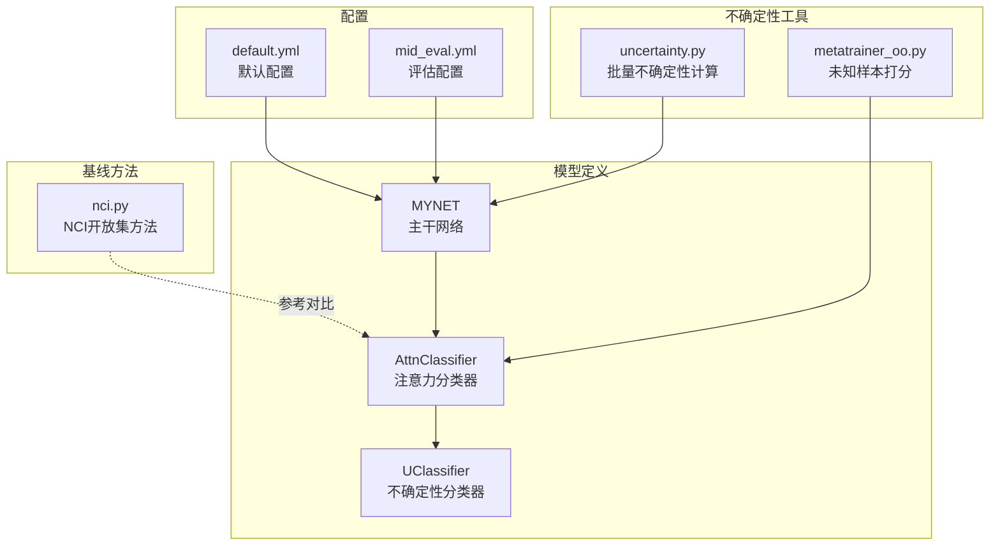
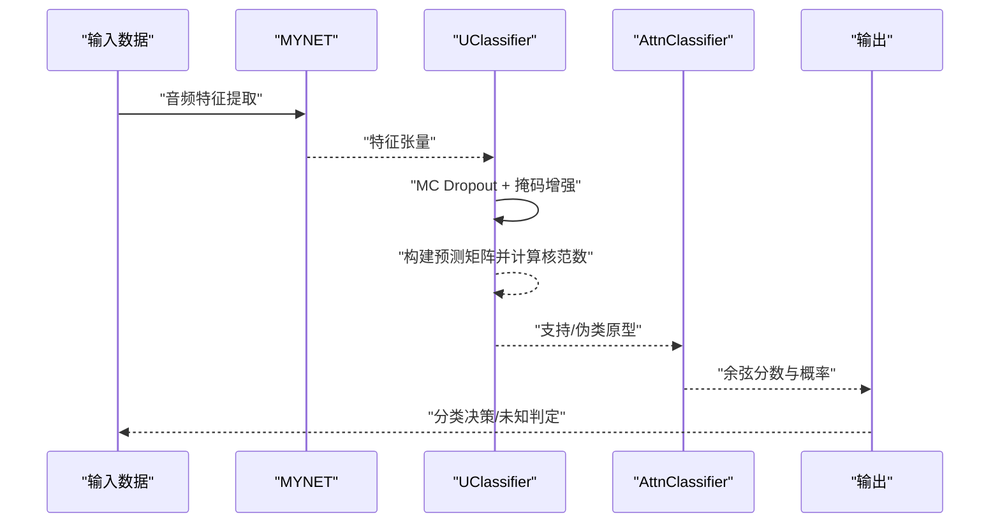
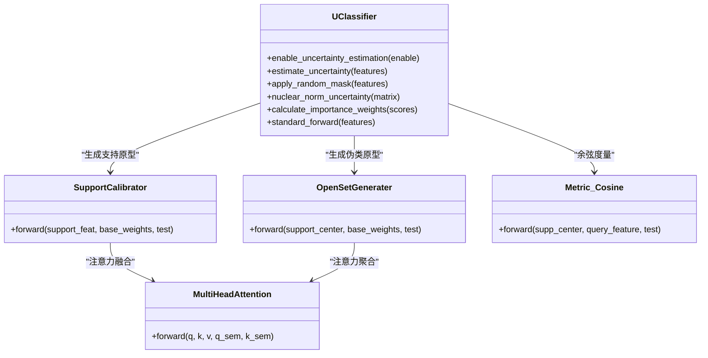
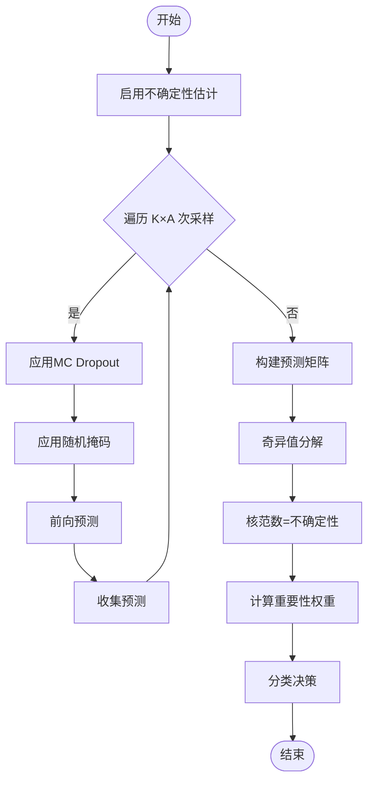
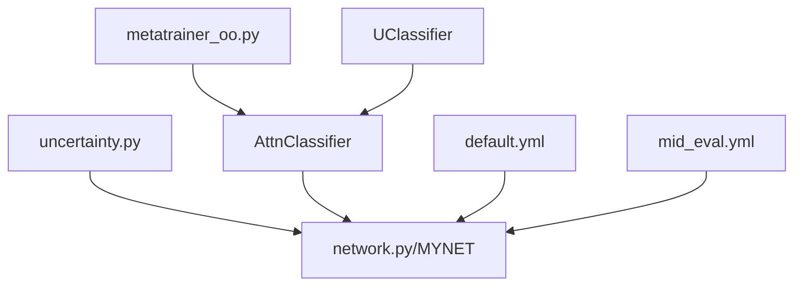

# 不确定性分类器

<cite>
**本文档引用的文件**
- [UClassifier.py](file://models/UClassifier.py)
- [network.py](file://network.py)
- [uncertainty.py](file://models/uncertainty.py)
- [AttnClassifier.py](file://models/AttnClassifier.py)
- [default.yml](file://configs/default.yml)
- [mid_eval.yml](file://configs/mid_eval.yml)
- [nci.py](file://models/baselines/osr_methods/nci.py)
- [metatrainer_oo.py](file://models/metatrainer_oo.py)
- [train_unopenset.py](file://train_unopenset.py)
- [test_uncertainty.py](file://test_uncertainty.py)
- [test.py](file://test.py)
</cite>

## 目录
1. [简介](#简介)
2. [项目结构](#项目结构)
3. [核心组件](#核心组件)
4. [架构总览](#架构总览)
5. [详细组件分析](#详细组件分析)
6. [依赖分析](#依赖分析)
7. [性能考虑](#性能考虑)
8. [故障排查指南](#故障排查指南)
9. [结论](#结论)
10. [附录](#附录)

## 简介
本文件面向VAZE项目中的不确定性分类器（UClassifier）提供系统化技术文档。重点围绕UClassifier类的设计原理、不确定性量化机制、置信度计算与分类决策策略展开，同时阐述其在未知类别识别、异常检测与错误分类处理方面的实现方式，对比传统分类器的优势及在开放集识别场景的应用价值，并给出参数调节与性能优化建议。

## 项目结构
VAZE项目采用模块化设计，不确定性分类器位于models子目录下，结合网络主干（MYNET）、注意力分类器（AttnClassifier）与配置文件共同构成完整的不确定性估计与开放集识别流水线。

**图表来源**
- [UClassifier.py](file://models/UClassifier.py)
- [network.py](file://network.py)
- [uncertainty.py](file://models/uncertainty.py)
- [AttnClassifier.py](file://models/AttnClassifier.py)
- [default.yml](file://configs/default.yml)
- [mid_eval.yml](file://configs/mid_eval.yml)
- [nci.py](file://models/baselines/osr_methods/nci.py)
- [metatrainer_oo.py](file://models/metatrainer_oo.py)

**章节来源**
- [UClassifier.py](file://models/UClassifier.py)
- [network.py](file://network.py)
- [AttnClassifier.py](file://models/AttnClassifier.py)
- [default.yml](file://configs/default.yml)
- [mid_eval.yml](file://configs/mid_eval.yml)

## 核心组件
- UClassifier（不确定性分类器）：在原有支持校准、开放集生成与余弦度量基础上，新增MC Dropout不确定性估计模块，通过多次前向与随机掩码增强构建预测矩阵，使用核范数衡量不确定性。
- MYNET（主干网络）：提供音频到特征的编码能力，支持不确定性估计流程中的特征提取与概率计算。
- AttnClassifier（注意力分类器）：负责支持集原型生成、开放集伪类生成与余弦相似度打分，支撑UClassifier的分类决策。
- uncertainty.py：提供批量不确定性计算接口，便于在训练/评估阶段快速统计各类别平均不确定性。
- 配置文件：提供温度、dropout率、MC采样次数等关键超参数。

**章节来源**
- [UClassifier.py](file://models/UClassifier.py)
- [network.py](file://network.py)
- [AttnClassifier.py](file://models/AttnClassifier.py)
- [uncertainty.py](file://models/uncertainty.py)
- [default.yml](file://configs/default.yml)
- [mid_eval.yml](file://configs/mid_eval.yml)

## 架构总览
UClassifier与MYNET协同工作，形成“不确定性估计—原型生成—分类打分”的闭环。不确定性估计通过MC Dropout与随机掩码增强，构建预测矩阵并以核范数作为不确定性指标；随后由AttnClassifier生成支持与伪类原型，结合余弦度量得到分类分数，用于未知样本识别与异常检测。

**图表来源**
- [UClassifier.py](file://models/UClassifier.py)
- [network.py](file://network.py)
- [AttnClassifier.py](file://models/AttnClassifier.py)

## 详细组件分析

### UClassifier类设计与实现
- 不确定性估计核心
  - 启用/禁用控制：通过enable_uncertainty_estimation切换MC Dropout训练态与推理态。
  - 采样策略：num_mc_samples × num_masks次前向，每次叠加随机掩码与Dropout，构建预测矩阵。
  - 不确定性度量：对预测矩阵进行奇异值分解，核范数作为样本不确定性得分。
  - 重要性权重：基于不确定性反比归一化，低不确定性样本赋予更高学习权重。
- 原型生成与度量
  - 支持校准：MultiHeadAttention融合视觉与语义信息，生成支持集原型。
  - 开放集生成：基于支持原型与基类权重生成伪类原型，用于未知样本识别。
  - 余弦度量：对齐归一化特征，乘以温度参数得到logits并softmax得到概率。
- 增量学习集成
  - 重要性加权损失：在增量阶段依据不确定性权重调整样本学习强度。
  - 权重缓存：支持在后续会话中复用不确定性权重。

**图表来源**
- [UClassifier.py](file://models/UClassifier.py)
- [AttnClassifier.py](file://models/AttnClassifier.py)

**章节来源**
- [UClassifier.py](file://models/UClassifier.py)
- [AttnClassifier.py](file://models/AttnClassifier.py)

### 不确定性量化机制与置信度计算
- 不确定性量化
  - MC Dropout：在前向过程中引入随机失活，模拟贝叶斯神经网络的预测多样性。
  - 掩码增强：对特征维度施加随机掩码，进一步扰动输入，增强不确定性估计鲁棒性。
  - 核范数：对多次前向的预测分布进行奇异值分解，核范数作为不确定性指标。
- 置信度计算
  - softmax概率作为置信度基础，结合温度参数与余弦度量得到最终打分。
  - 未知样本识别：通过比较正类与负类分数差（n_val - p_val）进行二分类判别。
- 分类决策策略
  - 已知类：取最大正类分数对应类别。
  - 未知类：当负类分数超过正类分数阈值时判定为未知。

**图表来源**
- [UClassifier.py](file://models/UClassifier.py)

**章节来源**
- [UClassifier.py](file://models/UClassifier.py)
- [metatrainer_oo.py](file://models/metatrainer_oo.py)

### 未知类别识别与异常检测
- 未知样本识别
  - 通过AttnClassifier生成支持与伪类原型，结合余弦度量得到正/负类分数。
  - 未知判定：未知分数 = max(负类分数 − 正类分数)，超过阈值判定为未知。
- 异常检测
  - 基于核范数的不确定性高分样本，可视为异常或边缘样本。
  - 结合NCI等开放集基线方法，可作为对比参考与阈值设定依据。
- 错误分类处理
  - 低置信度样本拒绝预测，避免错误分类带来的灾难性后果。
  - 增量学习中对低不确定性样本赋予更高权重，提升稳健性。

**章节来源**
- [metatrainer_oo.py](file://models/metatrainer_oo.py)
- [nci.py](file://models/baselines/osr_methods/nci.py)

### 与传统分类器的区别与优势
- 传统分类器
  - 仅输出类别概率，缺乏不确定性度量与未知样本识别能力。
- UClassifier优势
  - 提供不确定性量化，支持未知样本识别与异常检测。
  - 增量学习中利用不确定性权重，实现自适应样本选择与学习。
  - 与开放集方法（如NCI）互补，提升整体鲁棒性。

**章节来源**
- [nci.py](file://models/baselines/osr_methods/nci.py)
- [UClassifier.py](file://models/UClassifier.py)

### 参数调节与性能优化策略
- 不确定性估计参数
  - num_mc_samples：MC采样次数，越大越稳定但计算开销更大。
  - num_masks：掩码增强次数，平衡多样性与计算成本。
  - mask_ratio：掩码比例，影响扰动强度与稳定性。
  - dropout_rate：MC Dropout失活率，需与训练/推理模式配合。
- 温度参数
  - temperature：控制余弦分数的集中程度，过高导致过拟合，过低降低判别力。
- 增量学习
  - 重要性权重归一化，避免极端权重主导。
  - 缓存不确定性权重，减少重复计算。

**章节来源**
- [UClassifier.py](file://models/UClassifier.py)
- [network.py](file://network.py)
- [default.yml](file://configs/default.yml)
- [mid_eval.yml](file://configs/mid_eval.yml)

## 依赖分析
UClassifier与MYNET、AttnClassifier之间存在紧密耦合：MYNET负责特征提取与概率计算，UClassifier在其上实现不确定性估计，AttnClassifier提供原型生成与度量。uncertainty.py提供批量不确定性统计接口，metatrainer_oo.py提供未知样本打分逻辑。

**图表来源**
- [uncertainty.py](file://models/uncertainty.py)
- [metatrainer_oo.py](file://models/metatrainer_oo.py)
- [UClassifier.py](file://models/UClassifier.py)
- [AttnClassifier.py](file://models/AttnClassifier.py)
- [network.py](file://network.py)
- [default.yml](file://configs/default.yml)
- [mid_eval.yml](file://configs/mid_eval.yml)

**章节来源**
- [uncertainty.py](file://models/uncertainty.py)
- [metatrainer_oo.py](file://models/metatrainer_oo.py)
- [UClassifier.py](file://models/UClassifier.py)
- [AttnClassifier.py](file://models/AttnClassifier.py)
- [network.py](file://network.py)
- [default.yml](file://configs/default.yml)
- [mid_eval.yml](file://configs/mid_eval.yml)

## 性能考虑
- 计算复杂度
  - 不确定性估计与MC Dropout、掩码增强呈线性关系，num_mc_samples × num_masks决定总体前向次数。
- 内存占用
  - 预测矩阵堆叠与SVD计算带来内存峰值，需合理设置批大小与采样参数。
- 实时性
  - 推理阶段可通过减少num_mc_samples与num_masks提升速度，但需权衡不确定性估计精度。
- 稳健性
  - dropout_rate与mask_ratio需与任务难度匹配，避免过度扰动导致不稳定。

[本节为通用指导，无需特定文件引用]

## 故障排查指南
- 不确定性估计无效
  - 确认enable_uncertainty_estimation已启用且Dropout处于训练态。
  - 检查num_mc_samples与num_masks是否过大导致显存不足。
- 未知样本识别效果差
  - 调整温度参数与正负类分数差阈值，结合NCI方法进行阈值对比。
  - 检查支持/伪类原型生成是否正常，关注注意力权重分布。
- 增量学习不稳定
  - 降低重要性权重波动，检查权重归一化与缓存逻辑。
  - 减少不确定性估计采样次数，提高稳定性。

**章节来源**
- [UClassifier.py](file://models/UClassifier.py)
- [network.py](file://network.py)
- [metatrainer_oo.py](file://models/metatrainer_oo.py)

## 结论
UClassifier通过MC Dropout与核范数不确定性估计，结合注意力原型生成与余弦度量，实现了对未知类别的有效识别与异常检测。相较传统分类器，其具备更强的鲁棒性与可解释性，在开放集识别场景具有显著优势。通过合理调节不确定性估计参数与温度、阈值等超参数，可在精度与效率间取得良好平衡。

[本节为总结性内容，无需特定文件引用]

## 附录
- 不确定性批量计算示例路径
  - [get_base_class_uncertainty](file://models/uncertainty.py)
  - [train_unopenset.py 中的不确定性估算](file://train_unopenset.py)
  - [test_uncertainty.py 中的不确定性估算](file://test_uncertainty.py)
  - [test.py 中的不确定性估算](file://test.py)
- 未知样本打分逻辑
  - [metatrainer_oo.py 中的打分函数](file://models/metatrainer_oo.py)

**章节来源**
- [uncertainty.py](file://models/uncertainty.py)
- [train_unopenset.py](file://train_unopenset.py)
- [test_uncertainty.py](file://test_uncertainty.py)
- [test.py](file://test.py)
- [metatrainer_oo.py](file://models/metatrainer_oo.py)