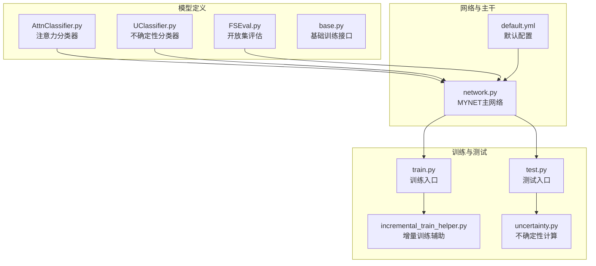
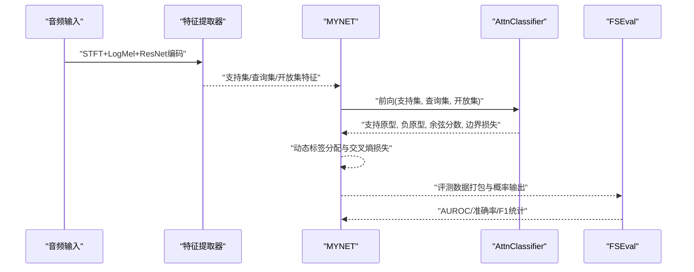
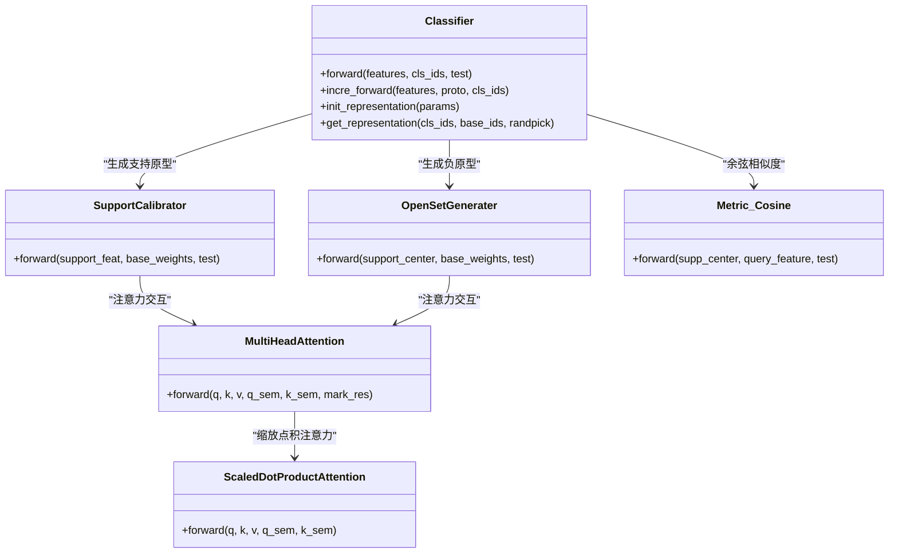
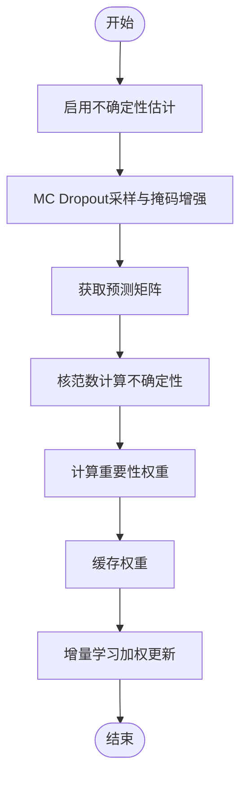
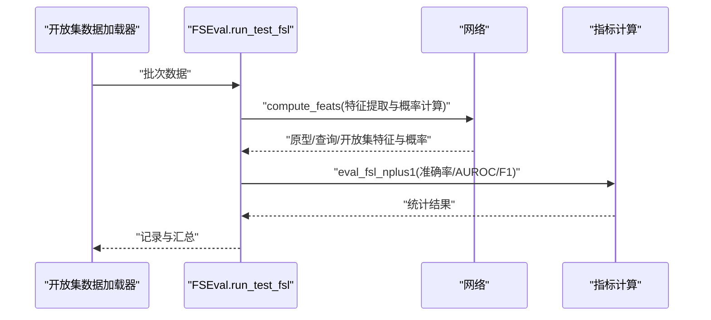
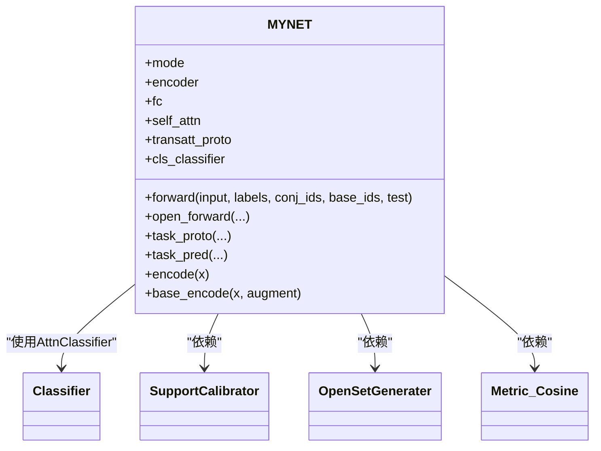
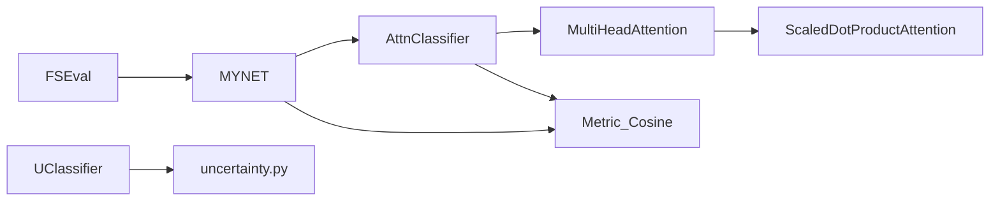

# 分类器系统

<cite>
**本文引用的文件列表**
- [AttnClassifier.py](file://models/AttnClassifier.py)
- [UClassifier.py](file://models/UClassifier.py)
- [FSEval.py](file://models/FSEval.py)
- [base.py](file://models/base.py)
- [network.py](file://network.py)
- [default.yml](file://configs/default.yml)
- [train.py](file://train.py)
- [test.py](file://test.py)
- [incremental_train_helper.py](file://models/incremental_train_helper.py)
- [uncertainty.py](file://models/uncertainty.py)
</cite>

## 目录
1. [简介](#简介)
2. [项目结构](#项目结构)
3. [核心组件](#核心组件)
4. [架构总览](#架构总览)
5. [详细组件分析](#详细组件分析)
6. [依赖关系分析](#依赖关系分析)
7. [性能考量](#性能考量)
8. [故障排查指南](#故障排查指南)
9. [结论](#结论)
10. [附录](#附录)

## 简介
本文件面向VAZE项目的分类器系统，重点围绕注意力分类器(AttnClassifier)的设计与实现展开，涵盖原型生成、分类决策、损失计算等核心功能；同时对比UClassifier与FSEval两类分类器的差异与适用场景，说明其在增量学习与开放集识别中的作用机制，并提供配置参数、训练策略与性能评估方法，帮助读者快速理解并高效使用该系统。

## 项目结构
VAZE项目采用模块化设计，分类器系统主要位于models目录，配合网络主干、数据加载与评估工具共同完成端到端流程。下图展示与分类器系统相关的核心文件及其职责：

图表来源
- [AttnClassifier.py:1-369](file://models/AttnClassifier.py#L1-L369)
- [UClassifier.py:1-405](file://models/UClassifier.py#L1-L405)
- [FSEval.py:1-125](file://models/FSEval.py#L1-L125)
- [base.py:1-254](file://models/base.py#L1-L254)
- [network.py:1-724](file://network.py#L1-L724)
- [default.yml:1-88](file://configs/default.yml#L1-L88)
- [train.py:1-200](file://train.py#L1-L200)
- [test.py:1-200](file://test.py#L1-L200)
- [incremental_train_helper.py:1-156](file://models/incremental_train_helper.py#L1-L156)
- [uncertainty.py:1-55](file://models/uncertainty.py#L1-L55)

章节来源
- [network.py:18-50](file://network.py#L18-L50)
- [default.yml:1-88](file://configs/default.yml#L1-L88)

## 核心组件
- AttnClassifier：基于注意力机制的原型分类器，负责支持集原型校准、负原型生成、余弦相似度分类与开放集边界引导损失。
- UClassifier：在AttnClassifier基础上扩展不确定性估计能力，支持MC Dropout与掩码增强，用于增量学习中的重要性加权。
- FSEval：开放集评估工具，提供FSL+N+1评测指标（准确率、AUROC、F1）与置信区间统计。
- MYNET：主网络封装，集成音频特征提取、注意力模块、分类器与损失函数，统一训练与测试流程。
- 基础训练器：提供通用训练框架、模型保存与加载、数据集初始化等基础设施。

章节来源
- [AttnClassifier.py:38-118](file://models/AttnClassifier.py#L38-L118)
- [UClassifier.py:7-41](file://models/UClassifier.py#L7-L41)
- [FSEval.py:17-42](file://models/FSEval.py#L17-L42)
- [network.py:18-50](file://network.py#L18-L50)
- [base.py:27-110](file://models/base.py#L27-L110)

## 架构总览
下图展示分类器系统在MYNET中的整体工作流：音频经特征提取器编码为特征，支持集与查询集分别进入AttnClassifier进行原型生成与分类，开放集样本参与边界引导与二元判别损失，最终输出分类概率与原型。

图表来源
- [network.py:102-151](file://network.py#L102-L151)
- [AttnClassifier.py:47-93](file://models/AttnClassifier.py#L47-L93)
- [FSEval.py:17-42](file://models/FSEval.py#L17-L42)

## 详细组件分析

### AttnClassifier（注意力分类器）
AttnClassifier是VAZE分类器系统的核心，包含以下关键模块：
- SupportCalibrator：对支持集特征进行语义/视觉融合校准，生成支持原型。
- OpenSetGenerater：基于注意力机制生成负原型（伪类），并可选MLP聚合。
- MultiHeadAttention/ScaledDotProductAttention：多头注意力与缩放点积注意力，支撑原型与基类记忆的交互。
- Metric_Cosine：余弦相似度度量，支持温度参数可学习。

图表来源
- [AttnClassifier.py:38-368](file://models/AttnClassifier.py#L38-L368)

实现要点与设计细节
- 原型生成：支持集特征先取均值，训练阶段注入噪声以缓解中心损失导致的特征坍缩；随后通过SupportCalibrator进行语义/视觉融合校准，得到支持原型。
- 负原型生成：使用带噪声的支持原型或基类权重，结合OpenSetGenerater的注意力机制生成负原型，形成正负原型集合。
- 分类决策：Metric_Cosine对正负原型与查询/开放集特征进行余弦相似度计算，并乘以可学习温度参数，输出分类概率。
- 损失函数：包含交叉熵分类损失与开放集边界引导的Hinge损失，以及伪单位距离的二元判别损失，共同约束原型分布与边界。

章节来源
- [AttnClassifier.py:47-93](file://models/AttnClassifier.py#L47-L93)
- [AttnClassifier.py:121-185](file://models/AttnClassifier.py#L121-L185)
- [AttnClassifier.py:188-271](file://models/AttnClassifier.py#L188-L271)
- [AttnClassifier.py:274-368](file://models/AttnClassifier.py#L274-L368)

### UClassifier（不确定性分类器）
UClassifier在AttnClassifier基础上新增不确定性估计与增量学习支持：
- MC Dropout与掩码增强：通过多次前向与随机掩码，构建预测矩阵，使用核范数衡量不确定性。
- 重要性权重缓存：基于不确定性计算样本重要性权重，支持增量学习中的加权更新。
- 增量学习接口：提供基于重要性权重的加权交叉熵损失，便于在新会话中优先学习低不确定性样本。

图表来源
- [UClassifier.py:36-122](file://models/UClassifier.py#L36-L122)
- [UClassifier.py:382-405](file://models/UClassifier.py#L382-L405)

章节来源
- [UClassifier.py:7-41](file://models/UClassifier.py#L7-L41)
- [UClassifier.py:42-122](file://models/UClassifier.py#L42-L122)
- [UClassifier.py:382-405](file://models/UClassifier.py#L382-L405)

### FSEval（开放集评估）
FSEval提供开放集识别的评测流程，支持FSL+N+1场景：
- 数据打包：将支持集、查询集、开放集特征与标签打包，转换为numpy格式。
- 概率计算：对查询与开放集分别计算余弦分类概率。
- 指标统计：计算准确率、AUROC与宏平均F1，并输出置信区间。

图表来源
- [FSEval.py:17-42](file://models/FSEval.py#L17-L42)
- [FSEval.py:77-112](file://models/FSEval.py#L77-L112)
- [FSEval.py:46-73](file://models/FSEval.py#L46-L73)

章节来源
- [FSEval.py:17-42](file://models/FSEval.py#L17-L42)
- [FSEval.py:77-112](file://models/FSEval.py#L77-L112)
- [FSEval.py:46-73](file://models/FSEval.py#L46-L73)

### MYNET（主网络）
MYNET整合特征提取、注意力模块与分类器，提供统一的前向与损失接口：
- 模式控制：支持'encoder'、'openmeta'等模式，适配不同阶段任务。
- 前向流程：open_forward中完成特征编码、原型生成、动态标签分配与损失计算。
- 任务预测：task_pred对查询与开放集输出softmax概率。
- 增量更新：提供基于原型的增量学习接口与在线原型自适应。

图表来源
- [network.py:18-50](file://network.py#L18-L50)
- [network.py:102-151](file://network.py#L102-L151)
- [network.py:153-223](file://network.py#L153-L223)

章节来源
- [network.py:18-50](file://network.py#L18-L50)
- [network.py:102-151](file://network.py#L102-L151)
- [network.py:153-223](file://network.py#L153-L223)

## 依赖关系分析
- AttnClassifier依赖MultiHeadAttention与ScaledDotProductAttention实现注意力交互；Metric_Cosine提供余弦相似度度量。
- MYNET依赖AttnClassifier完成分类与损失计算，并在open_forward中进行动态标签分配与边界损失构造。
- FSEval独立于训练流程，仅在测试阶段使用，负责评测指标统计。
- UClassifier与不确定性工具uncertainty.py协同，提供基础类不确定度评分与排序。

图表来源
- [AttnClassifier.py:274-368](file://models/AttnClassifier.py#L274-L368)
- [network.py:102-151](file://network.py#L102-L151)
- [FSEval.py:17-42](file://models/FSEval.py#L17-L42)
- [UClassifier.py:42-122](file://models/UClassifier.py#L42-L122)
- [uncertainty.py:5-55](file://models/uncertainty.py#L5-L55)

章节来源
- [AttnClassifier.py:274-368](file://models/AttnClassifier.py#L274-L368)
- [network.py:102-151](file://network.py#L102-L151)
- [FSEval.py:17-42](file://models/FSEval.py#L17-L42)
- [UClassifier.py:42-122](file://models/UClassifier.py#L42-L122)
- [uncertainty.py:5-55](file://models/uncertainty.py#L5-L55)

## 性能考量
- 计算复杂度：注意力模块的多头计算与余弦相似度矩阵乘法在支持集与基类规模较大时开销显著，建议合理设置n_head与特征维度。
- 训练稳定性：训练阶段对支持集注入噪声有助于缓解特征坍缩；温度参数可学习，需结合学习率调度稳定收敛。
- 开放集边界：Hinge损失仅在负原型与正原型距离小于阈值时生效，避免过度惩罚，提升泛化能力。
- 不确定性估计：MC Dropout与掩码增强增加推理成本，建议在增量学习阶段按需启用并控制采样次数。

## 故障排查指南
- 模式错误：MYNET在不确定性估计时需临时切换mode，若未恢复可能导致后续训练崩溃。检查get_uncertainty中的模式恢复逻辑。
- 维度不匹配：open_forward中动态标签分配需确保维度一致，注意query_label与dynamic_openset_label的拼接顺序与形状。
- 温度参数异常：Metric_Cosine的温度参数为可学习参数，若出现过拟合或数值不稳定，可调整初始值与学习率。
- 增量学习权重：UClassifier的增量更新需确保重要性权重与损失计算一致，避免缓存失效导致的训练偏差。

章节来源
- [network.py:50-101](file://network.py#L50-L101)
- [network.py:153-202](file://network.py#L153-L202)
- [AttnClassifier.py:352-368](file://models/AttnClassifier.py#L352-L368)
- [UClassifier.py:382-405](file://models/UClassifier.py#L382-L405)

## 结论
VAZE的分类器系统以AttnClassifier为核心，结合注意力机制与余弦相似度度量，在开放集识别中实现了稳健的原型生成与边界引导。UClassifier进一步引入不确定性估计与增量学习支持，提升了系统在持续学习场景下的鲁棒性与效率。FSEval提供了标准化的评测流程，便于在不同数据集与任务中进行公平比较。通过合理的配置与训练策略，该系统能够在增量学习与开放集识别中取得良好性能。

## 附录

### 配置参数与训练策略
- 训练超参：来自default.yml的way、shot、n_ways、n_shots、n_queries、epochs、lr、scheduler等，决定小样本与元训练规模。
- 分类器类型：支持多种负原型生成策略与聚合方式，可通过命令行参数选择。
- 增量学习：提供基于原型的增量更新与在线原型自适应策略，结合不确定性权重实现重要性加权。

章节来源
- [default.yml:1-88](file://configs/default.yml#L1-L88)
- [train.py:173-200](file://train.py#L173-L200)
- [incremental_train_helper.py:28-111](file://models/incremental_train_helper.py#L28-L111)

### 性能评估方法
- 准确率：查询集上对已知类别的分类准确率。
- AUROC：基于开放集未知样本的概率得分计算AUROC。
- F1：宏平均F1，平衡已知与未知样本的识别效果。
- 置信区间：使用t检验与半宽统计，评估指标的稳定性。

章节来源
- [FSEval.py:46-73](file://models/FSEval.py#L46-L73)
- [FSEval.py:116-124](file://models/FSEval.py#L116-L124)