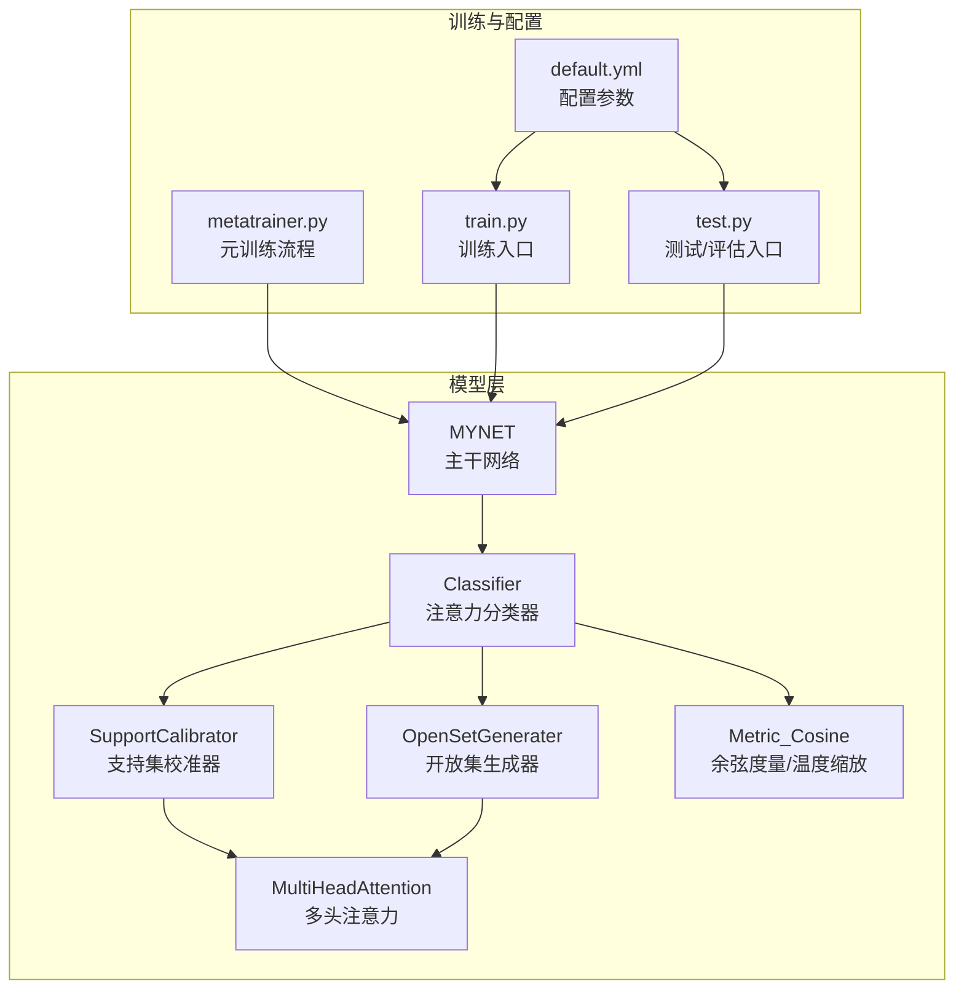
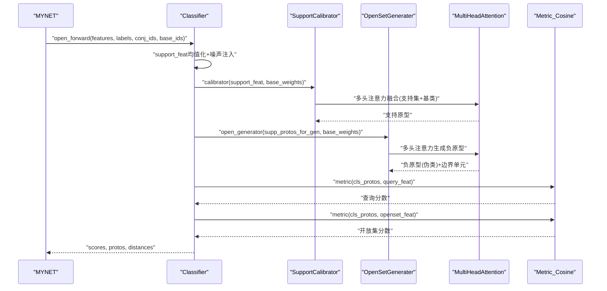
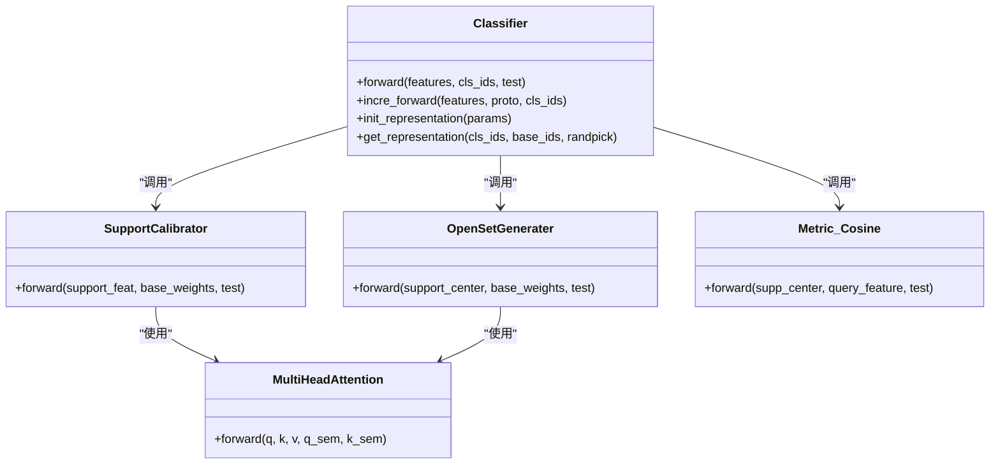

# 注意力分类器

<cite>
**本文引用的文件列表**
- [AttnClassifier.py](file://models/AttnClassifier.py)
- [network.py](file://network.py)
- [default.yml](file://configs/default.yml)
- [metatrainer.py](file://models/metatrainer.py)
- [train.py](file://train.py)
- [test.py](file://test.py)
</cite>

## 目录
1. [简介](#简介)
2. [项目结构](#项目结构)
3. [核心组件](#核心组件)
4. [架构总览](#架构总览)
5. [详细组件分析](#详细组件分析)
6. [依赖关系分析](#依赖关系分析)
7. [性能考量](#性能考量)
8. [故障排查指南](#故障排查指南)
9. [结论](#结论)
10. [附录](#附录)

## 简介
本文件面向VAZE项目中的注意力分类器，系统性阐述AttnClassifier类的设计与实现，重点解析以下关键模块：
- 支持集校准器（SupportCalibrator）：通过语义与视觉特征融合，对支持集原型进行语义校准与注意力聚合。
- 开放集生成器（OpenSetGenerater）：基于多头注意力生成负原型（伪类），并提供边界生成与温度缩放。
- 多头注意力机制（MultiHeadAttention）：实现跨模态（视觉+语义）与跨样本的注意力融合。
- 增量学习中的原型更新策略与开放集识别中的边界生成机制。
- 分类器配置参数、训练策略与性能评估方法。

## 项目结构
VAZE项目采用模块化设计，注意力分类器位于models目录，主干网络MYNET位于network.py，训练与评估流程由train.py/test.py驱动，配置参数由configs/default.yml提供。

图表来源
- [network.py:18-35](file://network.py#L18-L35)
- [AttnClassifier.py:38-46](file://models/AttnClassifier.py#L38-L46)
- [metatrainer.py:130-158](file://models/metatrainer.py#L130-L158)
- [train.py:173-200](file://train.py#L173-L200)
- [test.py:21-22](file://test.py#L21-L22)
- [default.yml:1-88](file://configs/default.yml#L1-L88)

章节来源
- [network.py:18-35](file://network.py#L18-L35)
- [AttnClassifier.py:38-46](file://models/AttnClassifier.py#L38-L46)
- [metatrainer.py:130-158](file://models/metatrainer.py#L130-L158)
- [train.py:173-200](file://train.py#L173-L200)
- [test.py:21-22](file://test.py#L21-L22)
- [default.yml:1-88](file://configs/default.yml#L1-L88)

## 核心组件
- AttnClassifier（Classifier）：封装支持集校准、开放集生成与度量，负责前向推理与增量推理。
- SupportCalibrator：将支持集特征与语义特征融合，经多头注意力生成校准后的支持原型。
- OpenSetGenerater：基于多头注意力生成负原型（伪类），并提供边界生成与温度缩放。
- MultiHeadAttention：通用多头注意力模块，支持跨模态与跨样本的注意力融合。
- Metric_Cosine：余弦相似度度量，内置可学习温度参数，用于温度缩放。

章节来源
- [AttnClassifier.py:38-118](file://models/AttnClassifier.py#L38-L118)
- [AttnClassifier.py:121-185](file://models/AttnClassifier.py#L121-L185)
- [AttnClassifier.py:188-271](file://models/AttnClassifier.py#L188-L271)
- [AttnClassifier.py:274-368](file://models/AttnClassifier.py#L274-L368)

## 架构总览
注意力分类器在MYNET的openmeta模式下工作，接收拼接后的支持/查询/开放集特征，通过Classifier完成：
- 支持集均值化与噪声注入，提升原型稳定性。
- SupportCalibrator进行语义校准与注意力聚合，生成支持原型。
- OpenSetGenerater生成负原型（伪类）与边界单元，用于开放集判别。
- Metric_Cosine进行余弦相似度计算与温度缩放，输出查询与开放集分数。

图表来源
- [network.py:102-151](file://network.py#L102-L151)
- [AttnClassifier.py:47-93](file://models/AttnClassifier.py#L47-L93)
- [AttnClassifier.py:121-185](file://models/AttnClassifier.py#L121-L185)
- [AttnClassifier.py:188-271](file://models/AttnClassifier.py#L188-L271)
- [AttnClassifier.py:274-368](file://models/AttnClassifier.py#L274-L368)

## 详细组件分析

### AttnClassifier（Classifier）
- 功能要点
  - 支持集均值化与噪声注入：在训练阶段对支持集特征添加噪声，缓解中心损失导致的特征坍缩，提升原型稳定性。
  - 支持原型生成：调用SupportCalibrator，结合语义校准与多头注意力，生成支持原型。
  - 负原型生成：调用OpenSetGenerater，基于多头注意力生成负原型（伪类），并输出边界单元。
  - 度量与温度缩放：使用Metric_Cosine计算余弦相似度，并通过可学习温度参数进行温度缩放。
  - 增量推理：提供incre_forward接口，支持增量场景下的原型更新与推理。
  - 基类表示初始化：通过init_representation加载预训练分类器权重作为基类表示。

- 关键流程
  - 前向：支持集均值化→噪声注入→支持原型生成→负原型生成→度量计算→返回分数与边界距离。
  - 增量推理：直接使用传入原型，生成负原型并进行分类。

章节来源
- [AttnClassifier.py:47-101](file://models/AttnClassifier.py#L47-L101)
- [AttnClassifier.py:103-118](file://models/AttnClassifier.py#L103-L118)

### SupportCalibrator（支持集校准器）
- 功能要点
  - 语义校准：将支持集与基类的语义特征映射到统一空间，通过门控融合（visfuse与semfuse）动态调整视觉与语义权重。
  - 多头注意力：对支持集与基类进行注意力聚合，生成支持原型。
  - 多种负样本生成类型（neg_gen_type）：支持语义+视觉融合（semang）、仅注意力（attg）、仅视觉（att）等。

- 关键流程
  - 语义校准：支持集与基类语义特征经映射后，按任务上下文计算平均任务记忆，生成门控权重。
  - 注意力聚合：将支持集特征与基类特征（含语义）送入MultiHeadAttention，输出支持原型。
  - 返回：训练阶段展开为[B,N,D]，测试阶段保持紧凑形式。

章节来源
- [AttnClassifier.py:121-185](file://models/AttnClassifier.py#L121-L185)

### OpenSetGenerater（开放集生成器）
- 功能要点
  - 负原型生成：基于支持原型与基类特征，通过多头注意力生成负原型（伪类）。
  - 边界单元：输出recip_unit用于开放集判别（如二元交叉熵）。
  - 聚合策略：支持平均聚合（avg）与MLP聚合（mlp），后者可进一步压缩或扩展特征空间。
  - 多种负样本生成类型：与SupportCalibrator一致，支持semang、attg、att等。

- 关键流程
  - 语义校准与门控融合：与SupportCalibrator类似，生成融合后的基类特征与语义。
  - 注意力生成：对支持原型与基类特征进行注意力，输出负原型与边界单元。
  - 聚合：根据agg选择平均或MLP聚合。

章节来源
- [AttnClassifier.py:188-271](file://models/AttnClassifier.py#L188-L271)

### MultiHeadAttention（多头注意力）
- 功能要点
  - Q/K/V投影：分别对查询、键、值进行线性变换，支持跨模态（视觉+语义）与跨样本注意力。
  - 注意力计算：ScaledDotProductAttention实现缩放点积注意力，softmax归一化。
  - 残差与层归一化：输出经残差连接与层归一化，提升稳定性。
  - 温度缩放：通过d_k控制缩放因子，影响注意力分布的锐利程度。

- 关键流程
  - 线性投影→多头展开→注意力计算→拼接→线性变换→残差+归一化。

章节来源
- [AttnClassifier.py:274-326](file://models/AttnClassifier.py#L274-L326)
- [network.py:538-584](file://network.py#L538-L584)

### Metric_Cosine（余弦度量与温度缩放）
- 功能要点
  - 余弦相似度：对支持原型与查询特征进行归一化后计算批量余弦相似度。
  - 温度缩放：通过可学习温度参数对logits进行缩放，控制分布锐利程度。
  - 训练/测试分支：根据test标志选择不同的转置策略，保证训练与推理一致性。

- 关键流程
  - 特征归一化→批量余弦相似度→乘以温度→返回logits。

章节来源
- [AttnClassifier.py:352-368](file://models/AttnClassifier.py#L352-L368)

### 增量学习中的原型更新策略
- 动机：在增量阶段，新类出现且需避免灾难性遗忘。
- 策略：
  - 动量更新：对新类原型采用指数滑动平均，融合历史原型与当前均值。
  - EMA融合：支持可配置的EMA系数，利用跨测试次数的历史原型。
  - 压缩约束：在优化新类原型时加入与基类原型的最小余弦距离约束，防止坍塌。
- 实现参考：
  - 原型更新与EMA融合逻辑见训练/测试脚本中的相关函数。
  - 动量更新与EMA参数在配置文件中可调。

章节来源
- [train.py:710-731](file://train.py#L710-L731)
- [test.py:424-708](file://test.py#L424-L708)
- [test.py:366-390](file://test.py#L366-L390)
- [default.yml:1-88](file://configs/default.yml#L1-L88)

### 开放集识别中的边界生成机制
- 动态标签分配：对开放集样本，依据其在查询分数中的“硬正类”为其分配对应的负原型标签。
- 边界单元：OpenSetGenerater输出recip_unit，用于二元交叉熵判别开放集与已知类。
- Hinge损失：强制负原型与支持原型之间的欧氏距离大于阈值（margin），形成清晰边界。
- 温度缩放：通过Metric_Cosine的温度参数控制决策边界锐利度。

章节来源
- [network.py:153-202](file://network.py#L153-L202)
- [network.py:134-146](file://network.py#L134-L146)
- [AttnClassifier.py:352-368](file://models/AttnClassifier.py#L352-L368)

## 依赖关系分析
- Classifier依赖SupportCalibrator、OpenSetGenerater与Metric_Cosine。
- SupportCalibrator与OpenSetGenerater共享MultiHeadAttention与门控融合模块。
- MYNET在openmeta模式下调用Classifier，完成训练与推理。
- 训练/测试脚本通过配置文件default.yml传递参数，驱动元训练与评估。

图表来源
- [AttnClassifier.py:38-118](file://models/AttnClassifier.py#L38-L118)
- [AttnClassifier.py:121-271](file://models/AttnClassifier.py#L121-L271)
- [AttnClassifier.py:274-368](file://models/AttnClassifier.py#L274-L368)

章节来源
- [AttnClassifier.py:38-118](file://models/AttnClassifier.py#L38-L118)
- [AttnClassifier.py:121-271](file://models/AttnClassifier.py#L121-L271)
- [AttnClassifier.py:274-368](file://models/AttnClassifier.py#L274-L368)

## 性能考量
- 注意力温度：d_k决定缩放因子，影响注意力分布的锐利程度，进而影响原型稳定性与边界清晰度。
- 温度缩放：可学习温度参数在Metric_Cosine中，用于控制决策边界锐利度，避免过拟合。
- 噪声注入：在支持集均值化后添加噪声，缓解中心损失导致的特征坍缩，提升原型稳定性。
- Hinge损失：通过margin约束负原型与支持原型的距离，形成清晰边界，提高开放集判别能力。
- 聚合策略：avg与mlp两种聚合方式可按需求选择，mlp可进一步压缩或扩展特征空间。

[本节为通用性能讨论，无需特定文件来源]

## 故障排查指南
- 训练不稳定或精度波动
  - 检查温度缩放参数是否过大或过小，适当调整Metric_Cosine的温度。
  - 检查噪声注入强度，避免过大导致原型漂移。
  - 检查Hinge损失的margin设置，确保边界生成合理。
- 开放集判别效果不佳
  - 检查neg_gen_type与agg设置，尝试不同组合（semang/attg/att与avg/mlp）。
  - 检查recip_unit的使用与二元交叉熵损失权重。
- 增量学习灾难性遗忘
  - 检查EMA融合系数与动量更新参数，确保历史原型有效利用。
  - 检查新类原型优化时的余弦距离约束，避免坍塌。

章节来源
- [AttnClassifier.py:352-368](file://models/AttnClassifier.py#L352-L368)
- [network.py:134-146](file://network.py#L134-L146)
- [test.py:366-390](file://test.py#L366-L390)

## 结论
VAZE的注意力分类器通过语义与视觉特征融合、多头注意力聚合与温度缩放，实现了稳健的支持集原型生成与开放集边界构建。配合增量学习中的EMA融合与动量更新策略，有效缓解了灾难性遗忘。通过合理配置neg_gen_type、agg、温度与Hinge损失参数，可在不同数据集与任务中取得良好性能。

[本节为总结性内容，无需特定文件来源]

## 附录

### 配置参数与训练策略
- 关键参数
  - n_ways/n_shots/n_queries：元训练与测试的类别数、样本数与查询数。
  - neg_gen_type：负样本生成类型（semang/attg/att/mlp）。
  - agg：聚合策略（avg/mlp）。
  - hinge_margin：Hinge损失的边界阈值。
  - temperature：余弦度量的温度缩放参数。
  - lr/lr_new/lrg：学习率与学习率组。
  - gamma/funit：Hinge损失与边界损失的权重系数。
- 训练策略
  - 元训练：通过metatrainer.py驱动，结合分类损失、Hinge损失与边界损失。
  - 增量学习：采用EMA融合与动量更新，避免灾难性遗忘。
  - 测试评估：支持开放集AUROC等指标计算。

章节来源
- [default.yml:1-88](file://configs/default.yml#L1-L88)
- [metatrainer.py:130-158](file://models/metatrainer.py#L130-L158)
- [train.py:173-200](file://train.py#L173-L200)
- [test.py:21-22](file://test.py#L21-L22)