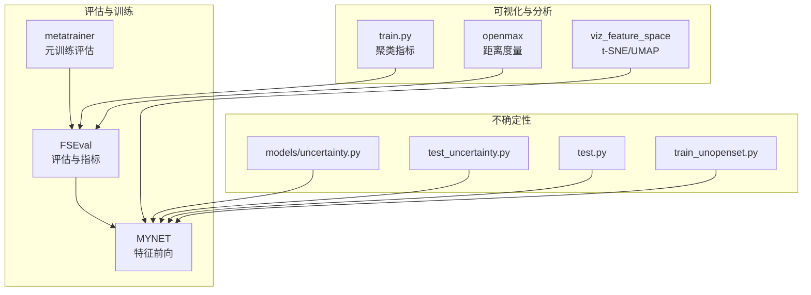
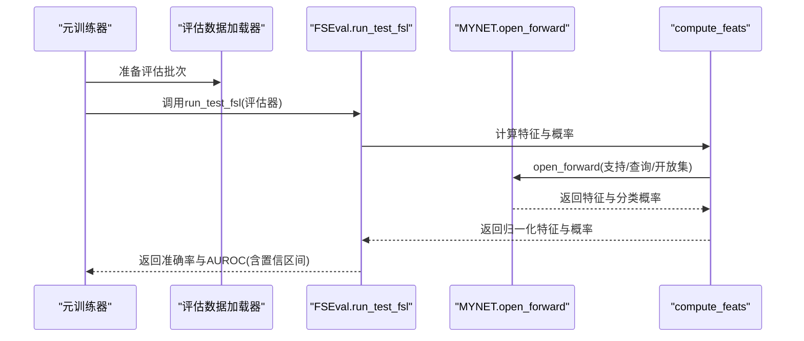
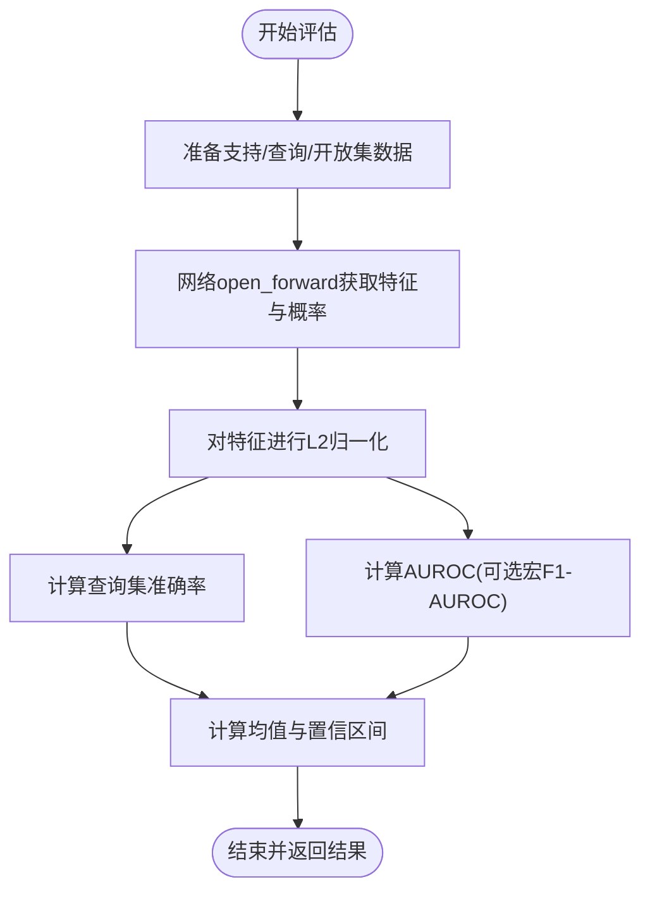
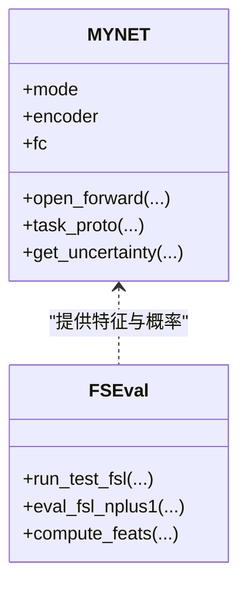
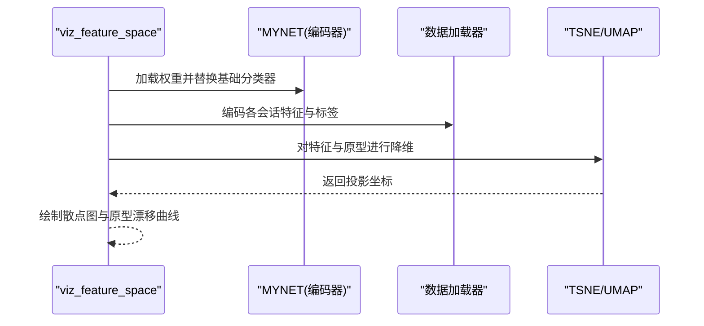
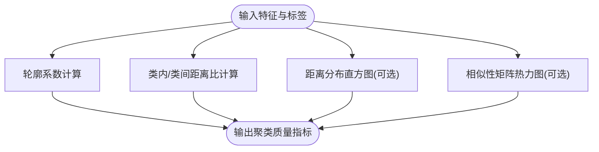
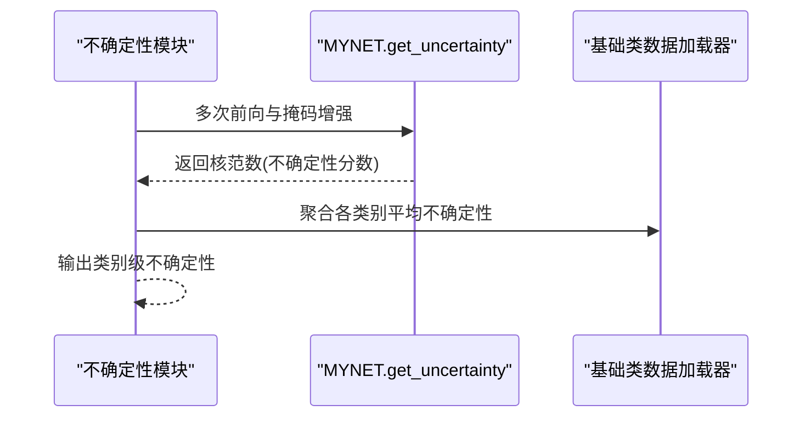
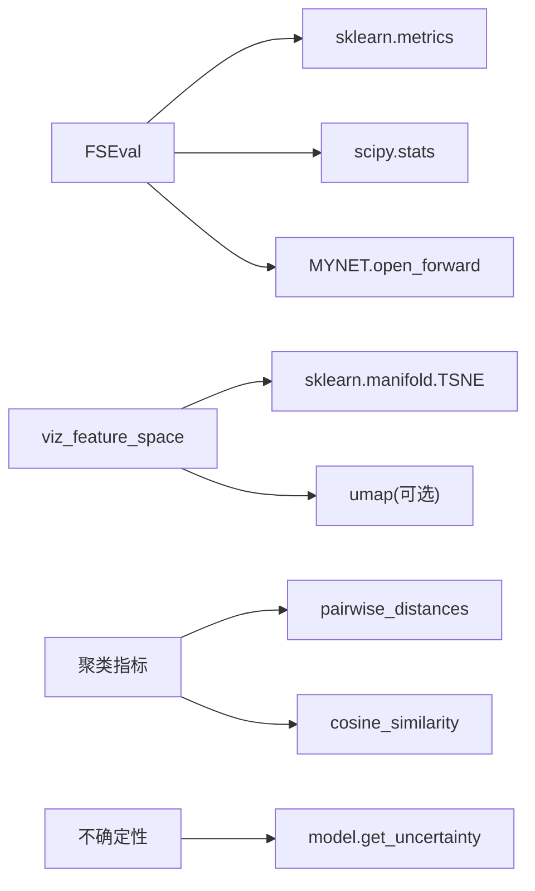

# 特征空间评估器

<cite>
**本文引用的文件**
- [models/FSEval.py](file://models/FSEval.py)
- [models/metatrainer.py](file://models/metatrainer.py)
- [models/metatrainer_oo.py](file://models/metatrainer_oo.py)
- [network.py](file://network.py)
- [scripts/viz_feature_space.py](file://scripts/viz_feature_space.py)
- [train.py](file://train.py)
- [openmax.py](file://openmax.py)
- [models/uncertainty.py](file://models/uncertainty.py)
- [test_uncertainty.py](file://test_uncertainty.py)
- [test.py](file://test.py)
- [train_unopenset.py](file://train_unopenset.py)
</cite>

## 目录
1. [简介](#简介)
2. [项目结构](#项目结构)
3. [核心组件](#核心组件)
4. [架构总览](#架构总览)
5. [详细组件分析](#详细组件分析)
6. [依赖分析](#依赖分析)
7. [性能考量](#性能考量)
8. [故障排查指南](#故障排查指南)
9. [结论](#结论)
10. [附录](#附录)

## 简介
本文件面向VAZE项目中的特征空间评估器，系统阐述FSEval类的设计与实现，重点覆盖以下方面：
- 特征空间分析：支持集原型、查询样本与开放集样本的特征提取与归一化
- 距离度量与相似性：基于余弦相似度的概率输出，以及AUROC/Acc等指标
- 质量评估：通过类内/类间距离、聚类效果与原型漂移等角度评估特征表示质量
- 训练与验证中的作用：在元训练阶段对开放集学习任务进行快速评估
- 指标计算、可视化与性能改进建议：提供可操作的优化路径

## 项目结构
与特征空间评估器直接相关的代码主要分布在以下模块：
- 评估器与指标计算：models/FSEval.py
- 元训练流程与评估集成：models/metatrainer.py、models/metatrainer_oo.py
- 网络与特征前向：network.py
- 可视化工具：scripts/viz_feature_space.py
- 聚类与距离分析：train.py、openmax.py
- 不确定性度量：models/uncertainty.py、test_uncertainty.py、test.py、train_unopenset.py

**图表来源**
- [models/FSEval.py:17-42](file://models/FSEval.py#L17-L42)
- [models/metatrainer.py:55-60](file://models/metatrainer.py#L55-L60)
- [network.py:37-151](file://network.py#L37-L151)
- [scripts/viz_feature_space.py:59-129](file://scripts/viz_feature_space.py#L59-L129)
- [train.py:330-361](file://train.py#L330-L361)
- [openmax.py:7-32](file://openmax.py#L7-L32)
- [models/uncertainty.py:5-55](file://models/uncertainty.py#L5-L55)

**章节来源**
- [models/FSEval.py:17-125](file://models/FSEval.py#L17-L125)
- [models/metatrainer.py:42-84](file://models/metatrainer.py#L42-L84)
- [network.py:18-151](file://network.py#L18-L151)
- [scripts/viz_feature_space.py:59-133](file://scripts/viz_feature_space.py#L59-L133)
- [train.py:330-361](file://train.py#L330-L361)
- [openmax.py:7-72](file://openmax.py#L7-L72)
- [models/uncertainty.py:5-55](file://models/uncertainty.py#L5-L55)

## 核心组件
- FSEval评估器：负责在开放集学习场景下抽取支持集原型、查询与开放集特征，计算准确率与AUROC等指标，并输出置信区间统计。
- 网络MYNET：提供open_forward模式，返回支持/查询/开放集特征与分类概率，供评估器使用。
- 元训练器：在每个元训练周期调用run_test_fsl进行快速评估，记录最佳指标与保存模型。
- 可视化脚本：对特征与原型进行t-SNE/UMAP投影，观察原型漂移与聚类分布。
- 聚类与距离分析：提供轮廓系数、类内/类间距离比等指标，辅助评估特征质量。
- 不确定性度量：基于MC Dropout的核范数，衡量基础类样本的不确定性。

**章节来源**
- [models/FSEval.py:17-125](file://models/FSEval.py#L17-L125)
- [models/metatrainer.py:55-75](file://models/metatrainer.py#L55-L75)
- [network.py:102-151](file://network.py#L102-L151)
- [scripts/viz_feature_space.py:59-129](file://scripts/viz_feature_space.py#L59-L129)
- [train.py:330-361](file://train.py#L330-L361)
- [models/uncertainty.py:5-55](file://models/uncertainty.py#L5-L55)

## 架构总览
下面的序列图展示了元训练中评估流程的关键调用链，体现评估器在模型训练与验证中的作用。

**图表来源**
- [models/metatrainer.py:55-60](file://models/metatrainer.py#L55-L60)
- [models/FSEval.py:17-42](file://models/FSEval.py#L17-L42)
- [models/FSEval.py:77-112](file://models/FSEval.py#L77-L112)
- [network.py:102-151](file://network.py#L102-L151)

## 详细组件分析

### FSEval类与评估流程
- 数据准备与特征提取
  - 支持集、查询集、开放集样本被拼接并送入网络的open_forward模式，得到支持/查询/开放集特征与分类概率。
  - 特征经L2归一化，便于后续距离与相似性分析。
- 指标计算
  - 准确率：对查询集在前N类上的最大概率预测进行分类准确率计算。
  - AUROC：以开放集标签反向构造二分类标签，计算AUROC；同时支持基于宏平均F1的AUROC变体。
  - 置信区间：使用t分布分位数计算均值与半宽，稳定评估结果波动。
- 评估器在训练中的角色
  - 元训练器在每个周期调用run_test_fsl，记录并比较最佳指标，指导模型保存与调度策略。

**图表来源**
- [models/FSEval.py:77-112](file://models/FSEval.py#L77-L112)
- [models/FSEval.py:46-73](file://models/FSEval.py#L46-L73)
- [models/FSEval.py:116-123](file://models/FSEval.py#L116-L123)

**章节来源**
- [models/FSEval.py:17-125](file://models/FSEval.py#L17-L125)

### 网络MYNET的特征空间输出
- open_forward模式
  - 将支持/查询/开放集特征按样本数拆分，计算支持原型与伪类原型，输出余弦分数与分类概率。
  - 在测试模式下返回特征与概率，供评估器使用。
- 任务原型与损失
  - 通过支持原型与伪类原型的距离计算开放集Hinge损失，间接影响特征空间的分离度。

**图表来源**
- [network.py:18-151](file://network.py#L18-L151)
- [models/FSEval.py:17-112](file://models/FSEval.py#L17-L112)

**章节来源**
- [network.py:102-151](file://network.py#L102-L151)

### 可视化与原型漂移分析
- t-SNE/UMAP投影
  - 对编码器特征与类别原型进行降维可视化，观察类内聚集与类间分离。
- 原型漂移
  - 计算不同会话中基础类原型的欧氏距离均值，评估随时间的稳定性。

**图表来源**
- [scripts/viz_feature_space.py:59-129](file://scripts/viz_feature_space.py#L59-L129)

**章节来源**
- [scripts/viz_feature_space.py:59-133](file://scripts/viz_feature_space.py#L59-L133)

### 聚类与距离分析
- 轮廓系数
  - 评估特征在聚类结构下的紧密度与分离度，数值越高表示特征质量越好。
- 类内/类间距离比
  - 计算每类内样本对平均距离与跨类样本对平均距离的比值，比值越大代表类内更紧凑、类间更分散。
- 距离分布与相似性矩阵
  - 可选地绘制特征两两距离直方图与余弦相似性热力图，辅助理解特征分布。

**图表来源**
- [train.py:330-361](file://train.py#L330-L361)

**章节来源**
- [train.py:330-361](file://train.py#L330-L361)

### 不确定性度量与特征质量
- MC Dropout不确定性
  - 通过多次前向与掩码增强，计算概率分布的核范数作为不确定性评分，可用于识别困难样本与异常特征。
- 基础类平均不确定性
  - 按类别聚合样本不确定性，形成类别级度量，辅助特征鲁棒性评估。

**图表来源**
- [models/uncertainty.py:5-55](file://models/uncertainty.py#L5-L55)
- [test_uncertainty.py:489-522](file://test_uncertainty.py#L489-L522)
- [test.py:988-1021](file://test.py#L988-L1021)
- [train_unopenset.py:742-774](file://train_unopenset.py#L742-L774)

**章节来源**
- [models/uncertainty.py:5-55](file://models/uncertainty.py#L5-L55)
- [test_uncertainty.py:489-522](file://test_uncertainty.py#L489-L522)
- [test.py:988-1021](file://test.py#L988-L1021)
- [train_unopenset.py:742-774](file://train_unopenset.py#L742-L774)

## 依赖分析
- 评估器依赖
  - 网络open_forward输出：提供支持/查询/开放集特征与分类概率
  - sklearn指标：AUROC、F1、准确率
  - scipy统计：置信区间
- 可视化与分析依赖
  - sklearn降维与聚类：TSNE、UMAP、KMeans
  - scipy距离与余弦相似：pairwise_distances、cosine_similarity
- 不确定性依赖
  - MC Dropout与核范数：模型内置get_uncertainty

**图表来源**
- [models/FSEval.py:13-14](file://models/FSEval.py#L13-L14)
- [models/FSEval.py:6,116-123](file://models/FSEval.py#L6,L116-L123)
- [network.py:102-151](file://network.py#L102-L151)
- [scripts/viz_feature_space.py:21,38-41](file://scripts/viz_feature_space.py#L21,L38-L41)
- [train.py:27,30](file://train.py#L27,L30)

**章节来源**
- [models/FSEval.py:13-14](file://models/FSEval.py#L13-L14)
- [scripts/viz_feature_space.py:21-41](file://scripts/viz_feature_space.py#L21-L41)
- [train.py:27,30](file://train.py#L27,L30)

## 性能考量
- 计算复杂度
  - 特征归一化与概率计算为线性于样本数与特征维；AUROC与聚类指标受样本规模影响较大。
- 内存与显存
  - 归一化与概率张量在GPU上计算后转移至CPU，注意批量大小与特征维的权衡。
- 稳定性
  - 置信区间有助于减少评估波动；t-SNE/UMAP的随机性可通过固定随机种子降低。
- 可扩展性
  - 可引入更多距离度量（如马氏距离）与相似性指标（如余弦相似性直方图），并结合不确定性进行样本筛选。

## 故障排查指南
- AUROC为None
  - 检查评估类型列表与标签构造逻辑，确保开放集标签与查询集标签正确拼接。
- 特征维度不一致
  - 确认网络输出特征维与评估器归一化维度一致，避免形状错误导致的计算异常。
- 可视化失败
  - 若缺少UMAP库，脚本会安全降级；确认matplotlib与sklearn版本兼容。
- 不确定性为零或异常
  - 检查MC Dropout开关与前向次数，确保模型处于eval模式且get_uncertainty被正确调用。

**章节来源**
- [models/FSEval.py:46-73](file://models/FSEval.py#L46-L73)
- [scripts/viz_feature_space.py:36-41](file://scripts/viz_feature_space.py#L36-L41)
- [models/uncertainty.py:5-55](file://models/uncertainty.py#L5-L55)

## 结论
FSEval评估器通过在开放集学习场景下提取支持集原型与查询/开放集特征，结合AUROC与准确率等指标，提供了对特征表示质量的快速评估。配合t-SNE/UMAP可视化、聚类指标与不确定性度量，能够从类内紧凑性、类间分离度与原型稳定性等多维度审视特征空间质量，并为模型训练与验证提供可操作的优化依据。

## 附录
- 评估指标建议
  - 在线指标：AUROC、宏平均F1、查询集准确率
  - 离线指标：轮廓系数、类内/类间距离比、原型漂移
  - 不确定性：类别级平均不确定性，用于样本筛选与异常检测
- 可视化建议
  - t-SNE/UMAP投影与原型漂移折线图
  - 距离分布直方图与相似性热力图（可选）