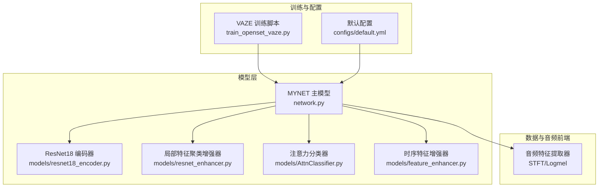
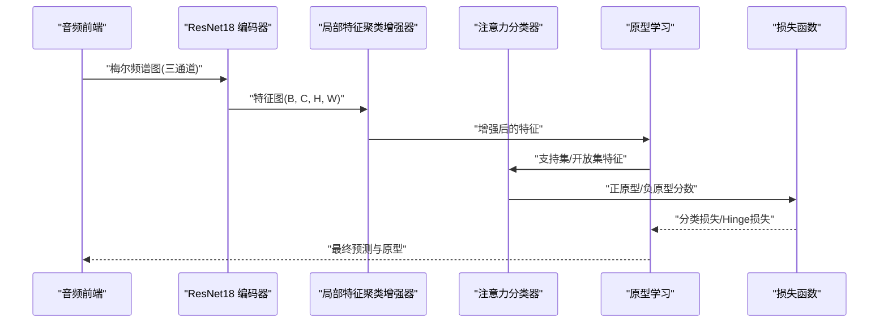
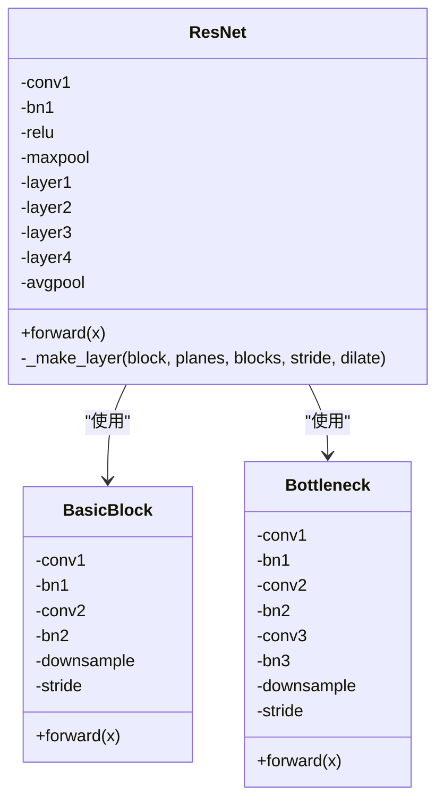
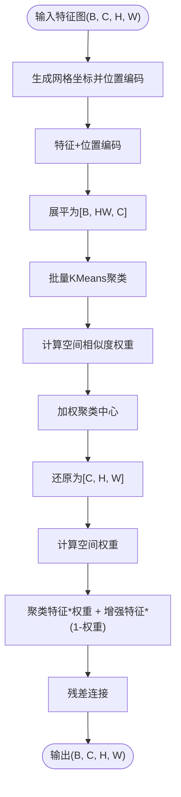
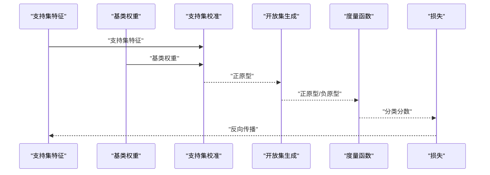
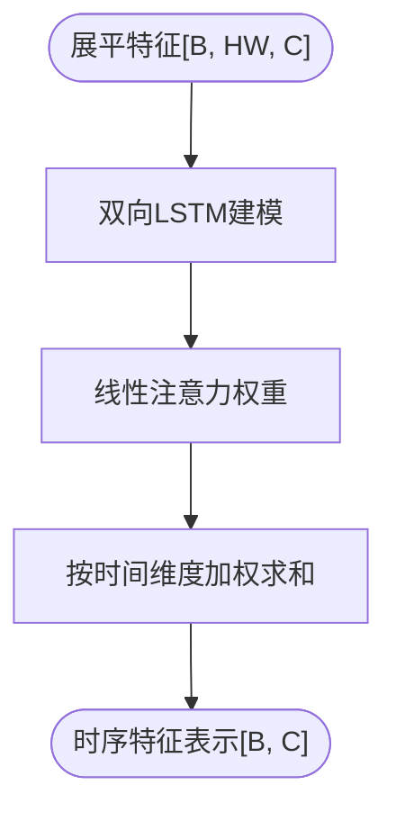
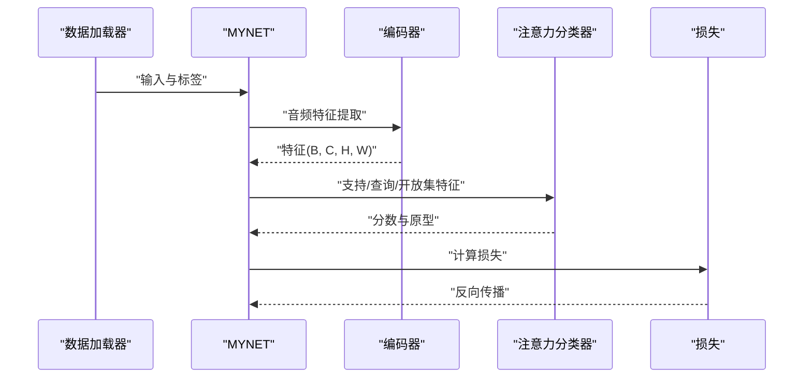
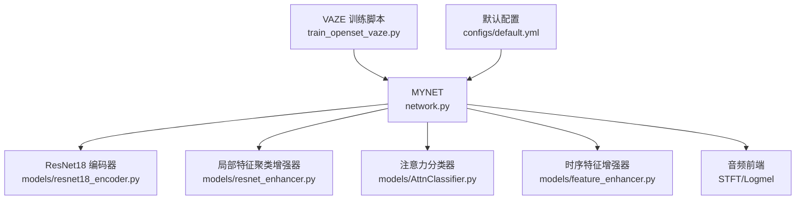

# 核心模块详解

<cite>
**本文档引用的文件**
- [network.py](file://network.py)
- [resnet18_encoder.py](file://models/resnet18_encoder.py)
- [resnet_enhancer.py](file://models/resnet_enhancer.py)
- [feature_enhancer.py](file://models/feature_enhancer.py)
- [AttnClassifier.py](file://models/AttnClassifier.py)
- [train_openset_vaze.py](file://train_openset_vaze.py)
- [default.yml](file://configs/default.yml)
</cite>

## 目录
1. [简介](#简介)
2. [项目结构](#项目结构)
3. [核心组件](#核心组件)
4. [架构总览](#架构总览)
5. [详细组件分析](#详细组件分析)
6. [依赖关系分析](#依赖关系分析)
7. [性能考虑](#性能考虑)
8. [故障排除指南](#故障排除指南)
9. [结论](#结论)

## 简介
本文件面向VAZE项目的核心模块，重点解析MYNET主模型的设计架构，涵盖以下关键要素：
- ResNet18编码器：作为音频特征提取骨干网络，负责将梅尔频谱图转换为深度特征表示
- 注意力机制：多头注意力模块用于原型学习与开放集生成，提升分类性能与鲁棒性
- 特征增强模块：局部特征聚类与位置编码增强，改善空间感知与局部细节保留
- 开放集检测与增量学习：结合VAZE策略的阈值决策与原型聚类，实现增量类别扩展

通过系统化的架构图、组件关系图与流程图，帮助读者快速理解各模块职责、实现原理与数据流，并提供扩展与定制建议。

## 项目结构
VAZE项目采用分层组织方式，核心代码集中在models与network.py中，训练脚本位于根目录。关键目录与文件如下：
- models：包含编码器、注意力分类器、特征增强模块等核心组件
- network.py：MYNET主模型定义，整合音频前端、编码器、注意力与分类器
- train_openset_vaze.py：基于VAZE策略的开放集训练与评估流程
- configs/default.yml：默认训练配置，定义超参数与数据加载参数

图表来源
- [network.py:18-518](file://network.py#L18-L518)
- [resnet18_encoder.py:240-334](file://models/resnet18_encoder.py#L240-L334)
- [resnet_enhancer.py:51-160](file://models/resnet_enhancer.py#L51-L160)
- [AttnClassifier.py:39-93](file://models/AttnClassifier.py#L39-L93)
- [feature_enhancer.py:27-93](file://models/feature_enhancer.py#L27-L93)
- [train_openset_vaze.py:420-481](file://train_openset_vaze.py#L420-L481)
- [default.yml:1-88](file://configs/default.yml#L1-L88)

章节来源
- [network.py:18-518](file://network.py#L18-L518)
- [resnet18_encoder.py:240-334](file://models/resnet18_encoder.py#L240-L334)
- [resnet_enhancer.py:51-160](file://models/resnet_enhancer.py#L51-L160)
- [AttnClassifier.py:39-93](file://models/AttnClassifier.py#L39-L93)
- [feature_enhancer.py:27-93](file://models/feature_enhancer.py#L27-L93)
- [train_openset_vaze.py:420-481](file://train_openset_vaze.py#L420-L481)
- [default.yml:1-88](file://configs/default.yml#L1-L88)

## 核心组件
本节概述MYNET主模型的关键组件及其职责：
- ResNet18编码器：提取图像化音频特征，输出空间维度保持的特征图
- 局部特征聚类增强器：在中间层引入位置编码与聚类，增强空间细节与局部一致性
- 注意力分类器：支持集校准与开放集生成，结合多头注意力实现原型学习
- 时序特征增强器：对展平的空间特征进行时序建模与动态权重聚合
- 音频前端：STFT与Logmel变换，将波形转换为梅尔频谱图并重复通道以适配RGB输入

章节来源
- [network.py:24-36](file://network.py#L24-L36)
- [resnet_enhancer.py:51-160](file://models/resnet_enhancer.py#L51-L160)
- [AttnClassifier.py:39-93](file://models/AttnClassifier.py#L39-L93)
- [feature_enhancer.py:27-93](file://models/feature_enhancer.py#L27-L93)

## 架构总览
MYNET的整体架构围绕音频特征提取、特征增强与注意力原型学习展开。其核心流程如下：
- 音频前端：将波形转换为梅尔频谱图，重复通道形成三通道输入
- 编码器：ResNet18提取深层特征，保留空间维度便于后续增强
- 局部特征聚类增强：在中间层引入位置编码与聚类，融合原特征与聚类特征
- 注意力原型学习：支持集校准与开放集生成，构建正原型与负原型
- 分类与损失：余弦相似度计算与温度缩放，结合开放集Hinge损失与伪类对比损失

图表来源
- [network.py:471-518](file://network.py#L471-L518)
- [resnet_enhancer.py:73-160](file://models/resnet_enhancer.py#L73-L160)
- [AttnClassifier.py:47-93](file://models/AttnClassifier.py#L47-L93)

## 详细组件分析

### ResNet18编码器设计与实现
- 结构组成：基础卷积块与瓶颈块组合，支持多种变体（BasicBlock/Bottleneck）
- 预训练加载：从PyTorch官方URL下载并加载权重，移除分类层以适配自定义任务
- 前向传播：依次执行卷积、批归一化、激活与池化，保留空间维度
- 关键实现要点：
  - 卷积核与步幅配置，确保输出特征图尺寸合理
  - 残差连接保持梯度稳定，加速收敛
  - 可选的特征增强模块集成点（注释处预留）

图表来源
- [resnet18_encoder.py:157-334](file://models/resnet18_encoder.py#L157-L334)

章节来源
- [resnet18_encoder.py:157-334](file://models/resnet18_encoder.py#L157-L334)

### 局部特征聚类增强器
- 位置编码：生成网格坐标，分别对时间与频率维度进行嵌入并通过门控融合
- 空间权重：基于原特征重要性计算空间权重，控制聚类特征与增强特征的融合比例
- 聚类策略：批量KMeans聚类，结合空间相似度权重计算加权聚类中心
- 残差融合：将聚类特征与原增强特征相加，保持输入形状一致

图表来源
- [resnet_enhancer.py:73-160](file://models/resnet_enhancer.py#L73-L160)

章节来源
- [resnet_enhancer.py:51-160](file://models/resnet_enhancer.py#L51-L160)

### 注意力分类器与原型学习
- 支持集校准：通过注意力机制对支持集特征进行校准，生成正原型
- 开放集生成：利用支持集正原型与基类权重生成负原型（伪类），实现开放集识别
- 度量函数：余弦相似度配合温度缩放，提高判别能力
- 损失函数：交叉熵损失用于已知类分类，二元交叉熵损失用于伪类对比

图表来源
- [AttnClassifier.py:47-93](file://models/AttnClassifier.py#L47-L93)
- [network.py:153-202](file://network.py#L153-L202)

章节来源
- [AttnClassifier.py:39-93](file://models/AttnClassifier.py#L39-L93)
- [network.py:153-202](file://network.py#L153-L202)

### 时序特征增强器
- LSTM时序建模：对展平的空间特征序列进行双向LSTM建模
- 注意力聚合：计算注意力权重并对LSTM输出进行加权求和
- 动态权重：基于聚类中心与空间位置相似度计算动态权重
- 形状安全：提供自动填充与异常捕获，确保输出形状正确

图表来源
- [feature_enhancer.py:21-25](file://models/feature_enhancer.py#L21-L25)

章节来源
- [feature_enhancer.py:27-93](file://models/feature_enhancer.py#L27-L93)

### MYNET主模型与训练流程
- 模式管理：支持编码器模式、开放集元学习模式等
- 前向传播：根据模式选择不同的前向路径（编码/开放集/常规）
- 不确定性估计：MC Dropout与核范数计算，辅助样本选择
- 开放集训练：VAZE策略的阈值检测与增量原型聚类

图表来源
- [network.py:37-151](file://network.py#L37-L151)
- [train_openset_vaze.py:86-99](file://train_openset_vaze.py#L86-L99)

章节来源
- [network.py:18-518](file://network.py#L18-L518)
- [train_openset_vaze.py:86-99](file://train_openset_vaze.py#L86-L99)

## 依赖关系分析
- MYNET依赖ResNet18编码器与注意力分类器，同时集成局部特征聚类增强器
- 音频前端由STFT与Logmel构成，负责将波形转换为适合CNN输入的图像化特征
- 训练脚本train_openset_vaze.py提供VAZE策略的完整训练与评估流程

图表来源
- [network.py:18-518](file://network.py#L18-L518)
- [resnet18_encoder.py:240-334](file://models/resnet18_encoder.py#L240-L334)
- [resnet_enhancer.py:51-160](file://models/resnet_enhancer.py#L51-L160)
- [AttnClassifier.py:39-93](file://models/AttnClassifier.py#L39-L93)
- [feature_enhancer.py:27-93](file://models/feature_enhancer.py#L27-L93)
- [train_openset_vaze.py:420-481](file://train_openset_vaze.py#L420-L481)
- [default.yml:1-88](file://configs/default.yml#L1-L88)

章节来源
- [network.py:18-518](file://network.py#L18-L518)
- [resnet18_encoder.py:240-334](file://models/resnet18_encoder.py#L240-L334)
- [resnet_enhancer.py:51-160](file://models/resnet_enhancer.py#L51-L160)
- [AttnClassifier.py:39-93](file://models/AttnClassifier.py#L39-L93)
- [feature_enhancer.py:27-93](file://models/feature_enhancer.py#L27-L93)
- [train_openset_vaze.py:420-481](file://train_openset_vaze.py#L420-L481)
- [default.yml:1-88](file://configs/default.yml#L1-L88)

## 性能考虑
- 计算复杂度：ResNet18编码器与多头注意力的计算开销较大，建议在GPU上运行并合理设置批次大小
- 内存占用：特征图的空间维度较大，注意内存峰值控制；可考虑降低分辨率或使用混合精度
- 训练稳定性：注意力模块的温度参数与Dropout有助于提升泛化能力；合理设置学习率与调度策略
- 数据预处理：STFT与Logmel参数需与训练配置一致，确保特征尺度稳定

## 故障排除指南
- 形状不匹配：特征增强模块对输入维度敏感，若通道数不匹配需检查维度修正层
- 设备不一致：位置编码器与聚类中心需在同一设备上，注意设备一致性检查
- 数值不稳定：注意力权重softmax前的数值范围过大可能导致NaN，建议裁剪或使用对数域计算
- 训练不收敛：检查温度参数、学习率与损失函数权重；必要时启用不确定性估计辅助样本筛选

章节来源
- [resnet_enhancer.py:168-172](file://models/resnet_enhancer.py#L168-L172)
- [feature_enhancer.py:81-93](file://models/feature_enhancer.py#L81-L93)

## 结论
VAZE项目的核心模块围绕MYNET主模型构建，通过ResNet18编码器、注意力机制与特征增强模块的协同，实现了稳健的音频特征提取与开放集识别。局部特征聚类增强器提升了空间细节与局部一致性，注意力分类器增强了原型学习能力。结合VAZE策略的阈值检测与增量聚类，系统能够在持续学习场景中逐步扩展类别并维持性能。建议在部署时关注计算与内存开销，并根据具体任务调整超参数以获得最佳效果。