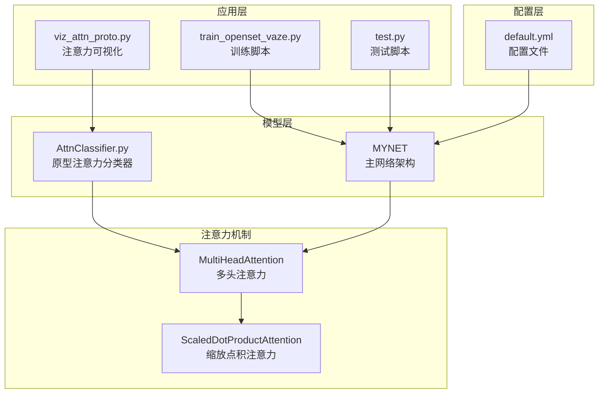
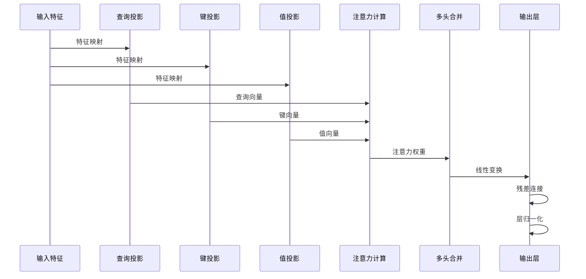
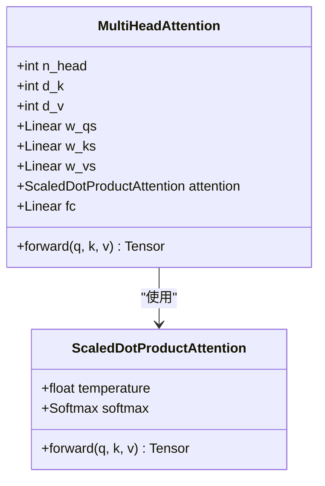
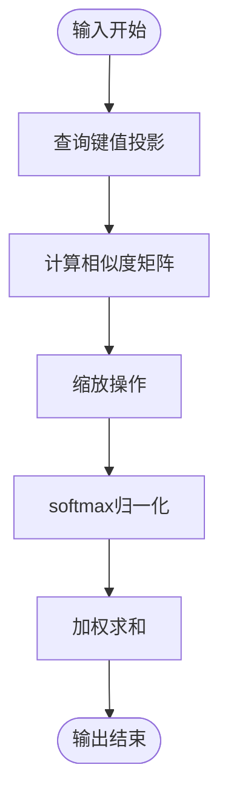
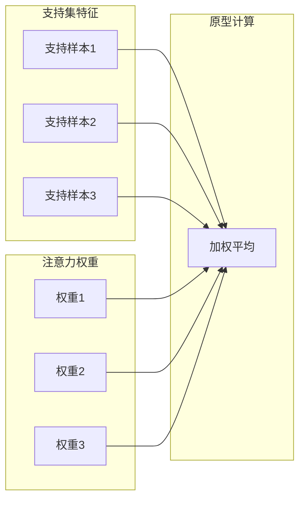
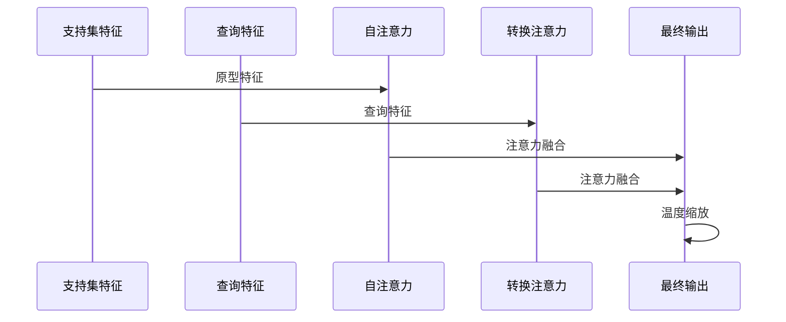
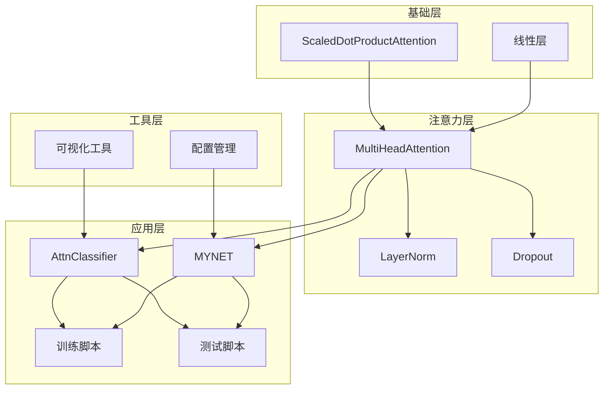

# 注意力机制实现

<cite>
**本文档引用的文件**
- [models/AttnClassifier.py](file://models/AttnClassifier.py)
- [network.py](file://network.py)
- [scripts/viz_attn_proto.py](file://scripts/viz_attn_proto.py)
- [configs/default.yml](file://configs/default.yml)
- [train_openset_vaze.py](file://train_openset_vaze.py)
- [test.py](file://test.py)
- [models/resnet_enhancer.py](file://models/resnet_enhancer.py)
</cite>

## 目录
1. [简介](#简介)
2. [项目结构](#项目结构)
3. [核心组件](#核心组件)
4. [架构概览](#架构概览)
5. [详细组件分析](#详细组件分析)
6. [依赖关系分析](#依赖关系分析)
7. [性能考虑](#性能考虑)
8. [故障排除指南](#故障排除指南)
9. [结论](#结论)

## 简介

VAZE项目实现了基于注意力机制的原型学习方法，专注于开放集识别任务。该项目的核心创新在于将多头注意力机制集成到原型生成和特征融合过程中，通过注意力权重动态计算支持集特征的加权组合，实现更鲁棒的原型学习。

本文档深入解析了VAZE项目中注意力机制的实现细节，包括多头注意力机制的设计原理、数学基础、实现架构以及在网络中的具体应用场景。

## 项目结构

VAZE项目采用模块化的架构设计，注意力机制主要分布在以下模块中：



**图表来源**
- [models/AttnClassifier.py:1-369](file://models/AttnClassifier.py#L1-L369)
- [network.py:18-724](file://network.py#L18-L724)
- [scripts/viz_attn_proto.py:1-120](file://scripts/viz_attn_proto.py#L1-L120)

**章节来源**
- [models/AttnClassifier.py:1-369](file://models/AttnClassifier.py#L1-L369)
- [network.py:18-724](file://network.py#L18-L724)

## 核心组件

VAZE项目中的注意力机制实现主要由以下几个核心组件构成：

### 1. 多头注意力模块 (MultiHeadAttention)

多头注意力机制是VAZE项目的核心创新点，它允许模型同时关注输入序列的不同子空间，从而捕获更丰富的语义信息。

### 2. 缩放点积注意力 (ScaledDotProductAttention)

缩放点积注意力是注意力机制的基础组件，负责计算查询、键、值之间的注意力权重。

### 3. 原型注意力分类器 (AttnClassifier)

结合了注意力机制的原型学习分类器，专门用于开放集识别任务中的原型生成和特征融合。

**章节来源**
- [models/AttnClassifier.py:274-350](file://models/AttnClassifier.py#L274-L350)
- [network.py:538-585](file://network.py#L538-L585)

## 架构概览

VAZE项目的注意力机制架构采用了分层设计，从底层的缩放点积注意力到高层的多头注意力，再到具体的原型学习应用：



**图表来源**
- [models/AttnClassifier.py:299-326](file://models/AttnClassifier.py#L299-L326)
- [network.py:561-584](file://network.py#L561-L584)

## 详细组件分析

### 多头注意力机制实现

#### 数学原理

多头注意力机制的核心数学公式如下：

```
MultiHead(Q, K, V) = Concat(head1, ..., headh)W^O
```

其中：
```
headi = Attention(QW_i^Q, KW_i^K, VW_i^V)
```

注意力权重计算公式：
```
Attention(Q, K, V) = softmax((QK^T)/√dk)V
```

#### 实现细节



**图表来源**
- [models/AttnClassifier.py:274-350](file://models/AttnClassifier.py#L274-L350)
- [network.py:538-585](file://network.py#L538-L585)

#### 关键实现特点

1. **并行处理**: 多个注意力头并行计算，提高计算效率
2. **维度分解**: 将高维特征分解为多个低维子空间
3. **残差连接**: 保持梯度流动，稳定训练过程
4. **层归一化**: 改善训练稳定性

**章节来源**
- [models/AttnClassifier.py:274-326](file://models/AttnClassifier.py#L274-L326)
- [network.py:538-584](file://network.py#L538-L584)

### 缩放点积注意力实现

#### 数学基础

缩放点积注意力通过以下步骤计算注意力权重：

1. **相似度计算**: `score = QK^T`
2. **缩放操作**: `score = score/√dk`
3. **softmax归一化**: `attn = softmax(score)`
4. **加权求和**: `output = attn × V`

#### 实现架构



**图表来源**
- [models/AttnClassifier.py:331-350](file://models/AttnClassifier.py#L331-L350)
- [network.py:519-536](file://network.py#L519-L536)

**章节来源**
- [models/AttnClassifier.py:331-350](file://models/AttnClassifier.py#L331-L350)
- [network.py:519-536](file://network.py#L519-L536)

### 原型注意力分类器

#### 设计理念

原型注意力分类器结合了传统原型学习和注意力机制的优势，通过注意力权重动态调整支持集特征的贡献度：



**图表来源**
- [models/AttnClassifier.py:121-185](file://models/AttnClassifier.py#L121-L185)

#### 核心功能

1. **支持集校准**: 使用注意力机制对支持集特征进行加权
2. **负原型生成**: 基于注意力权重生成伪类原型
3. **语义融合**: 结合视觉特征和语义信息进行特征融合

**章节来源**
- [models/AttnClassifier.py:121-185](file://models/AttnClassifier.py#L121-L185)

### 主网络架构中的注意力应用

#### 自注意力机制

在主网络MYNET中，注意力机制主要用于：

1. **原型注意力**: `self.slf_attn` - 自注意力机制用于原型特征的融合
2. **转换注意力**: `self.transatt_proto` - 用于查询和原型之间的注意力计算

#### 实现流程



**图表来源**
- [network.py:31-32](file://network.py#L31-L32)
- [network.py:270-279](file://network.py#L270-L279)

**章节来源**
- [network.py:31-32](file://network.py#L31-L32)
- [network.py:270-279](file://network.py#L270-L279)

## 依赖关系分析

VAZE项目中注意力机制的依赖关系呈现层次化结构：



**图表来源**
- [models/AttnClassifier.py:274-350](file://models/AttnClassifier.py#L274-L350)
- [network.py:538-585](file://network.py#L538-L585)
- [scripts/viz_attn_proto.py:1-120](file://scripts/viz_attn_proto.py#L1-L120)

**章节来源**
- [models/AttnClassifier.py:274-350](file://models/AttnClassifier.py#L274-L350)
- [network.py:538-585](file://network.py#L538-L585)

## 性能考虑

### 计算复杂度分析

多头注意力机制的时间复杂度为O(n²d)，其中n是序列长度，d是特征维度。空间复杂度为O(n²)用于存储注意力权重矩阵。

### 优化策略

1. **内存优化**: 使用分块计算避免大矩阵运算
2. **并行化**: 多头并行处理提高计算效率
3. **混合精度**: 使用半精度浮点数减少内存占用
4. **梯度检查点**: 减少反向传播时的内存消耗

### 超参数调优

| 参数 | 默认值 | 调优建议 | 影响范围 |
|------|--------|----------|----------|
| n_head | 1 | 2, 4, 8 | 注意力并行度 |
| d_k | 特征维度 | 32, 64, 128 | 注意力深度 |
| dropout | 0.1 | 0.0-0.5 | 正则化强度 |
| temperature | 1.0 | 0.1-10.0 | 注意力分布平滑度 |

**章节来源**
- [configs/default.yml:42-45](file://configs/default.yml#L42-L45)

## 故障排除指南

### 常见问题及解决方案

#### 1. 注意力权重异常

**症状**: 注意力权重出现NaN或无穷大值

**原因分析**:
- 学习率过高导致梯度爆炸
- 初始化不当
- 数值不稳定

**解决方法**:
- 降低学习率
- 检查梯度裁剪
- 使用稳定的softmax实现

#### 2. 内存不足

**症状**: 训练过程中出现内存溢出

**解决方法**:
- 减少批次大小
- 使用梯度检查点
- 降低特征维度
- 优化注意力头数

#### 3. 收敛缓慢

**症状**: 模型训练效果不佳，收敛速度慢

**解决方法**:
- 调整学习率调度策略
- 增加批归一化
- 使用更好的初始化方法
- 检查数据预处理

**章节来源**
- [scripts/viz_attn_proto.py:96-115](file://scripts/viz_attn_proto.py#L96-L115)

## 结论

VAZE项目成功地将注意力机制集成到原型学习框架中，实现了更加鲁棒和灵活的开放集识别方法。通过多头注意力机制，模型能够动态地关注支持集特征的不同方面，从而生成更准确的原型表示。

### 主要贡献

1. **理论创新**: 将注意力机制与原型学习相结合，提出新的特征融合方法
2. **实现优化**: 设计高效的多头注意力实现，支持大规模特征处理
3. **应用拓展**: 在开放集识别任务中验证了注意力机制的有效性
4. **可视化工具**: 提供完整的注意力权重可视化工具链

### 未来发展方向

1. **自适应注意力**: 开发自适应的注意力权重计算方法
2. **跨模态融合**: 探索多模态特征的注意力融合
3. **实时应用**: 优化注意力机制以支持实时推理
4. **理论分析**: 深入分析注意力机制的理论性质和收敛性

通过持续的改进和优化，VAZE项目的注意力机制实现为开放集识别领域提供了有价值的参考和实践指导。