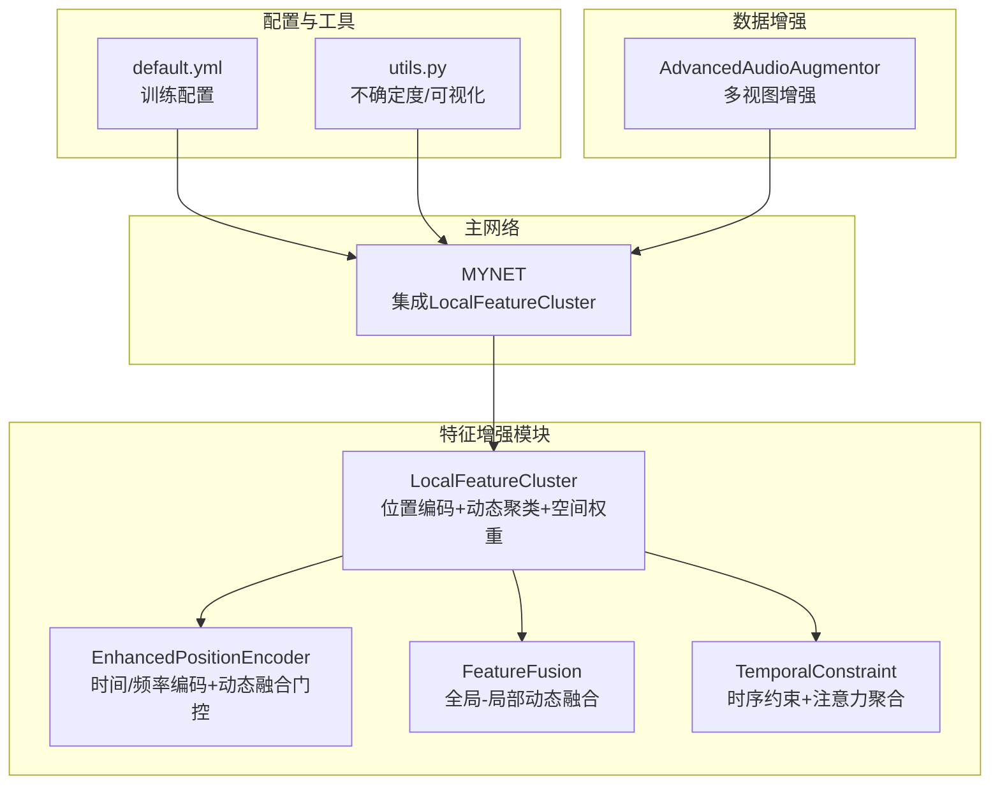
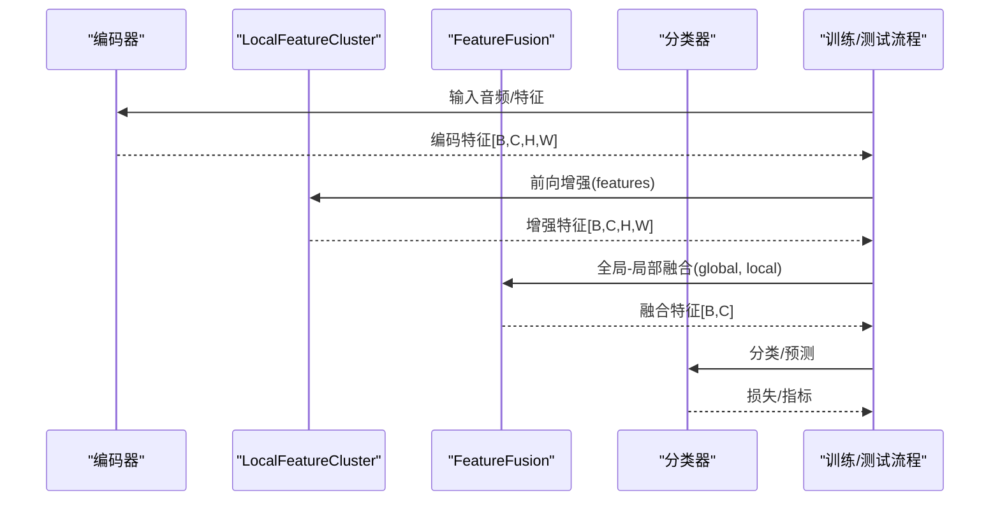
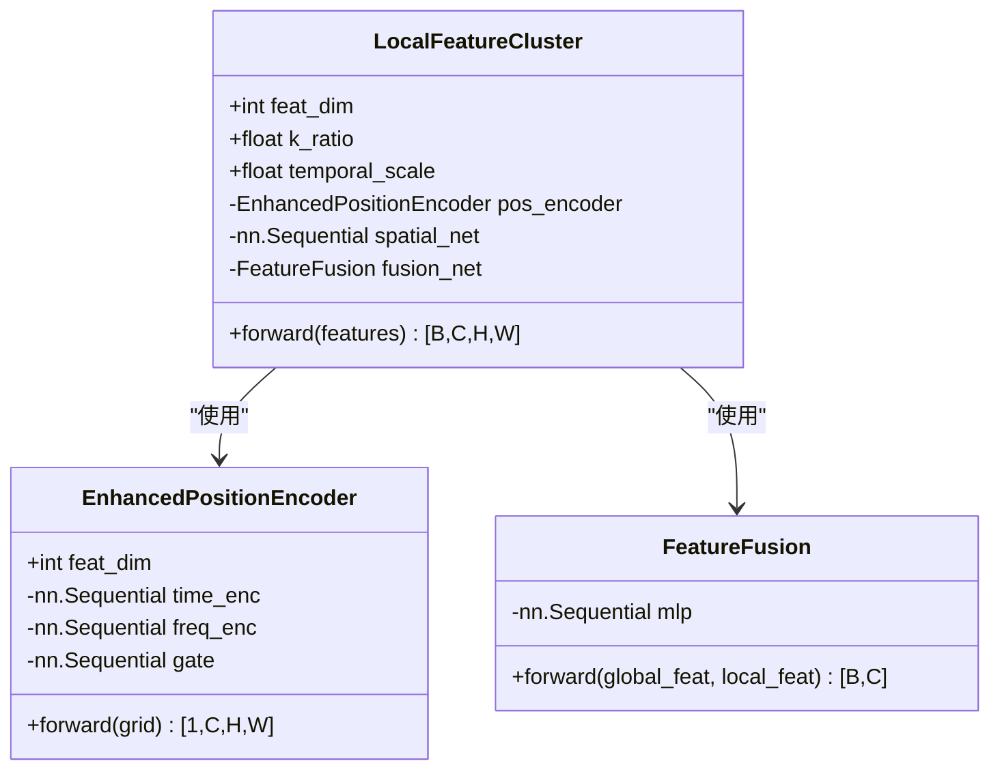
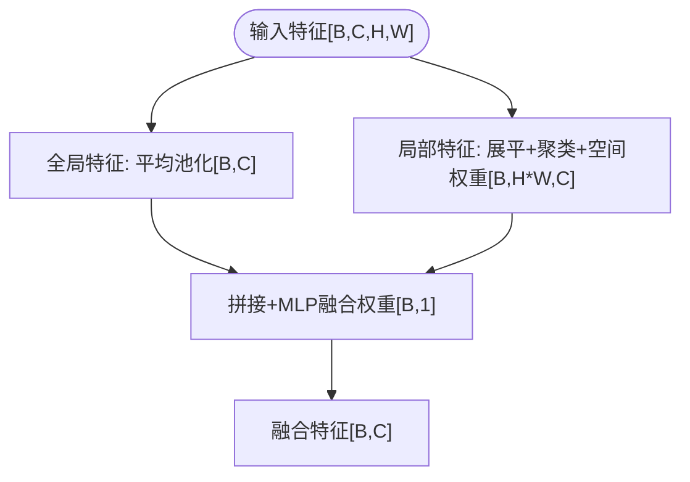
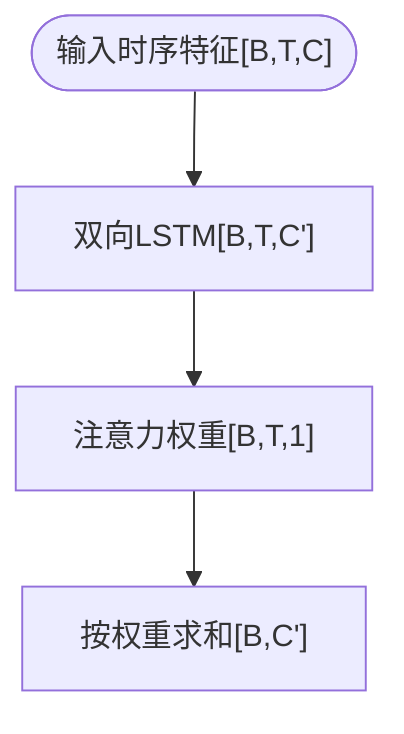
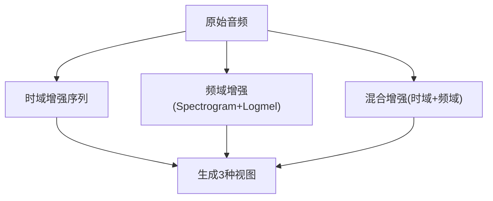
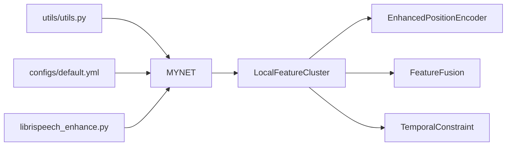

# 特征增强系统

<cite>
**本文档引用的文件**
- [feature_enhancer.py](file://models/feature_enhancer.py)
- [enhance_module.py](file://enhance_module.py)
- [resnet_enhancer.py](file://models/resnet_enhancer.py)
- [network.py](file://network.py)
- [default.yml](file://configs/default.yml)
- [utils.py](file://utils/utils.py)
- [train.py](file://train.py)
- [test.py](file://test.py)
- [librispeech_enhance.py](file://librispeech_enhance.py)
</cite>

## 目录
1. [简介](#简介)
2. [项目结构](#项目结构)
3. [核心组件](#核心组件)
4. [架构总览](#架构总览)
5. [详细组件分析](#详细组件分析)
6. [依赖关系分析](#依赖关系分析)
7. [性能考量](#性能考量)
8. [故障排查指南](#故障排查指南)
9. [结论](#结论)
10. [附录](#附录)

## 简介
本文件面向VAZE项目中的特征增强系统，系统性阐述局部特征聚类(LocalFeatureCluster)、全局特征增强、特征融合策略等核心功能的设计理念与实现方法。重点说明特征增强如何结合全局与局部特征信息以提升模型在增量学习与开放世界场景下的性能表现，并提供配置参数说明、使用方法与效果分析路径。

## 项目结构
特征增强系统主要分布在以下模块：
- models/feature_enhancer.py：提供基于原型中心的局部特征增强模块，强调时序约束与动态权重聚合。
- enhance_module.py：提供位置编码、动态融合门控与特征融合策略，支持全局与局部特征的自适应融合。
- models/resnet_enhancer.py：针对ResNet中间层特征的局部聚类增强，集成空间权重与残差连接。
- network.py：主网络MYNET中集成LocalFeatureCluster，作为特征增强模块接入点。
- configs/default.yml：训练配置，包含特征维度、批次大小、学习率等关键参数。
- utils/utils.py：通用工具函数，包含不确定度计算与特征增强可视化辅助。
- train.py/test.py：训练与测试流程中对特征增强模块的调用与评估。
- librispeech_enhance.py：音频数据增强器，提供多视图增强策略，服务于特征增强训练。

**图表来源**
- [enhance_module.py:14-160](file://enhance_module.py#L14-L160)
- [resnet_enhancer.py:51-172](file://models/resnet_enhancer.py#L51-L172)
- [feature_enhancer.py:27-93](file://models/feature_enhancer.py#L27-L93)
- [network.py:18-36](file://network.py#L18-L36)
- [default.yml:1-88](file://configs/default.yml#L1-L88)
- [utils.py:23-60](file://utils/utils.py#L23-L60)
- [librispeech_enhance.py:17-134](file://librispeech_enhance.py#L17-L134)

**章节来源**
- [network.py:18-36](file://network.py#L18-L36)
- [enhance_module.py:14-160](file://enhance_module.py#L14-L160)
- [resnet_enhancer.py:51-172](file://models/resnet_enhancer.py#L51-L172)
- [feature_enhancer.py:27-93](file://models/feature_enhancer.py#L27-L93)
- [default.yml:1-88](file://configs/default.yml#L1-L88)
- [utils.py:23-60](file://utils/utils.py#L23-L60)
- [librispeech_enhance.py:17-134](file://librispeech_enhance.py#L17-L134)

## 核心组件
- 局部特征聚类(LocalFeatureCluster)：通过位置编码增强空间感知，采用KMeans动态聚类与空间相似度加权，结合空间权重网络实现局部细节与全局结构的融合。
- 全局特征增强：通过均值池化提取全局特征，结合动态融合门控实现全局-局部的自适应融合。
- 特征融合策略：提供MLP融合与注意力融合两种方式，支持动态权重计算与数值稳定性保障。
- 时序约束(TemporalConstraint)：利用LSTM+注意力对时序特征进行约束与聚合，提升时序稳定性。
- 音频多视图增强：提供时域、频域与混合增强策略，丰富训练样本多样性。

**章节来源**
- [enhance_module.py:70-148](file://enhance_module.py#L70-L148)
- [resnet_enhancer.py:51-172](file://models/resnet_enhancer.py#L51-L172)
- [feature_enhancer.py:5-26](file://models/feature_enhancer.py#L5-L26)
- [librispeech_enhance.py:17-134](file://librispeech_enhance.py#L17-L134)

## 架构总览
特征增强系统在主网络MYNET中被集成，作为特征前置增强模块，先对编码器输出的特征进行增强，再进入分类器与后续任务模块。训练与测试流程中，可通过配置文件调整特征维度、聚类比例与融合策略。

**图表来源**
- [network.py:36-49](file://network.py#L36-L49)
- [enhance_module.py:14-29](file://enhance_module.py#L14-L29)
- [resnet_enhancer.py:149-160](file://models/resnet_enhancer.py#L149-L160)

## 详细组件分析

### 局部特征聚类(LocalFeatureCluster)
- 设计理念：在空间网格上引入位置编码，增强空间感知；通过KMeans对展平特征进行动态聚类，结合空间相似度矩阵对聚类中心进行时序加权，最后通过空间权重网络实现局部细节与全局结构的融合。
- 关键实现要点：
  - 位置编码：分别对时间轴与频率轴进行卷积编码，并通过动态融合门控进行加权融合。
  - 动态聚类：构建空间位置相似度矩阵，使用KMeans进行批量聚类，避免频繁CPU-GPU交互。
  - 空间权重：通过MLP计算空间权重，控制局部聚类特征与原增强特征的融合比例。
  - 融合策略：提供FeatureFusion模块，动态计算融合权重，实现全局与局部特征的自适应融合。

**图表来源**
- [enhance_module.py:70-148](file://enhance_module.py#L70-L148)
- [enhance_module.py:30-69](file://enhance_module.py#L30-L69)
- [enhance_module.py:14-29](file://enhance_module.py#L14-L29)

**章节来源**
- [enhance_module.py:70-148](file://enhance_module.py#L70-L148)
- [enhance_module.py:30-69](file://enhance_module.py#L30-L69)
- [enhance_module.py:14-29](file://enhance_module.py#L14-L29)

### 全局特征增强与融合策略
- 全局特征提取：通过对特征图进行全局平均池化，得到全局特征表示。
- 局部特征增强：通过聚类与空间权重网络，得到局部增强特征。
- 动态融合：使用MLP融合模块，将全局与局部特征拼接后预测融合权重，实现自适应融合。

**图表来源**
- [enhance_module.py:14-29](file://enhance_module.py#L14-L29)
- [enhance_module.py:59-113](file://enhance_module.py#L59-L113)

**章节来源**
- [enhance_module.py:14-29](file://enhance_module.py#L14-L29)
- [enhance_module.py:59-113](file://enhance_module.py#L59-L113)

### 时序约束(TemporalConstraint)
- 设计目的：对时序特征进行约束与聚合，提升时序稳定性与鲁棒性。
- 实现方式：使用双向LSTM提取时序特征，配合注意力层对时间步进行加权聚合。

**图表来源**
- [feature_enhancer.py:5-26](file://models/feature_enhancer.py#L5-L26)

**章节来源**
- [feature_enhancer.py:5-26](file://models/feature_enhancer.py#L5-L26)

### 音频多视图增强
- 设计目的：通过时域、频域与混合增强策略，生成多样化的训练视图，提升模型泛化能力。
- 实现方式：提供AdvancedAudioAugmentor，支持随机裁剪、音高变换、时间拉伸、噪声添加与SpecAugmentation等增强操作。

**图表来源**
- [librispeech_enhance.py:17-134](file://librispeech_enhance.py#L17-L134)

**章节来源**
- [librispeech_enhance.py:17-134](file://librispeech_enhance.py#L17-L134)

## 依赖关系分析
- MYNET主网络集成LocalFeatureCluster作为特征增强模块，负责在分类前对特征进行增强与融合。
- enhance_module.py与resnet_enhancer.py提供两套增强实现：一套面向通用特征图，一套面向ResNet中间层特征。
- utils/utils.py提供不确定度计算与可视化辅助，支撑特征增强效果评估。
- configs/default.yml提供训练配置，影响特征维度、批次大小与学习率等关键参数。

**图表来源**
- [network.py:18-36](file://network.py#L18-L36)
- [enhance_module.py:70-148](file://enhance_module.py#L70-L148)
- [resnet_enhancer.py:51-172](file://models/resnet_enhancer.py#L51-L172)
- [utils.py:23-60](file://utils/utils.py#L23-L60)
- [default.yml:1-88](file://configs/default.yml#L1-L88)
- [librispeech_enhance.py:17-134](file://librispeech_enhance.py#L17-L134)

**章节来源**
- [network.py:18-36](file://network.py#L18-L36)
- [enhance_module.py:70-148](file://enhance_module.py#L70-L148)
- [resnet_enhancer.py:51-172](file://models/resnet_enhancer.py#L51-L172)
- [utils.py:23-60](file://utils/utils.py#L23-L60)
- [default.yml:1-88](file://configs/default.yml#L1-L88)
- [librispeech_enhance.py:17-134](file://librispeech_enhance.py#L17-L134)

## 性能考量
- 设备一致性：各模块通过设备跟踪与参数迁移，确保在不同设备上的一致性与稳定性。
- 数值稳定性：在softmax与注意力计算中加入数值稳定项，防止溢出与NaN。
- 批量聚类优化：在resnet_enhancer中采用一次性CPU-GPU交互的批量KMeans，减少CPU-GPU往返开销。
- 动态融合权重：通过MLP与注意力机制计算融合权重，提升特征表达的自适应性与鲁棒性。
- 不确定度评估：通过MC Dropout与特征掩码计算不确定度，辅助增量学习与开放世界场景的样本筛选。

**章节来源**
- [enhance_module.py:149-160](file://enhance_module.py#L149-L160)
- [resnet_enhancer.py:100-110](file://models/resnet_enhancer.py#L100-L110)
- [utils.py:23-60](file://utils/utils.py#L23-L60)

## 故障排查指南
- 维度不匹配：在特征增强过程中，若输入特征维度与模块期望不符，需检查维度修正层与通道数设置。
- 设备不一致：若出现设备不一致错误，检查模块的设备跟踪与迁移逻辑。
- 聚类异常：若KMeans聚类失败，检查特征是否在CPU上进行聚类，以及聚类数设置是否合理。
- 融合权重异常：若融合权重为常数或NaN，检查MLP与注意力模块的输入与数值稳定性设置。
- 不确定度计算异常：若不确定度为无穷大或NaN，检查MC Dropout开关与特征掩码设置。

**章节来源**
- [enhance_module.py:149-160](file://enhance_module.py#L149-L160)
- [resnet_enhancer.py:100-110](file://models/resnet_enhancer.py#L100-L110)
- [utils.py:23-60](file://utils/utils.py#L23-L60)

## 结论
VAZE项目的特征增强系统通过局部特征聚类、全局特征增强与动态融合策略，实现了对空间与时序信息的有效建模。系统在保证数值稳定性与设备一致性的前提下，提供了灵活的配置选项与高效的实现方式，能够显著提升模型在增量学习与开放世界场景下的性能表现。建议在实际应用中根据任务需求调整聚类比例、融合策略与增强策略，以获得最佳效果。

## 附录

### 配置参数说明
- 训练配置：包含way、shot、num_session、num_base、num_novel、num_all、epochs、lr、scheduler、optimizer、network、strategy、episode、dataloader等关键参数。
- 音频配置：包含采样率、窗长、步长、Mel滤波器数量、频率范围与窗口类型等。

**章节来源**
- [default.yml:1-88](file://configs/default.yml#L1-L88)

### 使用方法
- 在主网络MYNET中集成LocalFeatureCluster，作为特征增强模块接入点。
- 在训练与测试流程中，调用特征增强模块对编码器输出的特征进行增强与融合。
- 通过配置文件调整特征维度、聚类比例与学习率等参数，以适配不同任务需求。

**章节来源**
- [network.py:36-49](file://network.py#L36-L49)
- [enhance_module.py:14-29](file://enhance_module.py#L14-L29)
- [resnet_enhancer.py:149-160](file://models/resnet_enhancer.py#L149-L160)