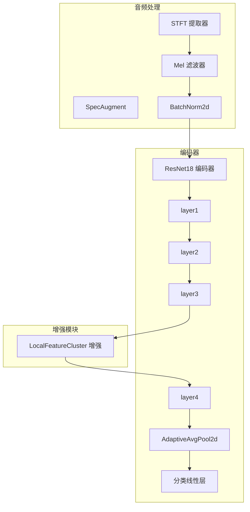
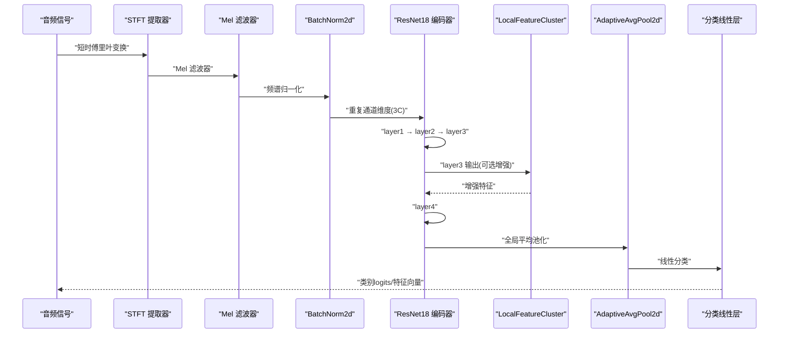
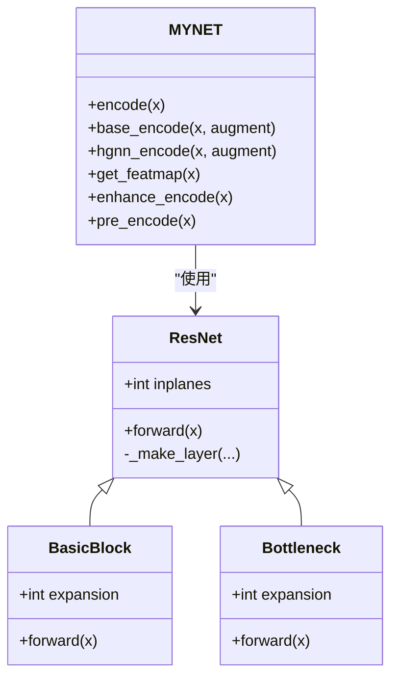
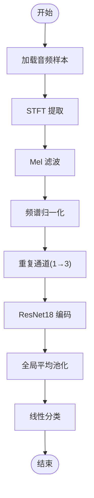
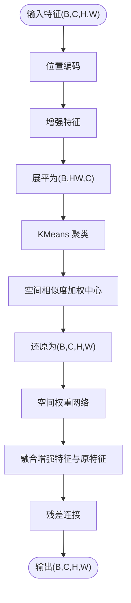
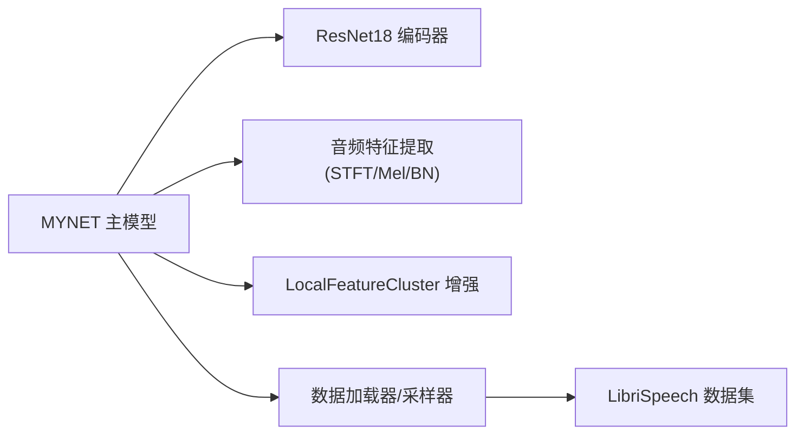

# ResNet18编码器

<cite>
**本文档引用的文件**
- [resnet18_encoder.py](file://models/resnet18_encoder.py)
- [network.py](file://network.py)
- [resnet_enhancer.py](file://models/resnet_enhancer.py)
- [default.yml](file://configs/default.yml)
- [librispeech.py](file://data/librispeech.py)
- [dataloader.py](file://data/dataloader.py)
</cite>

## 目录
1. [简介](#简介)
2. [项目结构](#项目结构)
3. [核心组件](#核心组件)
4. [架构总览](#架构总览)
5. [详细组件分析](#详细组件分析)
6. [依赖关系分析](#依赖关系分析)
7. [性能考虑](#性能考虑)
8. [故障排查指南](#故障排查指南)
9. [结论](#结论)
10. [附录](#附录)

## 简介
本文件面向ResNet18编码器在音频特征提取中的应用，系统阐述其网络结构、残差连接机制、特征提取流程、输入输出规格、与音频处理模块的集成方式、预训练权重使用、可训练参数配置及性能优化策略。文档同时提供代码级架构图、序列图与流程图，帮助读者快速理解并高效使用该编码器。

## 项目结构
ResNet18编码器位于模型层，配合音频特征提取模块（STFT、Mel滤波器）、分类器与增量学习框架共同工作。关键文件与职责如下：
- models/resnet18_encoder.py：ResNet18实现（含BasicBlock、Bottleneck、ResNet主干、预训练权重加载）
- models/resnet_enhancer.py：局部特征增强模块（位置编码、聚类融合、残差连接）
- network.py：MYNET主模型，封装音频特征提取、ResNet18编码、分类器与推理流程
- configs/default.yml：默认超参数（采样率、窗长、步长、Mel bins、温度等）
- data/librispeech.py：LibriSpeech数据集读取与元学习episode构造
- data/dataloader.py：数据加载器与采样器，支撑增量学习与开放集测试

**图表来源**
- [network.py:326-518](file://network.py#L326-L518)
- [resnet18_encoder.py:240-334](file://models/resnet18_encoder.py#L240-L334)
- [resnet_enhancer.py:51-160](file://models/resnet_enhancer.py#L51-L160)

**章节来源**
- [resnet18_encoder.py:1-471](file://models/resnet18_encoder.py#L1-L471)
- [network.py:18-518](file://network.py#L18-L518)
- [resnet_enhancer.py:1-172](file://models/resnet_enhancer.py#L1-L172)
- [default.yml:1-88](file://configs/default.yml#L1-L88)
- [librispeech.py:1-200](file://data/librispeech.py#L1-L200)
- [dataloader.py:1-351](file://data/dataloader.py#L1-L351)

## 核心组件
- ResNet18编码器：基于BasicBlock构建，包含四层卷积块，采用残差连接与下采样策略，输出512维通道特征图（空间分辨率逐步降低）
- 预训练权重：支持从PyTorch官方下载ImageNet预训练权重，并去除分类头参数后加载至编码器
- 音频特征提取：STFT转频谱，Logmel滤波器转Mel频谱，BN归一化，重复通道维度以适配3通道输入
- 局部特征增强：在layer3后引入LocalFeatureCluster，结合位置编码、空间相似度加权聚类与残差融合，提升局部细节表达
- 分类器：线性分类器将512维特征映射到类别空间，支持点积与余弦两种分类策略

**章节来源**
- [resnet18_encoder.py:157-334](file://models/resnet18_encoder.py#L157-L334)
- [network.py:24-28](file://network.py#L24-L28)
- [network.py:471-518](file://network.py#L471-L518)
- [resnet_enhancer.py:51-160](file://models/resnet_enhancer.py#L51-L160)

## 架构总览
MYNET将音频信号经STFT/Mel转换后送入ResNet18编码器，输出特征图经自适应池化降维为向量，再进入分类器。在特定模式下，可在layer3后接入局部特征增强模块，进一步提升特征表达能力。

**图表来源**
- [network.py:471-518](file://network.py#L471-L518)
- [resnet18_encoder.py:240-334](file://models/resnet18_encoder.py#L240-L334)
- [resnet_enhancer.py:51-160](file://models/resnet_enhancer.py#L51-L160)

## 详细组件分析

### ResNet18编码器实现
- 结构组成
  - BasicBlock：两层3×3卷积，带残差跳跃，支持stride=2时的下采样
  - Bottleneck：1×1→3×3→1×1堆叠，用于更深网络
  - ResNet主干：conv1→bn1→relu→maxpool→layer1→layer2→layer3→layer4→avgpool（注：MYNET中未使用avgpool，直接在编码器外侧做全局池化）
- 残差连接机制
  - 若存在下采样或通道变化，downsample子层负责对skip输入进行1×1卷积与BN以匹配维度
  - 残差与卷积输出相加，激活后输出
- 预训练权重加载
  - 支持从model_urls字典下载对应arch的预训练权重
  - 加载时剔除分类头参数，更新编码器state_dict
- 可训练参数
  - 默认冻结编码器参数，仅训练分类器（MYNET中通过优化器参数选择实现）
  - 可在增量阶段开启编码器微调（见MYNET的update_fc_ft）

**图表来源**
- [resnet18_encoder.py:157-334](file://models/resnet18_encoder.py#L157-L334)
- [network.py:18-518](file://network.py#L18-L518)

**章节来源**
- [resnet18_encoder.py:157-334](file://models/resnet18_encoder.py#L157-L334)
- [resnet18_encoder.py:337-471](file://models/resnet18_encoder.py#L337-L471)

### 音频特征提取与集成
- 音频到特征流
  - STFT提取器：n_fft、hop_length、window等参数来自配置
  - Logmel滤波器：n_mels、fmin、fmax等参数来自配置
  - BatchNorm2d：对Mel频谱进行通道维度归一化
  - 重复通道：将单通道Mel频谱复制为3通道以适配ResNet输入
- 编码器集成
  - MYNET.encode：完整路径（STFT→Mel→BN→重复通道→编码器→全局池化→分类）
  - MYNET.enhance_encode：在layer3后接入LocalFeatureCluster增强
  - MYNET.pre_encode：仅到layer2，便于中间特征可视化或调试
- 数据集与采样
  - LibriSpeech数据集支持训练/验证/测试划分，元学习episode构造
  - 数据加载器支持随机种子固定、多进程并行与pin_memory

**图表来源**
- [network.py:471-518](file://network.py#L471-L518)
- [default.yml:77-85](file://configs/default.yml#L77-L85)

**章节来源**
- [network.py:326-518](file://network.py#L326-L518)
- [librispeech.py:21-200](file://data/librispeech.py#L21-L200)
- [dataloader.py:19-81](file://data/dataloader.py#L19-L81)

### 局部特征增强模块
- 功能概述
  - EnhancedPositionEncoder：对网格坐标进行时间/频率方向的卷积位置编码
  - LocalFeatureCluster：对增强后的特征进行展平、KMeans聚类、空间相似度加权中心计算、与原特征融合
  - 残差连接：保证增强不破坏原始特征，稳定训练
- 关键流程
  - 生成网格坐标并进行位置编码
  - 展平特征[B, C, H, W]→[B, HW, C]，按比例k聚类
  - 基于空间相似度矩阵对聚类中心进行加权融合
  - 空间权重网络控制融合比例，最终输出[B, C, H, W]

**图表来源**
- [resnet_enhancer.py:51-160](file://models/resnet_enhancer.py#L51-L160)

**章节来源**
- [resnet_enhancer.py:51-160](file://models/resnet_enhancer.py#L51-L160)

### 预训练权重与可训练参数配置
- 预训练权重
  - 支持从model_urls下载对应arch的预训练权重
  - 加载时剔除分类头参数，更新编码器state_dict
- 可训练参数
  - 默认仅训练分类器（MYNET中通过优化器参数选择实现）
  - 增量阶段可通过update_fc_ft对新增类别的fc参数进行微调
- 超参数
  - 采样率、窗长、步长、Mel bins、窗口类型等由配置文件提供
  - 温度参数用于余弦分类的缩放

**章节来源**
- [resnet18_encoder.py:133-143](file://models/resnet18_encoder.py#L133-L143)
- [resnet18_encoder.py:337-346](file://models/resnet18_encoder.py#L337-L346)
- [network.py:405-461](file://network.py#L405-L461)
- [default.yml:77-85](file://configs/default.yml#L77-L85)

## 依赖关系分析
- MYNET依赖ResNet18编码器与音频特征提取模块
- LocalFeatureCluster作为可选增强模块插入到layer3之后
- 数据加载器与数据集提供元学习episode，支撑编码器在不同场景下的训练与测试

**图表来源**
- [network.py:18-518](file://network.py#L18-L518)
- [resnet18_encoder.py:240-334](file://models/resnet18_encoder.py#L240-L334)
- [resnet_enhancer.py:51-160](file://models/resnet_enhancer.py#L51-L160)
- [dataloader.py:19-81](file://data/dataloader.py#L19-L81)

**章节来源**
- [network.py:18-518](file://network.py#L18-L518)
- [dataloader.py:19-81](file://data/dataloader.py#L19-L81)

## 性能考虑
- 计算效率
  - 使用自适应池化替代固定池化，减少参数量与计算开销
  - 在layer3后接入增强模块时，注意聚类计算的批处理与设备一致性，避免频繁CPU/GPU传输
- 内存占用
  - Mel频谱重复通道后显存增加，建议合理设置batch size与num_workers
  - 增量阶段仅更新新增类别的分类参数，减少内存压力
- 推理速度
  - 可在推理模式下关闭dropout与SpecAugment，提升速度
  - 使用冻结参数与BN统计值，减少前向计算开销

[本节为通用性能建议，无需具体文件分析]

## 故障排查指南
- 预训练权重加载失败
  - 检查网络连通性与缓存目录权限
  - 确认URL与文件名哈希匹配
- 特征维度不一致
  - 确认Mel频谱重复通道后为3通道输入
  - 检查增强模块输入输出维度是否匹配
- 增量学习效果不佳
  - 检查分类器参数更新逻辑与学习率调度
  - 确认新增类别的原型初始化与微调策略

**章节来源**
- [resnet18_encoder.py:18-112](file://models/resnet18_encoder.py#L18-L112)
- [network.py:405-461](file://network.py#L405-L461)

## 结论
ResNet18编码器通过残差连接与分层卷积实现了稳健的音频特征提取，结合STFT/Mel特征与可选的局部增强模块，在增量学习与开放集场景下具备良好的泛化能力。通过合理的预训练权重加载、参数配置与性能优化策略，可在多种音频任务中取得优异表现。

[本节为总结性内容，无需具体文件分析]

## 附录
- 使用示例（路径参考）
  - 创建MYNET并使用ResNet18编码器：[network.py:24](file://network.py#L24)
  - 音频特征提取与编码：[network.py:471-518](file://network.py#L471-L518)
  - 局部特征增强接入：[network.py:290-311](file://network.py#L290-L311)
  - 增量学习分类器更新：[network.py:405-461](file://network.py#L405-L461)
- 调优建议
  - 预训练权重：优先使用ImageNet预训练权重，加速收敛
  - 增量阶段：先平均原型初始化，再进行微调
  - 推理阶段：关闭dropout与SpecAugment，提升稳定性

[本节为补充信息，无需具体文件分析]