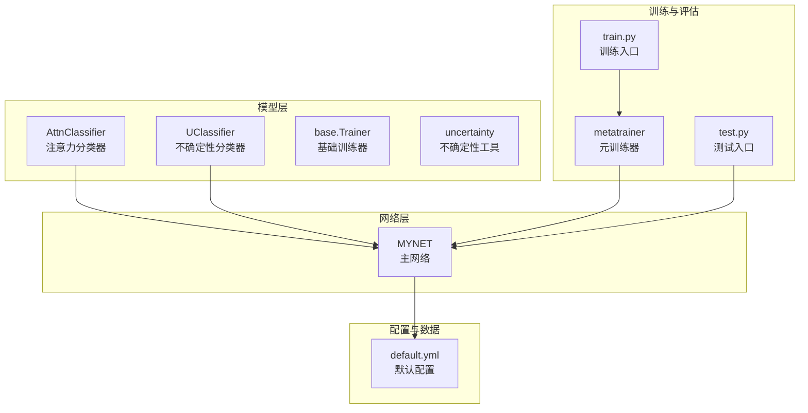
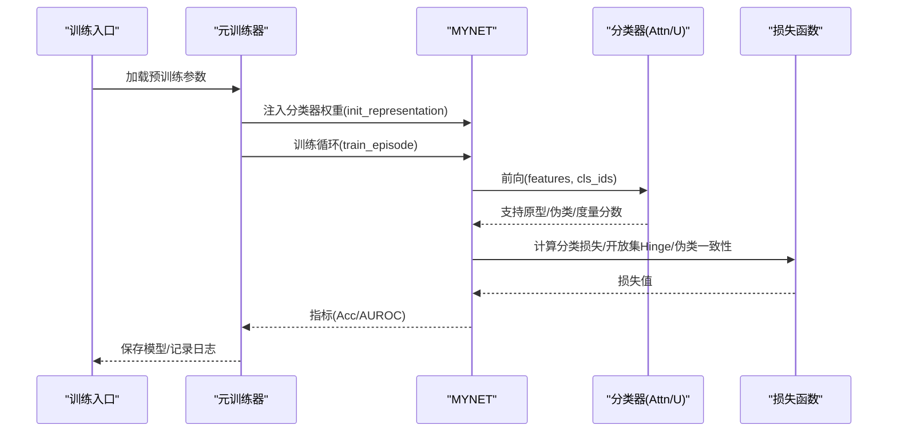
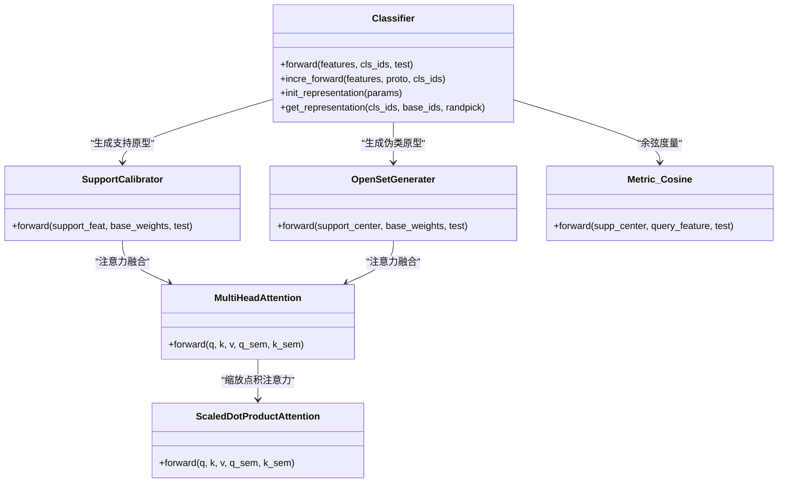
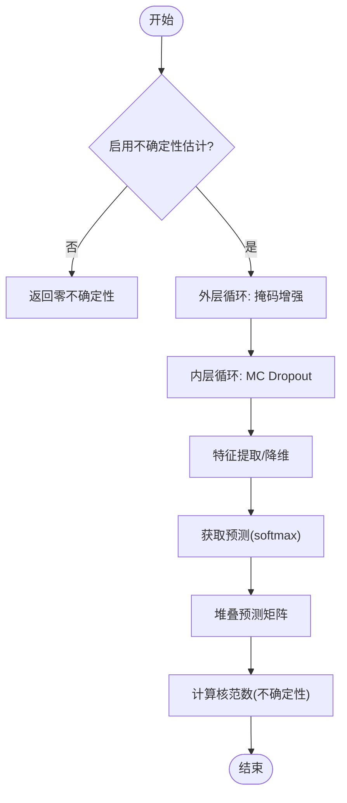
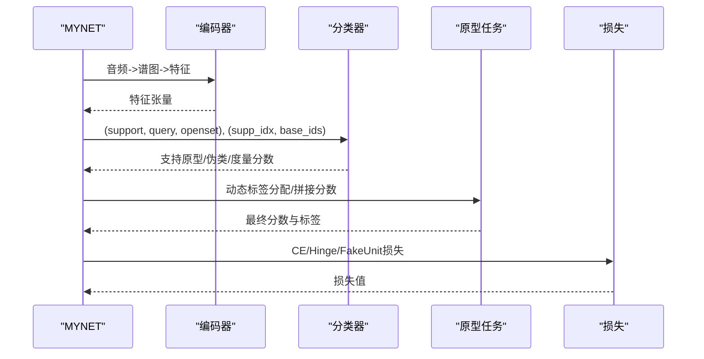
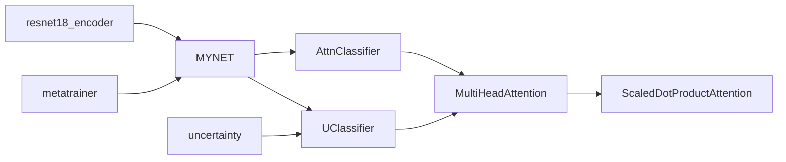

# 分类器系统

<cite>
**本文引用的文件列表**
- [AttnClassifier.py](file://models/AttnClassifier.py)
- [UClassifier.py](file://models/UClassifier.py)
- [base.py](file://models/base.py)
- [uncertainty.py](file://models/uncertainty.py)
- [metatrainer.py](file://models/metatrainer.py)
- [network.py](file://network.py)
- [default.yml](file://configs/default.yml)
- [train.py](file://train.py)
- [test.py](file://test.py)
- [resnet18_encoder.py](file://models/resnet18_encoder.py)
</cite>

## 目录
1. [简介](#简介)
2. [项目结构](#项目结构)
3. [核心组件](#核心组件)
4. [架构总览](#架构总览)
5. [详细组件分析](#详细组件分析)
6. [依赖关系分析](#依赖关系分析)
7. [性能与优化](#性能与优化)
8. [故障排查指南](#故障排查指南)
9. [结论](#结论)
10. [附录](#附录)

## 简介
本文件面向分类器系统的技术文档，聚焦注意力分类器与不确定性分类器的实现原理与工程细节，涵盖原型生成、余弦相似度度量、损失函数设计、输入输出格式、原型更新机制、动态标签分配、增量学习与开放集识别的应用路径。文档同时提供算法流程图、序列图与依赖关系图，帮助读者快速理解并高效使用该系统。

## 项目结构
- 模型层：注意力分类器、不确定性分类器、基础训练器基类、不确定性工具
- 网络层：MYNET主网络，封装音频特征提取、分类器、原型任务与预测
- 训练与评估：元训练器、训练入口、测试入口、配置文件
- 数据与工具：数据加载器、采样器、工具函数

图表来源
- [AttnClassifier.py:38-118](file://models/AttnClassifier.py#L38-L118)
- [UClassifier.py:7-41](file://models/UClassifier.py#L7-L41)
- [base.py:27-50](file://models/base.py#L27-L50)
- [metatrainer.py:17-86](file://models/metatrainer.py#L17-L86)
- [network.py:18-36](file://network.py#L18-L36)
- [default.yml:1-88](file://configs/default.yml#L1-L88)

章节来源
- [AttnClassifier.py:1-120](file://models/AttnClassifier.py#L1-L120)
- [UClassifier.py:1-41](file://models/UClassifier.py#L1-L41)
- [base.py:1-50](file://models/base.py#L1-L50)
- [metatrainer.py:1-86](file://models/metatrainer.py#L1-L86)
- [network.py:1-36](file://network.py#L1-L36)
- [default.yml:1-88](file://configs/default.yml#L1-L88)

## 核心组件
- 注意力分类器（AttnClassifier）：支持语义校准、多头注意力、余弦度量与伪类生成，提供训练与增量推理接口。
- 不确定性分类器（UClassifier）：在注意力分类器基础上新增MC Dropout与核范数不确定性估计，支持增量学习中的重要性加权更新。
- 主网络（MYNET）：封装音频特征提取、分类器调用、原型任务与预测、损失计算与动态标签分配。
- 基础训练器（base.Trainer）：提供数据集初始化、模型保存、替换基础分类器权重等通用能力。
- 元训练器（metatrainer）：负责预训练分类器权重注入、训练循环、指标评估与模型保存。

章节来源
- [AttnClassifier.py:38-118](file://models/AttnClassifier.py#L38-L118)
- [UClassifier.py:7-41](file://models/UClassifier.py#L7-L41)
- [network.py:18-50](file://network.py#L18-L50)
- [base.py:27-50](file://models/base.py#L27-L50)
- [metatrainer.py:17-86](file://models/metatrainer.py#L17-L86)

## 架构总览
系统采用“特征提取-原型生成-度量匹配-损失聚合”的流水线式架构。MYNET负责音频到特征的转换与分类器调用；AttnClassifier/UClassifier负责原型生成与度量；元训练器驱动分类器权重注入与训练。

图表来源
- [metatrainer.py:17-86](file://models/metatrainer.py#L17-L86)
- [network.py:102-151](file://network.py#L102-L151)
- [AttnClassifier.py:47-93](file://models/AttnClassifier.py#L47-L93)

章节来源
- [metatrainer.py:17-86](file://models/metatrainer.py#L17-L86)
- [network.py:102-151](file://network.py#L102-L151)
- [AttnClassifier.py:47-93](file://models/AttnClassifier.py#L47-L93)

## 详细组件分析

### 注意力分类器（AttnClassifier）
- 组件构成
  - SupportCalibrator：支持集原型校准，支持语义校准与多头注意力融合。
  - OpenSetGenerater：伪类生成器，支持语义融合、注意力引导与聚合策略。
  - MultiHeadAttention/ScaledDotProductAttention：多头注意力与缩放点积注意力。
  - Metric_Cosine：余弦相似度度量，温度参数可学习。
- 原型生成与噪声注入
  - 训练阶段对支持集特征添加噪声，缓解中心损失导致的特征坍缩。
  - 伪类生成使用带噪声的原型输入，提升边界生成稳定性。
- 动态标签分配
  - 对开放集样本，依据其“最像”已知类为其分配伪类标签，实现动态标签分配。
- 增量推理
  - 提供incre_forward接口，直接对新特征进行分类。

图表来源
- [AttnClassifier.py:38-118](file://models/AttnClassifier.py#L38-L118)
- [AttnClassifier.py:121-185](file://models/AttnClassifier.py#L121-L185)
- [AttnClassifier.py:188-271](file://models/AttnClassifier.py#L188-L271)
- [AttnClassifier.py:274-326](file://models/AttnClassifier.py#L274-L326)
- [AttnClassifier.py:331-349](file://models/AttnClassifier.py#L331-L349)
- [AttnClassifier.py:352-368](file://models/AttnClassifier.py#L352-L368)

章节来源
- [AttnClassifier.py:38-118](file://models/AttnClassifier.py#L38-L118)
- [AttnClassifier.py:121-185](file://models/AttnClassifier.py#L121-L185)
- [AttnClassifier.py:188-271](file://models/AttnClassifier.py#L188-L271)
- [AttnClassifier.py:274-326](file://models/AttnClassifier.py#L274-L326)
- [AttnClassifier.py:331-349](file://models/AttnClassifier.py#L331-L349)
- [AttnClassifier.py:352-368](file://models/AttnClassifier.py#L352-L368)

### 不确定性分类器（UClassifier）
- 新增组件
  - MC Dropout层：用于不确定性估计。
  - 不确定性配置：MC采样次数、掩码数量、掩码比例、是否使用核范数。
  - 重要性权重缓存：支持增量学习中的重要性加权更新。
- 不确定性估计流程
  - 在启用不确定性估计时，对特征进行多次随机掩码与Dropout扰动，计算预测矩阵的核范数作为不确定性度量。
  - 可根据不确定性计算重要性权重，低不确定性样本赋予更高权重。
- 增量学习更新
  - 提供基于重要性权重的加权交叉熵损失，指导增量学习更新。

图表来源
- [UClassifier.py:42-112](file://models/UClassifier.py#L42-L112)
- [uncertainty.py:5-55](file://models/uncertainty.py#L5-L55)

章节来源
- [UClassifier.py:7-41](file://models/UClassifier.py#L7-L41)
- [UClassifier.py:42-112](file://models/UClassifier.py#L42-L112)
- [uncertainty.py:5-55](file://models/uncertainty.py#L5-L55)

### 主网络（MYNET）
- 音频特征提取：STFT与LogMel滤波器，SpecAugmentation，ResNet18编码器。
- 分类器集成：将分类器嵌入网络，支持openmeta模式下的原型任务与预测。
- 动态标签分配：对开放集样本按“最像”已知类动态分配伪类标签。
- 损失函数：分类CE、开放集Hinge、伪类一致性损失，三者加权组合。
- 增量学习：支持替换基础分类器权重、微调新类原型、温度控制余弦相似度。

图表来源
- [network.py:102-151](file://network.py#L102-L151)
- [network.py:153-202](file://network.py#L153-L202)
- [AttnClassifier.py:47-93](file://models/AttnClassifier.py#L47-L93)

章节来源
- [network.py:18-50](file://network.py#L18-L50)
- [network.py:102-151](file://network.py#L102-L151)
- [network.py:153-202](file://network.py#L153-L202)
- [AttnClassifier.py:47-93](file://models/AttnClassifier.py#L47-L93)

### 基础训练器（base.Trainer）
- 数据集初始化：支持多种数据集，替换基础分类器权重。
- 模型保存与加载：保存最佳模型、记录训练日志。
- 评估与指标：综合性能指数、AUROC等。

章节来源
- [base.py:27-50](file://models/base.py#L27-L50)
- [base.py:111-151](file://models/base.py#L111-L151)
- [base.py:177-233](file://models/base.py#L177-L233)

### 元训练器（metatrainer）
- 预训练权重注入：从预训练模型加载分类器权重。
- 训练循环：支持阶梯/余弦调度，AUROC与准确率监控。
- 指标评估：Meta Test Acc/AUROC，定期保存模型。

章节来源
- [metatrainer.py:17-86](file://models/metatrainer.py#L17-L86)
- [metatrainer.py:87-178](file://models/metatrainer.py#L87-L178)

## 依赖关系分析
- MYNET依赖AttnClassifier/UClassifier进行原型生成与度量。
- AttnClassifier/UClassifier内部依赖MultiHeadAttention与ScaledDotProductAttention。
- metatrainer负责驱动MYNET训练，注入预训练分类器权重。
- uncertainty工具提供不确定性计算接口，被UClassifier使用。

图表来源
- [resnet18_encoder.py:1-40](file://models/resnet18_encoder.py#L1-L40)
- [network.py:18-36](file://network.py#L18-L36)
- [AttnClassifier.py:274-326](file://models/AttnClassifier.py#L274-L326)
- [metatrainer.py:17-28](file://models/metatrainer.py#L17-L28)
- [uncertainty.py:5-55](file://models/uncertainty.py#L5-L55)

章节来源
- [resnet18_encoder.py:1-40](file://models/resnet18_encoder.py#L1-L40)
- [network.py:18-36](file://network.py#L18-L36)
- [AttnClassifier.py:274-326](file://models/AttnClassifier.py#L274-L326)
- [metatrainer.py:17-28](file://models/metatrainer.py#L17-L28)
- [uncertainty.py:5-55](file://models/uncertainty.py#L5-L55)

## 性能与优化
- 温度参数：Metric_Cosine中的温度参数可学习，平衡相似度分布，提升判别性。
- 噪声注入：训练阶段对支持集特征与原型添加噪声，缓解特征坍缩，提升边界稳定性。
- 掩码增强与MC Dropout：不确定性估计中结合随机掩码与Dropout，提高不确定性估计鲁棒性。
- 核范数：基于预测矩阵的核范数作为不确定性度量，适合小样本场景。
- 动态标签分配：开放集样本按“最像”已知类分配伪类标签，减少标签冲突。
- 损失设计：分类CE、开放集Hinge与伪类一致性损失三者加权，兼顾已知与未知类识别。

章节来源
- [AttnClassifier.py:56-80](file://models/AttnClassifier.py#L56-L80)
- [UClassifier.py:42-112](file://models/UClassifier.py#L42-L112)
- [network.py:133-146](file://network.py#L133-L146)
- [AttnClassifier.py:352-368](file://models/AttnClassifier.py#L352-L368)

## 故障排查指南
- 分类器权重未注入
  - 确认元训练器已加载预训练参数并调用init_representation。
  - 检查cls_params与feat_params键名是否匹配。
- 开放集AUROC异常
  - 检查动态标签分配逻辑，确保openset_pos_scores维度与hard_pos_idx一致。
  - 确认Hinge损失的margin设置合理。
- 不确定性估计无效
  - 确认enable_uncertainty_estimation已启用，Dropout处于train模式。
  - 检查get_uncertainty中mode切换与恢复逻辑。
- 增量学习效果差
  - 检查重要性权重计算与加权损失的实现。
  - 确认增量更新时的特征编码与分类器权重更新路径。

章节来源
- [metatrainer.py:17-28](file://models/metatrainer.py#L17-L28)
- [network.py:163-189](file://network.py#L163-L189)
- [UClassifier.py:36-41](file://models/UClassifier.py#L36-L41)
- [UClassifier.py:382-397](file://models/UClassifier.py#L382-L397)

## 结论
本分类器系统通过注意力机制与余弦度量实现稳健的原型生成与匹配，结合伪类生成与动态标签分配，有效支持开放集识别。不确定性模块进一步增强了小样本与增量场景下的鲁棒性。整体架构清晰、模块耦合度低，便于扩展与维护。

## 附录

### 输入输出格式
- 输入
  - 支持集特征：[B, N_way, N_shot, D]
  - 查询集特征：[B, N_way, N_query, D]
  - 开放集特征：[B, N_open, D]
  - 支持集索引：[B, N_way]
  - 基础类索引：[B, N_base]
- 输出
  - 查询与开放集的余弦分数：[B, N_way*N_query, 2*N_way] 与 [B, N_open, 2*N_way]
  - 支持原型：[B, N_way, D]
  - 伪类原型：[B, N_way, D]
  - 伪类一致性损失：标量

章节来源
- [network.py:102-151](file://network.py#L102-L151)
- [AttnClassifier.py:47-93](file://models/AttnClassifier.py#L47-L93)

### 参数配置要点
- 温度参数：控制余弦相似度分布集中度。
- Hinge损失margin：控制伪类与支持原型的距离下界。
- 不确定性估计参数：MC采样次数、掩码数量、掩码比例、是否使用核范数。
- 增量学习参数：重要性权重缓存与加权损失。

章节来源
- [default.yml:42-45](file://configs/default.yml#L42-L45)
- [network.py:133-146](file://network.py#L133-L146)
- [UClassifier.py:24-30](file://models/UClassifier.py#L24-L30)

### 实际使用示例（步骤）
- 预训练权重注入
  - 加载预训练模型参数，调用init_representation注入分类器权重。
- 训练
  - 使用metatrainer进行元训练，监控Acc与AUROC。
- 测试
  - 设置MYNET为openmeta模式，传入支持/查询/开放集数据，获取分数与原型。
- 不确定性估计
  - 启用不确定性估计，调用get_uncertainty计算不确定性，或使用uncertainty工具批量计算基础类不确定度。

章节来源
- [metatrainer.py:17-28](file://models/metatrainer.py#L17-L28)
- [network.py:102-151](file://network.py#L102-L151)
- [UClassifier.py:50-101](file://models/UClassifier.py#L50-L101)
- [uncertainty.py:5-55](file://models/uncertainty.py#L5-L55)