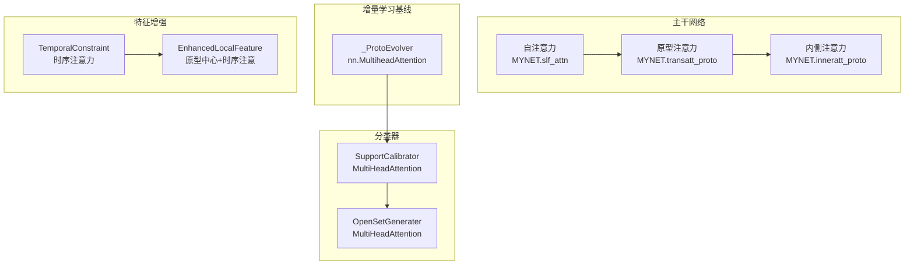
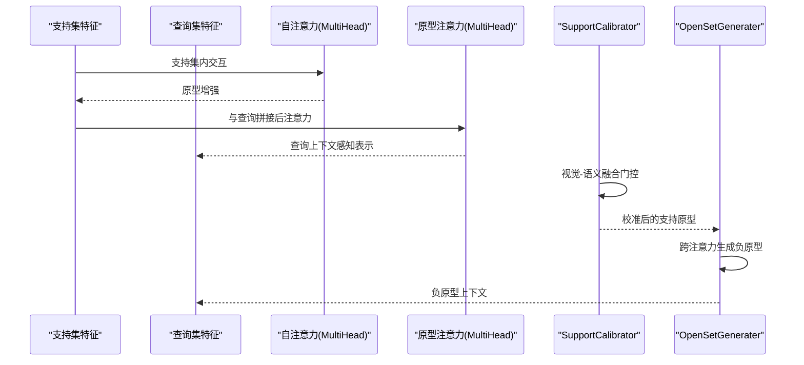
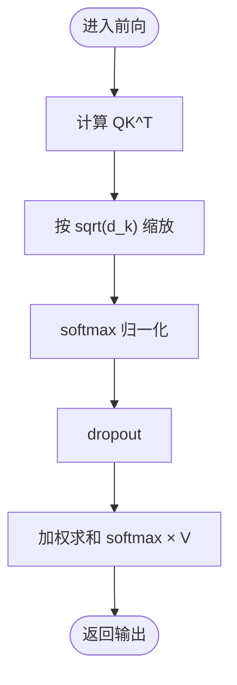
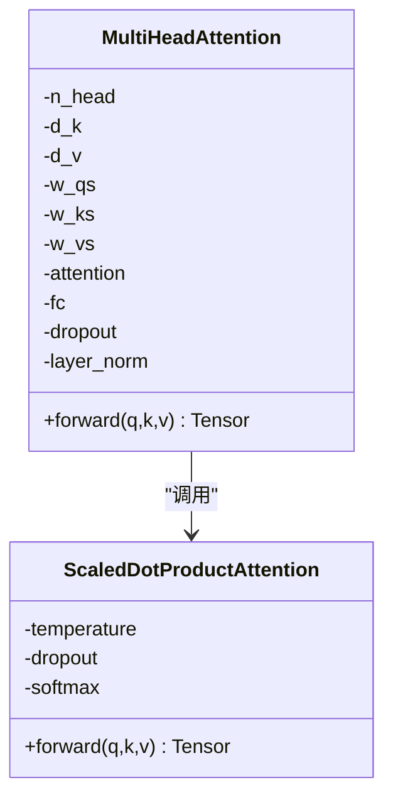
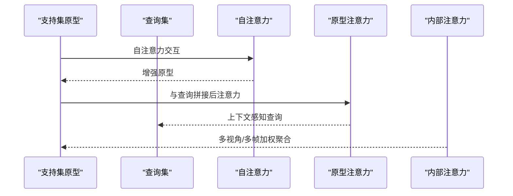
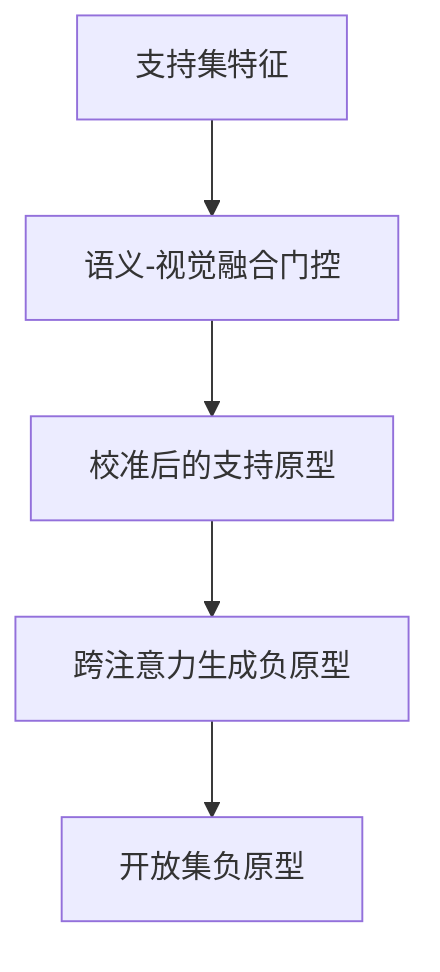
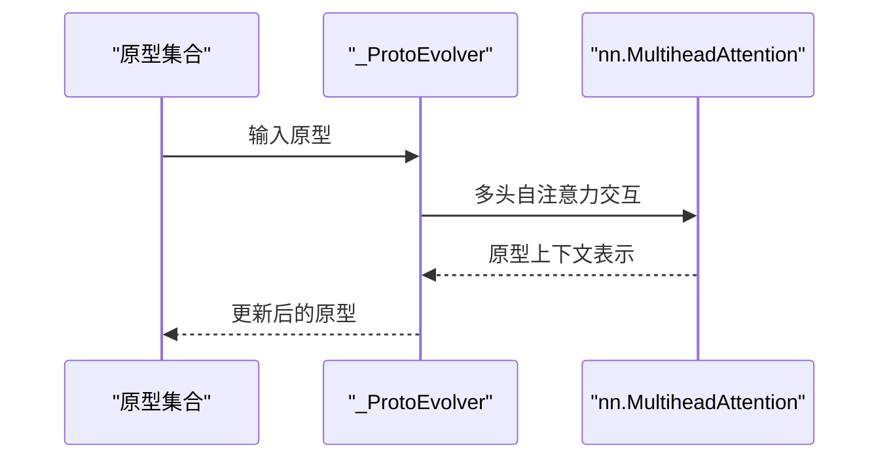
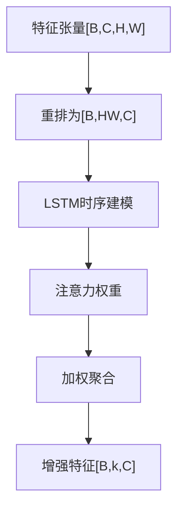
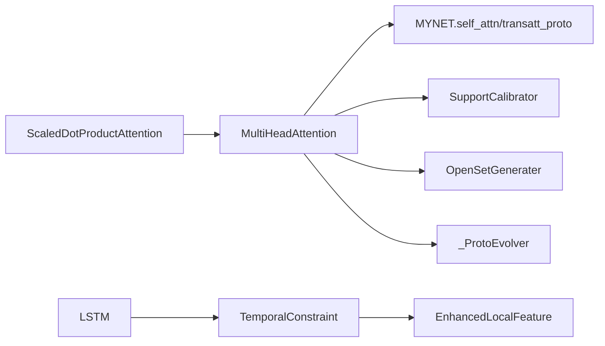

# 多头注意力机制

<cite>
**本文引用的文件列表**
- [network.py](file://network.py)
- [AttnClassifier.py](file://models/AttnClassifier.py)
- [UClassifier.py](file://models/UClassifier.py)
- [cec.py](file://models/baselines/cil_methods/cec.py)
- [feature_enhancer.py](file://models/feature_enhancer.py)
- [default.yml](file://configs/default.yml)
</cite>

## 目录
1. [简介](#简介)
2. [项目结构](#项目结构)
3. [核心组件](#核心组件)
4. [架构总览](#架构总览)
5. [详细组件分析](#详细组件分析)
6. [依赖关系分析](#依赖关系分析)
7. [性能考量](#性能考量)
8. [故障排查指南](#故障排查指南)
9. [结论](#结论)
10. [附录](#附录)

## 简介
本技术文档围绕仓库中的多头注意力机制展开，系统阐述自注意力与交叉注意力的实现原理，涵盖 ScaledDotProductAttention、MultiHeadAttention 等核心组件，详细解析注意力权重计算、多头并行处理、残差连接与层归一化等关键技术，并结合原型生成、特征融合、动态权重计算等应用场景，提供参数配置指南与性能优化建议。文档同时给出数学公式推导与代码实现细节的对应关系，帮助读者从理论到实践全面掌握注意力机制在本项目中的应用。

## 项目结构
本项目在多个模块中实现了注意力机制：
- 主干网络中的自注意力与原型注意力：用于支持集与查询集之间的交互，以及支持集内部的注意力聚合。
- 分类器模块中的语义与视觉融合注意力：用于支持原型校准与开放集负原型生成。
- 增量学习基线中的图注意力演进：使用轻量级多头自注意力对原型进行GAT式的交互演化。
- 特征增强模块中的时序注意力：用于局部特征的空间与时间维度增强。

图表来源
- [network.py:30-32](file://network.py#L30-L32)
- [network.py:244-251](file://network.py#L244-L251)
- [network.py:258-279](file://network.py#L258-L279)
- [AttnClassifier.py:121-185](file://models/AttnClassifier.py#L121-L185)
- [AttnClassifier.py:188-271](file://models/AttnClassifier.py#L188-L271)
- [cec.py:19-38](file://models/baselines/cil_methods/cec.py#L19-L38)
- [feature_enhancer.py:5-25](file://models/feature_enhancer.py#L5-L25)
- [feature_enhancer.py:27-93](file://models/feature_enhancer.py#L27-L93)

章节来源
- [network.py:30-32](file://network.py#L30-L32)
- [AttnClassifier.py:121-185](file://models/AttnClassifier.py#L121-L185)
- [AttnClassifier.py:188-271](file://models/AttnClassifier.py#L188-L271)
- [cec.py:19-38](file://models/baselines/cil_methods/cec.py#L19-L38)
- [feature_enhancer.py:5-25](file://models/feature_enhancer.py#L5-L25)
- [feature_enhancer.py:27-93](file://models/feature_enhancer.py#L27-L93)

## 核心组件
本节聚焦于注意力机制的核心实现，包括 ScaledDotProductAttention 与 MultiHeadAttention 的数学定义、前向流程与关键参数。

- 数学基础
  - 缩放点积注意力：注意力分数通过 QK^T 计算，再按维度 d_k 的平方根进行缩放，随后经 softmax 得到权重分布，最后与 V 相乘得到加权输出。
  - 多头注意力：将 Q、K、V 分别投影到 n_head × d_k 或 n_head × d_v 的子空间，分别计算注意力，再拼接并通过线性变换映射回 d_model，最后与残差相加并层归一化。

- 关键实现要点
  - 温度缩放：在注意力分数上除以 sqrt(d_k)，防止大维度下点积过大导致 softmax饱和。
  - 多头并行：通过视图变换与堆叠实现 (n*b) × l × d 的批量块，提升计算效率。
  - 残差与层归一化：输出经 dropout 与线性映射后与输入残差相加，并进行 LayerNorm，稳定训练。
  - 交叉注意力：Q、K、V 来自不同序列，常用于编码器-解码器交互或原型与基类记忆的融合。

章节来源
- [network.py:519-584](file://network.py#L519-L584)
- [AttnClassifier.py:331-349](file://models/AttnClassifier.py#L331-L349)
- [UClassifier.py:344-362](file://models/UClassifier.py#L344-L362)

## 架构总览
注意力机制在本项目中的应用贯穿以下路径：
- 自注意力：支持集原型在自身序列内进行交互，提升原型表达能力。
- 原型注意力：将支持集与查询集拼接后进行注意力，使查询在原型空间中获得更优表示。
- 语义-视觉融合注意力：在支持原型校准与开放集负原型生成中，利用语义特征与视觉特征的门控融合，动态调整权重。
- 图注意力演进：在增量学习中，使用多头自注意力对原型进行交互演化，模拟图卷积的邻域聚合思想。
- 特征增强注意力：在局部特征层面引入时序注意力，实现空间与时间维度的动态加权聚合。

图表来源
- [network.py:244-251](file://network.py#L244-L251)
- [network.py:270-279](file://network.py#L270-L279)
- [AttnClassifier.py:121-185](file://models/AttnClassifier.py#L121-L185)
- [AttnClassifier.py:188-271](file://models/AttnClassifier.py#L188-L271)

## 详细组件分析

### ScaledDotProductAttention
- 功能：计算缩放点积注意力权重并输出加权特征。
- 关键流程：
  - 计算注意力分数：QK^T
  - 缩放：除以 sqrt(d_k)
  - 归一化：softmax
  - 加权求和：softmax × V
- 输出：加权特征、注意力logits（用于可视化或正则）

图表来源
- [network.py:528-535](file://network.py#L528-L535)
- [AttnClassifier.py:340-349](file://models/AttnClassifier.py#L340-L349)
- [UClassifier.py:353-362](file://models/UClassifier.py#L353-L362)

章节来源
- [network.py:519-535](file://network.py#L519-L535)
- [AttnClassifier.py:331-349](file://models/AttnClassifier.py#L331-L349)
- [UClassifier.py:344-362](file://models/UClassifier.py#L344-L362)

### MultiHeadAttention
- 功能：多头并行计算注意力，拼接后线性映射，残差与层归一化。
- 关键流程：
  - 线性投影：w_qs、w_ks、w_vs 将 Q、K、V 映射到 n_head × d_k/d_v
  - 视图变换：(n,b) × l × d 的批量块
  - 注意力计算：调用 ScaledDotProductAttention
  - 拼接与映射：将各头结果拼接并通过 fc 映射回 d_model
  - 残差与归一化：dropout → fc → 残差相加 → LayerNorm
- 交叉注意力扩展：在分类器模块中，Q、K、V 来自不同模态（视觉与语义），并可选择是否保留残差。

图表来源
- [network.py:538-584](file://network.py#L538-L584)
- [AttnClassifier.py:274-326](file://models/AttnClassifier.py#L274-L326)
- [UClassifier.py:287-339](file://models/UClassifier.py#L287-L339)

章节来源
- [network.py:538-584](file://network.py#L538-L584)
- [AttnClassifier.py:274-326](file://models/AttnClassifier.py#L274-L326)
- [UClassifier.py:287-339](file://models/UClassifier.py#L287-L339)

### 自注意力与原型注意力（MYNET）
- 自注意力：对支持集原型进行自交互，提升原型表达。
- 原型注意力：将支持集与查询集拼接后进行注意力，使查询在原型空间中获得上下文感知表示。
- 内部注意力：对单个样本的多帧/多视角支持进行加权聚合，得到更稳定的原型。

图表来源
- [network.py:244-251](file://network.py#L244-L251)
- [network.py:270-279](file://network.py#L270-L279)
- [network.py:258-268](file://network.py#L258-L268)

章节来源
- [network.py:225-279](file://network.py#L225-L279)

### 语义-视觉融合注意力（SupportCalibrator/OpenSetGenerater）
- 支持原型校准：将支持集特征与基类记忆进行语义-视觉融合，通过门控机制动态调整视觉与语义权重。
- 负原型生成：基于校准后的支持原型与基类记忆，使用注意力生成开放集负原型，用于开放集分类。

图表来源
- [AttnClassifier.py:121-185](file://models/AttnClassifier.py#L121-L185)
- [AttnClassifier.py:188-271](file://models/AttnClassifier.py#L188-L271)
- [UClassifier.py:134-198](file://models/UClassifier.py#L134-L198)
- [UClassifier.py:201-284](file://models/UClassifier.py#L201-L284)

章节来源
- [AttnClassifier.py:121-271](file://models/AttnClassifier.py#L121-L271)
- [UClassifier.py:134-284](file://models/UClassifier.py#L134-L284)

### 图注意力演进（CEC）
- 使用轻量级多头自注意力对原型进行交互演化，模拟图卷积的邻域聚合思想，仅更新原型而不冻结编码器。

图表来源
- [cec.py:19-38](file://models/baselines/cil_methods/cec.py#L19-L38)

章节来源
- [cec.py:19-83](file://models/baselines/cil_methods/cec.py#L19-L83)

### 特征增强注意力（TemporalConstraint/EnhancedLocalFeature）
- TemporalConstraint：对空间展平特征序列进行LSTM时序建模，再通过注意力权重对LSTM输出进行加权聚合。
- EnhancedLocalFeature：结合原型中心与时序注意力，实现局部特征的空间-时间维度增强。

图表来源
- [feature_enhancer.py:5-25](file://models/feature_enhancer.py#L5-L25)
- [feature_enhancer.py:27-93](file://models/feature_enhancer.py#L27-L93)

章节来源
- [feature_enhancer.py:5-93](file://models/feature_enhancer.py#L5-L93)

## 依赖关系分析
- 组件耦合
  - MYNET 中的自注意力与原型注意力依赖 MultiHeadAttention 与 ScaledDotProductAttention。
  - 分类器模块中的 SupportCalibrator 与 OpenSetGenerater 依赖 MultiHeadAttention 与 ScaledDotProductAttention，并扩展了语义-视觉融合。
  - CEC 基线使用 nn.MultiheadAttention 实现原型的图注意力演进。
  - 特征增强模块独立实现时序注意力，与主干注意力模块解耦。

图表来源
- [network.py:519-584](file://network.py#L519-L584)
- [AttnClassifier.py:274-349](file://models/AttnClassifier.py#L274-L349)
- [cec.py:19-38](file://models/baselines/cil_methods/cec.py#L19-L38)
- [feature_enhancer.py:5-25](file://models/feature_enhancer.py#L5-L25)

章节来源
- [network.py:519-584](file://network.py#L519-L584)
- [AttnClassifier.py:274-349](file://models/AttnClassifier.py#L274-L349)
- [cec.py:19-38](file://models/baselines/cil_methods/cec.py#L19-L38)
- [feature_enhancer.py:5-25](file://models/feature_enhancer.py#L5-L25)

## 性能考量
- 计算复杂度
  - 单头注意力：O(B×L×D×D_k)，其中 L 为序列长度，D 为特征维度，D_k 为投影维度。
  - 多头注意力：O(n_head × B×L×D×D_k)，整体随头数线性增长。
- 内存与显存
  - 视图变换与批量堆叠减少中间变量拷贝，提高内存局部性。
  - 注意力权重矩阵大小为 O(B×L×L)，长序列时需关注显存占用。
- 优化建议
  - 降低 d_k 或 d_v 可减小计算与显存开销，但需平衡表达能力。
  - 使用混合精度训练与梯度检查点可显著节省显存。
  - 对长序列任务采用稀疏注意力或分块注意力策略。
  - 在增量学习中，对原型注意力使用较小的头数与温度，避免过拟合。

## 故障排查指南
- 形状不匹配
  - 确认 Q、K、V 的最后一维等于 d_model，且投影后 d_k/d_v 一致。
  - 检查视图变换与堆叠顺序，确保 (n*b) × l × d 的批量块正确。
- 温度设置不当
  - 若 softmax 过于尖锐或过于平坦，调整 sqrt(d_k) 的缩放因子或使用可学习温度。
- 残差与归一化
  - 若训练不稳定，适当增大 dropout 或减小学习率；确认 LayerNorm 与残差相加顺序正确。
- 语义-视觉融合异常
  - 检查门控融合的线性层维度与激活函数，确保输出在合理范围。
- 图注意力演进
  - 确保原型张量在批次第一维为 1，避免多批次混淆；必要时进行 unsqueeze/squeeze 操作。

章节来源
- [network.py:561-584](file://network.py#L561-L584)
- [AttnClassifier.py:299-326](file://models/AttnClassifier.py#L299-L326)
- [UClassifier.py:312-339](file://models/UClassifier.py#L312-L339)
- [cec.py:33-38](file://models/baselines/cil_methods/cec.py#L33-L38)

## 结论
本项目在多个层次实现了注意力机制：自注意力用于增强支持集原型，原型注意力用于查询上下文感知表示，语义-视觉融合注意力用于支持原型校准与负原型生成，图注意力用于增量学习中的原型演化，时序注意力用于局部特征增强。通过多头并行、残差与层归一化、温度缩放等设计，注意力机制在保持高效的同时提升了模型的表达能力与泛化性能。建议在实际部署中根据任务规模与资源限制，合理选择头数、维度与温度，并结合混合精度与稀疏注意力等技术进一步优化性能。

## 附录
- 参数配置参考
  - 网络温度：在配置文件中设置 temperature，影响余弦相似度的尺度。
  - 注意力头数与维度：在 MultiHeadAttention 初始化时指定 n_head、d_k、d_v。
  - Dropout：在注意力与投影层设置 dropout，控制过拟合风险。
  - 增量学习中的注意力学习率：在优化器配置中为 transatt_proto 设置专用学习率。

章节来源
- [default.yml:42-45](file://configs/default.yml#L42-L45)
- [network.py:541](file://network.py#L541)
- [AttnClassifier.py:277](file://models/AttnClassifier.py#L277)
- [UClassifier.py:290](file://models/UClassifier.py#L290)
- [default.yml:27-31](file://configs/default.yml#L27-L31)