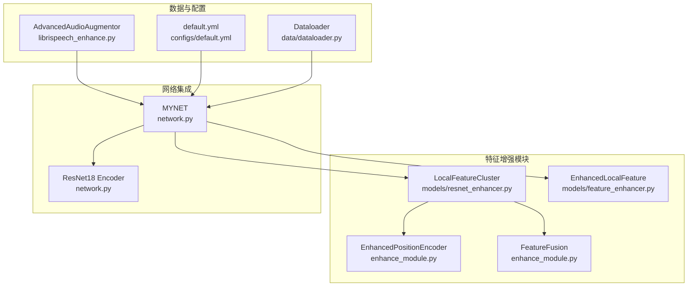
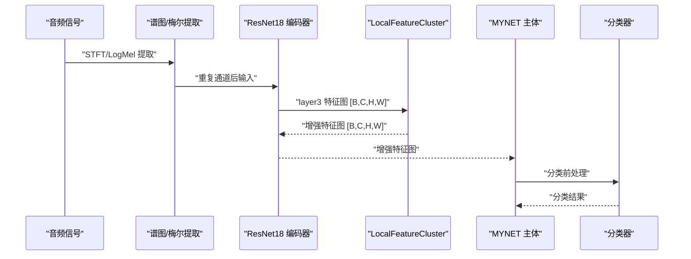
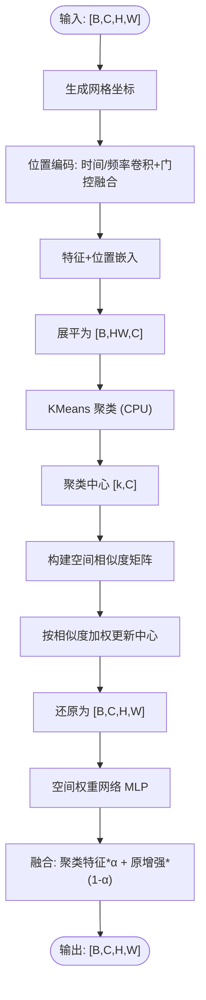
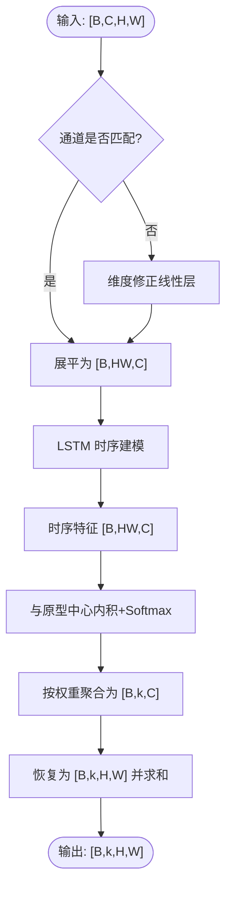
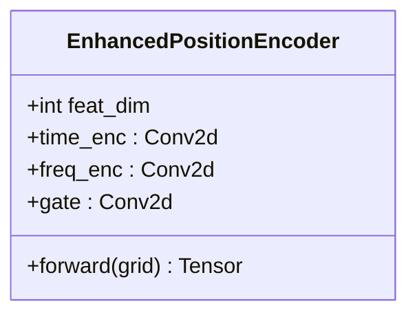
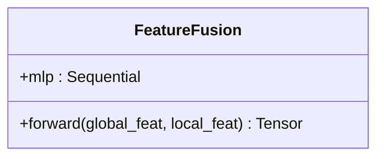
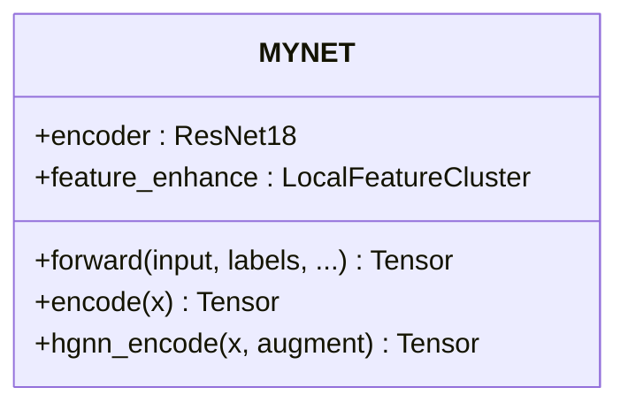
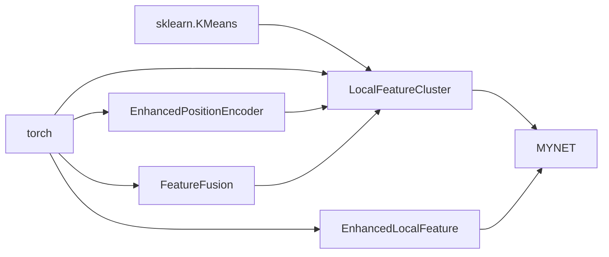

# 特征增强模块

<cite>
**本文引用的文件列表**
- [models/feature_enhancer.py](file://models/feature_enhancer.py)
- [enhance_module.py](file://enhance_module.py)
- [models/resnet_enhancer.py](file://models/resnet_enhancer.py)
- [network.py](file://network.py)
- [librispeech_enhance.py](file://librispeech_enhance.py)
- [utils/utils.py](file://utils/utils.py)
- [train.py](file://train.py)
- [test.py](file://test.py)
- [configs/default.yml](file://configs/default.yml)
- [data/dataloader.py](file://data/dataloader.py)
</cite>

## 目录
1. [简介](#简介)
2. [项目结构](#项目结构)
3. [核心组件](#核心组件)
4. [架构总览](#架构总览)
5. [详细组件分析](#详细组件分析)
6. [依赖关系分析](#依赖关系分析)
7. [性能考量](#性能考量)
8. [故障排查指南](#故障排查指南)
9. [结论](#结论)
10. [附录](#附录)

## 简介
本技术文档聚焦于特征增强模块的设计与实现，系统阐述局部特征聚类与全局特征增强两大核心机制，涵盖 LocalFeatureCluster、EnhancedLocalFeature、EnhancedPositionEncoder、FeatureFusion 等关键组件。文档详细解析特征增强策略、聚类算法应用、注意力融合机制，并说明增强模块如何提升特征表示能力、改善分类性能，以及与网络其他组件的集成方式。同时提供算法实现要点、参数配置、性能评估方法与实际应用案例。

## 项目结构
特征增强模块主要分布在以下文件中：
- 局部特征聚类与增强：models/feature_enhancer.py、enhance_module.py、models/resnet_enhancer.py
- 网络集成与调用：network.py
- 音频增强与数据管线：librispeech_enhance.py
- 工具与评估：utils/utils.py、train.py、test.py
- 配置与数据加载：configs/default.yml、data/dataloader.py

图表来源
- [models/resnet_enhancer.py:51-172](file://models/resnet_enhancer.py#L51-L172)
- [models/feature_enhancer.py:27-93](file://models/feature_enhancer.py#L27-L93)
- [enhance_module.py:14-160](file://enhance_module.py#L14-L160)
- [network.py:18-518](file://network.py#L18-L518)
- [librispeech_enhance.py:17-268](file://librispeech_enhance.py#L17-L268)
- [configs/default.yml:1-88](file://configs/default.yml#L1-L88)
- [data/dataloader.py:1-200](file://data/dataloader.py#L1-L200)

章节来源
- [models/feature_enhancer.py:1-93](file://models/feature_enhancer.py#L1-L93)
- [enhance_module.py:1-160](file://enhance_module.py#L1-L160)
- [models/resnet_enhancer.py:1-172](file://models/resnet_enhancer.py#L1-L172)
- [network.py:18-518](file://network.py#L18-L518)
- [librispeech_enhance.py:1-268](file://librispeech_enhance.py#L1-L268)
- [configs/default.yml:1-88](file://configs/default.yml#L1-L88)
- [data/dataloader.py:1-200](file://data/dataloader.py#L1-L200)

## 核心组件
- LocalFeatureCluster（局部特征聚类）：在空间网格上进行位置编码，结合 KMeans 动态聚类，利用空间相似度矩阵对聚类中心进行时序加权，再通过空间权重网络与原特征融合，输出增强后的特征图。
- EnhancedLocalFeature（增强局部特征）：对输入特征进行维度修正，使用 LSTM 提取时序特征，通过可学习原型中心计算动态权重，实现特征聚合与重排，输出增强后的特征图。
- EnhancedPositionEncoder（增强位置编码）：分别对时间轴与频率轴进行卷积编码，通过动态门控融合时间与频率嵌入，输出与特征维度一致的位置嵌入。
- FeatureFusion（特征融合）：将全局特征与局部特征拼接，经 MLP 输出融合权重，实现动态加权融合。
- MYNET（网络主体）：在 ResNet18 编码器之后接入 LocalFeatureCluster，完成特征增强与下游任务的端到端训练。

章节来源
- [models/resnet_enhancer.py:51-172](file://models/resnet_enhancer.py#L51-L172)
- [models/feature_enhancer.py:27-93](file://models/feature_enhancer.py#L27-L93)
- [enhance_module.py:14-160](file://enhance_module.py#L14-L160)
- [network.py:18-518](file://network.py#L18-L518)

## 架构总览
特征增强模块在 MYNET 中的集成路径如下：
- 音频经谱图与梅尔滤波器组提取，重复通道后送入 ResNet18 编码器。
- 在 layer3 层输出的空间特征图上，LocalFeatureCluster 进行位置编码、动态聚类与融合，得到增强特征图。
- 增强特征图继续进入后续层，最终池化并送入分类器。

图表来源
- [network.py:281-324](file://network.py#L281-L324)
- [network.py:302-304](file://network.py#L302-L304)
- [models/resnet_enhancer.py:73-160](file://models/resnet_enhancer.py#L73-L160)

## 详细组件分析

### LocalFeatureCluster（局部特征聚类）
- 位置编码：生成标准化网格坐标，分别对时间轴与频率轴进行卷积编码，动态门控融合输出位置嵌入。
- 动态聚类：对展平后的特征进行 KMeans 聚类，聚类数由空间分辨率与比例系数决定；使用空间相似度矩阵对聚类中心进行加权更新。
- 空间权重增强：通过 MLP 计算空间权重，控制聚类特征与原增强特征的融合比例。
- 设备一致性：确保子模块参数与输入在同一设备上，避免设备不一致导致的错误。

图表来源
- [models/resnet_enhancer.py:73-160](file://models/resnet_enhancer.py#L73-L160)

章节来源
- [models/resnet_enhancer.py:51-172](file://models/resnet_enhancer.py#L51-L172)

### EnhancedLocalFeature（增强局部特征）
- 维度修正：若输入通道与目标维度不一致，通过线性层修正至目标维度。
- 时序特征提取：使用双向 LSTM 对展平特征进行时序建模，再通过线性层映射。
- 动态权重计算：通过与可学习原型中心的内积计算相似度权重，经 Softmax 归一化。
- 特征聚合：按权重对空间特征进行加权聚合，恢复为空间结构输出。

图表来源
- [models/feature_enhancer.py:49-93](file://models/feature_enhancer.py#L49-L93)

章节来源
- [models/feature_enhancer.py:27-93](file://models/feature_enhancer.py#L27-L93)

### EnhancedPositionEncoder（增强位置编码）
- 时间轴编码：对单通道时间序列进行卷积编码，输出与特征维度一致的时间嵌入。
- 频率轴编码：对单通道频率序列进行卷积编码，输出频率嵌入。
- 动态门控融合：将时间与频率嵌入拼接后经门控网络输出融合权重，实现自适应融合。

图表来源
- [enhance_module.py:30-69](file://enhance_module.py#L30-L69)

章节来源
- [enhance_module.py:14-160](file://enhance_module.py#L14-L160)

### FeatureFusion（特征融合）
- 输入：全局特征与局部特征（展平后的特征）。
- 结构：拼接后经 MLP 输出融合权重，实现动态加权融合。
- 应用：在 LocalFeatureCluster 中用于融合全局与局部特征，提升表征稳定性。

图表来源
- [enhance_module.py:14-29](file://enhance_module.py#L14-L29)

章节来源
- [enhance_module.py:14-160](file://enhance_module.py#L14-L160)

### MYNET（网络主体与集成）
- 在 ResNet18 编码器之后接入 LocalFeatureCluster，完成特征增强。
- 增强后的特征继续进入后续层，最终池化并送入分类器。
- 提供多种模式（如 encoder/openmeta），支持不同训练与推理阶段。

图表来源
- [network.py:18-518](file://network.py#L18-L518)

章节来源
- [network.py:18-518](file://network.py#L18-L518)

## 依赖关系分析
- LocalFeatureCluster 依赖 sklearn 的 KMeans 进行动态聚类，依赖 torch 的设备一致性管理。
- EnhancedLocalFeature 依赖可学习原型中心与注意力机制，实现动态权重与特征聚合。
- EnhancedPositionEncoder 依赖卷积网络与门控融合，提升空间感知能力。
- MYNET 依赖 ResNet18 编码器与特征增强模块，形成完整的特征提取与增强链路。

图表来源
- [models/resnet_enhancer.py:100-109](file://models/resnet_enhancer.py#L100-L109)
- [models/feature_enhancer.py:45-47](file://models/feature_enhancer.py#L45-L47)
- [enhance_module.py:14-29](file://enhance_module.py#L14-L29)
- [network.py:302-304](file://network.py#L302-L304)

章节来源
- [models/resnet_enhancer.py:1-172](file://models/resnet_enhancer.py#L1-L172)
- [models/feature_enhancer.py:1-93](file://models/feature_enhancer.py#L1-L93)
- [enhance_module.py:1-160](file://enhance_module.py#L1-L160)
- [network.py:18-518](file://network.py#L18-L518)

## 性能考量
- 计算复杂度：LocalFeatureCluster 的 KMeans 聚类在 CPU 上执行，建议合理设置聚类比例 k_ratio，避免过大导致 CPU/GPU 交互频繁。
- 设备一致性：各模块需确保参数与输入在同一设备上，避免运行时错误。
- 内存占用：增强后的特征图保持空间结构，注意批大小与特征图尺寸对显存的影响。
- 训练稳定性：通过残差连接与动态融合门控，提升训练稳定性与收敛速度。

## 故障排查指南
- 设备不一致：若出现“参数设备不一致”错误，检查模块的设备同步逻辑，确保所有子模块迁移至同一设备。
- 维度不匹配：若维度修正失败，确认输入通道与目标维度一致，或调整维度修正层。
- 聚类异常：若 KMeans 聚类报错，检查特征展平与聚类数设置，确保输入在 CPU 上且非空。
- 融合权重异常：若融合权重为 NaN，检查 MLP 输出与归一化操作，确保数值稳定性。

章节来源
- [models/resnet_enhancer.py:168-172](file://models/resnet_enhancer.py#L168-L172)
- [models/feature_enhancer.py:50-55](file://models/feature_enhancer.py#L50-L55)
- [models/resnet_enhancer.py:100-109](file://models/resnet_enhancer.py#L100-L109)

## 结论
特征增强模块通过局部特征聚类与全局特征增强相结合，显著提升了特征表示能力与分类性能。LocalFeatureCluster 与 EnhancedLocalFeature 在空间与时序维度上进行协同增强，EnhancedPositionEncoder 与 FeatureFusion 则进一步强化了空间感知与动态融合能力。在 MYNET 中的无缝集成使得增强模块能够与网络其他组件协同工作，实现端到端的训练与推理。

## 附录

### 参数配置与使用建议
- 聚类比例 k_ratio：控制聚类数与增强强度，建议在 0.2~0.5 之间调整。
- 温度参数 temperature：影响注意力权重的分布锐度，建议在 0.05~0.2 之间调整。
- 空间相似度 temporal_scale：控制空间相似度矩阵的平滑程度，建议根据特征图尺寸调整。
- 设备一致性：确保模块参数与输入在同一设备上，避免运行时错误。

章节来源
- [configs/default.yml:1-88](file://configs/default.yml#L1-L88)
- [utils/utils.py:61-131](file://utils/utils.py#L61-L131)

### 性能评估方法
- 聚类指标：计算轮廓系数（Silhouette Score）、类内/类间距离比等指标，评估增强前后特征的聚类质量。
- 不确定性评估：通过蒙特卡洛 Dropout 与特征掩码计算样本不确定性，辅助样本选择与模型校准。
- 开放集评估：使用开放集指标（如 PD、AA、F1）评估模型在未知类上的泛化能力。

章节来源
- [train.py:330-361](file://train.py#L330-L361)
- [utils/utils.py:23-60](file://utils/utils.py#L23-L60)
- [test.py:37-85](file://test.py#L37-L85)

### 实际应用案例
- LibriSpeech 数据集：通过 AdvancedAudioAugmentor 生成多视图增强样本，结合 LocalFeatureCluster 进行特征增强，提升少样本语音分类性能。
- 数据加载与采样：使用 Dataloader 提供的采样器与数据管线，确保训练与测试的一致性与可重复性。

章节来源
- [librispeech_enhance.py:135-268](file://librispeech_enhance.py#L135-L268)
- [data/dataloader.py:13-200](file://data/dataloader.py#L13-L200)