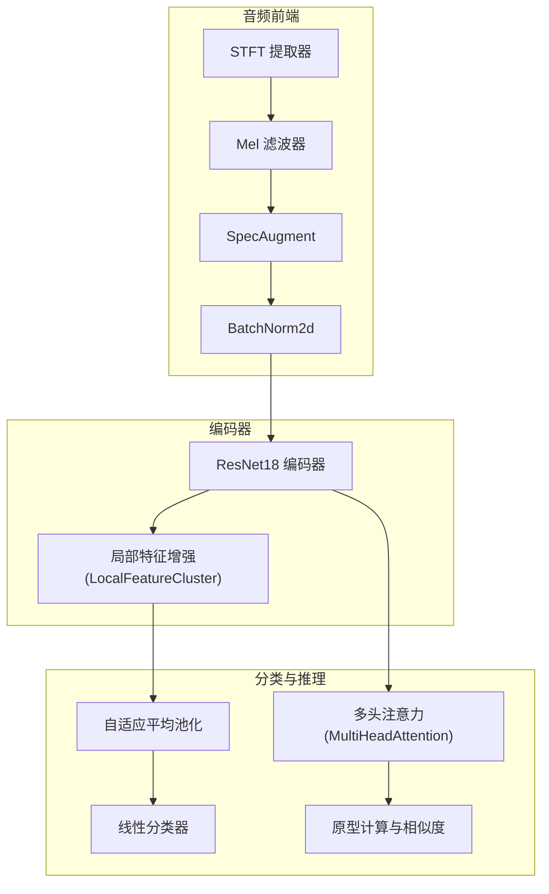
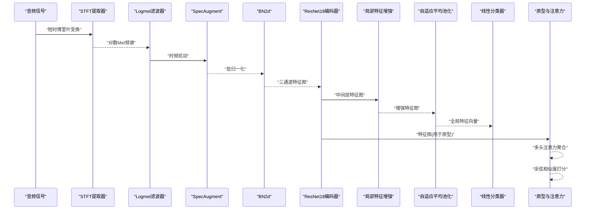
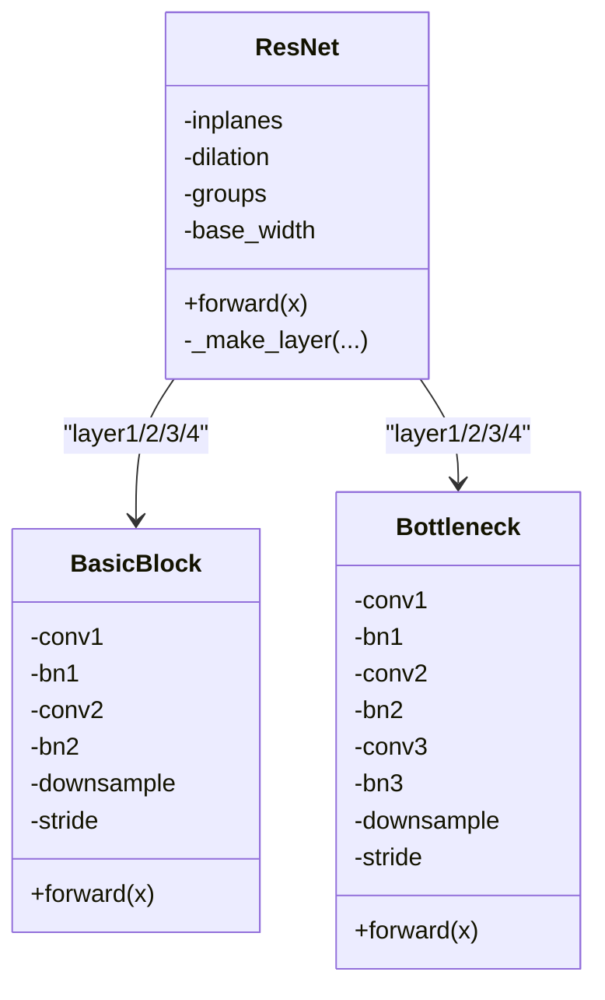
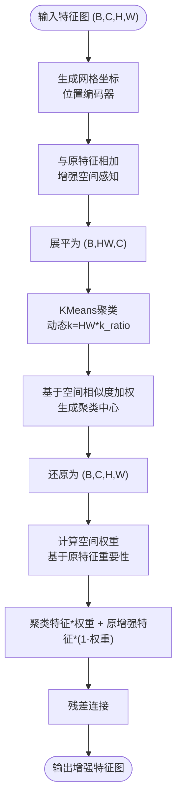
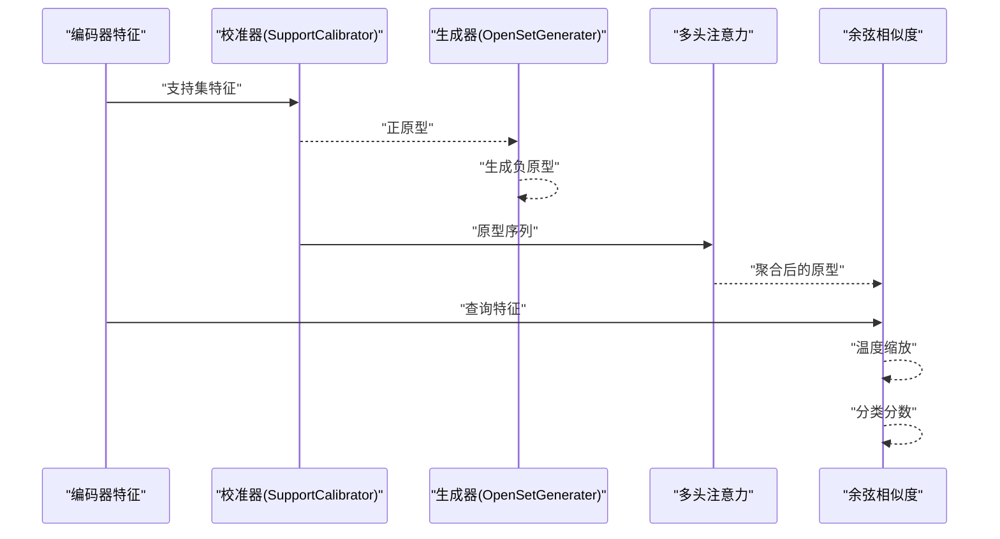
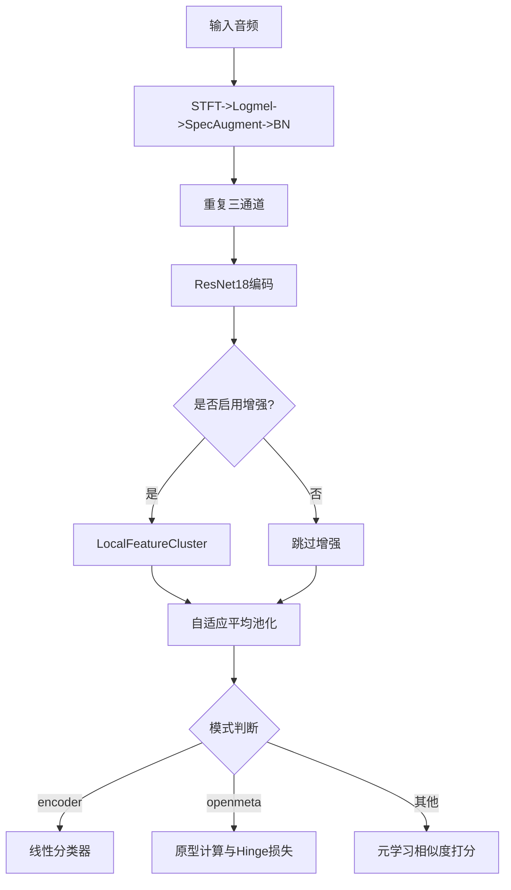
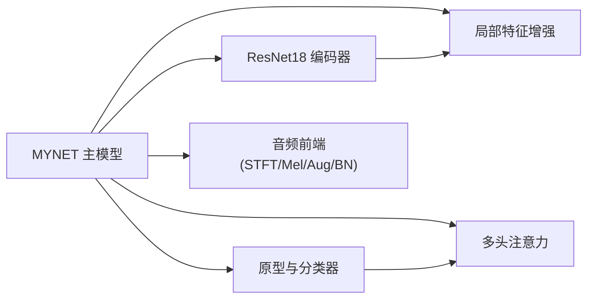

# 网络架构设计

<cite>
**本文引用的文件列表**
- [network.py](file://network.py)
- [resnet18_encoder.py](file://models/resnet18_encoder.py)
- [resnet_enhancer.py](file://models/resnet_enhancer.py)
- [AttnClassifier.py](file://models/AttnClassifier.py)
- [default.yml](file://configs/default.yml)
- [base.py](file://models/base.py)
- [train.py](file://train.py)
</cite>

## 目录
1. [简介](#简介)
2. [项目结构](#项目结构)
3. [核心组件](#核心组件)
4. [架构总览](#架构总览)
5. [详细组件分析](#详细组件分析)
6. [依赖关系分析](#依赖关系分析)
7. [性能考量](#性能考量)
8. [故障排查指南](#故障排查指南)
9. [结论](#结论)
10. [附录](#附录)

## 简介
本文件面向VAZE项目中的MYNET主模型，系统阐述其网络架构设计与实现细节，重点覆盖：
- 音频特征提取链路（STFT、Mel频谱、SpecAugment、批归一化）
- ResNet18编码器的实现原理与特征提取流程
- 局部特征增强模块（LocalFeatureCluster）的空间感知与聚类融合
- 整体网络的数据流向与关键组件交互
- 设计决策与技术创新点
- 参数配置与调优方法
- 使用示例与常见问题排查

## 项目结构
VAZE项目采用分层组织方式，核心网络位于network.py，ResNet18编码器独立于models目录，音频特征提取工具来自torchlibrosa与speechbrain，分类器与注意力模块位于models子包中，配置信息集中在configs目录。

图表来源
- [network.py:326-353](file://network.py#L326-L353)
- [resnet18_encoder.py:240-334](file://models/resnet18_encoder.py#L240-L334)
- [resnet_enhancer.py:51-172](file://models/resnet_enhancer.py#L51-L172)

章节来源
- [network.py:18-518](file://network.py#L18-L518)
- [resnet18_encoder.py:128-471](file://models/resnet18_encoder.py#L128-L471)
- [resnet_enhancer.py:1-172](file://models/resnet_enhancer.py#L1-172)
- [default.yml:1-88](file://configs/default.yml#L1-L88)

## 核心组件
- MYNET主模型：封装音频特征提取、ResNet18编码、局部特征增强、原型学习与分类器等模块，提供多种运行模式（encoder、openmeta等）。
- ResNet18编码器：基于torchvision风格的ResNet实现，支持预训练权重加载与自定义分支裁剪。
- 局部特征增强：在ResNet中间层引入空间位置感知与KMeans聚类融合，提升局部细节表达能力。
- 注意力与原型：多头注意力模块用于原型聚合与上下文建模，结合余弦相似度进行分类打分。
- 配置系统：通过YAML配置统一管理采样率、窗口大小、步长、Mel-bin数、温度系数等超参数。

章节来源
- [network.py:18-518](file://network.py#L18-L518)
- [resnet18_encoder.py:240-334](file://models/resnet18_encoder.py#L240-L334)
- [resnet_enhancer.py:51-172](file://models/resnet_enhancer.py#L51-L172)
- [AttnClassifier.py:39-369](file://models/AttnClassifier.py#L39-L369)
- [default.yml:42-85](file://configs/default.yml#L42-L85)

## 架构总览
MYNET的端到端数据流如下：
- 音频输入经STFT转为复频谱，再经Logmel滤波器得到Mel频谱图，并进行SpecAugment与时频条带扰动。
- Mel图经批归一化后重复三通道以适配图像输入格式，送入ResNet18编码器。
- ResNet18输出的特征图在中间层（layer3）插入局部特征增强模块，融合空间位置编码与KMeans聚类中心，形成增强特征。
- 之后通过自适应平均池化降维至全局特征，可选地进入线性分类器。
- 在元学习场景中，支持原型计算、多头注意力聚合与余弦相似度打分。

图表来源
- [network.py:471-518](file://network.py#L471-L518)
- [network.py:281-325](file://network.py#L281-L325)
- [resnet18_encoder.py:317-334](file://models/resnet18_encoder.py#L317-L334)
- [resnet_enhancer.py:73-160](file://models/resnet_enhancer.py#L73-L160)

## 详细组件分析

### 音频特征提取与预处理
- STFT提取器：由torchlibrosa提供，参数来自配置文件，包括窗长、步长、窗函数、中心填充与冻结参数。
- Logmel滤波器：将频谱映射到Mel尺度，参数包括采样率、FFT点数、Mel-bin数、频率上下限等。
- SpecAugment：对时间轴与时域分别施加条带扰动，提升模型鲁棒性。
- 批归一化：对Mel频谱进行通道级归一化，稳定训练。
- 三通道扩展：将单通道Mel图复制为三通道，适配ResNet输入。

章节来源
- [network.py:326-353](file://network.py#L326-L353)
- [network.py:461-468](file://network.py#L461-L468)
- [default.yml:77-85](file://configs/default.yml#L77-L85)

### ResNet18编码器实现原理
- 结构组成：基础卷积块与瓶颈块组合，包含四层残差堆叠，最大池化后接自适应平均池化。
- 预训练加载：支持从官方URL下载并加载ImageNet预训练权重，自动裁剪分类头。
- 参数初始化：卷积采用Kaiming初始化，BN初始化为常数。
- 前向流程：conv1->bn1->relu->maxpool->layer1->layer2->layer3->layer4->avgpool(可选)->flatten->fc(可选)。

图表来源
- [resnet18_encoder.py:240-334](file://models/resnet18_encoder.py#L240-L334)
- [resnet18_encoder.py:157-194](file://models/resnet18_encoder.py#L157-L194)
- [resnet18_encoder.py:197-237](file://models/resnet18_encoder.py#L197-L237)

章节来源
- [resnet18_encoder.py:240-334](file://models/resnet18_encoder.py#L240-L334)
- [resnet18_encoder.py:337-471](file://models/resnet18_encoder.py#L337-L471)

### 局部特征增强模块（LocalFeatureCluster）
- 空间位置编码：为网格坐标生成时间与频率两个方向的位置嵌入，并通过门控融合，增强空间感知。
- KMeans聚类：对中间层特征展平后按批次进行KMeans聚类，聚类数随空间分辨率动态调整。
- 空间相似度加权：利用坐标距离构造相似度矩阵，对聚类中心进行空间加权聚合。
- 特征融合：将聚类中心还原为空间形状并与原特征相加，再通过空间权重网络控制融合比例，最后残差连接。

图表来源
- [resnet_enhancer.py:73-160](file://models/resnet_enhancer.py#L73-L160)

章节来源
- [resnet_enhancer.py:51-172](file://models/resnet_enhancer.py#L51-L172)

### 多头注意力与原型学习
- 多头注意力：将查询、键、值投影到多头空间，计算缩放点积注意力，再拼接并线性变换。
- 原型计算：支持校准器（SupportCalibrator）与开放集生成器（OpenSetGenerater）联合生成正原型与负原型。
- 余弦相似度：对原型与查询特征进行归一化后计算相似度，乘以温度系数得到分类分数。

图表来源
- [AttnClassifier.py:39-93](file://models/AttnClassifier.py#L39-L93)
- [AttnClassifier.py:274-326](file://models/AttnClassifier.py#L274-L326)
- [AttnClassifier.py:352-369](file://models/AttnClassifier.py#L352-L369)

章节来源
- [AttnClassifier.py:39-369](file://models/AttnClassifier.py#L39-L369)

### MYNET主模型与数据流
- 模式选择：支持encoder、openmeta等模式，不同模式下前向逻辑差异较大。
- 编码流程：音频->STFT->Logmel->SpecAugment->BN->三通道->ResNet18->可选增强->池化->线性分类器。
- 开放集元学习：将支持集、查询集、开放集拼接后编码，拆分得到各类特征，计算原型与Hinge损失，动态标签分配策略提升泛化。

图表来源
- [network.py:37-49](file://network.py#L37-L49)
- [network.py:471-518](file://network.py#L471-L518)
- [network.py:102-151](file://network.py#L102-L151)

章节来源
- [network.py:18-518](file://network.py#L18-L518)

## 依赖关系分析
- MYNET依赖ResNet18编码器与局部特征增强模块，同时集成注意力与原型学习组件。
- 音频前端依赖torchlibrosa与speechbrain工具，参数由配置文件统一注入。
- 分类器模块提供多头注意力与余弦相似度评分，支持增量场景下的原型更新。

图表来源
- [network.py:18-518](file://network.py#L18-L518)
- [resnet18_encoder.py:240-334](file://models/resnet18_encoder.py#L240-L334)
- [resnet_enhancer.py:51-172](file://models/resnet_enhancer.py#L51-L172)
- [AttnClassifier.py:39-369](file://models/AttnClassifier.py#L39-L369)

章节来源
- [network.py:18-518](file://network.py#L18-L518)
- [resnet18_encoder.py:240-334](file://models/resnet18_encoder.py#L240-L334)
- [resnet_enhancer.py:51-172](file://models/resnet_enhancer.py#L51-L172)
- [AttnClassifier.py:39-369](file://models/AttnClassifier.py#L39-L369)

## 性能考量
- 计算复杂度
  - ResNet18编码阶段：主要瓶颈在于卷积与池化，特征图尺寸随层数递减，计算量与参数量可控。
  - 局部特征增强：KMeans聚类在中间层特征上进行，时间复杂度近似O(B·HW·k·I·C)，其中I为迭代次数，k为聚类数。
  - 注意力与原型：多头注意力的复杂度为O(B·L^2·D)，L为序列长度，D为特征维度。
- 内存占用
  - 中间层特征图（如layer3）尺寸较大，建议在增强前后合理释放缓存或使用梯度检查点。
  - SpecAugment与三通道扩展会增加显存占用，需根据batch size与分辨率权衡。
- 优化建议
  - 使用混合精度训练与梯度累积降低显存压力。
  - 在增强模块中采用更高效的聚类替代方案（如MiniBatchKMeans）以加速收敛。
  - 渐进式温度调度与余弦退火有助于提升收敛稳定性。

[本节为通用性能讨论，无需特定文件来源]

## 故障排查指南
- 预训练权重加载失败
  - 检查TORCH_HOME环境变量与缓存路径权限。
  - 确认网络连通性与哈希校验。
- 形状不匹配错误
  - 确保Mel频谱经BN后重复三通道，且与ResNet输入通道一致。
  - 检查自适应平均池化后展平维度与线性层输入一致。
- 训练不稳定
  - 调整温度系数与学习率调度策略。
  - 在训练阶段启用Dropout与SpecAugment，测试阶段关闭。
- 增强模块报错
  - 确认LocalFeatureCluster输入通道数与插入层一致。
  - 检查网格坐标的生成与位置编码维度匹配。

章节来源
- [resnet18_encoder.py:18-67](file://models/resnet18_encoder.py#L18-L67)
- [network.py:471-518](file://network.py#L471-L518)
- [resnet_enhancer.py:73-160](file://models/resnet_enhancer.py#L73-L160)

## 结论
VAZE的MYNET主模型通过“音频前端+ResNet18编码+局部特征增强+原型学习”的组合，实现了从音频到语义原型的端到端映射。ResNet18编码器提供了强大的表征能力，局部特征增强模块进一步提升了空间细节与鲁棒性，多头注意力与余弦相似度打分使模型在开放集与元学习场景中具备良好的泛化性能。配置系统与模块化设计便于参数调优与扩展。

[本节为总结性内容，无需特定文件来源]

## 附录

### 参数配置与调优方法
- 关键超参数
  - 采样率、窗长、步长、Mel-bin数、频率上限等由配置文件统一管理。
  - 温度系数、学习率、权重衰减、调度策略影响收敛与泛化。
- 调优建议
  - 逐步调整温度系数与学习率，观察训练与验证指标。
  - 在增强模块中调节聚类比例k_ratio，平衡细节增强与计算成本。
  - 在元学习场景中，合理设置Hinge损失的margin阈值，避免过度惩罚。

章节来源
- [default.yml:42-85](file://configs/default.yml#L42-L85)
- [network.py:102-151](file://network.py#L102-L151)

### 使用示例（路径指引）
- 标准训练入口：参考训练脚本中的模型构建与优化器初始化。
- 开放集元学习：通过MYNET的openmeta模式执行任务原型计算与Hinge损失。
- 特征提取：使用encode/base_encode/hgnn_encode等接口进行特征抽取。

章节来源
- [train.py:1-200](file://train.py#L1-L200)
- [network.py:471-518](file://network.py#L471-L518)
- [network.py:102-151](file://network.py#L102-L151)