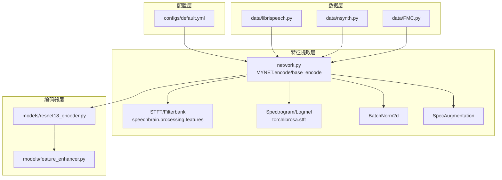
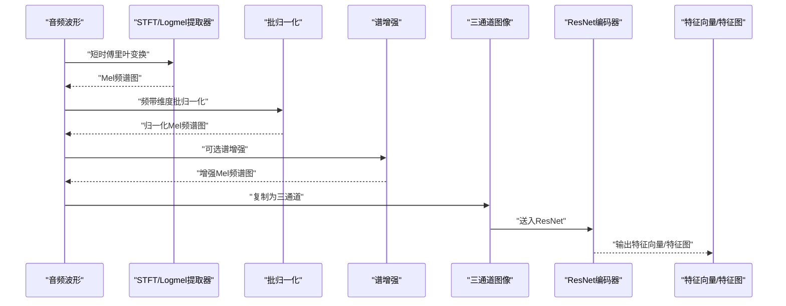
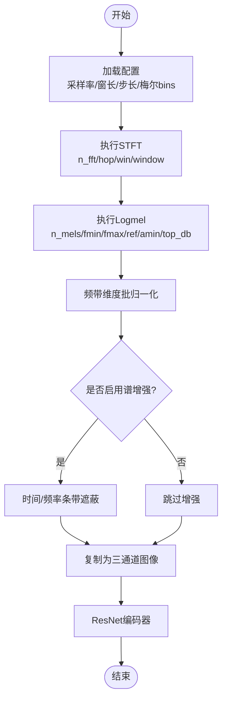
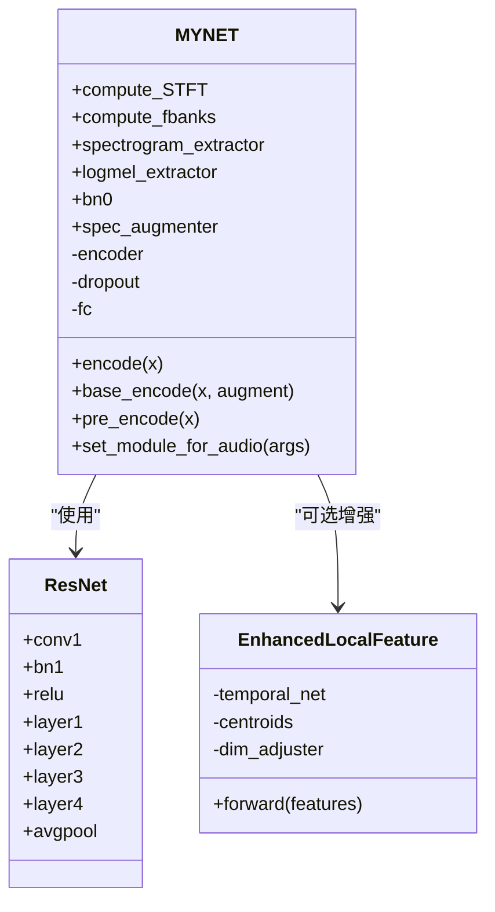
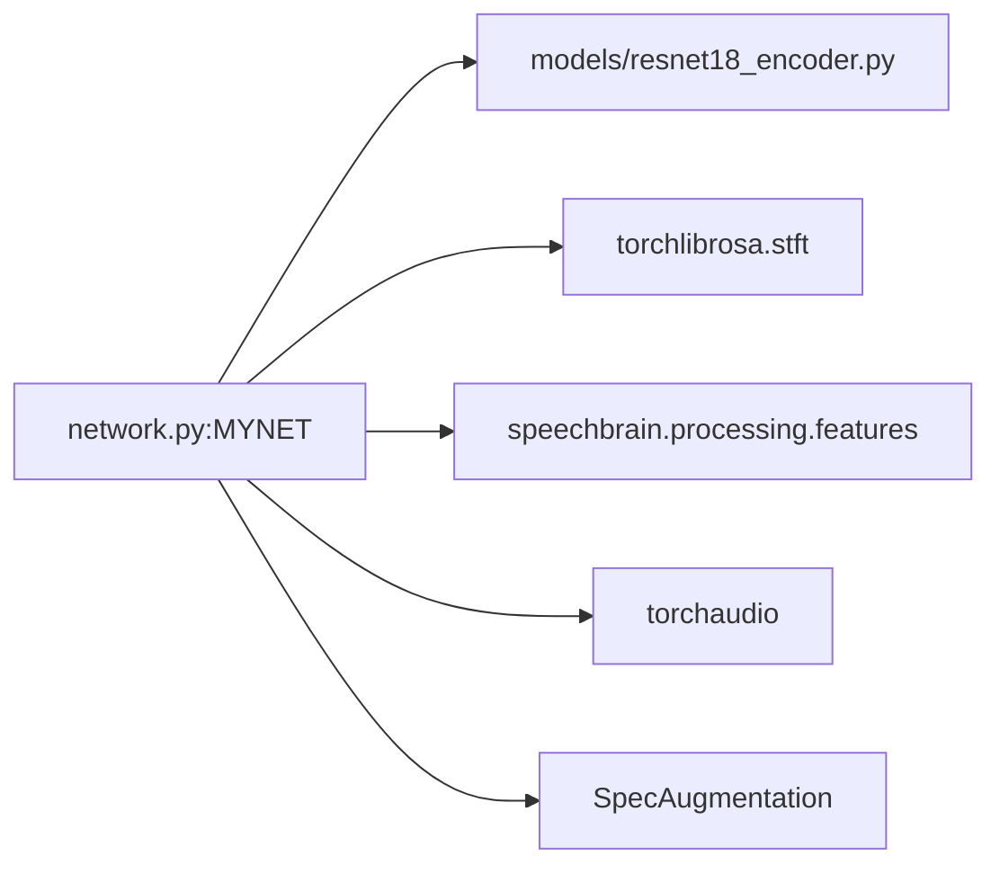

# 音频特征提取器

<cite>
**本文引用的文件列表**
- [network.py](file://network.py)
- [resnet18_encoder.py](file://models/resnet18_encoder.py)
- [feature_enhancer.py](file://models/feature_enhancer.py)
- [default.yml](file://configs/default.yml)
- [librispeech.py](file://data/librispeech.py)
- [FMC.py](file://data/FMC.py)
- [nsynth.py](file://data/nsynth.py)
- [audio_augment.py](file://utils/audio_augment.py)
- [librispeech_enhance.py](file://librispeech_enhance.py)
</cite>

## 目录
1. [简介](#简介)
2. [项目结构](#项目结构)
3. [核心组件](#核心组件)
4. [架构总览](#架构总览)
5. [详细组件分析](#详细组件分析)
6. [依赖关系分析](#依赖关系分析)
7. [性能考量](#性能考量)
8. [故障排查指南](#故障排查指南)
9. [结论](#结论)
10. [附录](#附录)

## 简介
本技术文档围绕音频特征提取器展开，系统阐述基于短时傅里叶变换（STFT）与对数梅尔谱（Logmel）的实现原理与工程实践，覆盖频谱分析、梅尔滤波器组、特征参数配置、音频预处理流程（含批归一化）、不同采样率与窗口大小的配置策略、特征维度规格，以及与ResNet编码器的接口设计。同时提供参数设置指南、性能调优方法与常见问题解决方案，帮助读者快速理解并高效使用该特征提取管线。

## 项目结构
该项目采用“配置驱动 + 数据集适配 + 特征提取 + 编码器”的分层组织方式：
- 配置层：通过YAML集中管理采样率、窗口大小、步长、梅尔滤波器数量等关键参数。
- 数据层：提供LibriSpeech、NSynth、FMC等数据集的读取与元学习采样逻辑。
- 特征提取层：封装STFT与Logmel提取器，提供批归一化与可选的谱增强。
- 编码器层：ResNet18作为骨干网络，接收Mel频谱图作为三通道图像输入。

图表来源
- [network.py:326-352](file://network.py#L326-L352)
- [default.yml:77-84](file://configs/default.yml#L77-L84)
- [librispeech.py:17-18](file://data/librispeech.py#L17-L18)
- [resnet18_encoder.py:240-334](file://models/resnet18_encoder.py#L240-L334)
- [feature_enhancer.py:27-93](file://models/feature_enhancer.py#L27-L93)

章节来源
- [network.py:326-352](file://network.py#L326-L352)
- [default.yml:77-84](file://configs/default.yml#L77-L84)

## 核心组件
- STFT与Logmel提取器
  - 使用torchlibrosa.stft.Spectrogram与LogmelFilterBank实现短时傅里叶变换与对数梅尔谱提取。
  - 使用speechbrain.processing.features.STFT与Filterbank作为补充工具，便于跨数据集一致性处理。
- 批归一化
  - 在Mel频带维度上进行二维批归一化，稳定训练初期特征分布。
- 谱增强（SpecAugmentation）
  - 时间/频率条带遮蔽，提升模型鲁棒性。
- ResNet编码器
  - 接收三通道Mel频谱图，输出空间特征图或全局特征向量。
- 特征增强模块
  - 可选的局部特征增强模块，用于进一步提升判别能力。

章节来源
- [network.py:326-352](file://network.py#L326-L352)
- [network.py:471-503](file://network.py#L471-L503)
- [resnet18_encoder.py:240-334](file://models/resnet18_encoder.py#L240-L334)
- [feature_enhancer.py:27-93](file://models/feature_enhancer.py#L27-L93)

## 架构总览
音频特征提取的整体流程如下：
- 输入波形经STFT/Logmel提取为Mel频谱图（时间×频带）。
- Mel频谱图在频带维度上进行批归一化。
- 可选地进行谱增强（SpecAugmentation）。
- 将Mel频谱图复制为三通道图像，送入ResNet编码器。
- 编码器输出空间特征图或全局特征向量，供下游分类器使用。

图表来源
- [network.py:471-503](file://network.py#L471-L503)
- [network.py:326-352](file://network.py#L326-L352)

## 详细组件分析

### STFT与Logmel实现原理
- STFT（短时傅里叶变换）
  - 通过torchlibrosa.stft.Spectrogram实现，参数包括n_fft（窗长）、hop_length（步长）、win_length（窗长度）、window（窗函数）等。
  - 通过speechbrain.processing.features.STFT实现更灵活的时间/频率参数换算。
- Logmel（对数梅尔谱）
  - 通过torchlibrosa.stft.LogmelFilterBank实现，参数包括sr（采样率）、n_fft、n_mels（梅尔滤波器数量）、fmin/fmax（频率范围）、ref/amin/top_db等。
  - 将线性频谱映射到梅尔尺度，模拟人类听觉感知。
- 参数映射
  - 采样率、窗长、步长、梅尔滤波器数量、频率上限等参数由配置文件统一管理，确保不同数据集的一致性。

图表来源
- [network.py:326-352](file://network.py#L326-L352)
- [network.py:471-503](file://network.py#L471-L503)
- [default.yml:77-84](file://configs/default.yml#L77-L84)

章节来源
- [network.py:326-352](file://network.py#L326-L352)
- [network.py:471-503](file://network.py#L471-L503)
- [default.yml:77-84](file://configs/default.yml#L77-L84)

### 频谱分析与梅尔滤波器组
- 频谱分析
  - STFT将时域信号分解为时频表示，窗长与步长决定时间分辨率与频率分辨率的权衡。
  - 窗函数（如汉宁窗）降低频谱泄漏。
- 梅尔滤波器组
  - LogmelFilterBank在频率轴上使用非均匀间隔的滤波器组，符合人类听觉的对数特性。
  - fmin/fmax限制有效频率范围，n_mels控制频带数量，进而影响特征维度。
- 对数压缩
  - 通过top_db与amin等参数控制动态范围压缩，避免极小值导致数值不稳定。

章节来源
- [network.py:338-340](file://network.py#L338-L340)
- [network.py:348-352](file://network.py#L348-L352)

### 音频预处理流程
- 数据加载与重采样
  - 数据集读取音频波形，必要时进行重采样以满足配置中的采样率。
- 波形预处理
  - 去均值等简单预处理减少直流分量影响。
- STFT与Logmel
  - 生成Mel频谱图，作为后续处理的基础。
- 批归一化
  - 在Mel频带维度上进行二维批归一化，稳定训练。
- 谱增强（可选）
  - 通过SpecAugmentation引入时间/频率遮蔽，提升泛化能力。
- 图像化与编码
  - 将Mel频谱图复制为三通道，送入ResNet编码器。

章节来源
- [librispeech.py:76-79](file://data/librispeech.py#L76-L79)
- [network.py:486-503](file://network.py#L486-L503)

### 不同采样率与窗口大小的配置选项
- 采样率（sample_rate）
  - 影响最高可分辨频率与窗长换算（毫秒）。默认16kHz。
- 窗长（window_size）
  - 控制频率分辨率与计算复杂度。默认400。
- 步长（hop_size）
  - 控制时间分辨率与帧重叠。默认160。
- 梅尔滤波器数量（mel_bins）
  - 控制频带维度，影响特征表达能力与计算成本。默认128。
- 频率范围（fmin/fmax）
  - 限制有效频段，避免低频噪声与高频噪声干扰。默认fmin=0，fmax=8000。
- 窗函数（window）
  - 默认汉宁窗，平衡旁瓣抑制与主瓣宽度。

章节来源
- [default.yml:77-84](file://configs/default.yml#L77-L84)
- [network.py:333-340](file://network.py#L333-L340)

### 特征维度规格
- 输入维度
  - 音频波形：(B, 1, T)，其中T为采样点数。
- Mel频谱图
  - 经STFT与Logmel后为(B, 1, T', M)，其中T'为时间帧数，M为梅尔滤波器数量（默认128）。
- 三通道图像
  - 复制为(B, 3, T', M)，作为ResNet输入。
- ResNet输出
  - 空间特征图：(B, C, H, W)，默认C=512。
  - 全局特征向量：(B, 512)，经自适应平均池化与展平得到。

章节来源
- [network.py:471-503](file://network.py#L471-L503)
- [resnet18_encoder.py:240-334](file://models/resnet18_encoder.py#L240-L334)

### 与ResNet编码器的接口设计
- 接口职责
  - MYNET.encode/base_encode负责完整的特征提取与编码流程。
  - MYNET.pre_encode仅到第二阶段卷积，便于中间特征可视化或调试。
- ResNet18
  - 骨干网络，预训练权重可选，输出通道数固定为512。
- 特征增强模块
  - 可选的LocalFeatureCluster/EnhancedLocalFeature模块，对中间特征进行时序建模与聚类增强。

图表来源
- [network.py:18-34](file://network.py#L18-L34)
- [resnet18_encoder.py:240-334](file://models/resnet18_encoder.py#L240-L334)
- [feature_enhancer.py:27-93](file://models/feature_enhancer.py#L27-L93)

章节来源
- [network.py:18-34](file://network.py#L18-L34)
- [resnet18_encoder.py:240-334](file://models/resnet18_encoder.py#L240-L334)
- [feature_enhancer.py:27-93](file://models/feature_enhancer.py#L27-L93)

## 依赖关系分析
- 组件耦合
  - MYNET与ResNet通过模块化封装解耦，便于替换编码器。
  - STFT/Logmel与speechbrain工具并存，保证跨数据集一致性。
- 外部依赖
  - torchlibrosa.stft：STFT与Logmel实现。
  - speechbrain.processing.features：STFT与Filterbank工具。
  - torchaudio：音频加载与基础变换。
- 潜在循环依赖
  - 未发现直接循环导入；模块间通过函数调用与实例化交互。

图表来源
- [network.py:6-8](file://network.py#L6-L8)
- [resnet18_encoder.py:1-16](file://models/resnet18_encoder.py#L1-L16)

章节来源
- [network.py:6-8](file://network.py#L6-L8)
- [resnet18_encoder.py:1-16](file://models/resnet18_encoder.py#L1-L16)

## 性能考量
- 计算复杂度
  - STFT复杂度与窗长成正比；Logmel滤波器数量与梅尔bins成正比。
  - ResNet的空间复杂度与特征图尺寸和通道数相关。
- 内存占用
  - Mel频谱图的T'与M越大，显存占用越高；可通过减小M或T'缓解。
- 并行与加速
  - 使用多进程DataLoader与pin_memory可提升I/O吞吐。
  - GPU加速下，批归一化与卷积运算可显著提速。
- 超参调优建议
  - 采样率与窗长/步长需根据任务与硬件平衡；默认16kHz/400/160较为稳健。
  - 梅尔bins可根据数据集复杂度调整；128为通用起点。
  - 谱增强参数（遮蔽宽度与条带数）需在鲁棒性与保真之间折中。

## 故障排查指南
- 采样率不一致导致的频谱异常
  - 现象：Mel频谱图出现畸变或频率轴错位。
  - 处理：确保数据加载时重采样至配置采样率，或在STFT参数中正确换算窗长与步长。
- 窗长与步长设置不当
  - 现象：时间分辨率不足或计算开销过大。
  - 处理：根据任务需求调整window_size与hop_size，确保时间帧数合理。
- 梅尔滤波器数量过多
  - 现象：显存不足或训练缓慢。
  - 处理：适当降低mel_bins，或在数据预处理阶段降采样。
- 批归一化无效
  - 现象：训练不稳定或收敛困难。
  - 处理：确认在频带维度（M）上进行批归一化，且批次大小足够。
- 谱增强过度
  - 现象：模型过拟合或鲁棒性下降。
  - 处理：降低遮蔽宽度或条带数，或在训练后期关闭增强。
- ResNet输出维度不匹配
  - 现象：分类器或注意力模块报维度错误。
  - 处理：检查Mel频谱图复制为三通道后的尺寸，确保ResNet输出通道为512。

章节来源
- [network.py:471-503](file://network.py#L471-L503)
- [resnet18_encoder.py:240-334](file://models/resnet18_encoder.py#L240-L334)

## 结论
本音频特征提取器以STFT与Logmel为核心，结合批归一化与可选谱增强，形成稳定的Mel频谱图特征流；通过ResNet编码器实现端到端的音频表征学习。配置文件集中管理关键参数，便于在不同数据集与任务间迁移。实践中建议从默认配置入手，逐步微调采样率、窗长、步长与梅尔bins，以获得最佳性能与资源平衡。

## 附录

### 参数设置指南
- 采样率（sample_rate）
  - 默认16000Hz，适用于大多数语音任务。
- 窗长（window_size）
  - 默认400，平衡频率分辨率与计算效率。
- 步长（hop_size）
  - 默认160，对应窗长的25%重叠。
- 梅尔滤波器数量（mel_bins）
  - 默认128，兼顾细节与计算成本。
- 频率范围（fmin/fmax）
  - 默认fmin=0，fmax=8000，覆盖常用语音频段。
- 窗函数（window）
  - 默认汉宁窗，减少频谱泄漏。
- 谱增强（SpecAugmentation）
  - 时间遮蔽宽度与条带数、频率遮蔽宽度与条带数可按需调整。

章节来源
- [default.yml:77-84](file://configs/default.yml#L77-L84)
- [network.py:343-344](file://network.py#L343-L344)

### 常见问题与解决方案
- 问：Mel频谱图维度与ResNet期望不符？
  - 答：检查三通道复制与ResNet输入通道是否一致，确保输出通道为512。
- 问：训练不稳定或收敛慢？
  - 答：检查批归一化是否在正确维度应用，适当降低学习率或增加批次大小。
- 问：显存不足？
  - 答：减小mel_bins或降低时间帧数，或使用混合精度训练。
- 问：跨数据集表现差异大？
  - 答：统一采样率与窗长/步长，确保Logmel参数一致。