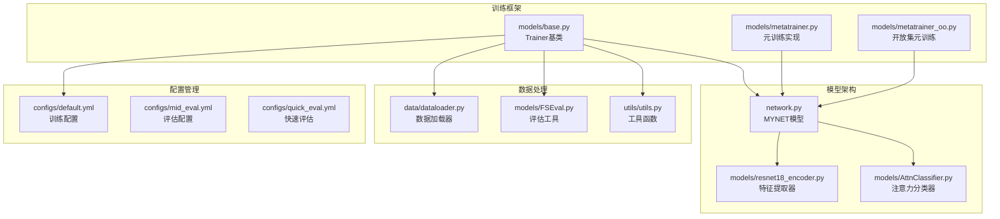
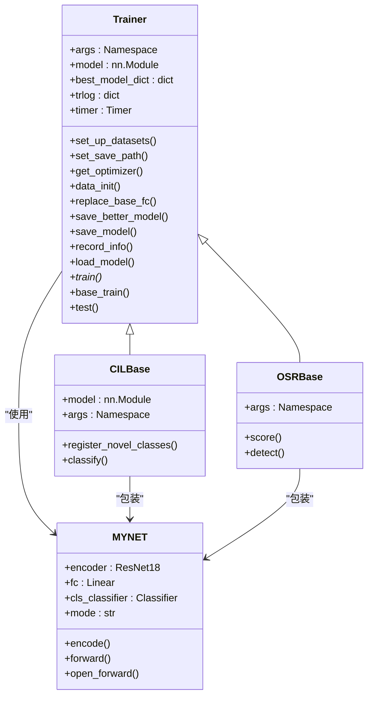
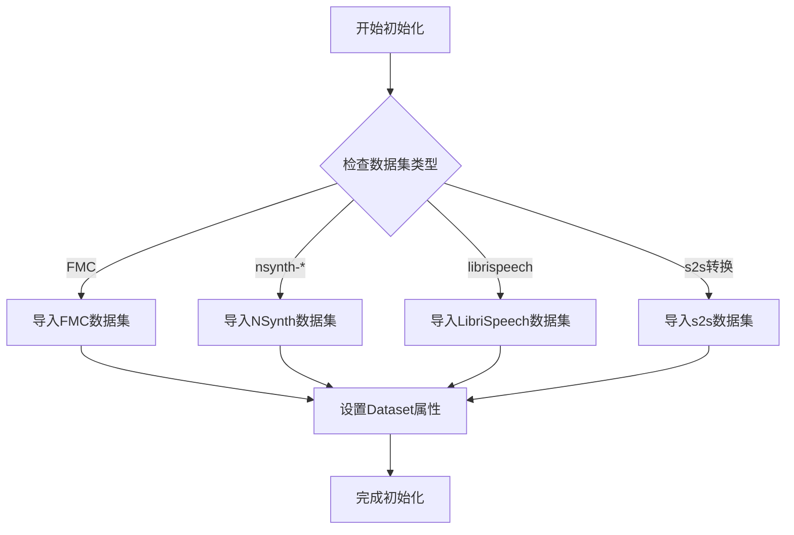
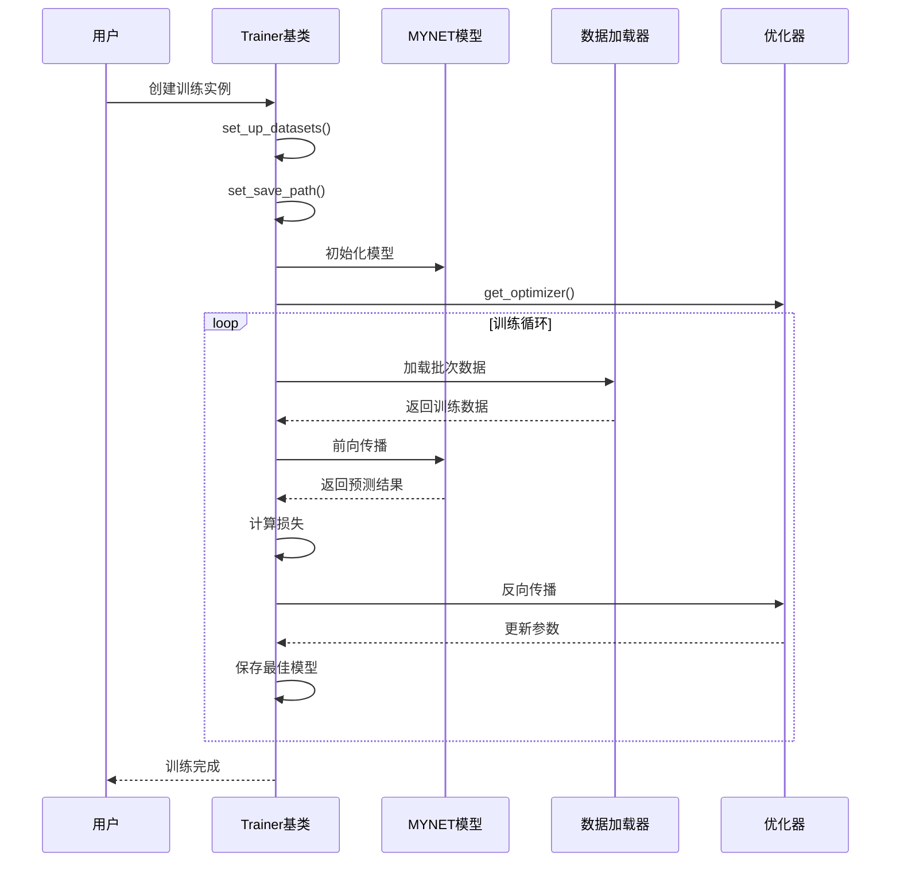
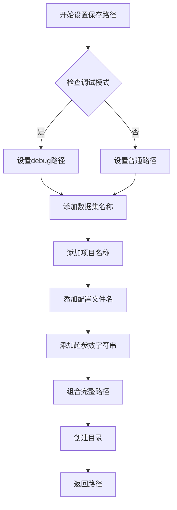
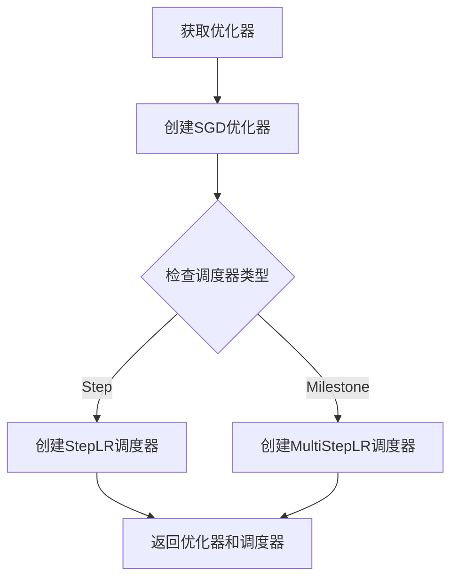
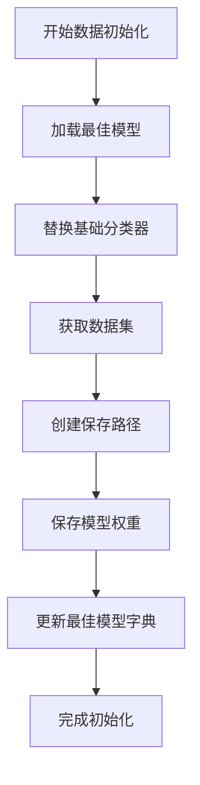
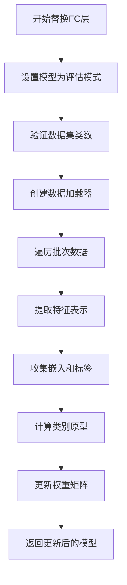
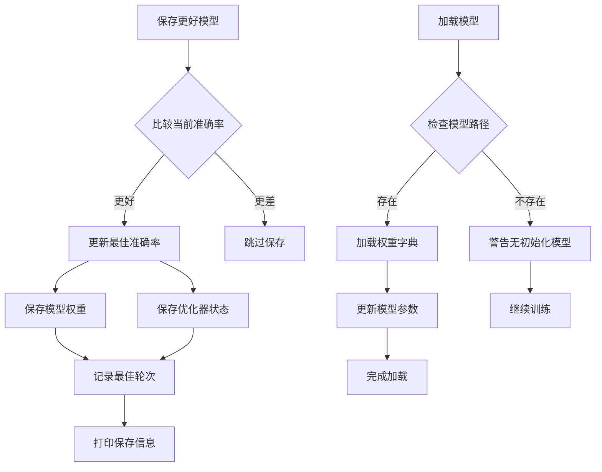
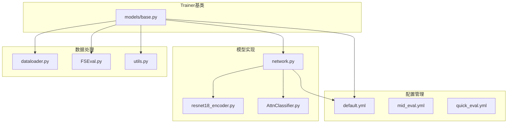

# Trainer基类

<cite>
**本文档引用的文件**
- [models/base.py](file://models/base.py)
- [models/metatrainer.py](file://models/metatrainer.py)
- [models/metatrainer_oo.py](file://models/metatrainer_oo.py)
- [network.py](file://network.py)
- [train.py](file://train.py)
- [configs/default.yml](file://configs/default.yml)
</cite>

## 目录
1. [简介](#简介)
2. [项目结构](#项目结构)
3. [核心组件](#核心组件)
4. [架构概览](#架构概览)
5. [详细组件分析](#详细组件分析)
6. [依赖关系分析](#依赖关系分析)
7. [性能考虑](#性能考虑)
8. [故障排除指南](#故障排除指南)
9. [结论](#结论)

## 简介

Trainer基类是本项目训练框架的核心抽象类，采用面向对象设计模式为增量学习和少样本学习提供统一的训练接口。该基类实现了完整的训练生命周期管理，包括数据集初始化、模型保存路径设置、优化器配置、模型替换机制等功能。

Trainer基类的设计理念基于以下原则：
- **抽象化**：通过抽象方法定义训练流程的通用接口
- **可扩展性**：允许子类根据具体任务需求定制训练行为
- **模块化**：将训练过程分解为独立的功能模块
- **配置驱动**：通过配置文件灵活控制训练参数

## 项目结构

该项目采用模块化的组织结构，主要包含以下核心目录：

**图表来源**
- [models/base.py:1-254](file://models/base.py#L1-L254)
- [network.py:1-724](file://network.py#L1-L724)

**章节来源**
- [models/base.py:1-254](file://models/base.py#L1-L254)
- [network.py:1-724](file://network.py#L1-L724)

## 核心组件

### Trainer基类架构

Trainer基类采用抽象基类(ABC)设计，提供了完整的训练基础设施：

**图表来源**
- [models/base.py:27-254](file://models/base.py#L27-L254)
- [models/baselines/base.py:11-76](file://models/baselines/base.py#L11-L76)
- [network.py:18-504](file://network.py#L18-L504)

### 数据集初始化机制

set_up_datasets()方法实现了灵活的数据集选择逻辑：

**图表来源**
- [models/base.py:51-66](file://models/base.py#L51-L66)

**章节来源**
- [models/base.py:51-66](file://models/base.py#L51-L66)

## 架构概览

### 整体训练流程

**图表来源**
- [models/base.py:27-100](file://models/base.py#L27-L100)
- [network.py:18-504](file://network.py#L18-L504)

### 模型保存路径管理

set_save_path()方法实现了智能的路径管理机制：

**图表来源**
- [models/base.py:68-83](file://models/base.py#L68-L83)

**章节来源**
- [models/base.py:68-83](file://models/base.py#L68-L83)

## 详细组件分析

### 优化器配置系统

get_optimizer()方法提供了灵活的优化器配置：

**图表来源**
- [models/base.py:91-100](file://models/base.py#L91-L100)

优化器配置特点：
- **SGD优化器**：默认使用动量为0.9，Nesterov加速
- **权重衰减**：通过配置文件控制
- **学习率调度**：支持Step和MultiStep两种策略
- **参数过滤**：仅优化需要梯度的参数

**章节来源**
- [models/base.py:91-100](file://models/base.py#L91-L100)

### 数据初始化流程

data_init()方法实现了增量学习中的数据初始化：

**图表来源**
- [models/base.py:111-119](file://models/base.py#L111-L119)

**章节来源**
- [models/base.py:111-119](file://models/base.py#L111-L119)

### 全连接层替换算法

replace_base_fc()方法实现了动态分类器替换：

**图表来源**
- [models/base.py:120-151](file://models/base.py#L120-L151)

算法复杂度分析：
- **时间复杂度**：O(N×D)，其中N为样本数量，D为特征维度
- **空间复杂度**：O(N×D)，用于存储嵌入特征
- **原型计算**：对每个类别计算均值向量

**章节来源**
- [models/base.py:120-151](file://models/base.py#L120-L151)

### 模型保存和加载机制

save_better_model()和load_model()方法提供了完整的模型持久化：

**图表来源**
- [models/base.py:153-167](file://models/base.py#L153-L167)
- [models/base.py:236-244](file://models/base.py#L236-L244)

**章节来源**
- [models/base.py:153-167](file://models/base.py#L153-L167)
- [models/base.py:236-244](file://models/base.py#L236-L244)

## 依赖关系分析

### 组件耦合度分析

**图表来源**
- [models/base.py:14-24](file://models/base.py#L14-L24)
- [network.py:1-17](file://network.py#L1-L17)

### 外部依赖关系

Trainer基类依赖的关键外部库：
- **PyTorch**：深度学习框架，提供张量操作和神经网络模块
- **scikit-learn**：机器学习工具包，提供评估指标和数据处理
- **tqdm**：进度条显示库，改善用户体验
- **numpy**：数值计算库，提供高效的数组操作

**章节来源**
- [models/base.py:13-24](file://models/base.py#L13-L24)

## 性能考虑

### 训练效率优化

1. **内存管理**：使用torch.no_grad()减少反向传播开销
2. **批量处理**：合理设置batch size平衡内存和速度
3. **数据预取**：利用pin_memory提高数据传输效率
4. **混合精度**：在支持的硬件上启用AMP加速

### 计算复杂度分析

- **前向传播**：O(B×N×D)，B为batch size，N为序列长度，D为特征维度
- **反向传播**：与前向传播相同量级
- **原型计算**：O(N×D)，需要遍历整个数据集
- **模型保存**：O(N×D)，需要序列化整个权重矩阵

## 故障排除指南

### 常见问题及解决方案

1. **数据集加载错误**
   - 检查数据集路径配置
   - 验证数据格式兼容性
   - 确认文件权限设置

2. **内存不足问题**
   - 减小batch size
   - 启用梯度检查点
   - 使用混合精度训练

3. **模型收敛问题**
   - 调整学习率和调度器参数
   - 检查数据预处理一致性
   - 验证损失函数设置

**章节来源**
- [models/base.py:153-167](file://models/base.py#L153-L167)

## 结论

Trainer基类通过抽象化设计为增量学习和少样本学习提供了强大的基础设施。其核心优势包括：

1. **高度模块化**：清晰分离数据处理、模型训练、评估等职责
2. **灵活配置**：通过配置文件支持多种训练策略
3. **可扩展性强**：子类可以轻松定制特定的训练行为
4. **生产就绪**：包含完整的模型保存、加载和监控机制

该设计为后续的训练策略扩展奠定了坚实基础，支持从基础分类到复杂增量学习场景的各种应用需求。