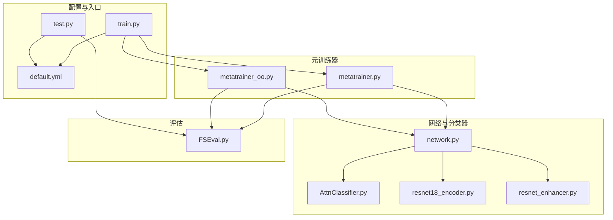
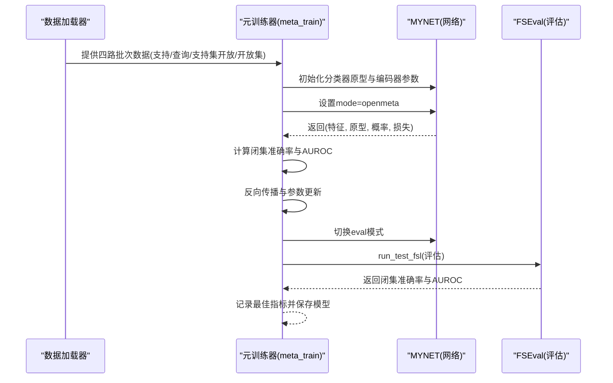
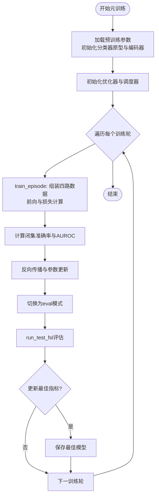
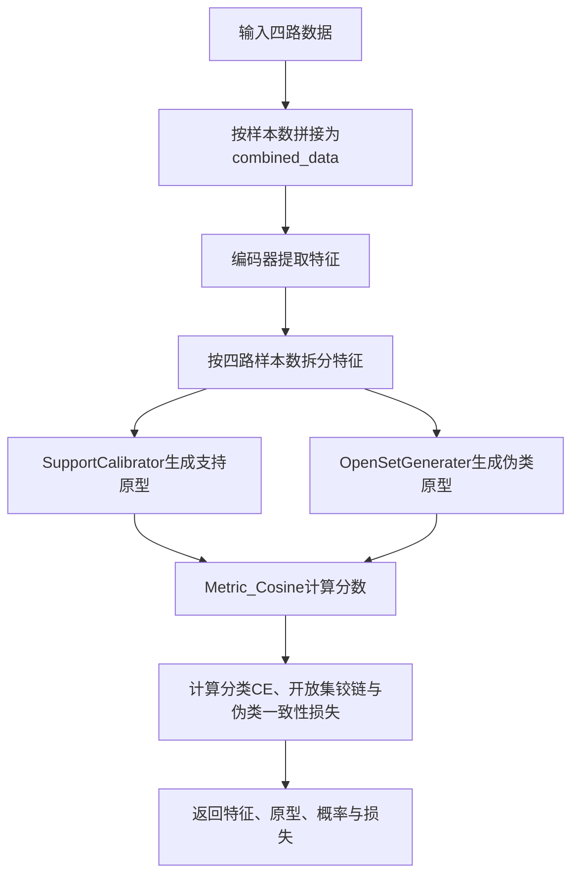
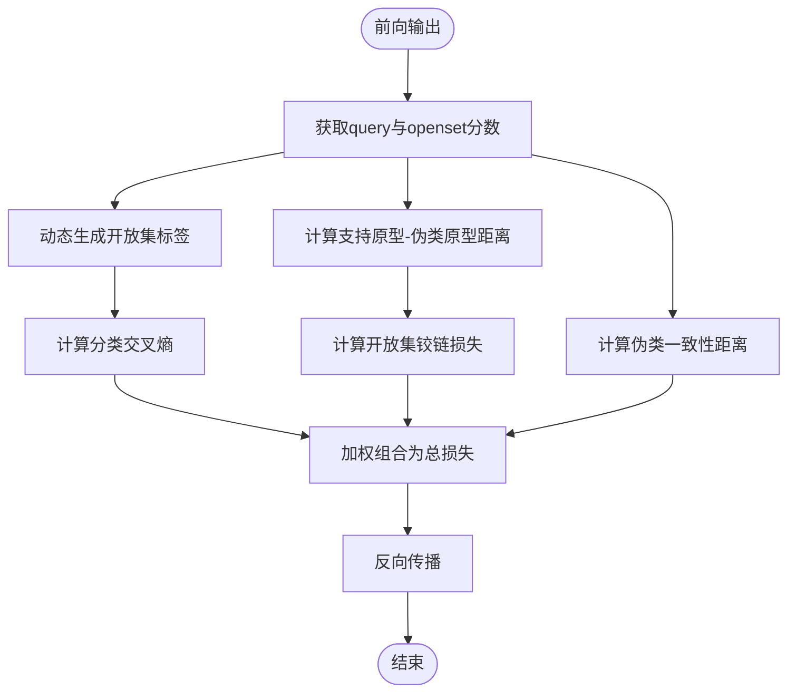
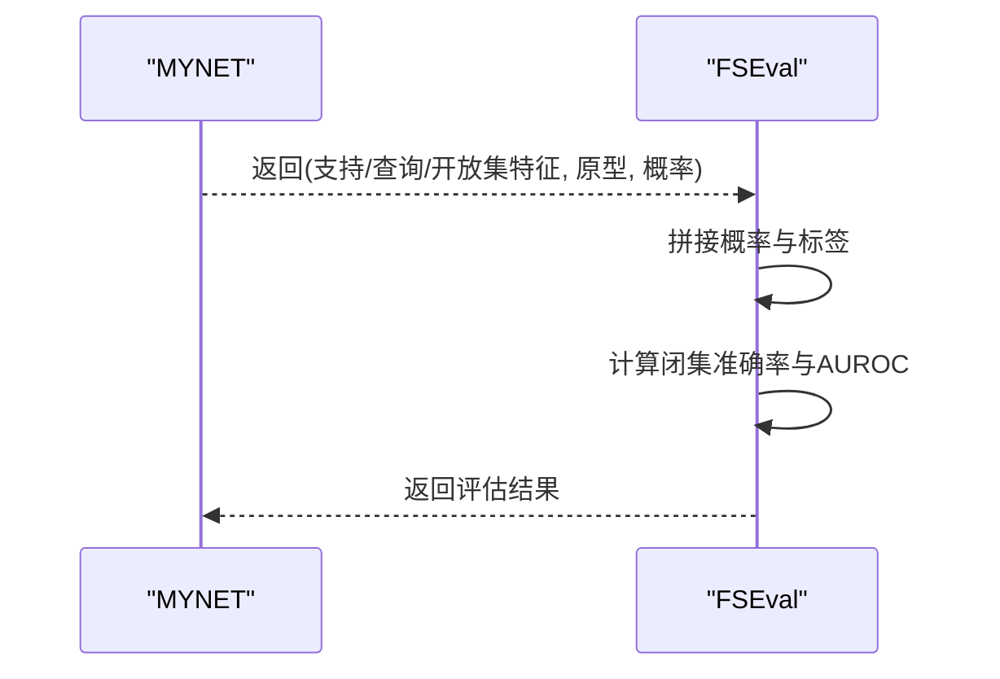
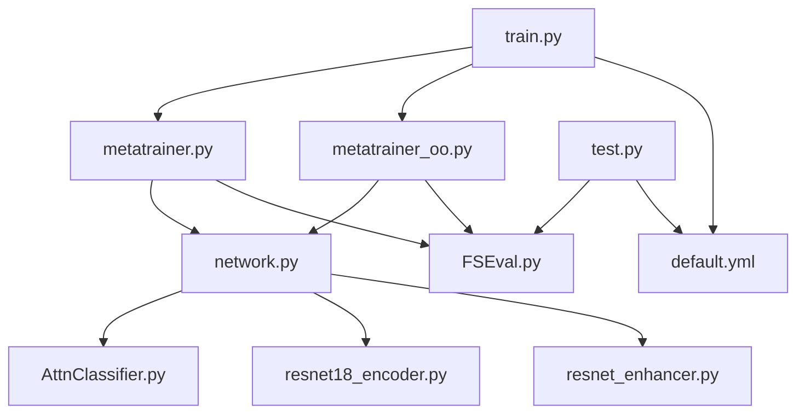

# 元训练器

<cite>
**本文引用的文件**
- [models/metatrainer.py](file://models/metatrainer.py)
- [models/metatrainer_oo.py](file://models/metatrainer_oo.py)
- [models/FSEval.py](file://models/FSEval.py)
- [network.py](file://network.py)
- [models/AttnClassifier.py](file://models/AttnClassifier.py)
- [models/resnet18_encoder.py](file://models/resnet18_encoder.py)
- [models/resnet_enhancer.py](file://models/resnet_enhancer.py)
- [configs/default.yml](file://configs/default.yml)
- [train.py](file://train.py)
- [test.py](file://test.py)
</cite>

## 目录
1. [简介](#简介)
2. [项目结构](#项目结构)
3. [核心组件](#核心组件)
4. [架构总览](#架构总览)
5. [详细组件分析](#详细组件分析)
6. [依赖关系分析](#依赖关系分析)
7. [性能考量](#性能考量)
8. [故障排查指南](#故障排查指南)
9. [结论](#结论)
10. [附录](#附录)

## 简介
本文件系统化阐述元训练器（MetaTrainer）在元学习框架下的设计与实现，重点覆盖以下方面：
- 元训练流程与训练循环：如何加载预训练表示、初始化分类器原型、在支持集与查询集上进行快速适配与推理。
- 支持集与查询集处理：如何组织与打包四路数据（支持集、查询集、支持集开放集、开放集），以及标签与索引的动态映射。
- 快速适配与损失函数：如何通过分类交叉熵、开放集铰链损失与伪类一致性损失实现端到端优化。
- 与传统训练器的差异与优势：元训练器聚焦“少样本+开放集”能力，强调快速适配与未知类判别，适合增量学习场景。
- 增量学习应用：结合基类与新类的逐步扩展，利用原型与注意力机制实现稳定迁移与泛化。
- 实际使用示例与最佳实践：参数配置、训练脚本入口、评估流程与性能优化建议。

## 项目结构
本项目围绕“网络结构（MYNET）+ 元训练器（metatrainer）+ 评估（FSEval）+ 配置（default.yml）”组织，核心文件如下：
- 元训练器：models/metatrainer.py、models/metatrainer_oo.py
- 网络与分类器：network.py、models/AttnClassifier.py、models/resnet18_encoder.py、models/resnet_enhancer.py
- 评估工具：models/FSEval.py
- 配置：configs/default.yml
- 训练入口：train.py、test.py

图表来源
- [models/metatrainer.py:17-85](file://models/metatrainer.py#L17-L85)
- [models/metatrainer_oo.py:17-85](file://models/metatrainer_oo.py#L17-L85)
- [network.py:18-49](file://network.py#L18-L49)
- [models/AttnClassifier.py:39-93](file://models/AttnClassifier.py#L39-L93)
- [models/resnet18_encoder.py:349-358](file://models/resnet18_encoder.py#L349-L358)
- [models/resnet_enhancer.py:51-160](file://models/resnet_enhancer.py#L51-L160)
- [models/FSEval.py:17-42](file://models/FSEval.py#L17-L42)
- [configs/default.yml:1-88](file://configs/default.yml#L1-L88)
- [train.py:799-800](file://train.py#L799-L800)
- [test.py:780-781](file://test.py#L780-L781)

章节来源
- [models/metatrainer.py:17-85](file://models/metatrainer.py#L17-L85)
- [models/metatrainer_oo.py:17-85](file://models/metatrainer_oo.py#L17-L85)
- [models/FSEval.py:17-42](file://models/FSEval.py#L17-L42)
- [network.py:18-49](file://network.py#L18-L49)
- [models/AttnClassifier.py:39-93](file://models/AttnClassifier.py#L39-L93)
- [models/resnet18_encoder.py:349-358](file://models/resnet18_encoder.py#L349-L358)
- [models/resnet_enhancer.py:51-160](file://models/resnet_enhancer.py#L51-L160)
- [configs/default.yml:1-88](file://configs/default.yml#L1-L88)
- [train.py:799-800](file://train.py#L799-L800)
- [test.py:780-781](file://test.py#L780-L781)

## 核心组件
- 元训练器（MetaTrainer）
  - 负责加载预训练参数、初始化分类器原型、构建优化器与调度器、执行元训练循环与评估。
  - 支持两种实现：基础版（metatrainer.py）与开放集判别版（metatrainer_oo.py），后者在AUROC计算上采用更严格的“1对1”判别策略。
- 网络与分类器（MYNET + Classifier）
  - MYNET封装编码器（ResNet18）、分类器（AttnClassifier）、注意力与度量模块，支持“openmeta”模式下的四路数据前向与损失计算。
  - Classifier负责支持集校准、开放集负原型生成、余弦度量与伪类一致性距离计算。
- 评估工具（FSEval）
  - 提供FSL开放集评估流程，计算闭集准确率与AUROC，支持置信区间汇总。
- 配置（default.yml）
  - 提供训练与元训练的关键超参（n_ways、n_shots、n_queries、epochs_meta、学习率与调度策略等）。

章节来源
- [models/metatrainer.py:17-85](file://models/metatrainer.py#L17-L85)
- [models/metatrainer_oo.py:17-85](file://models/metatrainer_oo.py#L17-L85)
- [network.py:18-49](file://network.py#L18-L49)
- [models/AttnClassifier.py:39-93](file://models/AttnClassifier.py#L39-L93)
- [models/FSEval.py:17-42](file://models/FSEval.py#L17-L42)
- [configs/default.yml:1-88](file://configs/default.yml#L1-L88)

## 架构总览
元训练器在“预训练初始化 + 快速适配 + 开放集判别”的元学习范式下工作，整体流程如下：

图表来源
- [models/metatrainer.py:17-85](file://models/metatrainer.py#L17-L85)
- [models/FSEval.py:17-42](file://models/FSEval.py#L17-L42)
- [network.py:37-49](file://network.py#L37-L49)

## 详细组件分析

### 元训练器（基础版与开放集版）
- 预训练参数加载与初始化
  - 从预训练权重路径加载参数，分离分类头与编码器参数，分别初始化分类器原型与编码器权重。
- 优化器与学习率调度
  - 仅对分类器参数进行优化；支持余弦退火或阶梯衰减策略。
- 训练循环与评估
  - 每轮训练调用train_episode，对支持集与查询集进行快速适配；在评估阶段调用run_test_fsl进行闭集准确率与AUROC评估。
- 指标记录与模型保存
  - 记录最大闭集准确率与AUROC及其对应轮次；定期保存模型。

图表来源
- [models/metatrainer.py:17-85](file://models/metatrainer.py#L17-L85)
- [models/FSEval.py:17-42](file://models/FSEval.py#L17-L42)

章节来源
- [models/metatrainer.py:17-85](file://models/metatrainer.py#L17-L85)
- [models/metatrainer_oo.py:17-85](file://models/metatrainer_oo.py#L17-L85)

### 支持集与查询集处理
- 数据打包
  - 支持集、查询集、支持集开放、开放集四路数据按顺序拼接为combined_data，标签按需扩展（开放集标签统一为n_ways）。
- 特征拆分与索引映射
  - 编码器输出按四路样本数拆分为support_feat、query_feat、supopen_feat、openset_feat；conj_ids用于支持集与基类索引映射。
- 任务前向与损失
  - open_forward中计算支持原型、伪类原型与开放集铰链损失、伪类一致性损失；最终合并为总损失并反传。

图表来源
- [network.py:102-151](file://network.py#L102-L151)
- [models/AttnClassifier.py:39-93](file://models/AttnClassifier.py#L39-L93)
- [models/AttnClassifier.py:121-185](file://models/AttnClassifier.py#L121-L185)
- [models/AttnClassifier.py:188-271](file://models/AttnClassifier.py#L188-L271)
- [models/AttnClassifier.py:352-368](file://models/AttnClassifier.py#L352-L368)

章节来源
- [network.py:102-151](file://network.py#L102-L151)
- [models/AttnClassifier.py:39-93](file://models/AttnClassifier.py#L39-L93)
- [models/AttnClassifier.py:121-185](file://models/AttnClassifier.py#L121-L185)
- [models/AttnClassifier.py:188-271](file://models/AttnClassifier.py#L188-L271)
- [models/AttnClassifier.py:352-368](file://models/AttnClassifier.py#L352-L368)

### 快速适配与损失函数
- 分类交叉熵损失（loss_cls）
  - 使用支持集与查询集的联合分数与标签计算，支持动态标签（开放集）映射。
- 开放集铰链损失（loss_open_hinge）
  - 通过支持原型与伪类原型之间的距离施加铰链约束，促使边界分离。
- 伪类一致性损失（loss_funit）
  - 通过余弦相似度衡量伪类与对应负原型的一致性，鼓励生成更稳定的负原型。
- 总损失
  - 总损失由分类损失与开放集损失加权组合，进一步叠加伪类一致性损失。

图表来源
- [network.py:153-200](file://network.py#L153-L200)
- [network.py:133-146](file://network.py#L133-L146)

章节来源
- [network.py:153-200](file://network.py#L153-L200)
- [network.py:133-146](file://network.py#L133-L146)

### 评估流程（FSEval）
- 特征与概率计算
  - 对支持集、查询集、开放集分别计算特征与余弦概率，拼接后用于指标计算。
- 指标计算
  - 闭集准确率：对查询集预测与真实标签计算准确率。
  - AUROC：基于未知/已知样本的得分排序计算AUROC，支持置信区间汇总。

图表来源
- [models/FSEval.py:77-112](file://models/FSEval.py#L77-L112)
- [models/FSEval.py:46-73](file://models/FSEval.py#L46-L73)

章节来源
- [models/FSEval.py:77-112](file://models/FSEval.py#L77-L112)
- [models/FSEval.py:46-73](file://models/FSEval.py#L46-L73)

### 与传统训练器的区别与优势
- 元训练器
  - 面向“少样本+开放集”场景，强调快速适配与未知类判别；通过动态标签与铰链损失强化边界。
  - 适合增量学习：在已有基类基础上，逐步引入新类并保持性能稳定。
- 传统训练器
  - 更偏向标准监督学习，通常不包含开放集判别与动态标签机制。
- 优势
  - 在增量学习中具备更强的泛化与鲁棒性，能更好应对未知类与类别不平衡问题。

章节来源
- [models/metatrainer.py:17-85](file://models/metatrainer.py#L17-L85)
- [models/metatrainer_oo.py:17-85](file://models/metatrainer_oo.py#L17-L85)
- [network.py:102-151](file://network.py#L102-L151)

### 参数配置与使用示例
- 关键参数（来自配置文件）
  - n_ways、n_shots、n_queries：元训练的 Few-Shot 场景设置。
  - epochs_meta：元训练轮数。
  - learning_rate、optimizer（momentum、decay）、scheduler（cosine、lr_decay_rate、lr_decay_epochs）：优化与调度策略。
  - gamma、funit：开放集铰链与伪类一致性的损失权重。
- 使用示例（训练入口）
  - 训练入口在train.py中调用元训练器，加载预训练模型并执行元训练与评估。
  - 测试入口在test.py中执行增量测试与评估。

章节来源
- [configs/default.yml:1-88](file://configs/default.yml#L1-L88)
- [train.py:799-800](file://train.py#L799-L800)
- [test.py:780-781](file://test.py#L780-L781)

## 依赖关系分析
- 元训练器依赖网络与评估模块
  - 元训练器通过MYNET的openmeta模式完成前向与损失计算，并通过FSEval进行闭集准确率与AUROC评估。
- 网络模块内部依赖
  - MYNET依赖AttnClassifier（支持集校准、开放集生成、度量）、ResNet18编码器与特征增强模块。
- 配置驱动
  - default.yml提供n_ways、n_shots、epochs_meta、学习率与调度策略等关键超参，驱动训练行为。

图表来源
- [models/metatrainer.py:17-85](file://models/metatrainer.py#L17-L85)
- [models/metatrainer_oo.py:17-85](file://models/metatrainer_oo.py#L17-L85)
- [network.py:18-49](file://network.py#L18-L49)
- [models/AttnClassifier.py:39-93](file://models/AttnClassifier.py#L39-L93)
- [models/resnet18_encoder.py:349-358](file://models/resnet18_encoder.py#L349-L358)
- [models/resnet_enhancer.py:51-160](file://models/resnet_enhancer.py#L51-L160)
- [models/FSEval.py:17-42](file://models/FSEval.py#L17-L42)
- [configs/default.yml:1-88](file://configs/default.yml#L1-L88)
- [train.py:799-800](file://train.py#L799-L800)
- [test.py:780-781](file://test.py#L780-L781)

章节来源
- [models/metatrainer.py:17-85](file://models/metatrainer.py#L17-L85)
- [models/metatrainer_oo.py:17-85](file://models/metatrainer_oo.py#L17-L85)
- [network.py:18-49](file://network.py#L18-L49)
- [models/AttnClassifier.py:39-93](file://models/AttnClassifier.py#L39-L93)
- [models/resnet18_encoder.py:349-358](file://models/resnet18_encoder.py#L349-L358)
- [models/resnet_enhancer.py:51-160](file://models/resnet_enhancer.py#L51-L160)
- [models/FSEval.py:17-42](file://models/FSEval.py#L17-L42)
- [configs/default.yml:1-88](file://configs/default.yml#L1-L88)
- [train.py:799-800](file://train.py#L799-L800)
- [test.py:780-781](file://test.py#L780-L781)

## 性能考量
- 训练稳定性
  - 使用余弦分类器与温度参数控制分数分布，有助于稳定训练与边界清晰化。
  - 通过动态标签与铰链损失，减少开放集混淆，提升鲁棒性。
- 计算效率
  - 采用余弦相似度与注意力聚合，减少冗余计算；合理设置batch与n_ways/n_shots可平衡内存与速度。
- 评估可靠性
  - 评估阶段使用置信区间汇总，提高结果可信度；AUROC与闭集准确率双指标监控。

## 故障排查指南
- 模式设置错误
  - 若在不确定性估计或特征提取时模式未恢复，可能导致后续训练崩溃；务必在get_uncertainty等过程中恢复原始mode。
- 设备与维度不匹配
  - 特征增强与聚类模块需确保张量设备一致；若出现维度不匹配，检查拼接与拆分逻辑。
- 学习率与调度
  - 若使用余弦退火，注意监控验证指标；若阶梯衰减，确认衰减步长与阈值设置是否合理。
- 开放集AUROC异常
  - 若AUROC为NaN或不稳定，检查开放集标签与概率计算逻辑，确保未知类标签正确映射。

章节来源
- [network.py:50-101](file://network.py#L50-L101)
- [models/resnet_enhancer.py:51-160](file://models/resnet_enhancer.py#L51-L160)
- [models/FSEval.py:46-73](file://models/FSEval.py#L46-L73)

## 结论
元训练器在元学习与增量学习场景中提供了高效、稳健的快速适配与开放集判别能力。通过预训练初始化、动态标签与铰链损失、伪类一致性约束，以及完善的评估流程，能够在不断引入新类的同时保持对基类的稳定性能。配合合理的参数配置与训练策略，可广泛应用于少样本与开放世界持续学习任务。

## 附录
- 实际使用建议
  - 从default.yml中调整n_ways、n_shots、epochs_meta与学习率策略，确保与数据规模匹配。
  - 在增量学习中，优先使用开放集AUROC与闭集准确率综合评估模型泛化能力。
  - 定期保存最佳模型并记录指标，便于后续分析与回溯。