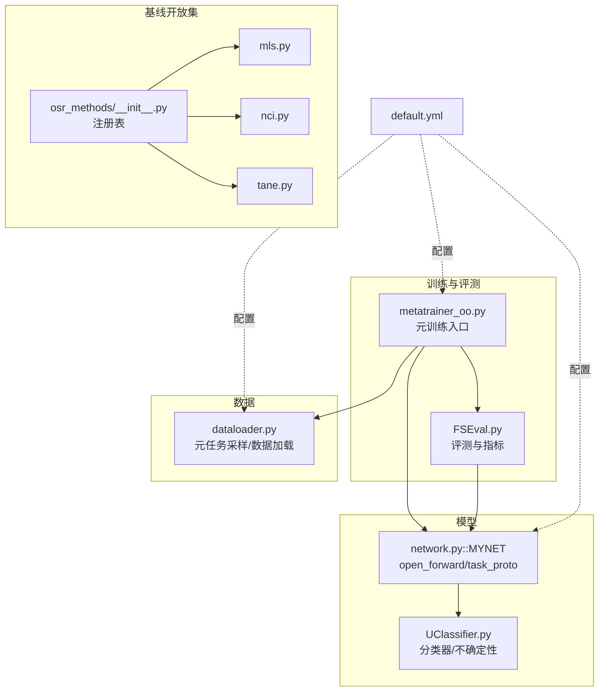
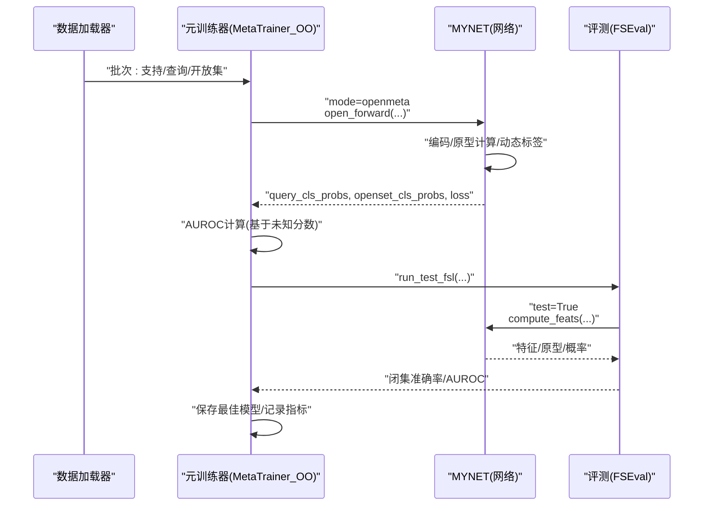
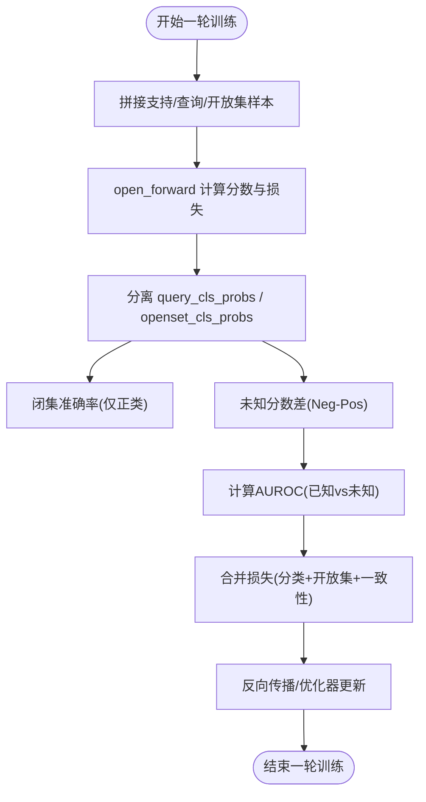
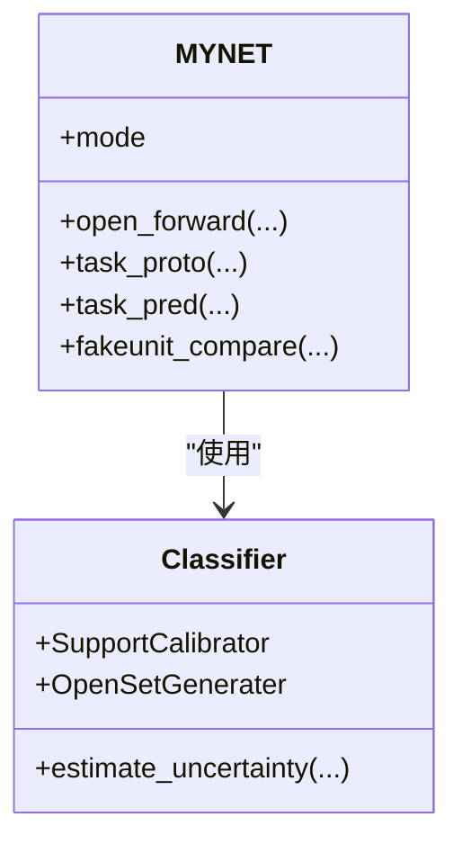
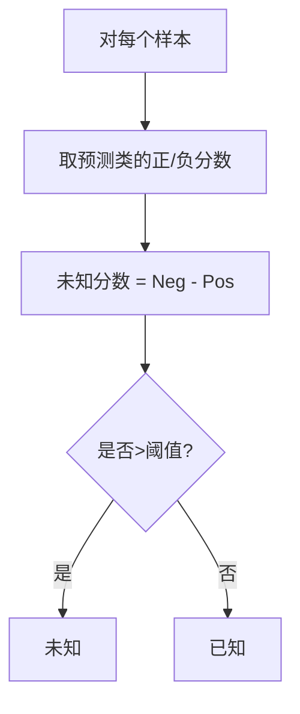
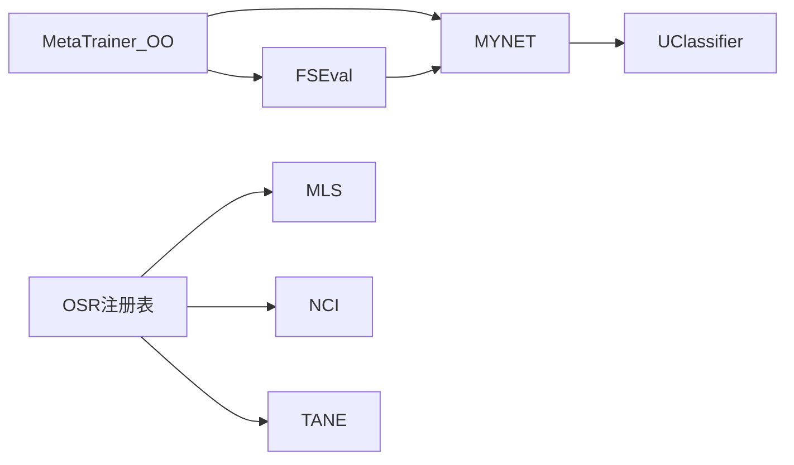

# 开放集元训练器

<cite>
**本文引用的文件**   
- [models/metatrainer_oo.py](file://models/metatrainer_oo.py)
- [models/metatrainer.py](file://models/metatrainer.py)
- [models/UClassifier.py](file://models/UClassifier.py)
- [models/FSEval.py](file://models/FSEval.py)
- [data/dataloader.py](file://data/dataloader.py)
- [network.py](file://network.py)
- [configs/default.yml](file://configs/default.yml)
- [scripts/run_all_baselines.py](file://scripts/run_all_baselines.py)
- [models/baselines/osr_methods/__init__.py](file://models/baselines/osr_methods/__init__.py)
- [models/baselines/osr_methods/mls.py](file://models/baselines/osr_methods/mls.py)
- [models/baselines/osr_methods/nci.py](file://models/baselines/osr_methods/nci.py)
- [models/baselines/osr_methods/tane.py](file://models/baselines/osr_methods/tane.py)
</cite>

## 目录
1. [简介](#简介)
2. [项目结构](#项目结构)
3. [核心组件](#核心组件)
4. [架构总览](#架构总览)
5. [详细组件分析](#详细组件分析)
6. [依赖关系分析](#依赖关系分析)
7. [性能考量](#性能考量)
8. [故障排查指南](#故障排查指南)
9. [结论](#结论)
10. [附录](#附录)

## 简介
本文件面向“开放集元训练器（MetaTrainer_OO）”的完整技术文档，聚焦于开放集学习场景下的元训练设计与实现。开放集学习的核心挑战在于：模型在元训练阶段同时接触已知类与未知类样本，需要在不引入显式阈值的前提下，通过分类器与生成器的联合优化，实现对未知样本的判别与拒识。本文将系统阐述：
- 未知类别处理与动态标签分配策略
- 开放集识别机制与阈值设定思路
- 与标准元训练器的差异与改进点
- 理论基础、实现细节与性能评估方法
- 配置示例与调优建议

## 项目结构
该项目围绕“音频/语音片段”的 Few-Shot 开放集元学习展开，核心模块包括：
- 训练入口与元训练流程：models/metatrainer_oo.py
- 标准元训练器对比：models/metatrainer.py
- 模型与前向逻辑：network.py（MYNET、open_forward、task_proto 等）
- 分类器与不确定性估计：models/UClassifier.py
- 评测与指标计算：models/FSEval.py
- 数据加载与元任务采样：data/dataloader.py
- 基线开放集方法注册与实现：models/baselines/osr_methods/*
- 配置文件：configs/default.yml
- 基线对比脚本：scripts/run_all_baselines.py

**图表来源**
- [models/metatrainer_oo.py:17-85](file://models/metatrainer_oo.py#L17-L85)
- [models/FSEval.py:17-42](file://models/FSEval.py#L17-L42)
- [network.py:102-151](file://network.py#L102-L151)
- [models/UClassifier.py:7-405](file://models/UClassifier.py#L7-L405)
- [data/dataloader.py:19-46](file://data/dataloader.py#L19-L46)
- [models/baselines/osr_methods/__init__.py:7-21](file://models/baselines/osr_methods/__init__.py#L7-L21)
- [configs/default.yml:1-88](file://configs/default.yml#L1-L88)

**章节来源**
- [models/metatrainer_oo.py:17-85](file://models/metatrainer_oo.py#L17-L85)
- [models/FSEval.py:17-42](file://models/FSEval.py#L17-L42)
- [network.py:102-151](file://network.py#L102-L151)
- [models/UClassifier.py:7-405](file://models/UClassifier.py#L7-L405)
- [data/dataloader.py:19-46](file://data/dataloader.py#L19-L46)
- [models/baselines/osr_methods/__init__.py:7-21](file://models/baselines/osr_methods/__init__.py#L7-L21)
- [configs/default.yml:1-88](file://configs/default.yml#L1-L88)

## 核心组件
- 元训练入口（MetaTrainer_OO）：负责加载预训练特征提取器权重、初始化分类器原型、执行元训练与评估，采用 AUROC 作为开放集指标。
- 模型前向（MYNET.open_forward/task_proto）：在 openmeta 模式下，将支持集、查询集、开放集样本拼接后统一编码，分别计算支持原型与伪类原型，结合动态标签与二元判别损失，实现开放集拒识。
- 分类器与不确定性（UClassifier）：提供支持校准、开放集生成、多头注意力与不确定性估计（MC Dropout + 核范数）能力，支撑开放集识别与增量学习。
- 评测与指标（FSEval）：在测试阶段将支持/查询/开放集特征归一化并计算余弦相似度，输出闭集准确率与开放集 AUROC。
- 数据加载（dataloader）：构造 CurriculumMetaDataset，按“已知/当前/未知”三段组织元任务，支持动态标签与 base_ids 传递。

**章节来源**
- [models/metatrainer_oo.py:17-85](file://models/metatrainer_oo.py#L17-L85)
- [network.py:102-151](file://network.py#L102-L151)
- [models/UClassifier.py:7-405](file://models/UClassifier.py#L7-L405)
- [models/FSEval.py:17-42](file://models/FSEval.py#L17-L42)
- [data/dataloader.py:263-351](file://data/dataloader.py#L263-L351)

## 架构总览
MetaTrainer_OO 的训练与推理路径如下：

**图表来源**
- [models/metatrainer_oo.py:17-85](file://models/metatrainer_oo.py#L17-L85)
- [models/FSEval.py:17-42](file://models/FSEval.py#L17-L42)
- [network.py:102-151](file://network.py#L102-L151)

## 详细组件分析

### 元训练器（MetaTrainer_OO）设计与实现
- 预训练权重初始化：从预训练检查点加载分类器与特征提取器权重，冻结 encoder 并仅优化分类器参数。
- 训练循环：每轮 epoch 内遍历元任务，将支持集、查询集、开放集样本拼接后送入模型，得到两类概率分布与损失项。
- 损失构成：包含分类交叉熵、开放集 Hinge 损失与伪类原型一致性损失，通过加权融合进行端到端优化。
- 评估指标：使用 AUROC（基于未知分数差）衡量开放集拒识性能，同时记录闭集准确率。

**图表来源**
- [models/metatrainer_oo.py:87-214](file://models/metatrainer_oo.py#L87-L214)

**章节来源**
- [models/metatrainer_oo.py:17-85](file://models/metatrainer_oo.py#L17-L85)
- [models/metatrainer_oo.py:87-214](file://models/metatrainer_oo.py#L87-L214)

### 模型前向与动态标签（MYNET.open_forward/task_proto）
- open_forward：将四类样本拼接编码，拆分为支持/查询/开放集特征，计算支持原型与伪类原型，返回测试特征、原型与概率分布。
- task_proto：对开放集样本根据其“最像的已知类”生成动态标签，将开放集样本的正类分数与对应负原型对齐，再与查询样本标签拼接，统一计算交叉熵损失。
- 伪类一致性损失：通过二元判别器对齐支持原型与伪类原型，提升开放集拒识边界。

**图表来源**
- [network.py:102-151](file://network.py#L102-L151)
- [models/UClassifier.py:7-405](file://models/UClassifier.py#L7-L405)

**章节来源**
- [network.py:102-151](file://network.py#L102-L151)
- [models/UClassifier.py:7-405](file://models/UClassifier.py#L7-L405)

### 开放集识别机制与阈值设定策略
- 未知分数定义：对每个样本，取其预测类的正类分数与负类分数之差（Neg - Pos），作为“未知程度”评分。若差值较大，判定为未知。
- AUROC 评估：将查询集（已知）与开放集（未知）的未知分数拼接，计算 AUROC，衡量拒识性能。
- 与基线方法的关系：MLs（最大对数分数）、TANE（Top-k 角度归一化能量）、NCI（最近类不一致）等开放集评分方法可作为替代或补充策略，但本实现采用“Neg-Pos 差值”作为默认判别准则。

**图表来源**
- [models/metatrainer_oo.py:167-191](file://models/metatrainer_oo.py#L167-L191)
- [models/baselines/osr_methods/mls.py:20-25](file://models/baselines/osr_methods/mls.py#L20-L25)
- [models/baselines/osr_methods/tane.py:21-28](file://models/baselines/osr_methods/tane.py#L21-L28)
- [models/baselines/osr_methods/nci.py:20-30](file://models/baselines/osr_methods/nci.py#L20-L30)

**章节来源**
- [models/metatrainer_oo.py:167-191](file://models/metatrainer_oo.py#L167-L191)
- [models/baselines/osr_methods/mls.py:20-25](file://models/baselines/osr_methods/mls.py#L20-L25)
- [models/baselines/osr_methods/tane.py:21-28](file://models/baselines/osr_methods/tane.py#L21-L28)
- [models/baselines/osr_methods/nci.py:20-30](file://models/baselines/osr_methods/nci.py#L20-L30)

### 与标准元训练器的差异与改进
- 标签与损失：标准元训练器对开放集直接使用扩展类别标签（n+1），而 MetaTrainer_OO 采用“动态标签 + 伪类原型”的联合判别，避免显式阈值。
- 开放集损失：MetaTrainer_OO 引入开放集 Hinge 损失与伪类一致性损失，强化拒识边界与原型稳定性。
- 评测指标：两者均使用 AUROC，但 MetaTrainer_OO 的 AUROC 来自“未知分数差”，标准元训练器来自“未知类概率”。

**章节来源**
- [models/metatrainer.py:137-178](file://models/metatrainer.py#L137-L178)
- [models/metatrainer_oo.py:137-154](file://models/metatrainer_oo.py#L137-L154)

### 不确定性估计与增量学习
- 不确定性估计：通过 MC Dropout 与掩码增强，构建预测矩阵并计算核范数作为不确定性度量，可用于样本重要性加权。
- 增量学习：基于不确定性权重对样本进行加权损失更新，实现对简单样本的优先学习与知识保留。

**章节来源**
- [models/UClassifier.py:42-122](file://models/UClassifier.py#L42-L122)
- [models/UClassifier.py:382-397](file://models/UClassifier.py#L382-L397)

### 数据加载与元任务组织
- CurriculumMetaDataset：将“已知/当前/未知”三段类别集合组织为元任务，支持动态采样与填充策略，保证输入张量维度一致。
- base_ids：通过 base_ids 将“已知类”原型注入模型内部，实现跨阶段的原型共享与一致性。

**章节来源**
- [data/dataloader.py:263-351](file://data/dataloader.py#L263-L351)

## 依赖关系分析
- 元训练器依赖模型的 open_forward 与 task_proto，二者共同完成动态标签与损失计算。
- 评测模块依赖模型的 test 模式，输出特征与概率，供 AUROC 计算。
- 基线开放集方法提供可替换的未知评分策略，便于对比实验。

**图表来源**
- [models/metatrainer_oo.py:17-85](file://models/metatrainer_oo.py#L17-L85)
- [models/FSEval.py:17-42](file://models/FSEval.py#L17-L42)
- [models/UClassifier.py:7-405](file://models/UClassifier.py#L7-L405)
- [models/baselines/osr_methods/__init__.py:7-21](file://models/baselines/osr_methods/__init__.py#L7-L21)

**章节来源**
- [models/metatrainer_oo.py:17-85](file://models/metatrainer_oo.py#L17-L85)
- [models/FSEval.py:17-42](file://models/FSEval.py#L17-L42)
- [models/UClassifier.py:7-405](file://models/UClassifier.py#L7-L405)
- [models/baselines/osr_methods/__init__.py:7-21](file://models/baselines/osr_methods/__init__.py#L7-L21)

## 性能考量
- 训练稳定性：通过 Hinge 损失与伪类一致性损失，约束支持原型与伪类原型的距离，避免过拟合未知类。
- 指标鲁棒性：AUROC 对阈值不敏感，适合开放集拒识评估；建议在不同数据集与任务上进行多次独立测试取均值与置信区间。
- 计算开销：拼接四类样本的前向计算量较大，建议合理设置 batch 与设备内存，必要时降低 n_ways/n_queries 或使用混合精度。

## 故障排查指南
- AUROC 无法收敛或异常：检查未知分数差的计算是否正确，确认 openset 样本的动态标签与负原型对齐。
- 评测阶段报错：确保 test=True 时模型输出格式与 FSEval 期望一致，特征与概率的拼接顺序正确。
- 数据维度不匹配：CurriculumMetaDataset 的填充策略需与模型内部处理一致，避免 base_ids 与原型维度不一致。

**章节来源**
- [models/metatrainer_oo.py:167-191](file://models/metatrainer_oo.py#L167-L191)
- [models/FSEval.py:77-112](file://models/FSEval.py#L77-L112)
- [data/dataloader.py:317-331](file://data/dataloader.py#L317-L331)

## 结论
MetaTrainer_OO 在开放集元学习场景下，通过“动态标签 + 伪类原型 + Hinge 损失 + 不确定性估计”的综合设计，实现了无需显式阈值的未知样本拒识。相比标准元训练器，其在损失设计与评测指标上更具开放集针对性，适合在持续学习与增量场景中部署。建议在实际应用中结合基线开放集方法进行对比实验，并依据任务特性调整未知分数差阈值与损失权重。

## 附录

### 配置示例与调优建议
- 关键超参数
  - n_ways/n_shots/n_queries：控制元任务规模与开放集拒识难度
  - gamma/funit：开放集损失与一致性损失的权重
  - hinge_margin：Hinge 损失的边界约束
  - temperature：余弦分类温度缩放
- 调优建议
  - 逐步增大 n_ways 与 n_queries，观察 AUROC 与闭集准确率的平衡
  - 调整 gamma 与 hinge_margin，使开放集拒识边界清晰但不过度拒识
  - 使用不确定性估计指导样本优先级，提升增量学习稳定性

**章节来源**
- [configs/default.yml:1-88](file://configs/default.yml#L1-L88)
- [models/metatrainer_oo.py:140-142](file://models/metatrainer_oo.py#L140-L142)
- [network.py:134-146](file://network.py#L134-L146)