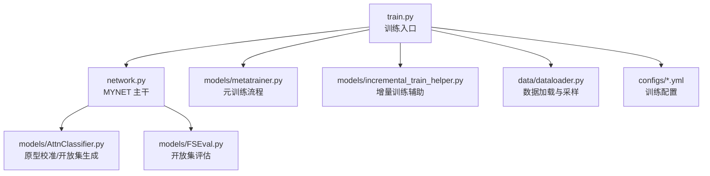
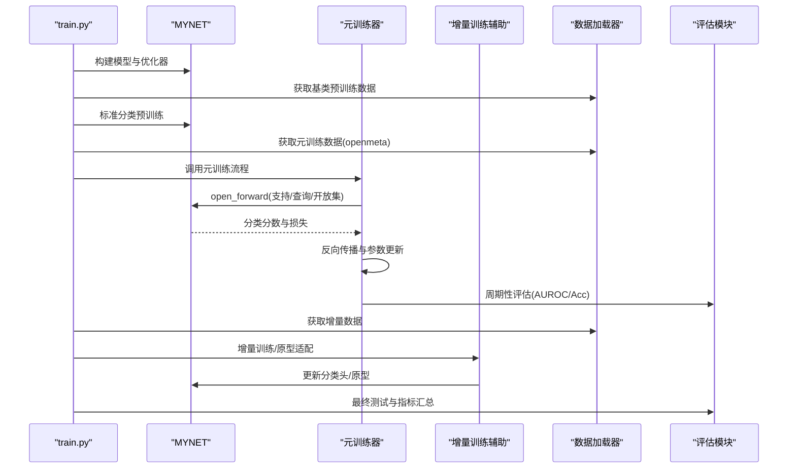
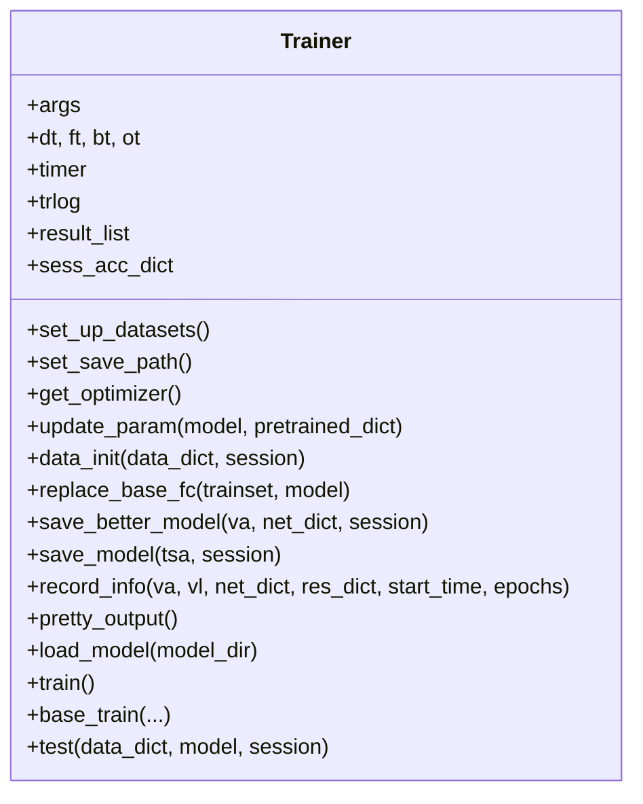
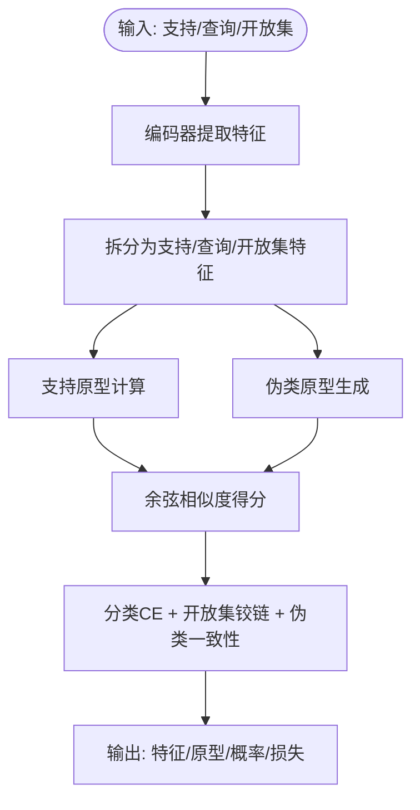
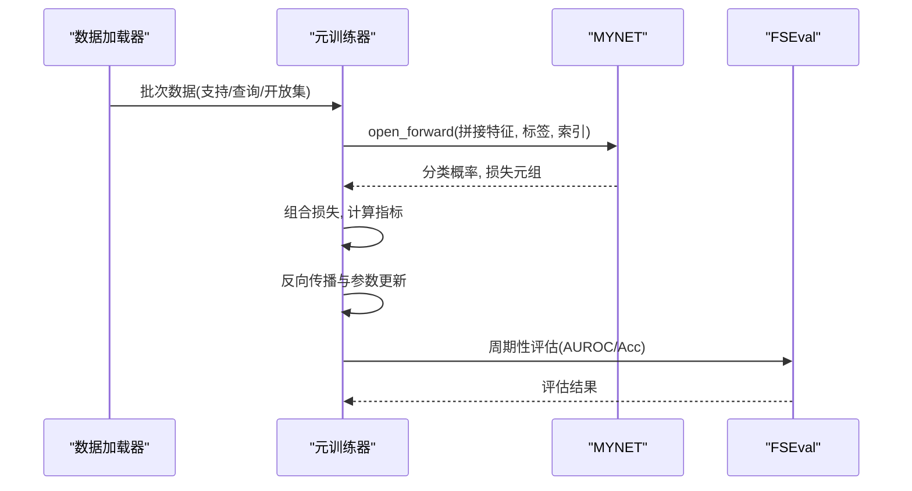
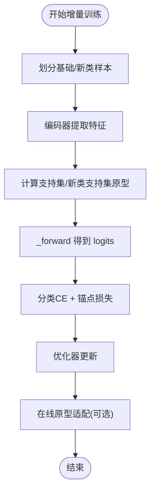
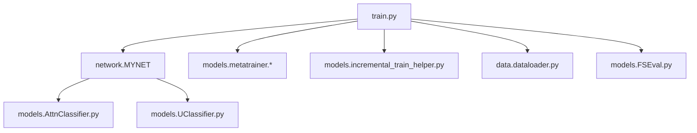

# 训练框架

<cite>
**本文引用的文件**
- [models/base.py](file://models/base.py)
- [models/metatrainer.py](file://models/metatrainer.py)
- [models/metatrainer_oo.py](file://models/metatrainer_oo.py)
- [models/incremental_train_helper.py](file://models/incremental_train_helper.py)
- [models/AttnClassifier.py](file://models/AttnClassifier.py)
- [models/UClassifier.py](file://models/UClassifier.py)
- [models/FSEval.py](file://models/FSEval.py)
- [network.py](file://network.py)
- [data/dataloader.py](file://data/dataloader.py)
- [configs/default.yml](file://configs/default.yml)
- [configs/mid_eval.yml](file://configs/mid_eval.yml)
- [configs/quick_eval.yml](file://configs/quick_eval.yml)
- [train.py](file://train.py)
</cite>

## 目录
1. [简介](#简介)
2. [项目结构](#项目结构)
3. [核心组件](#核心组件)
4. [架构总览](#架构总览)
5. [详细组件分析](#详细组件分析)
6. [依赖分析](#依赖分析)
7. [性能考虑](#性能考虑)
8. [故障排查指南](#故障排查指南)
9. [结论](#结论)
10. [附录](#附录)

## 简介
本文件系统化梳理 VAZE 项目的训练框架，围绕以下目标展开：Trainer 基类的设计与职责、元训练器（MetaTrainer）的端到端工作流、增量训练策略、训练过程关键步骤（数据准备、前向传播、反向传播、模型更新）、支持的训练模式与配置项、以及参数调优与性能监控方法。文档力求兼顾技术深度与可读性，帮助读者快速掌握框架设计思想与实现细节。

## 项目结构
- 训练入口与主流程：train.py 负责加载配置、构建模型、执行基类预训练、元训练（openmeta）、增量学习与评估。
- 模型与网络：network.py 定义 MYNET 主干网络，包含编码器、分类头、注意力模块与前向逻辑；AttnClassifier/UClassifier 提供原型校准与开放集生成能力。
- 训练器与元训练：models/metatrainer.py 与 models/metatrainer_oo.py 提供元训练流程与评估；models/incremental_train_helper.py 提供增量阶段的训练辅助。
- 数据与采样：data/dataloader.py 提供各类数据加载器与采样器，支持小样本元学习与增量场景。
- 配置：configs/*.yml 提供默认与不同规模的实验配置。
- 评估：models/FSEval.py 提供开放集评估指标（AUROC、准确率）。

图表来源
- [train.py:1-1296](file://train.py#L1-L1296)
- [network.py:1-724](file://network.py#L1-L724)
- [models/metatrainer.py:1-201](file://models/metatrainer.py#L1-L201)
- [models/incremental_train_helper.py:1-156](file://models/incremental_train_helper.py#L1-L156)
- [models/FSEval.py:1-125](file://models/FSEval.py#L1-L125)
- [data/dataloader.py:1-351](file://data/dataloader.py#L1-L351)
- [configs/default.yml:1-88](file://configs/default.yml#L1-L88)

章节来源
- [train.py:1-1296](file://train.py#L1-L1296)
- [network.py:1-724](file://network.py#L1-L724)
- [models/metatrainer.py:1-201](file://models/metatrainer.py#L1-L201)
- [models/incremental_train_helper.py:1-156](file://models/incremental_train_helper.py#L1-L156)
- [models/FSEval.py:1-125](file://models/FSEval.py#L1-L125)
- [data/dataloader.py:1-351](file://data/dataloader.py#L1-L351)
- [configs/default.yml:1-88](file://configs/default.yml#L1-L88)

## 核心组件
- Trainer 基类（抽象接口与通用工具）
  - 负责数据集初始化、保存路径管理、优化器与调度器构造、模型保存与加载、基础训练与测试流程占位。
  - 提供原型替换、最佳模型保存、训练日志记录等通用能力。
- MYNET 主干网络
  - 包含音频特征提取器（ResNet18）、分类头（线性层）、注意力模块（多头注意力）、以及针对不同模式的前向分支（encoder/openmeta/_forward）。
  - 支持温度缩放、余弦分类、原型计算与伪类生成。
- 元训练器（MetaTrainer）
  - 提供 openmeta 模式的端到端训练：数据打包、前向传播、损失计算（分类+开放集铰链+伪类一致性）、反向传播与参数更新。
  - 提供周期性评估与模型保存。
- 增量训练辅助
  - 提供增量阶段的基础训练、在线原型适配、优化器与学习率调度配置。
- 数据加载与采样
  - 支持小样本元学习采样（SupportsetSampler、TrueIncreTrainCategoriesSampler）、课程学习采样（CurriculumSampler）与课程数据集（CurriculumMetaDataset）。
- 评估模块
  - 提供开放集评估（AUROC、准确率）与置信区间统计。

章节来源
- [models/base.py:27-254](file://models/base.py#L27-L254)
- [network.py:18-724](file://network.py#L18-L724)
- [models/metatrainer.py:17-201](file://models/metatrainer.py#L17-L201)
- [models/incremental_train_helper.py:11-156](file://models/incremental_train_helper.py#L11-L156)
- [data/dataloader.py:1-351](file://data/dataloader.py#L1-L351)
- [models/FSEval.py:17-125](file://models/FSEval.py#L17-L125)

## 架构总览
VAZE 训练框架采用“主干网络 + 分类器模块 + 数据加载器 + 训练器”的分层设计。训练流程分为三个阶段：
- 基类预训练：标准分类训练，冻结/微调编码器，得到良好的特征表示。
- 元训练（openmeta）：在小样本元学习设置下，联合支持集与开放集进行原型校准与伪类生成，最大化闭集准确率同时提升开放集判别能力。
- 增量学习：随着新类加入，逐步扩展分类头与原型，结合聚类与原型更新策略，维持旧任务性能并适应新任务。

图表来源
- [train.py:800-981](file://train.py#L800-L981)
- [models/metatrainer.py:17-178](file://models/metatrainer.py#L17-L178)
- [models/incremental_train_helper.py:28-156](file://models/incremental_train_helper.py#L28-L156)
- [models/FSEval.py:17-42](file://models/FSEval.py#L17-L42)
- [network.py:37-151](file://network.py#L37-L151)

## 详细组件分析

### Trainer 基类（抽象接口与通用工具）
- 职责
  - 数据集注册与路径管理、保存目录生成、训练统计与日志记录。
  - 优化器与学习率调度器工厂、最佳模型保存与加载、原型替换（基于平均嵌入）。
- 关键点
  - 通过 ns2str 将命名空间参数序列化为保存路径的一部分，便于实验对比。
  - replace_base_fc 基于训练集平均嵌入重置分类头权重，保证初始性能。
  - 保存与加载模型字典，支持断点续训与结果复现。

图表来源
- [models/base.py:27-254](file://models/base.py#L27-L254)

章节来源
- [models/base.py:27-254](file://models/base.py#L27-L254)

### MYNET 主干网络与前向流程
- 结构要点
  - 编码器：ResNet18，输出特征经自适应池化进入分类头。
  - 分类头：线性层或余弦分类（可配置温度缩放）。
  - 注意力模块：多头注意力用于支持/查询/开放集之间的交互与原型聚合。
  - 模式切换：encoder/openmeta/_forward 三种模式对应不同训练阶段。
- open_forward 流程
  - 将支持/查询/开放集拼接后统一编码，拆分特征并计算支持原型与伪类原型。
  - 通过余弦相似度获得分类分数，计算分类 CE 损失与开放集铰链损失，叠加伪类一致性损失。
  - 返回特征、原型、概率与损失，供元训练器使用。
- _forward 流程（增量阶段）
  - 对支持集与查询集进行原型计算与注意力聚合，输出余弦相似度 logits。

图表来源
- [network.py:102-151](file://network.py#L102-L151)
- [network.py:225-255](file://network.py#L225-L255)

章节来源
- [network.py:18-724](file://network.py#L18-L724)

### 元训练器（MetaTrainer）工作流
- 入口与初始化
  - 加载预训练分类头权重，冻结特征提取器，仅优化分类头参数。
  - 选择学习率调度策略（余弦退火或阶梯衰减）。
- 单轮训练（train_episode）
  - 数据打包：支持集、查询集、开放集拼接，标签处理（开放集标签扩展为未知类）。
  - 前向传播：open_forward 返回分类概率与损失元组。
  - 损失组合：分类损失 + 开放集铰链损失 + 伪类一致性损失。
  - 指标计算：闭集准确率（仅查询集）、开放集 AUROC（基于未知分数差）。
  - 反向传播与参数更新。
- 周期性评估与保存
  - 使用 FSEval.run_test_fsl 在开放集测试集上评估 AUROC 与准确率。
  - 记录最佳指标并保存模型。

图表来源
- [models/metatrainer.py:17-178](file://models/metatrainer.py#L17-L178)
- [models/FSEval.py:17-42](file://models/FSEval.py#L17-L42)

章节来源
- [models/metatrainer.py:17-201](file://models/metatrainer.py#L17-L201)
- [models/FSEval.py:17-125](file://models/FSEval.py#L17-L125)

### 增量训练策略
- 基础增量训练（base_incre_train）
  - 将基础类与新类样本拼接，编码后计算原型，支持/查询与新类支持/查询分别处理。
  - 通过分类损失与锚点损失（ARPLoss）联合优化。
- 在线原型适配（online_proto_adapt）
  - 使用距离度量与软标签融合，对新类原型进行在线更新。
  - 与分类头参数共同优化，提升增量阶段性能。
- 优化器与调度
  - 针对编码器、注意力模块、分类头与损失模块分别设置学习率与权重衰减。
  - 支持 Step/Milestone 调度策略。

图表来源
- [models/incremental_train_helper.py:28-156](file://models/incremental_train_helper.py#L28-L156)
- [network.py:225-255](file://network.py#L225-L255)

章节来源
- [models/incremental_train_helper.py:11-156](file://models/incremental_train_helper.py#L11-L156)
- [network.py:586-700](file://network.py#L586-L700)

### 训练过程关键步骤
- 数据准备
  - 使用 CurriculumMetaDataset/SupportsetSampler 等采样器组织小样本元学习批次。
  - 标签处理：将开放集样本标签扩展为未知类，便于统一损失计算。
- 前向传播
  - open_forward：拼接支持/查询/开放集，统一编码后拆分，计算支持与伪类原型，得到分类分数与损失。
  - _forward：增量阶段使用注意力聚合支持/查询原型，输出 logits。
- 反向传播与模型更新
  - 元训练：对分类头参数进行优化，特征提取器在 openmeta 模式下保持冻结。
  - 增量训练：对编码器、注意力模块、分类头与损失模块联合优化。
- 评估与监控
  - 使用 FSEval.run_test_fsl 计算 AUROC 与准确率，记录最佳指标并保存模型。

章节来源
- [data/dataloader.py:263-351](file://data/dataloader.py#L263-L351)
- [models/metatrainer.py:87-178](file://models/metatrainer.py#L87-L178)
- [models/FSEval.py:17-125](file://models/FSEval.py#L17-L125)

### 训练模式与配置选项
- 训练模式
  - encoder：仅进行特征提取，用于预训练与原型替换。
  - openmeta：元训练模式，联合支持/查询/开放集进行原型校准与伪类生成。
  - incre/_forward：增量阶段的原型计算与注意力聚合。
- 关键配置项（来自 configs/*.yml）
  - 训练超参：way、shot、n_ways、n_shots、n_queries、epochs.*、lr.*、scheduler.*、optimizer.*
  - 网络配置：temperature、base_mode/new_mode、extractor 参数
  - 采样与数据集：episode.*、dataloader.*、strategy.*

章节来源
- [configs/default.yml:1-88](file://configs/default.yml#L1-L88)
- [configs/mid_eval.yml:1-88](file://configs/mid_eval.yml#L1-L88)
- [configs/quick_eval.yml:1-88](file://configs/quick_eval.yml#L1-L88)
- [network.py:326-403](file://network.py#L326-L403)

### 参数调优与性能监控
- 学习率与调度
  - 支持余弦退火与阶梯衰减两种策略，可通过 args.cosine 与 lr_decay_epochs 控制。
- 温度缩放与分类头
  - 通过 temperature 控制余弦分类的锐利程度；ft_cos/ft_dot/new_mode 控制分类头类型。
- 指标监控
  - 训练日志记录训练/验证损失与准确率；元训练周期性评估 AUROC 与 Acc，记录最佳指标。
- 可视化与诊断
  - 提供 t-SNE、相关性热图、特征分布等可视化工具，辅助分析特征空间与聚类效果。

章节来源
- [models/metatrainer.py:29-48](file://models/metatrainer.py#L29-L48)
- [models/base.py:177-191](file://models/base.py#L177-L191)
- [train.py:238-377](file://train.py#L238-L377)

## 依赖分析
- 组件耦合
  - train.py 依赖 network.MYNET、models.metatrainer.*、models.incremental_train_helper.*、data.dataloader.*、models.FSEval.*。
  - MYNET 依赖 models.AttnClassifier 与 models.UClassifier（通过 cls_classifier）。
  - 数据加载器依赖采样器与数据集实现。
- 外部依赖
  - PyTorch、sklearn、tqdm、numpy、yaml 等。

图表来源
- [train.py:1-1296](file://train.py#L1-L1296)
- [network.py:1-724](file://network.py#L1-L724)
- [models/metatrainer.py:1-201](file://models/metatrainer.py#L1-L201)
- [models/incremental_train_helper.py:1-156](file://models/incremental_train_helper.py#L1-L156)
- [models/FSEval.py:1-125](file://models/FSEval.py#L1-L125)
- [models/AttnClassifier.py:1-369](file://models/AttnClassifier.py#L1-L369)
- [models/UClassifier.py:1-405](file://models/UClassifier.py#L1-L405)

章节来源
- [train.py:1-1296](file://train.py#L1-L1296)
- [network.py:1-724](file://network.py#L1-L724)

## 性能考虑
- 计算效率
  - 使用余弦分类与温度缩放减少显存占用；注意力模块在支持/查询间共享计算。
  - 采用自适应池化与批处理，平衡吞吐与内存。
- 训练稳定性
  - 阶梯衰减与余弦退火相结合，避免过拟合；学习率与权重衰减按模块分别设置。
- 评估开销
  - 元训练周期性评估使用固定测试集，避免频繁全量评估带来的延迟。

## 故障排查指南
- 模型未收敛或性能波动
  - 检查学习率与调度策略是否合适；确认余弦退火/阶梯衰减配置。
  - 核对分类头初始化与预训练权重加载是否正确。
- 开放集指标异常
  - 检查开放集标签扩展逻辑与 AUROC 计算流程。
  - 确认评估配置（auroc_type）与数据打包顺序。
- 增量阶段灾难性遗忘
  - 检查在线原型适配与分类头扩展策略；适当降低学习率或引入正则。
- 数据加载异常
  - 检查采样器参数与数据集索引范围；确认 CurriculumMetaDataset 的类别映射。

章节来源
- [models/metatrainer.py:17-178](file://models/metatrainer.py#L17-L178)
- [models/FSEval.py:17-125](file://models/FSEval.py#L17-L125)
- [models/incremental_train_helper.py:113-156](file://models/incremental_train_helper.py#L113-L156)
- [data/dataloader.py:263-351](file://data/dataloader.py#L263-L351)

## 结论
VAZE 训练框架以 MYNET 为核心，结合 AttnClassifier/UClassifier 的原型校准与伪类生成能力，在 openmeta 模式下实现了高效的元训练；通过增量训练辅助模块与课程学习采样器，有效支持持续学习场景。配置灵活、评估完备、可视化丰富，适合在开放集识别与增量学习任务中进行系统性研究与工程落地。

## 附录
- 常用配置参考
  - 默认配置：configs/default.yml
  - 中等规模评估：configs/mid_eval.yml
  - 快速评估：configs/quick_eval.yml
- 关键文件路径
  - 训练入口：train.py
  - 网络定义：network.py
  - 元训练：models/metatrainer.py、models/metatrainer_oo.py
  - 增量训练：models/incremental_train_helper.py
  - 分类器：models/AttnClassifier.py、models/UClassifier.py
  - 评估：models/FSEval.py
  - 数据加载：data/dataloader.py、data/sampler.py