# 脚本工具

<cite>
**本文引用的文件**   
- [scripts/run_all_baselines.py](file://scripts/run_all_baselines.py)
- [scripts/collect_metrics_from_logs.py](file://scripts/collect_metrics_from_logs.py)
- [scripts/analyze_center_shifts.py](file://scripts/analyze_center_shifts.py)
- [scripts/visualize_class_center_shifts.py](file://scripts/visualize_class_center_shifts.py)
- [scripts/plot_openworld_results.py](file://scripts/plot_openworld_results.py)
- [scripts/viz_attn_proto.py](file://scripts/viz_attn_proto.py)
- [scripts/viz_curriculum.py](file://scripts/viz_curriculum.py)
- [scripts/viz_feature_space.py](file://scripts/viz_feature_space.py)
- [scripts/viz_main_table.py](file://scripts/viz_main_table.py)
- [scripts/viz_osr.py](file://scripts/viz_osr.py)
- [configs/default.yml](file://configs/default.yml)
- [train_unopenset.py](file://train_unopenset.py)
</cite>

## 目录
1. [简介](#简介)
2. [项目结构](#项目结构)
3. [核心组件](#核心组件)
4. [架构总览](#架构总览)
5. [详细组件分析](#详细组件分析)
6. [依赖分析](#依赖分析)
7. [性能考虑](#性能考虑)
8. [故障排查指南](#故障排查指南)
9. [结论](#结论)
10. [附录](#附录)

## 简介
本指南聚焦 VAZE 项目的脚本工具，系统讲解各类分析与可视化脚本的功能、使用方法与实现原理，并提供批量实验执行与结果汇总方案、脚本定制与扩展建议，以及与主程序的集成方式。读者无需深入代码即可高效完成从实验到可视化的全流程工作。

## 项目结构
脚本工具位于 scripts/ 目录，围绕以下目标展开：
- 批量基线对比评估与汇总
- 结果解析与指标提取
- 特征空间与原型中心可视化
- 开集评分与性能曲线绘制
- 不确定性/课程训练曲线可视化
- 中心漂移分析与联合嵌入

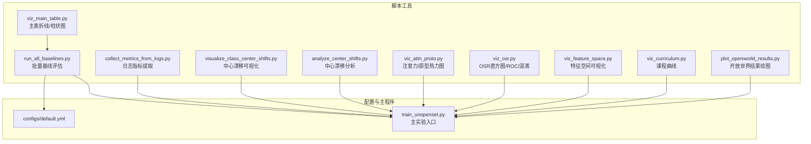

图表来源
- [scripts/run_all_baselines.py:1-282](file://scripts/run_all_baselines.py#L1-L282)
- [scripts/viz_main_table.py:1-83](file://scripts/viz_main_table.py#L1-L83)
- [scripts/visualize_class_center_shifts.py:1-291](file://scripts/visualize_class_center_shifts.py#L1-L291)
- [scripts/analyze_center_shifts.py:1-261](file://scripts/analyze_center_shifts.py#L1-L261)
- [scripts/plot_openworld_results.py:1-128](file://scripts/plot_openworld_results.py#L1-L128)
- [scripts/viz_attn_proto.py:1-120](file://scripts/viz_attn_proto.py#L1-L120)
- [scripts/viz_osr.py:1-100](file://scripts/viz_osr.py#L1-L100)
- [scripts/viz_feature_space.py:1-133](file://scripts/viz_feature_space.py#L1-L133)
- [scripts/viz_curriculum.py:1-88](file://scripts/viz_curriculum.py#L1-L88)
- [scripts/collect_metrics_from_logs.py:1-67](file://scripts/collect_metrics_from_logs.py#L1-L67)
- [configs/default.yml:1-88](file://configs/default.yml#L1-L88)
- [train_unopenset.py:162-200](file://train_unopenset.py#L162-L200)

章节来源
- [scripts/run_all_baselines.py:1-282](file://scripts/run_all_baselines.py#L1-L282)
- [configs/default.yml:1-88](file://configs/default.yml#L1-L88)
- [train_unopenset.py:162-200](file://train_unopenset.py#L162-L200)

## 核心组件
- 批量基线评估与汇总
  - 功能：遍历 CIL×OSR 组合，执行会话增量流程，输出每会话指标与汇总 CSV。
  - 输入：预训练权重、配置文件、CIL/OSR 列表、GPU 设备。
  - 输出：每个组合的文本结果与 comparison_table.csv。
- 日志指标提取
  - 功能：从测试/实验日志中抽取关键指标，生成汇总 CSV。
  - 输入：输入目录、文件前缀、输出 CSV 路径。
  - 输出：metrics_summary.csv。
- 中心漂移分析与可视化
  - 功能：计算前后检查点类中心 L2 变化，生成 CSV 与联合嵌入图（UMAP/t-SNE）。
  - 输入：ckpt_before/ckpt_after、输出 CSV/图路径、采样数量等。
  - 输出：center_shifts.csv、center_shifts_umap.png 或 t-SNE 图。
- 开放世界结果绘图
  - 功能：解析结果文件中的会话曲线与 AA/PD 指标，绘制折线与柱状图。
  - 输入：结果文件路径、输出目录。
  - 输出：session_curves.png、aa_bar.png、pd_bar.png、summary.txt。
- 特征空间与原型可视化
  - 功能：t-SNE/UMAP 投影样本与原型；绘制原型漂移曲线。
  - 输入：ckpt、config、session 列表、输出目录、GPU。
  - 输出：session_{s}.png、prototype_drift.png。
- OSR 评分可视化
  - 功能：绘制不同 OSR 方法的分数直方图、ROC 曲线；已知类混淆矩阵。
  - 输入：ckpt、config、OSR 列表、session、输出目录、GPU。
  - 输出：score_hist_s*.png、roc_s*.png、confusion_s*.png。
- 注意力/原型热力图
  - 功能：展示 AttnClassifier 正负原型热力图与自注意力权重热力图。
  - 输入：ckpt、config、session、输出目录、GPU。
  - 输出：dual_proto_heatmap.png、attention_map.png。
- 课程曲线可视化
  - 功能：解析训练日志中的课程相关指标（如 hard_weight、mc_var、curriculum_ratio）随 epoch 的变化。
  - 输入：日志文件、输出目录。
  - 输出：curriculum_curves.png。
- 主表折线/柱状图
  - 功能：读取 comparison_table.csv，绘制每会话 all-class acc 折线与 AA/PD 柱状图，可叠加“我们方法”行。
  - 输入：comparison_table.csv、可选 ours_csv、输出目录。
  - 输出：main_lineplot.png、main_bar.png。

章节来源
- [scripts/run_all_baselines.py:1-282](file://scripts/run_all_baselines.py#L1-L282)
- [scripts/collect_metrics_from_logs.py:1-67](file://scripts/collect_metrics_from_logs.py#L1-L67)
- [scripts/analyze_center_shifts.py:1-261](file://scripts/analyze_center_shifts.py#L1-L261)
- [scripts/visualize_class_center_shifts.py:1-291](file://scripts/visualize_class_center_shifts.py#L1-L291)
- [scripts/plot_openworld_results.py:1-128](file://scripts/plot_openworld_results.py#L1-L128)
- [scripts/viz_feature_space.py:1-133](file://scripts/viz_feature_space.py#L1-L133)
- [scripts/viz_osr.py:1-100](file://scripts/viz_osr.py#L1-L100)
- [scripts/viz_attn_proto.py:1-120](file://scripts/viz_attn_proto.py#L1-L120)
- [scripts/viz_curriculum.py:1-88](file://scripts/viz_curriculum.py#L1-L88)
- [scripts/viz_main_table.py:1-83](file://scripts/viz_main_table.py#L1-L83)

## 架构总览
脚本工具围绕“配置驱动 + 数据加载 + 模型推理 + 指标计算 + 可视化输出”的流水线组织，统一通过 configs/default.yml 提供参数约定，借助 train_unopenset 的数据集构建与评估流程，保证与主程序的一致性。

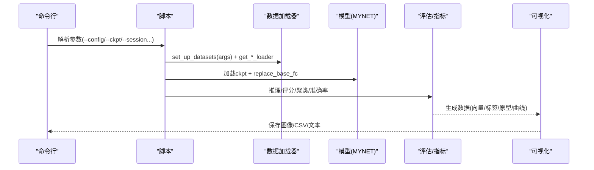

图表来源
- [scripts/run_all_baselines.py:228-282](file://scripts/run_all_baselines.py#L228-L282)
- [scripts/viz_feature_space.py:59-133](file://scripts/viz_feature_space.py#L59-L133)
- [scripts/viz_osr.py:24-100](file://scripts/viz_osr.py#L24-L100)
- [scripts/viz_attn_proto.py:34-120](file://scripts/viz_attn_proto.py#L34-L120)
- [scripts/viz_curriculum.py:50-88](file://scripts/viz_curriculum.py#L50-L88)
- [scripts/plot_openworld_results.py:62-128](file://scripts/plot_openworld_results.py#L62-L128)
- [scripts/visualize_class_center_shifts.py:203-291](file://scripts/visualize_class_center_shifts.py#L203-L291)
- [scripts/analyze_center_shifts.py:136-261](file://scripts/analyze_center_shifts.py#L136-L261)
- [configs/default.yml:1-88](file://configs/default.yml#L1-L88)
- [train_unopenset.py:162-200](file://train_unopenset.py#L162-L200)

## 详细组件分析

### 批量基线评估与汇总（run_all_baselines.py）
- 功能要点
  - 读取 YAML 配置，构建 args 命名空间。
  - 加载预训练模型，替换基础分类器以适配预训练特征。
  - 针对每个 (CIL, OSR) 组合执行会话增量流程：特征编码 → OSR 评分与未知/已知划分 → k-means 聚合伪未知 → CIL 注册新类原型 → 已知/增量/全类准确率计算 → F1/聚类准确性。
  - 将每会话指标写入文本文件，并汇总 AA_all、AA_inc、PD_all 到 comparison_table.csv。
- 使用方法
  - 示例命令：python -m scripts.run_all_baselines --config configs/default.yml --pretrained save/base_train_for_meta_ls.pth --cil cec amfo pan --osr mls tane nci
- 关键流程图

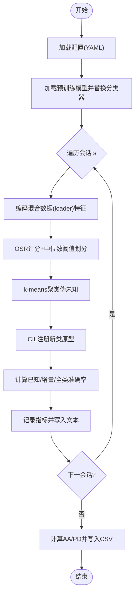

图表来源
- [scripts/run_all_baselines.py:56-171](file://scripts/run_all_baselines.py#L56-L171)
- [scripts/run_all_baselines.py:193-226](file://scripts/run_all_baselines.py#L193-L226)
- [scripts/run_all_baselines.py:228-282](file://scripts/run_all_baselines.py#L228-L282)

章节来源
- [scripts/run_all_baselines.py:1-282](file://scripts/run_all_baselines.py#L1-L282)
- [configs/default.yml:1-88](file://configs/default.yml#L1-L88)

### 日志指标提取（collect_metrics_from_logs.py）
- 功能要点
  - 通过正则匹配从测试/实验日志中抽取 s0_acc、aa_*、pd_* 等指标。
  - 支持指定输入目录、文件前缀与输出 CSV。
- 使用方法
  - 示例命令：python scripts/collect_metrics_from_logs.py --input_dir save_result --prefix test_result --output_csv save_result/metrics_summary.csv
- 流程图

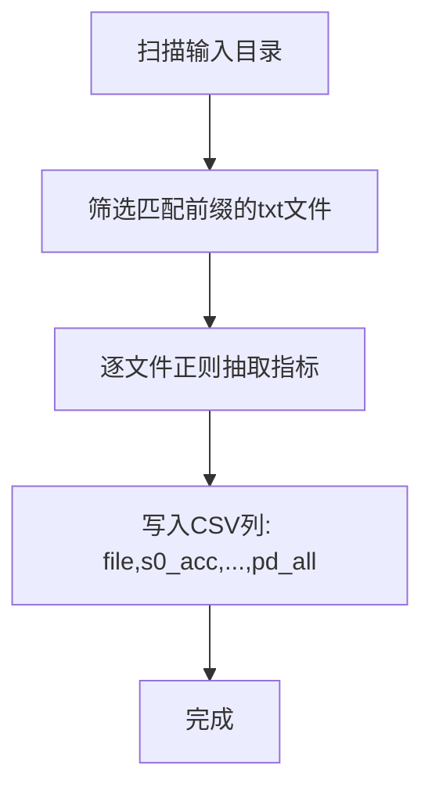

图表来源
- [scripts/collect_metrics_from_logs.py:27-67](file://scripts/collect_metrics_from_logs.py#L27-L67)

章节来源
- [scripts/collect_metrics_from_logs.py:1-67](file://scripts/collect_metrics_from_logs.py#L1-L67)

### 中心漂移分析与可视化（analyze_center_shifts.py / visualize_class_center_shifts.py）
- 功能要点
  - 分析两个检查点的类中心 L2 变化，输出 CSV。
  - 可选 UMAP（若不可用则回退 t-SNE），绘制样本与中心的联合嵌入图，箭头表示中心漂移。
- 使用方法
  - 分析脚本：python scripts/analyze_center_shifts.py --ckpt_before ... --ckpt_after ... --out_csv ... --out_plot ...
  - 可视化脚本：python scripts/visualize_class_center_shifts.py --ckpt_before ... --ckpt_after ... --out ...
- 流程图

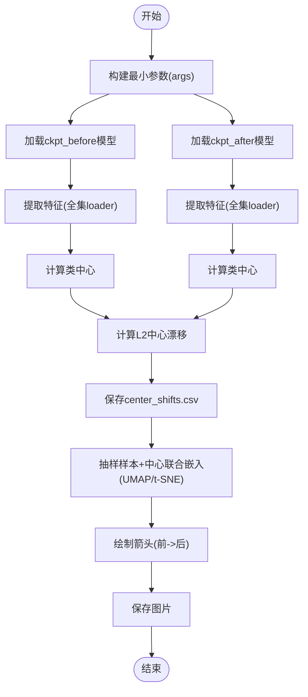

图表来源
- [scripts/analyze_center_shifts.py:136-261](file://scripts/analyze_center_shifts.py#L136-L261)
- [scripts/visualize_class_center_shifts.py:203-291](file://scripts/visualize_class_center_shifts.py#L203-L291)

章节来源
- [scripts/analyze_center_shifts.py:1-261](file://scripts/analyze_center_shifts.py#L1-L261)
- [scripts/visualize_class_center_shifts.py:1-291](file://scripts/visualize_class_center_shifts.py#L1-L291)

### 开放世界结果绘图（plot_openworld_results.py）
- 功能要点
  - 解析结果文件中的会话曲线与 AA/PD 指标，绘制折线图与柱状图，并输出摘要文本。
- 使用方法
  - 示例命令：python scripts/plot_openworld_results.py --result save_result/.../test_result.txt --outdir save_result/plots
- 序列图

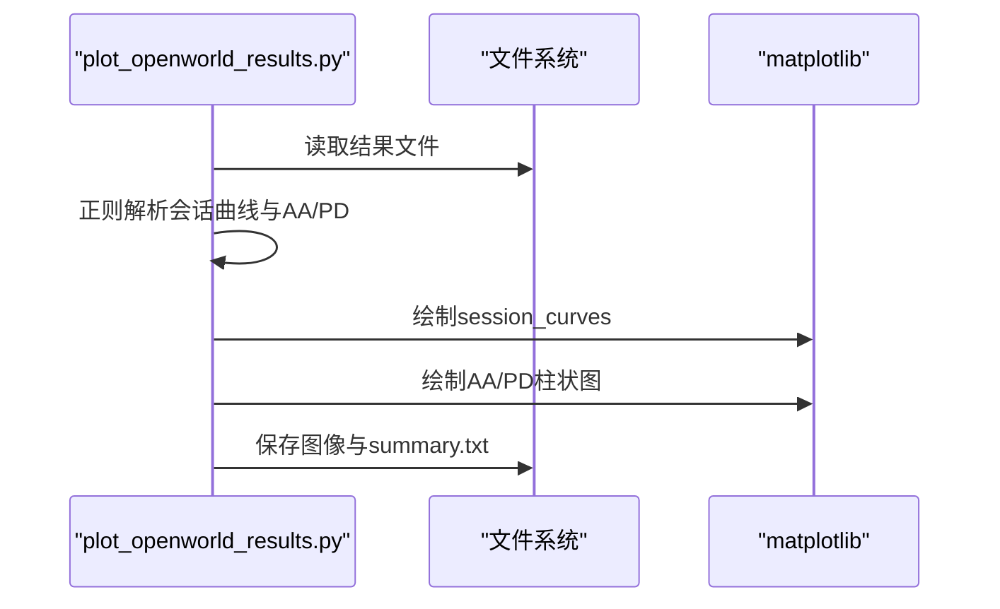

图表来源
- [scripts/plot_openworld_results.py:62-128](file://scripts/plot_openworld_results.py#L62-L128)

章节来源
- [scripts/plot_openworld_results.py:1-128](file://scripts/plot_openworld_results.py#L1-L128)

### 特征空间与原型可视化（viz_feature_space.py）
- 功能要点
  - 对每个会话进行 t-SNE 投影，若可用则 UMAP 投影；叠加原型点；绘制原型漂移曲线。
- 使用方法
  - 示例命令：python -m scripts.viz_feature_space --ckpt ... --config configs/default.yml --session 0 1 2 3 4 --out_dir save/figures/feat_space
- 类图（概念）

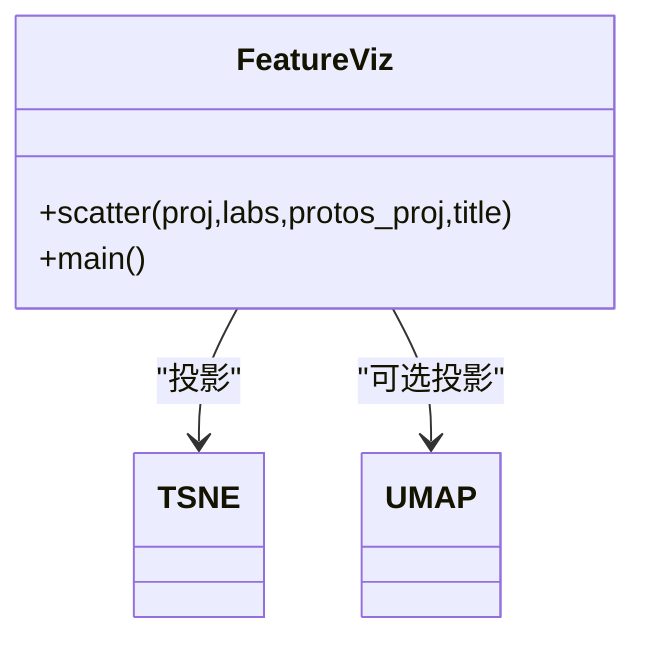

图表来源
- [scripts/viz_feature_space.py:44-133](file://scripts/viz_feature_space.py#L44-L133)

章节来源
- [scripts/viz_feature_space.py:1-133](file://scripts/viz_feature_space.py#L1-L133)

### OSR 评分可视化（viz_osr.py）
- 功能要点
  - 对多种 OSR 方法计算分数，绘制直方图与 ROC 曲线；对已知类绘制混淆矩阵。
- 使用方法
  - 示例命令：python -m scripts.viz_osr --ckpt ... --config configs/default.yml --osr mls tane nci --session 1 --out_dir save/figures/osr
- 序列图

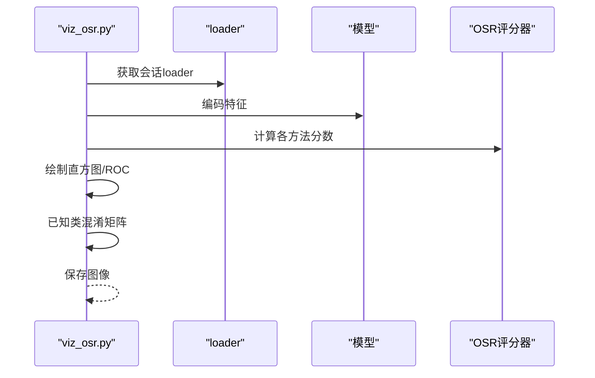

图表来源
- [scripts/viz_osr.py:24-100](file://scripts/viz_osr.py#L24-L100)

章节来源
- [scripts/viz_osr.py:1-100](file://scripts/viz_osr.py#L1-L100)

### 注意力/原型热力图（viz_attn_proto.py）
- 功能要点
  - 展示 AttnClassifier 正负原型热力图；尝试绘制自注意力权重热力图。
- 使用方法
  - 示例命令：python -m scripts.viz_attn_proto --ckpt ... --config configs/default.yml --session 1 --out_dir save/figures/attn_proto
- 序列图

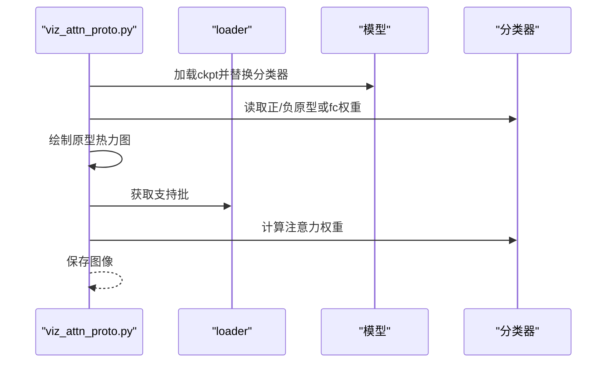

图表来源
- [scripts/viz_attn_proto.py:34-120](file://scripts/viz_attn_proto.py#L34-L120)

章节来源
- [scripts/viz_attn_proto.py:1-120](file://scripts/viz_attn_proto.py#L1-L120)

### 课程曲线可视化（viz_curriculum.py）
- 功能要点
  - 从训练日志解析 center_loss、cls_loss、hard_weight、mc_var、curriculum_ratio、train_acc 等，绘制随 epoch 的曲线。
- 使用方法
  - 示例命令：python scripts/viz_curriculum.py --log extract_log.txt --out_dir save/figures/curves
- 流程图

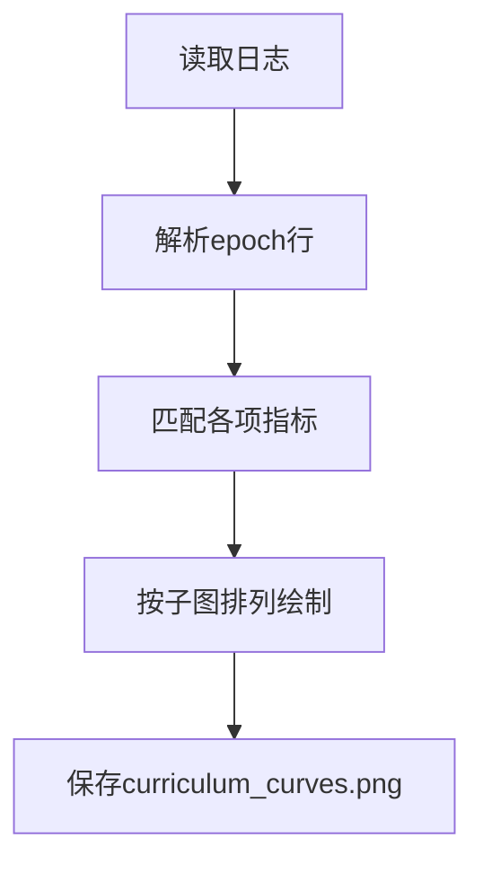

图表来源
- [scripts/viz_curriculum.py:27-88](file://scripts/viz_curriculum.py#L27-L88)

章节来源
- [scripts/viz_curriculum.py:1-88](file://scripts/viz_curriculum.py#L1-L88)

### 主表折线/柱状图（viz_main_table.py）
- 功能要点
  - 读取 comparison_table.csv，绘制每会话 all-class acc 折线与 AA_all/AA_inc/PD_all 柱状图；可叠加“我们方法”行。
- 使用方法
  - 示例命令：python scripts/viz_main_table.py --csv save_result/baselines/comparison_table.csv [--ours_csv ...] --out_dir save/figures/main_table
- 序列图

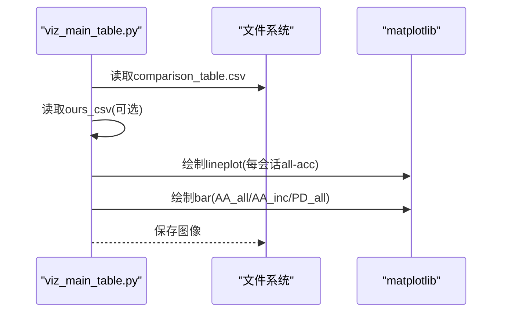

图表来源
- [scripts/viz_main_table.py:30-83](file://scripts/viz_main_table.py#L30-L83)

章节来源
- [scripts/viz_main_table.py:1-83](file://scripts/viz_main_table.py#L1-L83)

## 依赖分析
- 脚本间依赖
  - run_all_baselines.py 依赖 configs/default.yml、train_unopenset 的数据集设置、dataloader 与评估函数。
  - 可视化脚本普遍依赖 MYNET、dataloader、OSR/CIL 构造器与 replace_base_fc。
  - 日志解析脚本独立于主程序，仅依赖正则与 CSV。
- 外部依赖
  - numpy、torch、sklearn、matplotlib、pandas（部分脚本）、umap（可选）。
- 配置依赖
  - 所有脚本通过 configs/default.yml 获取 num_base、num_session、way、shots 等关键参数。

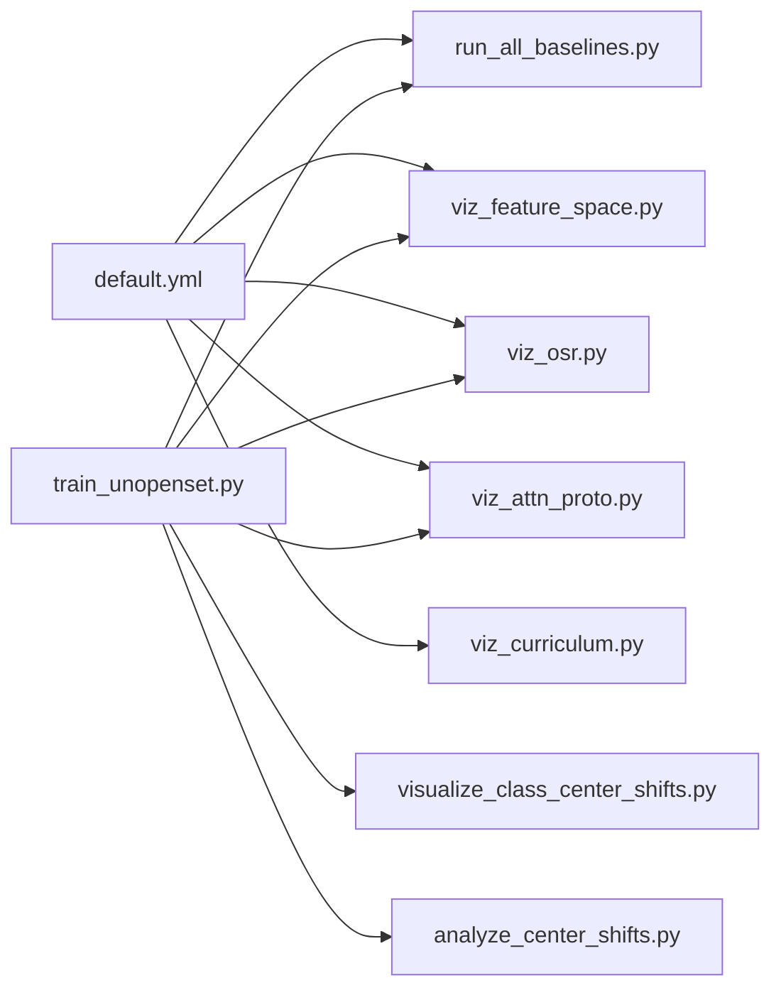

图表来源
- [configs/default.yml:1-88](file://configs/default.yml#L1-L88)
- [scripts/run_all_baselines.py:228-282](file://scripts/run_all_baselines.py#L228-L282)
- [scripts/viz_feature_space.py:59-133](file://scripts/viz_feature_space.py#L59-L133)
- [scripts/viz_osr.py:24-100](file://scripts/viz_osr.py#L24-L100)
- [scripts/viz_attn_proto.py:34-120](file://scripts/viz_attn_proto.py#L34-L120)
- [scripts/viz_curriculum.py:50-88](file://scripts/viz_curriculum.py#L50-L88)
- [scripts/visualize_class_center_shifts.py:203-291](file://scripts/visualize_class_center_shifts.py#L203-L291)
- [scripts/analyze_center_shifts.py:136-261](file://scripts/analyze_center_shifts.py#L136-L261)
- [train_unopenset.py:162-200](file://train_unopenset.py#L162-L200)

章节来源
- [configs/default.yml:1-88](file://configs/default.yml#L1-L88)
- [scripts/run_all_baselines.py:228-282](file://scripts/run_all_baselines.py#L228-L282)
- [scripts/viz_feature_space.py:59-133](file://scripts/viz_feature_space.py#L59-L133)
- [scripts/viz_osr.py:24-100](file://scripts/viz_osr.py#L24-L100)
- [scripts/viz_attn_proto.py:34-120](file://scripts/viz_attn_proto.py#L34-L120)
- [scripts/viz_curriculum.py:50-88](file://scripts/viz_curriculum.py#L50-L88)
- [scripts/visualize_class_center_shifts.py:203-291](file://scripts/visualize_class_center_shifts.py#L203-L291)
- [scripts/analyze_center_shifts.py:136-261](file://scripts/analyze_center_shifts.py#L136-L261)
- [train_unopenset.py:162-200](file://train_unopenset.py#L162-L200)

## 性能考虑
- GPU 使用
  - 多数脚本通过 CUDA_VISIBLE_DEVICES 控制设备；建议在资源充足时启用 GPU 以加速特征提取与降维。
- 降维效率
  - t-SNE 默认 perplexity=30，UMAP 默认 n_neighbors=15/min_dist=0.1；可根据数据规模调整以平衡质量与速度。
- I/O 优化
  - 大量脚本读取/写入磁盘，建议确保输出目录权限与磁盘空间充足；必要时拆分会话或减少抽样以降低内存峰值。
- 并行化
  - run_all_baselines.py 采用串行遍历 (CIL, OSR) 组合；可在外部批处理框架中并行运行多个组合以缩短总耗时。

## 故障排查指南
- 无法导入 train_unopenset
  - 现象：脚本提示找不到模块。
  - 处理：确认脚本头部已将项目根目录加入 sys.path；检查相对导入路径。
- 检查点加载失败
  - 现象：找不到文件或状态字典不匹配。
  - 处理：确认 --ckpt 路径正确；若存在键不匹配，脚本会尝试过滤兼容键后加载。
- UMAP 不可用
  - 现象：UMAP 报错或回退至 t-SNE。
  - 处理：安装 umap-learn；若仍失败，脚本会自动使用 t-SNE。
- 会话指标为空
  - 现象：plot_openworld_results.py 报告未找到会话行。
  - 处理：确认结果文件格式与内容；确保包含 session 行与 AA/PD 摘要。
- 日志未包含预期指标
  - 现象：collect_metrics_from_logs.py 输出空行。
  - 处理：确认日志中包含 s0_acc、aa_*、pd_* 等字段；调整前缀或目录。

章节来源
- [scripts/visualize_class_center_shifts.py:220-251](file://scripts/visualize_class_center_shifts.py#L220-L251)
- [scripts/analyze_center_shifts.py:124-134](file://scripts/analyze_center_shifts.py#L124-L134)
- [scripts/plot_openworld_results.py:72-74](file://scripts/plot_openworld_results.py#L72-L74)
- [scripts/collect_metrics_from_logs.py:36-67](file://scripts/collect_metrics_from_logs.py#L36-L67)

## 结论
本指南提供了 VAZE 项目脚本工具的系统使用说明与实现原理解读。通过统一的配置与数据加载机制，脚本实现了从基线评估、指标提取到多维度可视化的完整闭环。建议在实际实验中结合批量执行与结果汇总脚本，形成可复现、可扩展的评测流水线。

## 附录
- 与主程序的集成方式
  - 所有脚本均通过 train_unopenset 的 set_up_datasets(args) 与 dataloader 构建一致的数据管线，保证与主实验的评测协议一致。
  - 若需扩展新指标或可视化，建议遵循现有脚本的参数解析、模型加载与评估模式，确保与 configs/default.yml 的参数约定保持一致。

章节来源
- [train_unopenset.py:162-200](file://train_unopenset.py#L162-L200)
- [configs/default.yml:1-88](file://configs/default.yml#L1-L88)