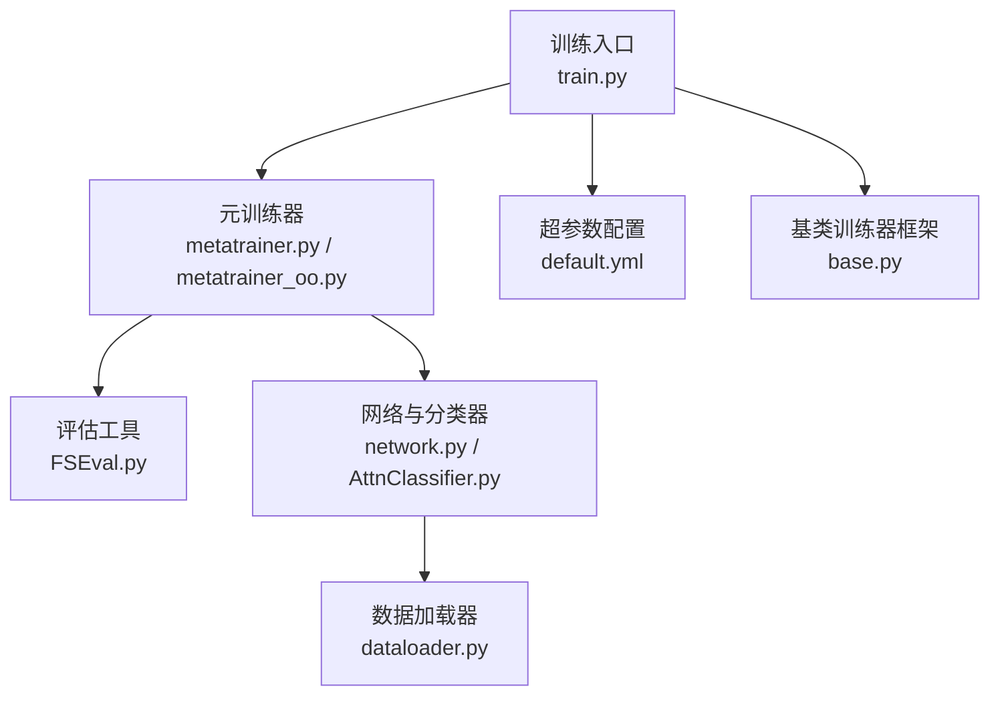
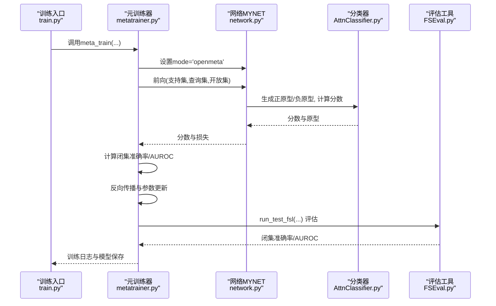
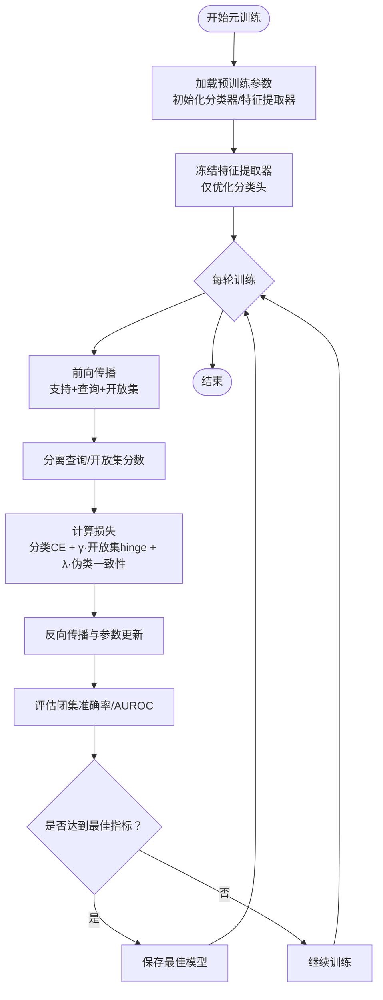
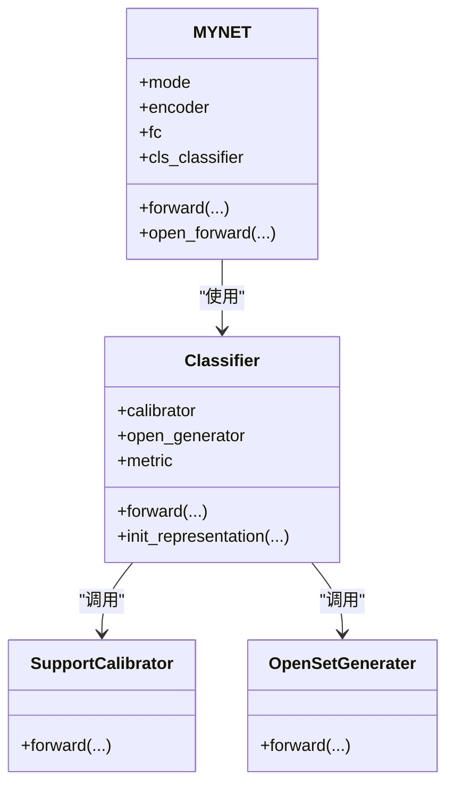
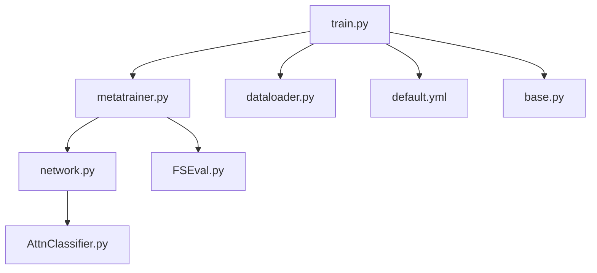

# 元训练器

<cite>
**本文引用的文件列表**
- [metatrainer.py](file://models/metatrainer.py)
- [metatrainer_oo.py](file://models/metatrainer_oo.py)
- [FSEval.py](file://models/FSEval.py)
- [network.py](file://network.py)
- [AttnClassifier.py](file://models/AttnClassifier.py)
- [dataloader.py](file://data/dataloader.py)
- [default.yml](file://configs/default.yml)
- [train.py](file://train.py)
- [base.py](file://models/base.py)
</cite>

## 目录
1. [简介](#简介)
2. [项目结构](#项目结构)
3. [核心组件](#核心组件)
4. [架构总览](#架构总览)
5. [详细组件分析](#详细组件分析)
6. [依赖关系分析](#依赖关系分析)
7. [性能考量](#性能考量)
8. [故障排查指南](#故障排查指南)
9. [结论](#结论)
10. [附录](#附录)

## 简介
本文件系统性阐述元训练器在增量学习中的作用与实现机制，覆盖以下主题：
- 元训练器在开放世界与闭世界场景下的训练流程与区别
- 会话化学习策略与类别扩展过程
- 超参数配置与训练循环实现
- 模型状态管理与会话间参数传递机制
- 使用示例与最佳实践

元训练器通过“元训练”阶段在开放世界数据上联合优化分类器与伪类原型，使模型在后续增量会话中具备更强的开放集泛化能力，同时保留对已学类别的闭集识别能力。

## 项目结构
本仓库围绕“基础训练—元训练—增量会话”的流水线组织，其中与元训练器直接相关的模块包括：
- 训练入口与会话控制：train.py
- 元训练实现：models/metatrainer.py 与 models/metatrainer_oo.py
- 评估工具：models/FSEval.py
- 网络与分类器：network.py、models/AttnClassifier.py
- 数据加载与会话划分：data/dataloader.py
- 超参数配置：configs/default.yml
- 基类训练器框架：models/base.py

图表来源
- [train.py:799-826](file://train.py#L799-L826)
- [metatrainer.py:17-85](file://models/metatrainer.py#L17-L85)
- [FSEval.py:17-42](file://models/FSEval.py#L17-L42)
- [network.py:18-50](file://network.py#L18-L50)
- [AttnClassifier.py:38-93](file://models/AttnClassifier.py#L38-L93)
- [dataloader.py:19-46](file://data/dataloader.py#L19-L46)
- [default.yml:1-88](file://configs/default.yml#L1-L88)
- [base.py:27-50](file://models/base.py#L27-L50)

章节来源
- [train.py:799-826](file://train.py#L799-L826)
- [metatrainer.py:17-85](file://models/metatrainer.py#L17-L85)
- [FSEval.py:17-42](file://models/FSEval.py#L17-L42)
- [network.py:18-50](file://network.py#L18-L50)
- [AttnClassifier.py:38-93](file://models/AttnClassifier.py#L38-L93)
- [dataloader.py:19-46](file://data/dataloader.py#L19-L46)
- [default.yml:1-88](file://configs/default.yml#L1-L88)
- [base.py:27-50](file://models/base.py#L27-L50)

## 核心组件
- 元训练器（metatrainer.py / metatrainer_oo.py）
  - 负责加载预训练特征提取器权重与分类头权重，冻结特征提取器，仅优化分类头参数
  - 在开放世界数据上进行一次训练循环，计算分类损失、开放集hinge损失与伪类一致性损失
  - 使用FSL评估工具进行闭集准确率与开放集AUROC评估
- 评估工具（FSEval.py）
  - 将支持集、查询集、开放集特征与概率打包，计算闭集准确率与AUROC
- 网络与分类器（network.py / AttnClassifier.py）
  - 网络MYNET在openmeta模式下，将支持集、查询集、开放集拼接后统一编码，再由分类器生成正原型与负原型（伪类），并计算余弦分数
  - AttnClassifier负责支持集校准、负原型生成与度量计算
- 数据加载（dataloader.py）
  - 提供openmeta模式的数据加载器，按会话组织已知类与未知类样本
- 超参数（default.yml）
  - 包含n_ways、n_shots、n_queries、epochs_meta等关键元训练超参
- 基类训练器框架（base.py）
  - 提供保存/加载模型、替换分类头、记录统计等通用能力

章节来源
- [metatrainer.py:17-85](file://models/metatrainer.py#L17-L85)
- [FSEval.py:17-42](file://models/FSEval.py#L17-L42)
- [network.py:102-151](file://network.py#L102-L151)
- [AttnClassifier.py:38-93](file://models/AttnClassifier.py#L38-L93)
- [dataloader.py:19-46](file://data/dataloader.py#L19-L46)
- [default.yml:15-26](file://configs/default.yml#L15-L26)
- [base.py:102-167](file://models/base.py#L102-L167)

## 架构总览
元训练器在训练循环中与网络、评估工具协同工作，形成如下闭环：
- 训练入口加载预训练模型参数，进入openmeta模式
- 元训练器读取批次数据（支持集、查询集、开放集），前向得到分数与损失
- 优化器反向传播并更新分类头参数
- 定期使用FSEval工具评估闭集准确率与开放集AUROC

图表来源
- [train.py:806-821](file://train.py#L806-L821)
- [metatrainer.py:17-85](file://models/metatrainer.py#L17-L85)
- [network.py:102-151](file://network.py#L102-L151)
- [AttnClassifier.py:38-93](file://models/AttnClassifier.py#L38-L93)
- [FSEval.py:17-42](file://models/FSEval.py#L17-L42)

## 详细组件分析

### 元训练器（metatrainer.py / metatrainer_oo.py）
- 参数初始化与加载
  - 从预训练检查点加载分类头与特征提取器权重，分别初始化分类器与网络参数
  - 仅优化分类头参数，冻结特征提取器
- 训练循环
  - 每轮迭代读取批次数据，将支持集、查询集、开放集拼接后送入网络
  - 前向得到查询与开放集的概率，分解为正类与负类分数
  - 计算分类CE损失、开放集hinge损失与伪类一致性损失，按超参加权求和
  - 更新学习率调度器，计算闭集准确率与开放集AUROC
- 评估与保存
  - 使用FSEval工具在开放世界数据上评估闭集准确率与AUROC
  - 保存最佳模型（按闭集准确率或AUROC）

图表来源
- [metatrainer.py:17-85](file://models/metatrainer.py#L17-L85)
- [metatrainer.py:87-178](file://models/metatrainer.py#L87-L178)
- [FSEval.py:17-42](file://models/FSEval.py#L17-L42)

章节来源
- [metatrainer.py:17-85](file://models/metatrainer.py#L17-L85)
- [metatrainer.py:87-178](file://models/metatrainer.py#L87-L178)
- [metatrainer_oo.py:17-85](file://models/metatrainer_oo.py#L17-L85)
- [metatrainer_oo.py:87-214](file://models/metatrainer_oo.py#L87-L214)

### 网络与分类器（network.py / AttnClassifier.py）
- 网络MYNET在openmeta模式下：
  - 将支持集、查询集、开放集拼接后统一编码，得到支持、查询、开放集特征
  - 交由分类器生成正原型与负原型（伪类），并计算余弦分数
  - 计算开放集hinge损失与伪类一致性损失
- AttnClassifier：
  - SupportCalibrator：对支持集特征进行校准，生成正原型
  - OpenSetGenerater：基于正原型生成负原型（伪类），并计算伪类一致性度量
  - init_representation：从预训练权重初始化分类头参数

图表来源
- [network.py:18-50](file://network.py#L18-L50)
- [network.py:102-151](file://network.py#L102-L151)
- [AttnClassifier.py:38-93](file://models/AttnClassifier.py#L38-L93)
- [AttnClassifier.py:121-185](file://models/AttnClassifier.py#L121-L185)
- [AttnClassifier.py:188-200](file://models/AttnClassifier.py#L188-L200)

章节来源
- [network.py:18-50](file://network.py#L18-L50)
- [network.py:102-151](file://network.py#L102-L151)
- [AttnClassifier.py:38-93](file://models/AttnClassifier.py#L38-L93)
- [AttnClassifier.py:121-185](file://models/AttnClassifier.py#L121-L185)
- [AttnClassifier.py:188-200](file://models/AttnClassifier.py#L188-L200)

### 评估工具（FSEval.py）
- 将支持集、查询集、开放集特征与概率打包，计算闭集准确率与AUROC
- 提供置信区间统计，便于稳定评估

章节来源
- [FSEval.py:17-42](file://models/FSEval.py#L17-L42)
- [FSEval.py:46-73](file://models/FSEval.py#L46-L73)
- [FSEval.py:77-112](file://models/FSEval.py#L77-L112)

### 数据加载（dataloader.py）
- 提供openmeta模式的数据加载器，按会话组织已知类与未知类样本
- 支持不同数据集的适配与采样策略

章节来源
- [dataloader.py:19-46](file://data/dataloader.py#L19-L46)
- [dataloader.py:48-106](file://data/dataloader.py#L48-L106)

### 超参数配置（default.yml）
- 关键元训练超参：n_ways、n_shots、n_queries、epochs_meta、lr_decay_epochs、lr_decay_rate、optimizer.momentum、optimizer.decay等
- 用于控制元训练的类别规模、样本规模、学习率衰减与优化器参数

章节来源
- [default.yml:15-26](file://configs/default.yml#L15-L26)
- [default.yml:27-41](file://configs/default.yml#L27-L41)
- [default.yml:42-46](file://configs/default.yml#L42-L46)

### 基类训练器框架（base.py）
- 提供保存/加载模型、替换分类头、记录统计等通用能力，支撑增量会话的模型状态管理

章节来源
- [base.py:102-167](file://models/base.py#L102-L167)

## 依赖关系分析
- 元训练器依赖网络MYNET与分类器，后者依赖支持集校准与负原型生成模块
- 评估工具依赖网络输出的特征与概率
- 训练入口负责参数初始化与会话控制，连接元训练器与数据加载器

图表来源
- [metatrainer.py:17-85](file://models/metatrainer.py#L17-L85)
- [network.py:18-50](file://network.py#L18-L50)
- [AttnClassifier.py:38-93](file://models/AttnClassifier.py#L38-L93)
- [FSEval.py:17-42](file://models/FSEval.py#L17-L42)
- [train.py:799-826](file://train.py#L799-L826)
- [dataloader.py:19-46](file://data/dataloader.py#L19-L46)
- [default.yml:1-88](file://configs/default.yml#L1-88)
- [base.py:102-167](file://models/base.py#L102-L167)

章节来源
- [metatrainer.py:17-85](file://models/metatrainer.py#L17-L85)
- [network.py:18-50](file://network.py#L18-L50)
- [AttnClassifier.py:38-93](file://models/AttnClassifier.py#L38-L93)
- [FSEval.py:17-42](file://models/FSEval.py#L17-L42)
- [train.py:799-826](file://train.py#L799-L826)
- [dataloader.py:19-46](file://data/dataloader.py#L19-L46)
- [default.yml:1-88](file://configs/default.yml#L1-88)
- [base.py:102-167](file://models/base.py#L102-L167)

## 性能考量
- 训练稳定性
  - 仅优化分类头参数，冻结特征提取器，降低参数更新幅度，提升收敛稳定性
  - 使用余弦相似度度量与温度参数，有助于稳定特征分布
- 计算效率
  - 将支持集、查询集、开放集拼接后统一编码，减少重复前向开销
  - AUROC评估采用批量聚合，避免逐样本计算带来的额外开销
- 超参敏感性
  - 学习率衰减策略与调度器选择影响收敛速度与最终性能
  - 开放集hinge损失与伪类一致性损失的权重需结合任务进行调优

[本节为通用指导，无需特定文件来源]

## 故障排查指南
- 模型未加载预训练参数
  - 检查预训练路径与文件格式，确认分类头与特征提取器权重键名一致
- 评估指标异常
  - 确认评估工具输入的标签与概率维度匹配，AUROC类型配置正确
- 训练不收敛
  - 检查学习率与调度器配置，适当调整学习率衰减步长与衰减率
- 内存不足
  - 减少批次大小或查询样本数量，或降低特征维度

章节来源
- [metatrainer.py:17-28](file://models/metatrainer.py#L17-L28)
- [FSEval.py:46-73](file://models/FSEval.py#L46-L73)
- [default.yml:27-41](file://configs/default.yml#L27-L41)

## 结论
元训练器通过在开放世界数据上联合优化分类头与伪类原型，显著提升了模型在增量会话中的开放集泛化能力。配合严格的模型状态管理与评估流程，可在不同数据集与任务场景下取得稳健的性能表现。建议在实际部署中结合具体任务对超参数进行系统性调优，并持续监控AUROC与闭集准确率的平衡。

[本节为总结，无需特定文件来源]

## 附录

### 会话化学习与类别扩展
- 会话0（基础训练）：使用预训练特征提取器与平均嵌入替换分类头
- 元训练（openmeta）：在开放世界数据上联合优化分类头与伪类原型
- 增量会话（后续）：逐步扩展类别集合，使用基类训练器框架进行增量训练

章节来源
- [train.py:806-821](file://train.py#L806-L821)
- [base.py:102-167](file://models/base.py#L102-L167)

### 开放世界 vs 闭世界训练
- 开放世界训练
  - 使用开放集样本与查询样本共同训练，评估AUROC与闭集准确率
  - 通过hinge损失与伪类一致性损失引导模型区分已知与未知类别
- 闭世界训练
  - 仅使用已知类样本进行训练与评估，不引入开放集样本
  - 评估指标主要关注闭集准确率

章节来源
- [metatrainer.py:17-85](file://models/metatrainer.py#L17-L85)
- [FSEval.py:17-42](file://models/FSEval.py#L17-L42)

### 超参数配置清单
- 元训练超参
  - n_ways、n_shots、n_queries：控制元训练的类别与样本规模
  - epochs_meta：元训练轮数
  - lr_decay_epochs、lr_decay_rate：学习率衰减策略
  - optimizer.momentum、optimizer.decay：优化器动量与权重衰减
- 元训练损失权重
  - gamma：开放集hinge损失权重
  - funit：伪类一致性损失权重

章节来源
- [default.yml:15-26](file://configs/default.yml#L15-L26)
- [default.yml:27-41](file://configs/default.yml#L27-L41)
- [train.py:189-196](file://train.py#L189-L196)

### 使用示例与最佳实践
- 使用示例
  - 在训练入口中加载预训练模型，调用元训练器进行openmeta模式训练
  - 训练完成后使用评估工具进行闭集准确率与AUROC评估
- 最佳实践
  - 仅优化分类头参数，冻结特征提取器，提升稳定性
  - 合理设置学习率与调度器，避免过拟合
  - 结合AUROC与闭集准确率综合评估模型性能

章节来源
- [train.py:806-821](file://train.py#L806-L821)
- [metatrainer.py:17-85](file://models/metatrainer.py#L17-L85)
- [FSEval.py:17-42](file://models/FSEval.py#L17-L42)