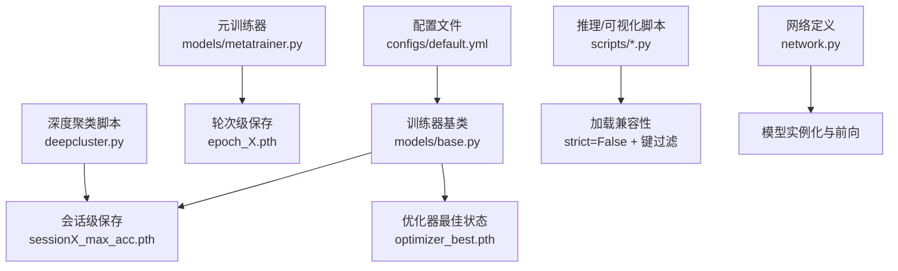
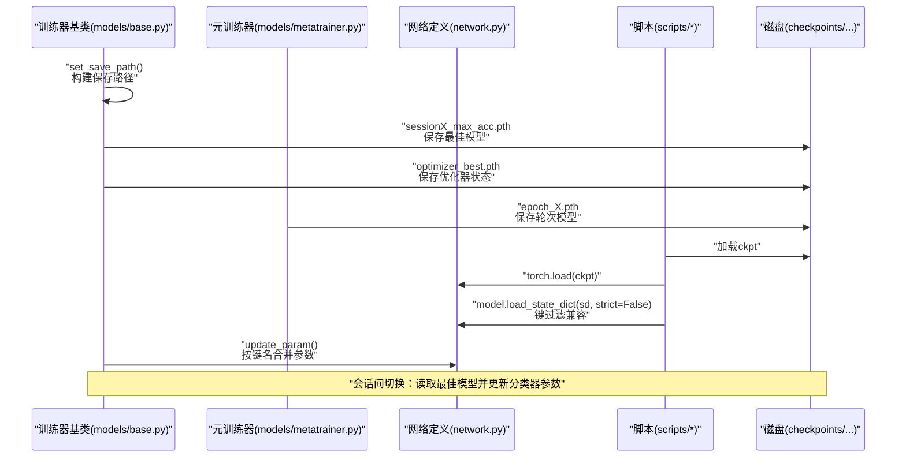
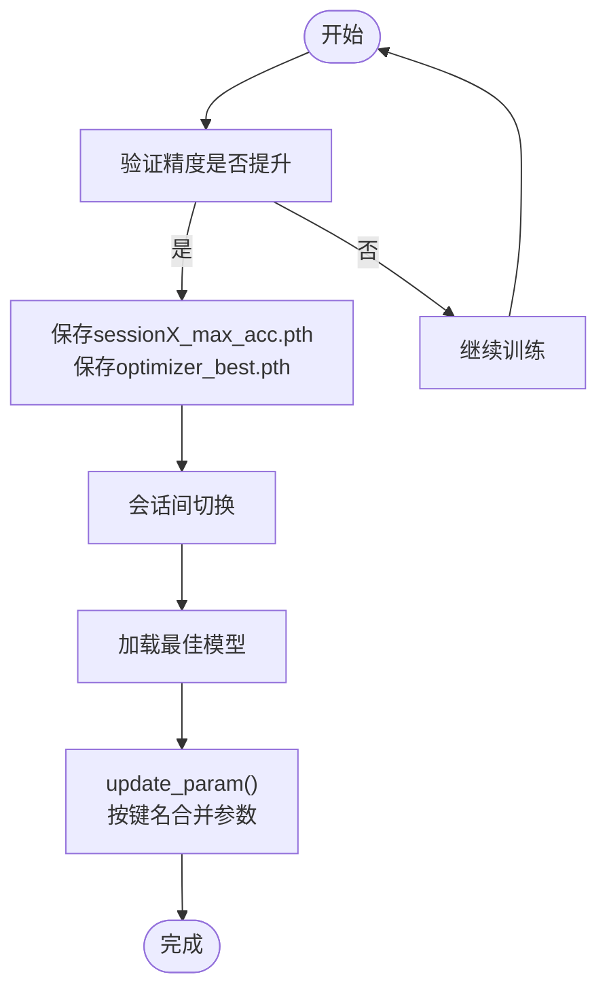
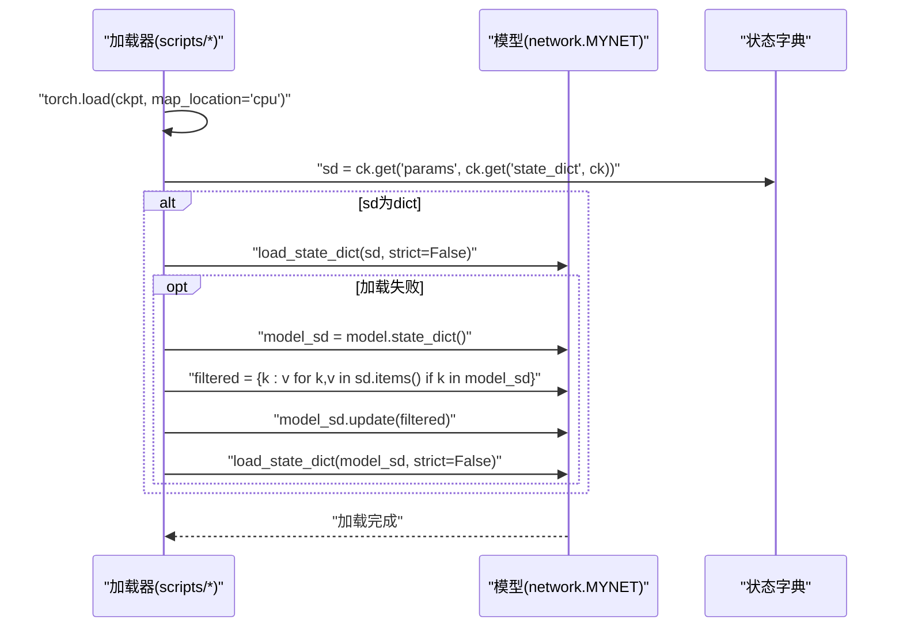
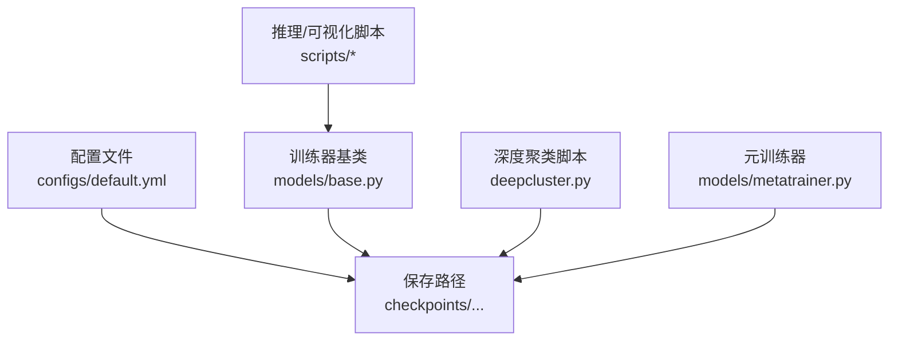

# 模型保存与加载

<cite>
**本文档引用的文件**
- [models/base.py](file://models/base.py)
- [models/metatrainer.py](file://models/metatrainer.py)
- [deepcluster.py](file://deepcluster.py)
- [network.py](file://network.py)
- [test.py](file://test.py)
- [visualize_class_center_shifts.py](file://scripts/visualize_class_center_shifts.py)
- [plot_separate_embeddings.py](file://scripts/plot_separate_embeddings.py)
- [default.yml](file://configs/default.yml)
- [SUMMARY.md](file://save_result/opt_v5/SUMMARY.md)
</cite>

## 目录
1. [简介](#简介)
2. [项目结构](#项目结构)
3. [核心组件](#核心组件)
4. [架构总览](#架构总览)
5. [详细组件分析](#详细组件分析)
6. [依赖分析](#依赖分析)
7. [性能考虑](#性能考虑)
8. [故障排除指南](#故障排除指南)
9. [结论](#结论)
10. [附录](#附录)

## 简介
本文件系统化梳理本仓库的“模型保存与加载”机制，覆盖以下主题：
- 模型状态字典的保存格式与命名规则
- 最佳模型保存策略与会话间模型切换
- 模型加载的兼容性检查与参数更新机制
- 模型备份与恢复流程
- 调试模式下的模型保存行为
- 模型版本管理与迁移指南

## 项目结构
围绕模型保存与加载的关键目录与文件：
- 保存路径与命名：统一由训练器与元训练器控制，采用“会话级”与“轮次级”命名规范
- 加载兼容性：支持从不同来源（基础训练、元训练、增量会话）加载，并具备键过滤与严格/宽松加载策略
- 配置驱动：保存目录、会话数、测试次数等由配置文件决定

图表来源
- [default.yml:13](file://configs/default.yml#L13)
- [models/base.py:153-176](file://models/base.py#L153-L176)
- [models/metatrainer.py:180-190](file://models/metatrainer.py#L180-L190)
- [deepcluster.py:629-630](file://deepcluster.py#L629-L630)
- [scripts/visualize_class_center_shifts.py:86-98](file://scripts/visualize_class_center_shifts.py#L86-L98)

章节来源
- [default.yml:13](file://configs/default.yml#L13)
- [models/base.py:68-83](file://models/base.py#L68-L83)
- [models/base.py:153-176](file://models/base.py#L153-L176)
- [models/metatrainer.py:180-190](file://models/metatrainer.py#L180-L190)
- [deepcluster.py:629-630](file://deepcluster.py#L629-L630)
- [scripts/visualize_class_center_shifts.py:86-98](file://scripts/visualize_class_center_shifts.py#L86-L98)

## 核心组件
- 训练器基类（Trainer）：负责保存路径构建、会话级最佳模型保存、优化器状态保存、加载与参数更新
- 元训练器（meta_train）：负责元训练阶段的轮次级保存，包含分类器参数与指标记录
- 网络定义（MYNET）：模型实例化与前向传播，配合加载/保存流程
- 深度聚类脚本：会话级模型保存与恢复示例
- 推理/可视化脚本：加载兼容性与键过滤策略示例
- 配置文件：保存目录、会话数、测试次数等关键参数

章节来源
- [models/base.py:27-109](file://models/base.py#L27-L109)
- [models/metatrainer.py:17-26](file://models/metatrainer.py#L17-L26)
- [network.py:18-504](file://network.py#L18-L504)
- [deepcluster.py:629-630](file://deepcluster.py#L629-L630)
- [scripts/visualize_class_center_shifts.py:86-98](file://scripts/visualize_class_center_shifts.py#L86-L98)
- [configs/default.yml:13](file://configs/default.yml#L13)

## 架构总览
模型保存与加载的整体流程如下：

图表来源
- [models/base.py:68-83](file://models/base.py#L68-L83)
- [models/base.py:153-176](file://models/base.py#L153-L176)
- [models/base.py:102-109](file://models/base.py#L102-L109)
- [models/metatrainer.py:180-190](file://models/metatrainer.py#L180-L190)
- [scripts/visualize_class_center_shifts.py:86-98](file://scripts/visualize_class_center_shifts.py#L86-L98)

## 详细组件分析

### 1) 模型状态字典的保存格式与命名规则
- 通用保存格式
  - 训练器基类与深度聚类脚本统一使用“params”键保存模型状态字典
  - 示例：torch.save(dict(params=model.state_dict()), path)
- 命名规则
  - 会话级最佳模型：sessionX_max_acc.pth（X为会话编号）
  - 优化器最佳状态：optimizer_best.pth
  - 轮次级模型（元训练）：epoch_X.pth
- 保存路径
  - 由set_save_path()根据配置动态生成，最终位于checkpoints/...目录下

章节来源
- [models/base.py:153-176](file://models/base.py#L153-L176)
- [models/base.py:102-109](file://models/base.py#L102-L109)
- [deepcluster.py:629-630](file://deepcluster.py#L629-L630)
- [models/metatrainer.py:180-190](file://models/metatrainer.py#L180-L190)
- [models/base.py:68-83](file://models/base.py#L68-L83)

### 2) 最佳模型保存策略与会话间模型切换
- 最佳模型保存策略
  - 训练器基类在验证精度提升时保存当前模型与优化器状态
  - 深度聚类脚本在每个会话结束时保存该会话的最佳模型
- 会话间切换
  - 通过加载最佳模型并调用update_param()按键名合并参数，实现跨会话参数迁移
  - 元训练器支持从预训练权重加载分类器参数与特征提取器参数

图表来源
- [models/base.py:153-176](file://models/base.py#L153-L176)
- [models/base.py:102-109](file://models/base.py#L102-L109)
- [deepcluster.py:629-630](file://deepcluster.py#L629-L630)

章节来源
- [models/base.py:153-176](file://models/base.py#L153-L176)
- [models/base.py:102-109](file://models/base.py#L102-L109)
- [deepcluster.py:629-630](file://deepcluster.py#L629-L630)

### 3) 模型加载的兼容性检查与参数更新机制
- 加载兼容性
  - 优先从ckpt中提取'params'键，若不存在则回退到'params'或'state_dict'
  - 若传入的状态字典为dict类型，先尝试严格加载；失败则进行键过滤，仅加载存在于当前模型的键
- 参数更新机制
  - update_param()：过滤预训练字典中与当前模型state_dict键名一致的部分并合并
  - 元训练器：分别提取分类器与特征提取器参数，分别初始化与加载

图表来源
- [scripts/visualize_class_center_shifts.py:86-98](file://scripts/visualize_class_center_shifts.py#L86-L98)
- [scripts/plot_separate_embeddings.py:69-79](file://scripts/plot_separate_embeddings.py#L69-L79)
- [models/base.py:102-109](file://models/base.py#L102-L109)
- [models/metatrainer.py:17-26](file://models/metatrainer.py#L17-L26)

章节来源
- [scripts/visualize_class_center_shifts.py:86-98](file://scripts/visualize_class_center_shifts.py#L86-L98)
- [scripts/plot_separate_embeddings.py:69-79](file://scripts/plot_separate_embeddings.py#L69-L79)
- [models/base.py:102-109](file://models/base.py#L102-L109)
- [models/metatrainer.py:17-26](file://models/metatrainer.py#L17-L26)

### 4) 模型备份与恢复流程
- 备份
  - 会话级最佳模型：sessionX_max_acc.pth
  - 优化器状态：optimizer_best.pth
  - 轮次级模型：epoch_X.pth（元训练）
- 恢复
  - 训练器基类：load_model()加载最佳模型并update_param()
  - 深度聚类脚本：在会话间加载最佳模型并进行数据初始化
  - 元训练器：从预训练路径加载params并初始化分类器表示

章节来源
- [models/base.py:236-244](file://models/base.py#L236-L244)
- [deepcluster.py:629-630](file://deepcluster.py#L629-L630)
- [models/metatrainer.py:17-26](file://models/metatrainer.py#L17-L26)

### 5) 调试模式下的模型保存行为
- 调试模式路径
  - set_save_path()根据args.debug决定保存路径前缀为debug/...
- 实践建议
  - 在调试模式下使用更短的训练轮次与更少的会话，便于快速迭代
  - 通过严格/宽松加载策略验证模型兼容性

章节来源
- [models/base.py:68-72](file://models/base.py#L68-L72)

### 6) 模型版本管理与迁移指南
- 版本标识
  - 保存路径包含配置序列化字符串，用于区分不同超参组合
- 迁移策略
  - 使用update_param()按键名合并参数，避免因模块结构调整导致的加载失败
  - 对于元训练场景，分别加载分类器与特征提取器参数，确保冻结/微调策略正确

章节来源
- [models/base.py:85-89](file://models/base.py#L85-L89)
- [models/base.py:102-109](file://models/base.py#L102-L109)
- [models/metatrainer.py:17-26](file://models/metatrainer.py#L17-L26)

## 依赖分析
- 配置驱动保存路径：configs/default.yml中的save_dir影响所有保存位置
- 训练器与脚本耦合：训练器基类与深度聚类脚本共享相同的保存/加载约定
- 元训练器独立性：轮次级保存独立于会话级保存，适合快速检索最佳轮次

图表来源
- [default.yml:13](file://configs/default.yml#L13)
- [models/base.py:68-83](file://models/base.py#L68-L83)
- [deepcluster.py:629-630](file://deepcluster.py#L629-L630)
- [models/metatrainer.py:180-190](file://models/metatrainer.py#L180-L190)

章节来源
- [default.yml:13](file://configs/default.yml#L13)
- [models/base.py:68-83](file://models/base.py#L68-L83)
- [deepcluster.py:629-630](file://deepcluster.py#L629-L630)
- [models/metatrainer.py:180-190](file://models/metatrainer.py#L180-L190)

## 性能考虑
- 加载性能
  - 使用map_location='cpu'加载ckpt，避免GPU内存占用
  - 严格/宽松加载策略的回退路径会增加一次键过滤操作，但显著提升兼容性
- 保存频率
  - 会话级保存与轮次级保存结合，兼顾存储开销与恢复灵活性
- 设备一致性
  - 加载后确保模型参数与子模块设备一致，避免运行时错误

## 故障排除指南
- 加载失败
  - 现象：load_state_dict(strict=True)抛出异常
  - 处理：启用strict=False并进行键过滤；参考scripts中的实现
- 键名不匹配
  - 现象：部分键在当前模型中不存在
  - 处理：使用update_param()按键名合并参数；或在加载后进行键过滤
- 会话间切换无效
  - 现象：切换后模型性能未提升
  - 处理：确认最佳模型已保存；检查update_param()是否正确执行；验证分类器参数初始化

章节来源
- [scripts/visualize_class_center_shifts.py:86-98](file://scripts/visualize_class_center_shifts.py#L86-L98)
- [models/base.py:102-109](file://models/base.py#L102-L109)

## 结论
本仓库的模型保存与加载机制以“params”键为核心，结合会话级与轮次级命名规范，形成清晰的版本管理与迁移路径。通过严格的兼容性检查与参数更新策略，能够在不同模块结构与训练阶段之间实现稳定切换。建议在调试模式下采用更短的训练周期，并利用键过滤与严格/宽松加载策略提升开发效率。

## 附录
- 关键实现路径
  - 会话级保存：[models/base.py:153-176](file://models/base.py#L153-L176)
  - 轮次级保存：[models/metatrainer.py:180-190](file://models/metatrainer.py#L180-L190)
  - 加载兼容性：[scripts/visualize_class_center_shifts.py:86-98](file://scripts/visualize_class_center_shifts.py#L86-L98)
  - 参数更新：[models/base.py:102-109](file://models/base.py#L102-L109)
  - 预训练加载：[models/metatrainer.py:17-26](file://models/metatrainer.py#L17-L26)
  - 保存路径：[models/base.py:68-83](file://models/base.py#L68-L83)
  - 配置驱动：[configs/default.yml:13](file://configs/default.yml#L13)
  - 实验上限说明：[SUMMARY.md:64-71](file://save_result/opt_v5/SUMMARY.md#L64-L71)