# 训练器基类

<cite>
**本文档引用的文件**
- [models/base.py](file://models/base.py)
- [network.py](file://network.py)
- [configs/default.yml](file://configs/default.yml)
- [models/metatrainer.py](file://models/metatrainer.py)
- [models/metatrainer_oo.py](file://models/metatrainer_oo.py)
- [train.py](file://train.py)
- [models/baselines/base.py](file://models/baselines/base.py)
</cite>

## 目录
1. [简介](#简介)
2. [项目结构](#项目结构)
3. [核心组件](#核心组件)
4. [架构概览](#架构概览)
5. [详细组件分析](#详细组件分析)
6. [依赖分析](#依赖分析)
7. [性能考虑](#性能考虑)
8. [故障排除指南](#故障排除指南)
9. [结论](#结论)

## 简介
本文件系统性阐述训练器基类的设计与实现，重点覆盖以下方面：
- 抽象基类设计模式与继承体系
- 训练器初始化流程、数据集配置与模型保存路径管理
- 训练统计记录机制、模型保存与加载策略
- 优化器与学习率调度器配置方法
- 数据初始化与全连接层替换机制
- 训练过程中的监控与调试能力

## 项目结构
该项目围绕“增量/开放集学习”场景构建，核心训练逻辑位于基类与具体实现之间，配合网络模型、元训练工具与配置文件共同完成端到端训练流程。

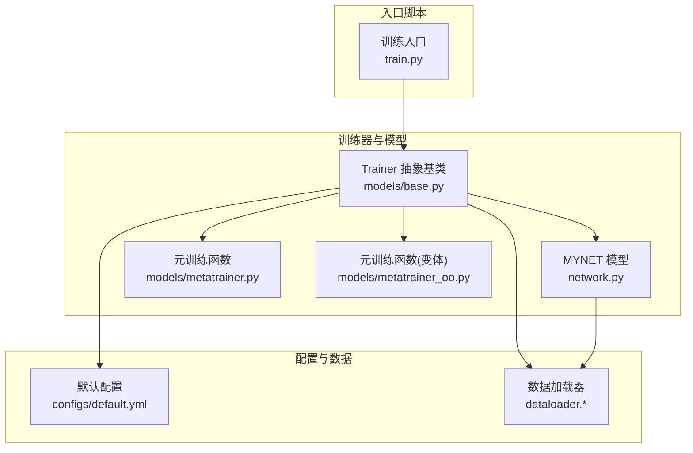

**图表来源**
- [models/base.py:27-254](file://models/base.py#L27-L254)
- [network.py:18-503](file://network.py#L18-L503)
- [models/metatrainer.py:17-85](file://models/metatrainer.py#L17-L85)
- [models/metatrainer_oo.py:17-85](file://models/metatrainer_oo.py#L17-L85)
- [configs/default.yml:1-88](file://configs/default.yml#L1-L88)
- [train.py:799-826](file://train.py#L799-L826)

**章节来源**
- [models/base.py:27-254](file://models/base.py#L27-L254)
- [network.py:18-503](file://network.py#L18-L503)
- [configs/default.yml:1-88](file://configs/default.yml#L1-L88)
- [models/metatrainer.py:17-85](file://models/metatrainer.py#L17-L85)
- [models/metatrainer_oo.py:17-85](file://models/metatrainer_oo.py#L17-L85)
- [train.py:799-826](file://train.py#L799-L826)

## 核心组件
- 抽象基类 Trainer：定义训练器通用接口与基础设施，包括数据集选择、保存路径、优化器/调度器、模型保存/加载、训练统计记录等。
- 模型 MYNET：提供音频特征提取、分类头、以及多种前向模式（编码、开放集元训练等），并支持全连接层替换。
- 元训练工具：封装元训练流程，负责加载预训练参数、初始化分类头表示、配置优化器与调度器、执行训练与评估。
- 配置系统：通过 YAML 文件集中管理训练超参、优化器、调度器、网络模式、数据加载器等。

关键职责与行为：
- 初始化与路径：设置数据集、保存目录、超参字符串化标识，确保保存路径存在。
- 优化器与调度器：依据配置选择 SGD + Step/MultiStep 调度策略。
- 数据初始化与 FC 替换：在增量会话开始前，基于训练集特征计算原型并替换分类头权重。
- 训练统计与日志：记录训练/验证损失与准确率、最佳阈值与轮次、结果列表与会话准确率字典。
- 模型持久化：按会话保存最优模型与优化器状态，支持加载已有模型继续训练。

**章节来源**
- [models/base.py:27-254](file://models/base.py#L27-L254)
- [network.py:18-503](file://network.py#L18-L503)
- [models/metatrainer.py:17-85](file://models/metatrainer.py#L17-L85)
- [models/metatrainer_oo.py:17-85](file://models/metatrainer_oo.py#L17-L85)
- [configs/default.yml:22-48](file://configs/default.yml#L22-L48)

## 架构概览
训练器基类采用“抽象基类 + 具体实现”的分层设计，结合模型与元训练工具形成闭环。下图展示了训练器与模型、配置及元训练之间的交互关系。

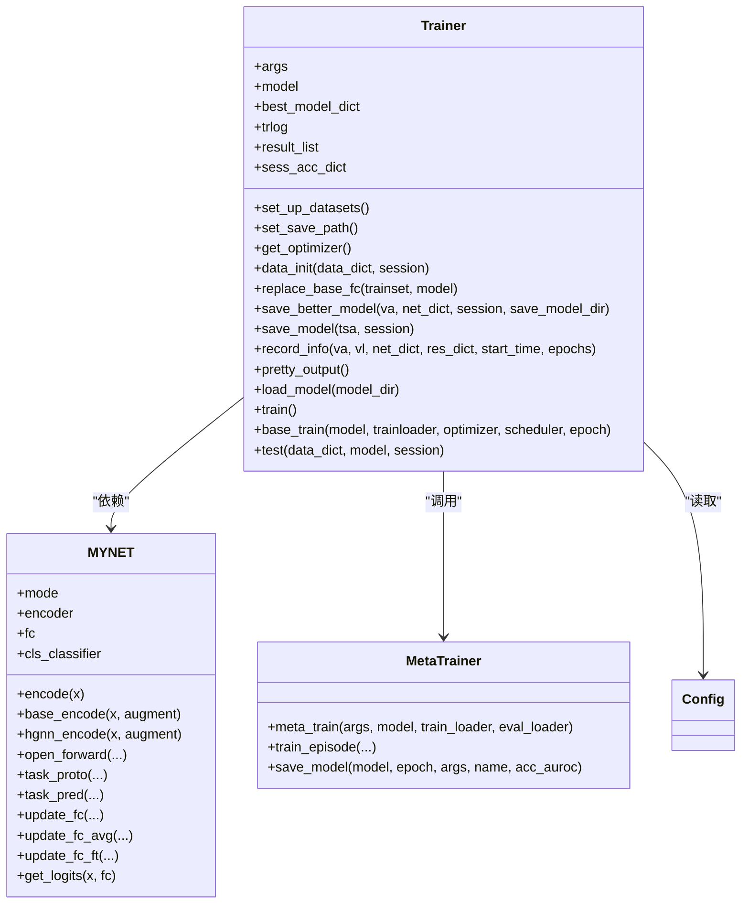

**图表来源**
- [models/base.py:27-254](file://models/base.py#L27-L254)
- [network.py:18-503](file://network.py#L18-L503)
- [models/metatrainer.py:17-85](file://models/metatrainer.py#L17-L85)

## 详细组件分析

### 抽象基类 Trainer 设计与继承体系
- 角色定位：统一训练器生命周期管理，屏蔽具体任务细节，暴露抽象方法供子类实现。
- 关键方法：
  - 数据集设置：根据 args.dataset 导入对应数据模块，便于后续数据加载。
  - 保存路径：基于项目名、配置文件名、超参集合生成唯一保存路径，并确保目录存在。
  - 优化器与调度器：SGD + Step 或 MultiStep，支持学习率衰减。
  - 数据初始化与 FC 替换：加载最佳模型权重，基于训练集特征计算原型，替换分类头权重并保存。
  - 训练统计与日志：维护 trlog 字典与 result_list，记录每轮训练/验证损失与准确率、最佳阈值与轮次。
  - 模型持久化：保存最优模型与优化器状态，支持从指定路径加载继续训练。
  - 测试与基线训练：预留抽象方法，由具体子类实现。

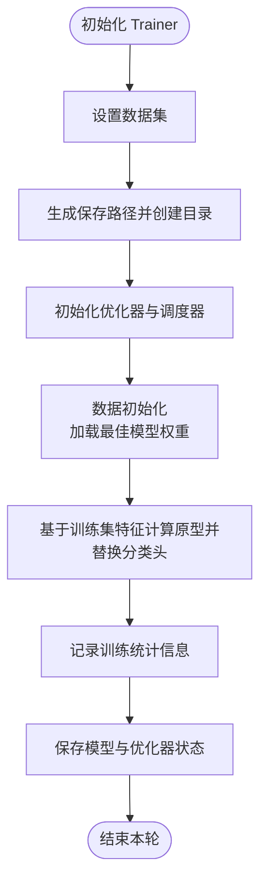

**图表来源**
- [models/base.py:51-119](file://models/base.py#L51-L119)
- [models/base.py:177-191](file://models/base.py#L177-L191)
- [models/base.py:153-176](file://models/base.py#L153-L176)

**章节来源**
- [models/base.py:27-254](file://models/base.py#L27-L254)

### 训练器初始化过程
- 参数解析与配置：通过 YAML 加载训练配置，合并命令行参数，构造命名空间对象。
- 模型实例化：创建 MYNET 实例，设置设备与随机种子，应用固定种子初始化。
- 数据集选择：根据 args.dataset 导入对应数据模块。
- 元训练准备：若启用 checkpoint，则从预训练模型加载分类头参数并更新模型状态；否则执行标准预训练并保存。
- 基于数据集的 FC 替换：使用 get_pretrain_dataloader 获取训练集，调用 replace_base_fc 计算原型并替换分类头权重。

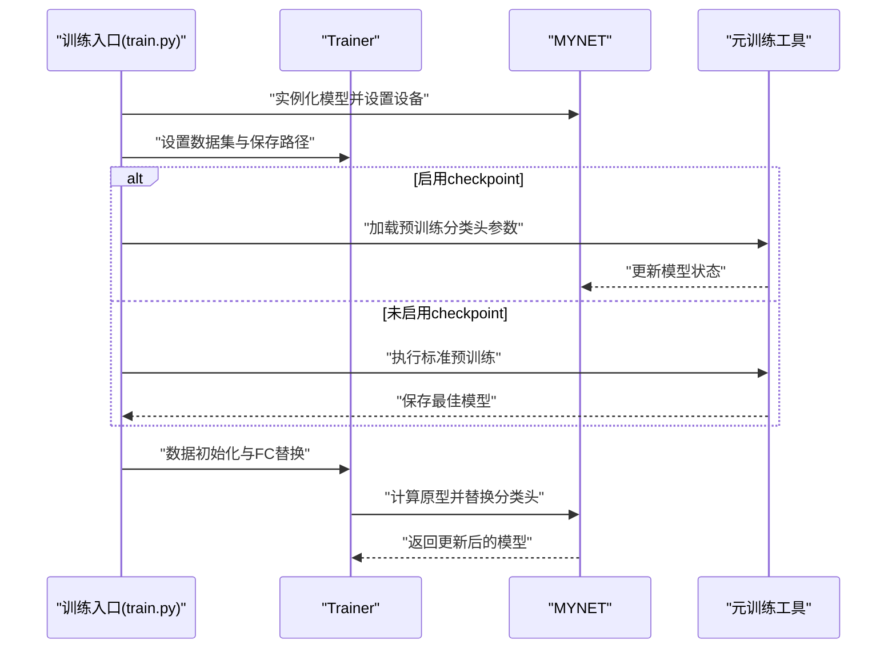

**图表来源**
- [train.py:799-826](file://train.py#L799-L826)
- [models/base.py:111-119](file://models/base.py#L111-L119)
- [models/metatrainer.py:17-34](file://models/metatrainer.py#L17-L34)

**章节来源**
- [train.py:799-826](file://train.py#L799-L826)
- [models/base.py:111-119](file://models/base.py#L111-L119)
- [models/metatrainer.py:17-34](file://models/metatrainer.py#L17-L34)

### 数据集设置与模型保存路径配置
- 数据集设置：根据 args.dataset 选择对应数据模块，便于后续数据加载器与数据集构建。
- 保存路径：基于 debug 标志、数据集名、项目名、配置文件名与超参集合生成唯一路径，并确保目录存在。
- 路径示例：checkpoints/{dataset}/{project}/{config_name}/{hyperparam_str}/

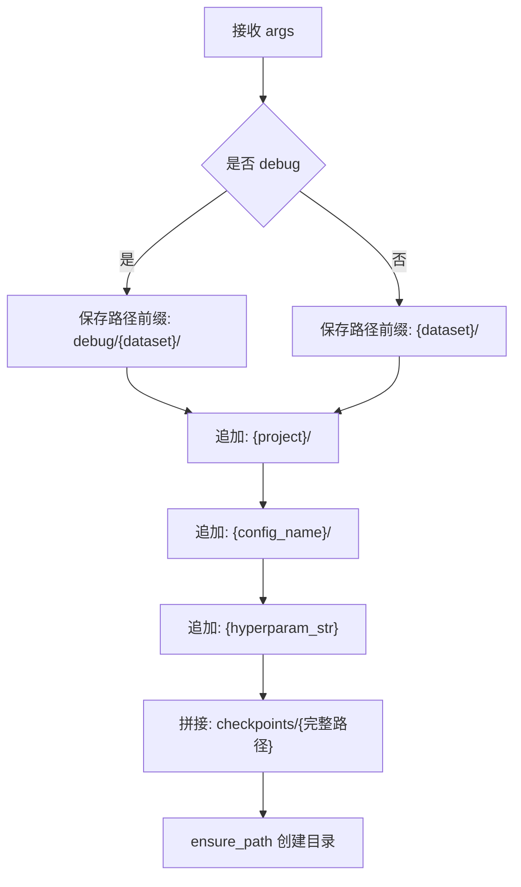

**图表来源**
- [models/base.py:68-83](file://models/base.py#L68-L83)

**章节来源**
- [models/base.py:68-83](file://models/base.py#L68-L83)

### 训练统计信息记录机制
- trlog 字典：维护训练/验证损失与准确率序列、各会话最佳准确率与对应轮次。
- result_list：按轮次记录格式化字符串，包含 epoch、学习率、训练损失/准确率、验证损失/准确率。
- pretty_output：汇总会话准确率，计算综合指标（如 CPI、PD、MSR、AR），并导出 Excel 报告。

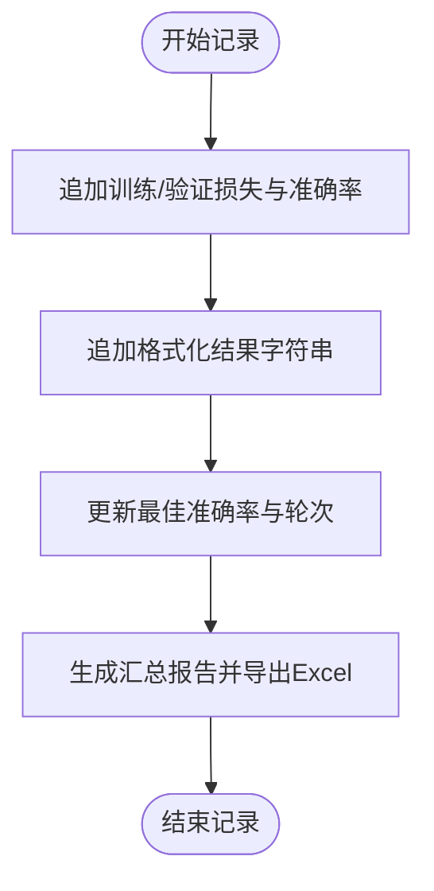

**图表来源**
- [models/base.py:177-233](file://models/base.py#L177-L233)

**章节来源**
- [models/base.py:177-233](file://models/base.py#L177-L233)

### 模型保存与加载功能
- 保存策略：
  - 保存更好模型：当当前验证准确率超过历史最佳时，保存模型权重与优化器状态，并更新最佳模型字典。
  - 保存当前模型：按会话保存测试准确率最高的模型权重。
- 加载策略：从指定路径加载最佳模型权重，更新当前模型参数字典并加载。

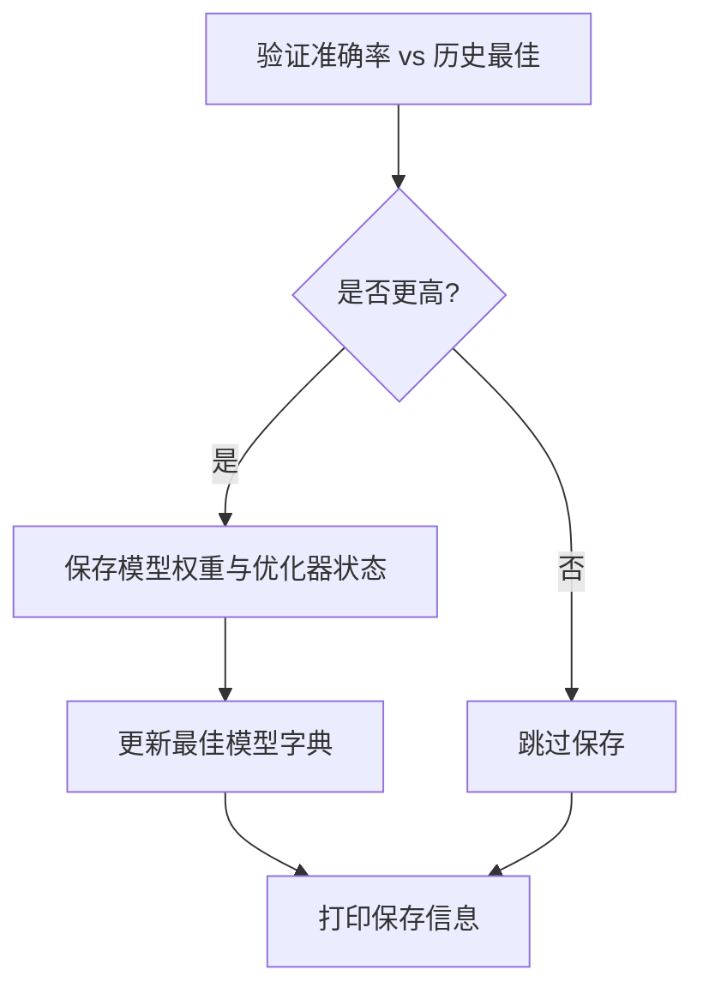

**图表来源**
- [models/base.py:153-176](file://models/base.py#L153-L176)
- [models/base.py:236-244](file://models/base.py#L236-L244)

**章节来源**
- [models/base.py:153-176](file://models/base.py#L153-L176)
- [models/base.py:236-244](file://models/base.py#L236-L244)

### 优化器与学习率调度器配置方法
- 优化器：SGD，支持动量、Nesterov 与权重衰减，学习率来自配置。
- 调度器：Step 或 MultiStep，支持步长与衰减因子。
- 元训练场景：支持 ReduceLROnPlateau（基于验证指标）或自定义阶梯衰减。

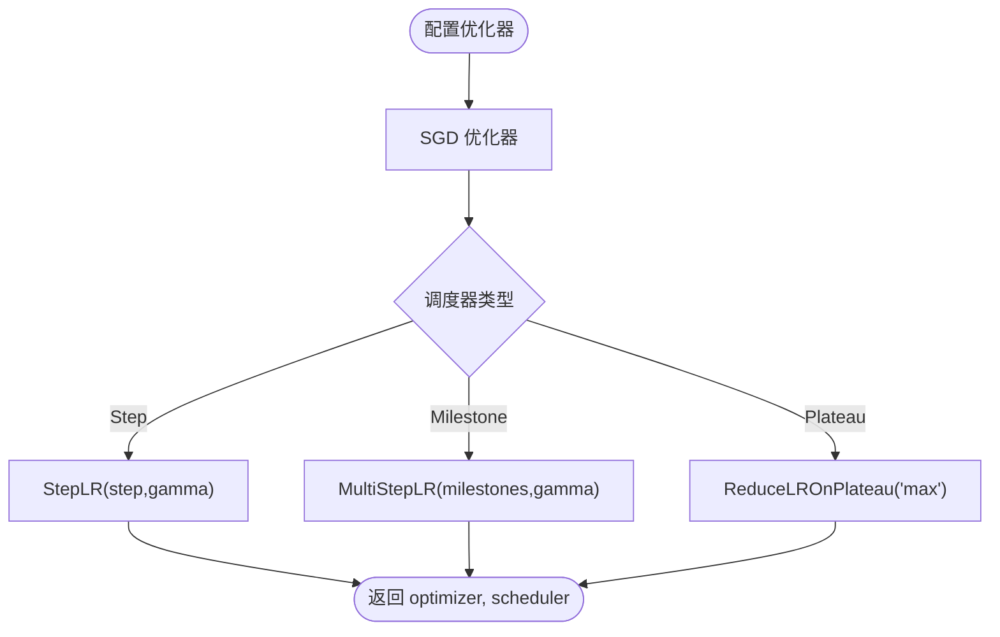

**图表来源**
- [models/base.py:91-100](file://models/base.py#L91-L100)
- [models/metatrainer.py:28-34](file://models/metatrainer.py#L28-L34)

**章节来源**
- [models/base.py:91-100](file://models/base.py#L91-L100)
- [models/metatrainer.py:28-34](file://models/metatrainer.py#L28-L34)

### 数据初始化与全连接层替换机制
- 数据初始化：加载最佳模型权重，基于数据初始化数据集构建新的分类头权重。
- FC 替换：
  - 计算每个类别的平均嵌入（原型）。
  - 将分类头权重前 num_base_class 项替换为原型。
  - 保存替换后的模型权重，便于后续增量训练。

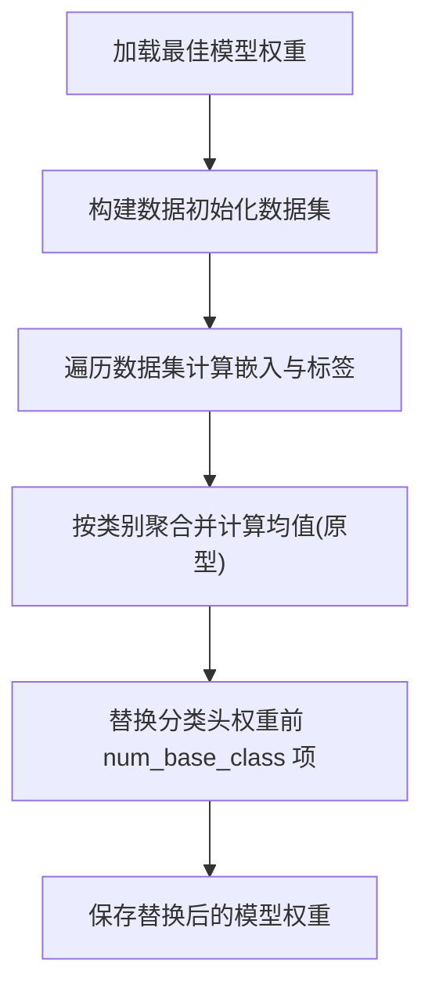

**图表来源**
- [models/base.py:111-119](file://models/base.py#L111-L119)
- [models/base.py:120-151](file://models/base.py#L120-L151)

**章节来源**
- [models/base.py:111-119](file://models/base.py#L111-L119)
- [models/base.py:120-151](file://models/base.py#L120-L151)

### 训练过程中的监控与调试功能
- 训练统计：每轮记录损失与准确率，打印剩余时间估算。
- 结果汇总：pretty_output 输出会话级准确率与综合指标，导出 Excel。
- 元训练监控：元训练流程中记录训练/测试准确率与 AUROC，定期保存模型。
- 模型版本信息：提供打印参数版本号的辅助函数，便于调试参数一致性问题。

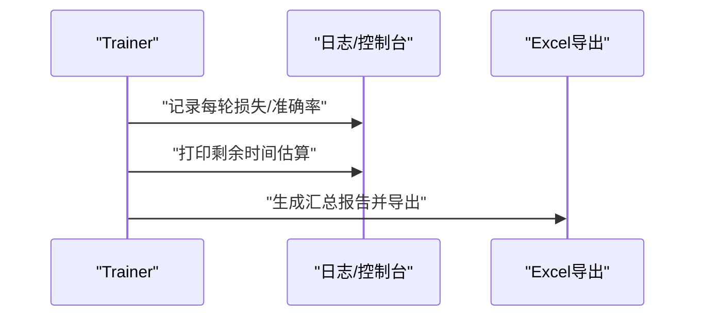

**图表来源**
- [models/base.py:177-233](file://models/base.py#L177-L233)
- [models/metatrainer.py:44-85](file://models/metatrainer.py#L44-L85)

**章节来源**
- [models/base.py:177-233](file://models/base.py#L177-L233)
- [models/metatrainer.py:44-85](file://models/metatrainer.py#L44-L85)

## 依赖分析
- Trainer 依赖：
  - 配置系统：读取训练超参、优化器与调度器配置。
  - 数据加载器：通过 set_up_datasets 选择数据模块，后续由具体实现使用。
  - 模型：MYNET 提供编码、前向与分类头操作。
  - 元训练工具：在元训练场景中加载预训练参数并初始化分类头表示。
- 模块耦合：
  - Trainer 与 MYNET 通过 forward/encode 接口耦合，保持训练器对模型内部细节的低耦合。
  - Trainer 与配置文件通过命名空间对象耦合，便于集中管理超参。

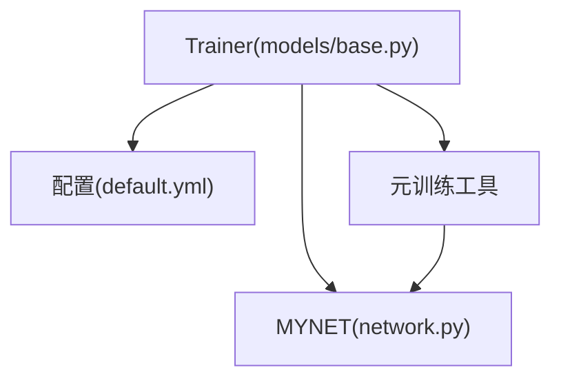

**图表来源**
- [models/base.py:27-254](file://models/base.py#L27-L254)
- [network.py:18-503](file://network.py#L18-L503)
- [models/metatrainer.py:17-85](file://models/metatrainer.py#L17-L85)

**章节来源**
- [models/base.py:27-254](file://models/base.py#L27-L254)
- [network.py:18-503](file://network.py#L18-L503)
- [models/metatrainer.py:17-85](file://models/metatrainer.py#L17-L85)

## 性能考虑
- 训练效率：
  - 使用 CUDA 加速与合适的批大小，合理设置 num_workers 与 pin_memory。
  - 在 FC 替换与特征提取阶段尽量减少不必要的 GPU/CPU 传输。
- 学习率策略：
  - Step/MultiStep 调度适合稳定收敛场景；Plateau 调度适合验证指标波动较大时。
- 模型保存：
  - 仅在验证指标提升时保存模型，避免冗余存储。
- 可扩展性：
  - Trainer 通过抽象方法与配置驱动，便于扩展新的训练策略与数据集。

## 故障排除指南
- 无法找到保存路径：检查 set_save_path 生成的路径是否正确，确认 ensure_path 已创建目录。
- 优化器/调度器异常：确认配置中 schedule 选项与参数一致，确保 lr 与 decay 设置合理。
- FC 替换失败：检查数据初始化数据集的类别数量与 num_base_class 是否一致，确保替换前模型处于正确模式。
- 元训练参数加载：确认预训练模型路径与参数键名匹配，避免加载失败导致初始化不完整。

**章节来源**
- [models/base.py:68-83](file://models/base.py#L68-L83)
- [models/base.py:91-100](file://models/base.py#L91-L100)
- [models/base.py:120-151](file://models/base.py#L120-L151)
- [models/metatrainer.py:17-34](file://models/metatrainer.py#L17-L34)

## 结论
训练器基类通过抽象接口与配置驱动，实现了数据集选择、保存路径管理、优化器/调度器配置、模型保存/加载与训练统计记录的标准化流程。结合 MYNET 的多模式前向与 FC 替换能力，以及元训练工具的参数初始化与训练监控，形成了完整的增量/开放集学习训练框架。建议在实际使用中：
- 明确配置文件与命令行参数优先级，确保超参一致性。
- 在 FC 替换与元训练阶段严格控制模型模式与设备，避免前向逻辑偏差。
- 利用 pretty_output 与 Excel 导出进行结果复盘，持续优化训练策略。