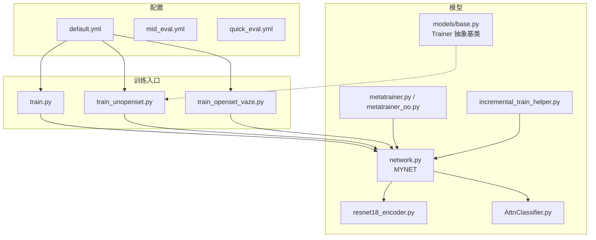
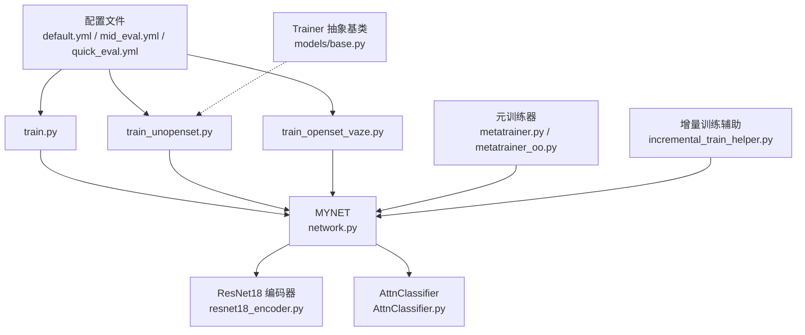
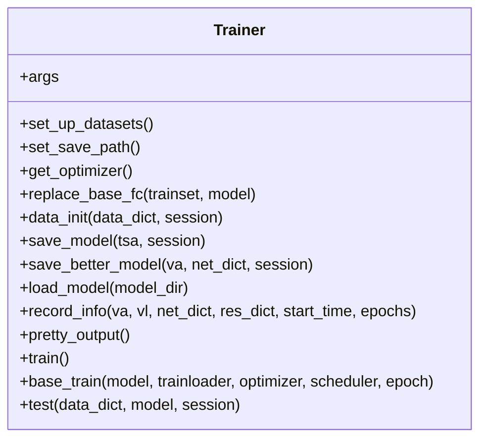
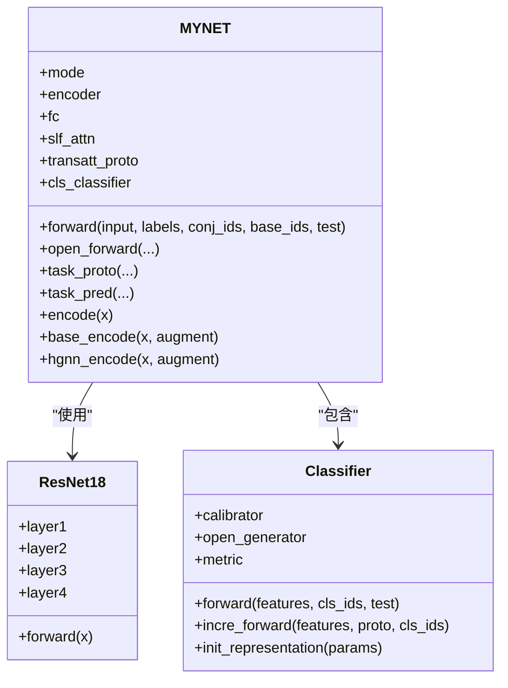
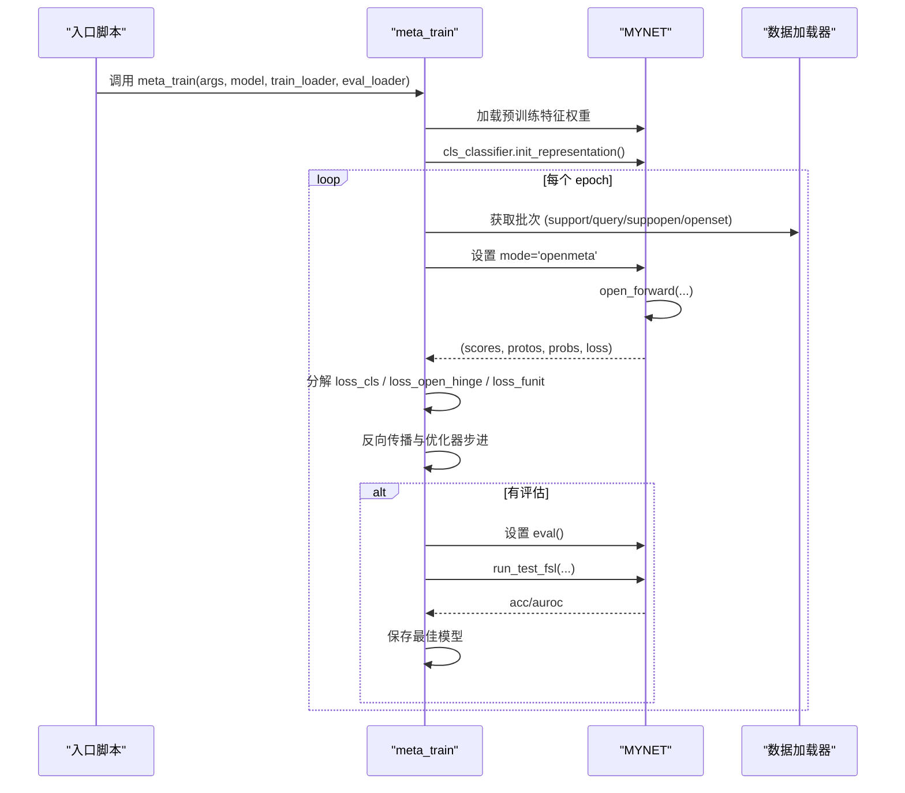
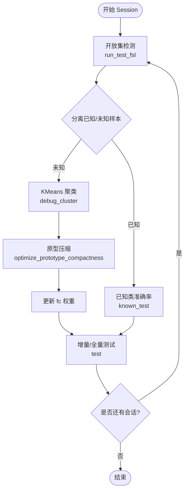
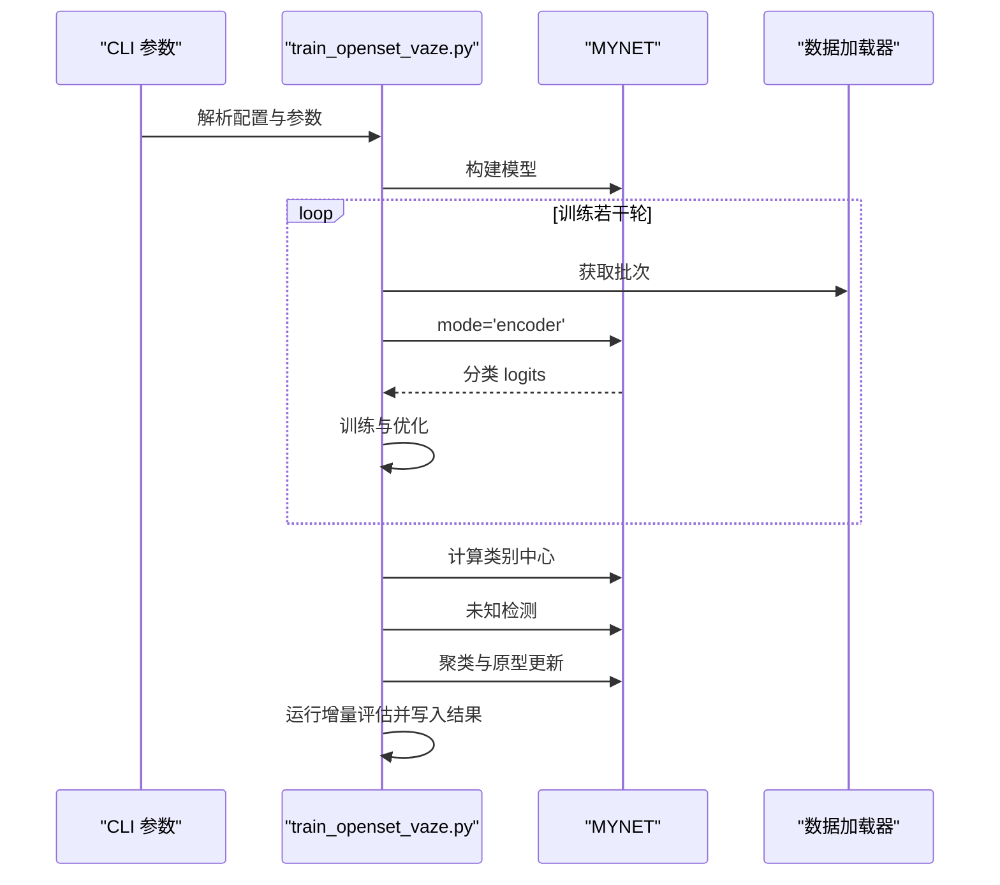
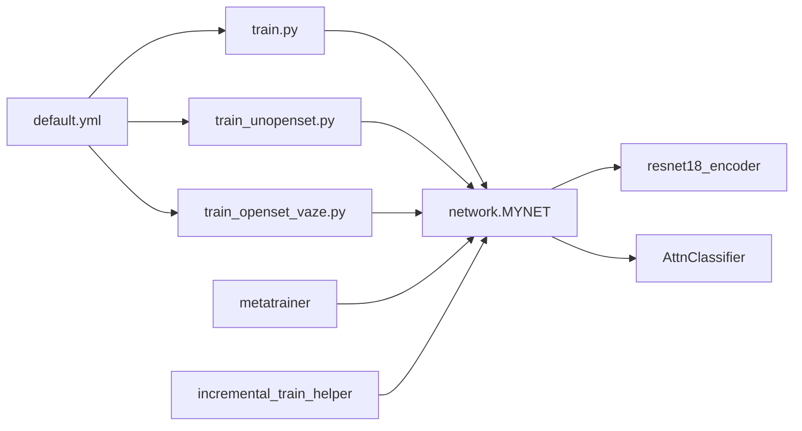

# 训练框架

<cite>
**本文引用的文件**
- [train.py](file://train.py)
- [models/base.py](file://models/base.py)
- [models/metatrainer.py](file://models/metatrainer.py)
- [models/metatrainer_oo.py](file://models/metatrainer_oo.py)
- [configs/default.yml](file://configs/default.yml)
- [configs/mid_eval.yml](file://configs/mid_eval.yml)
- [configs/quick_eval.yml](file://configs/quick_eval.yml)
- [network.py](file://network.py)
- [models/resnet18_encoder.py](file://models/resnet18_encoder.py)
- [models/AttnClassifier.py](file://models/AttnClassifier.py)
- [models/incremental_train_helper.py](file://models/incremental_train_helper.py)
- [train_openset_vaze.py](file://train_openset_vaze.py)
- [train_unopenset.py](file://train_unopenset.py)
</cite>

## 目录
1. [简介](#简介)
2. [项目结构](#项目结构)
3. [核心组件](#核心组件)
4. [架构总览](#架构总览)
5. [详细组件分析](#详细组件分析)
6. [依赖关系分析](#依赖关系分析)
7. [性能考虑](#性能考虑)
8. [故障排查指南](#故障排查指南)
9. [结论](#结论)
10. [附录](#附录)

## 简介
本文件系统化梳理 VAZE 项目的训练框架，重点阐述：
- 训练器基类的设计模式与继承体系
- 增量学习与开放集识别（OSR）的训练流程
- 元训练器（Meta Trainer）的实现机制与会话化学习策略
- 训练配置、模型保存与加载机制
- 训练监控与调试方法
- 不同训练模式的使用场景与参数设置

## 项目结构
仓库采用按功能域划分的组织方式：
- configs：训练配置（默认、中等评估、快速评估）
- models：模型与训练辅助模块（基类、元训练、分类器、编码器、增量训练辅助）
- data：数据加载与采样工具
- utils：通用工具与评估指标
- scripts：实验分析与可视化脚本
- save / save_result：模型检查点与实验结果目录
- 根目录脚本：train.py、train_unopenset.py、train_openset_vaze.py 等

图表来源
- [configs/default.yml:1-88](file://configs/default.yml#L1-L88)
- [network.py:18-50](file://network.py#L18-L50)
- [models/resnet18_encoder.py:240-334](file://models/resnet18_encoder.py#L240-L334)
- [models/AttnClassifier.py:39-118](file://models/AttnClassifier.py#L39-L118)
- [models/base.py:27-50](file://models/base.py#L27-L50)
- [models/metatrainer.py:17-44](file://models/metatrainer.py#L17-L44)
- [models/metatrainer_oo.py:17-44](file://models/metatrainer_oo.py#L17-L44)
- [models/incremental_train_helper.py:11-25](file://models/incremental_train_helper.py#L11-L25)
- [train.py:799-800](file://train.py#L799-L800)
- [train_unopenset.py:449-498](file://train_unopenset.py#L449-L498)
- [train_openset_vaze.py:420-477](file://train_openset_vaze.py#L420-L477)

章节来源
- [configs/default.yml:1-88](file://configs/default.yml#L1-L88)
- [network.py:18-50](file://network.py#L18-L50)
- [models/base.py:27-50](file://models/base.py#L27-L50)
- [models/metatrainer.py:17-44](file://models/metatrainer.py#L17-L44)
- [models/metatrainer_oo.py:17-44](file://models/metatrainer_oo.py#L17-L44)
- [models/incremental_train_helper.py:11-25](file://models/incremental_train_helper.py#L11-L25)
- [train.py:799-800](file://train.py#L799-L800)
- [train_unopenset.py:449-498](file://train_unopenset.py#L449-L498)
- [train_openset_vaze.py:420-477](file://train_openset_vaze.py#L420-L477)

## 核心组件
- 训练器基类（Trainer 抽象基类）
  - 负责数据集初始化、保存路径管理、优化器与调度器、模型保存与加载、训练日志记录与输出等通用能力
  - 通过抽象方法定义具体训练流程（如 base_train/test）

- 模型主体（MYNET）
  - 包含音频前端（STFT/Logmel）、ResNet18 编码器、可选特征增强模块、多头注意力、分类器（AttnClassifier）
  - 支持多种模式：encoder、openmeta、incre 等，以适配标准分类、元训练与增量测试

- 元训练器（meta_train）
  - 负责加载预训练特征提取器权重，初始化分类器原型表示，执行元训练（支持闭集准确率与开放集 AUROC 监控）

- 增量训练辅助（incremental_train_helper）
  - 提供增量阶段的优化器配置、低/新类混合训练、原型适配与在线原型更新等

- 训练入口脚本
  - train.py：标准训练主流程
  - train_unopenset.py：开放集增量训练与评估（含 VAZE 增量流程）
  - train_openset_vaze.py：VAZE 方法的端到端训练与比较结果输出

章节来源
- [models/base.py:27-50](file://models/base.py#L27-L50)
- [network.py:18-50](file://network.py#L18-L50)
- [models/metatrainer.py:17-85](file://models/metatrainer.py#L17-L85)
- [models/incremental_train_helper.py:11-25](file://models/incremental_train_helper.py#L11-L25)
- [train.py:799-800](file://train.py#L799-L800)
- [train_unopenset.py:449-498](file://train_unopenset.py#L449-L498)
- [train_openset_vaze.py:420-477](file://train_openset_vaze.py#L420-L477)

## 架构总览
VAZE 训练框架围绕“配置驱动 + 模块化模型 + 多入口脚本”的设计展开。配置文件统一管理训练超参、网络结构、优化策略与数据加载参数；模型主体封装特征提取、注意力与分类逻辑；元训练器负责开放集与未知类建模；增量训练辅助模块提供增量阶段的优化与原型更新策略。

图表来源
- [configs/default.yml:1-88](file://configs/default.yml#L1-L88)
- [models/base.py:27-50](file://models/base.py#L27-L50)
- [network.py:18-50](file://network.py#L18-L50)
- [models/resnet18_encoder.py:240-334](file://models/resnet18_encoder.py#L240-L334)
- [models/AttnClassifier.py:39-118](file://models/AttnClassifier.py#L39-L118)
- [models/metatrainer.py:17-44](file://models/metatrainer.py#L17-L44)
- [models/metatrainer_oo.py:17-44](file://models/metatrainer_oo.py#L17-L44)
- [models/incremental_train_helper.py:11-25](file://models/incremental_train_helper.py#L11-L25)
- [train.py:799-800](file://train.py#L799-L800)
- [train_unopenset.py:449-498](file://train_unopenset.py#L449-L498)
- [train_openset_vaze.py:420-477](file://train_openset_vaze.py#L420-L477)

## 详细组件分析

### 训练器基类（Trainer 抽象基类）
- 职责
  - 数据集选择与加载（set_up_datasets）
  - 检查点保存路径生成（set_save_path）
  - 优化器与学习率调度器构造（get_optimizer）
  - 基类分类器替换与原型初始化（replace_base_fc/data_init）
  - 模型保存与加载（save_model/save_better_model/load_model）
  - 训练日志记录与汇总输出（record_info/pretty_output）

- 设计要点
  - 使用抽象方法（@abc.abstractmethod）约束子类实现 train/base_train/test
  - 通过字典 trlog 统计训练/验证/测试损失与准确率
  - 保存最佳模型与当前模型，便于后续评估与恢复

图表来源
- [models/base.py:27-253](file://models/base.py#L27-L253)

章节来源
- [models/base.py:27-253](file://models/base.py#L27-L253)

### 模型主体（MYNET）
- 结构
  - 音频前端：STFT、Logmel、SpecAugment、BN
  - 编码器：ResNet18（可加载 ImageNet 预训练权重）
  - 注意力模块：多头注意力（用于原型聚合与上下文建模）
  - 分类器：AttnClassifier（支持语义校准、负原型生成、余弦度量）
  - 模式控制：mode='encoder'/'openmeta'/'incre' 等

- 关键流程
  - open_forward：拼接支持/查询/开放集特征，计算正/负原型与损失
  - task_proto：动态标签分配（基于未知样本的硬正类），生成动态标签并计算交叉熵
  - task_pred：计算查询与开放集的分类概率
  - encode/base_encode/hgnn_encode：不同模式下的特征提取

图表来源
- [network.py:18-50](file://network.py#L18-L50)
- [network.py:471-518](file://network.py#L471-L518)
- [models/resnet18_encoder.py:240-334](file://models/resnet18_encoder.py#L240-L334)
- [models/AttnClassifier.py:39-118](file://models/AttnClassifier.py#L39-L118)

章节来源
- [network.py:18-50](file://network.py#L18-L50)
- [network.py:102-151](file://network.py#L102-L151)
- [network.py:153-202](file://network.py#L153-L202)
- [network.py:225-255](file://network.py#L225-L255)
- [network.py:471-518](file://network.py#L471-L518)
- [models/resnet18_encoder.py:240-334](file://models/resnet18_encoder.py#L240-L334)
- [models/AttnClassifier.py:39-118](file://models/AttnClassifier.py#L39-L118)

### 元训练器（meta_train）
- 作用
  - 加载预训练特征提取器权重，初始化分类器原型表示
  - 在 openmeta 模式下，对支持/查询/开放集样本进行联合训练
  - 监控闭集准确率与开放集 AUROC，定期保存最佳模型

- 训练流程
  - 读取配置与数据加载器
  - 初始化分类器原型（cls_classifier.init_representation）
  - 训练循环：前向、损失分解（分类损失、开放集铰链损失、伪类一致性损失）、反向传播、优化器步进
  - 评估（run_test_fsl）与最佳模型保存

图表来源
- [models/metatrainer.py:17-85](file://models/metatrainer.py#L17-L85)
- [models/metatrainer.py:87-178](file://models/metatrainer.py#L87-L178)
- [models/metatrainer_oo.py:17-85](file://models/metatrainer_oo.py#L17-L85)
- [models/metatrainer_oo.py:87-214](file://models/metatrainer_oo.py#L87-L214)

章节来源
- [models/metatrainer.py:17-85](file://models/metatrainer.py#L17-L85)
- [models/metatrainer.py:87-178](file://models/metatrainer.py#L87-L178)
- [models/metatrainer_oo.py:17-85](file://models/metatrainer_oo.py#L17-L85)
- [models/metatrainer_oo.py:87-214](file://models/metatrainer_oo.py#L87-L214)

### 增量学习与开放集识别流程（VAZE）
- 流程概述
  - 标准分类训练（Session 0）
  - 基类分类器替换与原型初始化
  - 逐会话（Session 1..N）
    - 开放集检测（run_test_fsl）
    - 未知样本聚类与伪标签（debug_cluster）
    - 原型压缩（Prototype Compaction）防止灾难性遗忘
    - 增量测试与全量测试（test）
  - 结果汇总与性能指标（AA/PD 等）

- 关键实现点
  - 开放集检测：基于分类置信度与特征中心相似度阈值判断未知样本
  - 聚类与原型更新：KMeans 聚合未知特征，映射到新类别并更新 fc 权重
  - 原型压缩：最小化簇内方差，同时与基类原型保持最小余弦距离，避免被压向已知类

图表来源
- [train_unopenset.py:538-580](file://train_unopenset.py#L538-L580)
- [train_unopenset.py:544-557](file://train_unopenset.py#L544-L557)
- [train_unopenset.py:280-339](file://train_unopenset.py#L280-L339)
- [train_unopenset.py:341-370](file://train_unopenset.py#L341-L370)

章节来源
- [train_unopenset.py:538-580](file://train_unopenset.py#L538-L580)
- [train_unopenset.py:544-557](file://train_unopenset.py#L544-L557)
- [train_unopenset.py:280-339](file://train_unopenset.py#L280-L339)
- [train_unopenset.py:341-370](file://train_unopenset.py#L341-L370)

### VAZE 方法端到端脚本（train_openset_vaze.py）
- 作用
  - 以 VAZE 方法为核心，训练闭集分类器，结合阈值规则与聚类进行增量扩展
  - 与现有评估协议兼容，输出可比较的测试结果文件

- 关键流程
  - 构建最小参数对象（build_min_args）
  - 训练闭集分类器（train_closed_classifier）
  - 计算类别中心（compute_class_centroids）
  - 未知样本检测（detect_unknowns）
  - 增量添加原型（incremental_add_prototypes）
  - 运行增量评估并写入结果文件（run_incremental_eval_like_baseline）

图表来源
- [train_openset_vaze.py:420-477](file://train_openset_vaze.py#L420-L477)
- [train_openset_vaze.py:86-99](file://train_openset_vaze.py#L86-L99)
- [train_openset_vaze.py:102-131](file://train_openset_vaze.py#L102-L131)
- [train_openset_vaze.py:134-170](file://train_openset_vaze.py#L134-L170)
- [train_openset_vaze.py:173-198](file://train_openset_vaze.py#L173-L198)
- [train_openset_vaze.py:248-417](file://train_openset_vaze.py#L248-L417)

章节来源
- [train_openset_vaze.py:420-477](file://train_openset_vaze.py#L420-L477)
- [train_openset_vaze.py:86-99](file://train_openset_vaze.py#L86-L99)
- [train_openset_vaze.py:102-131](file://train_openset_vaze.py#L102-L131)
- [train_openset_vaze.py:134-170](file://train_openset_vaze.py#L134-L170)
- [train_openset_vaze.py:173-198](file://train_openset_vaze.py#L173-L198)
- [train_openset_vaze.py:248-417](file://train_openset_vaze.py#L248-L417)

### 训练配置、模型保存与加载机制
- 配置文件
  - default.yml/mid_eval.yml/quick_eval.yml：统一管理 way/shot/num_session/epochs/lr/scheduler/optimizer/network/episode/dataloader 等
  - 通过 YAML 加载并转换为命名空间对象，供训练脚本使用

- 模型保存与加载
  - Trainer.save_model/save_better_model：按会话保存最佳模型
  - Trainer.load_model：从指定路径加载预训练参数并更新模型
  - 元训练器保存：按 epoch 保存 cls_params 与 acc_auroc
  - VAZE 脚本：按 epoch 保存完整模型检查点与结果元信息

章节来源
- [configs/default.yml:1-88](file://configs/default.yml#L1-L88)
- [configs/mid_eval.yml:1-88](file://configs/mid_eval.yml#L1-L88)
- [configs/quick_eval.yml:1-88](file://configs/quick_eval.yml#L1-L88)
- [models/base.py:153-175](file://models/base.py#L153-L175)
- [models/base.py:236-244](file://models/base.py#L236-L244)
- [models/metatrainer.py:180-190](file://models/metatrainer.py#L180-L190)
- [train_openset_vaze.py:460-471](file://train_openset_vaze.py#L460-L471)

## 依赖关系分析
- 配置到入口脚本
  - default.yml 被 train.py、train_unopenset.py、train_openset_vaze.py 读取
- 入口脚本到模型
  - 三个入口脚本均依赖 network.MYNET 与相关工具函数
- 模型内部依赖
  - MYNET 依赖 resnet18_encoder 与 AttnClassifier
  - 元训练器依赖 FSEval.run_test_fsl
  - 增量训练辅助依赖数据加载与评估工具

图表来源
- [configs/default.yml:1-88](file://configs/default.yml#L1-L88)
- [train.py:799-800](file://train.py#L799-L800)
- [train_unopenset.py:449-498](file://train_unopenset.py#L449-L498)
- [train_openset_vaze.py:420-477](file://train_openset_vaze.py#L420-L477)
- [network.py:18-50](file://network.py#L18-L50)
- [models/resnet18_encoder.py:240-334](file://models/resnet18_encoder.py#L240-L334)
- [models/AttnClassifier.py:39-118](file://models/AttnClassifier.py#L39-L118)
- [models/metatrainer.py:17-44](file://models/metatrainer.py#L17-L44)
- [models/incremental_train_helper.py:11-25](file://models/incremental_train_helper.py#L11-L25)

章节来源
- [configs/default.yml:1-88](file://configs/default.yml#L1-L88)
- [train.py:799-800](file://train.py#L799-L800)
- [train_unopenset.py:449-498](file://train_unopenset.py#L449-L498)
- [train_openset_vaze.py:420-477](file://train_openset_vaze.py#L420-L477)
- [network.py:18-50](file://network.py#L18-L50)
- [models/resnet18_encoder.py:240-334](file://models/resnet18_encoder.py#L240-L334)
- [models/AttnClassifier.py:39-118](file://models/AttnClassifier.py#L39-L118)
- [models/metatrainer.py:17-44](file://models/metatrainer.py#L17-L44)
- [models/incremental_train_helper.py:11-25](file://models/incremental_train_helper.py#L11-L25)

## 性能考虑
- 训练稳定性
  - 固定随机种子与确定性算法，减少实验波动
  - 使用合适的温度参数与余弦相似度，提升原型判别能力
- 计算效率
  - 使用多头注意力聚合原型，降低冗余计算
  - 在增量阶段采用原型压缩，避免灾难性遗忘导致的反复训练
- 开放集鲁棒性
  - 动态标签分配与铰链损失，强化未知类边界
  - 原型压缩约束与基类原型距离下限，维持已知类性能

## 故障排查指南
- 随机性与可重复性
  - 使用 set_seed 固定随机种子，必要时运行 check_randomness 验证
- 设备与内存
  - 确认 CUDA 可用与显存充足；必要时减小 batch size 或使用 eval 模式减少内存占用
- 模型加载
  - 使用 Trainer.load_model 或元训练器保存的参数加载，注意严格模式与键名匹配
- 开放集检测
  - 调整阈值（如 detect_unknowns 中的置信度与余弦相似度阈值）以平衡误报与漏报
- 增量阶段性能退化
  - 启用原型压缩与基类距离约束，适当降低学习率与增加 epochs

章节来源
- [train.py:114-141](file://train.py#L114-L141)
- [models/base.py:236-244](file://models/base.py#L236-L244)
- [train_unopenset.py:123-147](file://train_unopenset.py#L123-L147)
- [train_unopenset.py:134-170](file://train_unopenset.py#L134-L170)
- [train_unopenset.py:341-370](file://train_unopenset.py#L341-L370)

## 结论
VAZE 训练框架通过“配置驱动 + 模块化模型 + 多入口脚本”的设计，实现了从标准训练到元训练再到增量学习与开放集识别的完整闭环。Trainer 抽象基类提供了统一的训练生命周期管理；MYNET 与 AttnClassifier 实现了强大的特征提取与分类能力；元训练器与增量训练辅助模块分别解决了开放集建模与灾难性遗忘问题。配合完善的保存/加载与监控机制，该框架适用于多场景的持续学习与开放世界识别任务。

## 附录
- 使用场景与参数建议
  - 标准训练：使用 default.yml，设置 way/shot/num_session/epochs/lr 等
  - 元训练：启用 meta_train，关注分类损失、开放集铰链损失与 AUROC
  - 增量学习：在 train_unopenset.py 中设置 num_unlabeled_classes、hinge_margin、compact_lr 等
  - VAZE 方法：使用 train_openset_vaze.py，关注阈值与聚类参数

章节来源
- [configs/default.yml:1-88](file://configs/default.yml#L1-L88)
- [models/metatrainer.py:17-85](file://models/metatrainer.py#L17-L85)
- [train_unopenset.py:212-246](file://train_unopenset.py#L212-L246)
- [train_openset_vaze.py:31-83](file://train_openset_vaze.py#L31-L83)