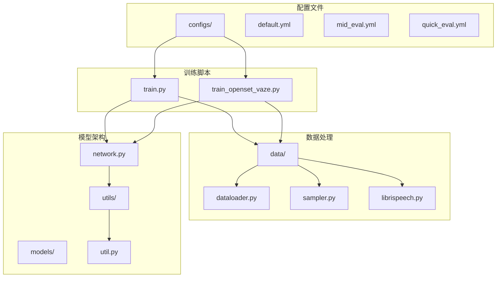
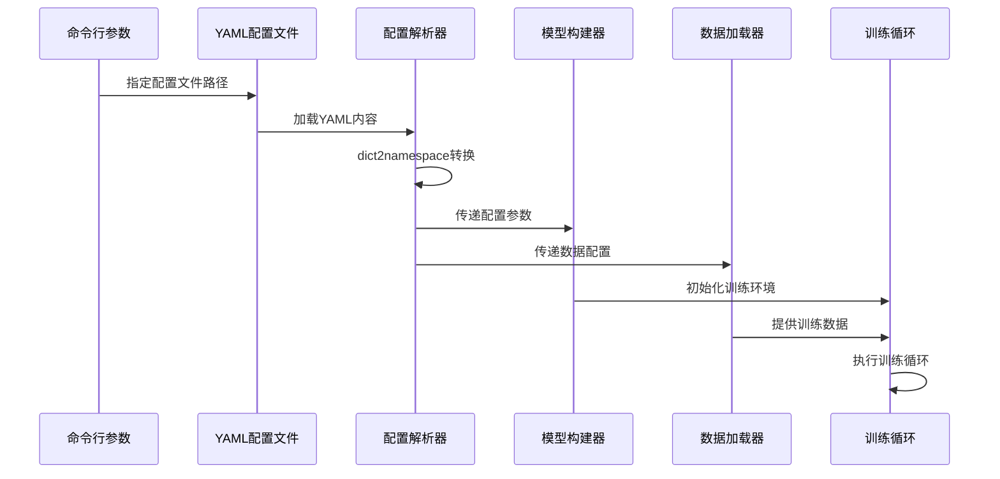
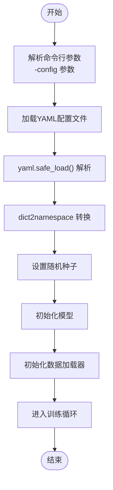
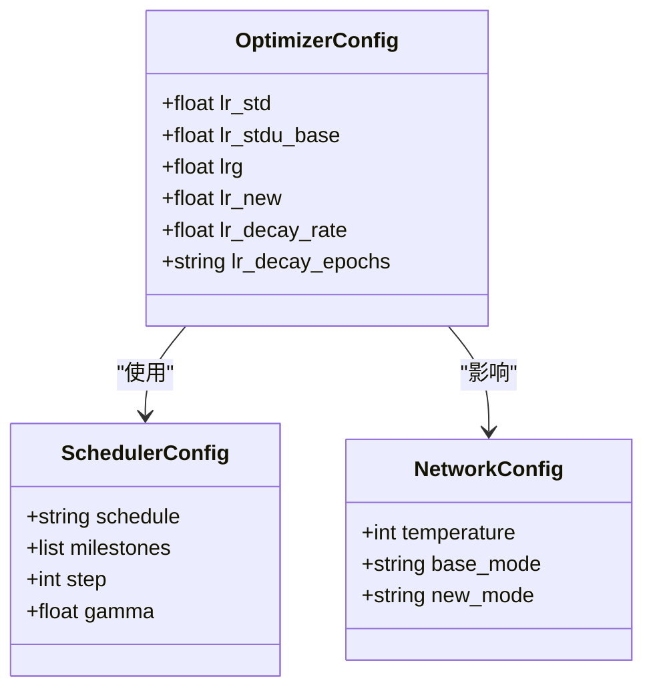
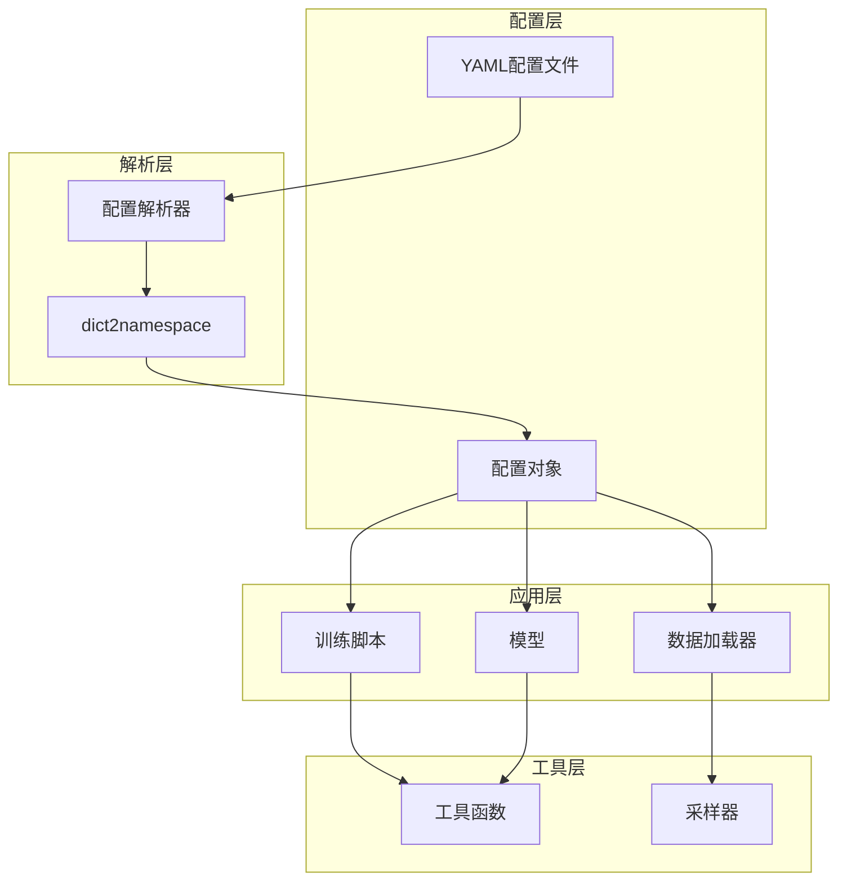

# 训练配置管理

<cite>
**本文档引用的文件**
- [default.yml](file://configs/default.yml)
- [mid_eval.yml](file://configs/mid_eval.yml)
- [quick_eval.yml](file://configs/quick_eval.yml)
- [train.py](file://train.py)
- [train_openset_vaze.py](file://train_openset_vaze.py)
- [network.py](file://network.py)
- [dataloader.py](file://data/dataloader.py)
- [sampler.py](file://data/sampler.py)
- [librispeech.py](file://data/librispeech.py)
- [util.py](file://utils/util.py)
</cite>

## 目录
1. [简介](#简介)
2. [项目结构](#项目结构)
3. [核心组件](#核心组件)
4. [架构概览](#架构概览)
5. [详细组件分析](#详细组件分析)
6. [依赖关系分析](#依赖关系分析)
7. [性能考虑](#性能考虑)
8. [故障排除指南](#故障排除指南)
9. [结论](#结论)

## 简介

本项目是一个增量学习和开放集识别的训练框架，提供了完整的配置管理系统。本文档详细解释了YAML配置文件的结构、参数含义以及训练流程中的各种配置选项。

## 项目结构

该项目采用模块化的组织方式，主要包含以下核心目录：

**图表来源**
- [default.yml:1-88](file://configs/default.yml#L1-L88)
- [train.py:173-210](file://train.py#L173-L210)
- [network.py:18-36](file://network.py#L18-L36)

**章节来源**
- [default.yml:1-88](file://configs/default.yml#L1-L88)
- [train.py:1-120](file://train.py#L1-L120)

## 核心组件

### 配置文件系统

项目提供了三种不同的配置文件，每种都有特定的用途：

| 配置文件 | 主要用途 | 关键特点 |
|---------|----------|----------|
| default.yml | 标准训练配置 | 完整的5轮增量学习，10次测试运行 |
| mid_eval.yml | 中等规模评估 | 减少测试次数至10次，适合中期评估 |
| quick_eval.yml | 快速验证 | 极简配置，仅2轮增量学习 |

### 训练参数配置

训练参数主要包含以下几个方面：

#### 基础训练设置
- **way/shot**: 5-way 5-shot 设置，支持5类每类5个样本
- **num_session**: 增量学习会话数量（默认5轮）
- **num_base/num_novel**: 基础类别80个，新颖类别20个
- **feat_dim**: 特征维度512
- **seed**: 随机种子3420

#### 学习率和调度器
- **lr_std**: 标准训练学习率0.005
- **lr_stdu_base**: 增量训练编码器学习率0.0002
- **lrg**: 图注意力网络学习率0.1
- **lr_decay_rate**: 学习率衰减率0.1
- **scheduler**: 步长调度器，步长40，gamma 0.5

#### 优化器设置
- **decay**: 权重衰减0.0005
- **momentum**: 动量0.9

**章节来源**
- [default.yml:1-88](file://configs/default.yml#L1-L88)
- [mid_eval.yml:1-88](file://configs/mid_eval.yml#L1-L88)
- [quick_eval.yml:1-88](file://configs/quick_eval.yml#L1-L88)

## 架构概览

训练配置管理系统采用分层架构设计：

**图表来源**
- [train.py:173-210](file://train.py#L173-L210)
- [train.py:148-153](file://train.py#L148-L153)

## 详细组件分析

### 配置文件加载机制

配置文件通过标准的YAML解析流程加载：

**图表来源**
- [train.py:173-210](file://train.py#L173-L210)
- [train.py:148-153](file://train.py#L148-L153)

### 数据集配置

数据集配置涵盖了多种音频数据集的支持：

#### LibriSpeech数据集
- **数据格式**: WAV音频文件
- **特征提取**: Mel频谱图，16kHz采样率，400窗口大小，160步长
- **类别划分**: 训练集、验证集、测试集
- **增量学习**: 支持逐步增加新类别的训练

#### 数据增强配置
- **SpecAugmentation**: 时间和频率遮罩
- **噪声注入**: 可选的白噪声添加
- **音高变换**: 临时音高调整
- **时间拉伸**: 速度变化

**章节来源**
- [librispeech.py:21-80](file://data/librispeech.py#L21-L80)
- [librispeech.py:82-200](file://data/librispeech.py#L82-L200)

### 优化器和学习率配置

优化器配置体现了多阶段训练的需求：

**图表来源**
- [default.yml:27-41](file://configs/default.yml#L27-L41)
- [default.yml:34-38](file://configs/default.yml#L34-L38)
- [default.yml:42-45](file://configs/default.yml#L42-L45)

### 采样器配置

项目实现了多种采样策略以支持不同的训练场景：

#### 基础类别采样器
- **CategoriesSampler**: 标准的K-way N-shot采样
- **SupportsetSampler**: 支持集采样器
- **CurriculumSampler**: 课程学习采样器

#### 增量学习采样器
- **TrueIncreTrainCategoriesSampler**: 真实增量训练采样器
- 支持基础类别和新颖类别的混合采样
- 可配置的样本数量和查询数量

**章节来源**
- [sampler.py:6-36](file://data/sampler.py#L6-L36)
- [sampler.py:38-93](file://data/sampler.py#L38-L93)
- [sampler.py:97-140](file://data/sampler.py#L97-L140)

## 依赖关系分析

配置管理系统的关键依赖关系如下：

**图表来源**
- [train.py:148-153](file://train.py#L148-L153)
- [network.py:586-608](file://network.py#L586-L608)

**章节来源**
- [train.py:1-120](file://train.py#L1-L120)
- [network.py:586-608](file://network.py#L586-L608)

## 性能考虑

### 配置优化建议

1. **批量大小调整**: 根据GPU内存调整 `train_batch_size` 和 `test_batch_size`
2. **学习率调度**: 根据训练收敛情况调整 `step` 和 `gamma` 参数
3. **采样策略**: 在增量学习中合理配置 `low_way` 和 `episode_way`
4. **数据增强**: 适度的数据增强可以提高泛化能力但会影响训练速度

### 内存管理

- **特征缓存**: 大型数据集建议启用特征缓存
- **批处理优化**: 合理设置 `num_workers` 以平衡I/O和CPU负载
- **数据预加载**: 使用 `pin_memory=True` 提高数据传输效率

## 故障排除指南

### 常见配置问题

#### YAML解析错误
- **症状**: 配置文件加载失败
- **解决方案**: 检查YAML缩进和语法，确保所有字符串都用引号包围

#### 数据路径问题
- **症状**: 数据集加载失败
- **解决方案**: 验证 `dataroot` 路径存在且包含正确的CSV文件

#### 内存不足
- **症状**: 训练过程中出现内存溢出
- **解决方案**: 减小 `train_batch_size` 或增加 `num_workers`

### 调试技巧

1. **随机种子一致性**: 确保 `seed` 参数在所有组件中一致
2. **配置验证**: 使用 `check_randomness()` 函数验证随机性设置
3. **渐进式调试**: 从 `quick_eval.yml` 开始，逐步过渡到完整配置

**章节来源**
- [train.py:135-141](file://train.py#L135-L141)
- [util.py:59-74](file://utils/util.py#L59-L74)

## 结论

本训练配置管理系统提供了灵活而强大的配置管理能力，支持多种训练场景和实验需求。通过合理的配置选择和优化，可以有效提升训练效率和模型性能。建议用户根据具体需求选择合适的配置文件，并在实际使用中进行必要的调整和优化。