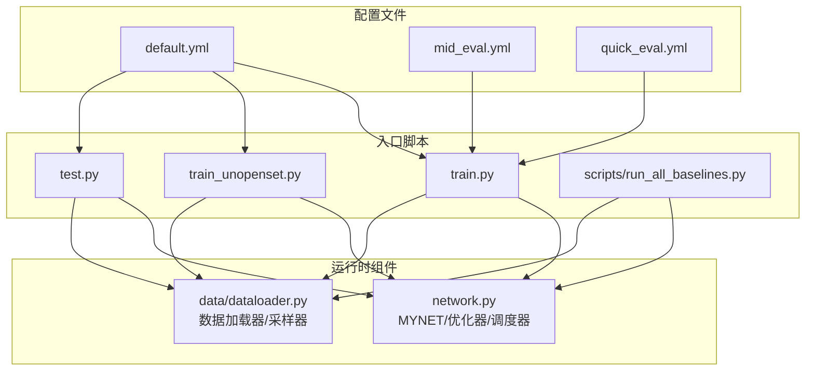
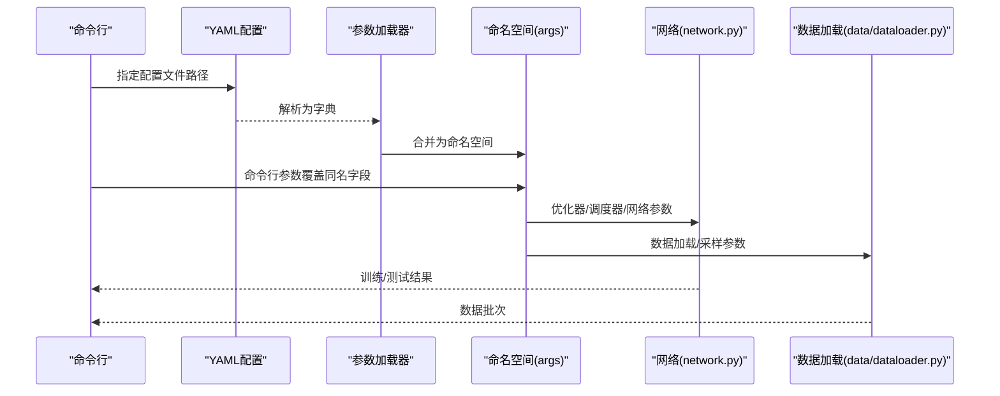
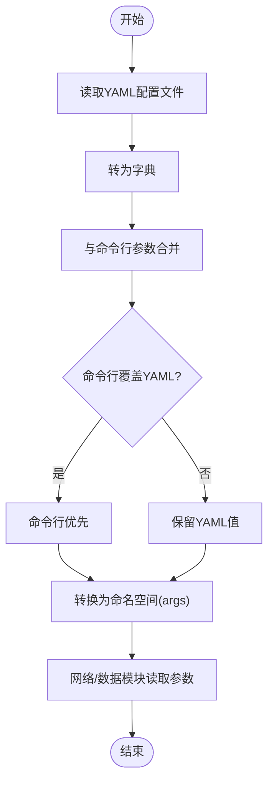
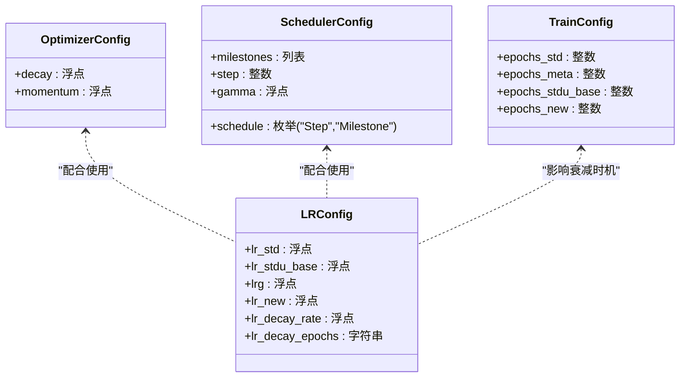
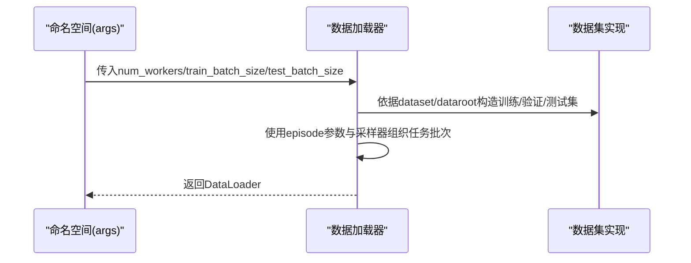
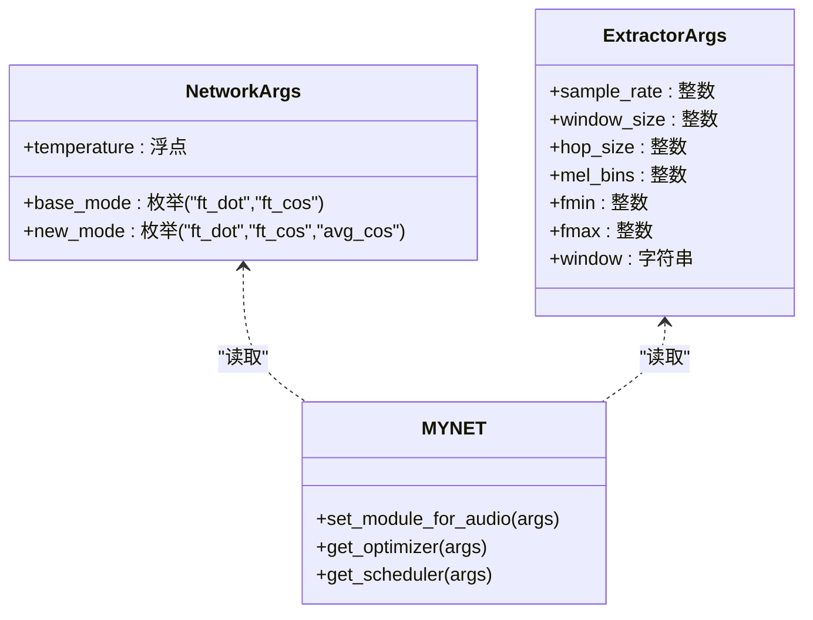
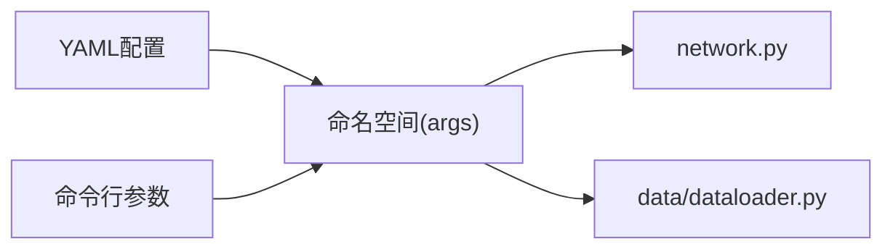

# 配置系统

<cite>
**本文引用的文件**
- [configs/default.yml](file://configs/default.yml)
- [configs/mid_eval.yml](file://configs/mid_eval.yml)
- [configs/quick_eval.yml](file://configs/quick_eval.yml)
- [train.py](file://train.py)
- [train_unopenset.py](file://train_unopenset.py)
- [test.py](file://test.py)
- [network.py](file://network.py)
- [data/dataloader.py](file://data/dataloader.py)
- [scripts/run_all_baselines.py](file://scripts/run_all_baselines.py)
</cite>

## 目录
1. [简介](#简介)
2. [项目结构](#项目结构)
3. [核心组件](#核心组件)
4. [架构总览](#架构总览)
5. [详细组件分析](#详细组件分析)
6. [依赖关系分析](#依赖关系分析)
7. [性能考量](#性能考量)
8. [故障排查指南](#故障排查指南)
9. [结论](#结论)
10. [附录](#附录)

## 简介
本文件系统性阐述 VAZE 项目的配置系统，覆盖 YAML 配置文件的结构、参数语义、加载机制与参数优先级、以及如何基于模板定制配置。内容面向不同技术背景的读者，既提供高层概览，也给出代码级的结构与流程图示，帮助快速定位与调参。

## 项目结构
VAZE 的配置系统围绕一组 YAML 文件与若干入口脚本协同工作：
- 配置文件位于 configs/ 目录，提供默认与评估场景的模板
- 训练/测试入口脚本负责解析命令行参数并与 YAML 合并
- 网络与数据模块读取合并后的参数对象，驱动模型与数据加载行为

图表来源
- [configs/default.yml:1-88](file://configs/default.yml#L1-L88)
- [configs/mid_eval.yml:1-88](file://configs/mid_eval.yml#L1-L88)
- [configs/quick_eval.yml:1-88](file://configs/quick_eval.yml#L1-L88)
- [train.py:173-200](file://train.py#L173-L200)
- [train_unopenset.py:179-191](file://train_unopenset.py#L179-L191)
- [test.py:289-301](file://test.py#L289-L301)
- [scripts/run_all_baselines.py:56-75](file://scripts/run_all_baselines.py#L56-L75)
- [network.py:586-608](file://network.py#L586-L608)
- [data/dataloader.py:1-200](file://data/dataloader.py#L1-L200)

章节来源
- [configs/default.yml:1-88](file://configs/default.yml#L1-L88)
- [configs/mid_eval.yml:1-88](file://configs/mid_eval.yml#L1-L88)
- [configs/quick_eval.yml:1-88](file://configs/quick_eval.yml#L1-L88)
- [train.py:173-200](file://train.py#L173-L200)
- [train_unopenset.py:179-191](file://train_unopenset.py#L179-L191)
- [test.py:289-301](file://test.py#L289-L301)
- [scripts/run_all_baselines.py:56-75](file://scripts/run_all_baselines.py#L56-L75)

## 核心组件
- 配置文件（YAML）：集中定义训练、学习率、调度器、优化器、网络、策略、episode、dataloader、STDU、音频特征提取器等参数
- 参数加载与合并：入口脚本通过 YAML 加载配置，再与命令行参数合并，形成最终命名空间对象
- 运行时读取：网络与数据模块从命名空间读取参数，构建模型、优化器、调度器与数据加载器

章节来源
- [configs/default.yml:1-88](file://configs/default.yml#L1-L88)
- [train.py:1100-1140](file://train.py#L1100-L1140)
- [train_unopenset.py:1126-1140](file://train_unopenset.py#L1126-L1140)
- [test.py:1300-1314](file://test.py#L1300-L1314)
- [network.py:586-608](file://network.py#L586-L608)
- [data/dataloader.py:1-200](file://data/dataloader.py#L1-L200)

## 架构总览
下图展示配置从 YAML 到运行时的传递路径与关键决策点：

图表来源
- [train.py:1100-1140](file://train.py#L1100-L1140)
- [train_unopenset.py:1126-1140](file://train_unopenset.py#L1126-L1140)
- [test.py:1300-1314](file://test.py#L1300-L1314)
- [network.py:586-608](file://network.py#L586-L608)
- [data/dataloader.py:1-200](file://data/dataloader.py#L1-L200)

## 详细组件分析

### YAML 配置文件结构与参数说明
- 训练控制（train.*）
  - 元训练与增量训练规模：way、shot、n_ways、n_shots、n_queries、n_test_runs、n_train_runs
  - 任务类别划分：num_base、num_novel、num_all、start_session、num_session
  - 重复次数与采样：test_times、seq_sample、tmp_train、feat_dim、seed、save_dir
  - 训练轮次：epochs_std、epochs_meta、epochs_stdu_base、epochs_new
  - 学习率与衰减：lr_std、lr_stdu_base、lrg、lr_new、lr_decay_rate、lr_decay_epochs
  - 调度器：schedule（Step/Milestone）、milestones、step、gamma
  - 优化器：decay、momentum
  - 网络：temperature、base_mode、new_mode
  - 策略：data_init、set_no_val、seq_sample
  - Episode：train_episode、episode_way、episode_shot、episode_query、low_way、low_shot
  - DataLoader：num_workers、train_batch_size、test_batch_size
  - STDU：num_tmpb、num_tmpi、num_tmps、num_incre、pqa、ap（use_ap、ap_type、ap_on_test）、anchor（use_anchor、anchor_type）、proto（weighted、type）
  - 音频特征提取器：sample_rate、window_size、hop_size、mel_bins、fmin、fmax、window

- 配置模板与差异
  - default.yml：完整训练场景的默认配置
  - mid_eval.yml：中等评估强度（降低 test_times）
  - quick_eval.yml：快速评估（减少 num_session 与 test_times）

章节来源
- [configs/default.yml:1-88](file://configs/default.yml#L1-L88)
- [configs/mid_eval.yml:1-88](file://configs/mid_eval.yml#L1-L88)
- [configs/quick_eval.yml:1-88](file://configs/quick_eval.yml#L1-L88)

### 参数加载机制与优先级
- 加载流程
  - 入口脚本解析命令行参数，读取 -config 指定的 YAML 文件
  - 将 YAML 字典转换为命名空间对象，并与命令行参数字典合并
  - 若命令行与 YAML 同名字段冲突，命令行优先覆盖 YAML
- 代码体现
  - YAML 加载与合并：[train.py:1100-1140](file://train.py#L1100-L1140)、[train_unopenset.py:1126-1140](file://train_unopenset.py#L1126-L1140)、[test.py:1300-1314](file://test.py#L1300-L1314)
  - 命令行参数定义：[train.py:173-200](file://train.py#L173-L200)、[train_unopenset.py:179-191](file://train_unopenset.py#L179-L191)、[test.py:289-301](file://test.py#L289-L301)
  - 脚本工具加载器（最小化 YAML 解析）：[scripts/run_all_baselines.py:56-75](file://scripts/run_all_baselines.py#L56-L75)

图表来源
- [train.py:1100-1140](file://train.py#L1100-L1140)
- [train_unopenset.py:1126-1140](file://train_unopenset.py#L1126-L1140)
- [test.py:1300-1314](file://test.py#L1300-L1314)
- [scripts/run_all_baselines.py:56-75](file://scripts/run_all_baselines.py#L56-L75)

章节来源
- [train.py:1100-1140](file://train.py#L1100-L1140)
- [train_unopenset.py:1126-1140](file://train_unopenset.py#L1126-L1140)
- [test.py:1300-1314](file://test.py#L1300-L1314)
- [scripts/run_all_baselines.py:56-75](file://scripts/run_all_baselines.py#L56-L75)

### 训练参数与学习率调度
- 训练轮次与学习率
  - 标准训练、元训练、增量基类、增量新类分别配置 epochs
  - 多种学习率：标准训练、增量基类编码器、图注意力、增量新类
  - 学习率衰减：支持 Step 与 Milestone 两种策略，可配置 step、milestones、gamma
- 优化器与调度器
  - SGD 优化器，momentum、nesterov、weight_decay
  - StepLR 或 MultiStepLR 调度器

图表来源
- [configs/default.yml:22-41](file://configs/default.yml#L22-L41)
- [network.py:586-608](file://network.py#L586-L608)

章节来源
- [configs/default.yml:22-41](file://configs/default.yml#L22-L41)
- [network.py:586-608](file://network.py#L586-L608)

### 数据集与数据加载配置
- 数据集选择与根目录
  - dataset、dataroot 支持多种数据集类型
- DataLoader 参数
  - num_workers、train_batch_size、test_batch_size
- 采样与分批
  - 基类/增量数据加载器采用自定义采样器，结合 episode 参数控制每批次任务规模
- 随机性与确定性
  - worker_init_fn 与 Generator 设置，确保可复现

图表来源
- [configs/default.yml:57-60](file://configs/default.yml#L57-L60)
- [data/dataloader.py:1-200](file://data/dataloader.py#L1-L200)

章节来源
- [configs/default.yml:57-60](file://configs/default.yml#L57-L60)
- [data/dataloader.py:1-200](file://data/dataloader.py#L1-L200)

### 网络与音频特征提取器配置
- 网络参数
  - temperature、base_mode、new_mode 控制分类器与相似度计算方式
- 音频特征提取器
  - sample_rate、window_size、hop_size、mel_bins、fmin、fmax、window
  - 网络内部据此构建 STFT、Mel 滤波器与增广模块
- 优化器与调度器
  - 从 args 中读取 lr、scheduler 配置

图表来源
- [configs/default.yml:42-45](file://configs/default.yml#L42-L45)
- [configs/default.yml:77-84](file://configs/default.yml#L77-L84)
- [network.py:326-352](file://network.py#L326-L352)
- [network.py:586-608](file://network.py#L586-L608)

章节来源
- [configs/default.yml:42-45](file://configs/default.yml#L42-L45)
- [configs/default.yml:77-84](file://configs/default.yml#L77-L84)
- [network.py:326-352](file://network.py#L326-L352)
- [network.py:586-608](file://network.py#L586-L608)

### STDU 与原型/锚点配置
- STDU 参数
  - num_tmpb、num_tmpi、num_tmps、num_incre、pqa
- AP（伪类/锚点）配置
  - use_ap、ap_type、ap_on_test
- Anchor（锚点）配置
  - use_anchor、anchor_type
- Proto（原型）配置
  - weighted、type（mmt/res）

章节来源
- [configs/default.yml:61-76](file://configs/default.yml#L61-L76)

## 依赖关系分析
- 入口脚本对 YAML 的依赖：通过 -config 指定配置文件
- 命名空间对运行时模块的依赖：network.py、data/dataloader.py 从 args 读取参数
- 参数覆盖链路：YAML → 命令行 → 最终命名空间

图表来源
- [train.py:1100-1140](file://train.py#L1100-L1140)
- [train_unopenset.py:1126-1140](file://train_unopenset.py#L1126-L1140)
- [test.py:1300-1314](file://test.py#L1300-L1314)
- [network.py:586-608](file://network.py#L586-L608)
- [data/dataloader.py:1-200](file://data/dataloader.py#L1-L200)

章节来源
- [train.py:1100-1140](file://train.py#L1100-L1140)
- [train_unopenset.py:1126-1140](file://train_unopenset.py#L1126-L1140)
- [test.py:1300-1314](file://test.py#L1300-L1314)
- [network.py:586-608](file://network.py#L586-L608)
- [data/dataloader.py:1-200](file://data/dataloader.py#L1-L200)

## 性能考量
- 并行与吞吐
  - num_workers、train_batch_size、test_batch_size 影响数据加载吞吐与显存占用
- 训练稳定性
  - 学习率与调度器设置影响收敛速度与稳定性
- 确定性与可复现
  - 通过 set_seed、Deterministic CUDNN 与环境变量固定随机源，确保实验可复现

## 故障排查指南
- 配置未生效
  - 确认 -config 指向正确文件，且命令行参数未意外覆盖
  - 检查 YAML 语法与缩进
- 数据加载异常
  - 检查 dataroot 与 dataset 是否匹配，确认 num_workers 与 batch_size 合理
- 训练不收敛或不稳定
  - 调整学习率与调度器参数，检查 weight_decay、momentum
- 随机性问题
  - 确认 set_seed 已调用，CUDNN 确定性已启用

章节来源
- [train.py:1100-1140](file://train.py#L1100-L1140)
- [train_unopenset.py:1126-1140](file://train_unopenset.py#L1126-L1140)
- [test.py:1300-1314](file://test.py#L1300-L1314)
- [data/dataloader.py:1-200](file://data/dataloader.py#L1-L200)

## 结论
VAZE 的配置系统以 YAML 为中心，通过入口脚本完成与命令行的合并，最终由网络与数据模块消费。该设计提供了清晰的参数边界与灵活的覆盖能力，便于在不同数据集与任务规模下快速定制与复现实验。

## 附录

### 配置模板与自定义指南
- 使用模板
  - 默认训练：使用 default.yml
  - 中等评估：使用 mid_eval.yml
  - 快速评估：使用 quick_eval.yml
- 自定义步骤
  - 在 configs/ 下新建 YAML 文件，复制对应模板的关键段落
  - 在入口脚本中通过 -config 指向新文件
  - 如需覆盖特定参数，使用命令行参数进行微调

章节来源
- [configs/default.yml:1-88](file://configs/default.yml#L1-L88)
- [configs/mid_eval.yml:1-88](file://configs/mid_eval.yml#L1-L88)
- [configs/quick_eval.yml:1-88](file://configs/quick_eval.yml#L1-L88)
- [train.py:173-200](file://train.py#L173-L200)
- [train_unopenset.py:179-191](file://train_unopenset.py#L179-L191)
- [test.py:289-301](file://test.py#L289-L301)

### 常见配置场景与调优建议
- 小样本 Few-Shot 场景
  - 降低 test_times 以加速评估（参考 mid_eval.yml/quick_eval.yml）
  - 合理设置 n_ways、n_shots、n_queries
- 增量学习场景
  - 调整 num_session、num_base、num_novel
  - 关注增量阶段的 epochs_new 与 lr_new
- 数据加载与内存
  - 提高 num_workers 与适当增大 batch_size
  - 若显存受限，降低 batch_size 或使用更小的 mel_bins/window_size
- 学习率与收敛
  - 若训练不稳定，尝试更保守的 lr_std 与更早的衰减步长
  - 使用 Step 调度器时，step 与 gamma 需与任务规模匹配