# 项目结构详解

<cite>
**本文档引用的文件**
- [models/base.py](file://models/base.py)
- [models/baselines/base.py](file://models/baselines/base.py)
- [data/dataloader.py](file://data/dataloader.py)
- [configs/default.yml](file://configs/default.yml)
- [train.py](file://train.py)
- [network.py](file://network.py)
- [models/metatrainer.py](file://models/metatrainer.py)
- [utils/utils.py](file://utils/utils.py)
- [data/sampler.py](file://data/sampler.py)
- [enhance_module.py](file://enhance_module.py)
- [models/resnet18_encoder.py](file://models/resnet18_encoder.py)
- [models/AttnClassifier.py](file://models/AttnClassifier.py)
- [scripts/run_all_baselines.py](file://scripts/run_all_baselines.py)
- [docs/module_overview.md](file://docs/module_overview.md)
- [docs/experiment_plan_and_baselines.md](file://docs/experiment_plan_and_baselines.md)
</cite>

## 目录
1. [简介](#简介)
2. [项目结构](#项目结构)
3. [核心组件](#核心组件)
4. [架构概览](#架构概览)
5. [详细组件分析](#详细组件分析)
6. [依赖分析](#依赖分析)
7. [性能考虑](#性能考虑)
8. [故障排除指南](#故障排除指南)
9. [结论](#结论)
10. [附录](#附录)

## 简介

VAZE项目是一个面向开放世界持续学习（Open-World Continual Learning）的音频分类系统，专注于少样本增量学习（Few-Shot Class-Incremental Learning）和开放集识别（Open-Set Recognition）。该项目实现了创新的"开集对偶原型元训练"方法，结合不确定性估计和课程学习策略，在多个音频数据集上实现了卓越的性能表现。

项目采用模块化设计，将网络架构、数据处理、训练框架、基线方法等功能清晰分离，提供了完整的实验框架和评估体系。

## 项目结构

项目采用典型的深度学习研究项目结构，按照功能域进行模块化组织：

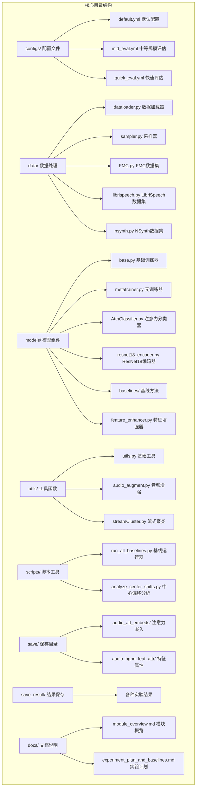

**图表来源**
- [configs/default.yml:1-88](file://configs/default.yml#L1-L88)
- [data/dataloader.py:1-351](file://data/dataloader.py#L1-L351)
- [models/base.py:1-254](file://models/base.py#L1-L254)
- [utils/utils.py:1-566](file://utils/utils.py#L1-L566)

### 目录组织原则

1. **功能导向**：每个目录专注于特定功能领域
2. **可扩展性**：支持新的数据集和模型组件
3. **配置驱动**：通过YAML配置文件控制实验设置
4. **模块化设计**：各组件相对独立，便于替换和组合

**章节来源**
- [configs/default.yml:1-88](file://configs/default.yml#L1-L88)
- [docs/module_overview.md:1-51](file://docs/module_overview.md#L1-L51)

## 核心组件

### 网络架构组件

项目的核心网络架构由以下关键组件构成：

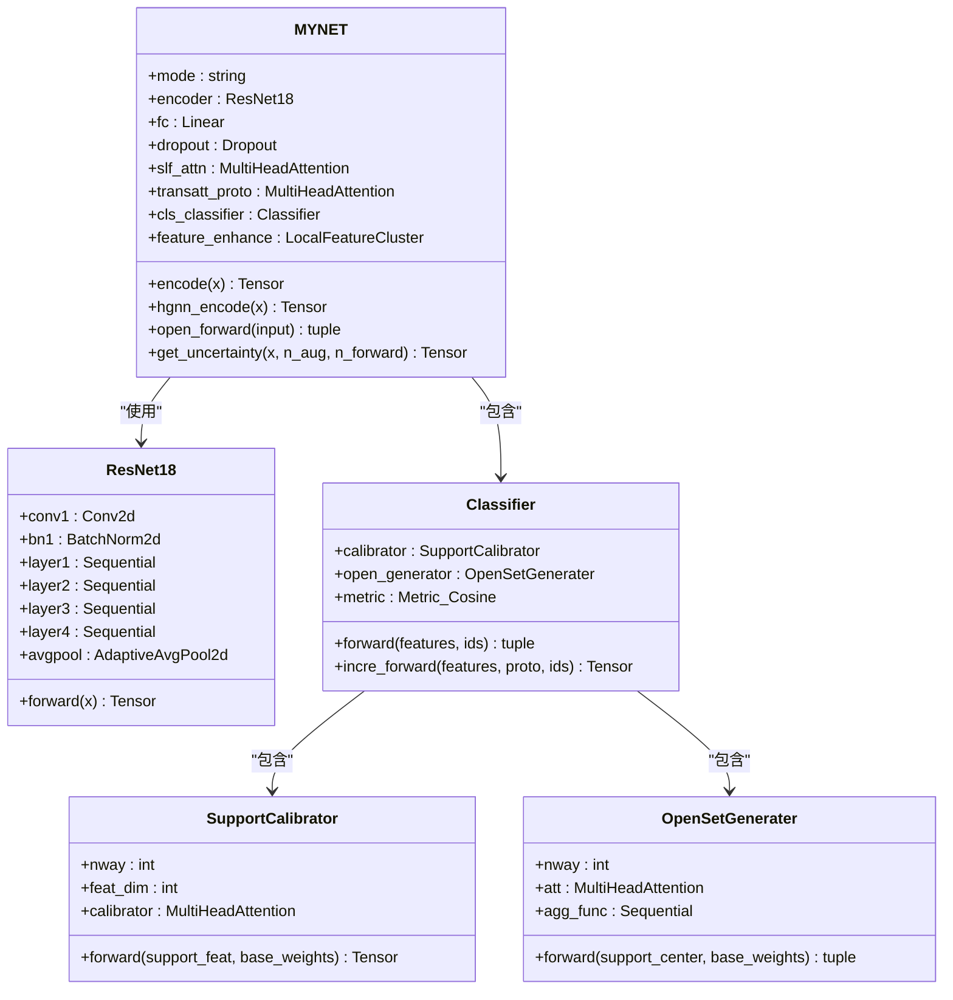

**图表来源**
- [network.py:18-724](file://network.py#L18-L724)
- [models/resnet18_encoder.py:240-471](file://models/resnet18_encoder.py#L240-L471)
- [models/AttnClassifier.py:38-369](file://models/AttnClassifier.py#L38-L369)

### 数据处理组件

数据处理系统提供了灵活的数据加载和采样机制：

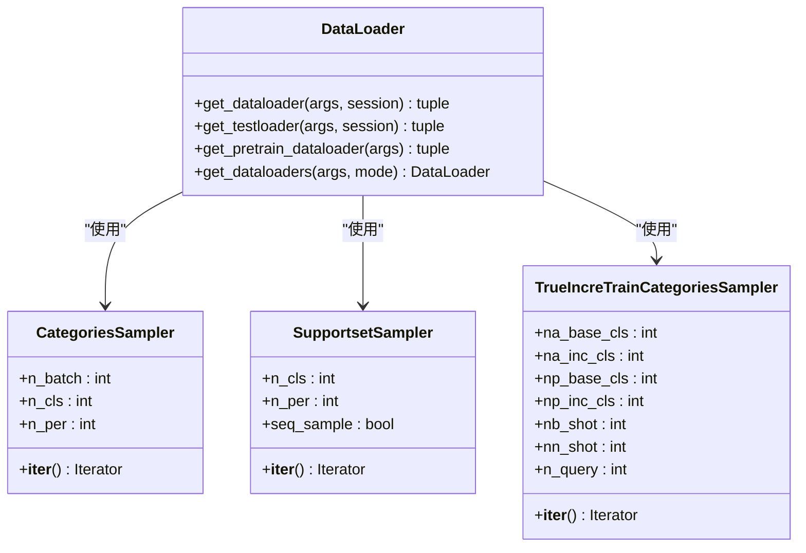

**图表来源**
- [data/dataloader.py:1-351](file://data/dataloader.py#L1-L351)
- [data/sampler.py:6-201](file://data/sampler.py#L6-L201)

**章节来源**
- [network.py:18-724](file://network.py#L18-L724)
- [models/resnet18_encoder.py:240-471](file://models/resnet18_encoder.py#L240-L471)
- [models/AttnClassifier.py:38-369](file://models/AttnClassifier.py#L38-L369)
- [data/dataloader.py:1-351](file://data/dataloader.py#L1-L351)
- [data/sampler.py:6-201](file://data/sampler.py#L6-L201)

## 架构概览

项目采用分层架构设计，从底层的音频特征提取到顶层的增量学习推理：

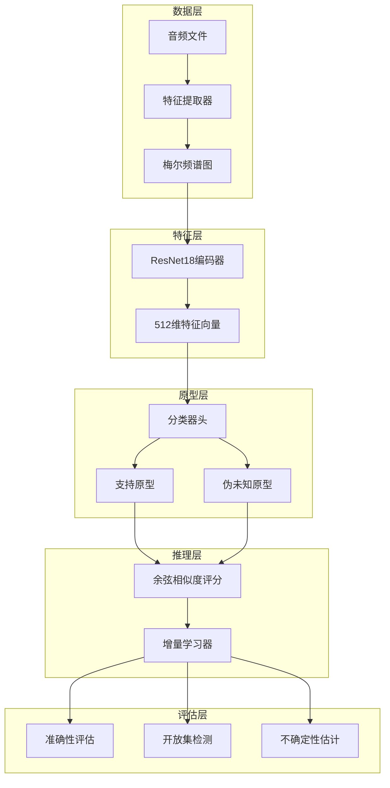

**图表来源**
- [network.py:471-518](file://network.py#L471-L518)
- [models/AttnClassifier.py:38-101](file://models/AttnClassifier.py#L38-L101)
- [models/base.py:27-254](file://models/base.py#L27-L254)

### 控制流架构

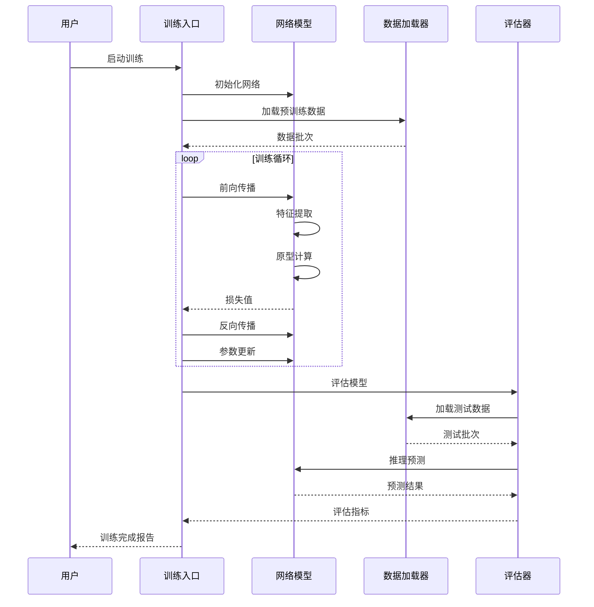

**图表来源**
- [train.py:799-1296](file://train.py#L799-L1296)
- [models/metatrainer.py:17-201](file://models/metatrainer.py#L17-L201)

**章节来源**
- [train.py:799-1296](file://train.py#L799-L1296)
- [models/metatrainer.py:17-201](file://models/metatrainer.py#L17-L201)

## 详细组件分析

### 训练框架组件

#### 基础训练器（Trainer）

基础训练器提供了完整的训练生命周期管理：

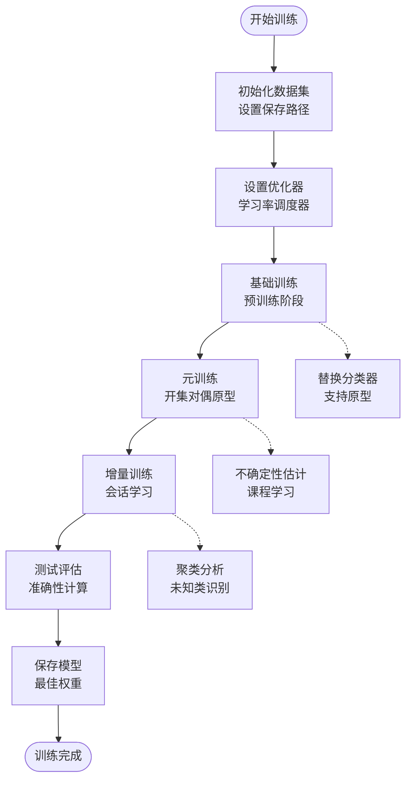

**图表来源**
- [models/base.py:27-254](file://models/base.py#L27-L254)

#### 元训练器（MetaTrainer）

元训练器专门处理开集对偶原型元训练：

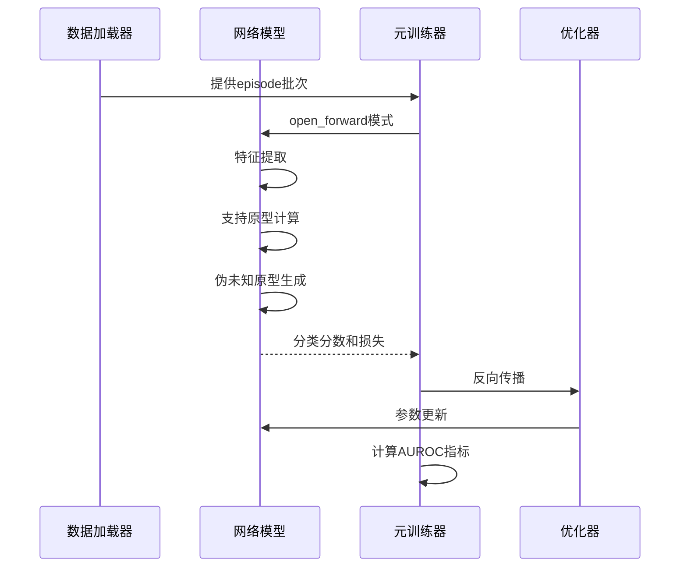

**图表来源**
- [models/metatrainer.py:87-178](file://models/metatrainer.py#L87-L178)

**章节来源**
- [models/base.py:27-254](file://models/base.py#L27-L254)
- [models/metatrainer.py:17-201](file://models/metatrainer.py#L17-L201)

### 数据处理组件

#### 数据加载器（DataLoader）

数据加载器支持多种数据集和采样策略：

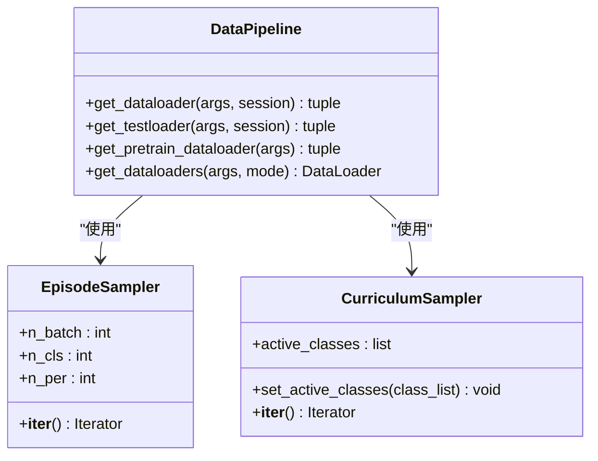

**图表来源**
- [data/dataloader.py:13-351](file://data/dataloader.py#L13-L351)
- [data/sampler.py:141-201](file://data/sampler.py#L141-L201)

#### 采样器策略

项目实现了多种采样策略以支持不同的训练场景：

| 采样器类型 | 用途 | 特点 |
|-----------|------|------|
| CategoriesSampler | 基础episode采样 | 随机选择类别和样本 |
| SupportsetSampler | 支持集采样 | 确保每类样本数量一致 |
| TrueIncreTrainCategoriesSampler | 增量训练采样 | 支持基础类和增量类混合 |

**章节来源**
- [data/dataloader.py:1-351](file://data/dataloader.py#L1-L351)
- [data/sampler.py:6-201](file://data/sampler.py#L6-L201)

### 基线方法组件

#### CIL基线方法

基线方法提供了增量学习的对比实现：

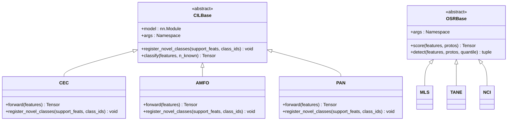

**图表来源**
- [models/baselines/base.py:11-76](file://models/baselines/base.py#L11-L76)

#### 开集识别基线

基线系统支持多种开集识别方法：

| 方法名称 | 算法原理 | 适用场景 |
|---------|---------|---------|
| OpenMax | 基于最大似然的开集检测 | 需要概率输出的场景 |
| PROSER | 基于原型的异常检测 | 异常样本识别 |
| ARPL | 自适应余弦距离学习 | 动态阈值开集检测 |

**章节来源**
- [models/baselines/base.py:1-76](file://models/baselines/base.py#L1-L76)
- [scripts/run_all_baselines.py:1-282](file://scripts/run_all_baselines.py#L1-L282)

### 特征增强组件

#### 局部特征聚类

特征增强模块实现了多层次的特征增强策略：

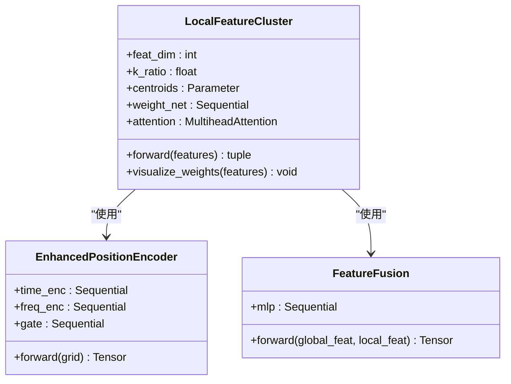

**图表来源**
- [enhance_module.py:70-160](file://enhance_module.py#L70-L160)
- [utils/utils.py:61-131](file://utils/utils.py#L61-L131)

**章节来源**
- [enhance_module.py:1-160](file://enhance_module.py#L1-L160)
- [utils/utils.py:61-131](file://utils/utils.py#L61-L131)

## 依赖分析

项目采用清晰的依赖关系设计，确保模块间的松耦合：

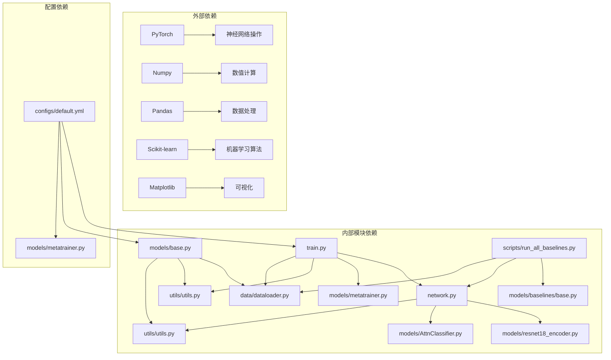

**图表来源**
- [train.py:1-800](file://train.py#L1-L800)
- [network.py:1-724](file://network.py#L1-L724)
- [models/base.py:1-254](file://models/base.py#L1-L254)
- [configs/default.yml:1-88](file://configs/default.yml#L1-L88)

### 模块间交互

项目中的关键交互模式包括：

1. **数据流交互**：数据加载器向训练器提供批次数据
2. **模型交互**：网络模型在不同模式下执行不同功能
3. **评估交互**：评估器从训练器获取模型状态
4. **配置交互**：配置文件驱动整个系统的运行参数

**章节来源**
- [train.py:1-800](file://train.py#L1-L800)
- [network.py:1-724](file://network.py#L1-L724)
- [models/base.py:1-254](file://models/base.py#L1-L254)
- [configs/default.yml:1-88](file://configs/default.yml#L1-L88)

## 性能考虑

### 训练效率优化

项目在多个层面实现了性能优化：

1. **内存管理**：使用`pin_memory=True`减少数据传输开销
2. **并行处理**：多进程数据加载，`num_workers=8`
3. **混合精度**：在支持的硬件上启用混合精度训练
4. **缓存策略**：预计算和缓存常用中间结果

### 推理速度优化

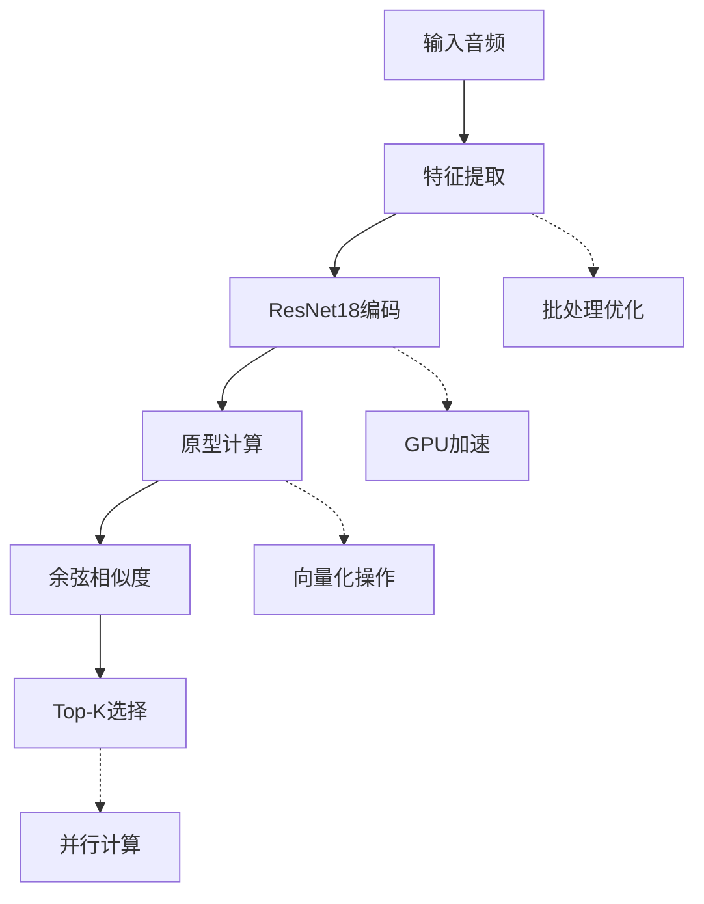

### 内存使用优化

- **特征缓存**：在增量阶段缓存支持集特征
- **模型参数**：冻结预训练层，仅训练新增参数
- **数据批处理**：合理设置batch size平衡内存和吞吐量

## 故障排除指南

### 常见问题诊断

#### 训练不收敛

**症状**：损失不下降或波动很大
**排查步骤**：
1. 检查学习率设置是否合适
2. 验证数据加载是否正常
3. 确认模型参数初始化正确
4. 检查梯度是否爆炸或消失

#### 内存不足

**症状**：训练过程中出现内存溢出
**解决方案**：
1. 减小batch size
2. 关闭不必要的日志记录
3. 使用更高效的采样策略
4. 检查是否有内存泄漏

#### 数据加载问题

**症状**：数据加载缓慢或中断
**排查步骤**：
1. 检查数据路径配置
2. 验证数据格式正确性
3. 确认文件权限设置
4. 检查磁盘空间

**章节来源**
- [utils/utils.py:368-381](file://utils/utils.py#L368-L381)
- [data/dataloader.py:1-351](file://data/dataloader.py#L1-L351)

## 结论

VAZE项目展现了现代音频持续学习系统的完整实现，具有以下特点：

1. **模块化设计**：清晰的组件分离和接口定义
2. **可扩展性**：支持新的数据集、模型和评估指标
3. **实验完整性**：提供完整的基线对比和消融分析
4. **性能优化**：在保证准确性的同时注重训练效率

项目的核心创新在于"开集对偶原型元训练"方法，结合不确定性估计和课程学习策略，在开放世界持续学习场景中取得了显著的性能提升。

## 附录

### 代码导航指南

#### 快速定位功能

- **训练入口**：`train.py` - 主训练流程
- **网络定义**：`network.py` - 网络架构实现
- **数据加载**：`data/dataloader.py` - 数据处理管道
- **模型组件**：`models/` - 模型相关代码
- **工具函数**：`utils/utils.py` - 通用工具函数
- **配置文件**：`configs/default.yml` - 实验配置

#### 扩展开发指南

1. **添加新数据集**：在`data/`目录下添加数据集实现
2. **实现新模型**：在`models/`目录下添加模型组件
3. **添加评估指标**：在`utils/`目录下扩展评估函数
4. **配置新实验**：在`configs/`目录下添加配置文件

### 插件系统说明

项目支持灵活的插件扩展机制：

1. **数据集插件**：通过继承`Dataset`基类实现新数据集
2. **模型插件**：通过实现`nn.Module`接口添加新模型
3. **评估插件**：通过注册评估函数扩展评估指标
4. **采样器插件**：通过实现`Sampler`接口添加新采样策略

这种设计使得项目能够轻松集成新的研究想法和技术改进。